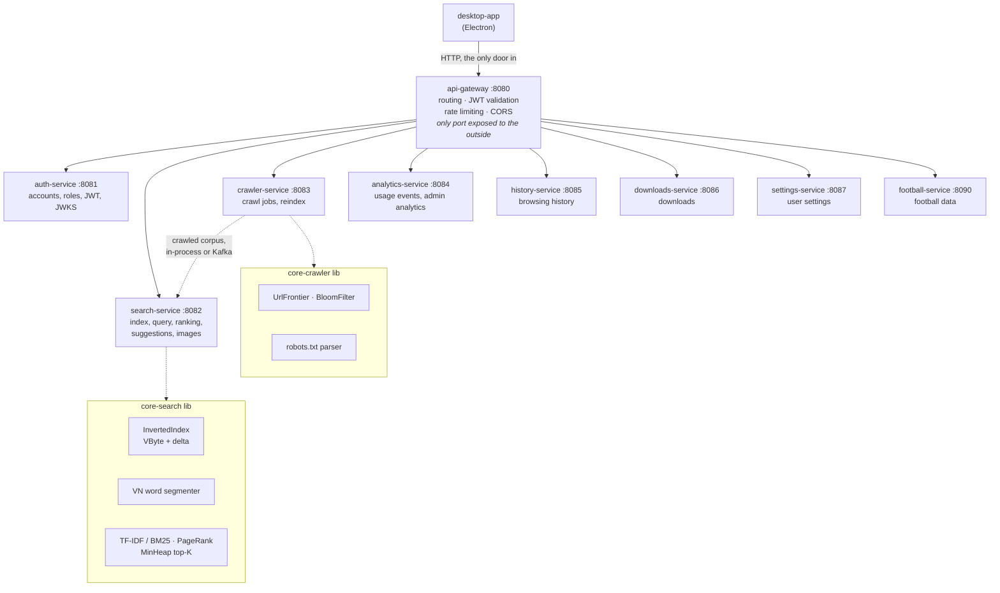

# Browser app like CocCoc and Vietnamese search engine

A Vietnamese search engine built from scratch — crawler, inverted index, ranking,
and a mini browser to query it. The backend is nine services behind one gateway.

Every core data structure and algorithm is **hand-written**, with no off-the-shelf
search library: inverted index, VByte compression, PageRank, Trie, Bloom filter,
MinHeap, and a Vietnamese word segmenter.



The algorithms above live in `backend/libs/` — `core-search` (index, query,
ranking), `core-crawler` (fetching, frontier, event bus) and `core-common`
(data structures, analytics); the services below are thin shells around them.
That split is visible in the line counts: `crawler-service` is 393 lines of
HTTP plumbing over 8,491 lines of crawler library. **`api-gateway` is the only port exposed to the outside** —
the others are reachable only from inside the Compose network.

| Service | Port | Language | Profile | What it owns |
|---|---:|---|---|---|
| `api-gateway` | 8080 | Java | default | Routing table, JWT validation, rate limiting, CORS |
| `auth-service` | 8081 | Java | default | Accounts, roles, JWT issuing, JWKS |
| `search-service` | 8082 | Java | default | Index, query, ranking, suggestions, images |
| `crawler-service` | 8083 | Java | default | Crawl jobs, reindex |
| `analytics-service` | 8084 | Java | default | Usage events, admin analytics |
| `history-service` | 8085 | Go | default | Browsing history (`backend/go`) |
| `downloads-service` | 8086 | Go | default | Downloads (`backend/go`) |
| `settings-service` | 8087 | Go | default | User settings (`backend/go`) |
| `football-service` | 8090 | Go | default | Football data, its own 100-calls/day budget (`backend/go`) |

---

## Quick start — Docker

Requires Docker Desktop.

```bash
# 1. Create your config file from the template
cp .env.example .env

# 2. Generate an admin key and paste it into .env
openssl rand -hex 32
#   PowerShell: -join ((1..64) | % { '{0:x}' -f (Get-Random -Max 16) })

# 3. Run
docker compose up -d --build
```

Everything is reached through `http://localhost:8080`. First boot takes a few
tens of seconds while `search-service` builds the index — follow it with
`docker compose logs -f search-service`.

```bash
curl "http://localhost:8080/api/health"
curl "http://localhost:8080/api/search?q=máy+tính&size=3"
```

> **If `docker compose up` stops immediately with "Thieu ADMIN_API_KEY"** — that
> is deliberate, not a bug. Step 2 above has not been done.
> See [Why the admin key is mandatory](#why-the-admin-key-is-mandatory).

### One command, one optional profile

There used to be three opt-in profiles (`full`, `observability`). They are gone:
one `up` brings the whole system, monitoring included, so there is no flag to
remember. Only Kafka stays behind a profile, because the default event bus is
in-process `memory` — the crawl pipeline works end to end without a broker.

```bash
# everything: 9 services + Postgres/Redis/Mongo + Prometheus/Grafana/Alertmanager
docker compose up -d --build                    # ~7.3 GB of limits, ~4 GB in use

# + Kafka, kafka-ui and kafka-exporter
docker compose --profile kafka up -d --build    # ~+1.3 GB
```

`mem_limit` is a ceiling, not a reservation — the totals above are what the
Compose file allows, not what the machine hands out.

| Address | What you get |
|---|---|
| <http://localhost:8080> | api-gateway — the only door into the backend |
| <http://localhost:8080/swagger-ui.html> | OpenAPI, aggregated from every service |
| <http://localhost:8091> | kafka-ui — topics, partitions, consumer lag, dead-letter messages (`--profile kafka`) |
| <http://localhost:3000> | Grafana (`admin`/`admin`), dashboard pre-provisioned |
| <http://localhost:9090/alerts> | Prometheus — the 7 alert rules and their state |
| <http://localhost:9093> | Alertmanager |

Details: [`docs/DEVOPS.md`](docs/DEVOPS.md).

---

## Running without Docker

Requires JDK 17+ and Node.js 22+.

### Backend

```bash
run-backend.bat             # Windows — gateway + auth + search, in the background
run-backend.bat --full      # all nine Java services
run-backend.bat --build     # rebuild the jars first
run-backend.bat --windows   # one console window per service instead of background
run-backend.bat --docker    # hand over to docker compose instead

# or, by hand:
export ADMIN_API_KEY=$(openssl rand -hex 32)          # Linux/macOS
$env:ADMIN_API_KEY = "..."                             # PowerShell
cd backend
./mvnw -B clean package -DskipTests
java -jar services/auth-service/target/auth-service-0.0.1-SNAPSHOT.jar
java -jar services/search-service/target/search-service-0.0.1-SNAPSHOT.jar
java -jar services/api-gateway/target/api-gateway-0.0.1-SNAPSHOT.jar
```

Run the jars **from the `backend` directory** — the data paths
(`data/index.json`, `data/crawled-documents.json`) are relative to it. And
outside Docker the services cannot resolve each other by container name, so
point them at localhost: `AUTH_SERVICE_URL`, `SEARCH_SERVICE_URL`,
`AUTH_ISSUER_URI`, `AUTH_JWKS_URI`, `REDIS_HOST`. `run-backend.bat` sets all of
those for you.

`run-backend.bat` reads `ADMIN_API_KEY` and `BOOTSTRAP_ADMIN_PASSWORD` from
`.env` (generating and saving them if absent), checks that ports 8080–8087 and
8090 are free, builds any missing jar, starts each service **in the background**
with its log in `backend\logs\<service>.log`, and waits for the gateway to
answer. Pass `--windows` for the old one-console-per-service behaviour.

> **The jar path does not build infrastructure.** It needs PostgreSQL, Redis and
> MongoDB already running. Without them `auth`, `crawler`, `history`,
> `downloads`, `settings` and `football` die at startup on `UnknownHostException`
> — and because they run in the background, the only symptom you see is "nothing
> answers on 8085–8090". Start them first:
>
> ```bash
> docker compose up -d postgres redis mongo
> ```
>
> Or use `run-backend.bat --docker`, which brings everything up itself.

`end-backend.bat` stops the jars, takes the Compose stack down, **and quits
Docker Desktop**. Use `--local` to touch only the jars, or `--keep-docker` to
leave Docker Desktop running.

### Frontend

```bash
run-frontend.bat            # Windows
# or: cd desktop-app && npm install && npm run dev
```

### Crawling your own corpus

Four positional arguments: pages, depth, output file, then `--fresh`.

```bash
run-crawl.bat                                 # 10,000 pages, depth 4, default corpus
run-crawl.bat 5000 3                          # 5,000 pages, depth 3
run-crawl.bat 500 2 data/try.json --fresh     # wipe and restart; asks you to type XOA
```

Without `--fresh` a run **resumes** an existing corpus instead of refetching
pages it already has.

A new corpus does not reach the search engine on its own — restart the backend,
or reindex. Call `crawler-service` **directly**: `/api/admin/**` through the
Gateway requires a JWT with the `ADMIN` role and will not accept `X-API-Key`.

```bash
curl -X POST -H "X-API-Key: $ADMIN_API_KEY" http://localhost:8083/api/admin/reindex
```

`crawl-stats.bat` reports what a corpus contains — pages, links, images, size.
Its flags are PowerShell-style (one dash):

```bash
crawl-stats.bat                     # every corpus in backend\data
crawl-stats.bat data/try.json       # just one
crawl-stats.bat -NoLinks -NoImages  # skip the slow counts
```

---

## Deploying a built image

There is no Kubernetes manifest in this repository — the deployment target is
Docker Compose, and `cd.yml` is built around that. After CI goes green on
`main`, CD builds and signs one image per service, scans each for CRITICAL
CVEs, and publishes `docker-compose.release.yml`: an overlay that pins every
service to an image **digest** rather than a tag.

```bash
# download the docker-compose-release artifact next to docker-compose.yml
docker compose -f docker-compose.yml -f docker-compose.release.yml up -d
```

A tag is a movable pointer; two machines pulling it at different times can run
different code under the same name. A digest is the hash of the image content,
so pinning it pins exactly what was scanned and signed.

---

## API

Around 60 mappings across the nine services. The table below covers search,
accounts and administration; the middle column is the *role* required, not the
mechanism. The personal-data services follow the same shape and are all
sign-in-only — `/api/history/**`, `/api/downloads/**`, `/api/settings/**`, each
scoped to the caller so one account can never read another's rows. Football is
public and read-only under `/api/football/**`, which the Gateway rewrites onto
the service's own `/api/v1/**`. The complete list is in Swagger UI.

| Endpoint | Access | Description |
|---|:---:|---|
| `GET /api/search?q=&page=&size=` | — | Search |
| `GET /api/suggest?prefix=&limit=` | — | Prefix suggestions (Trie). Note: `prefix`, **not** `q` |
| `GET /api/images?q=&page=&size=` | — | Image search, backed by `ImageStore` |
| `GET /api/feed?seed=&page=&size=` | — | Browse the index without a query. Same `seed` ⇒ same order, so pages join up |
| `GET /api/health` | — | Liveness. Returns `503` when the index is empty |
| `GET /actuator/prometheus` | — | Prometheus metrics |
| `POST /api/events` | — | Write side of usage analytics — deliberately open |
| `POST /api/auth/register` | — | Always creates a `USER`; there is no way to self-assign `ADMIN` |
| `POST /api/auth/login` | — | Returns an OAuth2 token pair — a short-lived access token plus a refresh token |
| `POST /api/auth/logout` | — | Revokes the token immediately; open so an *expired* token can still log out |
| `GET /api/auth/me` | 🔑 | Who am I |
| `POST /api/auth/password` | 🔑 | Requires the current password even with a valid token |
| `POST /api/auth/logout-all` | 🔑 | Revokes every session of this account |
| `POST /api/admin/crawl` | 👑 | Start a crawl job |
| `GET /api/admin/crawl/{id}/status` | 👑 | Crawl job status |
| `POST /api/admin/reindex` | 👑 | Rebuild the index |
| `GET /api/admin/stats` | 👑 | Detailed statistics |
| `GET /api/admin/analytics` | 👑 | One JSON with traffic, crawl, index and account figures |
| `POST /api/admin/analytics/reset` | 👑 | Clears traffic figures only — never touches the index |
| `GET /api/admin/users` | 👑 | Never includes password hashes |
| `POST /api/admin/users/{name}/role` | 👑 | Also closes every session of that user |
| `POST /api/admin/users/{name}/disable` · `/enable` | 👑 | Keeps the data, blocks login |
| `DELETE /api/admin/users/{name}` | 👑 | `400` if you try to delete yourself |

🔑 = signed in · 👑 = `ADMIN`

**Two ways to authenticate, one authorisation table.** Tools use a static
`X-API-Key` (no identity, never expires, always full `ADMIN`); people sign in
and get `Authorization: Bearer` (identity, short expiry, revocable instantly,
renewable with a refresh token). Both feed the *same* role check in
`ServiceSecurityConfig`.

The two are **not** interchangeable at every door. The Gateway requires a JWT
carrying the `ADMIN` role for `/api/admin/**` and does not accept `X-API-Key`
there; the key works when you call a service directly, which is what the
reindex example above does on port 8083.

```bash
curl -H "Authorization: Bearer $TOKEN" http://localhost:8080/api/admin/stats
curl -H "X-API-Key: $ADMIN_API_KEY"    http://localhost:8083/api/admin/reindex
```

The first admin account is created at boot from `BOOTSTRAP_ADMIN_PASSWORD` —
there is no default password, on purpose. See
[`docs/CONFIGURATION.md`](docs/CONFIGURATION.md) §3b.

Full examples: [`docs/api-examples.http`](docs/api-examples.http)

---

## Why the admin key is mandatory

`POST /api/admin/crawl` makes the server **fetch a URL chosen by the caller**
and put the contents into an index that `GET /api/search` reads publicly. Leaving
it open is a complete SSRF vulnerability with an exfiltration channel attached —
on a cloud VM, a request to `169.254.169.254` returns temporary IAM credentials.

So the app **deliberately refuses to start** without a key. The alternative —
generating a key and printing it to the log — produces a system that *looks*
healthy while nobody knows the key. Fail loudly rather than fail silently.

Four independent layers, each blocking something different:

| Layer | Blocks | Implemented in |
|---|---|---|
| API key (constant-time comparison) | Strangers | `ApiKeyAuthFilter` |
| Private IP ranges blocked **after DNS resolution**, on every fetch and every redirect hop | URLs pointing into the internal network, even with a valid key | `SeedUrlValidator` + `HtmlDownloader` |
| Caps on `maxPages` / `maxDepth` | A single valid request exhausting resources | `AdminController` |
| Rate limiting (token bucket) | Correct calls arriving too fast | `RateLimitFilter` |

---

## Development

```bash
cd backend     && ./mvnw clean verify   # tests + coverage gate + static analysis
cd desktop-app && npm run typecheck && npm run lint && npm test   # 155 tests
```

`clean verify` runs the whole reactor. To work on one service only, add `-pl`:
`./mvnw -pl services/search-service -am verify`.

`verify` (not `test`) is what CI runs — it is the only phase that executes the
coverage and static-analysis gates.

### CI/CD

Five workflows, all in [`.github/workflows/`](.github/workflows/):

| Workflow | Trigger | What it does |
|---|---|---|
| `ci.yml` | push to `main`, every PR | Seven jobs in parallel: backend tests + JaCoCo gate, SpotBugs, frontend typecheck/lint/**Vitest**, Docker build + Trivy scan, **Kafka integration tests**, **database integration tests** (a matrix, one job per service), **infrastructure validation** |
| `cd.yml` | after CI passes on `main`; manual | Build, cosign-sign and CVE-scan one image per service, then publish `docker-compose.release.yml` pinned to image digests |
| `codeql.yml` | push, PR, weekly | CodeQL SAST for Java and TypeScript |
| `release.yml` | tag `v*.*.*` | Multi-arch image to GHCR with SBOM + provenance, cosign keyless signature, blocking CRITICAL CVE scan, GitHub Release |
| `pr-title.yml` | PR opened/edited | Enforces Conventional Commits in the PR title |

The `infrastructure` job validates what YAML normally only reveals at deploy
time: `promtool check config` (a bad PromQL expression makes Prometheus refuse
to load the **entire** rule file — losing every alert, silently),
`amtool check-config`, `docker compose config` with and without the Kafka
profile, and a cross-check that the service matrices in `cd.yml` and
`release.yml` still match the services that actually have a `build:` block in
`docker-compose.yml`. Add a service to Compose and forget the matrices, and
both workflows stay green while that service simply never gets an image.

Four quality gates block a merge, each catching a different kind of breakage:

```
661 tests           → per-unit logic errors
JaCoCo coverage     → new code with no tests          (line ≥ 68%, branch ≥ 65%)
SpotBugs            → bugs no test path reaches       (0 findings)
Ranking quality     → search got worse, tests stayed green
```

The first three are split across two parallel jobs — `backend-test` runs the
suite and the coverage gate, `backend-static` runs SpotBugs — so a pull request
waits for the slower branch, not for the sum of both, and a red job name says
which kind of breakage it is.

The frontend has three gates of its own — `typecheck`, `lint` and **155 Vitest
cases**. The last one is the only one that checks *behaviour*: it pins down the
main-process navigation policy, which is a security boundary (`file://` and
`javascript:` must be refused — see `src/main/urlPolicy.ts`).

The last one is search-specific: the other three can all be green while results
returned to users have degraded. See `RankingQualityTest`.

Dependency updates are automated via [`dependabot.yml`](.github/dependabot.yml)
for Maven, npm, and GitHub Actions.

### Configuration

Every environment variable is documented in [`.env.example`](.env.example). Only
`ADMIN_API_KEY` is required; everything else has a sensible default.

Switch the scoring model to BM25 (higher MRR — see
[`docs/EVALUATION.md`](docs/EVALUATION.md)):

```bash
APP_RANKING_SCORER=bm25
```

---


## Repository layout

```
backend/                       Maven reactor — one parent pom, fourteen modules
  libs/core-common/            Shared foundations, used by the other libraries:
    datastructure/             Trie, BloomFilter, MinHeap, LRUCache, SparseMatrix
    analytics/                 Corpus statistics, usage counters
  libs/core-crawler/           Fetching, URL filtering, two-tier frontier, event bus.
                               The command-line runners live here, which is why the
                               scripts call `./mvnw -pl libs/core-crawler -am exec:java`
                               (`-am` matters: without it Maven cannot resolve
                               core-common and the run fails before it starts)
  libs/core-search/
    index/                     Inverted index, VByte compression, VN segmenter
    query/                     Query parsing, posting-list merging
    ranking/                   TF-IDF, BM25, PageRank, snippet generation
    eval/                      Search quality harness
  libs/platform/               Shared Spring plumbing: security chain, API-key filter,
                               rate limiting, common properties
  services/api-gateway/        :8080  routing, JWT validation, CORS
  services/auth-service/       :8081  accounts, roles, JWT issuing
  services/search-service/     :8082  index, query, ranking, images
  services/crawler-service/    :8083  crawl jobs, reindex
  services/analytics-service/  :8084  usage events
  coverage/                    Aggregates JaCoCo across every module — must build last
  go/                          Go services (chi + pgx / mongo-driver). One module, shared platform/
    platform/                  JWT (JWKS RS256), security headers, CORS, token-bucket rate limit, PG + migrate
    services/history/          :8085  browsing + search history (MongoDB, TTL indexes)
    services/downloads/        :8086  download ledger (Postgres, state machine)
    services/settings/         :8087  user settings (Postgres + JSONB, If-Match)
    services/football/         :8090  football data — cache-aside, daily call budget
  data/                        Corpus, index, images, accounts (mounted into containers)
desktop-app/                   Mini browser (Electron + React + TypeScript)
  src/renderer/src/components/football/
                               Full-screen football page, ported from the iOS app
deploy/
  monitoring/                  Prometheus config, alert rules, Alertmanager, Grafana
  postgres/                    init-db.sh — one database per service, created on first boot
docs/                          Documentation
.github/workflows/             CI, CodeQL, release, PR title checks
```

The Vietnamese dictionary is generated from
[`coccoc-tokenizer`](https://github.com/coccoc/coccoc-tokenizer) (LGPL-3.0),
which is **not** vendored here — clone it separately if you need to regenerate
`vietnamese-words.txt`. See `docs/DSA-REPORT.md` §2.8.
