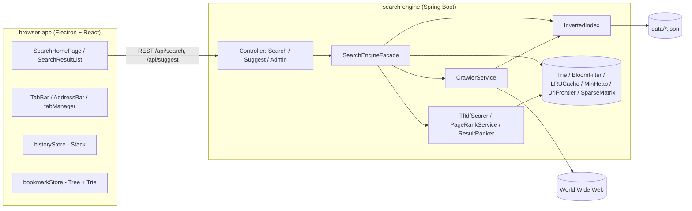
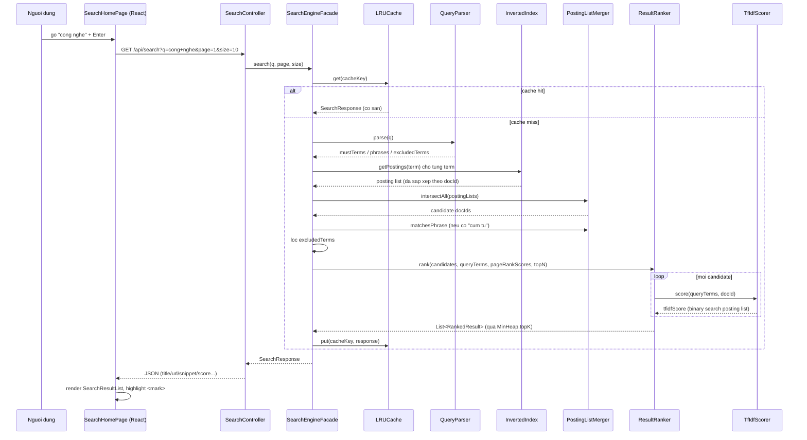

# Kien truc he thong (ARCHITECTURE)

## Tong quan thanh phan

## So do tuan tu: mot request tim kiem day du

## Luong xu ly chinh

1. **Crawl**: `CrawlerService` duyet BFS qua `UrlFrontier` (uu tien theo do
   sau/backlink/.vn), dedupe URL bang `BloomFilter`, ton trong
   `robots.txt` (`RobotsTxtParser`), trich xuat noi dung bang
   `HtmlExtractor` -> `WebDocument`. Ket qua duoc luu ra
   `data/crawled-documents.json`.
2. **Index**: `VietnameseTokenizer` chuan hoa + tach tu (longest-matching
   tu ghep, loai stopword, sinh ban khong dau) -> `InvertedIndex` (HashMap
   term -> posting list LUON sap xep theo docId) -> co the persist ra
   `data/index.json` qua `IndexPersistence`.
3. **Query**: `QueryParser` phan tich cau truy van (AND ngam dinh, "cum
   tu", -loai tru) bang CHINH `VietnameseTokenizer` de dam bao term khop
   voi index -> `PostingListMerger` giao/hop cac posting list (two-pointer,
   sap xep shortest-first) + kiem tra vi tri lien tiep cho phrase search
   -> danh sach candidate docId.
4. **Rank**: `TfIdfScorer` (cosine, binary search tren posting list) +
   `PageRankService` (power iteration tren `SparseMatrix`, tinh 1 lan sau
   moi lan crawl/reindex, cache trong bo nho) -> `ResultRanker` ket hop
   diem theo trong so alpha/beta/gamma, lay top-K bang `MinHeap.topK`,
   sinh snippet bang sliding window + highlight `<mark>`.
5. **Serve**: `SearchEngineFacade` la lop dieu phoi trung tam, cache toan
   bo `SearchResponse` trong `LRUCache` (key = query+page+size).
   `SearchController`/`SuggestController`/`AdminController` chi la lop
   mong goi xuong facade, khop dung hop dong REST da dinh nghia san.
6. **Browser UI**: `SearchHomePage` goi `/api/suggest` (debounce 200ms,
   Trie backend) hien `AutocompleteDropdown` (dieu huong bang phim mui
   ten); Enter chuyen sang `SearchResultList` (goi `/api/search`, phan
   trang, che do debug hien tfidfScore/pageRankScore). `historyStore`
   quan ly back/forward bang 2 `Stack` tu cai (doc lap voi lich su native
   cua Electron WebContents). `bookmarkStore` luu bookmark dang cay thu
   muc, tim kiem bang `BookmarkTrie` (TypeScript, song song voi
   `Trie.java` o backend).

## Cac quyet dinh thiet ke dang chu y

- **Vi sao facade rieng (`SearchEngineFacade`) thay vi logic thang trong
  controller**: controller chi lam nhiem vu HTTP (parse tham so, tra ve
  status code), toan bo logic dieu phoi cac phase (parse query, giao
  posting list, rank, cache) nam trong 1 noi de de test doc lap voi tang
  web (xem `SearchEngineFacadeApiTest`).
- **Vi sao dual-index co dau/khong dau**: nguoi dung Viet thuong go khong
  dau tren ban phim quoc te; luu ca 2 dang lam khoa trong CUNG mot
  HashMap tranh phai xay dung/dong bo 2 cau truc rieng biet.
- **Vi sao chrome view rieng biet voi tab view (Electron)**: TabBar/AddressBar
  phai LUON hien thi du tab dang o trang home hay dang tai mot URL ngoai —
  tach thanh 1 "chrome view" co dinh + cac "tab view" chong len phia duoi
  giai quyet dung yeu cau nay ma khong can ve lai UI moi lan chuyen tab.
- **Vi sao historyStore (Stack tu cai) doc lap voi lich su native cua
  Electron**: de an trong DSA — chung minh hieu ro co che LIFO thay vi
  dua vao `webContents.canGoBack()/goBack()` co san.
- **Han che da biet**: xem `docs/DSA-REPORT.md` (vi du: `-tu` chi loai
  tru 1 tieng, khong tu dong loai tru ca cum tu ghep).
