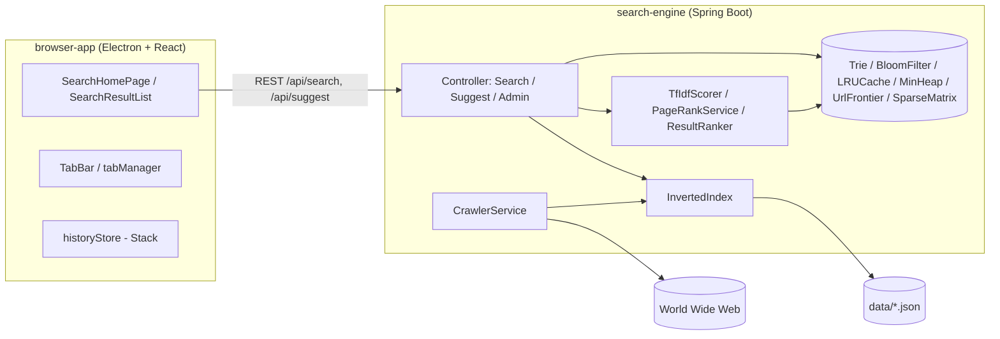

# Kien truc he thong (ARCHITECTURE)

> Trang thai: khung tai lieu tao o PHASE 1. Se hoan thien noi dung day du
> (so do luong du lieu chi tiet, quyet dinh thiet ke) o PHASE 10.

## Tong quan thanh phan

## Luong xu ly chinh (se mo ta chi tiet o PHASE 10)

1. **Crawl**: `CrawlerService` duyet BFS qua `UrlFrontier`, dedupe URL bang
   `BloomFilter`, ton trong `robots.txt`, trich xuat noi dung bang
   `HtmlExtractor` -> `WebDocument`.
2. **Index**: `VietnameseTokenizer` tach tu -> `InvertedIndex` (HashMap term
   -> posting list sap xep theo docId) -> persist ra `data/*.json`.
3. **Query**: `QueryParser` phan tich cau truy van -> `PostingListMerger`
   giao/hop cac posting list (two-pointer) -> danh sach ung vien.
4. **Rank**: `TfIdfScorer` + `PageRankService` (power iteration tren
   `SparseMatrix`) -> `ResultRanker` ket hop diem, lay top-K bang `MinHeap`.
5. **Serve**: `SearchController` tra `SearchResponse` (JSON) cho
   `browser-app`, co cache o `LRUCache`.
6. **Browser UI**: `SearchHomePage` goi `/api/suggest` (debounce 200ms) va
   `/api/search`; `historyStore` quan ly back/forward bang 2 Stack tu cai.

## TODO PHASE 10

- [ ] Ve lai so do tuan tu (sequence diagram) cho 1 request tim kiem day du.
- [ ] Ghi chu quyet dinh thiet ke (vi du: vi sao Bloom Filter thay HashSet,
      vi sao CSR cho SparseMatrix).
- [ ] Do hieu nang thuc te (thoi gian query trung binh, cache hit rate).
