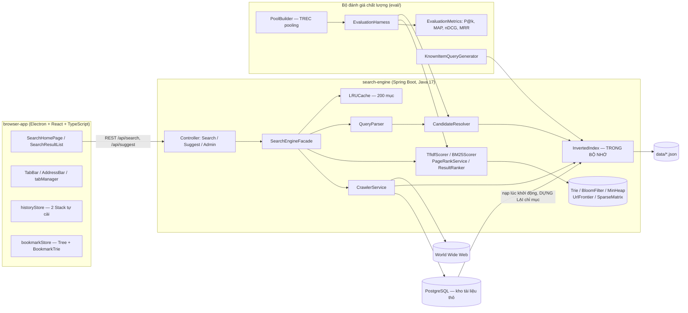
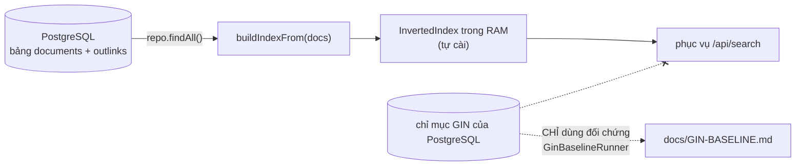
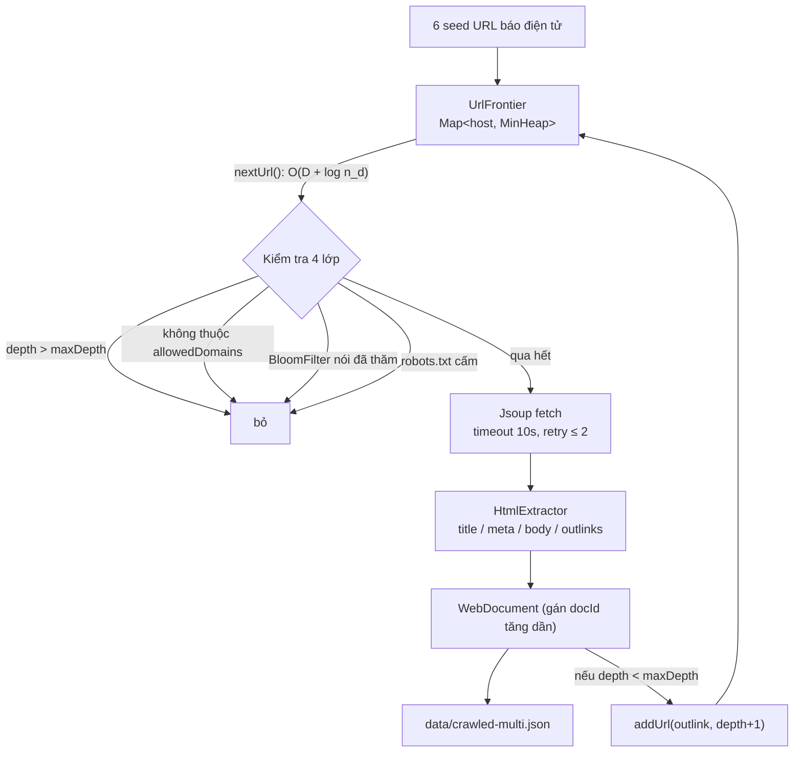
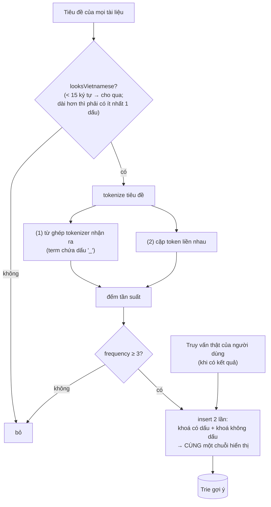
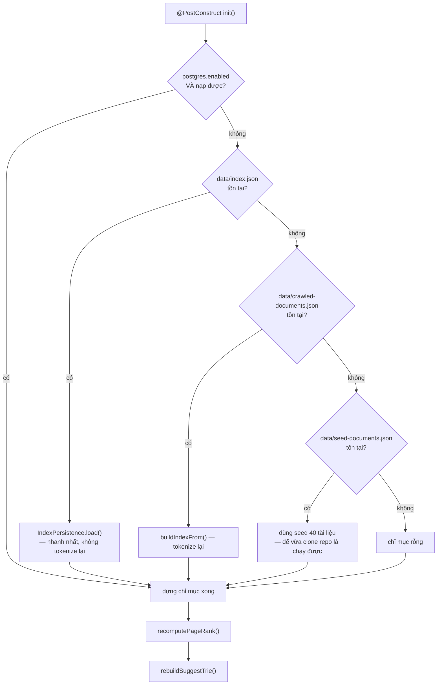

# Kiến trúc hệ thống VnSearch

> **Tài liệu này dành cho ai?** Người đã đọc `SEARCH-ENGINE-101.md` (hiểu
> *tại sao* cần chỉ mục đảo, TF-IDF, PageRank) và giờ muốn biết *các mảnh
> đó được ghép lại thành một sản phẩm chạy được như thế nào*.
>
> Cách đọc: mục 1–2 cho bức tranh tổng thể, mục 3 đi theo đúng đường đi của
> một request tìm kiếm, mục 4 giải thích từng quyết định thiết kế và **lý do
> phản biện** cho nó, mục 5 là những giới hạn đã biết.

## Mục lục

1. [Ba tầng của hệ thống](#1-ba-tầng-của-hệ-thống)
2. [Sơ đồ thành phần](#2-sơ-đồ-thành-phần)
3. [Bốn luồng xử lý chính](#3-bốn-luồng-xử-lý-chính)
4. [Các quyết định thiết kế và lý do](#4-các-quyết-định-thiết-kế-và-lý-do)
5. [Bản đồ mã nguồn](#5-bản-đồ-mã-nguồn)
6. [Hạn chế kiến trúc đã biết](#6-hạn-chế-kiến-trúc-đã-biết)

---

## 1. Ba tầng của hệ thống

Đọc từ dưới lên, vì tầng dưới không biết gì về tầng trên — đó chính là điều
làm kiến trúc này kiểm thử được:

| Tầng | Ở đâu | Biết gì | KHÔNG biết gì |
|---|---|---|---|
| **Tầng cấu trúc dữ liệu** | `datastructure/`, `index/`, `query/`, `ranking/` | Thuật toán thuần: Trie, MinHeap, BM25, PageRank… | Không biết HTTP, không biết Spring, không biết có trình duyệt |
| **Tầng điều phối** | `service/SearchEngineFacade.java` | Thứ tự gọi các phase, cache, vòng đời chỉ mục | Không biết mã trạng thái HTTP, không biết React |
| **Tầng vỏ ngoài** | `controller/`, `browser-app/` | HTTP, JSON, UI | Không biết bên trong posting list là gì |

Nguyên tắc kèm theo: **mọi lớp ở tầng cấu trúc dữ liệu đều có một hàm
`main()` demo nhỏ, chạy độc lập được** mà không cần khởi động Spring, không
cần mạng, không cần cơ sở dữ liệu. Ví dụ:

```bash
cd search-engine
./mvnw.cmd -q compile exec:java -Dexec.mainClass=com.vnsearch.datastructure.MinHeap
./mvnw.cmd -q compile exec:java -Dexec.mainClass=com.vnsearch.index.VietnameseTokenizer
./mvnw.cmd -q compile exec:java -Dexec.mainClass=com.vnsearch.ranking.PageRankService
```

Đây không phải chi tiết vụn vặt: nếu một cấu trúc dữ liệu chỉ chạy được khi
cả hệ thống đã lên, thì nó đã bị trộn lẫn với hạ tầng và không còn là một
cấu trúc dữ liệu độc lập nữa.

---

## 2. Sơ đồ thành phần



### Hai lưu ý kiến trúc quan trọng nhất

**Thứ nhất: bộ đánh giá dùng lại đúng code path của sản phẩm.**

`EvaluationHarness` gọi **chính** `QueryParser`, `CandidateResolver` và
`ResultRanker` mà tầng REST đang dùng — không có bản sao nào. Mỗi thí nghiệm
chỉ thay **đúng một** biến số (mô hình tính điểm, hoặc bộ trọng số
α/β/γ). Trích từ `eval/EvaluationHarness.java`:

```java
public List<String> search(String queryText, RankingConfig config, int topN) {
    QueryParser.ParsedQuery parsed = queryParser.parse(queryText);
    CandidateResolver.ResolvedQuery resolved = CandidateResolver.resolve(index, parsed);
    if (resolved.candidateDocIds().isEmpty()) {
        return List.of();
    }
    ResultRanker ranker = new ResultRanker(config.alpha(), config.beta(), config.gamma());
    ...
}
```

Vì sao điều này quan trọng đến mức phải viết ra: **nếu bộ đánh giá có đường
đi riêng thì mọi con số trong báo cáo chỉ nói về đường đi đó, chứ không nói
gì về sản phẩm thật.** Đây cũng chính là lý do `CandidateResolver` tồn tại
như một lớp riêng — trước đây logic này là một phương thức `private` bên
trong `SearchEngineFacade`, nên bộ đánh giá không gọi lại được và buộc phải
viết một bản sao. Hai bản sao chắc chắn sẽ trôi lệch theo thời gian.

**Thứ hai: PostgreSQL chỉ là kho lưu trữ, không phải máy tìm kiếm.**



Khi khởi động, hệ thống **đọc tài liệu thô** từ PostgreSQL rồi **dựng lại**
chỉ mục đảo trong bộ nhớ. Chỉ mục GIN của PostgreSQL có tồn tại trong lược
đồ (`db/schema.sql`) nhưng **không tham gia phục vụ người dùng** — nó chỉ
được `GinBaselineRunner` dùng làm mốc so sánh. Lý do nêu thẳng trong
`db/schema.sql`:

> Nếu đẩy việc tìm kiếm sang full-text search của PostgreSQL thì toàn bộ
> phần cấu trúc dữ liệu tự cài, vốn là nội dung chính của đồ án, sẽ trở nên
> vô nghĩa.

Vậy vì sao vẫn cần cơ sở dữ liệu? Vì corpus 5.011 tài liệu đã tạo ra file
JSON **62 MB**. Nạp cả file đó bằng Jackson đòi hỏi giữ đồng thời **cả chuỗi
JSON lẫn cây đối tượng** trong RAM. Ở quy mô hàng chục nghìn trang thì cách
này không còn khả thi, trong khi cơ sở dữ liệu cho phép đọc theo lô.

---

## 3. Bốn luồng xử lý chính

### 3.1. Luồng CRAWL — từ web về `WebDocument`



Bốn lớp lọc trên chạy theo thứ tự **rẻ trước, đắt sau** — đây là một mẫu
thiết kế đáng nhớ. So sánh số nguyên `depth` rẻ nhất, nên đứng đầu; gọi
mạng để lấy `robots.txt` đắt nhất, nên đứng cuối. Trích
`crawler/CrawlerService.java`:

```java
if (task.depth() > config.maxDepth
        || !isAllowedDomain(task.url(), config.allowedDomains)
        || visited.mightContain(task.url())) {
    continue;
}
visited.add(task.url());

if (!robotsTxtParser.isAllowed(USER_AGENT, task.url())) {
    continue;
}
```

**Điểm tinh tế về điều kiện dừng.** Frontier rỗng **không** đồng nghĩa với
hết việc: một worker khác có thể đang fetch một trang và sắp thêm hàng trăm
outlink mới. Nếu thoát ngay khi thấy frontier rỗng, các worker sẽ chết dần
trong những khoảng trống tạm thời và phiên crawl dừng sớm hơn `maxPages` rất
nhiều. Cách xử lý trong `workerLoop`:

```java
final int IDLE_CONFIRMATIONS = 3;
...
if (task == null) {
    if (activeWorkers.get() == 0 && ++idleChecks >= IDLE_CONFIRMATIONS) {
        break; // thật sự hết việc
    }
    Thread.sleep(200);
    continue;
}
idleChecks = 0;
```

Tức là phải thoả **đồng thời** hai điều kiện — frontier rỗng **và** không
worker nào đang xử lý — và điều đó phải đúng **3 lần liên tiếp**.

**Hai lớp khử trùng lặp, không phải một.** Nhiều người đọc code nhầm rằng
chỉ có Bloom Filter. Thực tế có hai lớp với hai vai trò khác nhau:

| Lớp | Ở đâu | Trả lời câu hỏi | Có thể sai không |
|---|---|---|---|
| `enqueued` (`HashSet<String>`) | `UrlFrontier` | "URL này đã **xếp hàng** chưa?" | Không bao giờ sai |
| `visited` (`BloomFilter`) | `CrawlerService` | "URL này đã **crawl** chưa?" | Có thể false positive (1%) |

Bloom Filter được dùng ở chỗ gọi **rất nhiều lần** (394.940 outlink đều phải
hỏi) nên tiết kiệm bộ nhớ là ưu tiên; `enqueued` cần chính xác tuyệt đối để
frontier không phình vì cùng một URL vào nhiều lần.

### 3.2. Luồng INDEX — từ `WebDocument` về posting list

```mermaid
flowchart LR
    Doc[WebDocument] --> Join["ghép title + metaDescription + bodyText"]
    Join --> Tok["VietnameseTokenizer.tokenize()"]
    Tok -->|"Longest Matching ≤ 4 tiếng<br/>+ bỏ stopword<br/>+ sinh bản không dấu"| Tokens["List&lt;Token(term, noDiacriticTerm, position)&gt;"]
    Tokens --> Group["gom vị trí theo term"]
    Group --> Append["APPEND Posting vào cuối posting list"]
    Append --> Idx["LinkedHashMap&lt;String, List&lt;Posting&gt;&gt;"]
    Idx -.->|"IndexPersistence"| Json["data/index.json"]
```



**Chi tiết hay bị bỏ sót:** cả **ba** trường văn bản được ghép lại rồi mới
tokenize — nghĩa là một từ trong tiêu đề và một từ trong thân bài vào cùng
một posting list, không phân biệt. Trích `index/InvertedIndex.java`:

```java
String combinedText = String.join(" ",
        doc.getTitle() != null ? doc.getTitle() : "",
        doc.getMetaDescription() != null ? doc.getMetaDescription() : "",
        doc.getBodyText() != null ? doc.getBodyText() : "");
```

Hệ quả: chỉ mục **không** biết term nằm ở tiêu đề hay thân bài. Việc "ưu
tiên khớp tiêu đề" được xử lý muộn hơn, ở khâu xếp hạng, bằng
`titleMatchBonus` — chứ không phải bằng trường riêng trong chỉ mục (kỹ thuật
*fielded index* mà Lucene dùng). Đây là một đơn giản hoá có ý thức.

**Bất biến quyết định toàn bộ hiệu năng phía sau:** posting list luôn sắp
xếp tăng dần theo `docId`. Nó được đảm bảo *miễn phí* vì `addDocument()`
luôn được gọi theo thứ tự `docId` tăng dần và chỉ **append** vào cuối:

```java
private InvertedIndex buildIndexFrom(List<WebDocument> docs) {
    InvertedIndex newIndex = new InvertedIndex();
    List<WebDocument> sorted = new ArrayList<>(docs);
    sorted.sort((a, b) -> Integer.compare(a.getDocId(), b.getDocId())); // ← bảo đảm bất biến
    for (WebDocument doc : sorted) {
        newIndex.addDocument(doc);
    }
    return newIndex;
}
```

Không tốn một phép `sort` nào trên posting list, mà đổi lại được hai thứ:
giao posting list bằng two-pointer `O(m+n)`, và binary search `O(log n)` để
tra tần suất của một tài liệu cụ thể.

### 3.3. Luồng QUERY + RANK — sơ đồ tuần tự đầy đủ

```mermaid
sequenceDiagram
    participant User as Người dùng
    participant Home as SearchHomePage (React)
    participant API as SearchController
    participant Facade as SearchEngineFacade
    participant Cache as LRUCache
    participant QP as QueryParser
    participant CR as CandidateResolver
    participant Idx as InvertedIndex
    participant Merger as PostingListMerger
    participant Rank as ResultRanker
    participant Scorer as TfIdfScorer

    User->>Home: gõ "công nghệ" + Enter
    Home->>API: GET /api/search?q=công+nghệ&page=1&size=10
    API->>API: chuẩn hoá tham số (page ≥ 1, 1 ≤ size ≤ 100)
    API->>Facade: search(q, page, size)
    Facade->>Cache: get("công nghệ|p1|s10")

    alt cache hit
        Cache-->>Facade: SearchResponse có sẵn
        Note over Facade: trả về ngay, KHÔNG chạm chỉ mục
    else cache miss
        Facade->>QP: parse(q)
        QP-->>Facade: mustTerms / phrases / excludedTerms
        Facade->>CR: resolve(index, parsed)
        CR->>Idx: getPostings(term) cho từng term
        Idx-->>CR: posting list (đã sắp theo docId)
        Note over CR: term nào df = 0 → trả rỗng ngay<br/>(AND ngầm định)
        CR->>Merger: intersectAll(postingLists)
        Merger-->>CR: candidate docIds
        CR->>Merger: matchesPhrase (nếu có "cụm từ")
        CR->>CR: loại tài liệu chứa excludedTerms
        CR-->>Facade: ResolvedQuery(candidates, queryTermFrequency)
        Facade->>Rank: rank(candidates, ..., topN = max(page*size, size))

        loop BƯỚC 1 — mỗi candidate
            Rank->>Scorer: score(queryTermFrequency, docId, index)
            Scorer-->>Rank: tfidfScore (binary search posting list)
            Note over Rank: finalScore = α·tfidf + β·pageRank + γ·titleBonus<br/>CHƯA sinh snippet
        end

        Rank->>Rank: BƯỚC 2 — MinHeap.topK(scored, topN)
        Rank->>Rank: BƯỚC 3 — buildSnippet CHỈ cho topN sống sót
        Rank-->>Facade: List&lt;RankedResult&gt;
        Facade->>Facade: cắt trang [fromIndex, toIndex)
        Facade->>Cache: put(cacheKey, response)
        Facade->>Facade: ghi truy vấn vào Trie gợi ý
    end

    Facade-->>API: SearchResponse
    API-->>Home: JSON (title/url/snippet/score/tfidfScore/pageRankScore)
    Home->>Home: render SearchResultList, highlight <mark>
```

**Vì sao ba bước trong `ResultRanker.rank()` phải tách rời?** Đây là một lỗi
hiệu năng thật đã từng tồn tại trong dự án. Ban đầu `buildSnippet()` được gọi
**bên trong** vòng lặp chấm điểm, tức cho **mọi** ứng viên. Mỗi snippet phải
tách toàn bộ `bodyText` (trung bình **1.043 token**) rồi trượt cửa sổ qua
từng từ. Với 500 ứng viên thì **490 snippet bị tạo ra rồi vứt đi ngay**.
Tách thành ba bước hạ độ phức tạp phần snippet từ `O(c · docLength)` xuống
`O(topN · docLength)`.

**Chi tiết về phân trang.** `topN = max(page * size, size)` — muốn lấy trang
3 với 10 kết quả/trang thì phải xếp hạng đủ 30 kết quả rồi mới cắt lấy 10
cuối. Đây là mô hình phân trang không trạng thái, đơn giản nhưng có nhược
điểm: trang càng sâu thì càng tốn công (vấn đề *deep paging* kinh điển).

### 3.4. Luồng SUGGEST — Trie gợi ý được xây từ đâu

Đây là phần thường bị làm sai và đáng học nhất, vì bản đầu tiên trong dự án
đã sai theo **hai** cách cùng lúc.



Hai lỗi của bản đầu, cả hai đều được ghi lại trong Javadoc của
`SearchEngineFacade.rebuildSuggestTrie()`:

1. **Chèn nguyên tiêu đề** → gợi ý ra những chuỗi dài loằng ngoằng mà không
   ai gõ hết.
2. **Chèn từng tiếng lẻ** → gợi ý ra `cong`, `the`, `kinh`. Trong tiếng
   Việt, **tiếng lẻ phần lớn không phải từ** — đây chính là vấn đề ngôn ngữ
   học đã nói ở mục 3 của `SEARCH-ENGINE-101.md`, quay lại lần thứ hai ở một
   chỗ hoàn toàn khác.

Còn một lỗi thứ ba, dạng khác: `rebuildSuggestTrie()` ban đầu chỉ `insert`
thêm mà không xoá, nên tiêu đề của corpus **cũ** vẫn nằm trong Trie sau mỗi
lần crawl lại. Sửa bằng một dòng, nhưng phải hiểu vòng đời mới thấy:

```java
private void rebuildSuggestTrie() {
    // Phải xoá sạch trước khi dựng lại: nếu chỉ insert thêm, các tiêu đề
    // của corpus CŨ vẫn còn nằm trong trie sau mỗi lần crawl/reindex.
    suggestTrie.clear();
    ...
}
```

Và `Trie.clear()` là `O(1)` chứ không phải `O(n)` — chỉ cần bỏ tham chiếu
tới gốc cũ là toàn bộ cây con trở thành rác cho bộ gom rác thu hồi:

```java
public void clear() {
    root = new TrieNode();
}
```

---

## 4. Các quyết định thiết kế và lý do

Mỗi mục dưới đây theo cùng một khuôn: **quyết định → phương án thay thế →
vì sao chọn thế này**. Đây là dạng câu hỏi hay bị hỏi khi bảo vệ đồ án.

### 4.1. Vì sao có `SearchEngineFacade` thay vì viết logic thẳng trong controller

| | |
|---|---|
| **Phương án thay thế** | Đặt luôn logic parse → giao posting list → rank → cache vào `SearchController` |
| **Vì sao không** | Muốn kiểm thử logic đó thì phải dựng cả tầng web (MockMvc, ApplicationContext). Test sẽ chậm và mỗi lần lỗi thì không biết lỗi ở logic hay ở tầng HTTP |
| **Kết quả** | `controller/` chỉ còn 29 dòng mỗi lớp, làm đúng một việc: chuẩn hoá tham số và trả mã trạng thái. Xem `SearchEngineFacadeApiTest` (8 test) gọi thẳng facade |

### 4.2. Vì sao chỉ mục kép có dấu / không dấu, cùng trong **một** HashMap

| | |
|---|---|
| **Phương án thay thế** | Hai cấu trúc riêng: một chỉ mục có dấu, một chỉ mục không dấu |
| **Vì sao không** | Hai cấu trúc thì phải đồng bộ ở mọi thao tác thêm/xoá/nạp lại. Mỗi chỗ quên đồng bộ là một lỗi âm thầm |
| **Kết quả** | Cùng một `LinkedHashMap`, hai khoá trỏ tới cùng danh sách `Posting`. Truy vấn không dấu tự động hoạt động mà không có thêm một dòng code nào ở tầng truy vấn |

```java
positionsByTerm.computeIfAbsent(token.term(), k -> new ArrayList<>()).add(token.position());
if (!token.noDiacriticTerm().equals(token.term())) {
    positionsByTerm.computeIfAbsent(token.noDiacriticTerm(), k -> new ArrayList<>()).add(token.position());
}
```

Lưu ý điều kiện `if`: chỉ chèn khoá thứ hai khi bản không dấu **thật sự
khác** bản có dấu. Từ như `web` hay `robot` không có dấu nên chỉ vào chỉ mục
một lần.

**Cái giá phải trả, nói cho công bằng:** số khoá trong chỉ mục tăng lên (một
phần trong 136.768 term là bản không dấu), và `getDocumentFrequency` của một
khoá không dấu có thể lớn hơn thực tế nếu hai từ có dấu khác nhau cùng rút
về một dạng không dấu (`ngân` và `ngàn` đều thành `ngan`). Đây chính là gốc
rễ của lỗi bôi sáng snippet ở mục 4.4.

### 4.3. Vì sao `LinkedHashMap` chứ không phải `HashMap` cho chỉ mục

Chi tiết nhỏ nhưng có lý do: `IndexPersistence` ghi toàn bộ chỉ mục ra JSON.
Với `HashMap`, thứ tự khoá khi ghi ra phụ thuộc vào hàm băm nên có thể khác
nhau giữa các lần chạy, làm file JSON `diff` ra khác nhau dù nội dung logic
y hệt. `LinkedHashMap` giữ thứ tự chèn nên file ghi ra ổn định và so sánh
được giữa các lần dựng lại. Chi phí: mỗi mục thêm hai con trỏ. Độ phức tạp
tra cứu vẫn `O(1)`.

### 4.4. Vì sao khâu bôi sáng snippet **không** được bỏ dấu

Đây là ví dụ đẹp nhất trong dự án cho luận điểm "một kỹ thuật đúng ở tầng
này lại sai ở tầng khác".

Bản đầu tiên bỏ dấu mọi từ trước khi so khớp. Kết quả:

```
Truy vấn: "ngân hàng"
Snippet:  Nhiều <mark>ngân</mark> <mark>hàng</mark> cắt giảm cả <mark>ngàn</mark> nhân sự
                                                              ↑ SAI
```

`ngân` và `ngàn` bỏ dấu đều thành `ngan` nên đụng nhau. Nhưng **không thể
đơn giản bỏ hẳn việc bỏ dấu** — vì như vậy người gõ `may tinh` sẽ không
được bôi sáng `máy tính` nữa.

Quy tắc đúng, cài trong `ResultRanker.QuerySyllables`: **giữ hai tập, và để
chính truy vấn quyết định dùng tập nào.**

```java
private QuerySyllables extractSyllables(Set<String> terms) {
    Set<String> exact = new HashSet<>();
    Set<String> loose = new HashSet<>();
    for (String term : terms) {
        for (String syllable : term.split("_")) {
            String lower = syllable.toLowerCase();
            exact.add(lower);
            // Chỉ mở khớp lỏng khi CHÍNH tiếng trong truy vấn không có dấu.
            if (VietnameseTokenizer.stripDiacritics(lower).equalsIgnoreCase(lower)) {
                loose.add(lower);
            }
        }
    }
    return new QuerySyllables(exact, loose);
}
```

Diễn giải: nếu người dùng gõ `ngân` (**có** dấu) thì tiếng đó chỉ vào tập
`exact`, nên `ngàn` không khớp. Nếu người dùng gõ `ngan` (**không** dấu) thì
nó vào cả hai tập, nên khớp lỏng được bật và cả `ngân` lẫn `ngàn` đều sáng —
đúng như mong đợi, vì lúc đó chính người dùng cũng chưa phân biệt.

Nguyên tắc tổng quát: **bỏ dấu là cần ở khâu tra cứu chỉ mục, nhưng thừa và
gây sai ở khâu trình bày** — vì tới lúc đó ta đã biết chính xác người dùng
gõ gì.

### 4.5. Vì sao `LRUCache.get()` dùng **write lock**

Bẫy đồng thời kinh điển, và là câu hỏi hay để kiểm tra người viết có hiểu
cấu trúc của mình hay không.

`get()` trông như một thao tác đọc. Nhưng LRU cache phải **cập nhật thứ tự
sử dụng**, tức là di chuyển node lên đầu danh sách liên kết — đó là một
thao tác **ghi**. Nếu dùng read lock, nhiều thread cùng "đọc" sẽ cùng sửa
danh sách liên kết và làm hỏng cấu trúc.

```java
public V get(K key) {
    lock.writeLock().lock();   // ← KHÔNG phải readLock
    try {
        Node<K, V> node = map.get(key);
        if (node == null) {
            return null;
        }
        moveToFront(node);     // ← đây là lý do
        return node.value;
    } finally {
        lock.writeLock().unlock();
    }
}
```

### 4.6. Vì sao tách "chrome view" khỏi "tab view" ở Electron

`TabBar` và `AddressBar` phải **luôn** hiển thị, dù tab đang ở trang chủ tìm
kiếm hay đang tải một URL bên ngoài. Nếu để chúng nằm trong cùng một
`WebContentsView` với nội dung trang, mỗi lần chuyển tab phải vẽ lại toàn bộ
thanh công cụ. Giải pháp: một "chrome view" cố định ở trên, các "tab view"
chồng lên phía dưới và chỉ đổi view nào đang hiển thị.

### 4.7. Vì sao `historyStore` tự cài Stack thay vì dùng lịch sử native của Electron

Electron có sẵn `webContents.canGoBack()` / `goBack()`. Dự án vẫn tự cài hai
`Stack<string>` cho **mỗi tab**, hoàn toàn ở phía renderer.

Lý do là **yêu cầu của đồ án DSA**: chứng minh hiểu rõ cơ chế LIFO chứ không
chỉ biết gọi API. Nói thẳng đây là đánh đổi có chủ ý — bản native xử lý được
nhiều tình huống hơn (chuyển hướng phía server, thao tác `history.pushState`
của trang). Chi tiết đáng chú ý trong cài đặt: cần một cờ `suppressNextRecord`
để `recordNavigation` không push lại vào stack khi việc điều hướng do chính
`goBack`/`goForward` gây ra.

### 4.8. Vì sao JDBC thuần chứ không phải JPA/Hibernate

| Lý do | Giải thích |
|---|---|
| Câu SQL hiện nguyên văn | Đưa thẳng vào báo cáo được; JPA sinh SQL ngầm |
| Ghi hàng loạt | Thao tác chính là nạp ~5.000 tài liệu + ~395.000 liên kết. JDBC batch (`BATCH_SIZE = 500`) nhanh hơn hẳn việc ORM quản lý vòng đời từng entity |
| **Không kéo theo auto-config DataSource của Spring Boot** | Nhờ vậy ứng dụng vẫn chạy bình thường **khi không có** cơ sở dữ liệu — điều kiện cần để bộ test và bản demo nhanh không phụ thuộc hạ tầng |

Lý do thứ ba là quan trọng nhất về mặt kiến trúc: `app.storage.postgres.enabled`
mặc định là `false`, và `loadFromPostgres()` trả về `false` khi không kết nối
được để hệ thống **tự động lui về** dùng file JSON:

```java
} catch (Exception e) {
    System.err.println("Khong nap duoc tu PostgreSQL (" + e.getMessage() + "), dung file JSON thay the");
    return false;
}
```

### 4.9. Thứ tự ưu tiên nguồn dữ liệu khi khởi động

`SearchEngineFacade.init()` thử bốn nguồn theo thứ tự, dừng ở nguồn đầu tiên
thành công:



Nhánh cuối cùng (`seed-documents.json`, 40 tài liệu thật đã crawl sẵn) là một
quyết định nhỏ nhưng có giá trị thực tế: người vừa clone repo về **có dữ liệu
tìm kiếm được ngay**, không phải chờ crawl mạng thật.

---

## 5. Bản đồ mã nguồn

Bảng này để tra khi đọc code: gói nào chịu trách nhiệm gì, và **phụ thuộc
vào** gói nào.

| Gói | Trách nhiệm | Phụ thuộc vào |
|---|---|---|
| `datastructure/` | Trie, BloomFilter, LRUCache, MinHeap, SparseMatrix, UrlFrontier | Chỉ Java Collections. **Không** phụ thuộc gói nào khác trong dự án (trừ `UrlFrontier` → `UrlCanonicalizer`) |
| `index/` | `VietnameseTokenizer`, `InvertedIndex`, `Posting`, `IndexPersistence` | `model/` |
| `crawler/` | `CrawlerService`, `HtmlExtractor`, `RobotsTxtParser`, `UrlCanonicalizer`, `MultiDomainCrawlRunner` | `datastructure/`, `model/`, Jsoup |
| `query/` | `QueryParser`, `PostingListMerger`, `CandidateResolver` | `index/` |
| `ranking/` | `RelevanceScorer` (giao diện), `TfIdfScorer`, `BM25Scorer`, `PageRankService`, `ResultRanker` | `index/`, `datastructure/`, `model/` |
| `eval/` | `EvaluationMetrics`, `KnownItemQueryGenerator`, `EvaluationHarness`, `PoolBuilder`, hai runner | `query/`, `ranking/`, `index/` |
| `storage/` | `DocumentRepository` (JDBC), hai runner | `model/`, JDBC |
| `service/` | `SearchEngineFacade` — lớp keo dán duy nhất | Gần như tất cả gói trên |
| `controller/` | Ba REST controller + `GlobalExceptionHandler` + `CorsConfig` | Chỉ `service/` và `model/` |

Điểm đáng chú ý: **`datastructure/` không phụ thuộc gì cả**. Đó là lý do
`MinHeapTest`, `TrieTest`, `BloomFilterTest`… chạy trong vài chục
milli-giây, không cần Spring.

### Hợp đồng REST

| Endpoint | Tham số | Ghi chú |
|---|---|---|
| `GET /api/search` | `q`, `page` (mặc định 1), `size` (mặc định 20, chặn trong [1, 100]) | Trả `SearchResponse` gồm `totalResults`, `timeTakenMs`, danh sách kết quả kèm `tfidfScore` / `pageRankScore` để bật chế độ debug trên UI |
| `GET /api/suggest` | `prefix`, `limit` (mặc định 10, chặn trong [1, 50]) | Trả `{"suggestions": [...]}` |
| `POST /api/admin/crawl` | body `{seedUrls, maxDepth, maxPages}` | Trả `jobId` ngay, crawl chạy nền |
| `GET /api/admin/crawl/{jobId}/status` | — | `status`, `pagesCrawled`, `queueSize` |
| `POST /api/admin/reindex` | — | Dựng lại chỉ mục + PageRank + Trie + xoá cache |
| `GET /api/admin/stats` | — | `totalDocuments`, `totalTerms`, `indexSizeBytes`, `cacheHitRate`, `bloomFilterBits` |

Ví dụ gọi thật: xem `docs/api-examples.http`.

---

## 6. Hạn chế kiến trúc đã biết

Nêu ra để người đọc không phải tự phát hiện, và để biết chỗ nào đáng làm
tiếp:

1. **Chỉ mục nằm hoàn toàn trong bộ nhớ một tiến trình.** Không có sharding,
   không có replica. Muốn scale thì phải chia chỉ mục theo term hoặc theo
   tài liệu và thêm một tầng gộp kết quả.
2. **Reindex là thao tác "tất cả hoặc không gì".** `reindex()` dựng lại toàn
   bộ chỉ mục rồi thay thế bằng một phép gán `volatile`. Không có cập nhật
   tăng dần: thêm một tài liệu cũng phải dựng lại tất cả.
3. **Cache bị xoá trắng sau mỗi lần crawl/reindex** (`searchCache = new LRUCache<>(cacheSize)`).
   Đúng về tính nhất quán nhưng gây một đợt cache miss dồn dập ngay sau đó.
4. **Chỉ mục không có trường (không *fielded*).** Tiêu đề, meta description
   và thân bài bị ghép làm một trước khi tokenize (xem mục 3.2), nên không
   thể tính điểm khác nhau cho từng vùng văn bản.
5. **Phân trang sâu tốn công tuyến tính.** `topN = page * size` nghĩa là
   trang 100 phải xếp hạng 1.000 kết quả.
6. **Không có `Content Seen?`** — dự án khử trùng lặp **URL** nhưng không
   khử trùng lặp **nội dung**. Cùng một bài báo ở ba URL khác nhau sẽ có ba
   bản trong chỉ mục. Giải pháp chuẩn là SimHash + khoảng cách Hamming.
7. **`nextUrl()` quét tuyến tính qua các host** — `O(D)`. Với 52 host thì
   không sao; web thật có khoảng 200 triệu host thì cần hàng đợi ưu tiên
   theo *thời điểm khả dụng tiếp theo*.
8. **Toán tử `-` chỉ loại trừ một tiếng**, không loại trừ cả cụm từ ghép.

Phân tích đầy đủ hơn về những điểm vỡ ở quy mô lớn: mục 13 của
`SEARCH-ENGINE-101.md`. Số liệu đo và Big-O: `DSA-REPORT.md`.

---

## Tài liệu liên quan

| Tài liệu | Nội dung |
|---|---|
| [`SEARCH-ENGINE-101.md`](SEARCH-ENGINE-101.md) | **Nên đọc trước** — toàn bộ lý thuyết, kèm ví dụ tính tay |
| [`ALGORITHMS.md`](ALGORITHMS.md) | Từng thuật toán theo thứ tự pipeline, kèm mã giả |
| [`DSA-REPORT.md`](DSA-REPORT.md) | Big-O và số liệu đo thực nghiệm |
| [`EVALUATION.md`](EVALUATION.md) | Kết quả đánh giá chất lượng (sinh tự động) |
| [`GIN-BASELINE.md`](GIN-BASELINE.md) | Đối chứng với PostgreSQL GIN (sinh tự động) |
| [`api-examples.http`](api-examples.http) | Ví dụ gọi REST API |
