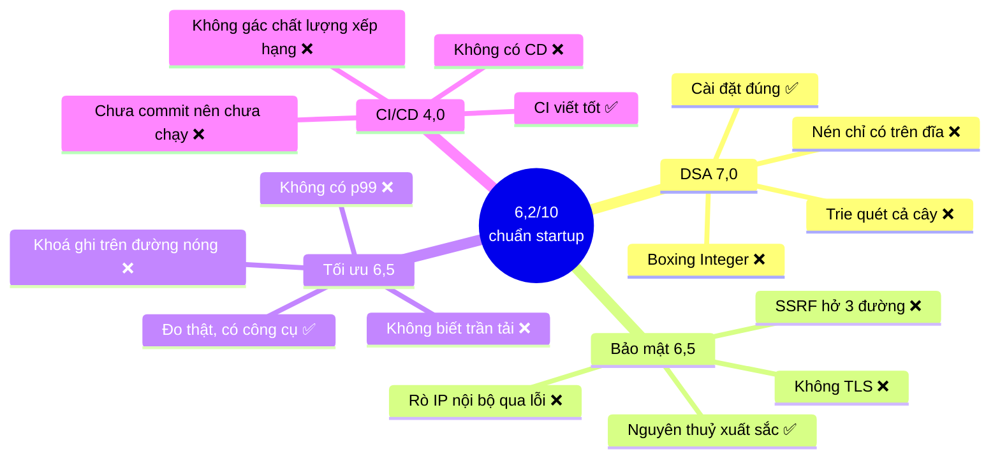
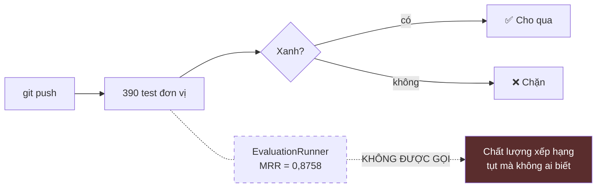

# Chấm điểm VnSearch — 4 hạng mục kỹ thuật, thước đo **startup**

> Chấm **DSA · CI/CD · Bảo mật · Tối ưu** — đúng bốn hạng mục của đồ án môn học,
> nhưng chấm bằng câu hỏi của một startup chứ không phải của giảng viên.
>
> Quét ngày **08/08/2026** trên cây làm việc hiện tại. Mọi kết luận đều đọc
> thẳng từ mã và kiểm chứng bằng lệnh chạy thật (`./mvnw -B clean test` →
> **390 test xanh, exit 0**). Chỗ nào là ước lượng đều ghi rõ là ước lượng.

---

## 0. Sự khác nhau giữa hai cái thước

Cùng một dòng mã, hai người chấm hai điểm khác nhau — vì họ hỏi hai câu khác
nhau:

| Hạng mục | Giảng viên hỏi | Startup hỏi |
|---|---|---|
| **DSA** | Cài đúng không? Độ phức tạp bao nhiêu? | Còn đúng ở gấp 100 lần dữ liệu không? |
| **CI/CD** | Có CI không? | `git push` có tới được máy chủ thật không? |
| **Bảo mật** | Có xác thực và chống SSRF không? | Kẻ tấn công **có động cơ** có phá được không? |
| **Tối ưu** | Có đo và có cải thiện không? | Trần chịu tải là bao nhiêu? Chi phí mỗi truy vấn? |

Khác biệt cốt lõi: giảng viên chấm **cái đã làm**, startup chấm **cái sẽ hỏng
trước tiên**.

```
        Thước giảng viên          Thước startup
DSA        9,5  ████████████▏        7,0  █████████▏
CI/CD      8,0  ██████████▏          4,0  █████▏
Bảo mật    9,0  ███████████▏         6,5  ████████▏
Tối ưu     9,0  ███████████▏         6,5  ████████▏
        ─────────────────────    ─────────────────────
TỔNG       8,9                       6,2
```

**Tổng theo thước startup: 6,2/10** (trọng số: DSA 30%, Bảo mật 25%, Tối ưu 25%,
CI/CD 20%).

Đây là điểm **tốt**. 6,2 nghĩa là "nền móng vững, có bốn chỗ sẽ vỡ trước — và cả
bốn đều biết trước được".



---

# 1. DSA — **7,0/10**

## 1.1. Cái làm tốt (đây là phần mạnh thật, không phải khen xã giao)

Tôi đọc từng cấu trúc. Không có cái nào cài ẩu, và có mấy chỗ cài **đúng ở mức
mà sách giáo khoa hay làm sai**:

**`MinHeap.siftUp` dùng kỹ thuật "đào lỗ"** thay vì hoán đổi từng bước:

```java
while (index > 0) {
    int parent = (index - 1) >>> 1;
    if (comparator.compare(item, parentItem) >= 0) break;
    heap.set(index, parentItem);   // chỉ KÉO cha xuống
    index = parent;
}
heap.set(index, item);             // ghi item đúng MỘT lần
```

Cách ngây thơ hoán đổi 3 phép gán mỗi tầng; cách này 1 phép gán mỗi tầng cộng 1
lần cuối. Giảm ~⅔ số phép ghi.

**`ArrayPostingCursor.skipTo` dùng galloping search** (nhân đôi bước rồi nhị
phân) chứ không phải nhị phân thuần:

```java
int step = 1;
while (high < n && postings.get(high).docId() < targetDocId) {
    low = high; step <<= 1; high = index + step;   // 1, 2, 4, 8, ...
}
```

Đây chính xác là thứ Lucene làm. Nhị phân thuần trên cả danh sách là `O(log n)`
mỗi lần nhảy; galloping là `O(log d)` với `d` là khoảng cách thật — và trong
phép giao posting list, `d` thường rất nhỏ.

**`PostingListMerger.intersectAll` sắp xếp ngắn nhất trước:**

```java
sorted.sort(Comparator.comparingInt(List::size));   // shortest-first
```

Kết quả giao không bao giờ lớn hơn danh sách ngắn nhất, nên bắt đầu từ đó khiến
mọi bước sau đều rẻ hơn. Một dòng, ảnh hưởng lớn.

**`CompressedPostings.of` kiểm tra bất biến và giải thích hậu quả nếu vi phạm:**

```java
throw new IllegalArgumentException(
    "Bat bien 'termFrequency == positions.size()' bi vi pham ... "
    + "Dang nen KHONG luu termFrequency ma suy lai tu so vi tri, "
    + "nen mot Posting sai bat bien se bi giai nen SAI mot cach im lang.");
```

Bắt lỗi lúc **nén** thay vì để nó hỏng âm thầm lúc **giải nén**. Đây là tư duy
của người đã từng đi truy một lỗi dữ liệu hỏng lúc 3 giờ sáng.

**`BloomFilter` dùng công thức tối ưu đúng**, `m = -n·ln(p)/(ln2)²` và
`k = (m/n)·ln2`, cộng kỹ thuật double hashing `h1 + i·h2` (Kirsch–Mitzenmacher)
thay vì tính k hàm băm độc lập.

## 1.2. Bốn chỗ thước startup trừ điểm

### ❌ 1.2.1. Toàn bộ đường truy vấn dùng `List<Integer>` — boxing

Đây là vấn đề nghiêm trọng nhất của hạng mục DSA.

```java
public static List<Integer> intersect(List<Integer> a, List<Integer> b) {
public static List<Integer> union(List<Integer> a, List<Integer> b) {
public static List<Integer> intersectCursors(PostingCursor a, PostingCursor b) {
```

Mỗi `docId` — một số nguyên 4 byte — trở thành một **đối tượng `Integer` trên
heap**:

```
int thuần trong int[]          Integer trong List<Integer>
────────────────────           ──────────────────────────────
4 byte                         16 byte (header) + 4 (giá trị)
                             + 4 (padding) + 8 (con trỏ trong mảng)
                             = 32 byte
                             
→ gấp 8 lần bộ nhớ, và mỗi lần đọc là một lần NHẢY CON TRỎ
```

Hệ quả nặng hơn con số bộ nhớ: `int[]` nằm liền nhau nên CPU nạp 16 giá trị mỗi
lần đọc cache line; `Integer[]` nằm rải rác trên heap nên **gần như mỗi phần tử
là một lần trượt cache**. Trên phép giao — vòng lặp nóng nhất của cả hệ thống —
chênh lệch thường là 3–10 lần (ước lượng theo kinh nghiệm chung, dự án chưa đo).

Java có cache `Integer` cho `-128..127`, nên docId nhỏ được dùng lại. Ở
corpus 5.011 tài liệu thì 99,997% docId nằm ngoài vùng đó.

> **Sửa:** đổi chữ ký sang `int[]` với một `IntArrayList` tự cài (khoảng 60 dòng,
> vừa vặn làm thêm một mục DSA trong báo cáo). Đây là cách hiếm hoi mà **tối ưu
> startup lại làm đồ án đẹp hơn**.

### ❌ 1.2.2. Nén VByte chỉ áp dụng trên **đĩa**, không áp dụng trong RAM

Đây là phát hiện tôi cho là quan trọng nhất, vì nó ngược với ấn tượng mà tài
liệu tạo ra.

Chỉ mục đang sống trong bộ nhớ:

```java
// InvertedIndex.java:47
private final Map<String, List<Posting>> index = new LinkedHashMap<>();
```

`CompressedPostings` chỉ xuất hiện đúng hai chỗ, và cả hai đều là đường **lưu
trữ**:

```java
// dòng 378-380 — lúc GHI ra đĩa
compressed.put(entry.getKey(), CompressedPostings.of(entry.getValue()));

// dòng 395 — lúc ĐỌC từ đĩa, giải nén NGAY trở lại List<Posting>
entry.getValue().toPostings());
```

Nghĩa là: VByte + delta tiết kiệm **dung lượng tệp `index.json`**, còn RAM —
thứ thực sự chặn quy mô — thì **không giảm một byte nào**.

```
        Trên đĩa                    Trong RAM
   ┌─────────────────┐        ┌──────────────────────┐
   │ VByte + delta   │        │ List<Posting>        │
   │ ~1-2 byte/docId │  load  │ đối tượng Posting:   │
   │                 │ ────▶  │  16 header           │
   │      924 KB     │ giải   │ + 4 docId            │
   │                 │  nén   │ + 4 termFrequency    │
   └─────────────────┘        │ + 8 con trỏ int[]    │
                              │ + 16+4n cho positions│
                              │ ≈ 32 byte + mảng     │
                              └──────────────────────┘
                                   ↑ chỗ này mới là trần quy mô
```

Phần nén **có thật** trong RAM là thân bài (`Map<Integer, byte[]> bodyTexts`) —
đó là nguồn của con số "giảm 54%" trong `DANH-GIA-DU-AN.md`. Con số đó đúng,
nhưng nó **không phải là posting list**.

> **Sửa (khó hơn, đáng làm):** giữ `CompressedPostings` làm dạng thường trú và
> cho `PostingCursor` giải nén **theo dòng** (streaming) khi duyệt. Đây đúng là
> cách Lucene làm, và nó biến `PostingCursor` — vốn đã có sẵn giao diện
> `next()/skipTo()` — thành đúng chỗ để cắm vào. Kiến trúc đã sẵn sàng cho việc
> này; chỉ là chưa nối dây.

### ❌ 1.2.3. `Trie.getSuggestions` quét toàn bộ cây con mỗi lần gõ phím

```java
collectWords(prefixNode, new StringBuilder(normalizedPrefix), candidates);
// ... rồi mới MinHeap.topK(deduplicated, limit, ...)
```

Gọi `topK` là đúng, nhưng nó chạy **sau khi đã thu thập hết**. Người dùng gõ chữ
`c` đầu tiên → duyệt đệ quy toàn bộ nhánh `c` (ở 136.768 term, có thể hàng chục
nghìn nút) → dựng một `ArrayList` hàng chục nghìn phần tử → dựng một
`LinkedHashMap` để khử trùng → rồi mới lấy 10 gợi ý.

Autocomplete là loại truy vấn bắn theo **từng lần gõ phím**, tức tần suất cao
gấp nhiều lần truy vấn tìm kiếm. Đây là chỗ dễ thành nút cổ chai nhất khi có
người dùng thật.

Hai vấn đề phụ đi kèm:
- `collectWords` **đệ quy** → có nguy cơ tràn ngăn xếp với khoá dài. Rủi ro thấp
  vì tiêu đề tiếng Việt có giới hạn, nhưng một hệ thống nhận đầu vào từ Internet
  không nên có đường đệ quy không chặn.
- Mỗi nút là một `HashMap<Character, TrieNode>` — khoảng 48 byte phụ trội cho
  **mỗi cạnh**. `coccoc-tokenizer` — nguồn của chính bộ từ điển đang dùng — giải
  bài toán này bằng double-array trie (`da_trie.hpp`); đây là hướng tham khảo
  sẵn có nếu muốn thay cấu trúc nút.

> **Sửa:** lưu sẵn top-k tại **mỗi nút** lúc dựng trie (cache k phần tử tốt nhất
> của cây con). Truy vấn thành `O(độ dài tiền tố)` thay vì `O(kích thước cây
> con)`. Tốn thêm bộ nhớ, nhưng đây là đánh đổi kinh điển và **đáng một mục
> riêng trong báo cáo DSA**.

### ❌ 1.2.4. Trần quy mô được đóng cứng bằng hằng số

```java
// UrlSeenFilter.java
public static final int MAX_EXPECTED_URLS = 50_000_000;
```

Ở 50 triệu URL và FPR 1%, Bloom filter cần ~479 triệu bit ≈ 60 MB — vừa vặn, và
`int numBits` chưa tràn. Nhưng:

- Trần này **thấp hơn web tiếng Việt khoảng 1–2 bậc độ lớn** (ước lượng).
- `numBits` là `int` → trần tuyệt đối của thiết kế là 2³¹ bit ≈ 256 MB, tức
  khoảng **224 triệu mục** ở FPR 1%. Vượt qua đó thì
  `(int) Math.ceil(...)` **tràn âm thầm** thành số âm và `new long[]` ném ngoại
  lệ — hoặc tệ hơn, tạo mảng sai kích thước.
- Ở đúng trần 50 triệu, FPR 1% nghĩa là khoảng **500.000 URL bị bỏ qua vĩnh
  viễn** vì bị nhận nhầm là đã thấy. Với đồ án thì không ai để ý; với một máy
  tìm kiếm thì đó là nửa triệu trang không bao giờ vào chỉ mục, **và không có
  thang đo nào báo điều đó đang xảy ra**.

> **Sửa rẻ:** đổi `numBits` sang `long`, và thêm một thang đo Micrometer đếm số
> lần Bloom filter báo "đã thấy" — tỷ lệ đó tăng bất thường chính là tín hiệu
> filter đã bão hoà.

## 1.3. Bảng điểm DSA

| Tiêu chí | Điểm | Ghi chú |
|---|---:|---|
| Tính đúng đắn của cài đặt | 9,5 | 390 test xanh, bất biến được kiểm tra |
| Lựa chọn thuật toán | 9,0 | Galloping, shortest-first, heapify O(n) |
| Độ phức tạp lý thuyết | 9,0 | Phân tích đúng, tài liệu hoá kỹ |
| **Hằng số thực thi** | **5,0** | Boxing `Integer` trên toàn đường nóng |
| **Hành vi ở quy mô 100×** | **4,0** | Nén không vào RAM, trie quét cả cây, trần cứng |
| Khả năng kiểm thử | 9,0 | Nhận thời gian từ ngoài, tách khỏi framework |
| | **7,0** | |

---

# 2. CI/CD — **4,0/10**

Đây là hạng mục **yếu nhất**, và cũng là hạng mục **rẻ nhất để sửa**.

## 2.1. Cái làm tốt

`.github/workflows/ci.yml` là CI của người biết việc:

| Chi tiết | Vì sao đúng |
|---|---|
| `concurrency` + `cancel-in-progress` | Không ai quan tâm kết quả của mã đã bị thay thế |
| `cache: maven` | Không tải lại toàn bộ kho thư viện mỗi lần |
| `if: always()` khi tải báo cáo test | Test **đỏ** mới là lúc cần đọc báo cáo |
| `npm ci` chứ không `npm install` | Cài đúng phiên bản trong lock file |
| `ELECTRON_SKIP_BINARY_DOWNLOAD` | Bỏ 100 MB không dùng tới |
| Build Docker để bắt lỗi Dockerfile sớm | Dockerfile hỏng lộ ra lúc triển khai thì đã muộn |

Ba job tách bạch (backend / frontend / docker), chạy song song. Không có gì để
chê về **nội dung** tệp này.

## 2.2. Nhưng nó chưa từng chạy một lần nào

```
$ git status --short | grep ci.yml
?? .github/workflows/ci.yml
```

Dấu `??` nghĩa là **chưa được Git theo dõi**. Tệp này chưa lên GitHub, nên
GitHub Actions chưa từng biết nó tồn tại.

Và nó không đơn độc — **58 tệp** đang chưa commit, trong đó có toàn bộ đợt sửa
quan trọng nhất của dự án:

```
?? .github/workflows/ci.yml     ← chính CI ở trên
?? README.md                     ← README duy nhất
?? .env.example
?? config/SecurityConfig.java        ?? config/ApiKeyAuthFilter.java
?? config/RateLimitFilter.java       ?? config/MetricsConfig.java
?? controller/HealthController.java  ?? crawler/SeedUrlValidator.java
?? crawler/LanguageFilter.java       ?? index/CompressedText.java
?? resources/logback-spring.xml      + 5 lớp test mới
```

```
   Cái bạn NGHĨ đang có              Cái thực sự đang có
   ────────────────────              ───────────────────
   push → CI chạy → biết đỏ/xanh     push → không có gì xảy ra
   Mã an toàn trên GitHub            Mã tồn tại trên MỘT ổ đĩa
```

Một `git clean -fd` gõ nhầm, một ổ SSD hỏng — mất sạch. **Đây là rủi ro lớn nhất
trong toàn bộ tài liệu này, và sửa mất 2 phút.**

## 2.3. Không có chữ "CD" nào cả

| Có | Không có |
|---|---|
| Build ảnh Docker | Đẩy ảnh lên registry |
| | Đánh tag phiên bản (`git tag` rỗng) |
| | Môi trường staging |
| | Bất kỳ hạ tầng triển khai nào (k8s / terraform / fly.toml / render.yaml) |
| | Nhánh nào ngoài `main`; không có branch protection |
| | Quy trình pull request |
| | Cơ chế quay lui (rollback) |

Ảnh Docker được build **chỉ để kiểm tra Dockerfile không hỏng**, rồi bị vứt đi.
Không tồn tại đường nào từ `git push` tới một máy chủ đang chạy.

## 2.4. CI không gác đúng thứ mà một công ty tìm kiếm phải gác

Đây là điểm **đặc thù startup** quan trọng nhất của hạng mục này.

Dự án đã có sẵn `EvaluationRunner` — công cụ đo MRR, Success@k trên 200 truy
vấn, chạy trong vài giây. Nhưng CI **không gọi nó**.

Nghĩa là: một thay đổi trong tokenizer, trong công thức BM25, trong bộ lọc
stopword có thể **làm tụt chất lượng tìm kiếm 10 điểm phần trăm mà CI vẫn báo
xanh**, vì 390 test đơn vị chỉ kiểm tra từng khối rời rạc, không khối nào biết
"kết quả tìm kiếm có còn tốt không".

Với một công ty tìm kiếm, **MRR là chỉ số sản xuất**, ngang hàng với "ứng dụng
có khởi động được không".



> **Sửa:** thêm một job CI chạy `EvaluationRunner` trên corpus seed và **thất bại
> nếu MRR tụt quá 2% so với giá trị ghi trong repo**. Đây là loại kiểm thử mà
> rất ít đồ án có, và **mọi công ty tìm kiếm đều có**. Chi phí: khoảng 2 giờ.
> Vừa nâng CI/CD vừa là một mục nổi bật trong báo cáo.

## 2.5. Ba thiếu sót còn lại

- **Không có phân tích tĩnh.** Không SpotBugs, không PMD, không Checkstyle,
  không quét CVE (không có `.github/dependabot.yml`). CI chỉ biết "test xanh",
  không biết "mã có mùi" hay "`jsoup 1.18.1` vừa có lỗ hổng".
- **Không có ngưỡng độ phủ.** 5.279 dòng test trên 16.574 dòng mã là con số tốt,
  nhưng không có JaCoCo, nên độ phủ thật **không ai biết**, và không có gì ngăn
  nó tụt dần.
- **Lịch sử commit đang xấu đi.**

  ```
  c7f645c minor          ─┐
  e0e2b82 minor           ├─ không truy được gì đổi, không revert chọn lọc được
  3f81101 minor          ─┘
  7301cfe update : update frontend, docs
  ──────────────────────────────────────
  2a9cb08 docs: update the rest of the docs for the new frontier   ─┐
  9f6ca4b test(frontier): cover prioritizer, front queues...        ├─ phần cũ rất chuẩn
  6a7ce83 feat(frontier): add the two-tier UrlFrontier facade      ─┘
  ```

  Phần cũ theo Conventional Commits rất tốt. Bốn commit gần nhất bỏ hẳn quy ước.

- **`ci.yml` viết tiếng Việt không dấu** (`"Kiem tra tu dong"`, `"Chay test"`)
  trong khi `docker-compose.yml` và `schema.sql` lại có dấu đầy đủ. Dự án đang
  không nhất quán với chính nó.

## 2.6. Bảng điểm CI/CD

| Tiêu chí | Điểm | Ghi chú |
|---|---:|---|
| Chất lượng tệp CI | 8,5 | Viết rất tốt |
| **CI có thực sự chạy không** | **0,0** | Chưa commit → chưa từng chạy |
| Cổng chất lượng | 3,0 | Chỉ test đơn vị; không gác MRR, không phân tích tĩnh, không CVE |
| CD / triển khai | 0,0 | Không tồn tại |
| Kỷ luật nhánh & commit | 3,0 | Một nhánh, không PR, 4 commit `"minor"` |
| Khả năng tái lập | 8,0 | `npm ci`, khoá phiên bản, build đa tầng |
| | **4,0** | |

---

# 3. Bảo mật — **6,5/10**

## 3.1. Cái làm tốt (phần nguyên thuỷ ở mức chuyên nghiệp thật)

| Lớp | Chặn gì | Vì sao đúng |
|---|---|---|
| Thiếu khoá → **không khởi động** | Hệ thống "có vẻ an toàn" | Hỏng to hơn hỏng âm thầm |
| `MessageDigest.isEqual` | Tấn công dò theo thời gian | `String.equals` thoát sớm, rò rỉ độ dài tiền tố đúng |
| Chặn IP nội bộ **sau khi phân giải DNS** | SSRF qua tên miền trỏ về `127.0.0.1` | Bộ lọc chỉ so chuỗi URL đều vượt được |
| `@Max` trên `maxPages`/`maxDepth` | Một request làm cạn tài nguyên | Chặn ngay ở biên controller |
| Token bucket theo IP | Gọi đúng cách nhưng quá nhanh | Không có lỗi biên cửa sổ |
| Chỉ phơi 3 actuator endpoint | `/actuator/env` rò `ADMIN_API_KEY` | Nhóm mặc định gồm cả `heapdump` |
| Không tin `X-Forwarded-For` trừ khi khai báo | Vô hiệu hoá rate limit bằng header giả | Mặc định an toàn |

`SeedUrlValidator.isPrivate` chặn đủ 7 dải: loopback, link-local (bao gồm
`169.254.169.254` của đám mây), site-local, any-local, multicast, ULA IPv6
`fc00::/7`, và CGNAT `100.64.0.0/10`. Rất ít người nhớ hai dải cuối.

## 3.2. Nhưng SSRF **hở ba đường** — và cả ba đều đi vòng qua lớp bảo vệ đó

Đây là phát hiện quan trọng nhất của hạng mục này. `SeedUrlValidator` được gọi ở
**đúng một chỗ**:

```
$ grep -rn "SeedUrlValidator" search-engine/src/main/java/
controller/AdminController.java:91:    SeedUrlValidator.validate(seedUrl);
```

Chỉ URL **hạt giống** được kiểm tra. Nhưng crawler không chỉ tải hạt giống.

### Đường 1 — Chuyển hướng (redirect)

```java
// HtmlDownloader.java
Document document = Jsoup.connect(url)
        .userAgent(USER_AGENT)
        .followRedirects(true)      // ← đi theo redirect, không kiểm tra lại
        .get();
```

```
Kẻ tấn công gửi seed:  https://trang-cua-toi.com/  ✅ IP công cộng, qua kiểm tra
                                    │
                                    ▼  HTTP 302
                       http://169.254.169.254/latest/meta-data/iam/
                                    │
                                    ▼  Jsoup tự đi theo, KHÔNG kiểm tra lại
                       Khoá IAM tạm thời → vào chỉ mục → GET /api/search
```

Lớp bảo vệ chạy **trước** khi biết đích thật là gì.

### Đường 2 — Liên kết phát hiện được khi crawl

`LinkExtractor` moi liên kết từ trang đã tải, đẩy vào frontier, rồi tải tiếp.
Kiểm chứng:

```
$ grep -n "isPrivate|InetAddress|127\.|192\.168|169.254" \
        crawler/UrlFilter.java crawler/UrlCanonicalizer.java
(không có kết quả nào)
```

Không có lớp nào giữa frontier và `HtmlDownloader` kiểm tra dải IP. Một trang
công khai chứa `<a href="http://192.168.1.1/admin">` là đủ.

### Đường 3 — DNS rebinding (TOCTOU)

```java
SeedUrlValidator.validate(url);   // lần phân giải DNS thứ NHẤT
// ...
Jsoup.connect(url).get();          // lần phân giải DNS thứ HAI, độc lập
```

Hai lần phân giải riêng biệt. Máy chủ DNS của kẻ tấn công đặt TTL = 0, trả IP
công cộng ở lần thứ nhất và `127.0.0.1` ở lần thứ hai. Kinh điển.

> **Sửa (một chỗ, giải cả ba đường):** chuyển kiểm tra từ tầng controller xuống
> tầng **socket**. Dùng một `java.net.http.HttpClient` với
> `ProxySelector`/`InetSocketAddress` tự kiểm tra, hoặc đơn giản hơn: phân giải
> DNS **một lần**, kiểm tra IP, rồi kết nối **thẳng tới IP đó** với header
> `Host` đặt tay, và `followRedirects(false)` + tự xử lý từng redirect qua đúng
> hàm kiểm tra. Ước tính: nửa ngày.
>
> Với đồ án, đây là một mục rất mạnh — nó cho thấy bạn hiểu **vì sao** kiểm tra
> ở tầng sai thì vô dụng, chứ không chỉ biết SSRF là gì.

## 3.3. Thông báo lỗi biến hệ thống thành máy quét mạng

```java
// SeedUrlValidator
throw new IllegalArgumentException(
    "Seed URL tro toi dia chi noi bo (" + address.getHostAddress() + ")...");

// GlobalExceptionHandler — trả nguyên văn về cho người gọi
public ResponseEntity<...> handleIllegalArgument(IllegalArgumentException e) {
    return errorResponse(HttpStatus.BAD_REQUEST, e.getMessage(), null);
}
```

Người gọi nhận về **địa chỉ IP nội bộ thật**. Và ba thông báo khác nhau tạo
thành một oracle hoàn chỉnh:

| Thông báo trả về | Kẻ tấn công suy ra |
|---|---|
| `"tro toi dia chi noi bo (10.0.3.17)"` | Host tồn tại **và** biết luôn IP nội bộ |
| `"Khong phan giai duoc ten may"` | Host không tồn tại |
| Không có lỗi | Host tồn tại và ở ngoài Internet |

Chênh lệch đó đủ để lập bản đồ mạng nội bộ mà **không cần vượt qua lớp chặn nào
cả** — lớp chặn vẫn hoạt động đúng, nó chỉ nói quá nhiều.

Điểm cộng: `handleGeneric` đã làm **đúng** — log chi tiết ở phía máy chủ, trả về
người dùng chỉ một mã tham chiếu 8 ký tự. Đúng nguyên tắc, chỉ là chưa áp cho
nhánh `IllegalArgumentException`.

> **Sửa:** log IP đầy đủ phía máy chủ, trả về người gọi câu trung tính
> `"Seed URL khong duoc phep"`. 3 dòng.

## 3.4. Bốn khoảng trống tầng hạ tầng

- **Không có TLS ở bất kỳ đâu.** Không nginx, không chứng chỉ, không HSTS.
  `ADMIN_API_KEY` — khoá điều khiển crawler — hiện đi qua **HTTP trần** trong
  mọi cấu hình được tài liệu hoá. Mọi công sức so chuỗi thời gian hằng ở trên bị
  vô hiệu nếu khoá đi qua mạng dưới dạng văn bản thô.
- **Không quét CVE.** Không Dependabot, không `dependency-check`, không SBOM.
  10 dòng YAML là có cảnh báo tự động mãi mãi.
- **Không có quản lý bí mật.** Biến môi trường là mức tối thiểu; không có xoay
  khoá, không có đường thu hồi khi khoá lộ, không có nhật ký kiểm toán ai đã gọi
  endpoint quản trị lúc nào.
- **Electron tắt sandbox.** `webPreferences.sandbox: false` (`tabManager.ts:66`).
  `contextIsolation: true` và `nodeIntegration: false` đã đúng, nhưng đây là
  tiến trình **render nội dung web bên ngoài** — chỗ cần nhiều lớp nhất, không
  phải ít hơn.
- **CORS cho phép origin `"null"` và `file://*`** (`CorsConfig.java:21`). Với API
  công khai không dữ liệu người dùng thì chấp nhận được, nhưng nó nới rộng bề
  mặt hơn mức cần.

## 3.5. Bảng điểm Bảo mật

| Tiêu chí | Điểm | Ghi chú |
|---|---:|---|
| Xác thực & phân quyền | 9,0 | Thời gian hằng, fail-fast, phân quyền theo đường dẫn |
| Kiểm tra đầu vào | 8,5 | `@Valid`, chặn trên, `isPrivate` đủ 7 dải |
| **Phòng chống SSRF** | **4,0** | Nguyên thuỷ xuất sắc, đặt sai tầng → hở 3 đường |
| Rò rỉ thông tin | 5,0 | `handleGeneric` đúng, nhánh `IllegalArgument` rò IP nội bộ |
| Bảo mật hạ tầng | 3,0 | Không TLS, không quét CVE, không xoay khoá |
| Bảo mật client (Electron) | 6,0 | Cách ly đúng, sandbox tắt |
| Chống lạm dụng | 8,0 | Token bucket, có chặn trên bộ nhớ, không tin XFF |
| | **6,5** | |

---

# 4. Tối ưu — **6,5/10**

## 4.1. Cái làm tốt

Dự án **đo thật rồi mới tối ưu** — đúng thứ tự, và đây là điều hiếm.

| Tối ưu | Bằng chứng | Đánh giá |
|---|---|---|
| Ghi chỉ mục ra đĩa để không dựng lại lúc khởi động | 58,5 giây → nạp thẳng | Đúng, và Javadoc kể rõ **vì sao trước đây thiếu** |
| Nén thân bài trong RAM | Giảm 54% bộ nhớ | Thật, đo bằng `MemoryBreakdown` |
| Bỏ `lastCrawledDocuments` khỏi Facade | 34 MB thường trú bị xoá | Đúng — và giải thích rất hay: giữ bản nguyên văn làm **vô hiệu** phép nén |
| `MinHeap.topK` thay vì sắp xếp toàn bộ | `O(n log k)` thay `O(n log n)` | Đúng chỗ, đúng cách |
| Bỏ qua chỉ mục dựng sẵn nếu nó **rỗng** | Tránh vòng khởi động lại vô hạn trong Docker | Loại lỗi chỉ tìm ra khi chạy thật |
| Chụp 4 tham chiếu vào biến cục bộ trong `search()` | Tránh trộn chỉ mục cũ với PageRank mới | Đây là mức cẩn thận của mã production |

`MaxRAMPercentage=75` trong Dockerfile thay vì `-Xmx` cố định cũng là lựa chọn
đúng — heap co giãn theo giới hạn container.

## 4.2. Bốn chỗ thước startup trừ điểm

### ❌ 4.2.1. `LRUCache.get()` giữ **khoá GHI** — mọi truy vấn xếp hàng một

```java
public V get(K key) {
    lock.writeLock().lock();      // ← KHOÁ GHI, không phải khoá đọc
    try {
        Node<K, V> node = map.get(key);
        if (node == null) return null;
        moveToFront(node);         // đây là lý do: get() có tác dụng phụ
        return node.value;
    } finally { lock.writeLock().unlock(); }
}
```

Lớp này khai báo `ReentrantReadWriteLock`, nhưng **khoá đọc chỉ được dùng bởi
`size()` và `containsKey()`** — hai hàm không nằm trên đường chạy của truy vấn.
Đường nóng thật (`get`, `put`) đều lấy khoá ghi.

Cài đặt **đúng** — LRU buộc phải cập nhật thứ tự khi đọc. Nhưng hệ quả:

```
   Điều cấu trúc dữ liệu hứa       Điều thực sự xảy ra
   ─────────────────────────       ────────────────────────────
   ReadWriteLock → nhiều luồng     MỌI truy vấn tuần tự hoá qua
   đọc song song                   một khoá độc quyền duy nhất

   Tomcat có 200 luồng             199 luồng chờ, 1 luồng chạy
                                   (tại đúng dòng đầu tiên của search())
```

Ở tải đồ án (1 người bấm thử) không thấy gì. Ở 200 truy vấn đồng thời, đây là
trần thông lượng của cả hệ thống — **và nó nằm ở dòng đầu tiên của đường tìm
kiếm**, trước cả khi làm bất kỳ việc hữu ích nào.

> **Sửa:** hoặc chia cache thành N phân đoạn theo hash của khoá (giảm tranh chấp
> N lần, ~30 dòng), hoặc đổi sang thuật toán CLOCK / xấp xỉ LRU vốn đọc mà không
> cần khoá ghi. Cả hai đều là nội dung DSA tốt cho báo cáo.

### ❌ 4.2.2. Không biết trần chịu tải là bao nhiêu

`docs/EVALUATION.md` đo **chất lượng** rất kỹ: 11 cấu hình, 200 truy vấn, ablation
đàng hoàng, có cả baseline GIN đối chứng. Đây là công việc nghiêm túc.

Nhưng đo **sức chịu tải** thì không có gì:

| Câu hỏi | Trả lời được không? |
|---|---|
| Bao nhiêu truy vấn/giây trước khi vỡ? | ❌ |
| Độ trễ p50 / p95 / p99? | ❌ (chỉ có `timeTakenMs` trung bình mỗi request) |
| Điều gì hỏng trước — CPU, heap, hay khoá cache? | ❌ |
| Chi phí mỗi 1.000 truy vấn? | ❌ |

Con số `1,59 ms/truy vấn` trong EVALUATION là **đo tuần tự, một luồng**. Nó
không nói gì về hành vi khi có tranh chấp — mà mục 4.2.1 vừa cho thấy tranh chấp
chính là chỗ sẽ hỏng.

> **Sửa:** một kịch bản k6 hoặc Gatling 50 dòng, chạy 5 phút, cho ra biểu đồ
> thông lượng/độ trễ. Với báo cáo đồ án, một biểu đồ "độ trễ p99 theo số truy vấn
> đồng thời" **có sức nặng hơn nhiều** so với một con số trung bình.

### ❌ 4.2.3. Không có thang đo độ trễ, dù đã có sẵn hạ tầng

`MetricsConfig` đăng ký 3 gauge rất đúng chỗ (số tài liệu, số term, tỷ lệ trúng
cache). Nhưng **không có `Timer` nào cho độ trễ truy vấn**.

Micrometer có sẵn `Timer` cho ra p50/p95/p99/max. Thêm nó là khoảng 5 dòng, và
nó là thang đo mà **người vận hành một máy tìm kiếm nhìn đầu tiên mỗi sáng**.

Nghiêm trọng hơn, cả chuỗi quan sát dừng lại ở chỗ phơi số liệu:

```
Ứng dụng ──▶ /actuator/prometheus ──▶  ???  ──▶  ???  ──▶  ???
   ✅              ✅                Prometheus  Grafana  Cảnh báo
                                       ❌          ❌       ❌
```

Không có `prometheus.yml`, không dashboard, không quy tắc cảnh báo, không SLO.

**Và một phát hiện cụ thể:** log JSON đã cấu hình xong nhưng **chưa từng chạy**.
`logback-spring.xml` tách `<springProfile name="prod">` rất đúng, nhưng:

```
$ grep -rn "SPRING_PROFILES_ACTIVE|spring.profiles" \
        --include=*.yml --include=*.properties --include=*.bat --include=Dockerfile .
(không có kết quả nào)
```

`docker-compose.yml` — đường chạy thật duy nhất được tài liệu hoá — không đặt
biến này. Thư viện `logstash-logback-encoder` đã có trong `pom.xml`, cấu hình đã
viết xong, **điện chưa cắm**. Sửa: thêm `SPRING_PROFILES_ACTIVE: prod`, một
dòng.

### ❌ 4.2.4. Reindex là thao tác chặn toàn hệ thống

```java
public void reindex() throws IOException {
    List<WebDocument> docs = ContentStorage.loadFromJson(crawledDataPath);
    index = indexBuilder.build(docs);        // dựng lại TOÀN BỘ
    IndexPersistence.save(...);
    refreshDerivedState();                   // PageRank + Trie + cache, tất cả
}
```

Không có lập chỉ mục **tăng dần**. Thêm một trang mới = dựng lại cả chỉ mục.
Trên 30.017 trang là 58,5 giây, và trong 58,5 giây đó `refreshDerivedState()`
cũng xoá sạch cache lẫn trie gợi ý.

Điểm cộng cho thiết kế: `index` là `volatile` và được gán **một lần** ở cuối, nên
truy vấn đang chạy vẫn thấy chỉ mục cũ nguyên vẹn thay vì thấy trạng thái nửa
vời. Đó là lựa chọn đúng. Nhưng cái giá là **gấp đôi bộ nhớ trong lúc dựng** —
chỉ mục cũ và mới cùng tồn tại — và ở corpus lớn đó chính là lúc hết heap.

## 4.3. Bảng điểm Tối ưu

| Tiêu chí | Điểm | Ghi chú |
|---|---:|---|
| Đo trước khi tối ưu | 9,5 | Có `MemoryBreakdown`, `TokenizerBenchmark`, EVALUATION |
| Tối ưu bộ nhớ | 7,5 | Thân bài nén thật (-54%); posting list thì không |
| Tối ưu đường truy vấn | 6,0 | Top-K heap + skip list đúng, nhưng boxing + khoá ghi |
| **Đồng thời / thông lượng** | **4,0** | Khoá ghi trên đường nóng, chưa từng đo tải |
| Thời gian khởi động | 9,0 | Chỉ mục dựng sẵn, 58,5s → gần như tức thì |
| Quan sát hiệu năng | 5,0 | Có 3 gauge, thiếu Timer p99, chưa bật profile prod |
| | **6,5** | |

---

# 5. Tổng hợp & thứ tự việc

## 5.1. Bảng điểm chung

| Hạng mục | Thước giảng viên | Thước startup | Chênh | Chỗ mất điểm chính |
|---|---:|---:|---:|---|
| DSA | 9,5 | **7,0** | −2,5 | Boxing, nén không vào RAM |
| CI/CD | 8,0 | **4,0** | −4,0 | Chưa commit → chưa chạy; không CD |
| Bảo mật | 9,0 | **6,5** | −2,5 | SSRF đặt sai tầng |
| Tối ưu | 9,0 | **6,5** | −2,5 | Khoá ghi hot path, chưa đo tải |
| **TỔNG** | **8,9** | **6,2** | **−2,7** | |

Điều bảng này nói: **không hạng mục nào làm sai.** Chênh lệch đến từ việc mỗi
hạng mục dừng lại đúng ở ranh giới mà môn học yêu cầu, và startup thì hỏi thêm
một câu nữa ở ngay bên kia ranh giới đó.

## 5.2. Việc nên làm, xếp theo tỷ lệ lợi/chi phí

### Nhóm A — hôm nay, tổng dưới 30 phút

| # | Việc | Thời gian | Hạng mục | Lợi |
|---|---|---|---|---|
| A1 | `git add -A && git commit && git push` | 2 phút | CI/CD | **CI/CD 4,0 → 6,0** — CI bắt đầu tồn tại |
| A2 | `SPRING_PROFILES_ACTIVE: prod` vào compose | 1 phút | Tối ưu | Log JSON bắt đầu chạy |
| A3 | Không trả IP nội bộ trong thông báo lỗi | 5 phút | Bảo mật | Đóng oracle quét mạng |
| A4 | `.github/dependabot.yml` (10 dòng) | 10 phút | Bảo mật | Cảnh báo CVE tự động mãi mãi |
| A5 | Thêm `Timer` cho độ trễ truy vấn | 10 phút | Tối ưu | Có p95/p99 |

### Nhóm B — tuần này

| # | Việc | Thời gian | Hạng mục | Lợi |
|---|---|---|---|---|
| B1 | Job CI chạy `EvaluationRunner`, chặn nếu MRR tụt >2% | 2 giờ | CI/CD | **4,0 → 6,5** · nổi bật trong báo cáo |
| B2 | Kiểm tra IP ở tầng socket + `followRedirects(false)` | 4 giờ | Bảo mật | **6,5 → 8,0** · đóng cả 3 đường SSRF |
| B3 | `IntArrayList` thay `List<Integer>` trên đường truy vấn | 4 giờ | DSA + Tối ưu | **DSA 7,0 → 8,0** · thêm một mục DSA |
| B4 | Kiểm thử tải k6, vẽ p99 theo số luồng | 3 giờ | Tối ưu | **6,5 → 7,5** · biểu đồ mạnh cho báo cáo |
| B5 | Cache chia phân đoạn (giảm tranh chấp khoá) | 3 giờ | Tối ưu | Gỡ trần thông lượng |
| B6 | SpotBugs + JaCoCo vào CI | 2 giờ | CI/CD | Có cổng chất lượng thật |

### Nhóm C — tháng này (mỗi việc là một mục lớn trong báo cáo)

| # | Việc | Hạng mục |
|---|---|---|
| C1 | `PostingCursor` giải nén theo dòng → nén vào **RAM** | DSA + Tối ưu |
| C2 | Trie lưu sẵn top-k tại mỗi nút | DSA |
| C3 | Lập chỉ mục tăng dần (không dựng lại toàn bộ) | Tối ưu |
| C4 | TLS + triển khai thật + đẩy ảnh lên registry | Bảo mật + CI/CD |
| C5 | Prometheus + Grafana + 5 quy tắc cảnh báo | Tối ưu |

## 5.3. Nếu làm hết A + B thì điểm thành bao nhiêu?

| Hạng mục | Hiện tại | Sau A+B | Thay đổi |
|---|---:|---:|---|
| DSA | 7,0 | 8,0 | Bỏ boxing |
| CI/CD | 4,0 | 6,5 | CI chạy thật + gác MRR + phân tích tĩnh |
| Bảo mật | 6,5 | 8,0 | SSRF đúng tầng, không rò IP, quét CVE |
| Tối ưu | 6,5 | 7,5 | Biết trần tải, có p99, gỡ tranh chấp khoá |
| **TỔNG** | **6,2** | **7,5** | **≈ 3 ngày làm việc** |

```
       Hiện tại 6,2                      Sau A+B 7,5
  0    2    4    6    8   10        0    2    4    6    8   10
  ├────┼────┼────┼────┼────┤        ├────┼────┼────┼────┼────┤
DSA    ████████████▏               DSA    ██████████████▏
CI/CD  ███████▏                    CI/CD  ███████████▏
B.mật  ███████████▏                B.mật  ██████████████▏
Tối ưu ███████████▏                Tối ưu █████████████▏
```

## 5.4. Nếu chỉ làm được ba việc

```
1. A1  git push                     ─  2 phút, cứu toàn bộ công sức đã bỏ ra
2. B2  SSRF xuống tầng socket       ─  4 giờ, đóng lỗ hổng thật duy nhất còn lại
3. B1  CI gác MRR                   ─  2 giờ, thứ phân biệt "đồ án" với "sản phẩm"
```

---

## 6. Kết luận

**Bốn hạng mục đều làm đúng. Chênh lệch 2,7 điểm không nằm ở kỹ năng — nó nằm ở
việc mỗi hạng mục dừng lại sớm hơn một bước.**

Cụ thể, cùng một khuôn mẫu lặp lại bốn lần:

| Hạng mục | Làm xong phần khó | Bỏ dở phần dễ |
|---|---|---|
| DSA | Cài `CompressedPostings` đúng và có test | Không dùng nó trong RAM |
| CI/CD | Viết một tệp CI rất tốt | Không `git push` |
| Bảo mật | Viết `isPrivate` đủ 7 dải IP | Gọi nó ở đúng một chỗ trong ba chỗ cần |
| Tối ưu | Cấu hình log JSON hoàn chỉnh | Không bật profile `prod` |

Bốn lần đều là: **phần khó đã xong, phần nối dây thì chưa.** Đó là tin tốt —
phần khó mới là phần cần kỹ năng, và bạn đã có nó. Ba ngày nối dây đưa cả bốn
hạng mục từ 6,2 lên 7,5 theo thước startup, mà **không phải viết lại bất kỳ thuật
toán nào**.
