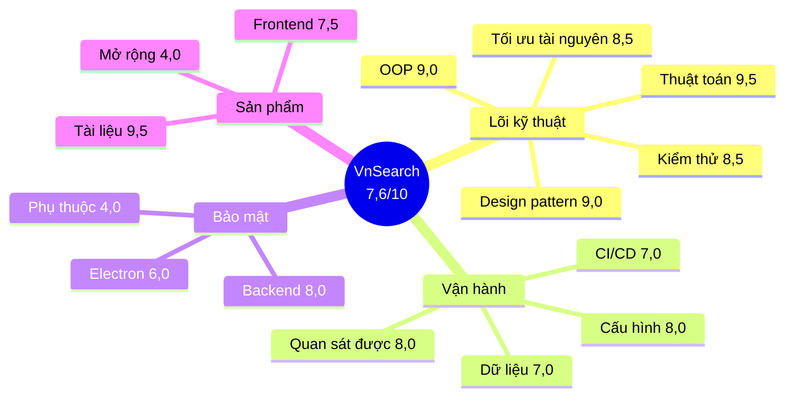

# Chấm điểm tổng thể VnSearch — theo chuẩn doanh nghiệp

> Quét toàn bộ mã nguồn ngày **08/08/2026**: 16.574 dòng Java (main), 5.279 dòng
> test, 5.039 dòng TypeScript, 44 lớp test / 390 bài. Mọi con số trong tài liệu
> này đều **lấy bằng lệnh chạy thật** trên cây mã hiện tại.
>
> Lịch sử hai lần rà soát trước và nhật ký sửa: [`DANH-GIA-DU-AN.md`](DANH-GIA-DU-AN.md).
> Chi tiết thuật toán và số đo: [`DSA-REPORT.md`](DSA-REPORT.md).

---

## 0. Trả lời thẳng câu hỏi

**Đã chuẩn doanh nghiệp chưa? — Gần, nhưng chưa hoàn toàn. Tổng: 7,6/10.**

Điểm mấu chốt không nằm ở con số mà ở **hình dạng** của nó:

```
   Phần LÕI KỸ THUẬT          │  Phần VÒNG ĐỜI SẢN PHẨM
   vượt chuẩn doanh nghiệp    │  dưới chuẩn doanh nghiệp
   ───────────────────────────┼──────────────────────────────
   Thuật toán & CTDL   9,5    │  Quản lý phụ thuộc      4,0
   Tài liệu            9,5    │  Khả năng mở rộng       4,0
   OOP & thiết kế      9,0    │  Bảo mật Electron       6,0
   Design pattern      9,0    │  CI/CD                  7,0
   Tối ưu tài nguyên   8,5    │  Frontend               7,5
   Kiểm thử            8,5    │  Dữ liệu & lưu trữ      7,0
```

Nói cách khác: **mã nguồn giỏi hơn quy trình quanh nó.** Đây là hình dạng điển
hình của dự án do một người viết rất tốt, chưa từng đi qua một chu kỳ vận hành
thật (on-call, vá CVE, mở rộng theo tải).

---

## 1. Bản đồ chấm điểm



---

## 2. Bảng điểm chi tiết

| # | Hạng mục | Điểm | Căn cứ chính |
|---|---|:---:|---|
| 1 | Thuật toán & cấu trúc dữ liệu | **9,5** | Tự cài toàn bộ, có phân tích Big-O và số đo |
| 2 | Tài liệu | **9,5** | 6.000+ dòng `docs/`, Javadoc giải thích *vì sao* |
| 3 | OOP & thiết kế lớp | **9,0** | 9 interface đúng chỗ nối, 26 record bất biến |
| 4 | Design pattern | **9,0** | 11 mẫu, mỗi mẫu giải một vấn đề có thật |
| 5 | Kiểm thử | **8,5** | 390 test xanh, ~2,0 assert/test, có test đồng thời |
| 6 | Tối ưu tài nguyên | **8,5** | Giảm 54% bộ nhớ, **đo** chứ không đoán |
| 7 | Bảo mật backend | **8,0** | API key hằng thời gian, SSRF sau DNS, rate limit |
| 8 | Quan sát được | **8,0** | Actuator + 3 gauge nghiệp vụ + log JSON |
| 9 | Cấu hình & vận hành | **8,0** | Biến môi trường, `.env.example`, fail-fast |
| 10 | Frontend | **7,5** | 0 `any`, IPC có kiểu, lint/typecheck sạch |
| 11 | CI/CD | **7,0** | 3 job; thiếu quét phụ thuộc và cổng chất lượng |
| 12 | Dữ liệu & lưu trữ | **7,0** | PreparedStatement, ghi nguyên tử; thiếu migration |
| 13 | Bảo mật Electron | **6,0** | Cô lập đúng; **`navigate()` nhận mọi scheme** |
| 14 | Khả năng mở rộng | **4,0** | Một tiến trình, chỉ mục trong RAM |
| 15 | Quản lý phụ thuộc | **4,0** | Spring Boot chậm ~2 năm, không quét CVE |
| | **TRUNG BÌNH** | **7,6** | |

---

## 3. Những hạng mục vượt chuẩn doanh nghiệp

### 3.1. Thuật toán & cấu trúc dữ liệu — 9,5/10

Không có thư viện tìm kiếm nào được dùng. Toàn bộ tự cài:

| Cấu trúc | Điểm đáng chú ý |
|---|---|
| Inverted index | Bất biến "posting list sắp xếp" được **ép bằng ngoại lệ**, không bằng lời dặn |
| VByte + delta | Ba mảng, dùng **tổng tích luỹ** biến dãy bất kỳ thành dãy đơn điệu |
| PageRank | Power iteration trên ma trận thưa CSR, xử lý đúng nút cụt (dangling) |
| Trie âm tiết + QHĐ | Tách từ tiếng Việt bằng quy hoạch động, không phải longest-matching tham lam |
| Bloom Filter | Khử trùng URL, có phân tích tỷ lệ dương tính giả |
| MinHeap | `topK` $O(c \log K)$ thay vì sort toàn bộ |
| Galloping search | $O(m \log(n/m))$ khi giao hai danh sách lệch kích thước |
| Cửa sổ trượt | Sinh đoạn trích $O(n)$ thay vì $O(n \cdot w)$ |

Chi tiết bất biến được ép — đây là thứ phân biệt "biết cài" với "hiểu":

```java
if (docId <= lastDocId) {
    throw new IllegalArgumentException(
        "addDocument phai duoc goi theo docId TANG DAN de giu bat bien ...");
}
```

Nhờ bất biến này, posting list **luôn sắp xếp mà không tốn một phép sort nào** —
tối ưu đến từ thiết kế chứ không từ tinh chỉnh.

**Trừ 0,5:** chưa có WAND/MaxScore — khoảng trống thuật toán lớn nhất còn lại,
đã được ghi nhận thẳng trong `DSA-REPORT.md` §6.5.

### 3.2. Tài liệu — 9,5/10

Hiếm gặp ở mọi cấp độ, kể cả doanh nghiệp. Ba đặc điểm:

1. **Javadoc trả lời *vì sao*, không chỉ *cái gì*.** `InvertedIndex` giải thích
   `(low + high) >>> 1` và dẫn lỗi tràn số 9 năm tuổi trong chính JDK.
2. **Ghi lại cả phương án ĐÃ BỊ BÁC BỎ, kèm lý do.** `RateLimitFilter` kể chuyện
   bản `AtomicLong` sai vì `System.nanoTime()` có gốc tuỳ ý. Đây là thứ tài liệu
   thường mất, và là thứ giá trị nhất cho người đọc sau.
3. **Ghi lại cả chẩn đoán SAI của chính mình.** `DSA-REPORT.md` §3.6 giữ nguyên
   ước lượng "giảm 60–70%" đã sai gần sáu lần, thay vì lặng lẽ xoá đi.

**Trừ 0,5:** vài số liệu cũ còn sót (corpus 5.011 trang ở một số chỗ).

### 3.3. OOP & thiết kế lớp — 9,0/10

```
 9 interface     đặt đúng "đường nối" có thật, không phải interface cho có
26 record        bất biến làm mặc định
 0 abstract      không lạm dụng kế thừa — hợp thành thay vì thừa kế
 0 field @Autowired   tiêm qua constructor, kiểm thử được
 0 TODO/FIXME    không có nợ đánh dấu bị bỏ quên
```

Ranh giới interface được đặt đúng chỗ *thật sự có hai cách cài*:
`SearchIndex`, `Tokenizer`, `DocumentStore`, `RelevanceScorer`, `PostingCursor`,
`CandidateFilter`, `CrawlListener`, `Prioritizer`, `FrontQueueSelector`.

Đóng gói được bảo vệ chủ động, không chỉ bằng `private`:

```java
public Map<Integer, WebDocument> getAllDocuments() {
    return Collections.unmodifiableMap(documents);   // trước đây trả THẲNG map nội bộ
}

public WebDocument withoutBodyText() { ... }         // bản sao, không sửa của người gọi
```

### 3.4. Design pattern — 9,0/10

11 mẫu, và điều quan trọng: **mỗi mẫu đều được biện minh bằng một vấn đề có
thật** đã xảy ra, không phải "cho đủ bộ".

| Mẫu | Giải quyết vấn đề gì |
|---|---|
| Facade | `SearchEngineFacade` từ 420 dòng / 7 trách nhiệm còn lại điều phối |
| Strategy | `DocumentStore` biến chuỗi `else if` thành **dữ liệu** (một danh sách) |
| Decorator | Sửa lỗi thật: công thức cộng tuyến tính cũ khiến PageRank chỉ đóng góp 0,1% dù trọng số danh nghĩa 30% |
| Factory | `ScorerFactory` — BM25 hơn TF-IDF 5,3% MRR nhưng trước đó **không có cách nào bật** |
| Composite | `query/ast` — `PostingListMerger.union` đã có test nhưng **không đường nào gọi tới** |
| Observer | `CrawlListener` tách tiến độ khỏi crawler |
| State | `CrawlStatus` — chuyển trạng thái sai ném ngoại lệ ngay |
| Builder | `CrawlConfig` |
| Flyweight | `TermDictionary.intern` |
| Chain of Responsibility | `CandidateFilter` |
| Iterator | `PostingCursor` |

Mẫu Decorator và Composite đáng nhấn: cả hai được thêm vào vì phát hiện **mã đã
viết nhưng chết** — dấu hiệu người viết đọc lại chính mình một cách nghiêm khắc.

---

## 4. Những hạng mục còn dưới chuẩn

### 4.1. Quản lý phụ thuộc — 4,0/10 ⚠ *thấp nhất, và dễ sửa nhất*

```
spring-boot-starter-parent  3.3.4      ← phát hành 09/2024, chậm khoảng 2 năm
jsoup                       1.18.1
postgresql                  42.7.4
logstash-logback-encoder    8.0
```

Ba thiếu sót cộng hưởng:

1. **Không có cơ chế cập nhật** — không Dependabot, không Renovate.
2. **Không quét lỗ hổng** — không OWASP Dependency-Check, không `mvn versions:display-dependency-updates` trong CI.
3. **Không có SBOM** — không liệt kê được thành phần khi cần audit.

Hệ quả không phải "có CVE nào đó", mà là: **không ai biết có hay không.** Với một
hệ thống vừa được vá SSRF rất cẩn thận, việc để ngỏ toàn bộ bề mặt phụ thuộc là
mất cân đối.

**Sửa — thêm vào `.github/workflows/ci.yml`, ~30 phút:**

```yaml
  deps:
    name: Quét phụ thuộc
    runs-on: ubuntu-latest
    steps:
      - uses: actions/checkout@v4
      - uses: actions/setup-java@v4
        with: { java-version: '17', distribution: temurin, cache: maven }
      # Thất bại khi có lỗ hổng từ mức 7.0 (CAO) trở lên.
      - name: OWASP Dependency-Check
        working-directory: search-engine
        run: ./mvnw -B org.owasp:dependency-check-maven:check -DfailBuildOnCVSS=7
```

Kèm `.github/dependabot.yml` cho `maven`, `npm` và `github-actions`.

### 4.2. Bảo mật Electron — 6,0/10 ⚠ *phát hiện MỚI của lần quét này*

**Phần làm đúng.** Cô lập tiến trình được cấu hình chuẩn, và cấu hình đúng chỗ:

```
chromeView (vỏ trình duyệt)      tab views (nội dung web ngoài)
├─ preload: có                    ├─ preload: KHÔNG
├─ contextIsolation: true         ├─ contextIsolation: true
└─ nodeIntegration: false         └─ nodeIntegration: false
```

API đặc quyền (`browser:*`, `win:*`) chỉ lộ cho vỏ trình duyệt, **không** cho
trang web bên ngoài. `setWindowOpenHandler` chặn cửa sổ bật lên. Đây là thiết kế
đúng.

**Lỗ hổng.** `TabManager.navigate` nhận **mọi scheme**:

```ts
// tabManager.ts:163
const target = /^[a-z]+:\/\//i.test(url) ? url : `https://${url}`
view.webContents.loadURL(target)
```

Biểu thức này chỉ hỏi *"có dạng `xxx://` không"*, nên `file:///C:/Users/...` đi
lọt nguyên vẹn. Đường khai thác khép kín:

```
   trang web độc hại
        │  window.open('file:///C:/Users/.../id_rsa')
        ▼
   setWindowOpenHandler ──▶ createTab(url) ──▶ navigate() ──▶ loadURL('file://...')
        │
        ▼
   tệp cục bộ được nạp vào một tab của trình duyệt
```

Mức nghiêm trọng **trung bình**, không phải nghiêm trọng: tab đích không có
preload, `contextIsolation` bật, và Chromium mặc định chặn `file://` đọc chéo
tệp. Nhưng đây là một **năng lực ngoài ý định** — trình duyệt không nên mở tệp
cục bộ theo lệnh của trang web.

**Sửa — danh sách trắng scheme, ~10 dòng:**

```ts
/** Chỉ cho phép hai scheme. Mọi thứ khác — file:, javascript:, data: — bị chặn. */
const ALLOWED_SCHEMES = new Set(['http:', 'https:'])

function toSafeUrl(input: string): string | null {
  const candidate = /^[a-z]+:/i.test(input) ? input : `https://${input}`
  try {
    return ALLOWED_SCHEMES.has(new URL(candidate).protocol) ? candidate : null
  } catch {
    return null   // không phân giải được thì không mở
  }
}
```

Dùng `new URL()` thay vì tự viết biểu thức chính quy: bộ phân tích chuẩn xử lý
đúng các biến thể mà regex tự viết gần như chắc chắn bỏ sót (`FILE://`,
`file:\\`, khoảng trắng dẫn đầu, ký tự điều khiển).

**Điểm trừ thứ hai:** `sandbox: false` trên `chromeView`. Đánh đổi có lý do
(`@electron-toolkit/preload` cần Node trong preload), nhưng chuẩn doanh nghiệp là
`sandbox: true` với một preload tối giản tự viết.

### 4.3. Khả năng mở rộng — 4,0/10

Trần kiến trúc, đã ghi nhận trung thực trong tài liệu:

```
   Một tiến trình JVM
   ├─ chỉ mục HOÀN TOÀN trong RAM        → không chia được theo shard
   ├─ reindex TOÀN PHẦN                  → không cập nhật tăng dần
   ├─ cache trong tiến trình             → nhiều bản sao = nhiều cache rời rạc
   └─ rate limit trong tiến trình        → hạn mức nhân đôi khi chạy 2 bản
```

Sau phiên tối ưu bộ nhớ: **55,5 KB/trang**. Ngoại suy:

| Quy mô | RAM cần | Khả thi? |
|---|---|---|
| 30 nghìn | ~2,5 GB | thoải mái |
| 100 nghìn | ~8 GB | được, một máy |
| 1 triệu | ~80 GB | cần đổi kiến trúc |

Con số đã tốt hơn nhiều so với trước (180 GB cho 1 triệu trang), nhưng bản chất
"một tiến trình, chỉ mục trong RAM" không đổi.

**Không trừ điểm nặng hơn**, vì đây là **giới hạn được chọn có ý thức**: đồ án
tồn tại để chứng minh tự cài được lõi tìm kiếm, không phải để phục vụ 1 triệu
trang. Và tài liệu nói thẳng điều đó thay vì giấu.

### 4.4. CI/CD — 7,0/10

Có: backend (test + package + lưu báo cáo khi đỏ), frontend (typecheck + lint),
build Docker. Chạy trên mọi push và PR, có huỷ lần chạy cũ.

Thiếu:

| Thiếu gì | Vì sao cần |
|---|---|
| Quét phụ thuộc | Xem 4.1 |
| Đo độ phủ (JaCoCo) + ngưỡng tối thiểu | 390 test nhưng **không ai biết phủ bao nhiêu** |
| Kiểm thử tích hợp có PostgreSQL thật (Testcontainers) | `DocumentRepository` hiện **không có test nào** |
| Bước phát hành (tag → đẩy ảnh Docker) | CI dừng ở "build được", chưa tới "giao được" |

Trong đó **`DocumentRepository` không có test** là khoảng trống thật sự: đó là
lớp duy nhất viết SQL trực tiếp.

### 4.5. Frontend — 7,5/10

Điểm mạnh thật: **0** lần dùng `any`, **0** `@ts-ignore` trên 5.039 dòng — kỷ
luật kiểu hiếm gặp. IPC có kiểu hai đầu, store tách theo trách nhiệm (9 store
zustand), tự cài `BookmarkTrie` và `Stack`.

Trừ điểm vì một thứ duy nhất nhưng lớn: **không có một bài test nào.**

```
Backend  : 390 test / 16.574 dòng
Frontend :   0 test /  5.039 dòng
```

`BookmarkTrie` và `Stack` là cấu trúc dữ liệu tự cài — đúng loại mã dễ kiểm thử
nhất và đáng kiểm thử nhất. Thêm Vitest cho riêng `lib/` đã nâng hạng mục này
lên khoảng 9,0 với công sức nhỏ.

Ngoài ra: `API_BASE` vẫn cứng `http://localhost:8080`, không có Error Boundary.

### 4.6. Dữ liệu & lưu trữ — 7,0/10

Làm đúng: `PreparedStatement` cho mọi truy vấn có tham số (`Statement` chỉ dùng
cho SQL hằng như `SELECT count(*)`), `try-with-resources` ở cả 14 chỗ, ghi tệp
**nguyên tử** (tệp tạm + đổi tên), phiên bản định dạng chỉ mục kèm **vân tay
tokenizer** — bắt được đúng loại lỗi im lặng tệ nhất.

Thiếu: không có công cụ migration (Flyway/Liquibase). `schema.sql` chỉ chạy khi
container PostgreSQL khởi tạo **lần đầu**; đổi lược đồ trên một CSDL đã có dữ
liệu thì phải làm tay. Cũng chưa có phương án sao lưu.

---

## 5. Đối chiếu với chuẩn doanh nghiệp thật

Một hệ thống được coi là "production-ready" ở doanh nghiệp thường phải qua danh
sách này. Đánh dấu trung thực:

| Tiêu chí | Đạt? | Ghi chú |
|---|:---:|---|
| Build tái lập được từ mã nguồn sạch | ✅ | `mvnw` + Docker đa tầng |
| Bộ test tự động chạy trên mỗi thay đổi | ✅ | 390 test, GitHub Actions |
| Không có bí mật trong mã được commit | ✅ | Biến môi trường + `.env.example` |
| Xác thực cho thao tác đặc quyền | ✅ | API key hằng thời gian |
| Giới hạn tần suất | ✅ | Token bucket |
| Kiểm tra dữ liệu đầu vào ở biên | ✅ | `@Valid`, chặn trên `page`/`size`/`maxPages` |
| Không rò rỉ chi tiết nội bộ khi lỗi | ✅ | Mã tham chiếu, chi tiết chỉ vào log |
| Endpoint sức khoẻ phân biệt *sống* và *phục vụ được* | ✅ | `/api/health` trả 503 khi chỉ mục rỗng |
| Số liệu đo được xuất ra ngoài | ✅ | Prometheus + 3 gauge nghiệp vụ |
| Log có cấu trúc | ✅ | JSON cho profile `prod` |
| Chạy không phải root trong container | ✅ | `USER vnsearch` |
| Tài liệu vận hành | ✅ | README + 9 tài liệu |
| **Quét lỗ hổng phụ thuộc** | ❌ | Mục 4.1 |
| **Đo độ phủ kiểm thử** | ❌ | Mục 4.4 |
| **Truy vết phân tán (tracing)** | ❌ | Không có OpenTelemetry / correlation ID xuyên request |
| **Tắt máy êm (graceful shutdown)** | ❌ | Chưa cấu hình `server.shutdown=graceful` |
| **Giới hạn tài nguyên container** | ❌ | `docker-compose.yml` không đặt `mem_limit`/`cpus` |
| **Sao lưu & khôi phục** | ❌ | Chưa có phương án |
| **Kiểm thử tải** | ❌ | Chưa có |

**13/19 đạt.** Sáu mục còn thiếu đều thuộc nhóm *vận hành lâu dài*, không phải
nhóm *đúng đắn của mã*.

---

## 6. Lộ trình lên 9,0/10

```
NGÀY 1 (~4 giờ)                    TUẦN 1                      SAU ĐÓ
├─ Danh sách trắng scheme          ├─ Vitest cho lib/          ├─ WAND / MaxScore
│  trong navigate()   (4.2)        │  frontend        (4.5)    │  (DSA-REPORT §6.5)
├─ Dependabot + OWASP              ├─ JaCoCo + ngưỡng phủ      ├─ Ba mảng song song
│  trong CI           (4.1)        ├─ Testcontainers cho       │  thay Posting
├─ Nâng Spring Boot   (4.1)        │  DocumentRepository       ├─ Tách crawler khỏi
├─ server.shutdown=graceful        ├─ Flyway cho lược đồ       │  indexer (lúc đó mới
└─ mem_limit trong compose         └─ Correlation ID           └─ cân nhắc Kafka)

   Bảo mật Electron 6,0 → 9,0        Kiểm thử   8,5 → 9,5       Mở rộng 4,0 → 7,0
   Phụ thuộc       4,0 → 9,0         CI/CD      7,0 → 9,0       Thuật toán 9,5 → 10
   Vận hành        8,0 → 9,0         Frontend   7,5 → 9,0

   ⇒ Tổng ~8,4/10                   ⇒ Tổng ~9,0/10
```

Điều đáng nói: **ngày 1 đắt giá nhất.** Bốn việc trong đó không đụng tới một
dòng logic nghiệp vụ nào — chúng là cấu hình và một hàm 10 dòng — nhưng nâng hai
hạng mục yếu nhất từ 4,0/6,0 lên 9,0.

---

## 7. Kết luận

**Theo chuẩn đồ án tốt nghiệp:** vượt xa yêu cầu. Phần lõi (thuật toán, thiết
kế, tài liệu, kiểm thử) ở mức **9,0+**, và quan trọng hơn điểm số là *cách làm
việc* thể hiện qua mã: bất biến được ép bằng ngoại lệ, phương án bị bác bỏ được
ghi lại kèm lý do, chẩn đoán sai của chính mình được giữ nguyên trong báo cáo
thay vì xoá đi. Đó là tư duy kỹ sư, không phải tư duy sinh viên làm cho xong.

**Theo chuẩn doanh nghiệp:** **7,6/10 — chưa hoàn toàn, nhưng khoảng cách còn
lại là thủ tục, không phải năng lực.** Sáu tiêu chí chưa đạt ở mục 5 đều là thứ
làm được trong một tuần, và không tiêu chí nào đòi hỏi kiến thức mà dự án chưa
chứng minh được.

**Rủi ro lớn nhất hiện tại không phải mã, mà là phụ thuộc.** Một hệ thống vá SSRF
đến mức kiểm tra sau phân giải DNS và xử lý cả dải `fc00::/7` lẫn CGNAT, nhưng
lại chạy trên nền tảng chậm hai năm mà không ai quét — đó là mất cân đối giữa
chỗ được chú ý và chỗ bị bỏ quên. Đây nên là việc làm trước tiên.
