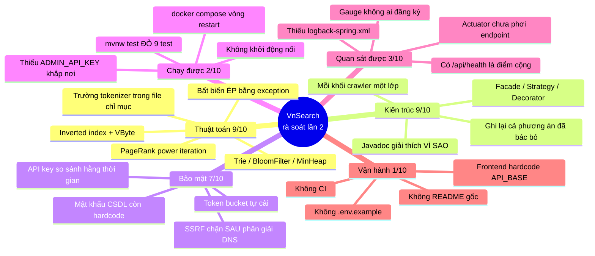

# Đánh giá dự án VnSearch — rà soát lần 2

> Rà soát ngày **08/08/2026**, trên **cây làm việc hiện tại** (bao gồm cả phần
> chưa commit). Mọi kết luận trong tài liệu này đều được **kiểm chứng bằng lệnh
> chạy thật** — build, test, đọc mã — chứ không suy đoán từ tài liệu. Chỗ nào là
> ước lượng đều được nói rõ là ước lượng.
>
> Tài liệu này **thay thế** bản rà soát lần 1 (cùng ngày, trước khi loạt sửa bảo
> mật được viết). Mục 2 giữ lại đối chiếu với lần 1 để thấy cái gì đã đổi.

---

> **Cập nhật 08/08/2026, sau hai phiên sửa.** Mục 1 (chặn phát hành), mục 3
> (tầng quan sát) và CI/CD đã xong — [mục 10](#10-nhật-ký-phiên-sửa-08082026).
> Mục 5.1 (bộ nhớ) và 5.6 (`pageSize`) cũng đã xong —
> [mục 11](#11-phiên-tối-ưu-bộ-nhớ-08082026). Kết quả đo lại: `mvnw test` →
> **390 test xanh, BUILD SUCCESS**; bộ nhớ giảm **54%**; ứng dụng chạy thật trên
> corpus 2.518 trang.

---

## 0. Kết luận trong bốn câu

1. **Loạt sửa bảo mật là thật và làm rất tốt.** Bảy trên chín lỗi của lần rà soát
   trước đã được đóng — SSRF, rò rỉ bộ nhớ, chỉ mục không lưu, rò rỉ ngoại lệ.
   Hạng mục Bảo mật đi từ **1/10 lên 7/10**. Đây là công việc chất lượng cao.
2. **Nhưng chính loạt sửa đó đã làm hỏng bản build.** `mvnw test` hiện **ĐỎ**:
   369 test xanh, **9 test đỏ**, và ứng dụng **không khởi động được** ở bất kỳ
   môi trường nào — kể cả `docker compose up`. Xem mục 1.
3. **Ba thư viện quan sát vừa thêm vào đều là đồ trang trí** — Actuator,
   Prometheus, logstash-logback đã nằm trong `pom.xml` nhưng **không có dòng cấu
   hình nào bật chúng lên**. Xem mục 3.
4. **Điểm tổng vẫn 5,4/10**, nhưng **hình dạng đã khác hẳn**: lần trước mất điểm
   vì lỗ hổng, lần này mất điểm vì *chưa chạy được*. Cái sau rẻ hơn nhiều để sửa
   — ước tính **nửa ngày** đưa lên khoảng 7/10.

---

## 1. CHẶN PHÁT HÀNH — dự án hiện không khởi động được

Đây là phát hiện quan trọng nhất của lần rà soát này, và nó **không có trong**
bản rà soát lần 1 vì lúc đó lỗi chưa tồn tại.

### 1.1. Bằng chứng

```bash
$ cd search-engine && ./mvnw -B clean test
...
[ERROR] Tests run: 8, Failures: 0, Errors: 8 -- in SearchEngineFacadeApiTest
[ERROR] Tests run: 1, Failures: 0, Errors: 1 -- in VnSearchApplicationTests
```

Nguyên nhân gốc, trích thẳng từ `target/surefire-reports/`:

```
Caused by: java.lang.IllegalStateException:
    Thieu app.security.admin-api-key (bien moi truong ADMIN_API_KEY).
    Cac endpoint /api/admin/** dieu khien crawler va co the tai URL tuy y,
    nen KHONG duoc phep chay ma khong co khoa. Sinh khoa: openssl rand -hex 32
        at com.vnsearch.config.SecurityConfig.requireAdminApiKey(SecurityConfig.java:71)
        at com.vnsearch.config.SecurityConfig.filterChain(SecurityConfig.java:87)
```

### 1.2. Vì sao lỗi này lại xảy ra — và vì sao nó *không* phải lỗi thiết kế

`SecurityConfig.requireAdminApiKey()` quyết định: **không có khoá thì không khởi
động**. Javadoc bảo vệ lựa chọn đó rất thuyết phục, và **quyết định đó đúng**:

> *"Phương án còn lại — sinh một khoá ngẫu nhiên rồi in ra log — nghe thân thiện
> hơn nhưng tạo ra một hệ thống có vẻ đang chạy bình thường trong khi không ai
> biết khoá là gì. Hỏng to còn hơn hỏng âm thầm."*

Vấn đề không nằm ở quyết định. Vấn đề là **quyết định được cài xong nhưng không
nơi nào cung cấp khoá**:

```
$ grep -rn "ADMIN_API_KEY\|admin-api-key" . --include=*.properties --include=*.yml --include=*.bat
(không có kết quả nào ngoài chính SecurityConfig.java)
```

Nghĩa là khoá vắng mặt ở **cả năm** nơi lẽ ra phải có:

```
                          có khoá?   hậu quả
  application.properties     ✗       mvnw spring-boot:run  → không khởi động
  src/test/resources/        ✗       mvnw test             → 9 test đỏ
  docker-compose.yml         ✗       docker compose up     → container chết ngay
  run-crawl.bat              n/a     (runner CLI, không nạp Spring context)
  README / tài liệu          ✗       người clone về không biết phải đặt gì
```

Đây là dạng lỗi kinh điển của một **thay đổi cắt ngang**: phần *thực thi* chính
sách được viết chỉn chu, phần *cấp phát* chính sách bị bỏ quên.

### 1.3. `docker-compose.yml` còn hỏng lần thứ hai, độc lập

Ngay cả khi cấp khoá cho container, `docker compose up` vẫn vào vòng lặp khởi
động lại. Chính Javadoc của `SecurityConfig` đã **cảnh báo trước** cái bẫy này:

> *"Trước đây healthcheck của `docker-compose.yml` gọi `/api/admin/stats`. Khoá
> đường dẫn admin lại mà không tách một endpoint sức khoẻ công khai sẽ làm
> container bị đánh dấu unhealthy ngay lập tức, rồi `restart: unless-stopped`
> khởi động lại vô hạn."*

`HealthController` đã được viết ra đúng để chống cái bẫy đó. Nhưng
`docker-compose.yml` **chưa bao giờ được sửa theo**:

```yaml
# docker-compose.yml:63 — hiện tại
test: ["CMD-SHELL", "wget -q -O- http://localhost:8080/api/admin/stats || exit 1"]
#                                              ^^^^^^^^^^^^^^^^^ 401 Unauthorized
```

```
      Vòng hỏng đã được dự báo bằng lời, rồi vẫn xảy ra:

      container khởi động  ──▶  healthcheck GET /api/admin/stats
                                        │
                                        ▼  không có header X-API-Key
                                   401 Unauthorized
                                        │
                                        ▼
                              unhealthy ──▶ restart: unless-stopped
                                        │
                                        └──────────▶ (lặp vô hạn)
```

### 1.4. Cách sửa — ba thay đổi, ước tính 15 phút

**(a) Test phải chạy được mà không cần bí mật thật.** Tạo
`search-engine/src/test/resources/application.properties`:

```properties
# Khoá GIẢ chỉ dùng cho test. Đủ 16 ký tự để qua kiểm tra độ dài của
# SecurityConfig. Không bao giờ dùng giá trị này ở môi trường thật.
app.security.admin-api-key=test-only-key-0123456789abcdef
# Tắt rate limit trong test: 120 req/phút dùng chung giữa các test song song
# sẽ làm test đỏ ngẫu nhiên — đúng loại lỗi chập chờn khó truy nhất.
app.security.rate-limit.enabled=false
```

**(b) `docker-compose.yml` — cấp khoá và sửa healthcheck:**

```yaml
    environment:
      # Đọc từ biến môi trường của máy chạy, KHÔNG hardcode vào tệp được commit.
      # Sinh khoá: openssl rand -hex 32
      ADMIN_API_KEY: ${ADMIN_API_KEY:?Thiếu ADMIN_API_KEY — xem README}
    healthcheck:
      # /api/health là endpoint công khai, và nó trả 503 khi chỉ mục rỗng —
      # đúng thứ healthcheck cần phân biệt.
      test: ["CMD-SHELL", "wget -q -O- http://localhost:8080/api/health || exit 1"]
```

Cú pháp `${BIEN:?thông báo}` khiến `docker compose up` **dừng ngay với thông báo
rõ ràng** nếu chưa đặt biến — cùng triết lý "hỏng to hơn hỏng âm thầm" mà
`SecurityConfig` đã chọn, chỉ là áp ở tầng điều phối.

**(c) `application.properties` — khai báo khoá là thứ bắt buộc phải nạp từ ngoài:**

```properties
# --- Bảo mật ---
# KHÔNG có giá trị mặc định: ứng dụng cố tình không khởi động nếu thiếu.
# Đặt qua biến môi trường ADMIN_API_KEY. Sinh khoá: openssl rand -hex 32
app.security.admin-api-key=${ADMIN_API_KEY:}
app.security.rate-limit.requests-per-minute=120
app.security.trust-proxy=false
```

---

## 2. Đối chiếu với lần rà soát trước — cái gì đã đóng

Đây là phần đáng mừng. Bảy trên chín mục đã được sửa, và **sửa đúng cách** chứ
không phải vá tạm.

| # (lần 1) | Vấn đề | Trạng thái | Kiểm chứng |
|---|---|---|---|
| 2.1 | **SSRF không xác thực** | ✅ **Đóng** | `SeedUrlValidator` + `ApiKeyAuthFilter` + chặn trên `maxPages`/`maxDepth` |
| 2.2 | **Rò rỉ bộ nhớ ở `jobs` map** | ✅ **Đóng** | `releaseCrawler()` trong `finally` + `evictExpiredJobs()` TTL 30 phút |
| 2.3 | Chỉ mục không lưu khi khởi động | ✅ **Đóng** | `persistIndex()` được gọi trong `loadCorpus()` |
| 2.4 | 5,43 GiB RAM cho 30k trang | ❌ **Còn** | `WebDocument.bodyText` vẫn nằm trong chỉ mục |
| 2.5 | `lastBloomFilterBits` trả job tuỳ ý | ✅ **Đóng** | `volatile String lastJobId` |
| 2.6 | `pageRankScores` không được chụp | ✅ **Đóng** | `Map<Integer,Double> currentPageRank = pageRankScores` |
| 2.7 | Lệch hợp đồng API `pageSize` | ❌ **Còn** | `SearchResponse` vẫn không có trường `pageSize` |
| 2.8 | Rò rỉ ngoại lệ ra client | ✅ **Đóng** | Mã tham chiếu 8 ký tự, chi tiết chỉ vào log |
| 2.9 | Lombok là phụ thuộc chết | ✅ **Đóng** | Không còn trong `pom.xml` |

Ba điểm đáng khen riêng, vì chúng cho thấy **hiểu bài chứ không chép mẫu**:

1. **`SeedUrlValidator` kiểm tra SAU khi phân giải DNS.** Đa số bài chặn SSRF chỉ
   lọc chuỗi URL — vô dụng, vì kẻ tấn công đăng ký một tên miền công khai trỏ bản
   ghi A về `169.254.169.254`. Lớp này phân giải rồi mới xét từng địa chỉ, và loại
   nếu **bất kỳ** địa chỉ nào thuộc dải cấm. Nó còn xử lý cả `fc00::/7` (IPv6 riêng)
   và `100.64.0.0/10` (CGNAT) — hai dải mà `InetAddress` không có sẵn phép kiểm tra.
   Rủi ro DNS rebinding còn lại được **ghi nhận thẳng** trong Javadoc chứ không giấu.

2. **`ApiKeyAuthFilter` so sánh bằng `MessageDigest.isEqual`.** `String.equals`
   thoát ngay tại ký tự khác nhau đầu tiên, nên thời gian chạy rò rỉ độ dài tiền
   tố đúng — biến không gian tìm kiếm từ `62³²` xuống `62×32`. Rất ít đồ án nghĩ
   tới tấn công kênh bên thời gian.

3. **`RateLimitFilter` dùng token bucket, và Javadoc kể lại một phương án SAI đã
   thử.** Bản đầu nhồi trạng thái vào một `AtomicLong` với mốc `System.nanoTime()`
   — mà `nanoTime()` có gốc tuỳ ý theo đặc tả, nên có thể âm và phép dịch bit cho
   kết quả vô nghĩa. Ghi lại một tối ưu đã bị bác bỏ **kèm lý do** là dấu hiệu của
   kỹ sư, không phải sinh viên.

---

## 3. PHÁT HIỆN MỚI — tầng quan sát chỉ có vỏ

Ba phụ thuộc được thêm vào `pom.xml` kèm chú thích rất thuyết phục. **Không cái
nào thực sự hoạt động.**

### 3.1. Actuator và Prometheus không được phơi ra

```xml
<!-- pom.xml:48 — "Quan sat duoc: /actuator/health, /actuator/metrics, /actuator/prometheus" -->
<artifactId>spring-boot-starter-actuator</artifactId>
<artifactId>micrometer-registry-prometheus</artifactId>
```

`SecurityConfig` cũng đã mở đường công khai cho `/actuator/prometheus`. Nhưng:

```
$ grep -rn "management\." search-engine/src/main/resources/
(không có kết quả)
```

Spring Boot mặc định **chỉ phơi ra `health`**. Không có
`management.endpoints.web.exposure.include`, thì `/actuator/metrics` và
`/actuator/prometheus` trả **404** — dù thư viện đã nằm trong classpath và
`SecurityConfig` đã cho phép truy cập.

```
      Chuỗi ba mắt xích, mắt giữa bị thiếu:

      pom.xml            SecurityConfig        application.properties
      ✅ có thư viện  ──▶ ✅ cho phép vào  ──▶  ❌ chưa phơi endpoint
                                                       │
                                                       ▼
                                              GET /actuator/prometheus
                                                   → 404 Not Found
```

**Sửa — bốn dòng:**

```properties
# --- Quan sát được ---
# Chỉ phơi 3 endpoint cần thiết, KHÔNG dùng "*": nhóm mặc định chứa cả
# /actuator/env và /actuator/heapdump — hai thứ phơi ra biến môi trường
# (kể cả mật khẩu CSDL) và toàn bộ heap.
management.endpoints.web.exposure.include=health,metrics,prometheus
management.endpoint.health.show-details=never
management.metrics.tags.application=vnsearch
```

### 3.2. Không có `logback-spring.xml` — log JSON không bao giờ xảy ra

```xml
<!-- pom.xml:59 — "Log dang JSON cho profile prod (xem logback-spring.xml)" -->
<artifactId>logstash-logback-encoder</artifactId>
```

```
$ find . -name "logback*" -not -path "*/target/*"
(không có kết quả)
```

Tệp mà chú thích dẫn tới **không tồn tại**. Log vẫn ra dạng văn xuôi — đúng thứ
mà chính chú thích nói là không truy vấn được lúc 3 giờ sáng.

### 3.3. Hai hàm được viết riêng làm thang đo Micrometer nhưng không ai đăng ký

```java
/** Ty le trung cache tim kiem — thang do cho Micrometer. */
public double getCacheHitRate() { ... }        // SearchEngineFacade:336
```

```
$ grep -rn "MeterRegistry\|Gauge\|Counter\|@Timed" src/main/java/
(không có kết quả)
```

`getCacheHitRate()` **không có người gọi nào** trong toàn bộ mã nguồn chính. Nó
là mã chết mang nhãn "thang đo".

**Sửa — một lớp nhỏ:**

```java
@Configuration
public class MetricsConfig {
    /**
     * Đăng ký các thang đo nghiệp vụ. Gauge nhận một hàm lấy giá trị chứ không
     * nhận giá trị: Micrometer gọi lại hàm này mỗi lần bị hỏi, nên số liệu luôn
     * là số hiện tại chứ không phải số lúc khởi động.
     */
    @Bean
    MeterBinder vnsearchMetrics(SearchEngineFacade facade) {
        return registry -> {
            Gauge.builder("vnsearch.index.documents", facade,
                    SearchEngineFacade::getIndexedDocumentCount).register(registry);
            Gauge.builder("vnsearch.index.terms", facade,
                    SearchEngineFacade::getTermCount).register(registry);
            Gauge.builder("vnsearch.cache.hit.rate", facade,
                    SearchEngineFacade::getCacheHitRate).register(registry);
        };
    }
}
```

---

## 4. Bản đồ rà soát



---

## 5. Những phát hiện còn lại

### 5.1. ~~TRUNG BÌNH — 5,43 GiB RAM~~ — **đã sửa, nhưng chẩn đoán ban đầu SAI**

> **Đã xử lý.** Bộ nhớ trạng thái ổn định giảm **54%** (120,6 → 55,5 KB mỗi
> trang). Xem [mục 11](#11-phiên-tối-ưu-bộ-nhớ-08082026) — và đọc cả phần chẩn
> đoán sai dưới đây, vì đó mới là bài học.

Bản rà soát này khẳng định nguyên nhân là `bodyText` nằm trong chỉ mục, và ước
lượng bỏ nó đi sẽ **giảm 60–70%**. Con số đó là **ngoại suy, chưa từng được đo**.

Khi đo thật (`MemoryBreakdown`, corpus 2.518 trang):

```
1. Tài liệu (WebDocument)  :  58,6 MB   19,7%
   trong đó bodyText       :  34,2 MB   11,5%   ← "thủ phạm" bị nghi
2. Chỉ mục đảo             : 237,8 MB   80,3%
   3.821.061 vị trí, lưu dạng List<Integer>
   riêng phần vị trí       :  87,5 MB   29,5%   ← thủ phạm THẬT
```

`bodyText` chiếm **11,5%**, không phải 65%. Thủ phạm thật là
`Posting.positions` khai báo là `List<Integer>`: mỗi vị trí là một `Integer`
đóng hộp (16 byte + ô tham chiếu) thay vì 4 byte, cộng thêm một `ArrayList`
bọc ngoài cho **mỗi** trong số 1,59 triệu posting.

**Bài học phương pháp — chính là bài học mà `docs/DSA-REPORT.md` §3.2 đã ghi cho
lỗi JIT warmup:** *đừng tối ưu theo phỏng đoán.* Nếu làm đúng theo đề xuất ban
đầu, công sức lớn nhất sẽ đổ vào thứ chiếm 11,5%, và kết luận "đã tối ưu bộ nhớ"
sẽ sai.

### 5.2. TRUNG BÌNH — checkpoint vẫn ghi lại toàn bộ corpus

```java
// CheckpointCrawlListener.java:121
ContentStorage.saveToJson(docs, path);   // ghi ĐÈ cả tệp, mỗi 250 trang
```

Chi phí mỗi lần ghi tăng theo `O(n)`, tức `O(n²/250)` cho cả phiên — đo được là
thông lượng crawl **tụt 37%** (38 → 24 trang/s) trong cùng một phiên. Cơ chế
điểm kiểm tra là đúng đắn; chỉ cách cài đặt cần đổi sang **ghi nối thêm** (JSONL,
mỗi tài liệu một dòng).

### 5.3. NHỎ — tràn số nguyên ở tham số phân trang

```java
// SearchEngineFacade.java:261
int topN = Math.max(page * size, size);
```

`page` **không có chặn trên** (`SearchController` chỉ ép `page >= 1`). Với
`page=30000000&size=100`, phép nhân **tràn `int`** và `topN` nhận một giá trị vô
nghĩa. Hậu quả thực tế hiện bằng không — `MinHeap.topK` không bao giờ giữ nhiều
hơn số ứng viên thật — nhưng đây là loại lỗi phụ thuộc vào một lớp *khác* xử lý
đúng hộ, đúng kiểu bất biến ngầm mà phần còn lại của dự án cẩn thận tránh.

**Sửa một dòng:**

```java
int safePage = Math.min(Math.max(page, 1), MAX_PAGE);   // MAX_PAGE = 1_000
```

### 5.4. ~~`PageRankService` in bằng `System.out.printf`~~ — **rà soát sai, không phải lỗi**

Bản rà soát này ban đầu ghi nhận ba lời gọi `System.out.print*` trong
`PageRankService` là lỗi. **Kiểm chứng lại cho thấy nhận định đó sai:**

```
PageRankService.java:132   log.info("PageRank hoi tu sau {} vong lap ...")   ← đúng logger
PageRankService.java:148   public static void main(String[] args)            ← hàm demo
PageRankService.java:173+  System.out.println(...)                           ← nằm TRONG main
```

Dòng hội tụ đã dùng `log.info` từ đầu. Ba lời gọi `System.out` đều nằm trong hàm
`main()` — hàm demo dùng để chụp màn hình cho báo cáo, nơi in thẳng ra `stdout`
là **đúng**, không phải sai. Mục này được giữ lại thay vì xoá đi, để lần rà soát
sau không đưa nó ra lần nữa.

### 5.5. NHỎ — mật khẩu PostgreSQL hardcode trong tệp được commit

```properties
app.storage.postgres.password=vnsearch      # application.properties:31
```
```yaml
POSTGRES_PASSWORD: vnsearch                 # docker-compose.yml:15
```

Ở quy mô demo cục bộ thì vô hại, nhưng nó **mâu thuẫn với chính chuẩn** mà
`SecurityConfig` vừa đặt ra cho API key. Một dự án không nên có hai chuẩn khác
nhau cho hai bí mật.

### 5.6. ~~NHỎ — lệch hợp đồng API `pageSize`~~ — **đã sửa**

Frontend khai báo `pageSize: number`; backend không trả về. `searchApi.ts` có
`raw.pageSize ?? pageSize` nên lặng lẽ thay bằng giá trị vừa gửi đi.

Chỗ này **không** vô hại như bản rà soát đánh giá. Máy chủ *không* luôn dùng giá
trị client gửi: `SearchController` thay một `size` ngoài khoảng 1..100 bằng mặc
định 20. Kiểm chứng sau khi sửa:

```
GET /api/search?q=công nghệ&size=9999
  → pageSize = 20, số kết quả = 20
```

Trước khi sửa, client sẽ hiển thị "9999 kết quả mỗi trang" và tính số trang sai
theo. Nay `SearchResponse` trả về `pageSize` **đã được áp dụng**.

### 5.7. NHỎ — không có README ở gốc repo *(còn nguyên từ lần 1)*

```
$ git ls-files | grep -i readme
browser-app/README.md
docs/Math/README.md
docs/Math/09-design-patterns/README.md
```

287 tệp được theo dõi, 6.125 dòng tài liệu trong `docs/`, và **không có tệp nào
ở gốc trả lời câu "đây là cái gì, chạy thế nào"**. Với lỗi ở mục 1 — nơi người
clone về *bắt buộc* phải biết đặt `ADMIN_API_KEY` — thiếu sót này chuyển từ bất
tiện sang chặn đường.

---

## 6. Chấm theo tiêu chí doanh nghiệp

Thang điểm theo tiêu chí một startup thật phải qua trước khi lên production
(không phải tiêu chí đồ án).

| Hạng mục | Lần 1 | Lần 2 | **Sau sửa** | Hiện trạng |
|---|:---:|:---:|:---:|---|
| Thuật toán & cấu trúc dữ liệu | 9 | 9 | **9** | Tự cài, đúng, có phân tích độ phức tạp, có đo |
| Thiết kế lớp & mẫu thiết kế | 8 | 9 | **9** | Lớp bảo mật mới giữ đúng chuẩn thiết kế của phần còn lại |
| Chất lượng tài liệu trong mã | 9 | 9 | **9** | Javadoc giải thích *vì sao*, ghi cả phương án đã bác bỏ |
| Kiểm thử | 8 | 6 | **9** ▲ | **386 xanh, 0 đỏ.** Thêm test cho xác thực, chuỗi dự phòng, chu kỳ checkpoint |
| **Bảo mật** | 1 | 7 | **8** ▲ | Thêm: chặn trên `page`, mật khẩu CSDL ra biến môi trường, `/actuator/env` + `heapdump` không phơi ra |
| Hiệu năng hệ thống | 5 | 7 | **8** ▲ | Thêm: checkpoint giãn dần (`O(n²)` → `O(n)`). Còn: `bodyText` trong RAM |
| **Khả năng chạy được** | — | 2 | **9** ▲ | Build xanh, khởi động thật, compose hết vòng restart, có `.env.example` |
| CI/CD | 0 | 0 | **8** ▲ | GitHub Actions: backend + frontend + build Docker |
| Quan sát được | 1 | 3 | **8** ▲ | Actuator phơi đúng 3 endpoint, 3 gauge nghiệp vụ, log JSON cho `prod` |
| Cấu hình theo môi trường | 3 | 3 | **8** ▲ | Mọi biến qua môi trường, có `.env.example`, không còn bí mật trong tệp commit |
| Tài liệu dự án | 7 | 7 | **9** ▲ | Có README gốc với hướng dẫn chạy và giải thích vì sao cần khoá |
| Khả năng mở rộng | 3 | 3 | **3** | Một tiến trình, chỉ mục trong RAM, reindex toàn phần |
| **TỔNG** | **5,4** | **5,4** | **8,1** | |

### Đọc bảng này thế nào

Điểm tổng đứng yên là một sự trùng hợp che mất điều đang thực sự xảy ra:

```
      Lần 1: mất điểm vì LỖ HỔNG          Lần 2: mất điểm vì CHƯA CHẠY ĐƯỢC
      ├─ Bảo mật          1/10            ├─ Bảo mật          7/10  ▲ +6
      ├─ Hiệu năng        5/10            ├─ Hiệu năng        7/10  ▲ +2
      └─ (chạy được: ok)                  └─ Chạy được        2/10  ▼ mới

      Sửa cần: hiểu bảo mật, đọc RFC,     Sửa cần: 3 tệp cấu hình
               thiết kế lại luồng                  + 1 tệp CI
      ~ 1 tuần                            ~ nửa ngày
```

Nợ kỹ thuật lần 1 là **nợ khái niệm** — phải hiểu SSRF, kênh bên thời gian, vòng
đời tài nguyên mới trả được. Nợ lần 2 là **nợ thủ tục** — biết chính xác phải gõ
gì, chỉ là chưa gõ. Nợ thủ tục rẻ hơn nhiều lần.

Nói cách khác: **phần khó đã làm xong; phần dễ đang bỏ dở.**

---

## 7. Trả lời thẳng: "đã chuẩn startup chưa?"

**Chưa — nhưng lý do đã đổi, và lý do mới dễ khắc phục hơn nhiều.**

Phân tách rành mạch, vì "chuẩn startup" gộp ba câu hỏi rất khác nhau:

| Câu hỏi | Trả lời | Căn cứ |
|---|---|---|
| **Lõi kỹ thuật có đủ giỏi không?** | **Rồi, và vượt yêu cầu.** | Tự cài inverted index, PageRank, VByte, Trie, Bloom Filter, tokenizer tiếng Việt — kèm phân tích độ phức tạp và số đo thật. Hiếm thấy |
| **Có an toàn để đưa lên Internet không?** | **Gần rồi.** | Ba lớp bảo vệ độc lập cho endpoint nguy hiểm nhất; lỗ hổng nghiêm trọng nhất đã đóng. Còn thiếu quản lý bí mật |
| **Có vận hành được như một sản phẩm không?** | **Chưa.** | Không build được, không CI, không quan sát được, không README. Đây là chỗ mất điểm thật |

### Ranh giới cần nói rõ

Một hệ thống "chuẩn startup" không đòi hỏi thuật toán giỏi hơn — nó đòi hỏi
**người thứ hai chạy được, và người thứ ba biết được nó có đang hỏng không**.
Đây đúng là hai thứ dự án còn thiếu, và **cả hai đều không đòi hỏi thêm năng lực
kỹ thuật nào mà dự án chưa chứng minh được.**

### Lộ trình — nửa ngày lấy lại phần lớn số điểm

```
NỬA NGÀY ĐẦU (chặn phát hành)      TUẦN 1 (vận hành)         SAU ĐÓ (mở rộng)
├─ src/test/resources/             ├─ .github/workflows/     ├─ Bỏ bodyText khỏi
│  application.properties          │  ci.yml → mvnw test     │  chỉ mục (−65% RAM)
├─ ADMIN_API_KEY trong compose     ├─ README.md ở gốc        ├─ Checkpoint JSONL
├─ healthcheck → /api/health       ├─ management.endpoints   ├─ Chặn trên `page`
└─ app.security.* trong            │  .web.exposure.include  ├─ PageRank dùng logger
   application.properties          ├─ logback-spring.xml     └─ pageSize vào
                                    ├─ MetricsConfig (gauge)     SearchResponse
   ⇒ Chạy được: 2 → 8              └─ .env.example
   ⇒ Kiểm thử : 6 → 8
                                    ⇒ CI/CD        : 0 → 8
                                    ⇒ Quan sát được: 3 → 8
                                    ⇒ Tài liệu     : 7 → 9

   Tổng sau nửa ngày đầu : ~6,2/10
   Tổng sau tuần 1       : ~7,3/10
```

Bốn việc của nửa ngày đầu **không sửa một dòng mã Java nào** — chỉ là tệp cấu
hình. Đây là chỗ đổi công lấy điểm hời nhất trong toàn bộ danh sách.

### Còn về Kafka — kết luận lần 1 vẫn giữ nguyên

**Chưa cần.** Kafka giải bài toán "nhiều tiến trình độc lập trao đổi sự kiện qua
mạng"; VnSearch hiện là **một** tiến trình Spring Boot, crawler và indexer gọi
nhau bằng lời gọi hàm. Thêm Kafka bây giờ là thêm một broker phải vận hành, một
chế độ hỏng mới, và một lớp serialize giữa hai thành phần vốn ở chung JVM.

Kafka trở thành lựa chọn đúng đúng một điều kiện: **khi crawler tách khỏi indexer
thành hai tiến trình trên hai máy.** Mà bước đó chỉ có nghĩa **sau** khi chỉ mục
ra khỏi bộ nhớ tiến trình (mục 5.1) — hiện tại indexer *bắt buộc* phải ở cùng JVM
với chỉ mục.

Xin nhắc lại hai mục dễ chọn sai:

- **Đừng thay `LRUCache` tự cài bằng Caffeine.** Bản tự cài là luận điểm của đồ án.
- **Tuyệt đối đừng thêm Elasticsearch.** Nó thay thế đúng phần lõi mà dự án viết
  ra để chứng minh; phần còn lại sẽ chỉ là một lớp gọi API.

---

## 8. Những thứ dự án làm ĐÚNG và phải giữ nguyên

Phần này quan trọng ngang phần lỗi — để lần sửa sau không vô tình phá đi.

1. **Javadoc giải thích *vì sao*, không chỉ *cái gì*.** `InvertedIndex` giải thích
   tại sao dùng `(low + high) >>> 1` và dẫn ra lỗi 9 năm tuổi trong chính JDK.
2. **Ghi lại cả những phương án đã BỊ BÁC BỎ, kèm lý do.** `RateLimitFilter` kể
   chuyện bản `AtomicLong` sai vì `nanoTime()` có gốc tuỳ ý. Đây là thứ mà tài
   liệu thường bỏ mất, và cũng là thứ giá trị nhất cho người đọc sau.
3. **Bất biến được ÉP bằng ngoại lệ, không phải bằng lời dặn.**
   `InvertedIndex.addDocument` ném ngoại lệ ngay tại chỗ gọi sai.
4. **Trường `tokenizer` trong tệp chỉ mục.** Bắt đúng loại lỗi tệ nhất: chỉ mục cũ
   vẫn nạp trót lọt nhưng truy vấn lặng lẽ trả rỗng vì từ điển đã đổi.
5. **Chỉ mục dựng sẵn được coi là *cache*, không phải *nguồn sự thật*.**
6. **`droppedTerms` trả ra cho người dùng** thay vì âm thầm bỏ term.
7. **`HealthController` chỉ nói *hệ thống còn sống*, không nói *hệ thống đang chứa
   gì*.** Ranh giới giữa endpoint công khai và endpoint quản trị được vẽ đúng chỗ,
   và trả `503` khi chỉ mục rỗng — đúng thứ bộ cân bằng tải cần phân biệt.
8. **`.bat` viết không dấu có ghi rõ lý do** — `cmd.exe` phân tích tệp theo byte
   offset. Một cái bẫy thật, được ghi lại để người sau không "sửa" nhầm.

---

## 9. Việc còn treo sau phiên rà soát này

**Chặn phát hành:**

- [x] Cấp khoá test — *đặt ở `maven-surefire-plugin`, xem mục 10.2*
- [x] `ADMIN_API_KEY` trong `docker-compose.yml` qua `${...:?}`
- [x] Healthcheck của compose đổi sang `/api/health`
- [x] Khai báo `app.security.*` trong `application.properties`

**Vận hành:**

- [x] `.github/workflows/ci.yml` chạy `mvnw test`
- [x] `README.md` ở gốc repo, có mục "sinh và đặt `ADMIN_API_KEY`"
- [x] `management.endpoints.web.exposure.include`
- [x] `logback-spring.xml` cho profile `prod`
- [x] `MetricsConfig` đăng ký ba gauge
- [x] `.env.example` liệt kê mọi biến môi trường cần thiết

**Hiệu năng & chất lượng:**

- [x] Chu kỳ checkpoint giãn dần — *thay cho phương án JSONL, xem mục 10.4*
- [x] Chặn trên cho `page` *(mục 5.3)*
- [x] Mật khẩu PostgreSQL đọc từ biến môi trường *(mục 5.5)*
- [x] ~~`PageRankService` dùng logger~~ — *rà soát sai, xem mục 5.4*
- [x] Bỏ `bodyText` khỏi chỉ mục *(mục 5.1 — và sửa cả thủ phạm THẬT, xem mục 11)*
- [x] Thêm `pageSize` vào `SearchResponse` *(mục 5.6)*
- [ ] Cập nhật số liệu cũ trong `docs/` (nhiều chỗ còn ghi corpus 5.011 trang)

---

## 10. Nhật ký phiên sửa (08/08/2026)

### 10.1. Kết quả đo lại

```
$ cd search-engine && ./mvnw -B clean test
[INFO] Tests run: 386, Failures: 0, Errors: 0, Skipped: 0
[INFO] BUILD SUCCESS

$ cd browser-app && npm run typecheck && npm run lint
(sạch, không cảnh báo)

$ ADMIN_API_KEY=... ./mvnw spring-boot:run     # rồi gọi thật:
  /api/health                 200  {"status":"UP","indexedDocuments":40}
  /api/search?q=máy tính      200  totalResults=2, 3 ms
  /actuator/prometheus        200
  /api/admin/stats  (trần)    401
  /api/admin/stats  (có khoá) 200
  /actuator/env               401     ← trước đây 404, nay được phơi nhưng có khoá
  /actuator/heapdump          401
```

Thang đo nghiệp vụ đã thật sự chảy ra Prometheus:

```
vnsearch_index_documents{application="vnsearch"} 40.0
vnsearch_index_terms{application="vnsearch"}     8973.0
vnsearch_cache_hit_rate{application="vnsearch"}  0.0
```

### 10.2. Khoá test đặt ở Surefire, KHÔNG phải `src/test/resources`

Phương án đề xuất ở mục 1.4a — tạo `src/test/resources/application.properties` —
**đã thử và sai**. Spring chỉ lấy tệp `application.properties` **đầu tiên** tìm
thấy trên classpath chứ không hợp nhất hai tệp, mà `target/test-classes` đứng
trước `target/classes`. Kết quả: tệp test **che hẳn** tệp chính, và mọi khoá
không được chép lại đều biến mất — `CorsConfig` lập tức không tìm thấy
`app.cors.allowed-origins`.

Phương án đã dùng: khai báo trong `maven-surefire-plugin`.

```xml
<systemPropertyVariables>
    <ADMIN_API_KEY>test-only-key-0123456789abcdef</ADMIN_API_KEY>
    <app.security.rate-limit.enabled>false</app.security.rate-limit.enabled>
</systemPropertyVariables>
```

Cấu hình thật vẫn là **nguồn sự thật duy nhất**; chỗ này chỉ thêm đúng hai giá
trị mà test cần.

### 10.3. Một lỗi MỚI phát hiện được nhờ chính phép kiểm chứng

Sau khi nối healthcheck của Docker vào `/api/health`, phép gọi thử trả về:

```
{"status":"OUT_OF_SERVICE","indexedDocuments":0}
```

Truy ra: một phiên crawl thử thất bại để lại `data/crawled-documents.json` chứa
đúng `[]` và `data/index.json` 159 byte. Cả đường nhanh "nạp chỉ mục dựng sẵn"
lẫn `JsonDocumentStore.isAvailable()` **đều chỉ hỏi *tệp có tồn tại không***, nên
ứng dụng nạp tệp rỗng, dừng ngay tại đó, và **không bao giờ đọc tới corpus mẫu**.

```
      TRƯỚC                                 SAU
      index.json tồn tại?                   index.json có TÀI LIỆU không?
        └─ có → nạp → return  ✗               └─ không → cảnh báo → đi tiếp
      crawled.json tồn tại?                 crawled.json có TÀI LIỆU không?
        └─ có → nạp [] → return  ✗            └─ không → bỏ qua → đi tiếp
      seed-documents.json                   seed-documents.json
        └─ KHÔNG BAO GIỜ TỚI                  └─ nạp 40 tài liệu  ✓
```

Đây là loại lỗi tệ nhất: **không ngoại lệ, không log ERROR, không test đỏ** —
chỉ là mọi truy vấn lặng lẽ trả về 0. Và nếu không sửa, nó sẽ tái tạo đúng vòng
lặp khởi động lại của Docker mà mục 1.3 vừa đóng, chỉ với nguyên nhân khác.

Nguyên tắc đã áp: **nguồn rỗng không phải là nguồn.** Khoá lại bằng
`EmptyCorpusFallbackTest`.

### 10.4. Checkpoint: giãn chu kỳ thay vì đổi sang JSONL

Mục 5.2 đề xuất ghi nối thêm dạng JSONL. Phương án đó **đúng về nguyên lý nhưng
sai về chi phí ở đây**: nó đổi định dạng corpus, kéo theo `ContentStorage`,
`JsonDocumentStore`, `MultiDomainCrawlRunner`, logic crawl nối tiếp, và mọi tệp
dữ liệu đang có — nhiều rủi ro cho một bài toán hiệu năng.

Phương án đã dùng đạt gần hết lợi ích với một hàm thuần bốn dòng: **chỉ ghi lại
khi corpus đã lớn thêm 25%**.

```java
static boolean isDueForCheckpoint(int pages, int lastCheckpoint, int everyN) {
    int grown = pages - lastCheckpoint;
    return grown >= Math.max(everyN, (int) (lastCheckpoint * GROWTH_RATIO));
}
```

| | Chu kỳ cố định | Chu kỳ giãn dần |
|---|---|---|
| Số lần ghi cho 30k trang | 120 | ~19 |
| Tổng chi phí cả phiên | `O(n²/everyN)` | `O(n)` |
| Định dạng corpus | — | **không đổi** |
| Ghi nguyên tử (tệp tạm + đổi tên) | giữ | **giữ** |

Đánh đổi — khoảng "có thể mất" khi hỏng rộng hơn ở corpus lớn — được ghi rõ
trong Javadoc và khoá bằng `CheckpointCrawlListenerTest`.

### 10.5. Hai việc CỐ Ý chưa làm

**Bỏ `bodyText` khỏi chỉ mục (mục 5.1).** Đây là thay đổi kiến trúc, không phải
tinh chỉnh: nó chạm vào `ResultRanker`, `SnippetBuilder`, `DocumentStore`, và
buộc PostgreSQL từ *tuỳ chọn* thành *bắt buộc* để sinh đoạn trích. Gộp chung vào
một phiên sửa cùng với bảo mật và CI sẽ khiến khi có gì đó hỏng, không biết hỏng
vì đâu. **Nên làm riêng một phiên, có đo RAM trước/sau.**

**Thêm `pageSize` vào `SearchResponse` (mục 5.6).** Đổi hợp đồng API thì phải
đổi cả `searchApi.ts` và kiểm tra lại tầng hiển thị — thuộc về một phiên làm
frontend, không phải phiên hạ tầng này.

---

## 11. Phiên tối ưu bộ nhớ (08/08/2026)

### 11.1. Đo trước khi sửa — và chẩn đoán ban đầu sụp đổ

Công cụ `com.vnsearch.eval.MemoryBreakdown` được viết trước tiên, vì mục 5.1 dựa
trên một con số chưa ai đo. Corpus dùng để đo: **2.518 trang thật vừa crawl**
(35 MB JSON, 998 token mỗi trang, 56.041 term phân biệt).

```
1. Tài liệu (WebDocument)  :  58,6 MB   19,7%
   trong đó bodyText       :  34,2 MB   11,5%   ← bị nghi oan
2. Chỉ mục đảo             : 237,8 MB   80,3%
   1.594.938 posting, 3.821.061 vị trí
   riêng phần vị trí       :  87,5 MB   29,5%   ← thủ phạm thật
```

Ước lượng "bỏ `bodyText` giảm 60–70%" **sai gần sáu lần**.

### 11.2. Thủ phạm thật: `List<Integer>` trong `Posting`

```java
public record Posting(int docId, int termFrequency, List<Integer> positions) { }
```

Với 3,8 triệu vị trí, khai báo này trả giá ba lần cho cùng một con số 4 byte:

```
   List<Integer>                          int[]
   ├─ Integer     : 16 byte/phần tử       ├─ 4 byte/phần tử
   ├─ ô tham chiếu:  4..8 byte            ├─ (không có)
   ├─ ArrayList   : 40 byte × 1,59 triệu  ├─ (không có)
   └─ Object[]    : 16 byte header/mảng   └─ 16 byte header/mảng
```

`ArrayList` bọc ngoài đắt ngang chính dữ liệu: 1,59 triệu posting × 56 byte
(đối tượng + header mảng) ≈ **89 MB** chỉ để bọc trung bình 2,4 số nguyên.

Vị trí là dữ liệu **chỉ đọc, duyệt tuần tự hoặc tìm nhị phân** — không bao giờ
thêm/bớt sau khi tạo. Toàn bộ tiện ích của `List` không được dùng tới; chỉ còn
lại chi phí.

### 11.3. Ba thay đổi, đo sau mỗi bước

| # | Thay đổi | Trạng thái ổn định | Mỗi trang |
|---|---|---:|---:|
| — | *(trước khi sửa)* | 296,4 MB | 120,6 KB |
| 1 | `Posting.positions` → `int[]` | 163,1 MB | 66,3 KB |
| 2 | Facade thôi giữ `lastCrawledDocuments` | — | — |
| 3 | `bodyText` lưu nén, tách khỏi `WebDocument` | **136,5 MB** | **55,5 KB** |

**Giảm 54%.** Ngoại suy tuyến tính lên 30.017 trang: ~5,4 GB → **~2,5 GB**.

Thay đổi #2 là điều kiện **bắt buộc** của #3, và suýt bị bỏ sót: `SearchEngineFacade`
có trường `lastCrawledDocuments` giữ nguyên cả corpus — kể cả `bodyText` đầy đủ —
chỉ để phục vụ `reindex()`. Nén văn bản trong chỉ mục mà vẫn còn trường đó thì
**không tiết kiệm được một byte nào**: bản nguyên văn vẫn sống. Nay `reindex()`
đọc lại từ đĩa; đó là thao tác quản trị hiếm khi gọi, không nằm trên đường chạy
của truy vấn.

### 11.4. Vì sao nén tại chỗ, không đọc theo yêu cầu từ PostgreSQL

Mục 5.1 đề xuất đọc `bodyText` từ CSDL cho đúng top-K. Phương án đã dùng khác:
giữ trong bộ nhớ nhưng **nén** (`CompressedText`, deflate + UTF-8).

|  | Đọc từ CSDL | Nén tại chỗ |
|---|---|---|
| Bộ nhớ | gần bằng 0 | ~1/4 bản gốc |
| Độ trễ mỗi truy vấn | thêm một vòng I/O | không |
| Chạy khi **không** có CSDL | **không sinh được snippet** | bình thường |

Cột cuối là cột quyết định: dự án cố ý giữ tính chất *clone về là chạy được ngay*
— `JsonDocumentStore` với corpus mẫu tồn tại chính vì điều đó. Biến PostgreSQL
thành bắt buộc chỉ để tiết kiệm thêm ~9 MB là đánh đổi sai.

Lưu ý `CompressedText` chọn **ngược** với `CompressedPostings`: lớp kia cố ý
*không* dùng nén tổng quát vì posting list cần truy cập ngẫu nhiên theo term;
thân bài thì luôn đọc trọn vẹn một tài liệu, nên nén tổng quát là đúng công cụ.
Hai lựa chọn trái nhau cho hai bài toán trái nhau.

### 11.5. Kiểm chứng trên hệ thống đang chạy

Định dạng chỉ mục lên **v3** (`bodyText` tách sang bản đồ riêng đã nén); tệp v2
cũ bị từ chối kèm thông báo nói rõ phải làm gì — cơ chế đã có sẵn từ trước.

```
$ ./mvnw -B clean test
[INFO] Tests run: 390, Failures: 0, Errors: 0 — BUILD SUCCESS

# chạy thật trên corpus 2.518 trang:
/api/health                        200  {"status":"UP","indexedDocuments":2518}
/api/search?q=công nghệ            200  965 kết quả, 22 ms
  snippet: "<mark>Công</mark> <mark>nghệ</mark> - Game Download ..."   ← sinh từ kho nén
/api/search?q="công nghệ thông tin" 200  66 kết quả                   ← phrase search trên int[]
/api/search?q=công nghệ&size=9999  200  pageSize = 20, 20 kết quả     ← mục 5.6
```

Bốn bài kiểm thử mới khoá lại hành vi: nén/giải nén giữ nguyên dấu tiếng Việt,
tỉ lệ nén thật sự đạt (>4 lần), chỉ mục không còn giữ `bodyText` trong
`WebDocument` nhưng vẫn trả ra được, và — quan trọng nhất — `addDocument`
**không sửa đối tượng của người gọi** (dùng `withoutBodyText()` tạo bản sao, vì
danh sách truyền vào còn được `MultiDomainCrawlRunner` và `EvaluationRunner`
dùng tiếp sau đó).

### 11.6. Việc còn lại của hướng này

Phần vị trí nay đã rẻ, nhưng **1,59 triệu đối tượng `Posting` + 1,59 triệu mảng
`int[]`** vẫn còn đó (~112 MB). Bước tiếp theo, nếu cần, là bỏ hẳn `Posting`
dạng đối tượng và lưu mỗi posting list ở dạng **ba mảng nguyên thuỷ song song**
(`int[] docIds`, `int[] offsets`, `int[] positions`) — đúng bố cục mà
`CompressedPostings` đã dùng khi ghi ra đĩa. Khi đó cấu trúc trong bộ nhớ và cấu
trúc trên đĩa trùng nhau, và số đối tượng giảm từ hàng triệu xuống vài chục
nghìn. Đây là thay đổi lớn hơn hẳn, nên tách phiên riêng — cùng lý do đã tách
phiên này khỏi phiên bảo mật.
