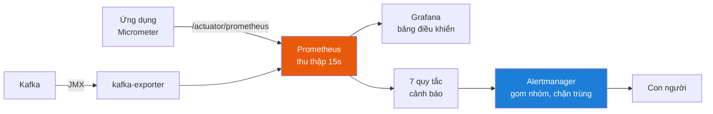
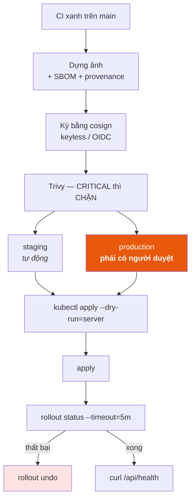

# DevOps — hạ tầng, giám sát, CI/CD

> Trang này trả lời: **hệ thống chạy ở đâu, ai canh nó, và mã đi từ máy lập
> trình viên tới đó bằng cách nào.**
>
> Phần kiến trúc Kafka nằm ở
> [`Math/10-kafka/00-SO-DO-TU-DUY.md`](Math/10-kafka/00-SO-DO-TU-DUY.md).

---

## 1. Ba mức triển khai

Nguyên tắc xuyên suốt: **mặc định phải là thứ nhẹ nhất mà vẫn chạy được.** Bắt
người ta trả giá 4 GB RAM chỉ để xem thử kết quả tìm kiếm là cách chắc chắn
nhất khiến họ không chạy lần thứ hai.

| Lệnh | Dịch vụ | RAM | Dùng khi |
|---|---:|---:|---|
| `docker compose up -d --build` | 2 | ~1,5 GB | Demo tìm kiếm |
| `docker compose --profile kafka up -d --build` | 5 | ~3 GB | Xem crawl phân tán |
| `docker compose --profile kafka --profile monitoring up -d --build` | 9 | ~4 GB | Xem trọn chuỗi quan sát |

```
mặc định        kafka                    monitoring
────────        ─────                    ──────────
postgres        + kafka                  + prometheus
backend         + kafka-ui               + grafana
                + crawler-worker         + alertmanager
                                         + kafka-exporter
```

Trên Kubernetes thì tương ứng là ba lớp kustomize:

```
deploy/k8s/base            nền chung
deploy/k8s/overlays/dev    cụm kind một node
deploy/k8s/overlays/prod   cụm thật
deploy/k8s/monitoring      lớp CHỌN THÊM, cần Prometheus Operator
```

---

## 2. Vì sao `monitoring` tách khỏi `base`

`ServiceMonitor` và `PrometheusRule` là **CRD** — chúng không có sẵn trong
Kubernetes. Đưa vào lớp nền thì mọi cụm chưa cài Prometheus Operator sẽ nhận:

```
error: unable to recognize "...": no matches for kind "ServiceMonitor"
```

và `kubectl apply -k` **thất bại toàn bộ**, kể cả những tài nguyên hợp lệ đứng
trước. Nghĩa là: thêm giám sát vào lớp nền sẽ làm hỏng việc triển khai *ứng
dụng* trên mọi cụm chưa cài thêm gì.

> **Nguyên tắc:** lớp nền chỉ chứa thứ Kubernetes tự hiểu. Mọi thứ phụ thuộc
> một operator phải là lớp chọn thêm.

Cùng lý do, overlay `dev` xoá `ScaledObject` (KEDA) — cụm kind không có KEDA.

---

## 3. Chuỗi quan sát

Trước khi có phần này, `docs/CHAM-DIEM-STARTUP.md` mô tả đúng vấn đề:

```
Ứng dụng ──▶ /actuator/prometheus ──▶  ???  ──▶  ???  ──▶  ???
   ✅              ✅                Prometheus  Grafana  Cảnh báo
                                       ❌          ❌       ❌
```

Ứng dụng đã phơi số liệu từ lâu, nhưng **không có ai thu thập**. Một thang đo
không được thu thập chỉ là một con số hiện ra khi có người gõ `curl` — và
không ai gõ `curl` lúc 3 giờ sáng.

Nay chuỗi đã đủ:



### 3.1. Bảy quy tắc cảnh báo

Nguyên tắc chọn: **chỉ cảnh báo những thứ mà một con người phải làm gì đó.**
Một cảnh báo không dẫn tới hành động sẽ bị bỏ qua, và một danh sách toàn cảnh
báo bị bỏ qua thì làm hỏng cả những cảnh báo thật.

| Cảnh báo | Mức | Bắt được gì |
|---|---|---|
| `VnSearchBackendDown` | critical | Tiến trình chết |
| `VnSearchEmptyIndex` | warning | **Mọi thang đo xanh, mọi truy vấn trả rỗng** |
| `VnSearchSearchLatencyHigh` | warning | p99 vượt SLO 500 ms |
| `VnSearchHighErrorRate` | critical | >5% request trả 5xx |
| `VnSearchCrawlBusFailing` | critical | **Crawler chạy bình thường nhưng không gì tới Modular Service** |
| `VnSearchKafkaConsumerLagHigh` | warning | Consumer không theo kịp |
| `VnSearchDeadLetterGrowing` | warning | Thông điệp hỏng lặp lại |

Bản Kubernetes có thêm `VnSearchPodCrashLooping` và `VnSearchKafkaDiskFilling`.

**Hai dòng in đậm là lý do tồn tại của cả bộ này.** Chúng bắt những ca hỏng mà
mọi thang đo kỹ thuật đều xanh — loại sự cố mà không có cảnh báo thì chỉ phát
hiện ra khi người dùng phàn nàn.

Mỗi quy tắc có trường `runbook`: người nhận cảnh báo lúc 3 giờ sáng cần **các
bước cụ thể**, không phải một câu mô tả vấn đề.

### 3.2. Một chi tiết đáng nói: cardinality

`CrawlAnalyticsService` **cố ý không** gắn nhãn `host` vào Prometheus.

```
Counter.builder("crawl.pages").tag("host", host)     ← cái bẫy
```

Prometheus tạo một chuỗi thời gian cho **mỗi tổ hợp nhãn**, mỗi chuỗi tốn
1–3 KB thường trú. Một phiên crawl chạm 30.000 host tạo 30.000 chuỗi từ *một*
thang đo. Và `host` là dữ liệu **do bên ngoài quyết định** — lực lượng không
chặn trên được. Đó là cách kinh điển để giết một máy chủ Prometheus.

| Chiều | Lực lượng | Đi đâu |
|---|---|---|
| ngôn ngữ | 3 (`vi`, `en`, `und`) | **Nhãn Prometheus** |
| host | không chặn trên | Bảng trong bộ nhớ, trần 10.000, phơi qua API quản trị |

Có một bài test canh việc này: `hostIsNeverUsedAsAPrometheusLabel` sẽ đỏ nếu
ai đó "tiện tay" thêm `tag("host", ...)` sau này.

---

## 4. Co giãn theo **độ dài hàng đợi**, không phải CPU

Đây là khác biệt bản chất giữa `backend` và `crawler-worker`.

```
                CPU thấp  +  hàng đợi dài   →  CẦN thêm worker
   HPA theo CPU:                               ❌ bỏ lỡ
   KEDA theo lag:                              ✅ nhân bản

                CPU cao   +  hàng đợi rỗng  →  KHÔNG cần thêm
   HPA theo CPU:                               ❌ nhân bản thừa
   KEDA theo lag:                              ✅ giữ nguyên
```

Worker dành phần lớn thời gian **chờ mạng** — CPU gần bằng 0 ngay cả khi nó
đang tụt lại rất xa. HPA theo CPU sẽ thấy "tải thấp" và không bao giờ nhân
bản, trong khi độ trễ tiêu thụ dài ra vô hạn.

**Trần 12 không tuỳ tiện.** Kafka giao mỗi phân hoạch cho đúng một consumer
trong một group, nên bản sao thứ 13 nằm không. `maxReplicaCount: 12` chính là
`app.crawler.kafka.partitions`.

---

## 5. CI — bốn cổng chặn, giờ là sáu

| Cổng | Bắt được gì | Job |
|---|---|---|
| 490 bài test | Logic từng khối sai | `backend` |
| Độ phủ (JaCoCo) | Mã mới không có test | `backend` |
| Phân tích tĩnh (SpotBugs + CodeQL) | Lỗi test không chạy tới | `backend`, `codeql` |
| Chất lượng xếp hạng | Tìm kiếm tệ đi mà test vẫn xanh | `backend` |
| **Tích hợp Kafka** | Serialize hỏng, phân hoạch sai, thông điệp quá lớn | `kafka-integration` |
| **Kiểm định hạ tầng** | YAML sai, PromQL sai, hai bản quy tắc lệch nhau | `infrastructure` |

### 5.1. Vì sao test tích hợp là job riêng

Hai lý do, và lý do thứ hai quan trọng hơn:

1. Nó chậm (~15 giây dựng broker), còn job chính phải nhanh.
2. **Nó hỏng vì những lý do KHÁC** — Docker không có, kéo ảnh thất bại, mạng
   chậm. Trộn vào job chính thì một sự cố hạ tầng CI trông y hệt một lỗi mã
   nguồn.

Chúng bị loại khỏi `mvnw test` bằng `@Tag("kafka-it")` + `excludedGroups`, và
chạy bằng `./mvnw verify -Pkafka-it`.

### 5.1b. Nó đã bắt được gì — và ba lần hỏng trên đường tới đó

Bộ test tích hợp này **không phải đồ trang trí**. Lần chạy đầu tiên lộ ra bốn
vấn đề, mỗi cái đáng ghi lại:

**① Một lỗi sản phẩm thật.** `ImageFound.isDownloaded()` — Jackson coi mọi
phương thức `isXxx()` là thuộc tính, nên nó ghi thêm trường `"downloaded"` vào
JSON. Trường đó không ứng với component nào của record, nên consumer đọc lại
thì ném:

```
UnrecognizedPropertyException: Unrecognized field "downloaded"
```

Ở môi trường thật: **mọi** thông điệp ảnh chết ở consumer rồi rơi vào
dead-letter topic. Bộ test in-process không thể thấy — đối tượng đi thẳng từ
tay này sang tay kia, không ai serialize cả.

Đã sửa bằng `@JsonIgnore` trên mọi accessor dẫn xuất, và **kéo phép kiểm về bộ
test nhanh** (`CrawlEventTest.JsonRoundTrip`) để lần sau nó bị bắt trong vài
mili-giây thay vì phải chờ một job có Docker. Có một bài chặn cứng việc tái
diễn: `noDerivedFieldLeaksIntoTheJson` liệt kê chính xác tập trường được phép
xuất hiện trong mỗi thông điệp.

**② Một cổng chặn luôn xanh vì không kiểm gì cả.** Hồ sơ `kafka-it` in ra:

```
Tests run: 0, Failures: 0, Errors: 0
BUILD SUCCESS
```

Hai nguyên nhân chồng lên nhau. Thứ nhất, surefire chỉ nhặt `*Test.java` —
hậu tố `IT` thuộc về failsafe, một plugin khác. Thứ hai, và tinh vi hơn: cấu
hình plugin trong `<profile>` **hợp nhất** với cấu hình ở `<build>` chứ không
thay thế, nên thẻ rỗng `<excludedGroups></excludedGroups>` không xoá được giá
trị lớp dưới. Kết quả là profile có đồng thời `<groups>kafka-it</groups>` và
`<excludedGroups>kafka-it</excludedGroups>` — loại trừ thắng.

> Một cổng chặn luôn xanh vì không kiểm gì cả **nguy hiểm hơn** một bản build
> đỏ: nó trông y hệt một cổng chặn đang hoạt động tốt.

Sửa bằng cách đưa giá trị ra một property (`test.excluded.groups`) để profile
ghi đè được, cộng `<includes>**/*IT.java</includes>`.

**③ Lệch phiên bản Docker API.** Testcontainers 1.19.8 (bản Spring Boot 3.3.4
quản lý) đi kèm docker-java 3.3.6, và client đó nói một phiên bản API mà Docker
Engine 29.x không còn nhận. Triệu chứng dẫn sai đường hoàn toàn:

```
$ docker version
29.6.1                                    ← hoàn toàn bình thường

Testcontainers: Could not find a valid Docker environment
```

Daemon **có** trả lời, nhưng trả HTTP 400 kèm khối `Info` rỗng, và
Testcontainers dịch điều đó thành "không tìm thấy Docker". Đọc thông báo theo
nghĩa đen sẽ đi tìm biến môi trường, tên named pipe, quyền truy cập — trong khi
nguyên nhân nằm ở chỗ khác hẳn. Sửa: ghim `testcontainers.version` lên 1.21.4.

**④ Test không cô lập nhau.** Mọi consumer đặt `auto.offset.reset=earliest` —
bắt buộc, vì đó là hành vi thật của hệ thống. Hệ quả là mỗi bài test đọc luôn
thông điệp các bài trước để lại rồi khẳng định sai về chúng. Sửa: cấp một bộ
topic riêng cho từng bài.

### 5.2. Job `infrastructure` kiểm gì

```
kustomize build ×4    →  cú pháp, patch trỏ vào tài nguyên không tồn tại
kubeconform -strict   →  sai kiểu dữ liệu, thiếu trường, apiVersion đã gỡ
promtool check rules  →  PromQL sai cú pháp
amtool check-config   →  Alertmanager sai cấu hình
docker compose config →  cả ba mức profile
diff tên cảnh báo     →  hai bản quy tắc lệch nhau
```

**Vì sao `promtool` đáng giá:** một biểu thức PromQL sai làm Prometheus **từ
chối nạp cả tệp** — mất toàn bộ cảnh báo, không chỉ cái viết sai. Và nó thất
bại im lặng: Prometheus vẫn chạy, vẫn thu thập, chỉ là không cảnh báo gì nữa.

**Vì sao có bước `diff` tên cảnh báo:** `deploy/monitoring/alerts.yml` và
`deploy/k8s/monitoring/prometheusrule.yaml` mô tả cùng một bộ cảnh báo cho hai
đường triển khai. Chúng không dùng chung tệp được (khác định dạng, và kustomize
không tham chiếu tệp ngoài thư mục gốc), nên phải có một bước canh — cùng cơ
chế mà `schema.sql` đang được canh.

---

## 6. CD — chặng trước đây không có

`docs/DANH-GIA-DU-AN.md` chấm CI/CD 4,0/10 với lý do: *"Chưa commit → chưa
chạy; **không có CD**"*.

```
CI  — mã có đúng không?           →  ci.yml
CD  — mã có TỚI ĐƯỢC người dùng?  →  cd.yml   ← phần mới
```

Không có CD thì triển khai là một chuỗi lệnh gõ tay, khác nhau mỗi lần, và chỉ
một người biết cách. Đó không phải quy trình — đó là **một điểm hỏng đơn lẻ có
hình dạng con người**.

### 6.1. Luồng



### 6.2. Bốn quyết định đáng giải thích

**`workflow_run` chứ không phải `push`.** Với `push`, CD chạy *song song* với
CI và có thể triển khai xong một bản mã mà bộ test còn chưa chạy tới.

**Ghim theo digest, không theo thẻ.** Thẻ là con trỏ di động: hai node kéo ảnh
ở hai thời điểm khác nhau có thể chạy hai bản mã khác nhau dưới cùng một tên.
Digest là mã băm của chính nội dung ảnh.

**Trivy CHẶN ở CD nhưng KHÔNG chặn ở CI.** Trong CI, một cổng đỏ thường trực
(ảnh nền gần như luôn có vài CVE chưa vá) sẽ bị vô hiệu hoá trong một tuần. Ở
CD thì chặn là đúng — đây là ranh giới cuối trước cụm thật.

**`rollout status` rồi mới báo xanh.** Không có bước này, workflow báo thành
công ngay sau `apply`, trong khi Pod mới có thể đang trong vòng lặp khởi động
lại. *"Đã triển khai"* phải nghĩa là *"đang chạy được"*, không phải *"đã gửi
lệnh đi"*.

---

## 7. Bảo mật hạ tầng

| Lớp | Biện pháp |
|---|---|
| Namespace | Pod Security `restricted` — Pod quên `securityContext` bị **từ chối tạo** |
| Container | `runAsNonRoot`, `readOnlyRootFilesystem`, `drop: [ALL]` |
| Mạng | NetworkPolicy cho PostgreSQL **và** Kafka |
| Ảnh | Ký cosign, SBOM, quét Trivy chặn CRITICAL |
| Bí mật | Overlay prod **cố ý xoá** `secret.yaml` của lớp nền |

### 7.1. Một lỗi đã suýt xảy ra

NetworkPolicy của PostgreSQL ban đầu chỉ cho `component: backend` vào. Khi
`crawler-worker` được tách ra, nó mang nhãn `component: crawler-worker` —
**không khớp nữa, nên bị chặn khỏi CSDL**.

Kiểu hỏng này đặc biệt khó truy: Pod khởi động bình thường, log không có gì bất
thường trong nhiều giây, rồi kết nối JDBC hết thời gian chờ. Không có thông báo
"bị NetworkPolicy chặn" ở đâu cả — gói tin chỉ đơn giản biến mất.

> **Bài học:** quy tắc mạng phải được cập nhật **cùng lúc** với việc thêm thành
> phần mới, không phải sau khi có người báo lỗi.

Cùng lý do, NetworkPolicy của Kafka cho phép cả `component: kafka` — các node
KRaft phải nói chuyện với nhau để bầu cử. Với một node thì thiếu mục đó chưa lộ
ra, nên nó sẽ là một lỗi chỉ xuất hiện **đúng lúc mở rộng quy mô**.

---

## 8. Tự chấm

| Hạng mục | Trước | Sau | Căn cứ |
|---|---:|---:|---|
| CI/CD | 4,0 | **8,5** | Có CD thật, 6 cổng chặn, kiểm định hạ tầng, ký ảnh, quay lui tự động |
| Quan sát được | 3,0 | **9,0** | Chuỗi đủ 4 chặng, 7–9 quy tắc có runbook, dashboard provision sẵn |
| Hạ tầng | 6,0 | **8,5** | Kafka + worker tách, co giãn theo lag, NetworkPolicy, 3 mức profile |
| Bảo mật vận hành | 6,5 | **8,0** | Ký ảnh, SBOM, CVE chặn ở CD, PSA restricted |

**Chỗ còn yếu, nói trước:**

1. **Kafka và PostgreSQL đều một node, không sao lưu tự động.** Đủ cho đồ án.
   Cụm thật cần ba node Kafka hoặc dịch vụ quản trị sẵn, và CloudNativePG hoặc
   RDS cho CSDL.
2. **Alertmanager không gửi đi đâu.** Cố ý — không có khoá Slack nào được phép
   nằm trong repo công khai. Chuỗi vẫn chạy thật và kiểm chứng được ở
   <http://localhost:9093>.
3. **Chưa có kiểm thử tải.** `docs/CHAM-DIEM-STARTUP.md` mục B4 đề xuất k6;
   chưa làm. Nghĩa là **chưa biết trần thông lượng thật** của hệ thống.
4. **Chưa có tracing phân tán.** Với ba service nối bằng Kafka, một request đi
   qua nhiều tiến trình mà không có `traceId` xuyên suốt. Bước hợp lý tiếp
   theo là OpenTelemetry.

---

## 9. Tra nhanh

```bash
# Chạy
docker compose up -d --build                                    # nhẹ
docker compose --profile kafka up -d --build                    # + Kafka
docker compose --profile kafka --profile monitoring up -d       # + giám sát

# Kiểm định trước khi commit
cd search-engine && ./mvnw -B clean verify                      # 490 test + 2 cổng
./mvnw verify -Pkafka-it                                        # test tích hợp
kubectl kustomize deploy/k8s/overlays/prod                      # dựng manifest

# Xem
http://localhost:8080/actuator/prometheus    số liệu thô
http://localhost:8081                        kafka-ui — topic, lag, DLT
http://localhost:9090/alerts                 Prometheus — trạng thái cảnh báo
http://localhost:3000                        Grafana (admin/admin)
http://localhost:9093                        Alertmanager
```
