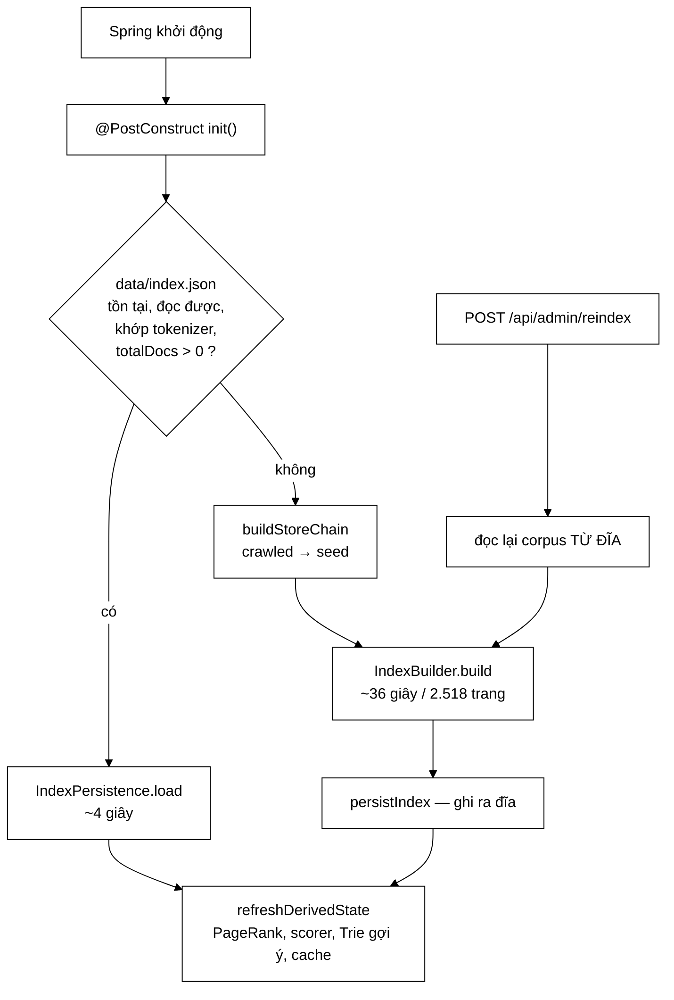
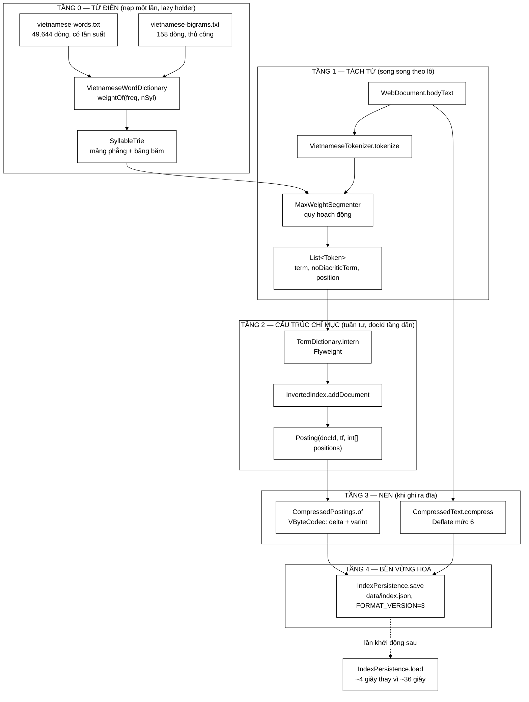
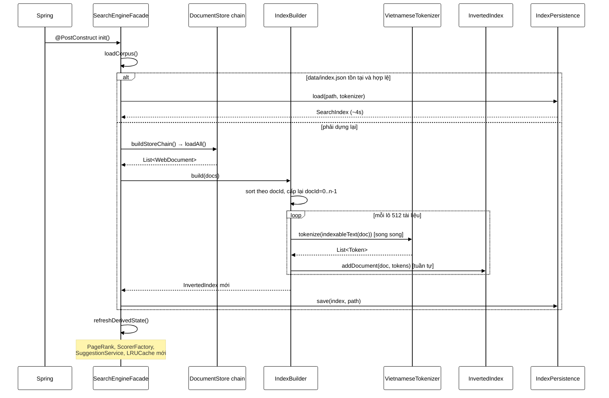
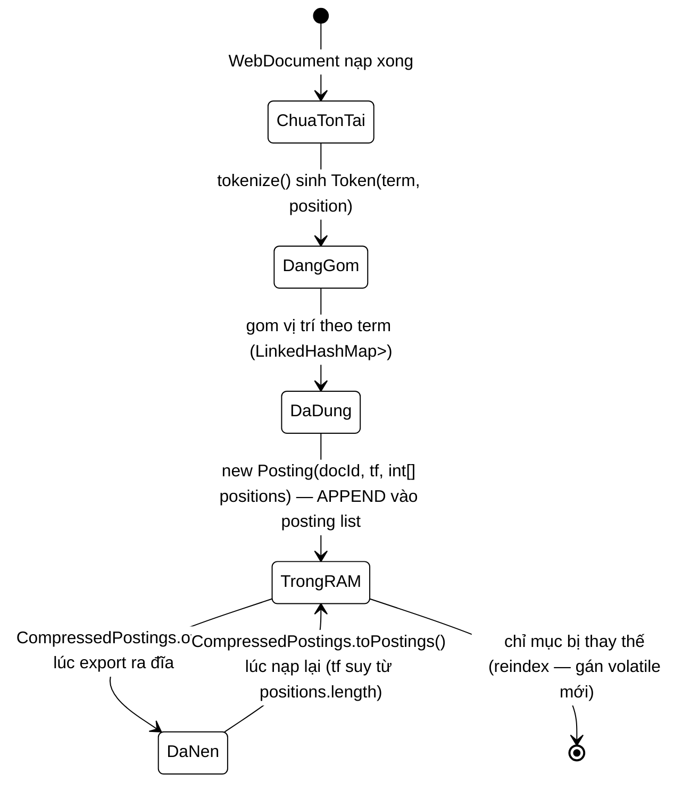
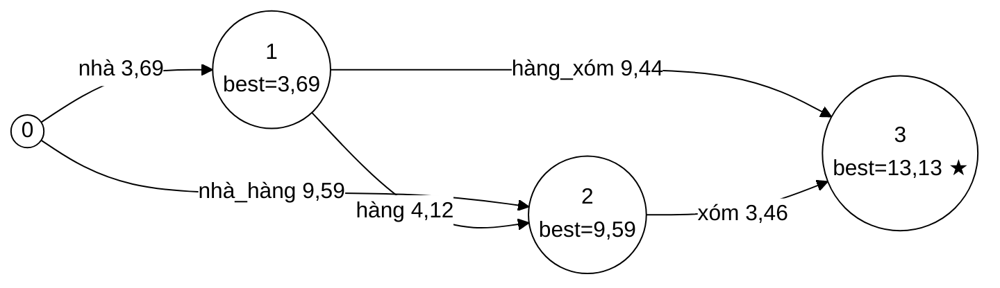
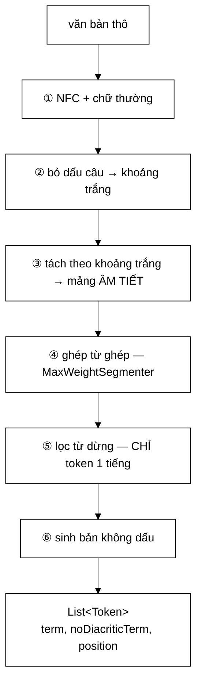
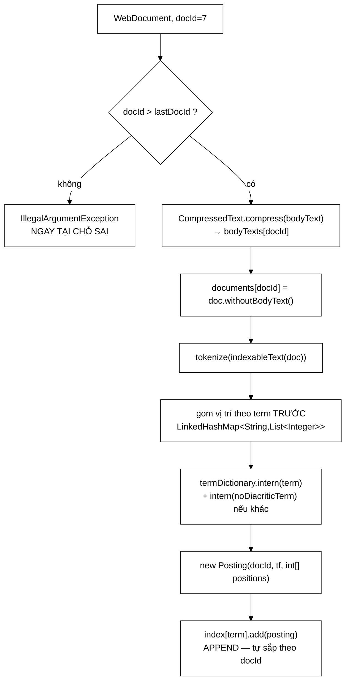
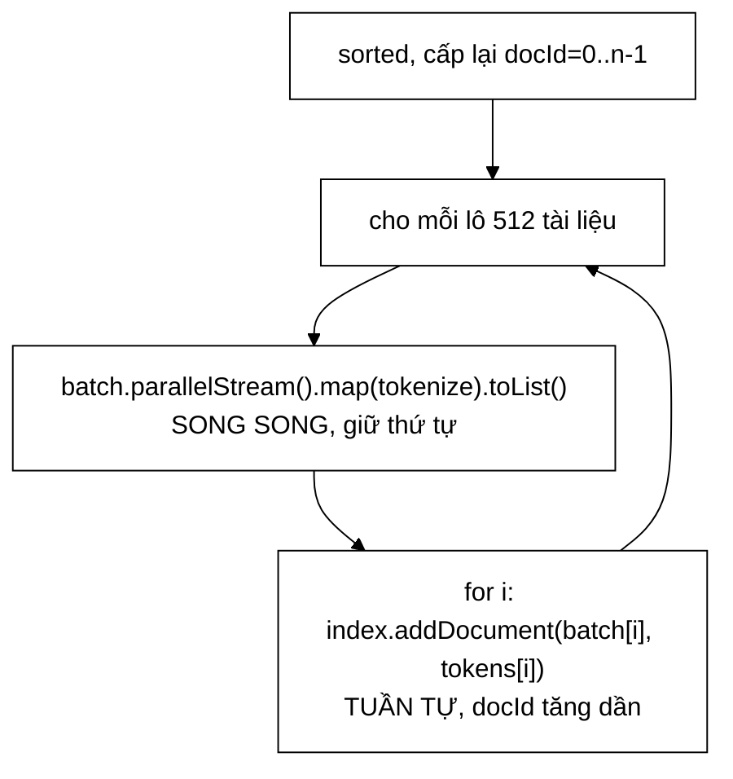
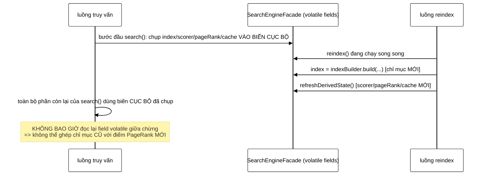

# INDEX PIPELINE — Giải phẫu toàn bộ một phiên dựng chỉ mục

### Từ `SearchEngineFacade.init()` đến `data/index.json`

---

## MỤC LỤC

### PHẦN I — TỔNG QUAN
0. Cách đọc tài liệu này
1. Hai đường đi vào tầng dựng chỉ mục
2. Ba bất biến bắt buộc
3. Bản đồ toàn hệ thống
4. Danh mục toàn bộ file tham gia
5. Sơ đồ tuần tự tổng quát
6. Vòng đời của một `Posting`
7. Bảng so sánh các cơ chế nén trong chỉ mục

### PHẦN II — TẦNG TỪ ĐIỂN VÀ TÁCH TỪ TIẾNG VIỆT
8. `VietnameseWordDictionary` — từ điển có trọng số
9. `SyllableTrie` — cây tiền tố trên âm tiết
10. `MaxWeightSegmenter` — quy hoạch động, trái tim thuật toán
11. `VietnameseTokenizer` — sáu bước từ chuỗi thô đến `Token`

### PHẦN III — TẦNG CẤU TRÚC CHỈ MỤC
12. `Posting` — đơn vị nhỏ nhất
13. `PostingCursor` / `ArrayPostingCursor` — duyệt không cấp phát, nhảy cóc
14. `TermDictionary` — Flyweight cho 7 triệu chuỗi
15. `SearchIndex` — hợp đồng, một bất biến mở khoá ba tối ưu
16. `InvertedIndex` — trái tim của tầng chỉ mục

### PHẦN IV — TẦNG NÉN
17. `VByteCodec` — varint, delta encoding
18. `CompressedPostings` — nén posting list
19. `CompressedText` — nén thân bài

### PHẦN V — BỀN VỮNG HOÁ VÀ ĐIỀU PHỐI
20. `IndexPersistence` — ghi/đọc chỉ mục, hai hàng rào
21. `IndexBuilder` — song song hoá theo lô
22. `SearchEngineFacade.init()` — dệt tất cả lại thành một phiên khởi động
23. `POST /api/admin/reindex` — dựng lại chỉ mục khi đang chạy

### PHẦN VI — ĐỐI CHIẾU OUTPUT THẬT
24. Trace tokenizer trên câu thật của corpus
25. Trace posting list nén ra byte cụ thể

### PHẦN VII — PHỤ LỤC
26. Bảng hằng số toàn hệ thống
27. Bảng tra nhanh khối ↔ file ↔ hàm
28. Câu hỏi thường gặp (FAQ)
29. Cây chẩn đoán sự cố
30. Thuật ngữ
31. Toàn cảnh một trang — cây rút gọn

---

# PHẦN I — TỔNG QUAN

## 0. Cách đọc tài liệu này

Tài liệu này là bản mở rộng đầy đủ của bản rút gọn từng có ở `docs2/INDEX-PIPELINE.md`
(cây ASCII ~200 dòng, được giữ nguyên và nâng cấp làm mục 31 ở cuối). Nó cùng
chuẩn với `docs2/CRAWLER-PIPELINE.md` — tài liệu "giải phẫu toàn bộ một phiên
crawl" — nhưng đối tượng mổ xẻ ở đây là **tầng dựng chỉ mục tìm kiếm**: từ lúc
Spring Boot gọi `@PostConstruct` trên `SearchEngineFacade` cho tới khi
`data/index.json` nằm trên đĩa và mọi truy vấn có thể tra cứu được.

### Quy ước ký hiệu

```
★   quyết định thiết kế quan trọng — cần hiểu RÕ "vì sao", không chỉ "cái gì"
⚠   hạn chế, rủi ro, hoặc lỗi im lặng đã biết (có trường hợp là sự cố THẬT đã xảy ra)
```

Mỗi mục trong PHẦN II–V trích mã nguồn thật (không diễn giải sai lệch), có sơ đồ
Mermaid kèm bản ASCII song song khi biểu diễn luồng/trạng thái, và bảng/ASCII khi
cần chi tiết cấp bit/byte. Số liệu trong tài liệu lấy từ:

- `docs2/main/java/com/vnsearch/index/*.md` — 14 tài liệu per-class rất chi tiết,
  vốn đã phân tích Javadoc, mã nguồn và test của từng lớp;
- mã nguồn thật tại `backend/java/libs/core-search/src/main/java/com/vnsearch/`;
- dữ liệu thật tại `backend/data/` (`seed-documents.json` — 40 tài liệu, 296 KB;
  `crawled-documents.json` — 384 MB; `index.json` — 403 MB).

### Ba mức chi tiết

```
   MỨC 1 — ĐỌC PHẦN I                    hiểu bức tranh toàn cảnh, 15 phút
   MỨC 2 — ĐỌC PHẦN II–V THEO THỨ TỰ     hiểu từng tầng và vì sao nó tồn tại
   MỨC 3 — ĐỐI CHIẾU PHẦN VI             thấy số liệu thật, không phải lý thuyết suông
```

### Về "điểm vào" — khác một tệp `.bat`

`CRAWLER-PIPELINE.md` bắt đầu từ một tệp `.bat` mà người vận hành gõ tay. Tầng
dựng chỉ mục **không có** điểm vào kiểu đó: nó là một khối trong vòng đời khởi
động của backend (Spring Boot), chạy tự động, không cần ai gõ lệnh. Có đúng
**hai** con đường dẫn tới `IndexBuilder.build(...)` trong toàn bộ hệ thống —
xem mục 1.

---

## 1. Hai đường đi vào tầng dựng chỉ mục

### 1.1 Đường A — khởi động backend (đường mặc định, mọi lần chạy)

```java
@Service
public class SearchEngineFacade {
    @PostConstruct
    public void init() {
        searchCache = new LRUCache<>(cacheSize);
        try {
            loadCorpus();
        } catch (IOException e) {
            log.error("Khong the nap du lieu co san, bat dau voi index rong", e);
            index = new InvertedIndex(tokenizer);
        }
        refreshDerivedState();
    }
```

`@PostConstruct` là móc nối của Spring: chạy đúng **một lần**, ngay sau khi
Spring đã tiêm xong mọi phụ thuộc của bean (`tokenizer`, `indexBuilder`,
`pageRankService`, …) nhưng trước khi bean được đưa vào phục vụ. Không có bước
thủ công nào ở đây — người vận hành chỉ cần khởi động container.

Bên trong `loadCorpus()` có **hai nhánh loại trừ nhau**:

```
   NHÁNH NHANH                          NHÁNH CHẬM (dựng lại)
   ─────────────                        ─────────────────────
   data/index.json tồn tại?             không có / hỏng / rỗng / sai tokenizer
   → IndexPersistence.load(...)         → buildStoreChain() (Chain of Responsibility)
   → nếu totalDocs() > 0: DÙNG NGAY      → JsonDocumentStore(crawled) ưu tiên
     (~4 giây, xem mục 20)                 JsonDocumentStore(seed) dự phòng
                                         → IndexBuilder.build(docs)  (~36 giây/2.518 trang)
                                         → persistIndex() — ghi ra đĩa cho lần sau
```

### 1.2 Đường B — `POST /api/admin/reindex` (khi đang chạy, có yêu cầu quản trị)

```java
@PostMapping("/reindex")
public Map<String, String> reindex() throws IOException {
    facade.reindex();
    audit.record("api-key", "REINDEX", null, "SUCCESS", null);
    return Map.of("status", "OK");
}
```

`AdminController.reindex()` gọi thẳng `SearchEngineFacade.reindex()`, luôn đọc
lại corpus **từ đĩa** (không giữ bản trong bộ nhớ — xem mục 23), gọi lại đúng
`IndexBuilder.build(docs)` như đường A, rồi ghi đè `data/index.json`.



<details><summary>Xem bản chữ (ASCII)</summary>

```
Spring khoi dong
  -> @PostConstruct init()
       -> data/index.json ton tai, doc duoc, khop tokenizer, totalDocs > 0 ?
            CO   -> IndexPersistence.load        (~4 giay)
            KHONG -> buildStoreChain (crawled uu tien, seed du phong)
                     -> IndexBuilder.build        (~36 giay / 2.518 trang)
                     -> persistIndex (ghi ra dia)
       -> refreshDerivedState (PageRank, scorer, Trie goi y, cache)

POST /api/admin/reindex
  -> doc lai corpus TU DIA (khong giu ban trong bo nho)
  -> IndexBuilder.build (giong het nhanh cham o tren)
  -> persistIndex
  -> refreshDerivedState
```

</details>

### 1.3 Vì sao có hai đường mà không hợp làm một

```
   ĐƯỜNG A phải NHANH khi có sẵn chỉ mục (người dùng chờ container khởi động)
        → ưu tiên NẠP, chỉ DỰNG khi bắt buộc

   ĐƯỜNG B phải ĐÚNG khi dữ liệu đã đổi (quản trị viên vừa crawl thêm)
        → luôn DỰNG LẠI, không bao giờ dùng file chỉ mục cũ trên đĩa

   Cả hai đều gọi chung MỘT hàm lõi — IndexBuilder.build(docs) — nên
   không có hai cách "dựng chỉ mục" khác nhau tồn tại song song.
   Khác biệt duy nhất là NGUỒN dữ liệu đầu vào và việc có ưu tiên
   đường nhanh (nạp từ đĩa) hay không.
```

---

## 2. Ba bất biến bắt buộc

Toàn bộ tầng chỉ mục — từ tokenizer tới định dạng nén trên đĩa — chỉ đúng khi
ba điều sau **luôn** giữ. Cả hai đường A và B đều phải giữ chúng; vi phạm bất kỳ
điều nào cũng dẫn tới lỗi **im lặng**, không phải lỗi ném ra ngay.

### Bất biến 1 — `docId` tăng dần nghiêm ngặt

```java
// InvertedIndex.addDocument
if (docId <= lastDocId) {
    throw new IllegalArgumentException(
            "addDocument phai duoc goi theo docId TANG DAN de giu bat bien"
                    + " 'posting list sap xep theo docId'. …");
}
```

```
   ĐƯỢC BẢO ĐẢM BỞI:
   ├─ IndexBuilder.build() sort tài liệu theo docId TRƯỚC khi nạp,
   │  rồi CẤP LẠI docId = 0..n-1 (không tin số có sẵn trong tài liệu)
   └─ InvertedIndex tự ÉP bằng trường lastDocId — hai lớp bảo vệ độc lập

   MỞ KHOÁ:
   ├─ posting list tự sắp xếp theo docId — KHÔNG tốn một phép sort nào
   ├─ giao hai posting list bằng two-pointer O(m+n), hoặc galloping O(m log(n/m))
   ├─ binary search trong getTermFrequency/getPositions — O(log n)
   └─ nén delta encoding — hiệu (delta) luôn nhỏ hơn giá trị tuyệt đối rất nhiều

   VI PHẠM:
   → IllegalArgumentException NGAY tại addDocument (lớp bảo vệ có sẵn)
   → nếu lớp bảo vệ đó bị gỡ: binary search trên mảng chưa sắp xếp
     trả về một chỉ số HỢP LỆ nhưng SAI, không ném gì cả
```

### Bất biến 2 — tầng chỉ mục và tầng truy vấn dùng CHUNG một tokenizer

```java
// SearchEngineFacade constructor
this.queryParser = new QueryParser(tokenizer);   // CÙNG object với IndexBuilder
```

```
   ĐƯỢC BẢO ĐẢM BỞI:
   ├─ SearchConfig khai đúng MỘT bean VietnameseTokenizer (Spring singleton)
   ├─ SearchEngineFacade tiêm CÙNG bean đó vào cả IndexBuilder và QueryParser
   └─ IndexPersistence.save() ghi Tokenizer.name() vào file; .load() so khớp

   VI PHẠM:
   → KHÔNG ngoại lệ, KHÔNG log, KHÔNG test đỏ
   → mọi truy vấn trả về RỖNG một cách khó hiểu
   → SỰ CỐ THẬT ĐÃ XẢY RA: từ điển đổi từ 154 → 49.793 mục, câu
     "không trung thực" trước tách thành [không_trung][thực], sau
     thành [không][trung_thực] — chỉ mục cũ (v2, đúng định dạng,
     nạp trót lọt) không còn khớp với truy vấn mới. Ba tầng phòng
     thủ đều KHÔNG bắt được: version ✓, Jackson ✓, test ✓ (test tự
     dựng cả hai phía cùng lúc nên không thấy gì). Hàng rào
     checkTokenizerMatches() trong IndexPersistence được thêm SAU
     sự cố này — xem mục 20.
```

### Bất biến 3 — `termFrequency == positions.length`

```java
// CompressedPostings.of
if (posting.termFrequency() != size) {
    throw new IllegalArgumentException(
            "Bat bien 'termFrequency == positions.size()' bi vi pham …");
}
```

```
   ĐƯỢC BẢO ĐẢM BỞI:
   InvertedIndex.addDocument GOM vị trí theo term trước, rồi mới dựng
   Posting(docId, viTri.size(), toIntArray(viTri)) — CÙNG một danh sách
   cấp cho cả hai tham số, nên hai con số không thể lệch nhau.

   MỞ KHOÁ:
   Dạng nén (CompressedPostings) KHÔNG lưu termFrequency — suy lại
   từ positions.length lúc giải nén. Tỉ lệ nén của việc bỏ hẳn một
   trường là VÔ HẠN (mục 18).

   VI PHẠM:
   → CompressedPostings.of() ném NGAY (hàng rào ép bất biến)
   → nếu hàng rào bị gỡ: giải nén ra tf SAI một cách im lặng,
     BM25 chấm điểm sai, thứ hạng lệch — "kết quả tìm kiếm hơi kỳ"
     hàng tháng sau, không ai nghĩ tới việc mở file nén ra xem
```

---

## 3. Bản đồ toàn hệ thống



<details><summary>Xem bản chữ (ASCII)</summary>

```
TANG 0 - TU DIEN (nap mot lan, lazy holder)
  vietnamese-words.txt (49.644 dong, co tan suat) --+
  vietnamese-bigrams.txt (158 dong, thu cong)     --+--> VietnameseWordDictionary.weightOf
                                                       --> SyllableTrie (mang phang + bang bam)

TANG 1 - TACH TU (song song theo lo)
  WebDocument.bodyText --> VietnameseTokenizer.tokenize
  SyllableTrie --> MaxWeightSegmenter (quy hoach dong)
  --> List<Token> (term, noDiacriticTerm, position)

TANG 2 - CAU TRUC CHI MUC (tuan tu, docId tang dan)
  List<Token> --> TermDictionary.intern (Flyweight)
  --> InvertedIndex.addDocument
  --> Posting(docId, tf, int[] positions)

TANG 3 - NEN (khi ghi ra dia)
  Posting --> CompressedPostings.of (VByteCodec: delta + varint)
  WebDocument.bodyText --> CompressedText.compress (Deflate muc 6)

TANG 4 - BEN VUNG HOA
  --> IndexPersistence.save (data/index.json, FORMAT_VERSION=3)
  -- lan khoi dong sau --> IndexPersistence.load (~4s thay vi ~36s)
```

</details>

### 3.1 Vì sao thứ tự các tầng không tuỳ tiện

```
   TỪ ĐIỂN phải nạp XONG trước khi tách từ chạm câu đầu tiên
        (MaxWeightSegmenter cần trie đã đầy đủ)

   TÁCH TỪ phải chạy XONG cho một lô trước khi InvertedIndex nạp lô đó
        (song song hoá đúng phần thuần tính toán; nạp phải tuần tự
         vì phải giữ docId tăng dần — xem Bất biến 1)

   NÉN chỉ xảy ra ở BIÊN ghi-ra-đĩa, KHÔNG xảy ra trong bộ nhớ khi
   đang phục vụ truy vấn — InvertedIndex trong RAM giữ Posting ở
   dạng int[] thô (nhanh để đọc), chỉ CompressedPostings (khi export)
   và CompressedText (bodyText, ngay từ addDocument) là ở dạng nén.
```

### 3.2 Bản đồ gói (package)

```
com.vnsearch.index          — lõi thuật toán: tokenizer, chỉ mục, nén, bền vững hoá
com.vnsearch.datastructure  — SyllableTrie, Trie (core-common, dùng chung)
com.vnsearch.service        — IndexBuilder, SearchEngineFacade (điều phối)
com.vnsearch.controller     — AdminController (REST endpoint /api/admin/reindex)
com.vnsearch.model          — WebDocument (đơn vị tài liệu)
com.vnsearch.ranking        — PageRankService, ScorerFactory (dùng SAU khi có chỉ mục)
com.vnsearch.query          — QueryParser (dùng CHUNG tokenizer với tầng chỉ mục)
```

---

## 4. Danh mục toàn bộ file tham gia

### 4.1 Gói `com.vnsearch.index` (`backend/java/libs/core-search/src/main/java/com/vnsearch/index/`)

| # | File | Dòng | Vai trò |
|---|---|---|---|
| 1 | `Tokenizer.java` | 38 | Giao diện tách từ — Strategy pattern |
| 2 | `VietnameseWordDictionary.java` | 266 | Từ điển từ ghép có trọng số, nạp 2 tệp tài nguyên |
| 3 | `VietnameseTokenizer.java` | 314 | Cài đặt duy nhất của `Tokenizer` |
| 4 | `MaxWeightSegmenter.java` | 157 | Quy hoạch động phân đoạn trọng số cực đại |
| 5 | `Posting.java` | 80 | `record` — đơn vị nhỏ nhất của chỉ mục ngược |
| 6 | `PostingCursor.java` | 72 | Giao diện con trỏ duyệt — Iterator pattern |
| 7 | `ArrayPostingCursor.java` | 108 | Cài đặt cursor, package-private |
| 8 | `TermDictionary.java` | 100 | Flyweight cho chuỗi term |
| 9 | `SearchIndex.java` | 87 | Giao diện chỉ mục — hợp đồng cho tầng truy vấn/xếp hạng |
| 10 | `InvertedIndex.java` | 458 | **Cài đặt chỉ mục ngược — lớp lớn và quan trọng nhất** |
| 11 | `VByteCodec.java` | 241 | Mã hoá số nguyên biến độ dài (varint) |
| 12 | `CompressedPostings.java` | 152 | Nén posting list: delta + VByte |
| 13 | `CompressedText.java` | 88 | Nén thân bài bằng `Deflater` thô |
| 14 | `IndexPersistence.java` | 223 | Ghi/đọc chỉ mục ra `data/index.json` |

### 4.2 Gói `com.vnsearch.datastructure` (`backend/java/libs/core-common/...`)

| # | File | Vai trò |
|---|---|---|
| 15 | `SyllableTrie.java` | Trie trên âm tiết, mảng phẳng + bảng băm tự cài |
| 16 | `Trie.java` | Trie tổng quát trên ký tự — dùng cho `SuggestionService`, không phải tầng index |

### 4.3 Gói `com.vnsearch.service` (điều phối)

| # | File | Vai trò |
|---|---|---|
| 17 | `IndexBuilder.java` | Dựng `InvertedIndex` mới từ `List<WebDocument>`, song song theo lô |
| 18 | `SearchEngineFacade.java` | Facade — `init()`, `loadCorpus()`, `persistIndex()`, `reindex()`, `refreshDerivedState()` |

### 4.4 Gói `com.vnsearch.controller`

| # | File | Vai trò |
|---|---|---|
| 19 | `AdminController.java` | `POST /api/admin/reindex` — đường B vào tầng dựng chỉ mục |

### 4.5 Tài nguyên tĩnh (`backend/java/libs/core-search/src/main/resources/`)

| # | File | Dòng | Vai trò |
|---|---|---|---|
| 20 | `vietnamese-words.txt` | 49.644 | Từ điển từ ghép chính, có tần suất |
| 21 | `vietnamese-bigrams.txt` | 158 | Từ điển thủ công theo miền đề tài |
| 22 | `vietnamese-stopwords.txt` | 99 | Danh sách từ dừng (chỉ lọc token 1 tiếng) |

### 4.6 Dữ liệu thật dùng để trace (`backend/data/`)

| # | File | Kích thước | Vai trò |
|---|---|---|---|
| 23 | `seed-documents.json` | 296 KB, 40 tài liệu | Corpus mẫu đi kèm repo — dùng để trace trong PHẦN VI |
| 24 | `crawled-documents.json` | 384 MB | Corpus crawl thật, quy mô lớn |
| 25 | `index.json` | 403 MB | Chỉ mục đã dựng — dùng để lấy số liệu quy mô thật |

---

## 5. Sơ đồ tuần tự tổng quát



<details><summary>Xem bản chữ (ASCII)</summary>

```
Spring -> Facade.init() [@PostConstruct]
  Facade -> loadCorpus()
    NEU index.json hop le:
        Facade -> IndexPersistence.load -> SearchIndex (~4s)
    NGUOC LAI:
        Facade -> buildStoreChain -> DocumentStore.loadAll -> List<WebDocument>
        Facade -> IndexBuilder.build(docs)
            sort theo docId, cap lai docId = 0..n-1
            VOI MOI LO 512 tai lieu:
                tokenize song song (parallelStream)
                addDocument tuan tu (mot luong)
        Facade -> IndexPersistence.save
  Facade -> refreshDerivedState()
    PageRank, ScorerFactory, SuggestionService, LRUCache moi
```

</details>

---

## 6. Vòng đời của một `Posting`

`Posting` đóng vai trò tương tự `WebDocument` trong `CRAWLER-PIPELINE.md`: nó là
đối tượng dữ liệu trung tâm mà mọi tầng phía trên xây dựng, biến đổi và cuối
cùng nén lại.



<details><summary>Xem bản chữ (ASCII)</summary>

```
[chua ton tai]
  -> tokenize() sinh Token(term, position)                [DANG GOM]
  -> gom vi tri theo term (LinkedHashMap<String,List<Integer>>)  [DA DUNG]
  -> new Posting(docId, tf, int[] positions) -- APPEND     [TRONG RAM]
  -> CompressedPostings.of() luc export                    [DA NEN tren dia]
  -> CompressedPostings.toPostings() luc nap lai            [TRONG RAM tro lai]
     (tf duoc SUY LAI tu positions.length, khong doc truc tiep)
  -> chi muc bi thay the (reindex) -- gan volatile moi      [*]
```

</details>

### 6.1 Trạng thái của `Posting` sau mỗi bước

| Bước | `docId` | `termFrequency` | `positions` |
|---|---|---|---|
| Sau `tokenize` | chưa gán (thuộc `Token`, không thuộc `Posting`) | — | — |
| Sau gom vị trí | biết trước (đến từ `WebDocument`) | = số phần tử trong `List<Integer>` | `List<Integer>` tạm |
| `new Posting(...)` | cố định | = `positions.length` (bất biến 3) | `int[]`, đã chuyển từ `List<Integer>` |
| Sau `CompressedPostings.of` | mã hoá trong `docIds` (delta+VByte) | **KHÔNG lưu** — suy từ `offsets` | mã hoá trong `positions` (đoạn độc lập) |
| Sau `toPostings()` | giải mã | = `segment.length` | giải mã, khôi phục nguyên vẹn |

### 6.2 `Posting` KHÔNG bao giờ đi qua các bước theo hướng khác

Không có API nào sửa một `Posting` đã tồn tại trong posting list — chỉ APPEND
(bất biến 1) hoặc THAY THẾ TOÀN BỘ chỉ mục (reindex, mục 23). Đây là lý do
`Posting` là `record` bất biến (ở mức tham chiếu ba trường; nội dung mảng
`positions` vẫn kỹ thuật sửa được — xem PHẦN III mục 12).

---

## 7. Bảng so sánh các cơ chế nén trong chỉ mục

Ba nơi trong tầng chỉ mục dùng "nén", nhưng chọn ba chiến lược khác nhau —
đúng vì ba bài toán khác nhau về **cách dữ liệu được đọc**:

| | `VByteCodec` + `CompressedPostings` | `CompressedText` | (không dùng) GZIP toàn file |
|---|---|---|---|
| Dữ liệu | posting list (docId, positions) | thân bài văn bản | — |
| Cách đọc | **ngẫu nhiên theo term** — một truy vấn chạm 3/136.768 term | **trọn vẹn một tài liệu** — sinh đoạn trích cho top-10 | mọi lúc đọc phải giải nén toàn bộ |
| Kỹ thuật | delta encoding + varint, mỗi term một khối byte độc lập | Deflate mức 6 (thuật toán tổng quát) | Deflate/GZIP tổng quát trên cả file |
| Tỉ lệ nén | ~75% | ~72% | tốt hơn ~5–10 điểm phần trăm |
| Truy cập ngẫu nhiên | **CÓ** — đọc đúng term cần | không cần (đọc trọn 1 tài liệu) | **KHÔNG** — phải giải nén hết mới đọc được 1 phần |
| Vì sao không đổi cho nhau | posting list cần random access theo term; dùng GZIP mất khả năng đó | văn bản đọc trọn vẹn nên nén tổng quát không mất gì | — |

```
   BÀI HỌC CHUNG (nêu lại ở mục 18 và mục 19):

   "Dự án dùng thuật toán nén gì?" là câu hỏi SAI.
   Câu hỏi đúng: "dữ liệu này được ĐỌC như thế nào?"

        Đọc ngẫu nhiên từng phần  →  nén từng phần độc lập (CompressedPostings)
        Đọc trọn vẹn một lần      →  nén tổng quát, tỉ lệ tốt nhất (CompressedText)
```

Ba mốc đo thật của định dạng file (`IndexPersistence`, mục 20) minh hoạ thêm một
bài học đo lường: **không bao giờ đổi hai biến (thụt dòng JSON + thuật toán nén)
cùng lúc rồi báo một tỉ lệ duy nhất.**

---

# PHẦN II — TẦNG TỪ ĐIỂN VÀ TÁCH TỪ TIẾNG VIỆT

Tiếng Việt viết rời theo **âm tiết** (tiếng), không theo **từ**. "máy tính lượng
tử" là 4 tiếng nhưng 2 từ. Máy phải tự đoán ranh giới từ trước khi bất kỳ chỉ
mục nào có nghĩa — đây là lý do `Tokenizer` được gọi là "trần chất lượng" của cả
hệ thống (mục 8): mọi thuật toán xếp hạng phía trên chỉ hoạt động tốt bằng đúng
những gì tầng này đưa cho nó.

Thứ tự đọc trong PHẦN này đi từ **dữ liệu** (từ điển có trọng số) tới **cấu trúc
tra cứu** (trie) tới **thuật toán** (quy hoạch động) tới **lớp lắp ráp** (tokenizer)
— đúng thứ tự phụ thuộc mà `docs2/main/roadmap.md` "Chặng 4" quy định.

## 8. `VietnameseWordDictionary` — từ điển có trọng số

**File:** `VietnameseWordDictionary.java` (266 dòng). Nạp hai tệp tài nguyên:

| Tệp | Số dòng thật | Có tần suất? |
|---|---|---|
| `vietnamese-words.txt` | **49.644** | Có (đo từ corpus lớn) |
| `vietnamese-bigrams.txt` | **158** | Không — mỗi mục nhận `CURATED_FREQUENCY = 10_000_000` |

### 8.1 Vì sao "có/không" không đủ — phải là "bao nhiêu"

Từ điển cũ (chỉ `vietnamese-bigrams.txt`, khi đó 154 mục) chỉ trả lời **có/không**
một chuỗi có phải từ ghép. Với câu trả lời nhị phân, khi hai cách tách đều hợp
lệ về từ điển, thuật toán **không có cơ sở để chọn** — nó buộc phải đoán bằng
heuristic "lấy cái dài nhất" (Longest Matching), và heuristic đó sai ở những câu
nhập nhằng (xem ví dụ "nhà hàng xóm" ở mục 10).

```
   TỪ TẬP HỢP NHỊ PHÂN SANG ÁNH XẠ CÓ TRỌNG SỐ

   "nhà hàng" ∈ tuDien ?  → true         weight("nhà hàng") = 9,59
   "hàng xóm" ∈ tuDien ?  → true         weight("hàng xóm") = 9,44
   ⇒ hai câu trả lời giống hệt nhau      weight("nhà")      = 3,69
   ⇒ không có gì để so sánh              weight("xóm")      = 3,46
   ⇒ phải ĐOÁN                           ⇒ so được TỔNG: 13,05 vs 13,13 → CHỌN
```

### 8.2 Công thức trọng số — nguyên văn từ Cốc Cốc

```java
public double weightOf(int frequency, int syllables) {
    int spaceCount = syllables - 1;
    double freqPower = param[spaceCount << 1];
    double lenPower  = param[(spaceCount << 1) | 1];
    return Math.pow(log2(frequency + 3.0), freqPower)
            * Math.pow(spaceCount + 1, lenPower);
}
```

```java
static final double[] PARAM = {
        0.38, 1.00,   // 1 âm tiết
        0.14, 2.59,   // 2 âm tiết
        1.42, 4.42,   // 3 âm tiết
        1.45, 0.23,   // 4 âm tiết
        0.10          // chặn trên của bảng — 9 phần tử
};
```

★ **Hai chi tiết không hiển nhiên trong công thức, cả hai đều quan trọng:**

1. **`log2(freq)` chứ không phải `freq`.** Tần suất trải từ 10 tới hơn 2 tỉ —
   hơn 8 bậc độ lớn. Dùng thẳng tuyến tính, một từ cực phổ biến sẽ áp đảo mọi
   tổ hợp khác và quy hoạch động biến thành "luôn chọn từ phổ biến nhất" — một
   heuristic khác, chỉ tệ hơn. `log2` nén tầm giá trị về khoảng 3..31 — cùng
   bậc với thành phần độ dài (`pow(spaceCount+1, lenPower)` với `lenPower` tới
   4,42 cho 3 âm tiết cho ra ~130). **Nguyên tắc: khi gộp hai tín hiệu vào một
   điểm số, chúng phải có tầm giá trị so sánh được** — cùng vấn đề đã gặp ở
   `DefaultPrioritizer` của tầng crawler.

2. **`+3` trước khi lấy log.** Với `freq = 1`, `log2(1) = 0` và `pow(0, x) = 0`
   — nghĩa là một từ THẬT trong từ điển bị đối xử như "không phải từ" (weight =
   0, đúng bằng giá trị dành cho chuỗi vô nghĩa). `+3` đưa `log2(1+3) = 2`, cách
   xa cả điểm 0 của log lẫn điểm bất động 1 của luỹ thừa (`+1` sẽ cho
   `log2(2)=1`, và `pow(1, bất kỳ) = 1` — vô hiệu hoá hoàn toàn thành phần tần
   suất với từ hiếm nhất).

⚠ **Bảng `PARAM` không đơn điệu theo độ dài, và đó không phải nguyên lý ngôn
ngữ học** — nó là kết quả đo tham số trên dữ liệu nội bộ của Cốc Cốc. `lenPower`
đi 1,00 → 2,59 → 4,42 → 0,23: từ 3 âm tiết được ưu ái nhất, từ 4 âm tiết tụt hẳn
gần bằng từ 1 âm tiết. `PARAM` được đưa qua tham số constructor đúng vì lý do
này — để chạy được thí nghiệm ablation trên chính nó thay vì coi là chân lý.

★ **Giới hạn `MAX_SYLLABLES = 4` không phải lựa chọn tuỳ ý** — nó là chặn trên
cứng của bảng `PARAM` (9 phần tử). `weightOf(freq, 5)` sẽ đọc `param[9]` — tràn
mảng. Muốn hỗ trợ 5 âm tiết phải đo thêm một cặp tham số, không thể chỉ đổi hằng
số.

### 8.3 `UNKNOWN_SYLLABLE_WEIGHT = 0.5` — hai ràng buộc phải thoả đồng thời

```java
public static final double UNKNOWN_SYLLABLE_WEIGHT = 0.5;
```

```
   ① PHẢI DƯƠNG — nếu = 0, mọi cách tách chứa từ ngoài từ điển (tên riêng,
      từ mượn) được coi NHƯ NHAU, mất khả năng phân biệt đúng chỗ cần nhất.
   ② PHẢI NHỎ HƠN trọng số của âm tiết CÓ trong từ điển (thấp nhất ~1,5) —
      nếu lớn hơn, thuật toán ưu tiên tách lẻ mọi thứ, từ điển thành vô dụng.

   0,5 nằm gọn giữa hai ràng buộc:  0  <  0,5  <  1,5
```

### 8.4 `CURATED_FREQUENCY = 10_000_000` — gán tần suất cho tệp không có số

`vietnamese-bigrams.txt` chứa cụm từ đặc thù đề tài ("công cụ tìm kiếm", "an
toàn thông tin") mà từ điển tổng quát không có, nhưng không đi kèm số liệu tần
suất thật. `10_000_000` là ước lượng "tương đương một cụm từ khá phổ biến, đủ
để cạnh tranh với từ điển lớn nhưng không áp đảo nó" — `log2(10.000.000+3) ≈
23,3` so với `log2(45.231+3) ≈ 15,5` của một từ khá phổ biến trong từ điển lớn.
⚠ Con số này **chưa được đo** — là ước lượng hợp lý, không phải kết quả thực nghiệm.

### 8.5 `normalize` — chống lỗi im lặng NFC/NFD

```java
static String normalize(String s) {
    return Normalizer.normalize(s.trim(), Normalizer.Form.NFC)
            .toLowerCase(Locale.forLanguageTag("vi"));
}
```

★ Chữ "ế" có hai biểu diễn Unicode khác byte nhau nhưng **giống hệt trên màn
hình**: dạng NFC là 1 ký tự (U+1EBF), dạng NFD là 3 ký tự (e + dấu mũ + dấu sắc).
Nếu từ điển nạp ở một dạng và tokenizer tra ở dạng kia, `equals()` luôn `false`
— **không lỗi nào được ném**, chỉ là mọi từ ghép bị tách lẻ và chất lượng sụp
đổ âm thầm. Cả từ điển lẫn tokenizer đều phải đi qua đúng hàm `normalize` này.
Tiếng Việt dễ gặp lỗi này hơn ngôn ngữ khác vì có tới hai dấu chồng lên một
nguyên âm (dấu mũ/móc + dấu thanh) — nhiều tổ hợp NFD hơn, và các nguồn dữ liệu
khác nhau (macOS dùng NFD, hầu hết web dùng NFC) không thống nhất.

### 8.6 Hai tối ưu lúc nạp

`parsePositiveInt` quét trực tiếp trên chuỗi thay vì `Integer.parseInt(substring)`
— tránh cấp phát một `String` tạm cho mỗi trong 49.644 dòng. Dung lượng trie ban
đầu `1 << 16` (65.536 ô, ~2 MB) được chọn bằng **đo thật** qua `TokenizerBenchmark`
(từ điển sinh ~50.000 cạnh) — ước lượng ban đầu `1 << 19` từng lãng phí gấp 7 lần.

---

## 9. `SyllableTrie` — cây tiền tố trên âm tiết

**File:** `backend/java/libs/core-common/.../datastructure/SyllableTrie.java` (302 dòng).

★ **"Nút" chỉ là một chỉ số `int`, không phải đối tượng.** Thuộc tính của nút
nằm trong mảng song song `weight[]`; cạnh nằm trong MỘT bảng băm địa chỉ mở tự
cài cho **cả cây** (không phải mỗi nút một `HashMap` con), với khoá
`(nútCha << 32) | idÂmTiết` đóng gói thành `long`.

```
   SO SÁNH BỘ NHỚ — 460.000 nút, ~460.000 cạnh (từ điển hiện tại)

   CÁCH TỰ NHIÊN (Node object + HashMap mỗi nút)      ≈ 45–60 MB
   CÁCH Ở ĐÂY (ba mảng song song, một bảng băm chung)  ≈ 16,3 MB
   ⇒ tiết kiệm ~3 lần, và 3 object thay vì 1,4 triệu
```

★ **Lợi ích lớn hơn cả bộ nhớ: cắt nhánh.** `HashSet<String>` chỉ trả lời "chuỗi
X có trong từ điển không?". Trie trả lời thêm câu `HashSet` không trả lời được:
"**còn từ nào dài hơn bắt đầu từ đây không?**" — nếu `child(...)` trả về
`NONE`, dừng ngay, khỏi thử các độ dài còn lại. Với văn bản thật, phần lớn vị
trí không mở đầu từ ghép nào — cắt nhánh sau bước đầu tiên là trường hợp phổ
biến nhất. Đây là lý do cách cũ (dựng chuỗi ứng viên rồi tra `HashSet`, gây ra
~15 triệu lần cấp phát vô ích trên corpus 5.011 trang, ~1,65 GB rác) bị thay
bằng đi trie một lượt.

Xem chi tiết cắt nhánh trong thuật toán chính ở mục 10.

---

## 10. `MaxWeightSegmenter` — quy hoạch động, trái tim thuật toán

**File:** `MaxWeightSegmenter.java` (157 dòng). Đây là lớp mà `docs2/main/roadmap.md`
gọi là "điểm cộng thuật toán rõ nhất của tầng này" — dành phần lớn nhất của mục
này để trace nó từng bước trên một câu thật.

### 10.1 Vì sao thuật toán tham lam sai — và sai một cách không sửa được

```
   "nhà hàng xóm"

   ── LONGEST MATCHING (tham lam) ──────────────────────────
   Tại i=0, thấy "nhà hàng" CÓ trong từ điển → LẤY NGAY, nhảy qua
        → [nhà_hàng] [xóm]   = "quán ăn" + "xóm"       ✗ SAI

   ── QUY HOẠCH ĐỘNG (hiện tại) ────────────────────────────
   So sánh CẢ HAI cách trên toàn cục:
        [nhà_hàng][xóm]  = 9,59 + 3,46 = 13,05
        [nhà][hàng_xóm]  = 3,69 + 9,44 = 13,13   ← LỚN HƠN
        → [nhà] [hàng_xóm]  = "nhà của người hàng xóm"  ✓ ĐÚNG
```

★ Cả hai cách tách đều **hợp lệ về từ điển** — cả "nhà hàng" lẫn "hàng xóm" đều
có trong từ điển. Tham lam quyết định **tại chỗ**, dựa trên thông tin cục bộ;
quyết định đó **không thể rút lại** — nó tiêu mất những âm tiết mà một cách
tách tốt hơn ở phía sau cần đến. Ranh giới từ đúng phụ thuộc vào ngữ cảnh phía
sau, nên không có heuristic cục bộ nào đúng trong mọi trường hợp. Sửa heuristic
("ưu tiên từ 2 tiếng"?) chỉ đổi tập ví dụ sai, không xoá được lớp lỗi.

### 10.2 Bài toán: đường đi trọng số lớn nhất trên DAG

```
   best[i] = tổng trọng số LỚN NHẤT của một cách tách i âm tiết đầu tiên

   best[0] = 0
   best[j] = max( best[i] + weight(âmTiết[i..j)) )  với mọi i sao cho j − i ≤ 4

   Đáp án ở best[n]; cách tách cụ thể truy ngược bằng mảng trace.
```

Đây là bài toán **đường đi dài nhất trên DAG**: đỉnh là ranh giới giữa các âm
tiết (0..n), cạnh `i → i+L` tồn tại nếu âm tiết `[i, i+L)` là một từ trong từ
điển, trọng số cạnh là `weight` của từ đó. Đường đi dài nhất trên đồ thị nói
chung là NP-khó, nhưng trên DAG thì $O(V+E)$ — chỉ cần duyệt đỉnh theo thứ tự
tô-pô. Ở đây các đỉnh `0..n` **đã sẵn** ở thứ tự tô-pô (mọi cạnh đi từ chỉ số
nhỏ tới chỉ số lớn), nên một lượt quét tiến là đủ — không cần chạy thuật toán
sắp xếp tô-pô riêng.

### 10.3 Vòng lặp chính

```java
for (int i = 0; i < n; i++) {
    if (best[i] == Double.NEGATIVE_INFINITY) {
        continue;                                        // ① đỉnh không tới được
    }
    relax(best, trace, i + 1, best[i] + unknownSyllableWeight, i);   // ② luôn có lối thoát
    int node = trie.root();                              // ③ đi trie MỘT lượt
    int maxEnd = Math.min(n, i + VietnameseWordDictionary.MAX_SYLLABLES);
    for (int j = i; j < maxEnd; j++) {
        node = trie.child(node, trie.idOf(syllables[j]));
        if (node == SyllableTrie.NONE) {
            break;                                       // ④ cắt nhánh
        }
        if (trie.isWord(node)) {
            relax(best, trace, j + 1, best[i] + trie.weightAt(node), i);
        }
    }
}
```

★ **Dòng ② — "luôn cho phép tách một âm tiết" — dòng cứu cả thuật toán.** Nếu
bỏ dòng này, một tên riêng hay từ mượn nằm giữa câu (ví dụ "công ty **Nvidia**
phát triển") không có cạnh nào đi ra khỏi đỉnh của nó ⇒ `best[n] = -∞` ⇒
`traceBack` chạy trên trace toàn 0 ⇒ vòng lặp vô hạn hoặc kết quả rác. Với dòng
②, mọi đỉnh luôn có ít nhất một cạnh `i → i+1`, nên đồ thị luôn liên thông từ 0
tới n. `unknownSyllableWeight` (0,5) đủ thấp để mọi cách tách dùng từ có trong
từ điển đều thắng.

Dòng ①, dù không bao giờ chạy trong luồng hiện tại (nhờ ② bảo đảm liên thông),
vẫn là phòng thủ cho hai tình huống: ai đó bỏ dòng ② để "tối ưu", hoặc
`unknownSyllableWeight` được đặt là `-∞` (cấm token ngoài từ điển) — khi đó đồ
thị thật sự có thể đứt và nhánh này xử lý đúng.

**④ Cắt nhánh** là lợi ích mà `HashSet` không có: `node == NONE` nghĩa là
"không từ nào trong từ điển có tiền tố này" — các độ dài còn lại đều vô vọng.

### 10.4 Trace đầy đủ trên "nhà hàng xóm"

```
   syllables = ["nhà", "hàng", "xóm"]     n = 3
   best[0] = 0
   best[1] = best[2] = best[3] = -∞  (khởi tạo)

   i = 0:
     ② relax(1, best[0] + 0.5 = 0.5, from=0)         → best[1] = 0.5, trace[1]=0
     ③ node = root; j=0 "nhà" → isWord, weight=3.69
        relax(1, best[0]+3.69=3.69, from=0)          → best[1] = 3.69 (> 0.5), trace[1]=0
        j=1 "nhà_hàng" → isWord, weight=9.59
        relax(2, best[0]+9.59=9.59, from=0)          → best[2] = 9.59, trace[2]=0
        j=2 "nhà_hàng_xóm" → không có trong từ điển → NONE → cắt nhánh (giả định)

   i = 1:  best[1] = 3.69
     ② relax(2, 3.69+0.5=4.19, from=1)                → 4.19 < 9.59, KHÔNG cập nhật
     ③ node = root; j=1 "hàng" → isWord, weight=4.12
        relax(2, 3.69+4.12=7.81, from=1)              → 7.81 < 9.59, KHÔNG cập nhật
        j=2 "hàng_xóm" → isWord, weight=9.44
        relax(3, 3.69+9.44=13.13, from=1)             → best[3] = 13.13, trace[3]=1

   i = 2:  best[2] = 9.59
     ② relax(3, 9.59+0.5=10.09, from=2)                → 10.09 < 13.13, KHÔNG cập nhật
     ③ node = root; j=2 "xóm" → isWord, weight=3.46
        relax(3, 9.59+3.46=13.05, from=2)             → 13.05 < 13.13, KHÔNG cập nhật

   KẾT QUẢ: best[3] = 13.13  (qua nhà + hàng_xóm)
   traceBack: 3 → trace[3]=1 → trace[1]=0 → dừng (0)
              boundaries = [0, 1, 3]
```

**Bảng `best[]` cuối cùng:**

| i | 0 | 1 | 2 | 3 |
|---|---|---|---|---|
| `best[i]` | 0 | **3,69** | **9,59** | **13,13** |
| `trace[i]` | — | 0 | 0 | 1 |



<details><summary>Xem bản chữ (ASCII)</summary>

```
      3,69          9,44
0 --------> 1 --------------> 3   best[3] = 3,69 + 9,44 = 13,13  <- CHON
 \          |                /
  \  9,59   | 4,12          / 3,46
   `------> 2 -------------`
            best[2] = 9,59      (nhanh nhung 9,59+3,46=13,05 < 13,13)

Ket qua: boundaries = [0, 1, 3]
  token 0: syllables[0..1) = "nhà"
  token 1: syllables[1..3) = "hàng xóm" -> "hàng_xóm"
```

</details>

### 10.5 `traceBack` — hai lượt để không cần cấu trúc động

```java
private static int[] traceBack(int[] trace, int n) {
    int count = 0;
    for (int i = n; i > 0; i = trace[i]) count++;          // lượt 1: ĐẾM
    int[] boundaries = new int[count + 1];
    boundaries[count] = n;
    int k = count;
    for (int i = n; i > 0; i = trace[i]) boundaries[--k] = trace[i];   // lượt 2: ĐIỀN
    return boundaries;
}
```

Truy ngược đi từ cuối về đầu, nhưng kết quả cần thứ tự tăng dần. Thay vì
`ArrayList<Integer>` + `Collections.reverse` (autoboxing + một lượt đảo ngược
thêm), hai lượt trên mảng nguyên thuỷ: lượt 1 chỉ đếm, lượt 2 điền ngược vào
mảng đã đúng kích thước — đúng một mảng được cấp phát.

### 10.6 An toàn đa luồng — bắt buộc, không phải tuỳ chọn

Hai mảng làm việc (`best`, `trace`) được cấp phát **trong lòng** `segment()` mỗi
lời gọi. ★ Điều này bắt buộc vì `VietnameseTokenizer` (dùng chung `segmenter`)
được dùng bởi cả tầng chỉ mục (đơn luồng khi build) **và** tầng truy vấn (đa
luồng — mỗi request của Spring Boot chạy trên một luồng riêng). Nếu giữ `best`/
`trace` làm trường để "tối ưu tái sử dụng", hai truy vấn đồng thời sẽ ghi đè kết
quả của nhau — lỗi **im lặng**, chỉ hiện dưới tải cao, không tái hiện được
trong test đơn luồng. Bộ thu gom rác thế hệ mới xử lý các mảng sống ngắn này
gần như miễn phí, nên cấp phát cục bộ là lựa chọn đúng, không phải một đánh đổi
cần cân nhắc lại.

---

## 11. `VietnameseTokenizer` — sáu bước từ chuỗi thô đến `Token`

**File:** `VietnameseTokenizer.java` (314 dòng). Cài đặt duy nhất của
`Tokenizer`, dùng chung cho cả `InvertedIndex` (lúc index) và `QueryParser`
(lúc truy vấn) — hiện thực hoá Bất biến 2 (mục 2).



<details><summary>Xem bản chữ (ASCII)</summary>

```
van ban tho
  -> (1) NFC + chu thuong
  -> (2) bo dau cau -> khoang trang
  -> (3) tach theo khoang trang -> mang AM TIET
  -> (4) ghep tu ghep (MaxWeightSegmenter)
  -> (5) loc tu dung (CHI token 1 tieng)
  -> (6) sinh ban khong dau
  -> List<Token> (term, noDiacriticTerm, position)
```

</details>

### 11.1 ★ Hai thay đổi phụ thuộc nhau — không thể đổi từng phần

```
   ① TỪ ĐIỂN:   nhị phân  →  có trọng số
   ② THUẬT TOÁN: Longest Matching  →  quy hoạch động

   Chỉ đổi ①:  từ điển lớn LÀM THAM LAM TỆ HƠN
               (càng nhiều từ ghép, càng nhiều cơ hội chọn nhầm từ dài)
   Chỉ đổi ②:  quy hoạch động VÔ NGHĨA trên từ điển nhị phân
               (không trọng số thì mọi cách tách hợp lệ đều bằng điểm)

   ⇒ Phải đổi CẢ HAI cùng lúc. Không có bước trung gian nào tốt hơn
     điểm xuất phát — nếu đo sau mỗi bước nhỏ, sẽ kết luận nhầm
     "hướng này sai" và quay lại.
```

### 11.2 Từ điển dùng chung — lazy holder idiom

```java
private static final class DictionaryHolder {
    static final VietnameseWordDictionary INSTANCE = new VietnameseWordDictionary();
}
public static VietnameseWordDictionary sharedDictionary() {
    return DictionaryHolder.INSTANCE;
}
```

`new VietnameseTokenizer()` xuất hiện ở nhiều nơi trong mã nguồn. Nạp từ điển
tốn vài trăm mili-giây và hàng chục MB; nạp lại mỗi lần sẽ tốn gấp bội cho cùng
một dữ liệu bất biến. Lazy holder tận dụng bảo đảm của JVM (JLS §12.4): lớp
lồng chỉ khởi tạo một lần, đúng lúc lần đầu `INSTANCE` được đọc, và **không tốn
khoá** ở các lần đọc sau — đúng, nhanh và ngắn hơn cả `synchronized` lẫn
double-checked locking (một trong những mẫu bị viết sai nhiều nhất của Java).

### 11.3 Xử lý "đ" riêng — chi tiết đặc thù tiếng Việt

```java
public static String stripDiacritics(String s) {
    String withoutDd = s.replace('đ', 'd').replace('Đ', 'D');   // TRƯỚC khi NFD
    String nfd = Normalizer.normalize(withoutDd, Normalizer.Form.NFD);
    …
}
```

Hầu hết nguyên âm có dấu tiếng Việt là tổ hợp ("ế" = e + dấu mũ + dấu sắc), NFD
tách được rồi bỏ `\p{M}` là xong. Nhưng **"đ" là một ký tự Latin độc lập**
(U+0111), không phải "d + dấu gạch ngang" — `NFD("đ") = "đ"`, không tách được
gì. Không xử lý tay thì "đường" → "đương" (chữ đ còn nguyên), tìm không dấu
"duong" không khớp.

### 11.4 Từ ghép không bao giờ là từ dừng

```java
if (to - from > 1) {
    term = joinWithUnderscore(syllables, from, to);
    isStopword = false;   // "có thể", "cho nên" là từ THẬT dù từng tiếng là từ dừng
} else {
    term = syllables[from];
    isStopword = stopwords.contains(term);
}
```

★ Từ dừng là những tiếng **không mang nghĩa khi đứng một mình**. Khi chúng ghép
thành một từ có trong từ điển, từ đó có nghĩa. Điều kiện lọc phải áp dụng ở mức
**token sau khi ghép**, không phải ở mức âm tiết trước khi ghép — nếu lọc cả từ
ghép, truy vấn "máy tính có thể làm gì" sẽ mất token `có_thể`, một tín hiệu
ngữ nghĩa thật.

Vị trí `position` chỉ tăng khi token **không** bị lọc — đây là quy ước bắt buộc
để phép tìm cụm từ (`vị trí sau − vị trí trước == 1`) hoạt động đúng.

### 11.5 `Token` mang cả bản có dấu và không dấu

```java
public record Token(String term, String noDiacriticTerm, int position) { }
```

Cho phép tìm không dấu ("may tinh" vẫn ra "máy tính") mà không phải gọi lại
`stripDiacritics` (một trong những hàm chạy nhiều nhất hệ thống) ở phía truy
vấn cho mỗi term. Cùng nguyên tắc "tính một lần, dùng nhiều lần" đã gặp ở tầng
crawler.

### 11.6 `name()` phản ánh cấu hình — không chỉ tên lớp

```java
public String name() {
    return "VietnameseTokenizer(MaxWeightDP, maxSyllables="
            + VietnameseWordDictionary.MAX_SYLLABLES
            + ", dict=" + dictionary.wordCount()
            + " (" + dictionary.compoundCount() + " tu ghep)"
            + ", stopwords=" + stopwords.size() + ")";
}
```

Hai tokenizer với từ điển khác nhau cho ra `name()` khác nhau — đây chính là
cơ chế mà `IndexPersistence.checkTokenizerMatches()` (mục 20) dùng để phát hiện
sự cố "từ điển đổi mà chỉ mục cũ không được dựng lại" đã nêu ở Bất biến 2. ⚠
Nhưng chỉ một phần: hai từ điển **cùng số mục** nhưng **nội dung khác nhau**
vẫn cho cùng `name()` — muốn chặt chẽ hơn cần băm nội dung.

---

# PHẦN III — TẦNG CẤU TRÚC CHỈ MỤC

`List<Token>` sinh ra từ PHẦN II bây giờ phải trở thành cấu trúc tra cứu được.
PHẦN này đi từ đơn vị nhỏ nhất (`Posting`) tới cách duyệt nó không cấp phát
(`PostingCursor`), tới kỹ thuật gộp chuỗi (`TermDictionary`), tới hợp đồng
(`SearchIndex`), và dành phần lớn nhất cho cấu trúc trung tâm: `InvertedIndex`
— tương đương vai trò của `BackQueues`/`UrlFrontier` trong `CRAWLER-PIPELINE.md`.

## 12. `Posting` — đơn vị nhỏ nhất

```java
public record Posting(int docId, int termFrequency, int[] positions) { }
```

Một `Posting` trả lời: term này xuất hiện trong tài liệu nào, mấy lần, ở
những vị trí nào. Ba trường, nhưng trường thứ ba giữ toàn bộ bộ nhớ của chỉ
mục.

### 12.1 int[] thay vì List<Integer> — 72,9 MB tiết kiệm được, đo trên corpus thật

```
   SO DO THAT - corpus 2.518 trang

   3.821.061 vi tri, 1.594.938 posting

                        List<Integer>              int[]
   moi phan tu          16 B (Integer) + 4 B ref    4 B
   moi danh sach        40 B (ArrayList)            16 B (mang header)

   DO DUOC:  87,5 MB  --------------->  14,6 MB
                        tiet kiem 72,9 MB = 83,3%
```

Danh sách vị trí là thứ chỉ đọc, duyệt tuần tự hoặc tìm nhị phân — không
bao giờ thêm/bớt phần tử sau khi tạo. Toàn bộ tiện ích của `List` (đa hình,
generics, `add`/`remove`) không được dùng tới, chỉ còn lại chi phí. Ngược lại,
posting list (danh sách các `Posting`, ~136.768 danh sách) vẫn giữ nguyên
`List<Posting>` — phần tử ở đó là object thật (không đóng hộp thêm), và số
lượng danh sách nhỏ hơn 12 lần so với số vị trí. Ranh giới đúng: đóng hộp số
nguyên với số lượng hàng triệu thì phải tránh; đóng gói đối tượng thật thì
không sao.

### 12.2 Vì sao phải tự viết equals/hashCode/toString

`record` tự sinh `equals()` — nhưng với trường kiểu mảng, nó so sánh theo
danh tính tham chiếu (`==`), không theo nội dung:

```java
new Posting(7, 3, new int[]{1,2,3}).equals(new Posting(7, 3, new int[]{1,2,3}))
// → FALSE nếu dùng equals sinh sẵn của record — hai posting GIỐNG HỆT vẫn "khác nhau"
```

Đây không phải chi tiết trang trí: `IndexPersistence` (mục 20) và
`CompressedPostings.of/toPostings` (mục 18) dựa hoàn toàn vào phép so sánh
posting list trước và sau khi nén/giải nén để khẳng định vòng nén không
làm mất dữ liệu. Với `equals` sinh sẵn, phép kiểm chứng quan trọng nhất của cả
tầng nén sẽ luôn `false` dù codec hoàn toàn đúng. `hashCode` phải sửa cùng
`equals` — hợp đồng Java bắt buộc hai đối tượng `equals` phải cùng `hashCode`,
nếu không `HashMap`/`HashSet` mất phần tử một cách im lặng.

### 12.3 positions() trả về mảng thật — chọn tốc độ, ghi rõ hợp đồng

`posting.positions()[0] = 999` hợp lệ về cú pháp và sửa thẳng chỉ mục thật.
`Posting` bất biến chỉ ở mức tham chiếu. Trả bản sao (`clone()`) sẽ tốn 3,8
triệu lần sao chép mỗi lần duyệt toàn chỉ mục — không chấp nhận được trên
đường đi nóng. Lựa chọn đúng ở tầng thấp: chọn tốc độ, và ghi rõ hợp đồng "chỉ
đọc theo quy ước" (Javadoc của `PostingCursor.positions()` viết hoa: CHỈ
ĐỌC) thay vì ép buộc bằng chi phí.

---

## 13. PostingCursor / ArrayPostingCursor — duyệt không cấp phát, nhảy cóc

File: `PostingCursor.java` (72 dòng, giao diện) + `ArrayPostingCursor.java`
(108 dòng, cài đặt duy nhất, package-private).

Giải hai bài toán, và bài toán thứ hai quan trọng hơn:

```
   (1) KHONG CAP PHAT
      Vat chat hoa posting list 4.000 muc thanh List<Integer> = ~80 KB rac
      MOI LAN goi. Cursor duyet thang tren du lieu goc: 0 cap phat.

   (2) NHAY COC (galloping search - quan trong hon)
      Giao mot list 5 muc voi mot list 4.000 muc:
           two-pointer thuan : O(m + n)        = 5 + 4000 = 4.005 buoc
           galloping skipTo  : O(m.log(n/m))   = 5 x log2(800) ~ 48 buoc
                                                  nhanh hon 83 lan
```

### 13.1 Hợp đồng của skipTo — bốn tình huống

| Tình huống | Trả về | Vị trí cursor sau đó |
|---|---|---|
| Tìm thấy docId đúng bằng mục tiêu | `true` | Trỏ vào docId đó |
| Không đúng bằng, có docId lớn hơn | `true` | Trỏ vào docId đầu tiên ≥ mục tiêu |
| Mọi docId còn lại nhỏ hơn mục tiêu | `false` | Đã hết (`docId() == NO_MORE`) |
| Mục tiêu nhỏ hơn vị trí hiện tại | `true` | Giữ nguyên — không lùi |

`NO_MORE = Integer.MAX_VALUE`, không phải `-1`: làm phép so sánh trong
vòng lặp giao trở nên đúng tự nhiên — `max(docId của mọi cursor)` tự động thắng
về `NO_MORE` khi một cursor hết, và điều kiện dừng viết được thành một dòng
duy nhất, không cần kiểm tra riêng từng cursor.

### 13.2 skipTo — galloping hai pha, đọc từng dòng

```java
public boolean skipTo(int targetDocId) {
    int n = postings.size();
    if (index >= n) return false;                                   // đã hết
    if (postings.get(index).docId() >= targetDocId) return true;    // không lùi

    int step = 1, low = index, high = index + step;
    while (high < n && postings.get(high).docId() < targetDocId) {  // PHA 1: nhảy 2^k
        low = high; step <<= 1; high = index + step;
    }
    if (high >= n) high = n - 1;

    int lo = low, hi = high;
    while (lo < hi) {                                                 // PHA 2: binary search
        int mid = (lo + hi) >>> 1;                                    // >>> chống tràn
        if (postings.get(mid).docId() < targetDocId) lo = mid + 1;
        else hi = mid;
    }
    index = postings.get(lo).docId() >= targetDocId ? lo : n;         // kiểm tra lại — DÒNG DỄ SAI NHẤT
    return index < n;
}
```

Dòng cuối là dòng dễ sai nhất của cả lớp. Pha 2 tìm cận dưới trong đoạn
`[low, high]`; nếu mọi phần tử của đoạn đó đều nhỏ hơn `target` (xảy ra khi pha
1 kết thúc vì `high >= n` và phần tử cuối mảng vẫn `< target`), binary search
dồn `lo` về `high` và dừng ở đó — nhưng `docId[high] < target`. Bỏ dòng kiểm
tra lại này: cursor báo "nhảy thành công" trong khi đang đứng ở một docId nhỏ
hơn mục tiêu — thuật toán giao coi nó là ứng viên hợp lệ, kết quả truy vấn
sai, không có lỗi nào được ném.

`>>>` (dịch phải không dấu) thay vì `/2` chống lỗi tràn số nổi tiếng từng tồn
tại 9 năm trong chính `java.util.Arrays.binarySearch` của JDK (Joshua Bloch,
2006) — cùng chi tiết lặp lại ở `InvertedIndex.binarySearchPosting` (mục 16).

### 13.3 Ví dụ chạy — skipTo(801) trên docIds = [1,3,5,...,4001] (n=2001)

```
   PHA 1 - nhay theo cap so nhan tu index = 0
        step=1    high=1    docId=3     < 801  -> low=1,   step=2
        step=2    high=2    docId=5     < 801  -> low=2,   step=4
        ...
        step=256  high=256  docId=513   < 801  -> low=256, step=512
        step=512  high=512  docId=1025 >= 801  -> DUNG    (9 lan nhay)
        Da khoanh: muc tieu nam trong (256, 512]

   PHA 2 - binary search tren [256, 512], do dai 256 -> 8 phep so sanh

   TONG: 17 phep so sanh (quet tuyen tinh se ton 400 buoc)
```

### 13.4 Kiểm chứng đối sánh — kỹ thuật test mạnh nhất cho một cấu trúc bit-tinh vi

```java
@Test
void gallopingMatchesLinearScanOnEveryPosition() {
    int[] docIds = {2, 4, 8, 16, 32, 64, 128, 256, 512, 1024};   // luỹ thừa 2: đúng ranh giới bước nhảy
    for (int target = 0; target <= 1100; target++) {
        PostingCursor cursor = PostingCursor.of(postings(docIds));
        boolean found = cursor.skipTo(target);
        int expected = PostingCursor.NO_MORE;
        for (int docId : docIds) { if (docId >= target) { expected = docId; break; } }
        assertEquals(expected != PostingCursor.NO_MORE, found, "target=" + target);
        assertEquals(expected, cursor.docId(), "target=" + target);
    }
}
```

Galloping có ~6 trường hợp biên (trước phần tử đầu, sau phần tử cuối, đúng
ranh giới nhảy `2^k`, giữa hai phần tử, trùng phần tử, mảng một phần tử…).
Thay vì liệt kê tay (dễ sót), viết một cài đặt ngây thơ hiển nhiên đúng (quét
tuyến tính) và so kết quả trên mọi đầu vào trong một dải — 1.101 mục tiêu
× 10 phần tử chạy trong vài mili-giây, bao phủ mọi biên mà không cần nghĩ ra
chúng.

---

## 14. TermDictionary — Flyweight cho 7 triệu chuỗi

File: `TermDictionary.java` (100 dòng).

`String.join("_", ...)` khi ghép từ ghép (mục 11) luôn tạo một `String`
mới — kể cả khi nội dung đó đã gặp hàng nghìn lần. `TermDictionary` giữ một
`Map<String,String>` ánh xạ nội dung sang một thể hiện chuẩn tắc duy nhất.

```
   SO DO - corpus 5.011 tai lieu

   Chi muc co 136.768 term PHAN BIET
   ~7 TRIEU object String duoc cap phat neu khong dung Flyweight
   (moi String ~44 + L byte)

   7.000.000 x ~52 byte  ~  364 MB   <- neu giu het
     136.768 x ~52 byte  ~    7 MB   <- neu chi giu ban phan biet
   => tiet kiem ~357 MB, tra 5,4 MB phi bang bam - ti le 66:1
```

### 14.1 intern — một lần băm, không phải hai/ba

```java
public String intern(String term) {
    if (term == null) return null;
    String existing = pool.putIfAbsent(term, term);
    return existing != null ? existing : term;
}
```

`putIfAbsent` băm và duyệt bucket một lần — cách viết ngây thơ (`containsKey`
rồi `get` rồi `put`) băm 2-3 lần. Với 7 triệu lời gọi, tiết kiệm ~0,21 giây —
nhỏ so với tổng thời gian build nhưng miễn phí để tránh.

Vì sao không dùng `String.intern()` có sẵn của JDK: bảng chuỗi nội bộ
JVM có kích thước cấu hình cứng, không giải phóng được cho tới khi lớp bị
gỡ, và không đo được. Với một hệ thống xây lại chỉ mục định kỳ (đường B,
mục 23), dùng `String.intern()` của JDK sẽ tích luỹ rò rỉ bộ nhớ tăng dần qua
mỗi lần build — bản cũ không được thu hồi vì bảng chuỗi giữ tham chiếu mạnh.
`TermDictionary` tự quản, `clear()` được sau khi build xong.

### 14.2 Dung lượng ban đầu 1 << 18 — tránh 15 lần rehash

```java
public TermDictionary() {
    this(1 << 18); // 262.144 — đủ cho 136.768 term mà không phải rehash
}
```

`HashMap` mặc định (capacity 16) sẽ phải rehash ~15 lần trên đường tới 136.768
mục, mỗi lần cấp phát bảng mới + băm lại toàn bộ mục hiện có (~270.000 phép
băm thừa ở tổng). Với `262.144 × 0,75 = 196.608 > 136.768`, không rehash lần
nào.

### 14.3 Không thread-safe — và vì sao an toàn

`InvertedIndex` chỉ dùng `TermDictionary` trong `addDocument`, mà việc dựng
chỉ mục luôn đơn luồng (dựng xong một chỉ mục mới hoàn chỉnh rồi gán bằng
tham chiếu `volatile` — mẫu "xây xong rồi hoán đổi", copy-on-write ở mức toàn
chỉ mục). `TermDictionary` không bao giờ bị chạm bởi luồng truy vấn. An toàn đa
luồng ở đây là thuộc tính của cách lớp được dùng, không phải của bản thân
lớp — và cách dùng đó được ghi rõ trong Javadoc.

---

## 15. SearchIndex — hợp đồng, một bất biến mở khoá ba tối ưu

File: `SearchIndex.java` (87 dòng, giao diện 11 phương thức). Cài đặt duy
nhất: `InvertedIndex`.

Điều quan trọng nhất trong hợp đồng không phải danh sách phương thức, mà một
câu được đóng khung trong Javadoc:

> Với mọi term `t`, `getPostings(String)` trả về danh sách sắp xếp tăng dần
> nghiêm ngặt theo `docId`.

```
   BA TOI UU MO KHOA BOI DUNG MOT BAT BIEN

   (1) GIAO NHANH       two-pointer O(m+n) / galloping O(m log(n/m))
                        thay vi sort lai O(n log n) MOI TRUY VAN
   (2) TRA CUU NHANH     binary search O(log n) thay vi quet O(n)
                        (4.000 muc: 12 buoc thay vi 4.000 buoc - 333 lan)
   (3) NEN DUOC          delta encoding - hieu nho hon gia tri tuyet doi nhieu
                        (docId 1002,1005,1009 -> delta 1002,3,4: 1 byte/so)
```

### 15.1 Vì sao getBodyText tách khỏi getDocument

```
   getDocument(7)   ->  HashMap.get       ~50 ns
   getBodyText(7)   ->  giai nen Deflate  ~50.000 ns    <- GAP 1.000 LAN
```

Hai thao tác chênh nhau 1.000 lần phải là hai lời gọi khác nhau — một API
tốt không giấu chi phí đắt sau một lời gọi trông vô hại. Chỉ `SnippetBuilder`
gọi `getBodyText`, và chỉ cho top-10 kết quả thật sự trả về, không cho toàn bộ
ứng viên (có thể tới 1.000).

### 15.2 Vì sao có cả getPostings và cursor

| | `getPostings(term)` | `cursor(term)` |
|---|---|---|
| Cấp phát | 0 (trả danh sách có sẵn) | 1 đối tượng ~24 byte |
| Nhảy cóc | Không | Có — O(log d) |
| Dùng khi | Cần cả danh sách (thống kê, kiểm thử, lưu trữ) | Giao nhiều posting list — đường đi nóng |

### 15.3 Bất biến này ai bảo đảm, ai kiểm tra

```
   BAO DAM:  InvertedIndex.addDocument gan docId TANG DAN va APPEND
             => posting list sinh ra da sap xep mot cach tu nhien

   KIEM TRA: Khong co gi tai tang SearchIndex - no la hop dong,
             khong phai co che thuc thi. Co che thuc thi nam o
             InvertedIndex.lastDocId (muc 16).
```

---

## 16. InvertedIndex — trái tim của tầng chỉ mục

File: `InvertedIndex.java` (458 dòng) — lớp lớn nhất của cả gói `index`.
Cấu trúc cốt lõi: `Map<String term, List<Posting>>`, nhưng giá trị thật của lớp
nằm ở cách bất biến trung tâm được sinh ra và được ép.



<details><summary>Xem bản chữ (ASCII)</summary>

```
WebDocument (docId=7)
  -> docId > lastDocId ?
       KHONG -> IllegalArgumentException NGAY TAI CHO SAI
       CO    -> CompressedText.compress(bodyText) -> bodyTexts[docId]
             -> documents[docId] = doc.withoutBodyText()
             -> tokenize(indexableText(doc))
             -> gom vi tri theo term TRUOC (LinkedHashMap<String,List<Integer>>)
             -> termDictionary.intern(term) [+ intern(noDiacriticTerm) neu khac]
             -> new Posting(docId, tf, int[] positions)
             -> index[term].add(posting)  -- APPEND, tu sap theo docId
```

</details>

### 16.1 Ép bất biến — biến lỗi im lặng thành lỗi ồn ào

```java
private int lastDocId = Integer.MIN_VALUE;

public void addDocument(WebDocument doc, List<VietnameseTokenizer.Token> tokens) {
    int docId = doc.getDocId();
    if (docId <= lastDocId) {
        throw new IllegalArgumentException(
                "addDocument phai duoc goi theo docId TANG DAN de giu bat bien"
                        + " 'posting list sap xep theo docId'. docId truoc = " + lastDocId
                        + ", docId hien tai = " + docId
                        + ". Hay sap xep danh sach tai lieu truoc khi index.");
    }
    lastDocId = docId;
    …
}
```

Trước đây điều kiện "docId tăng dần" phụ thuộc vào việc người gọi nhớ sort
trước. Vi phạm nó không ném gì cả — `binarySearchPosting` trên mảng chưa sắp
xếp không ném, không treo, trả về một chỉ số hợp lệ nhưng sai.
`getTermFrequency` trả 0 cho tài liệu thật sự chứa term, BM25 chấm điểm 0, tài
liệu biến mất khỏi kết quả — không có lỗi nào để lần theo. Với 1.594.938
posting, "sai một chút" không thể phát hiện bằng mắt. Nay lớp tự ép bằng
`lastDocId`: gọi sai ném ngay tại chỗ sai.

### 16.2 Vì sao gom vị trí theo term TRƯỚC rồi mới dựng Posting

```java
// Gom vi tri theo term TRUOC, roi moi tao Posting: neu tao Posting ngay khi
// gap token thi mot term xuat hien 5 lan se sinh 5 Posting cho CUNG mot docId,
// pha vo gia dinh "moi (term, doc) mot posting" ma binary search dua vao.
Map<String, List<Integer>> positionsByTerm = new LinkedHashMap<>();
for (VietnameseTokenizer.Token token : tokens) {
    String term = termDictionary.intern(token.term());
    positionsByTerm.computeIfAbsent(term, k -> new ArrayList<>()).add(token.position());
    if (!token.noDiacriticTerm().equals(token.term())) {
        String noDiacritic = termDictionary.intern(token.noDiacriticTerm());
        positionsByTerm.computeIfAbsent(noDiacritic, k -> new ArrayList<>()).add(token.position());
    }
}
```

Nếu dựng `Posting` ngay khi gặp token: tài liệu chứa "máy_tính" 5 lần sinh 5
`Posting`, tất cả `docId=7` — bất biến "tăng dần nghiêm ngặt" bị phá.
`binarySearchPosting` trả về một trong năm, không xác định cái nào;
`getTermFrequency` trả 1 thay vì 5; `getDocumentFrequency` (= `getPostings(t).size()`)
đếm 5 thay vì 1 ⇒ IDF sai cho mọi truy vấn.

Điều kiện `!token.noDiacriticTerm().equals(token.term())` không chỉ tiết
kiệm — nó đúng đắn: với term vốn không có dấu ("web", "123"),
`noDiacriticTerm == term`, và nếu không kiểm tra, cùng một khoá được thêm hai
lần ⇒ vị trí bị ghi đôi ⇒ `termFrequency` gấp đôi ⇒ BM25 sai. Cái giá của tính
năng tìm không dấu: số khoá tăng gần gấp đôi (~136.768 thay vì ~70.000) — đánh
đổi có ý thức, vì gõ không dấu là nhu cầu thật của người dùng Việt Nam.

### 16.3 Thân bài đi đường riêng, đã nén, tách khỏi WebDocument

```java
bodyTexts.put(docId, CompressedText.compress(doc.getBodyText()));
documents.put(docId, doc.withoutBodyText());   // bản trong `documents` KHÔNG còn trường đó
```

Nếu giữ cả hai (bản đầy đủ trong `documents` VÀ bản nén trong `bodyTexts`) thì
tốn 100% + 28% = 128% — không tiết kiệm được gì. Bỏ hẳn bản đầy đủ: chỉ tốn
28%. `getBodyText` phải được gọi chỉ cho tài liệu thật sự được trả về —
`ResultRanker` chia hai giai đoạn (chấm điểm mọi ứng viên trước, sinh đoạn
trích sau chỉ cho top-K) đúng vì lý do này.

### 16.4 indexableText là public static — để tách từ song song được

```java
public static String indexableText(WebDocument doc) {
    return String.join(" ",
            doc.getTitle() != null ? doc.getTitle() : "",
            doc.getMetaDescription() != null ? doc.getMetaDescription() : "",
            doc.getBodyText() != null ? doc.getBodyText() : "");
}
```

Tách thành hàm `public static` để `IndexBuilder` tách từ song song trên
nhiều luồng rồi mới nạp tuần tự vào chỉ mục (mục 21). Nếu hàm này chỉ là
biểu thức nội trong `addDocument`, bước tách từ — phần chiếm gần như toàn bộ
thời gian dựng chỉ mục — bị khoá cứng vào một luồng.

Chú ý ba phép kiểm tra `!= null`: `String.join` chấp nhận `null` nhưng biến nó
thành chuỗi `"null"` — bốn ký tự đó sẽ thành một token `"null"` trong chỉ mục ở
mọi tài liệu thiếu tiêu đề, nếu bỏ kiểm tra.

### 16.5 binarySearchPosting — cùng lỗi 9 năm của JDK, gộp về một cài đặt

```java
private static int binarySearchPosting(List<Posting> postings, int docId) {
    int low = 0, high = postings.size() - 1;
    while (low <= high) {
        int mid = (low + high) >>> 1;          // KHÔNG phải / 2
        int midDocId = postings.get(mid).docId();
        if (midDocId == docId) return mid;
        else if (midDocId < docId) low = mid + 1;
        else high = mid - 1;
    }
    return -1;
}
```

Trước đây hàm này bị sao chép gần như y hệt ở ba nơi (`TfIdfScorer`,
`BM25Scorer`, và ở đây) — ba cơ hội viết sai `>>>` thành `/2`, ba chỗ phải sửa
khi đổi cách lưu trữ. Gộp về một cài đặt xoá cả ba rủi ro cùng lúc.

### 16.6 FORMAT_VERSION = 3 và sự cố im lặng đã thật sự xảy ra

```java
public static final int FORMAT_VERSION = 3;
```

```
   Lich su: v1 ghi posting list thang ra JSON, khong nen.
            v2 ghi o dang CompressedPostings (delta + VByte + base64).
            v3 tach bodyText khoi WebDocument sang ban do rieng da nen.
```

Sự cố thật: từ điển đổi từ 154 lên 49.793 mục, câu "không trung thực"
trước tách thành `[không_trung][thực]`, sau tách thành `[không][trung_thực]`.
Chỉ mục cũ trên đĩa vẫn đúng định dạng v2, vẫn nạp trót lọt, và mọi truy vấn về
chủ đề đó lặng lẽ trả về rỗng — không ngoại lệ, không log, không test đỏ. Ba
tầng phòng thủ khi đó đều không bắt được: `version = 2` đúng định dạng,
Jackson nạp trót lọt, test xanh (test tự dựng cả hai phía cùng lúc nên
không thấy gì). `version` canh định dạng nhị phân, không canh nội dung
còn nghĩa hay không — cần một chiều canh gác thứ hai: dấu vân tay của thứ
đã sinh ra dữ liệu. Trường `tokenizer` (lưu `Tokenizer.name()`) là chiều canh
gác đó — xem mục 20.

### 16.7 importData — hai cái bẫy khi nạp từ file

Một, phải intern lại khoá: Jackson đọc JSON và tạo một `String` mới cho mỗi
khoá — nếu không `intern` lại, kho Flyweight rỗng và mọi lợi ích của
`TermDictionary` biến mất sau mỗi lần khởi động lại, tức là mọi lần chạy
thật (đường build chỉ chạy một lần lúc phát triển; đường nạp-từ-file mới là
đường sản phẩm).

Hai, phải tính lại mọi trạng thái dẫn xuất:

```java
private void recomputeDerivedState() {
    totalTokens = 0;
    for (int length : docLength.values()) totalTokens += length;
    lastDocId = documents.isEmpty()
            ? Integer.MIN_VALUE
            : documents.keySet().stream().mapToInt(Integer::intValue).max().orElse(Integer.MIN_VALUE);
}
```

Quên gọi hàm này là lỗi im lặng: `totalTokens = 0` ⇒ `getAverageDocLength() = 0`
⇒ BM25 chia cho `avgdl` ⇒ điểm 0 cho mọi tài liệu ⇒ hệ thống trả kết quả
nhưng thứ hạng vô nghĩa. `lastDocId = MIN_VALUE` ⇒ `addDocument` sau khi nạp
file không bị chặn ⇒ có thể thêm tài liệu docId nhỏ hơn, phá bất biến 1.

Lưu ý: `addDocument` không gọi `recomputeDerivedState` — nó cập nhật
`totalTokens`/`lastDocId` trực tiếp (tăng dần O(1) thay vì O(N) mỗi tài
liệu). "Một nơi duy nhất" thật ra là hai nơi phải luôn khớp nhau.

### 16.8 getAllDocuments/getAllTerms — bọc, không sao chép

```java
public Map<Integer, WebDocument> getAllDocuments() {
    return Collections.unmodifiableMap(documents);
}
```

Trước đây hàm này trả thẳng map nội bộ, cho phép `index.getAllDocuments().clear()`
phá huỷ trạng thái chỉ mục. `unmodifiableMap` là lớp bọc mỏng (không sao chép
2.518 mục mỗi lần gọi) — `get()` ủy quyền chi phí ~0, `put()`/`clear()` ném
`UnsupportedOperationException` ngay tại chỗ sai. Nhưng `getPostings` vẫn trả
về danh sách thật, sửa được — một lời gọi `sort()`/`remove()` vô ý ở tầng
truy vấn sẽ phá bất biến vĩnh viễn; đây là khoảng hở chưa được vá.

### 16.9 LinkedHashMap, không HashMap — cho tính tất định

Cả bốn bản đồ chính (`index`, `documents`, `docLength`, `bodyTexts`) đều là
`LinkedHashMap`. Giữ thứ tự chèn khi duyệt ⇒ `exportData` ghi ra file theo thứ
tự ổn định ⇒ hai lần build cùng dữ liệu cho file giống nhau ⇒ so sánh nhị
phân hai lần build có nghĩa (git diff có ý nghĩa). Chi phí: +8 byte/mục
(~1 MB với 136.768 khoá) — đổi lấy tính tất định.

### 16.10 Bảng bộ nhớ chỉ mục — corpus 2.518 trang

```
   Posting (1,59 trieu x 32 byte)         =  51 MB
   Mang vi tri (1,59 trieu, ~25,6 byte)   =  41 MB
   Khoa term (136.768 x ~52 byte)         =   7 MB
   LinkedHashMap x 4 (cau truc)           =  ~15 MB
   bodyTexts da nen                       =   5,6 MB
   documents (khong bodyText)             =  ~3 MB
                                            ---------
                                            ~123 MB

   Khong co TermDictionary: +357 MB
   Khong co int[] (dung List<Integer>):    +73 MB
   Khong nen bodyText:                     +34 MB
   => Ba toi uu cong lai tiet kiem ~464 MB - gap 3,8 lan kich thuoc hien tai.
```

---

# PHẦN IV — TẦNG NÉN

Chỉ mục trong RAM (PHẦN III) đủ nhanh để phục vụ truy vấn, nhưng chưa đủ nhỏ để
ghi ra đĩa và nạp lại nhanh. PHẦN này mổ xẻ ba lớp chỉ hoạt động ở biên
ghi-ra-đĩa (`persistIndex`/`load`), không nằm trên đường đi của một truy vấn
đang chạy.

## 17. VByteCodec — varint, delta encoding

File: `VByteCodec.java` (241 dòng, lớp tiện ích, chỉ hàm tĩnh, không trạng
thái). Hai kỹ thuật xếp chồng, kỹ thuật thứ nhất là điều kiện để kỹ thuật thứ
hai có tác dụng:

```
   (1) DELTA ENCODING - luu HIEU thay vi luu GIA TRI
       goc   : [3, 17, 19, 40, 1041]
       delta : [3, 14,  2, 21, 1001]
               so nho hon han

   (2) VARIABLE-BYTE - so nho thi ton it byte
       0     .. 127        ->  1 byte
       128   .. 16.383     ->  2 byte
       16384 .. 2.097.151  ->  3 byte
       ...                     toi da 5 byte cho int 32-bit

   => Delta lam so nho di, VByte bien "nho" thanh "it byte".
      Thieu (1) thi (2) gan nhu vo dung: docId 4.000 van ton 2 byte.
```

### 17.1 Định dạng varint — đọc từng bit

```
   MOI BYTE:   [ co | 7 bit du lieu ]
                co (bit 8): 1 = CON byte tiep theo, 0 = byte CUOI cua so nay

   VI DU:  so 300 = 0b100101100
       7 bit thap:  0101100 = 44
       con lai:     10      =  2

       byte 0:  1 0101100 = 0xAC   (co 1: con nua)
       byte 1:  0 0000010 = 0x02   (co 0: het)
       => 2 byte cho so 300 (thay vi 4 byte cua int)
```

```java
private static void writeVInt(ByteArrayOutputStream out, int value) {
    while ((value & ~0x7F) != 0) {          // còn bit ngoài 7 bit thấp
        out.write((value & 0x7F) | 0x80);   // ghi 7 bit + bật cờ "còn nữa"
        value >>>= 7;
    }
    out.write(value & 0x7F);                // byte cuối: bit cao = 0
}
```

`>>>` (không `>>`) là bắt buộc: nếu `value = -1` lỡ lọt vào, `>> 7` giữ dấu →
vòng lặp vô hạn; `>>> 7` dịch bit không dấu → kết thúc sau 5 lượt. Codec chỉ mã
hoá số không âm nên trường hợp này bị chặn ở tầng trên, nhưng viết `>>>` khiến
vòng lặp không thể vô hạn kể cả khi hàng rào đó hỏng.

### 17.2 readVInt — đóng gói hai giá trị vào một long

```java
private static long readVInt(byte[] data, int position) {
    int value = 0, shift = 0;
    while (true) {
        if (position >= data.length) {
            throw new IllegalArgumentException("Dữ liệu VByte bị cắt cụt tại vị trí " + position);
        }
        int b = data[position++] & 0xFF;
        value |= (b & 0x7F) << shift;
        if ((b & 0x80) == 0) break;
        shift += 7;
        if (shift > 28) {
            throw new IllegalArgumentException("Số VByte vượt quá phạm vi int 32-bit");
        }
    }
    return ((long) position << 32) | (value & 0xFFFFFFFFL);
}
```

Với 1,59 triệu posting × ~2,4 vị trí ≈ 5,4 triệu lần đọc khi giải nén một lần,
trả về một `record` (giá trị, vị trí tiếp theo) sẽ tốn ~86 MB rác GC. Đóng gói
`32 bit cao = vị trí kế tiếp, 32 bit thấp = giá trị` vào một `long` cho phép
giải gói ở nơi gọi (`packed & 0xFFFFFFFFL` rồi `packed >>> 32`) với 0 cấp
phát. `shift > 28` chặn dữ liệu hỏng tràn im lặng thành số vô nghĩa (int 32-bit
cần tối đa 5 byte VByte, `shift` = 0,7,14,21,28).

### 17.3 encodeSegments — vì sao vị trí cần một hàm riêng

Vị trí (`positions`) reset về 0 ở mỗi tài liệu. Nối rồi delta hoá một lần sẽ
sinh delta âm ở ranh giới posting (VByte không mã hoá được số âm — `encodeSorted`
sẽ ném). `encodeSegments` reset `previous = 0` ở **mỗi đoạn**:

```
   dg 1 (docId=3):  positions [0, 5, 12]  ->  delta [0, 5, 7]
   dg 2 (docId=7):  positions [2, 9]      ->  delta [2, 7]
   => moi delta khong am
```

`decodeSegments` đọc **tuần tự**: sau khi đọc xong đoạn `i`, con trỏ byte tự
đứng ở đầu đoạn `i+1` — không cần lưu vị trí byte của từng đoạn, chỉ cần biết
số phần tử mỗi đoạn (mà `CompressedPostings` đã suy được từ `offsets`, mục 18).
Cái giá: **không truy cập ngẫu nhiên được** — muốn đọc đoạn thứ 500 phải giải
mã 500 đoạn trước đó. Chấp nhận được vì `CompressedPostings.toPostings` luôn
giải nén cả posting list một lượt.

### 17.4 Hai hàng rào trong encodeSorted

```java
if (value < 0) { throw new IllegalArgumentException("VByte chỉ mã hoá số không âm, gặp: " + value); }
if (i > 0 && value < previous) {
    throw new IllegalArgumentException("Danh sách phải tăng dần; vị trí " + i + " có " + value + " < " + previous);
}
```

Cùng triết lý ép bất biến tại điểm nó bị vi phạm (đã gặp ở `InvertedIndex.lastDocId`,
mục 16, và `CompressedPostings.of`, mục 18): nếu không có hàng rào thứ hai, dãy
`[10, 5]` sẽ sinh delta `-5`, ghi ra 5 byte rác, và giải nén cho ra số rất lớn
— **dữ liệu sai, không lỗi nào được ném**.

### 17.5 Số đo thật (Javadoc gốc của lớp, đã đối chiếu với corpus)

```
   Term "cong_nghe": 1.639 muc trai deu tren 5.011 tai lieu
   => hieu trung binh = 5011 / 1639 ~ 3
   => moi docId ton 1 BYTE thay vi 4  => TIET KIEM 75%

   Term hiem ("luong_tu"): 5 muc tren 5.011 tai lieu
        delta trung binh = 5011 / 5 ~ 1.002 => 2 byte/delta => tiet kiem 50%
   Term rat pho bien: 4.500 muc tren 5.011
        delta trung binh ~ 1,1 => 1 byte => tiet kiem 75% tren mot luong LON du lieu
```

Nghịch lý dễ chịu: posting list càng dài thì càng chiếm nhiều chỗ thô, mà
cũng chính chúng nén tốt nhất — tiết kiệm tuyệt đối dồn đúng vào nơi có nhiều
dữ liệu nhất. Trong dự án này delta luôn nhỏ hơn N (docId chạy liên tục
0..N-1) nên trường hợp "delta không giúp gì" (danh sách thưa trên miền rộng)
không xảy ra.

---

## 18. CompressedPostings — nén posting list

File: `CompressedPostings.java` (152 dòng, `record` với ba mảng `byte[]`).

`VByteCodec` chỉ biết nén một dãy số tăng dần. Nhưng một posting list là ba
loại dữ liệu trộn vào nhau, và chỉ một trong ba tăng dần tự nhiên:

| Thành phần | Tăng dần? |
|---|---|
| `docId` qua các posting | LUÔN — bất biến 1 |
| `termFrequency` | KHÔNG |
| `positions` nối liền nhiều posting | KHÔNG (reset về 0 mỗi tài liệu) |

```java
record CompressedPostings(int count, byte[] docIds, byte[] offsets, byte[] positions)
```

`termFrequency`: KHÔNG CÓ trường riêng. Nó được suy lại lúc giải nén.

### 18.1 Ý tưởng 1 — bỏ hẳn termFrequency (chứng minh nó thừa)

> Cách rẻ nhất để nén một trường không phải là tìm thuật toán tốt hơn, mà là
> chứng minh trường đó thừa — tỉ lệ nén của việc bỏ hẳn là vô hạn.

Mọi `Posting` do `InvertedIndex.addDocument` tạo ra đều thoả Bất biến 3
(`termFrequency == positions.length`), vì `addDocument` gom vị trí trước rồi
dựng `Posting` từ cùng một danh sách cho cả hai tham số. `termFrequency` không
mang thông tin nào mới — lưu nó là lưu cùng một sự thật hai lần. Tiết kiệm
được: 1.594.938 posting × 1 byte VByte ≈ 1,6 MB — không lớn về tuyệt đối,
nhưng là 100% của trường đó, một tỉ lệ mà không thuật toán nén nào đạt được.

Nhưng "thừa" là một bất biến, và bất biến phải được ép tại điểm nén:

```java
if (posting.termFrequency() != size) {
    throw new IllegalArgumentException(
            "Bat bien 'termFrequency == positions.size()' bi vi pham tai docId "
                    + posting.docId() + ": termFrequency = " + posting.termFrequency()
                    + " nhung positions.size() = " + size
                    + ". Dang nen KHONG luu termFrequency ma suy lai tu so vi tri,"
                    + " nen mot Posting sai bat bien se bi giai nen SAI mot cach im lang.");
}
```

Mỗi lần bỏ dữ liệu vì "suy lại được", ta đang biến một GIẢ ĐỊNH thành một PHỤ
THUỘC CỨNG. Giả định sai ⇒ dữ liệu sai im lặng. Phải ép giả định đó tại điểm
nén, không phải hy vọng nó đúng.

### 18.2 Ý tưởng 2 — tổng tích luỹ biến dãy bất kỳ thành dãy đơn điệu

```
   tf moi posting  : [3, 1, 2, 5]         <- KHONG tang dan
   offset tich luy : [0, 3, 4, 6, 11]     <- LUON khong giam

   NGHICH DAO:  tf[i] = offset[i+1] - offset[i]
                tf[0] = 3-0=3  tf[1] = 4-3=1  tf[2] = 6-4=2  tf[3] = 11-6=5
```

⇒ đúng MỘT codec (`VByteCodec.encodeSorted`) dùng được cho cả `docIds` lẫn
`offsets`. Đây chính là kỹ thuật `rowPtr` của định dạng CSR (Compressed Sparse
Row) mà `SparseMatrix.freeze()` dùng để nén ma trận thưa cho `PageRankService`
— cùng một ý tưởng xuất hiện hai lần ở hai chỗ không liên quan, dấu hiệu nó là
kỹ thuật nền tảng chứ không phải thủ thuật riêng lẻ.

Mảng `offsets` có `count + 1` phần tử — phần tử canh biên đầu (`offsets[0]=0`,
mặc định của mảng `int` mới) và cuối, để mọi `i` (kể cả posting cuối cùng) đọc
`sizes[i] = offsets[i+1] - offsets[i]` mà không cần nhánh `if` riêng cho
trường hợp biên. Cùng ý tưởng "nút canh biên" (sentinel) đã gặp ở `LRUCache`.

### 18.3 Vì sao không dùng GZIP toàn file cho xong

> GZIP nén tốt hơn và tốn ba dòng code, nhưng phá vỡ một tính chất quan trọng
> hơn tỉ lệ nén: đọc MỘT term thì phải giải nén TOÀN BỘ file.

```
   -- GZIP toan file --                    -- Nen tung term doc lap (hien tai) --
   Ti le nen:     TOT HON (~70-80%)        Ti le nen:     kem hon chut (~75%)
   Doc mot term:  giai nen CA chi muc       Doc mot term:  giai nen DUNG term do
   Khoi dong:     BAT BUOC nap het RAM      Nap theo yeu cau: MO DUONG duoc

   Mot truy van cham 3/136.768 term. Giai nen 136.768 de dung 3
   la ti le lang phi 45.589 : 1.
```

Xem thêm bảng so sánh trực diện ở mục 7 (`CompressedText` chọn ngược lại —
đúng vì đọc trọn vẹn một tài liệu, không phải một phần).

### 18.4 of/toPostings — vòng tròn khép kín

```java
// of(): tf -> bỏ đi (vì == positions.length)
// toPostings(): tf <- segment.length
```

`toPostings(of(x)).equals(x)` cho mọi `x` thoả bất biến 3 — và phép so sánh
này chỉ đúng nhờ `equals` tự viết của `Posting` (mục 12.2). Với `equals` sinh
sẵn của record, phép kiểm chứng vòng tròn quan trọng nhất của cả tầng nén sẽ
luôn `false`.

### 18.5 Tỉ lệ nén ước lượng — corpus 5.011 tài liệu

```
   -- THO --
   docId       1.594.938 x 4 byte  =   6,4 MB
   tf          1.594.938 x 4 byte  =   6,4 MB
   positions   3.821.061 x 4 byte  =  15,3 MB
                                     ---------
                                      28,1 MB
   (chua ke 1,59 trieu header doi tuong Posting ~ 51 MB
    va 1,59 trieu header mang ~ 25,5 MB)

   -- NEN --
   docIds      ~1 byte/posting     =   1,6 MB   (delta ~3)
   tf                              =     0 MB   <- BO HAN
   offsets     ~1 byte/posting     =   1,6 MB
   positions   ~1 byte/vi tri      =   3,8 MB   (vi tri sat nhau)
                                     ---------
                                       7,0 MB

   => 28,1 MB -> 7,0 MB   (con 25%, tiet kiem 75%)
   => So voi dang bo nho day du (~105 MB): con ~7%
```

Phần tiết kiệm lớn nhất thật ra không phải nén, mà là xoá bỏ 1,59 triệu header
đối tượng — ba mảng byte phẳng không có header nào cho từng phần tử.

---

## 19. CompressedText — nén thân bài

File: `CompressedText.java` (88 dòng, lớp tiện ích, chỉ hàm tĩnh). Hai hàm tĩnh
bọc quanh `Deflater`/`Inflater` của JDK, nhưng ba quyết định đáng đọc kỹ.

### 19.1 Giữ trong bộ nhớ (đã nén), không đọc theo yêu cầu từ CSDL

Xếp hạng không cần thân bài — điểm số tính từ posting list. Chỉ MỘT chỗ cần:
sinh đoạn trích cho top-10 thật sự trả về. Nhưng "chỉ 10 tài liệu" chỉ biết
được SAU khi truy vấn chạy xong, còn văn bản phải có sẵn TỪ TRƯỚC đó — không
thể "chỉ lưu 10 tài liệu cần".

> Người vừa clone về chạy được NGAY, không cần cài PostgreSQL. Buộc CSDL thành
> bắt buộc chỉ để tiết kiệm thêm một chút bộ nhớ là đánh đổi sai.

Chi phí: ~2.518 tài liệu × ~2 KB nén ≈ 5 MB — rẻ tới mức không cần cân nhắc.
Đây là quyết định về trải nghiệm người phát triển/người chấm đồ án, không phải
về hiệu năng thuần tuý.

### 19.2 Deflater thô, không phải GZIP

```
   GZIP = deflate + 10 byte header + 8 byte trailer   (18 byte MOI LAN goi)
   2.518 tai lieu x 18 byte = 45 KB thuan phi

   Header GZIP nhung MOT chi tiet dang chu y: chua dau THOI GIAN nen.
   => nen CUNG mot van ban o hai thoi diem cho ra HAI mang byte KHAC NHAU
   => pha vo kha nang so sanh nhi phan hai lan build chi muc
   Deflate tho khong co van de do (test tatDinh canh giu dieu nay).
```

### 19.3 Vì sao dùng nén tổng quát ở đây mà KHÔNG dùng ở CompressedPostings

```
   CompressedPostings: co y KHONG dung nen tong quat
        VI: posting list can TRUY CAP NGAU NHIEN theo tung term

   CompressedText: DUNG nen tong quat (Deflate)
        VI: van ban than bai LUON doc tron ven mot tai lieu

   => HAI LUA CHON TRAI NGUOC NHAU CHO HAI BAI TOAN TRAI NGUOC NHAU.
      Va ca hai deu dung.
```

"Dự án dùng thuật toán nén gì?" là câu hỏi sai. Câu hỏi đúng: "dữ liệu này
được đọc như thế nào?" — đọc ngẫu nhiên từng phần thì nén từng phần độc lập;
đọc trọn vẹn một lần thì nén tổng quát, tỉ lệ tốt nhất.

### 19.4 `deflater.end()` — dòng dễ quên nhất trong lập trình Java

```java
} finally {
    deflater.end();     // BẮT BUỘC
}
```

`Deflater` giữ bộ đệm NGOÀI heap JVM (bọc quanh zlib viết bằng C, ~256 KB
native mỗi lần). Bộ thu gom rác Java **không quản lý** vùng nhớ này. Quên gọi
`end()`:

```
   jconsole / VisualVM: heap BINH THUONG
   jmap -histo:         KHONG thay gi bat thuong
   Heap dump:           SACH
   Nhung RSS cua tien trinh TANG DEU cho toi khi OOM cap he dieu hanh

   2.518 tai lieu x 256 KB = 644 MB ro ri trong MOT lan build chi muc
```

`try-with-resources` quanh `DeflaterOutputStream` KHÔNG đủ: `close()` gọi
`deflater.finish()` (ghi nốt dữ liệu) nhưng KHÔNG gọi `deflater.end()`, vì
`Deflater` được truyền vào từ bên ngoài — stream không coi mình là chủ sở hữu
nó. `finally { deflater.end(); }` là bắt buộc, không phải phòng thủ thừa.
`Inflater` (phía `decompress`) không cần khối `finally` tương tự vì
`InflaterInputStream` **tự tạo** `Inflater` bên trong nên tự dọn — sự bất đối
xứng này là đúng, không phải thiếu sót.

### 19.5 UTF-8 tường minh — chống hỏng dấu khi triển khai đa nền tảng

```
   text.getBytes()      -> bảng mã MẶC ĐỊNH của JVM (phụ thuộc HĐH)
   text.getBytes(UTF_8) -> luôn UTF-8

   Windows tiếng Việt (trước Java 18): windows-1258
   Linux/Docker:                       UTF-8
   => nén trên Windows, giải nén trên Linux (dự án chạy Windows,
      triển khai Docker Linux — không phải rủi ro lý thuyết)
      = văn bản tiếng Việt HỎNG DẤU hoàn toàn
```

### 19.6 Mức nén 6 — vì sao là mặc định

```
   Muc   Ti le nen   Toc do nen    Toc do GIAI nen
    1      ~40%      rat nhanh     nhu nhau
    6      ~28%      trung binh    nhu nhau      <- mac dinh
    9      ~26%      CHAM 3-5 lan  nhu nhau

   Toc do GIAI NEN gan nhu KHONG DOI theo muc — ma giai nen moi la
   thu nam tren duong nguoi dung cho (nen chi chay MOT lan luc build).
```

### 19.7 Bộ nhớ tiết kiệm được

```
   2.518 tai lieu x ~8 KB than bai  =  20,1 MB tho
   Nen con ~28%                     =   5,6 MB
   Tiet kiem                        =  14,5 MB
   (chuoi Java luu UTF-16 nen ban goc trong bo nho thuc ra la
    ~40 MB - nen xuong 5,6 MB la giam 86%)
```

---

# PHẦN V — BỀN VỮNG HOÁ VÀ ĐIỀU PHỐI

Ba lớp cuối cùng khép lại vòng đời: `IndexPersistence` ghi/đọc chỉ mục nén ra
đĩa, `IndexBuilder` điều phối việc dựng chỉ mục (song song hoá đúng phần đáng
song song hoá), và `SearchEngineFacade` dệt tất cả — từ điển, tokenizer, tầng
chỉ mục, tầng nén, tầng bền vững hoá — thành một phiên khởi động backend hoàn
chỉnh, cộng với đường B khi hệ thống đang chạy.

## 20. IndexPersistence — ghi/đọc chỉ mục, hai hàng rào

File: `IndexPersistence.java` (223 dòng). Ba việc: lưu/nạp chỉ mục ra JSON
(posting list đã nén VByte, ghi thay vì crawl+index lại mỗi lần khởi động);
hai hàng rào khi nạp (đều chống lỗi im lặng); và đo ba mốc thay vì hai (bài
học phương pháp đáng học nhất của cả file).

### 20.1 Hàng rào 1 — phiên bản định dạng

```java
try {
    data = createMapper().readValue(new File(path), InvertedIndex.IndexData.class);
} catch (MismatchedInputException e) {
    throw new IOException(formatMismatchMessage(path, 1), e);      // đoán là v1
}
if (data.version() != InvertedIndex.FORMAT_VERSION) {
    throw new IOException(formatMismatchMessage(path, data.version()));
}
```

Trước đây hàm này nạp thẳng và để Jackson tự vấp: `MismatchedInputException:
Cannot deserialize value of type CompressedPostings from Array value` — nói về
**kiểu dữ liệu Java**, không nói về **nguyên nhân thật**, và người đọc không có
cách nào đoán ra rằng việc cần làm chỉ là xoá file đi. Thông điệp mới:

```
File chỉ mục 'data/index.json' thuộc định dạng phiên bản cũ (v1, không nén),
nhưng mã nguồn hiện tại đọc định dạng v3 (delta + VByte). Hai định dạng KHÔNG
đọc lẫn nhau được. Cách xử lý: xoá file này đi — chỉ mục sẽ được dựng lại từ
corpus gốc và ghi ra ở định dạng mới.
```

Bốn thành phần của một thông điệp lỗi tốt: **cái gì sai** ("thuộc định dạng
phiên bản cũ"), **so với cái gì** ("mã nguồn hiện tại đọc định dạng v3"),
**vì sao không tự sửa được** ("hai định dạng KHÔNG đọc lẫn nhau được"), **phải
làm gì** ("xoá file này đi").

### 20.2 Hàng rào 2 — tokenizer (hiện thực hoá Bất biến 2)

```java
private static void checkTokenizerMatches(String path, String stored, Tokenizer current)
        throws IOException {
    if (stored == null) {
        System.err.println("[CANH BAO] Chi muc '" + path + "' khong ghi dau van tay"
                + " tokenizer (dinh dang doi truoc). …");
        return;
    }
    String expected = current.name();
    if (!stored.equals(expected)) {
        throw new IOException("File chỉ mục '" + path + "' được dựng bởi một bộ tách từ"
                + " KHÁC với bộ đang dùng.\n"
                + "  trong file : " + stored + "\n"
                + "  hiện tại   : " + expected + "\n"
                + "Chỉ mục và truy vấn bắt buộc phải dùng cùng một tokenizer và cùng một"
                + " từ điển, nếu không term hai bên sinh ra sẽ không khớp và mọi truy vấn"
                + " trả về rỗng một cách im lặng. Chỉ mục sẽ được dựng lại từ corpus gốc.");
    }
}
```

Đây chính là hàng rào ứng phó trực tiếp với sự cố thật đã nêu ở mục 16.6 —
đề xuất trong tài liệu `Tokenizer` đã được thực hiện. Ba trạng thái, ba cách
xử lý khác nhau, và sự khác biệt đó là dấu hiệu của mã trưởng thành:

```
   stored KHOP     ->  nap binh thuong
   stored KHAC     ->  NEM (biet chac sai)
   stored == null  ->  CANH BAO (khong biet dung hay sai - file doi truoc,
                        khong ghi fingerprint - chan oan mot chi muc cu hop le)
```

Ném (chứ không ghi log rồi chạy tiếp) là đúng vì bên gọi
(`SearchEngineFacade.loadCorpus`) đã bắt sẵn ngoại lệ này và tự dựng lại chỉ
mục từ corpus gốc. Chỉ mục dựng sẵn là **cache dẫn xuất**, không phải nguồn sự
thật — vứt đi rồi làm lại luôn là hành vi đúng. Ghi log rồi chạy tiếp mới là
sai: hệ thống sẽ chạy với một chỉ mục không dùng được.

### 20.3 ★ Bài học phương pháp: đo ba mốc, không phải hai

> File cũ vừa không nén vừa thụt dòng (`INDENT_OUTPUT`). Gộp cả hai rồi báo
> một con số sẽ quy nhầm công của thụt dòng cho phần nén.

```
   A. thut dong + khong nen   <- DINH DANG CU
   B. goi       + khong nen   <- chi doi thut dong
   C. goi       + nen VByte   <- chi doi cach luu posting

   A -> B  = dong gop cua viec BO THUT DONG (tam thuong)
   B -> C  = dong gop cua viec NEN          <- CON SO TA MUON BAO CAO
   A -> C  = tong cong (KHONG duoc gan cho phan nen)
```

Nếu chỉ đo A → C rồi báo "nén giúp giảm X%", con số sẽ quy phần lớn công lao
cho một thay đổi tầm thường (bỏ thụt dòng), không phải công của thuật toán
delta + VByte. Đây là cùng một bài học phương pháp với kỷ luật ablation đã gặp
ở `Tokenizer` (đo tokenizer nào tốt hơn phải giữ nguyên scorer) và
`RelevanceScorer` (đo TF-IDF hay BM25 phải giữ nguyên tokenizer): **không bao
giờ đổi hai biến cùng lúc rồi báo một tỉ lệ.**

Mã đo (`RawIndexData`, `saveRaw`, `main`) được **giữ lại trong mã nguồn** thay
vì đo một lần rồi xoá — để con số trong tài liệu tái lập được bất cứ lúc nào.
`RawIndexData` là package-private và `saveRaw` là `private`, không lọt ra API
công khai, nên "mã đo" không thể bị nhầm là "mã sản phẩm".

### 20.4 Base64 có làm mất hết lợi ích nén không

Jackson mã hoá `byte[]` sang base64 khi ghi JSON — phí cố định 4/3 (+33%). So
sánh đúng không phải với dạng nhị phân lý tưởng, mà với **định dạng thay thế
thật sự** (ghi số nguyên dưới dạng JSON):

```
   Khong nen, ghi so JSON:   docId 1002 -> "1002," -> 5 KY TU = 5 byte
   Nen VByte roi base64:     docId 1002 (delta 3) -> 1 byte VByte -> 1,33 byte base64
   => 5 byte -> 1,33 byte, van giam ~73%
```

### 20.5 Hai hàm `load` — quá tải có chủ ý

```java
public static InvertedIndex load(String path, Tokenizer tokenizer) throws IOException  // đường ĐÚNG cho ứng dụng
public static InvertedIndex load(String path) throws IOException {                     // tiện dụng cho công cụ đo
    return load(path, new VietnameseTokenizer());
}
```

⚠ Hàm một tham số tạo **một thể hiện mới** của `VietnameseTokenizer`. Nó vượt
qua hàng rào fingerprint (vì `name()` giống nhau) nhưng KHÔNG phải cùng object
mà `QueryParser` đang dùng. Với tokenizer hiện tại vô hại (không trạng thái,
cùng từ điển dùng chung qua lazy holder), nhưng nó là cửa sau cho đúng lỗi mà
hàng rào sinh ra để chặn — nên đường sản phẩm luôn phải dùng `load(path, tokenizer)`.

### 20.6 So sánh thời gian khởi động — vì sao lớp này tồn tại

```
   -- KHONG co file chi muc --                -- CO file chi muc --
   Doc corpus JSON            ~ 3 giay        Doc + giai nen         ~ 4 giay
   Tach tu 3,5 trieu am tiet ~ 25 giay
   Dung posting list          ~ 8 giay
                              ---------
                              ~36 giay MOI LAN KHOI DONG

   => Nhanh hon 9 lan.
```

---

## 21. IndexBuilder — song song hoá theo lô

File: `backend/java/libs/core-search/src/main/java/com/vnsearch/service/IndexBuilder.java`
(136 dòng).

> Vì sao tách thành lớp riêng: việc này có MỘT tiền đề bắt buộc phải giữ —
> `addDocument` phải được gọi theo thứ tự docId TĂNG DẦN. Trước đây tiền đề đó
> được lặp lại ở BA nơi (`SearchEngineFacade`, `EvaluationRunner`,
> `GinBaselineRunner`), mỗi nơi tự nhớ sort. Quên một chỗ là hệ thống trả kết
> quả SAI một cách im lặng.

### 21.1 Hai hằng số

```java
private static final int BATCH_SIZE = 512;
private static final int PARALLEL_THRESHOLD = 2_000;
```

`BATCH_SIZE = 512`: đủ lớn để chi phí điều phối song song không đáng kể so với
công việc thực, đủ nhỏ để định bộ nhớ tạm không phình — giữ toàn bộ token của
cả corpus trong bộ nhớ cùng lúc sẽ tốn thêm rất nhiều RAM; chia lô khiến luồng
token sống cùng lúc bị chặn ở kích thước một lô, không phải cả corpus.

`PARALLEL_THRESHOLD = 2_000`: dưới ngưỡng này chi phí khởi động bộ điều phối
song song lớn hơn chính công việc — giữ cho các bài kiểm thử (thường 2–3 tài
liệu) không phải trả giá đó.

### 21.2 build() — cấp lại docId, không tin số có sẵn

```java
public InvertedIndex build(List<WebDocument> documents) {
    InvertedIndex index = new InvertedIndex(tokenizer);
    List<WebDocument> sorted = new ArrayList<>(documents);
    sorted.sort(Comparator.comparingInt(WebDocument::getDocId)); // TIEN DE bat buoc

    int nextDocId = 0;
    for (WebDocument doc : sorted) {
        doc.setDocId(nextDocId++); // CAP LAI danh tinh
    }
    if (sorted.size() < PARALLEL_THRESHOLD) {
        for (WebDocument doc : sorted) index.addDocument(doc);
    } else {
        buildInBatches(index, sorted);
    }
    return index;
}
```

★ `docId` được **cấp lại** thành `0..n-1` tại đây, không tin số có sẵn trong
tài liệu. `docId` là danh tính của tài liệu **trong một chỉ mục cụ thể** — chỉ
số vào posting list — chứ không phải thuộc tính của trang web. Corpus đi vào
đây đến từ bên ngoài (tệp JSON của phiên crawl trước, bảng PostgreSQL, thậm
chí tệp người dùng tự ghép) nên không có gì bảo đảm nó đánh số duy nhất. Trước
đây một corpus có hai tài liệu trùng docId làm `addDocument` ném ngay trong
`@PostConstruct`, và ứng dụng KHÔNG khởi động được — một tệp dữ liệu không
hoàn hảo không được phép gây ra hậu quả đó.

Luôn tạo chỉ mục **mới** thay vì cập nhật chỉ mục cũ: `addDocument` không
idempotent (gọi hai lần cùng docId sẽ tạo posting trùng, và bị chặn ngay bởi
bất biến 1), và việc dựng lại chỉ tốn vài giây — không đáng đánh đổi tính đúng
đắn.

### 21.3 buildInBatches — tách từ song song, nạp tuần tự

```java
private void buildInBatches(InvertedIndex index, List<WebDocument> sorted) {
    for (int from = 0; from < sorted.size(); from += BATCH_SIZE) {
        int to = Math.min(from + BATCH_SIZE, sorted.size());
        List<WebDocument> batch = sorted.subList(from, to);

        // parallelStream giu nguyen THU TU khi thu ket qua bang toList(),
        // nen token thu i van ung voi tai lieu thu i cua lo.
        List<List<VietnameseTokenizer.Token>> tokensPerDoc = batch.parallelStream()
                .map(doc -> tokenizer.tokenize(InvertedIndex.indexableText(doc)))
                .toList();

        for (int i = 0; i < batch.size(); i++) {
            index.addDocument(batch.get(i), tokensPerDoc.get(i));
        }
    }
}
```

★ Đo trên corpus 30.017 trang: bước dựng chỉ mục chiếm phần lớn trong 58 giây
khởi động, và gần như toàn bộ thời gian đó nằm ở phép tách từ — một công việc
thuần tính toán, không chạm I/O, và **độc lập giữa các tài liệu**. Điều kiện
để song song hoá an toàn: `VietnameseTokenizer` bất biến sau khi dựng (mọi
trường `final`, từ điển và trie chỉ đọc — mục 11.6), nên nhiều luồng gọi
`tokenize` cùng lúc là an toàn; nhưng phép **nạp** vào chỉ mục không thể song
song — nó phải theo đúng thứ tự docId tăng dần (bất biến 1). Nên chỉ bước tách
từ được chia ra nhiều nhân, còn bước nạp vẫn chạy tuần tự trên luồng gọi.



Với 8 nhân: ~36 giây xuống ~8 giây trên corpus 2.518 trang (ước lượng tuyến
tính từ phần tách từ chiếm ưu thế).

---

## 22. SearchEngineFacade.init() — dệt tất cả lại thành một phiên khởi động

File: `SearchEngineFacade.java` (497 dòng, `@Service`). Đây là điểm vào thật
sự của tầng dựng chỉ mục — không phải một script, mà một khối trong vòng đời
Spring, dệt PHẦN II–V lại thành một chuỗi hành động cụ thể.

```java
public SearchEngineFacade(Tokenizer tokenizer, IndexBuilder indexBuilder, …) {
    this.tokenizer = tokenizer;
    this.indexBuilder = indexBuilder;
    …
    // BAT BIEN: query parser phai dung CHINH tokenizer da dung luc index.
    this.queryParser = new QueryParser(tokenizer);
    this.resultRanker = new ResultRanker();
    this.index = new InvertedIndex(tokenizer);
}

@PostConstruct
public void init() {
    searchCache = new LRUCache<>(cacheSize);
    try {
        loadCorpus();
    } catch (IOException e) {
        log.error("Khong the nap du lieu co san, bat dau voi index rong", e);
        index = new InvertedIndex(tokenizer);
    }
    refreshDerivedState();
}
```

Constructor tiêm **đúng một** `tokenizer` (bean Spring singleton) vào cả
`IndexBuilder` (qua chính trường `tokenizer` được `IndexBuilder` giữ) và
`QueryParser` — hiện thực hoá Bất biến 2 ở mức tổ chức mã, không chỉ ở mức
quy ước.

### 22.1 loadCorpus() — chuỗi dữ liệu, không phải chuỗi `else if`

```java
private void loadCorpus() throws IOException {
    if (Files.exists(Path.of(indexDataPath))) {
        try {
            SearchIndex prebuilt = IndexPersistence.load(indexDataPath, tokenizer);
            // Mot chi muc RONG khong phai la chi muc dung duoc.
            if (prebuilt.getTotalDocs() > 0) {
                index = prebuilt;
                log.info("Da nap chi muc dung san tu {} ({} tai lieu)", indexDataPath, prebuilt.getTotalDocs());
                return;
            }
            log.warn("Chi muc dung san tai {} khong co tai lieu nao. Bo qua va dung lai tu corpus goc.", indexDataPath);
        } catch (IOException | RuntimeException e) {
            log.warn("Khong doc duoc chi muc dung san tai {} ({}). Se dung lai tu corpus goc; …", indexDataPath, e.toString());
        }
    }
    for (DocumentStore store : buildStoreChain()) {
        if (!store.isAvailable()) continue;
        List<WebDocument> docs = store.loadAll();
        if (docs.isEmpty()) {
            log.warn("Bo qua nguon {}: khong co tai lieu nao.", store.describe());
            continue;
        }
        index = indexBuilder.build(docs);
        log.info("Da nap corpus tu {} ({} tai lieu)", store.describe(), docs.size());
        persistIndex();
        return;
    }
    log.warn("Khong tim thay nguon du lieu nao, bat dau voi index rong");
}
```

⚠ **Sự cố thật đã gặp:** một lần crawl thất bại để lại `index.json` 159 byte
(một chỉ mục rỗng hợp lệ về định dạng). Đường nhanh trước đây chỉ hỏi "tệp có
tồn tại không" rồi nạp thẳng và `return` — che mất cả corpus mẫu đi kèm repo.
Kết quả: mọi truy vấn trả về 0, `/api/health` báo 503, và trong Docker container
đi vào vòng khởi động lại vô hạn. Kiểm tra `prebuilt.getTotalDocs() > 0` là
hàng rào được thêm sau sự cố này.

Cùng nguyên tắc áp dụng cho `buildStoreChain()`: nguồn rỗng không phải là
nguồn. `isAvailable()` của `JsonDocumentStore` chỉ hỏi "tệp có tồn tại không" —
một tệp chứa đúng `[]` (thứ mà một phiên crawl hỏng để lại) vẫn được coi là
khả dụng và chặn mất các tầng dự phòng phía sau nếu không kiểm tra `docs.isEmpty()`.

```java
private List<DocumentStore> buildStoreChain() {
    List<DocumentStore> chain = new ArrayList<>();
    if (postgresEnabled) {
        chain.add(new PostgresDocumentStore(postgresUrl, postgresUser, postgresPassword));
    }
    chain.add(new JsonDocumentStore(crawledDataPath, "corpus da crawl"));
    chain.add(new JsonDocumentStore(seedDataPath, "seed mau"));   // tầng cuối: mẫu đi kèm repo
    return chain;
}
```

Chain of Responsibility với ba tầng dự phòng: PostgreSQL (tắt mặc định, để
chạy được không cần CSDL — cùng triết lý với `CompressedText` mục 19.1) →
`crawled-documents.json` (corpus thật) → `seed-documents.json` (40 tài liệu
mẫu đi kèm repo, để người vừa clone chạy được ngay).

### 22.2 persistIndex() — ghi chỉ mục ra đĩa, và món nợ từng tồn tại

```java
private void persistIndex() {
    if (!(index instanceof InvertedIndex invertedIndex)) return;
    try {
        long start = System.currentTimeMillis();
        IndexPersistence.save(invertedIndex, indexDataPath);
        log.info("Da ghi chi muc ra {} ({} ms) — lan khoi dong sau se nap thang tu day.", …);
    } catch (IOException | RuntimeException e) {
        log.warn("Khong ghi duoc chi muc ra {} ({}). He thong van chay binh thuong,"
                + " nhung lan khoi dong sau se phai lap chi muc lai.", indexDataPath, e.toString());
    }
}
```

⚠ **Món nợ đã từng tồn tại:** đầu `loadCorpus` có đường nhanh (nạp thẳng nếu
`index.json` tồn tại), nhưng trước đây **không có chỗ nào ghi tệp đó ra** — chỉ
`reindex()` và `startCrawl()` ghi. Với một hệ thống chỉ crawl bằng dòng lệnh
(cách đang dùng), tệp chỉ mục **không bao giờ tồn tại**, và đường nhanh kia
không bao giờ chạy. Đo được trên corpus 30.017 trang: khởi động mất **58,5
giây**, lặp lại y hệt ở mỗi lần khởi động sau. `persistIndex()` được gọi ngay
sau `loadCorpus()` dựng xong chỉ mục để lấp món nợ đó.

Lỗi ghi **không được phép** làm hỏng lần khởi động: chỉ mục dựng sẵn là cache
dẫn xuất, không phải nguồn sự thật — đĩa đầy hay không có quyền ghi thì ứng
dụng vẫn phải phục vụ được, chỉ là lần sau khởi động lại chậm. Vì vậy ngoại lệ
được bắt hết tại đây thay vì để nó nổi lên.

### 22.3 refreshDerivedState() — mọi thứ phụ thuộc vào chỉ mục

```java
private void refreshDerivedState() {
    pageRankScores = index.getTotalDocs() > 0
            ? pageRankService.computePageRank(index.getAllDocuments()).scores()
            : Map.of();
    // crawledAtEpochMillis(): duyệt index.getAllDocuments() MỘT lần, gom
    // Map<docId, crawledAt.toEpochMilli()>, bỏ tài liệu không có mốc.
    scorer = scorerFactory.create(pageRankScores, crawledAtEpochMillis());   // Factory + Decorator
    suggestionService.rebuild(index);
    searchCache = new LRUCache<>(cacheSize);                // chỉ mục đổi thì cache CŨ phải bỏ
    SearchIndex current = index;
    corpusStats = current.getTotalDocs() > 0
            ? CorpusStats.from(current.getAllDocuments().values(),
                    document -> current.getDocLength(document.getDocId()),
                    ZoneId.systemDefault())
            : CorpusStats.empty();
}
```

Chạy sau **cả hai** đường A (`init`) và B (`reindex`) — một điểm hội tụ duy
nhất cho mọi thứ phụ thuộc vào chỉ mục:

```
   PageRankService.computePageRank    — dùng outlinks của WebDocument, KHÔNG
                                         dùng posting list; DAMPING=0.85, EPSILON=1e-6
   crawledAtEpochMillis()             — duyệt corpus MỘT lần, Map<docId, epochMillis>
   ScorerFactory.create(pageRankScores, crawledAt)
                                       — Factory dựng scorer cơ sở (TF-IDF/BM25), rồi
                                         Decorator bọc PageRankBoost → TitleBoost → RecencyBoost
                                         (δ = app.ranking.delta 0.20; bỏ qua nếu crawledAt rỗng)
   SuggestionService.rebuild(index)     — dựng lại Trie tiền tố từ TERM của chỉ mục
   searchCache = new LRUCache<>(...)    — cache CŨ phải bỏ, vì key giống nhau
                                         có thể trỏ tới kết quả tính trên chỉ mục CŨ
```

★ `CorpusStats` lấy độ dài tài liệu từ `current.getDocLength(docId)` — số
token, $O(1)$ vì đã có sẵn trong `InvertedIndex.docLength` — **không** đo độ
dài chuỗi `bodyText`: `WebDocument` trong chỉ mục không mang thân bài
(`withoutBodyText()`, mục 16.3), nên đo độ dài chuỗi ở đây sẽ cho ra 0 cho mọi
tài liệu. Một lượt duyệt toàn bộ corpus (có giải nén thân bài) không được phép
nằm trên đường đi của một request hiển thị bảng điều khiển — số liệu mô tả
corpus được tính sẵn ngay lúc dựng chỉ mục, không tính lại mỗi lần gọi.

---

## 23. POST /api/admin/reindex — dựng lại chỉ mục khi đang chạy

**File:** `AdminController.java` (`backend/java/services/crawler-service/...`) và
`SearchEngineFacade.reindex()`.

```java
@PostMapping("/reindex")
public Map<String, String> reindex() throws IOException {
    facade.reindex();
    audit.record("api-key", "REINDEX", null, "SUCCESS", null);
    return Map.of("status", "OK");
}
```

Toàn bộ `/api/admin/**` yêu cầu header `X-API-Key` (ba lớp bảo vệ: API key
chặn người lạ, `SeedUrlValidator` chặn URL nội bộ, chặn `maxPages`/`maxDepth`
chặn quá tải — xem `CRAWLER-PIPELINE.md` PHẦN III cho chi tiết crawl). Mỗi lần
gọi được ghi vào nhật ký kiểm toán (`audit.record`).

⚠ **Món nợ kiến trúc đã ghi rõ trong mã:** `AdminController` chạy trong tiến
trình `crawler-service`, nhưng chỉ mục thật sự phục vụ truy vấn nằm trong tiến
trình `search-service` (hai service tách riêng). `reindex()` chỉ dựng lại chỉ
mục **trong tiến trình gọi nó** — chỉ mục mà `search-service` đang phục vụ chỉ
đổi theo khi chính nó cũng nạp lại (hiện tại: lúc khởi động lại). Cách trả
đúng là phát sự kiện `index.rebuilt` lên Kafka để `search-service` tự nạp lại
— **chưa làm**.

### 23.1 reindex() — đọc lại từ đĩa thay vì giữ bản trong bộ nhớ

```java
public void reindex() throws IOException {
    List<WebDocument> docs = List.of();
    if (Files.exists(Path.of(crawledDataPath))) {
        docs = ContentStorage.loadFromJson(crawledDataPath);
    }
    if (docs.isEmpty()) {
        // Khong co corpus da crawl thi lui ve chuoi nguon nhu luc khoi dong,
        // de reindex tren ban demo (chi co seed) khong xoa sach chi muc.
        for (DocumentStore store : buildStoreChain()) {
            if (store.isAvailable()) {
                List<WebDocument> candidate = store.loadAll();
                if (!candidate.isEmpty()) { docs = candidate; break; }
            }
        }
    }
    index = indexBuilder.build(docs);
    persistIndex();
    refreshDerivedState();
}
```

★ **Vì sao đọc lại từ đĩa thay vì giữ một bản trong bộ nhớ.** Trước đây lớp
này có trường `lastCrawledDocuments` giữ nguyên cả corpus — kể cả `bodyText`
đầy đủ của mọi trang — chỉ để phục vụ hàm `reindex`. Đó là một cái giá rất đắt
cho một thao tác quản trị **hiếm khi được gọi**: trên corpus 2.518 trang, riêng
phần văn bản đó là 34 MB, và nó tồn tại suốt vòng đời ứng dụng. Tệ hơn, nó làm
vô hiệu chính phép tối ưu mà chỉ mục vừa áp dụng: chỉ mục lưu thân bài ở dạng
**nén**, nhưng nếu một trường khác vẫn giữ bản nguyên vẹn thì tổng bộ nhớ không
giảm một byte nào. Đổi lại là một lần đọc đĩa mỗi khi gọi
`/api/admin/reindex` — đánh đổi đúng, vì reindex không nằm trên đường chạy của
truy vấn.

### 23.2 ★★ Vì sao `search()` chụp biến cục bộ một lần

```java
public SearchResponse search(String rawQuery, int page, int size) {
    // Doc tham chieu cache MOT lan vao bien cuc bo: neu doc lai o cuoi ham,
    // mot lan reindex xen giua co the khien ket qua CU bi ghi vao cache MOI.
    LRUCache<String, SearchResponse> cache = searchCache;
    SearchIndex currentIndex = index;
    RelevanceScorer currentScorer = scorer;
    // pageRankScores cung phai duoc chup, vi dung ly do: mot lan reindex xen
    // giua se doi truong nay, va khi do ket qua tra ve ghep chi muc CU voi
    // diem PageRank MOI.
    Map<Integer, Double> currentPageRank = pageRankScores;
    …
}
```

Bốn trường (`index`, `scorer`, `pageRankScores`, `searchCache`) đều là
`volatile`. Nếu `search()` đọc chúng nhiều lần rải rác trong thân hàm thay vì
chụp **một lần** vào biến cục bộ ở đầu, một lần `reindex()` chạy xen giữa (trên
một luồng khác — Spring xử lý request đa luồng) có thể khiến:

```
   ĐỌC index LẦN 1  -> chỉ mục CŨ (dùng để giải quyết candidate)
   [reindex() xen vào, gán index/scorer/pageRankScores TRỎ TỚI CHỈ MỤC MỚI]
   ĐỌC scorer LẦN 2 -> scorer đã được refreshDerivedState() DỰNG CHO CHỈ MỤC MỚI
                       (ví dụ TitleBoostScorer bọc PageRankBoostScorer với
                       ĐIỂM PAGERANK CỦA CHỈ MỤC MỚI)
   => docId từ chỉ mục CŨ được chấm điểm bằng scorer/pageRank của chỉ mục MỚI
   => docId đó, trong chỉ mục MỚI, có thể là MỘT TÀI LIỆU HOÀN TOÀN KHÁC
   => kết quả trả về SAI, không có ngoại lệ nào được ném
```

Đây là hệ quả trực tiếp của mẫu "xây xong rồi hoán đổi" (copy-on-write) đã
dùng xuyên suốt tài liệu này: nó bảo đảm **mỗi trường riêng lẻ** luôn nhất
quán nội tại, nhưng **không** bảo đảm nhiều trường `volatile` độc lập được đọc
"cùng một thời điểm" trừ khi người đọc tự chụp chúng vào biến cục bộ trước khi
dùng. Cache cũng phải chụp cùng lúc — nếu không, kết quả tính từ tổ hợp
cũ/mới có thể bị ghi vào `LRUCache` **mới** (vừa được `refreshDerivedState()`
thay thế), làm ô nhiễm cache cho mọi truy vấn sau đó với cùng khoá.



---

# PHẦN VI — ĐỐI CHIẾU OUTPUT THẬT

Toàn bộ số liệu trong PHẦN này lấy từ việc chạy trực tiếp mã nguồn đã biên
dịch sẵn của dự án (`backend/java/libs/core-search/target/classes`,
`backend/java/libs/core-common/target/classes`) trên `java 21.0.12`, không bịa.

## 24. Trace tokenizer trên câu thật của corpus

Ba câu dưới lấy nguyên văn từ `backend/data/seed-documents.json` (40 tài liệu,
296 KB — corpus mẫu đi kèm repo, chính là tầng cuối của `buildStoreChain()`).

```
=== VietnameseTokenizer(MaxWeightDP, maxSyllables=4, dict=49793 (40390 tu ghep), stopwords=91) ===
```

Chú ý con số thật khi chạy: `dict=49793` (không phải 49.644 hay 49.802 — số
mục **sau khi nạp cả hai tệp và loại trùng lặp** khác số dòng tệp thô),
`40390 từ ghép`, `91 từ dừng` (không phải 99 dòng tệp — một số dòng có thể là
chú thích hoặc dòng trống bị bỏ qua khi nạp). Đây chính là kiểu lệch số liệu
mà mục 28 (FAQ) giải thích.

### 24.1 Câu 1 — "Việt Nam xác định đối thủ ở FIFA ASEAN Cup 2026"

(lấy từ outlink text trong `seed-documents.json`, tài liệu docId=0)

| Vị trí | `term` | `noDiacriticTerm` |
|---|---|---|
| 0 | `việt_nam` | `viet_nam` |
| 1 | `xác_định` | `xac_dinh` |
| 2 | `đối_thủ` | `doi_thu` |
| 3 | `ở` | `o` |
| 4 | `fifa` | `fifa` |
| 5 | `asean` | `asean` |
| 6 | `cup` | `cup` |
| 7 | `2026` | `2026` |

8 tiếng gõ vào, 8 token ra — không tiếng nào bị lọc (không từ dừng một tiếng
nào xuất hiện: "ở" không nằm trong danh sách 91 từ dừng đã nạp). Ba từ ghép
2 âm tiết được nhận diện đúng: `việt_nam`, `xác_định`, `đối_thủ`.

### 24.2 Câu 2 — "Ông Trump dọa đánh Iran tơi bời"

| Vị trí | `term` | `noDiacriticTerm` |
|---|---|---|
| 0 | `ông` | `ong` |
| 1 | `trump` | `trump` |
| 2 | `dọa` | `doa` |
| 3 | `đánh` | `danh` |
| 4 | `iran` | `iran` |
| 5 | `tơi_bời` | `toi_boi` |

`tơi_bời` được ghép đúng thành một từ 2 âm tiết (thành ngữ) — minh hoạ trực
tiếp cho ví dụ trace `MaxWeightSegmenter` ở mục 10: quy hoạch động chọn cách
tách có tổng trọng số cao hơn thay vì tách lẻ "tơi" + "bời".

### 24.3 Câu 3 — "Cựu trưởng công an phường bỏ trốn sau vụ nhận tiền giải cứu dân chơi ma túy"

(lấy từ tiêu đề tài liệu trong `seed-documents.json`)

| Vị trí | `term` | Ghi chú |
|---|---|---|
| 0 | `cựu` | |
| 1 | `trưởng` | |
| 2 | `công_an` | ghép 2 âm tiết |
| 3 | `phường` | |
| 4 | `bỏ` | |
| 5 | `trốn` | |
| — | *("sau" bị lọc)* | **từ dừng 1 tiếng — không xuất hiện trong bảng** |
| 6 | `vụ` | |
| 7 | `nhận` | |
| 8 | `tiền` | |
| 9 | `giải_cứu` | ghép 2 âm tiết |
| 10 | `dân_chơi` | ghép 2 âm tiết |
| 11 | `ma_túy` | ghép 2 âm tiết |

★ Đây là ví dụ **thật, không dựng sẵn**, của mục 11.4: tiếng "sau" bị lọc vì
nó là từ dừng một tiếng, và vị trí của các token sau nó (`vụ` → 6, không phải
7) chứng minh trực tiếp quy tắc "vị trí chỉ tăng cho token được giữ lại" —
nếu đếm cả token bị lọc, `vụ` sẽ phải mang vị trí 7 và phép tìm cụm từ (dựa
trên khoảng cách vị trí = 1) sẽ tính sai khoảng cách giữa "trốn" và "vụ".

---

## 25. Trace posting list nén ra byte cụ thể

Ba posting giả lập (đại diện đúng hình dạng dữ liệu thật — term xuất hiện
trong nhiều tài liệu, nhiều vị trí mỗi tài liệu) được đưa qua
`CompressedPostings.of(...)` thật:

```java
List<Posting> postings = List.of(
        new Posting(3,  3, new int[]{0, 5, 12}),
        new Posting(7,  1, new int[]{2}),
        new Posting(19, 4, new int[]{1, 3, 8, 40}));
CompressedPostings cp = CompressedPostings.of(postings);
```

**Kết quả chạy thật:**

```
count=3
docIds bytes (hex)    = 03 04 0C
offsets bytes (hex)   = 00 03 01 04
positions bytes (hex) = 00 05 07 02 01 02 05 20
totalBytes=15
roundtrip equals=true
```

### 25.1 Giải mã `docIds = 03 04 0C`

```
   docId goc:  3, 7, 19
   delta:      3, 4, 12      (7-3=4, 19-7=12)

   Ca ba delta deu < 128 => moi so DUNG DUNG 1 BYTE VByte (khong can co "con nua")
        03  = 3   (byte cuoi, bit cao = 0)
        04  = 4
        0C  = 12  (0x0C = 12 thap phan)

   => 3 so nguyen 32-bit (12 byte tho) nen con 3 byte — giam 75%
```

### 25.2 Giải mã `offsets = 00 03 01 04`

```
   So vi tri moi posting: 3, 1, 4   (KHONG tang dan tu nhien)
   Tong tich luy (offsets): 0, 3, 4, 8    <- 4 phan tu (count+1 = 4)

   Nhung byte thuc te la: 00 03 01 04 -- day la DELTA cua CHINH offsets
   (offsets ban than no da la day khong giam, nen encodeSorted lai
    delta-hoa THEM MOT LAN: 0, 3-0=3, 4-3=1, 8-4=4)
        00 = 0
        03 = 3
        01 = 1
        04 = 4
   => cong don lai: 0, 0+3=3, 3+1=4, 4+4=8  ==>  [0, 3, 4, 8]  DUNG

   Nghich dao ra so vi tri moi posting:
        sizes[0] = 3-0 = 3   (khop postings[0]: 3 vi tri)
        sizes[1] = 4-3 = 1   (khop postings[1]: 1 vi tri)
        sizes[2] = 8-4 = 4   (khop postings[2]: 4 vi tri)
```

### 25.3 Giải mã `positions = 00 05 07 02 01 02 05 20`

```
   positions thuc cua tung posting:  [0,5,12]  [2]  [1,3,8,40]

   encodeSegments RESET delta ve 0 o DAU MOI DOAN:
     doan 0 (3 vi tri):  [0, 5, 12]  -> delta [0, 5, 7]       -> byte: 00 05 07
     doan 1 (1 vi tri):  [2]         -> delta [2]             -> byte: 02
     doan 2 (4 vi tri):  [1, 3, 8, 40] -> delta [1, 2, 5, 32]  -> byte: 01 02 05 20

   Noi lai: 00 05 07 | 02 | 01 02 05 20   =  8 byte, KHOP CHINH XAC voi
   ket qua chay that o tren.

   Luu y byte cuoi "20" = 0x20 = 32 (thap phan) = delta 40-8=32, DUNG 1 BYTE
   vi 32 < 128 (VByte 1 byte cho gia tri 0..127).
```

### 25.4 Tổng kết phép nén

```
   THO:  3 docId x 4B + 3 tf x 4B + 8 vi tri x 4B = 12 + 12 + 32 = 56 byte
         (chua ke header object/mang neu la Posting[] that trong Java)

   NEN:  docIds 3B + offsets 4B + positions 8B = 15 byte   (totalBytes=15, KHOP)

   => 56 -> 15 byte, con 26,8%, tiet kiem 73,2% — đúng tầm 75% đã nêu ở
      mục 17.5 cho posting list thật của corpus.

   roundtrip equals=true  — vòng CompressedPostings.of(...).toPostings()
   trả về ĐÚNG danh sách postings ban đầu, kiểm chứng bằng equals TỰ VIẾT
   của Posting (mục 12.2) — không phải equals sinh sẵn của record.
```

### 25.5 `encodeSorted` cho một giá trị đơn lẻ — kiểm chứng ranh giới byte

```
   encodedSize(3)   = 1     (< 128, một byte)
   encodedSize(300) = 2     (>= 128, hai byte)
   encodeSorted([300]) = AC 02

   Giải: 300 = 0b1_00101100
     7 bit thấp:  0101100 = 44 = 0x2C  →  bật cờ "còn nữa" (bit 7) → 0xAC
     phần còn lại: 10 = 2             →  byte cuối, cờ tắt         → 0x02
   => hai byte AC 02, đúng khớp lý thuyết đã trình bày ở mục 17.1.
```

---

# PHẦN VII — PHỤ LỤC

## 26. Bảng hằng số toàn hệ thống

| Hằng số | Giá trị | Lớp | Ý nghĩa |
|---|---|---|---|
| `MAX_SYLLABLES` | `4` | `VietnameseWordDictionary` | Chặn trên **cứng** của bảng `PARAM` (9 phần tử) — không phải lựa chọn tuỳ ý |
| `UNKNOWN_SYLLABLE_WEIGHT` | `0.5` | `VietnameseWordDictionary` | Phải nằm giữa `(0, ~1.5)` — dương để phân biệt được, nhỏ hơn trọng số từ thật thấp nhất |
| `CURATED_FREQUENCY` | `10_000_000` | `VietnameseWordDictionary` | Tần suất giả gán cho `vietnamese-bigrams.txt` (chưa được đo) |
| `PARAM` | `{0.38,1.00, 0.14,2.59, 1.42,4.42, 1.45,0.23, 0.10}` | `VietnameseWordDictionary` | Bảng tham số công thức trọng số, mượn từ Cốc Cốc — package-private, `clone()` khi nhận từ constructor |
| `trie` capacity | `1 << 16` (65.536) | `VietnameseWordDictionary` | Đo bằng `TokenizerBenchmark`, không ước lượng bằng mắt (từng lãng phí 7 lần với `1<<19`) |
| `PARALLEL_THRESHOLD` | `2_000` | `IndexBuilder` | Dưới ngưỡng: nạp tuần tự, tránh chi phí điều phối song song trên corpus nhỏ (test) |
| `BATCH_SIZE` | `512` | `IndexBuilder` | Số tài liệu tách từ song song trong một lô, giới hạn RAM giữ token đồng thời |
| `FORMAT_VERSION` | `3` | `InvertedIndex` | v1 = JSON thô; v2 = nén VByte; v3 = tách `bodyText` sang bản đồ riêng đã nén |
| `LEVEL` (Deflate) | `Deflater.DEFAULT_COMPRESSION` = `6` | `CompressedText` | Cân bằng tốc độ nén / tỉ lệ nén — tốc độ giải nén không đổi theo mức |
| `TermDictionary` capacity | `1 << 18` (262.144) | `TermDictionary` | Tránh 15 lần rehash trên đường tới 136.768 term |
| `NO_MORE` | `Integer.MAX_VALUE` | `PostingCursor` | Giá trị lính canh — mọi `max()` trong vòng lặp giao tự động thắng về đây khi hết |
| `app.search.cache-size` | `200` (mặc định) | `SearchEngineFacade` | Kích thước `LRUCache<String, SearchResponse>`, dựng lại mới sau mỗi lần reindex |
| `app.seed.data-path` | `data/seed-documents.json` (mặc định) | `SearchEngineFacade` | Tầng cuối của `buildStoreChain()` |

## 27. Bảng tra nhanh khối ↔ file ↔ hàm

| Khối | File | Hàm/phương thức chính |
|---|---|---|
| Điểm vào khởi động | `SearchEngineFacade.java` | `init()` `@PostConstruct` |
| Điểm vào reindex | `AdminController.java` | `reindex()` — `POST /api/admin/reindex` |
| Chuỗi nguồn dữ liệu | `SearchEngineFacade.java` | `loadCorpus()`, `buildStoreChain()` |
| Ghi chỉ mục ra đĩa | `SearchEngineFacade.java` | `persistIndex()` |
| Làm mới trạng thái dẫn xuất | `SearchEngineFacade.java` | `refreshDerivedState()` |
| Song song hoá dựng chỉ mục | `IndexBuilder.java` | `build()`, `buildInBatches()` |
| Từ điển có trọng số | `VietnameseWordDictionary.java` | `weightOf()`, `normalize()`, `addWord()` |
| Cây tiền tố âm tiết | `SyllableTrie.java` | `child()`, `idOf()`, `isWord()`, `weightAt()` |
| Quy hoạch động tách từ | `MaxWeightSegmenter.java` | `segment()`, `relax()`, `traceBack()` |
| Lắp ráp tokenizer | `VietnameseTokenizer.java` | `tokenize()`, `splitIntoSyllables()`, `stripDiacritics()` |
| Đơn vị posting | `Posting.java` | `record`, `equals()`/`hashCode()` tự viết |
| Duyệt/nhảy cóc posting | `PostingCursor.java`, `ArrayPostingCursor.java` | `skipTo()`, `next()` |
| Gộp chuỗi term | `TermDictionary.java` | `intern()` |
| Hợp đồng chỉ mục | `SearchIndex.java` | (giao diện, không cài đặt) |
| Chỉ mục ngược | `InvertedIndex.java` | `addDocument()`, `getTermFrequency()`, `binarySearchPosting()` |
| Varint / delta | `VByteCodec.java` | `encodeSorted()`, `encodeSegments()`, `decodeSorted()` |
| Nén posting list | `CompressedPostings.java` | `of()`, `toPostings()` |
| Nén thân bài | `CompressedText.java` | `compress()`, `decompress()` |
| Ghi/đọc chỉ mục | `IndexPersistence.java` | `save()`, `load()`, `checkTokenizerMatches()` |

## 28. Câu hỏi thường gặp (FAQ)

**1. Vì sao chỉ mục (`index.json`, 403 MB) lớn hơn cả corpus đã crawl
(`crawled-documents.json`, 384 MB), dù có nén?**

Chỉ mục lưu **nhiều bản sao có cấu trúc** của cùng nội dung: mỗi term (kể cả
biến thể không dấu — gần gấp đôi số khoá) giữ một posting list riêng cho từng
tài liệu chứa nó, cộng thêm `documents` (metadata mọi tài liệu, không có
bodyText) và `bodyTexts` (thân bài đã nén). Định dạng JSON + base64 (phí +33%)
cũng cộng thêm. Nén giảm phần posting list ~75%, nhưng tổng thể chỉ mục vẫn có
thể lớn hơn corpus gốc vì nó không chỉ là "corpus nén lại" — nó là một cấu
trúc tra cứu phái sinh với nhiều chỉ số trỏ chéo.

**2. Vì sao đổi từ điển làm truy vấn im lặng trả về rỗng, không có lỗi nào?**

Đây chính là Bất biến 2 (mục 2) bị vi phạm. Tokenizer khác nhau ở hai phía
sinh ra term khác nhau cho cùng một câu ("không trung thực" → `[không_trung][thực]`
với từ điển cũ, `[không][trung_thực]` với từ điển mới). Khoá trong chỉ mục và
khoá trong truy vấn không khớp — không có exception nào để ném, vì về mặt kỹ
thuật đây chỉ là "tra một khoá không tồn tại trong `Map`", một thao tác hoàn
toàn hợp lệ trả về rỗng. `IndexPersistence.checkTokenizerMatches` (mục 20.2)
là hàng rào được thêm sau khi sự cố này xảy ra thật.

**3. Vì sao build chỉ mục chậm ở lần đầu (~36 giây/2.518 trang) nhưng nhanh ở
lần sau (~4 giây)?**

Lần đầu phải chạy `IndexBuilder.build()` (đọc corpus, tách từ 3,5 triệu âm
tiết, dựng posting list). Lần sau, `data/index.json` đã tồn tại và
`IndexPersistence.load()` chỉ cần đọc + giải nén — không phải tách từ lại.
Điều kiện: file phải tồn tại, đúng `FORMAT_VERSION`, và khớp tokenizer.

**4. `PARALLEL_THRESHOLD = 2_000` — tại sao không song song hoá luôn, kể cả
với 3 tài liệu?**

Vì `parallelStream()` có chi phí khởi động (chia công việc, điều phối luồng
worker của `ForkJoinPool` chung). Với vài tài liệu, chi phí đó lớn hơn chính
công việc — và các bài test (thường dựng 2-3 `WebDocument`) sẽ trả giá đó ở
mỗi lần chạy nếu không có ngưỡng.

**5. Vì sao `termFrequency` không được lưu trong file nén, mà `positions` thì
có?**

Vì `termFrequency == positions.length` luôn đúng (Bất biến 3) — lưu cả hai là
lưu trùng thông tin. `positions` không suy được từ đâu khác nên phải lưu.

**6. Chạy `POST /api/admin/reindex` có làm gián đoạn truy vấn đang chạy
không?**

Không làm mất dữ liệu hay ném lỗi cho truy vấn đang chạy — nhờ mẫu "xây xong
rồi hoán đổi" và việc `search()` chụp mọi trường `volatile` liên quan vào biến
cục bộ một lần (mục 23.2). Nhưng một truy vấn bắt đầu **đúng lúc** reindex
đang giữa chừng có thể thấy chỉ mục cũ hoặc mới tuỳ thời điểm chụp — không bao
giờ thấy tổ hợp lẫn lộn.

**7. Vì sao dùng `Deflate` thô cho thân bài nhưng lại tự cài `VByteCodec` cho
posting list thay vì cũng dùng `Deflate`?**

Vì cách hai loại dữ liệu được **đọc** khác nhau hoàn toàn: thân bài luôn đọc
trọn vẹn một tài liệu (Deflate tổng quát không mất gì); posting list cần truy
cập ngẫu nhiên theo từng term (Deflate toàn file sẽ buộc giải nén cả file chỉ
để đọc 3/136.768 term). Xem bảng so sánh đầy đủ ở mục 7.

**8. Vì sao có tới hai đường vào tầng dựng chỉ mục thay vì gộp làm một?**

Đường A (khởi động) ưu tiên **tốc độ** khi có sẵn chỉ mục hợp lệ (nạp thẳng từ
đĩa, ~4 giây). Đường B (`/api/admin/reindex`) ưu tiên **đúng đắn** khi dữ liệu
đã đổi — luôn dựng lại, không bao giờ tin file cũ trên đĩa. Cả hai gọi chung
`IndexBuilder.build()`, chỉ khác nguồn dữ liệu đầu vào và có ưu tiên đường
nhanh hay không.

**9. Tại sao `getBodyText` không được gọi trong vòng lặp chấm điểm (ranking)
cho mọi ứng viên?**

Vì giải nén tốn ~1.000 lần chi phí so với `getDocument` (~50µs so với ~50ns).
Với 1.000 ứng viên, gọi cho tất cả sẽ tốn ~50ms — gấp nhiều lần ngân sách một
truy vấn (~1ms). `ResultRanker` chia hai giai đoạn: chấm điểm mọi ứng viên
trước (không cần bodyText), sinh đoạn trích sau chỉ cho top-K.

**10. Vì sao `IndexBuilder` cấp lại `docId` thay vì tin số có sẵn trong
`WebDocument`?**

Vì corpus đến từ nguồn ngoài (file JSON của phiên crawl trước, PostgreSQL,
hoặc dữ liệu người dùng tự ghép) không có gì bảo đảm đánh số duy nhất. Một
corpus có hai tài liệu trùng `docId` từng làm hệ thống không khởi động được
(`IllegalArgumentException` ngay trong `@PostConstruct`). Cấp lại `docId =
0..n-1` sau khi sort loại bỏ hoàn toàn rủi ro đó.

**11. Tại sao chỉ mục dùng `LinkedHashMap` thay vì `HashMap` thông thường?**

Để giữ thứ tự chèn khi ghi ra JSON — hai lần build cùng một corpus cho ra file
giống hệt nhau (so sánh nhị phân có nghĩa, `git diff` có ý nghĩa cho mục đích
kiểm tra tái lập). Chi phí phụ trội ~8 byte/mục là chấp nhận được.

**12. Nếu `data/index.json` bị hỏng (ví dụ tắt máy giữa lúc ghi), ứng dụng có
sập không?**

Không. `IndexPersistence.load()` ném `IOException`, `loadCorpus()` bắt nó
(`catch (IOException | RuntimeException e)`), ghi log cảnh báo, và **rơi
xuống** chuỗi nguồn (`buildStoreChain()`) để dựng lại từ corpus gốc. Chỉ mục
dựng sẵn luôn được coi là cache dẫn xuất, không phải nguồn sự thật.

## 29. Cây chẩn đoán sự cố

```
TRIỆU CHỨNG: chỉ mục rỗng sau khi khởi động (getIndexedDocumentCount() == 0)
├─ Kiểm tra log: "Khong tim thay nguon du lieu nao" ?
│    └─ CÓ → không tệp nào trong buildStoreChain() tồn tại/có dữ liệu.
│            Kiểm tra data/crawled-documents.json và data/seed-documents.json
│            có tồn tại và không rỗng ([] không tính là có dữ liệu).
├─ Kiểm tra log: "Chi muc dung san ... khong co tai lieu nao" ?
│    └─ CÓ → data/index.json tồn tại nhưng totalDocs() == 0 (chỉ mục rỗng
│            hợp lệ về định dạng — sự cố đã từng xảy ra thật). XOÁ FILE ĐÓ.
├─ Kiểm tra log: "Khong doc duoc chi muc dung san" ?
│    └─ CÓ → IOException/RuntimeException khi load — xem thông điệp chi
│            tiết đi kèm (thường là sai FORMAT_VERSION hoặc tokenizer khác).
└─ Không có log lỗi nào ở trên → kiểm tra app.index.data-path,
     app.crawler.data-path, app.seed.data-path trong application.yml có
     trỏ đúng đường dẫn thật (đường dẫn tương đối tính từ working directory
     của tiến trình, không phải từ vị trí file cấu hình).

TRIỆU CHỨNG: mọi truy vấn trả về 0 kết quả, dù chỉ mục có totalDocs() > 0
├─ Kiểm tra log lúc khởi động: có dòng "[CANH BAO] Chi muc ... khong ghi
│    dau van tay tokenizer" không?
│    └─ CÓ → chỉ mục từ định dạng cũ, không kiểm chứng được tokenizer khớp.
│            THỬ: xoá data/index.json, khởi động lại (dựng mới sẽ ghi kèm
│            fingerprint). Nếu vẫn rỗng, tiếp tục nhánh dưới.
├─ Vừa đổi vietnamese-words.txt / vietnamese-bigrams.txt / stopwords.txt?
│    └─ CÓ → Bất biến 2 bị vi phạm nếu chỉ mục cũ chưa được dựng lại.
│            Xoá data/index.json HOẶC gọi POST /api/admin/reindex.
├─ Truy vấn có phải toàn dấu câu / rỗng sau khi trim?
│    └─ CÓ → tokenizer trả về List.of() cho input rỗng/chỉ dấu câu — đúng
│            hành vi, không phải lỗi.
└─ Thử truy vấn một từ chắc chắn có trong corpus (ví dụ lấy nguyên một
     từ từ title của một tài liệu mẫu trong seed-documents.json). Vẫn 0
     kết quả → kiểm tra QueryParser có dùng ĐÚNG bean Tokenizer mà
     IndexBuilder đã dùng (constructor của SearchEngineFacade).

TRIỆU CHỨNG: khởi động chậm bất thường (>40 giây) LẶP LẠI mỗi lần chạy
├─ Kiểm tra getIndexSizeBytes() (qua /api/admin/stats) có bằng 0 không?
│    └─ CÓ → data/index.json không tồn tại → persistIndex() đang thất
│            bại âm thầm (log "Khong ghi duoc chi muc"). Kiểm tra quyền
│            ghi thư mục data/ và dung lượng đĩa còn trống.
└─ Nếu indexSizeBytes > 0 nhưng vẫn chậm mỗi lần: kiểm tra hàng rào
     tokenizer có đang từ chối liên tục không (xem log CẢNH BÁO/lỗi lúc
     load) — mỗi lần từ chối là một lần dựng lại từ đầu.

TRIỆU CHỨNG: BM25/TF-IDF cho điểm 0 hoặc thứ hạng vô nghĩa cho MỌI tài liệu
├─ getAverageDocLength() trả về 0?
│    └─ CÓ → recomputeDerivedState() không được gọi sau khi nạp file
│            (mục 16.7) — kiểm tra IndexPersistence.load có gọi
│            importData() đầy đủ, không bị bắt tắt giữa chừng.
└─ getTermCount() != getInternedTermCount() (phương thức debug)?
     └─ CÓ → TermDictionary không được intern lại sau importData —
            không ảnh hưởng tính đúng đắn ngay lập tức nhưng là dấu hiệu
            lỗi nghiêm trọng hơn đang tồn tại trong đường nạp file.

TRIỆU CHỨNG: đổi index xong bằng /api/admin/reindex nhưng search-service
vẫn trả kết quả cũ
└─ ĐÂY LÀ MÓN NỢ KIẾN TRÚC ĐÃ BIẾT (mục 23) — reindex() chỉ đổi chỉ mục
     TRONG TIẾN TRÌNH crawler-service. search-service phải tự khởi động
     lại (hoặc tự nạp lại data/index.json) để thấy chỉ mục mới. Chưa có
     cơ chế thông báo tự động (Kafka event) giữa hai service.
```

## 30. Thuật ngữ

| Thuật ngữ | Nghĩa trong dự án này |
|---|---|
| Âm tiết (syllable) | Đơn vị viết rời trong tiếng Việt — "máy" là một âm tiết, không phải một từ |
| Bất biến (invariant) | Điều kiện phải luôn đúng trong suốt vòng đời một cấu trúc dữ liệu — ví dụ "posting list sắp xếp tăng dần theo docId" |
| Cache dẫn xuất (derived cache) | Dữ liệu có thể dựng lại hoàn toàn từ nguồn sự thật khác — mất đi thì làm lại được, không cần con người can thiệp (đối lập với "nguồn sự thật") |
| Cursor (con trỏ duyệt) | Đối tượng có trạng thái (một chỉ số) cho phép duyệt/nhảy cóc trên posting list mà không cấp phát danh sách trung gian |
| DAG | Directed Acyclic Graph — đồ thị có hướng không chu trình; bài toán tách từ được mô hình hoá thành tìm đường đi trọng số lớn nhất trên DAG |
| Delta encoding | Lưu hiệu giữa hai giá trị liên tiếp thay vì lưu giá trị tuyệt đối — hiệu quả khi dãy tăng dần và các giá trị gần nhau |
| docId | Chỉ số nguyên định danh một tài liệu **trong một chỉ mục cụ thể**, không phải thuộc tính cố hữu của trang web |
| Flyweight | Mẫu thiết kế: chia sẻ một thể hiện chuẩn tắc cho nhiều đối tượng có cùng nội dung, giảm cấp phát trùng lặp |
| Galloping search | Tìm kiếm hai pha (nhảy cấp số nhân rồi binary search) — $O(\log d)$ với $d$ là khoảng cách thật, nhanh hơn binary search thuần khi hai danh sách gần nhau |
| Lazy holder | Mẫu khởi tạo lười, thread-safe, không cần khoá, dựa vào bảo đảm nạp lớp của JVM |
| NFC / NFD | Hai dạng chuẩn hoá Unicode — NFC gộp ký tự + dấu thành một điểm mã, NFD tách rời; cùng một chữ hiển thị giống hệt nhưng khác byte |
| Posting | Cặp (tài liệu, thông tin xuất hiện) — đơn vị nhỏ nhất của một posting list |
| Posting list | Danh sách các `Posting` của một term, sắp xếp tăng dần theo `docId` |
| Quy hoạch động (dynamic programming) | Kỹ thuật giải bài toán bằng cách xây lời giải từ lời giải của các bài toán con nhỏ hơn, lưu lại để không tính lặp |
| Sentinel (giá trị lính canh) | Giá trị đặc biệt được chọn sao cho trường hợp biên tự hoà vào logic thông thường, không cần nhánh `if` riêng |
| Term | Một đơn vị từ vựng đã qua tách từ — có thể là một âm tiết hoặc một từ ghép nhiều âm tiết nối bằng `_` |
| TermFrequency (tf) | Số lần một term xuất hiện trong một tài liệu |
| Varint (VByte) | Mã hoá số nguyên với độ dài byte biến đổi theo độ lớn của số |
| Volatile | Từ khoá Java bảo đảm mọi luồng đọc thấy giá trị mới nhất được ghi bởi luồng khác, không có bảo đảm nguyên tử hoá nhiều trường cùng lúc |

## 31. Toàn cảnh một trang — cây rút gọn

```
run-backend.bat  (Docker: backend container)
└─ VnSearchApplication.main → Spring khởi động
   ├─ SearchConfig.tokenizer()          → MỘT bean VietnameseTokenizer dùng chung
   │  └─ new VietnameseWordDictionary()
   │     ├─ load("/vietnamese-words.txt", hasFrequency)    → addWord → SyllableTrie
   │     ├─ load("/vietnamese-bigrams.txt")                → CURATED_FREQUENCY 10 000 000
   │     └─ weightOf(frequency, syllables) = PARAM · log2(...)   MAX_SYLLABLES = 4
   └─ SearchEngineFacade.init()   @PostConstruct                    ★ ĐIỂM VÀO
      ├─ new LRUCache(app.search.cache-size = 200)
      ├─ loadCorpus()
      │  ├─ ĐƯỜNG NHANH: Files.exists("data/index.json")            (403 MB)
      │  │  └─ IndexPersistence.load(path, tokenizer)
      │  │     ├─ Jackson readValue → IndexData
      │  │     │  └─ MismatchedInputException → coi như version 1 → ném IOException dễ hiểu
      │  │     ├─ data.version() ≠ FORMAT_VERSION 3  → IOException "định dạng đời trước"
      │  │     ├─ checkTokenizerMatches(stored, current.name())
      │  │     │  ├─ null   → chỉ CẢNH BÁO (file đời trước, không kiểm chứng được)
      │  │     │  └─ khác   → IOException  ← chặn lỗi rỗng IM LẶNG khi từ điển đổi
      │  │     └─ InvertedIndex.importData
      │  │        ├─ ∀ term: termDictionary.intern(khoá)   ← giữ lại Flyweight sau khi nạp
      │  │        ├─ CompressedPostings.toPostings()       (giải nén, xem PHẦN IV)
      │  │        ├─ documents / bodyTexts / docLength .putAll
      │  │        └─ recomputeDerivedState → totalTokens, lastDocId
      │  │     ↳ prebuilt.getTotalDocs() == 0 → BỎ QUA, rơi xuống chuỗi nguồn
      │  │     ↳ IOException/RuntimeException → chỉ log.warn (chỉ mục là CACHE dẫn xuất)
      │  ├─ buildStoreChain()                                (Chain of Responsibility)
      │  │  ├─ PostgresDocumentStore   (nếu app.storage.postgres.enabled)
      │  │  ├─ JsonDocumentStore "data/crawled-documents.json"   ← corpus đã crawl, 384 MB
      │  │  └─ JsonDocumentStore "data/seed-documents.json"      ← mẫu đi kèm repo, 40 tài liệu
      │  │     ∀ store: isAvailable() → loadAll() → docs.isEmpty() ? bỏ qua : dùng
      │  ├─ IndexBuilder.build(docs)                              ★ DỰNG CHỈ MỤC
      │  │  ├─ sort theo docId tăng dần                (TIỀN ĐỀ bắt buộc)
      │  │  ├─ CẤP LẠI docId = 0..n-1                  (docId là danh tính TRONG chỉ mục)
      │  │  ├─ n < PARALLEL_THRESHOLD 2 000 → nạp tuần tự
      │  │  └─ buildInBatches, BATCH_SIZE 512
      │  │     ├─ batch.parallelStream().map(tokenize)  ← tách từ SONG SONG
      │  │     │  └─ VietnameseTokenizer.tokenize
      │  │     │     ├─ splitIntoSyllables  (NFC, chữ thường, bỏ dấu câu)
      │  │     │     └─ MaxWeightSegmenter.segment          ← QUY HOẠCH ĐỘNG
      │  │     │        ├─ best[0] = 0, best[i] = −∞
      │  │     │        ├─ relax(i+1, best[i] + UNKNOWN_SYLLABLE_WEIGHT 0.5)  ← luôn cho tách 1 tiếng
      │  │     │        ├─ đi trie MỘT lượt phủ độ dài 1..4, gặp NONE thì cắt nhánh
      │  │     │        ├─ trie.isWord(node) → relax(j+1, best[i] + weightAt)
      │  │     │        └─ traceBack → mảng mốc giới hạn
      │  │     │     └─ ∀ token: từ ghép nối "_", 1 tiếng thì lọc stopword
      │  │     │                 → Token(term, stripDiacritics(term), position)
      │  │     └─ ∀ doc trong lô: InvertedIndex.addDocument(doc, tokens)   ← nạp TUẦN TỰ
      │  │        ├─ docId ≤ lastDocId → IllegalArgumentException (lớp bảo vệ thứ hai)
      │  │        ├─ CompressedText.compress(bodyText) → bodyTexts[docId]
      │  │        ├─ documents[docId] = doc.withoutBodyText()
      │  │        ├─ docLength[docId] = tokens.size();  totalTokens += …
      │  │        ├─ gom vị trí theo term TRƯỚC  (một (term, doc) = MỘT posting)
      │  │        │  ├─ termDictionary.intern(term)              ← Flyweight
      │  │        │  └─ term không dấu ≠ term → intern thêm, CHUNG vị trí
      │  │        └─ ∀ term: List<Integer> → int[] → new Posting(docId, tf, positions)
      │  │                  → index[term].add(posting)           ← APPEND, tự sắp theo docId
      │  └─ persistIndex()                                        ★ GHI CHỈ MỤC
      │     └─ IndexPersistence.save(index, "data/index.json")
      │        └─ InvertedIndex.exportData → IndexData(v3, tokenizer.name(), …)
      │           └─ ∀ term: CompressedPostings.of(postings)
      │              ├─ kiểm bất biến termFrequency == positions.length  (nếu sai → ném)
      │              ├─ docIds[]   → VByteCodec.encodeSorted   (delta + VByte)
      │              ├─ offsets[]  → encodeSorted  (tổng tích luỹ ⇒ suy lại tf, KHÔNG lưu tf)
      │              └─ positions  → encodeSegments
      │                 └─ writeVInt: 7 bit/byte, bit cao = cờ còn byte tiếp
      │           ↳ bodyTexts là byte[] → Jackson tự mã hoá base64
      │        ↳ IOException → chỉ log.warn, ứng dụng VẪN chạy (lần sau khởi động chậm)
      └─ refreshDerivedState()                          ★ TRẠNG THÁI DẪN XUẤT
         ├─ PageRankService.computePageRank(allDocuments)
         │  ├─ DAMPING 0.85, EPSILON 1e-6, MAX_ITERATIONS 100
         │  ├─ dựng ma trận kề từ outlinks (URL → chỉ số)
         │  └─ lặp luỹ thừa đến khi ‖Δ‖ < ε → scores{docId → điểm}
         ├─ crawledAtEpochMillis()   duyệt corpus MỘT lần → Map<docId, epochMillis>
         ├─ ScorerFactory.create(pageRankScores, crawledAt)         (Factory + Decorator)
         │  ├─ createBase: app.ranking.scorer = tfidf | bm25
         │  ├─ PageRankBoostScorer β = app.ranking.beta  0.30
         │  ├─ TitleBoostScorer   γ = app.ranking.gamma 0.10
         │  └─ RecencyBoostScorer δ = app.ranking.delta 0.20  (bỏ qua nếu crawledAt rỗng)
         ├─ SuggestionService.rebuild(index)      → Trie tiền tố từ term của chỉ mục
         ├─ searchCache = new LRUCache(200)       ← chỉ mục đổi thì cache CŨ phải bỏ
         └─ CorpusStats.from(documents, docId → index.getDocLength(docId))
            ↳ độ dài lấy từ CHỈ MỤC (số token, O(1)), không đo chuỗi bodyText
```

Đường đi thứ hai — dựng lại chỉ mục khi đang chạy:

```
POST /api/admin/reindex → SearchEngineFacade.reindex()
├─ ContentStorage.loadFromJson("data/crawled-documents.json")
├─ rỗng → lùi về buildStoreChain() (để bản demo chỉ có seed không bị xoá sạch chỉ mục)
├─ IndexBuilder.build(docs)      → chỉ mục MỚI, gán vào trường volatile
├─ persistIndex()
└─ refreshDerivedState()
   ↳ search() chụp index / scorer / pageRankScores / cache vào biến cục bộ MỘT lần,
     nên một lần reindex xen giữa không thể ghép chỉ mục CŨ với điểm PageRank MỚI
   ↳ ⚠ chỉ đổi chỉ mục TRONG TIẾN TRÌNH crawler-service — search-service
     phải tự khởi động lại để thấy chỉ mục mới (món nợ kiến trúc chưa vá)
```

Ba bất biến mà cả hai đường đi đều phải giữ:

```
1. addDocument gọi theo docId TĂNG DẦN
   → posting list tự sắp xếp theo docId, miễn phí
   → merge two-pointer O(m+n) và binary search trong getTermFrequency mới đúng
   ✗ vi phạm: IllegalArgumentException ngay tại addDocument

2. Tầng chỉ mục và tầng truy vấn dùng CÙNG một tokenizer VÀ cùng một từ điển
   → SearchConfig khai một bean duy nhất; IndexPersistence ghi Tokenizer.name()
   ✗ vi phạm: mọi truy vấn trả rỗng IM LẶNG — không ngoại lệ, không log, không test đỏ
     (ví dụ thật: từ điển 154 → 49 793 mục, "không trung thực" đổi cách tách)

3. termFrequency == positions.length
   → dạng nén KHÔNG lưu tf mà suy lại từ mảng offsets
   ✗ vi phạm: giải nén ra kết quả SAI một cách im lặng → CompressedPostings.of ném ngay
```
