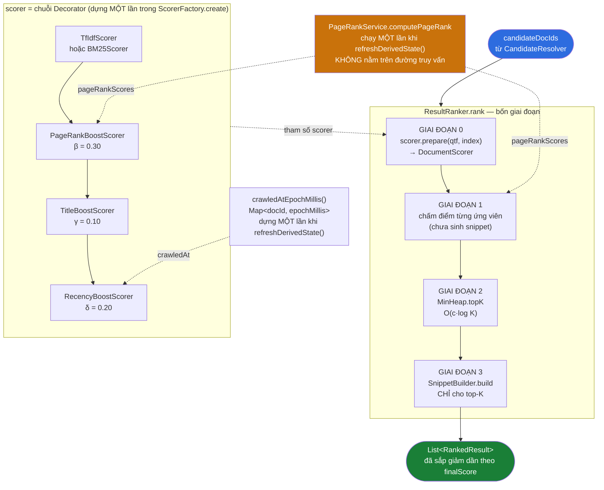
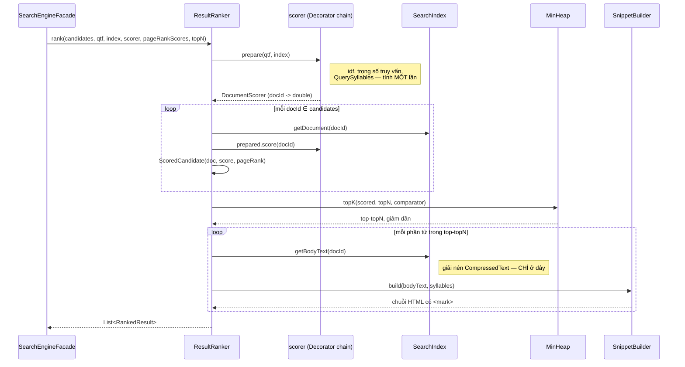
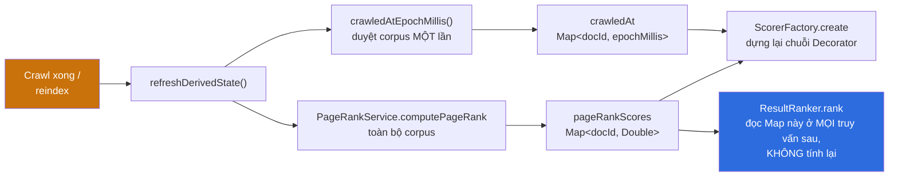
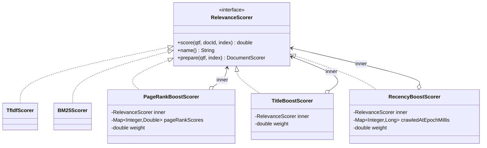
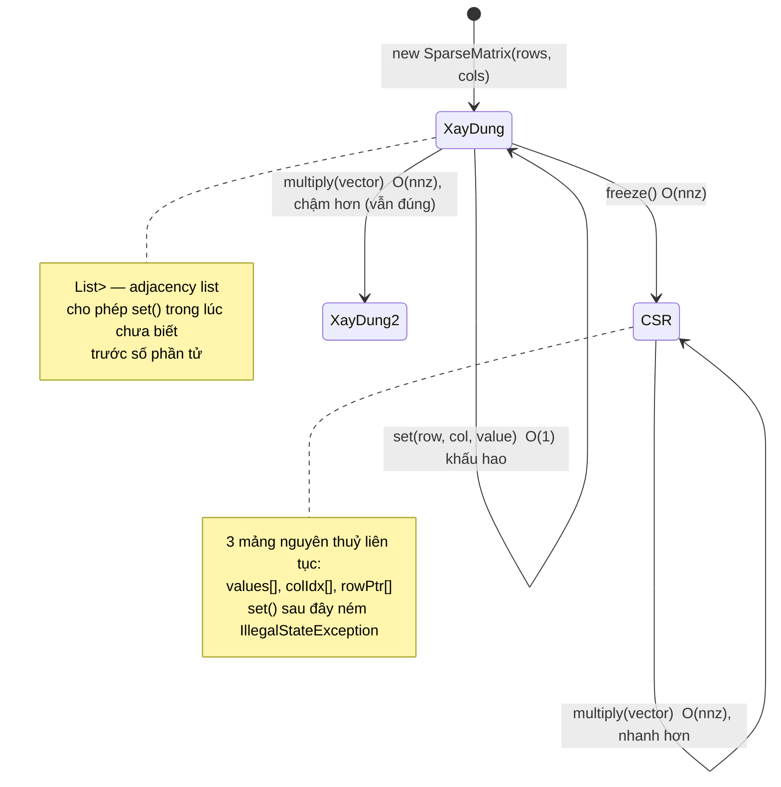
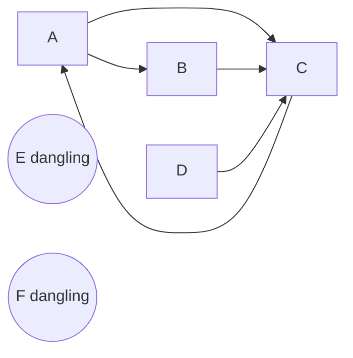
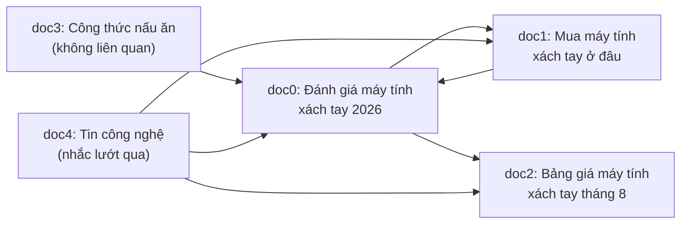
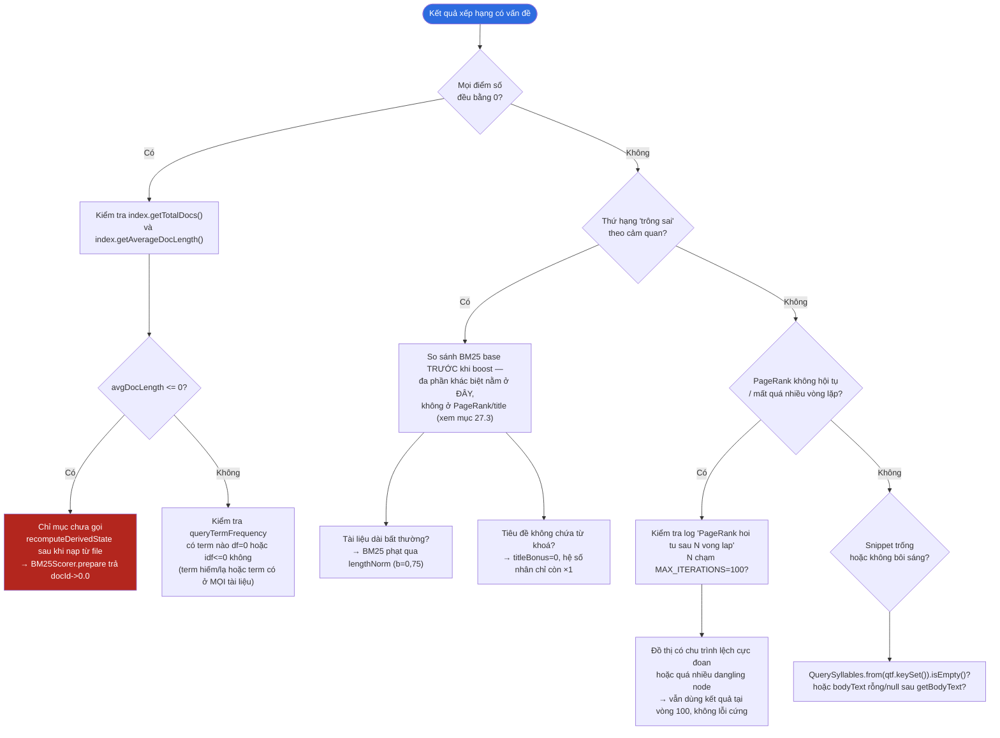

# RANKING PIPELINE — Giải phẫu toàn bộ tầng xếp hạng

### Từ tập ứng viên của `CandidateResolver` đến danh sách `SearchResult` có thứ hạng

> **Tài liệu tham chiếu kỹ thuật đầy đủ.**
> Mỗi lớp, mỗi công thức, mỗi hằng số, mỗi nhánh `if` mà một lượt gọi
> `ResultRanker.rank(...)` chạm tới — theo đúng thứ tự thực thi, kèm sơ đồ
> Mermaid, bảng đối chiếu và trace dữ liệu THẬT (chạy bằng mã nguồn thật trong
> repo, không phải số bịa).

---

## MỤC LỤC

### PHẦN I — TỔNG QUAN
- [0. Cách đọc tài liệu này](#0-cách-đọc-tài-liệu-này)
- [1. Ranh giới trách nhiệm: chặng 5 kết thúc ở đâu, chặng 6 bắt đầu ở đâu](#1-ranh-giới-trách-nhiệm-chặng-5-kết-thúc-ở-đâu-chặng-6-bắt-đầu-ở-đâu)
- [2. Bản đồ toàn hệ thống](#2-bản-đồ-toàn-hệ-thống)
- [3. Danh mục toàn bộ file tham gia](#3-danh-mục-toàn-bộ-file-tham-gia)
- [4. Sơ đồ tuần tự tổng quát](#4-sơ-đồ-tuần-tự-tổng-quát)
- [5. Bốn giai đoạn của `ResultRanker.rank`](#5-bốn-giai-đoạn-của-resultrankerrank)
- [6. PageRank — tín hiệu tách rời khỏi đường truy vấn](#6-pagerank--tín-hiệu-tách-rời-khỏi-đường-truy-vấn)
- [7. Ba quyết định thiết kế đáng nói nhất](#7-ba-quyết-định-thiết-kế-đáng-nói-nhất)

### PHẦN II — GIAO DIỆN CHẤM ĐIỂM
- [8. `RelevanceScorer` — Strategy pattern](#8-relevancescorer--strategy-pattern)
- [9. `prepare()` đấu với `score()` — vì sao phải tách](#9-prepare-đấu-với-score--vì-sao-phải-tách)

### PHẦN III — HAI CÔNG THỨC CƠ BẢN
- [10. `TfIdfScorer` — cosine similarity](#10-tfidfscorer--cosine-similarity)
- [11. `BM25Scorer` — mô hình xác suất Robertson–Sparck Jones](#11-bm25scorer--mô-hình-xác-suất-robertsonsparck-jones)
- [12. TF-IDF đấu BM25 — hai đường cong bão hoà](#12-tf-idf-đấu-bm25--hai-đường-cong-bão-hoà)
- [13. `ScorerFactory` — Factory pattern chọn và lắp ráp](#13-scorerfactory--factory-pattern-chọn-và-lắp-ráp)

### PHẦN IV — DECORATOR: TÍN HIỆU BỔ SUNG
- [14. Decorator pattern — vì sao không thêm tham số vào công thức](#14-decorator-pattern--vì-sao-không-thêm-tham-số-vào-công-thức)
- [15. `PageRankBoostScorer`](#15-pagerankboostscorer)
- [16. `TitleBoostScorer`](#16-titleboostscorer)
  - [16.4 `RecencyBoostScorer` — tín hiệu độ mới](#164-recencyboostscorer--tín-hiệu-độ-mới)
- [17. `QuerySyllables` — khớp chặt và khớp lỏng dấu](#17-querysyllables--khớp-chặt-và-khớp-lỏng-dấu)

### PHẦN V — PAGERANK
- [18. `SparseMatrix` — CSR, nền của phép nhân ma trận nhanh](#18-sparsematrix--csr-nền-của-phép-nhân-ma-trận-nhanh)
- [19. `PageRankService` — power iteration đầy đủ](#19-pagerankservice--power-iteration-đầy-đủ)
- [20. Trace hai đồ thị thật](#20-trace-hai-đồ-thị-thật)

### PHẦN VI — TOP-K VÀ SNIPPET
- [21. `MinHeap.topK` — O(c·log K) thay vì O(c·log c)](#21-minheaptopk--oclog-k-thay-vì-oclog-c)
- [22. `SnippetBuilder` — cửa sổ trượt và chống XSS](#22-snippetbuilder--cửa-sổ-trượt-và-chống-xss)

### PHẦN VII — LẮP RÁP: `ResultRanker`
- [23. Hai giai đoạn — vì sao nhanh hơn 50 lần](#23-hai-giai-đoạn--vì-sao-nhanh-hơn-50-lần)
- [24. `RankedResult` — vì sao chỉ còn một trường điểm](#24-rankedresult--vì-sao-chỉ-còn-một-trường-điểm)

### PHẦN VIII — ĐỐI CHIẾU OUTPUT THẬT
- [25. Corpus dựng lại và truy vấn thật](#25-corpus-dựng-lại-và-truy-vấn-thật)
- [26. Bảng điểm từng giai đoạn, từng docId](#26-bảng-điểm-từng-giai-đoạn-từng-docid)
- [27. Vì sao thứ tự cuối cùng lại như vậy](#27-vì-sao-thứ-tự-cuối-cùng-lại-như-vậy)

### PHẦN IX — PHỤ LỤC
- [28. Bảng hằng số toàn hệ thống](#28-bảng-hằng-số-toàn-hệ-thống)
- [29. Bảng tra nhanh khối ↔ file ↔ hàm](#29-bảng-tra-nhanh-khối--file--hàm)
- [30. Câu hỏi thường gặp](#30-câu-hỏi-thường-gặp)
- [31. Chẩn đoán sự cố](#31-chẩn-đoán-sự-cố)
- [32. Thuật ngữ](#32-thuật-ngữ)
- [33. Toàn cảnh một trang](#33-toàn-cảnh-một-trang)

---
---

# PHẦN I — TỔNG QUAN

---

## 0. Cách đọc tài liệu này

Tài liệu này viết theo cùng nguyên tắc với `CRAWLER-PIPELINE.md`: **một chiều,
không nhảy cóc**. Đọc tuần tự từ đầu đến cuối là đi đúng đường mà một truy vấn
thật đi, từ lúc `ResultRanker.rank(...)` được gọi tới lúc `SearchResult` cuối
cùng rời khỏi tầng xếp hạng.

### Quy ước ký hiệu (giống hệt tài liệu crawler, để đọc song song không phải học lại)

| Ký hiệu | Nghĩa |
|---|---|
| **File:** `abc/Xyz.java` | Đường dẫn tính từ `backend/libs/core-search/src/main/java/com/vnsearch/` (nêu rõ khi khác) |
| **Hàm:** `foo()` | Tên phương thức trong file vừa nêu |
| ① ② ③ | Số thứ tự bước trong một chuỗi xử lý |
| ★ | Điểm mấu chốt, dễ hiểu sai |
| ⚠ | Cạm bẫy đã từng gây lỗi thật, hoặc giới hạn đã biết |
| ↺ | Vòng lặp khép kín (feedback loop) |

### Ba mức chi tiết

1. **Mức sơ đồ** — một hình Mermaid (kèm bản chữ ASCII trong `<details>`), hiểu trong 10 giây.
2. **Mức mã** — trích đoạn mã thật, đã lược getter/log cho gọn nhưng KHÔNG lược Javadoc mang lập luận thiết kế.
3. **Mức lập luận** — vì sao viết như vậy, và bằng chứng bằng số nếu có.

### Nguồn của tài liệu này

Mọi công thức, hằng số, tên biến trong tài liệu đọc trực tiếp từ mã nguồn tại
`backend/libs/core-search/src/main/java/com/vnsearch/ranking/` (và
`ranking/decorator/`), cộng với hai cấu trúc dữ liệu nền `MinHeap` và
`SparseMatrix` tại `backend/libs/core-common/src/main/java/com/vnsearch/datastructure/`.
Mọi số liệu trong PHẦN VIII và trong các mục trace của PHẦN V là kết quả CHẠY
THẬT các lớp này (biên dịch bằng `javac`, chạy bằng `java`, dùng đúng
`target/classes` đã build của repo) — không phải số suy diễn bằng tay hay bịa
ra cho đẹp bảng.

---

## 1. Ranh giới trách nhiệm: chặng 5 kết thúc ở đâu, chặng 6 bắt đầu ở đâu

Tầng xếp hạng KHÔNG tự đi tìm tài liệu. Nó nhận sẵn một **tập ứng viên không
có thứ tự** từ tầng truy vấn (`QUERY-PIPELINE.md`, cụ thể là
`CandidateResolver.resolve(...)`), và trả về một **danh sách đã sắp xếp kèm
đoạn trích**. Toàn bộ việc phân tích cú pháp truy vấn, hợp/giao posting list,
lọc theo miền hay số lượng đã xảy ra TRƯỚC khi `ResultRanker` được gọi tới.

```java
// SearchEngineFacade.search — điểm nối hai chặng
QueryParser.ParsedQuery parsed = queryParser.parse(normalizedQuery);
CandidateResolver.ResolvedQuery resolved = CandidateResolver.resolve(currentIndex, parsed);
List<Integer> candidates = resolved.candidateDocIds();               // ← chặng 5 dừng ở đây

int topN = Math.max(page * size, size);
List<ResultRanker.RankedResult> ranked = resultRanker.rank(          // ← chặng 6 bắt đầu ở đây
        candidates, resolved.queryTermFrequency(), currentIndex,
        currentScorer, currentPageRank, topN);
```

### 1.1 Những gì chặng 6 NHẬN, và không được tự suy ra

| Tham số | Chặng 6 nhận nó là gì | Không được tự làm |
|---|---|---|
| `candidateDocIds` | `List<Integer>` không thứ tự, đã qua lọc miền/số lượng | Không tự lọc thêm, không tự loại trùng |
| `queryTermFrequency` | `Map<String,Integer>` — tần suất mỗi term ĐÃ TOKEN HOÁ trong truy vấn | Không tự tokenize lại truy vấn thô |
| `index` | `SearchIndex` — chỉ mục đảo và thống kê corpus | Chỉ đọc, không sửa |
| `scorer` | Một `RelevanceScorer` đã lắp ráp sẵn (có thể là chuỗi Decorator) | Không tự chọn scorer — việc đó thuộc `ScorerFactory`, chạy khi `refreshDerivedState()` |
| `pageRankScores` | `Map<Integer,Double>` tính sẵn một lần cho cả corpus | Không tính PageRank trên đường truy vấn |
| `topN` | `max(page·size, size)` | Không tự suy ra topN từ `page`/`size` |

★ **Vì sao `topN = max(page·size, size)`, không phải chỉ `size`.** Trang thứ
`page` cần các phần tử từ vị trí `(page-1)·size` tới `page·size - 1`. MinHeap
top-K chỉ giữ đúng K phần tử lớn nhất, nên K phải đủ SÂU để chứa hết các
trang trước đó cộng trang hiện tại — tức `page·size`. Trường hợp `page=1`,
biểu thức rút về `size`, đúng như tài liệu ban đầu ngầm định.

### 1.2 Những gì chặng 6 TRẢ VỀ, và tầng gọi tự cắt trang

`ResultRanker.rank` không cắt trang. Nó trả về TOÀN BỘ top-`topN` đã sắp giảm
dần, và `SearchEngineFacade.search` mới `subList` ra đúng khoảng của trang
đang xin:

```java
int fromIndex = Math.min((Math.max(page, 1) - 1) * size, ranked.size());
int toIndex = Math.min(fromIndex + size, ranked.size());
```

Điều này nghĩa là gọi `rank` cho trang 3 (`size=10`) vẫn phải chấm điểm và
xếp hạng top-30, rồi vứt đi 20 phần tử đầu — không có cách nào né được chi
phí đó với cấu trúc MinHeap top-K hiện tại (xem [mục 21](#21-minheaptopk--oclog-k-thay-vì-oclog-c)
để hiểu vì sao đây vẫn là lựa chọn đúng).

---

## 2. Bản đồ toàn hệ thống

### 2.1 Sơ đồ khối



<details>
<summary>Xem bản chữ (ASCII)</summary>

```
candidateDocIds (từ CandidateResolver, không thứ tự)
        │
        ▼
┌─────────────────────────────── ResultRanker.rank ───────────────────────────────┐
│                                                                                    │
│  GIAI ĐOẠN 0: scorer.prepare(queryTermFrequency, index) → DocumentScorer          │
│               (idf, trọng số truy vấn, tập tiếng truy vấn: tính ĐÚNG MỘT LẦN)     │
│                        │                                                          │
│                        ▼                                                          │
│  GIAI ĐOẠN 1: ∀ docId ∈ candidates → ScoredCandidate(doc, score, pageRank)         │
│               (CHỈ chấm điểm, CHƯA giải nén thân bài, CHƯA sinh snippet)           │
│                        │                                                          │
│                        ▼                                                          │
│  GIAI ĐOẠN 2: MinHeap.topK(scored, topN, so theo finalScore)  — O(c·log K)         │
│                        │                                                          │
│                        ▼                                                          │
│  GIAI ĐOẠN 3: SnippetBuilder.build(...) CHỈ cho topN phần tử vừa lấy ra             │
│                                                                                    │
└────────────────────────────────────────────────────────────────────────────────┘
                        │
                        ▼
          List<RankedResult> đã sắp GIẢM DẦN theo finalScore


scorer (tham số truyền vào, dựng sẵn trong ScorerFactory.create, KHÔNG dựng lại mỗi truy vấn):

  TfIdfScorer|BM25Scorer  →  PageRankBoostScorer(β=0.30)  →  TitleBoostScorer(γ=0.10)  →  RecencyBoostScorer(δ=0.20)
  [lớp trong cùng]           [lớp bọc 1]                      [lớp bọc 2]                    [lớp bọc 3, ngoài cùng]

  điểm cuối = base(q,d) · (1 + β·PR̂(d)) · (1 + γ·title(q,d)) · (1 + δ·recency(d))


PageRankService.computePageRank(...) chạy MỘT lần trong refreshDerivedState() —
KHÔNG nằm trên đường mỗi truy vấn — kết quả nạp vào cả PageRankBoostScorer lẫn
GIAI ĐOẠN 1 (để trả pageRankScore ra API, mục đích BÁO CÁO).

crawledAtEpochMillis() (bản đồ docId → mốc crawl) cũng dựng MỘT lần trong
refreshDerivedState() và nạp vào RecencyBoostScorer — xem [mục 16.4].
```

</details>

### 2.2 Vì sao sơ đồ tách "scorer" ra khỏi khung "ResultRanker"

`ResultRanker` không biết, và không cần biết, `scorer` là TF-IDF thuần hay
một chuỗi ba lớp Decorator. Nó chỉ gọi `scorer.prepare(...)` đúng một lần rồi
dùng `DocumentScorer` trả về. Việc LẮP RÁP chuỗi Decorator — chọn base nào,
bật/tắt từng tín hiệu — xảy ra một lần trong `ScorerFactory.create(...)`,
được `SearchEngineFacade.refreshDerivedState()` gọi mỗi khi corpus thay đổi
(sau một lần crawl mới, hoặc `reindex`), KHÔNG gọi lại trên mỗi truy vấn.
Đây là lý do sơ đồ vẽ `SCORER` như một khối độc lập, nối vào `RANK` bằng mũi
tên chấm ("tham số truyền vào").

---

## 3. Danh mục toàn bộ file tham gia

| # | File | Vai trò | Đọc kỹ ở mục |
|---|---|---|---|
| 1 | `ranking/RelevanceScorer.java` | Giao diện Strategy — trục của toàn bộ tầng | [8](#8-relevancescorer--strategy-pattern) |
| 2 | `ranking/TfIdfScorer.java` | Công thức TF-IDF cosine | [10](#10-tfidfscorer--cosine-similarity) |
| 3 | `ranking/BM25Scorer.java` | Công thức BM25 (mặc định của hệ thống) | [11](#11-bm25scorer--mô-hình-xác-suất-robertsonsparck-jones) |
| 4 | `ranking/ScorerFactory.java` | Factory chọn base scorer + lắp Decorator | [13](#13-scorerfactory--factory-pattern-chọn-và-lắp-ráp) |
| 5 | `ranking/decorator/PageRankBoostScorer.java` | Decorator — nhân thêm tín hiệu uy tín | [15](#15-pagerankboostscorer) |
| 6 | `ranking/decorator/TitleBoostScorer.java` | Decorator — nhân thêm tín hiệu khớp tiêu đề | [16](#16-titleboostscorer) |
| 6b | `ranking/decorator/RecencyBoostScorer.java` | Decorator — nhân thêm tín hiệu độ mới (`crawledAt`) | [16.4](#164-recencyboostscorer--tín-hiệu-độ-mới) |
| 7 | `ranking/QuerySyllables.java` | Tập tiếng của truy vấn — dùng cho title boost VÀ snippet | [17](#17-querysyllables--khớp-chặt-và-khớp-lỏng-dấu) |
| 8 | `ranking/PageRankService.java` | Thuật toán PageRank — power iteration | [19](#19-pagerankservice--power-iteration-đầy-đủ) |
| 9 | `ranking/SnippetBuilder.java` | Sinh đoạn trích, cửa sổ trượt, chống XSS | [22](#22-snippetbuilder--cửa-sổ-trượt-và-chống-xss) |
| 10 | `ranking/ResultRanker.java` | Lắp mọi thứ, lấy top-K | [23](#23-hai-giai-đoạn--vì-sao-nhanh-hơn-50-lần) |
| 11 | `datastructure/MinHeap.java` *(core-common)* | Top-K tổng quát bằng min-heap | [21](#21-minheaptopk--oclog-k-thay-vì-oclog-c) |
| 12 | `datastructure/SparseMatrix.java` *(core-common)* | Ma trận thưa CSR — nền của PageRank | [18](#18-sparsematrix--csr-nền-của-phép-nhân-ma-trận-nhanh) |
| 13 | `service/SearchEngineFacade.java` *(core-search)* | Điểm gọi vào chặng 6 từ tầng REST | [1](#1-ranh-giới-trách-nhiệm-chặng-5-kết-thúc-ở-đâu-chặng-6-bắt-đầu-ở-đâu) |

Đường dẫn đầy đủ của các file 1–10: `backend/libs/core-search/src/main/java/com/vnsearch/`.
File 11–12: `backend/libs/core-common/src/main/java/com/vnsearch/`. File 13:
`backend/libs/core-search/src/main/java/com/vnsearch/service/`.

---

## 4. Sơ đồ tuần tự tổng quát



<details>
<summary>Xem bản chữ (ASCII)</summary>

```
Facade  --rank(candidates, qtf, index, scorer, pageRankScores, topN)-->  Ranker

Ranker  --prepare(qtf, index)-->  Scorer
        <--DocumentScorer (docId -> double)--

for docId in candidates:
    Ranker -> Index.getDocument(docId)
    Ranker -> Scorer.prepared.score(docId)
    Ranker -> gom ScoredCandidate(doc, score, pageRank)

Ranker --topK(scored, topN, cmp)--> Heap
        <-- top-topN, giảm dần --

for candidate in top-topN:
    Ranker -> Index.getBodyText(docId)     [giải nén, CHỈ ở bước này]
    Ranker -> Snip.build(bodyText, syllables)
             <-- chuỗi HTML có <mark> --

Ranker --List<RankedResult>--> Facade
```

</details>

★ Hai điểm cần khắc ghi khi đọc sơ đồ này: (1) `prepare` chỉ gọi **một lần**,
đứng NGOÀI mọi vòng lặp; (2) `getBodyText` (thao tác giải nén tốn kém nhất
của cả chặng) chỉ chạy **trong vòng lặp thứ hai**, tức đúng `topN` lần chứ
không phải `candidates.size()` lần.

---

## 5. Bốn giai đoạn của `ResultRanker.rank`

Đây là khung xương của toàn bộ tài liệu — mọi PHẦN sau chỉ là mở rộng chi
tiết của một ô trong bảng này.

| Giai đoạn | Việc làm | Độ phức tạp | Lớp phụ trách |
|---|---|---|---|
| 0 — Chuẩn bị | Tính trước mọi thứ chỉ phụ thuộc TRUY VẤN (idf, trọng số, tập tiếng) | O(q) | `scorer.prepare(qtf, index)` |
| 1 — Chấm điểm | Với từng ứng viên: tra `index.getDocument`, gọi `prepared.score(docId)` | O(c·q·log d) | `ResultRanker` gọi `DocumentScorer` |
| 2 — Top-K | Lấy `topN` phần tử điểm cao nhất, KHÔNG sắp toàn bộ | O(c·log K) | `MinHeap.topK` |
| 3 — Snippet | Giải nén thân bài và dựng đoạn trích, CHỈ cho top-K | O(K·|d|) | `SnippetBuilder.build` |

với `c` = số ứng viên, `q` = số term phân biệt trong truy vấn, `d` = độ dài
posting list dài nhất, `K` = `topN`, `|d|` = độ dài trung bình một tài liệu.

```java
// ResultRanker.rank — mã thật, bốn giai đoạn tách bạch bằng comment ngay trong code
RelevanceScorer.DocumentScorer prepared = scorer.prepare(queryTermFrequency, index);          // GIAI ĐOẠN 0

List<ScoredCandidate> scored = new ArrayList<>(candidateDocIds.size());
for (int docId : candidateDocIds) {                                                            // GIAI ĐOẠN 1
    WebDocument doc = index.getDocument(docId);
    if (doc == null) continue;
    double pageRank = pageRankScores == null ? 0.0 : pageRankScores.getOrDefault(docId, 0.0);
    scored.add(new ScoredCandidate(doc, prepared.score(docId), pageRank));
}

List<ScoredCandidate> top =
        MinHeap.topK(scored, topN, Comparator.comparingDouble(ScoredCandidate::finalScore));   // GIAI ĐOẠN 2

QuerySyllables syllables = QuerySyllables.from(queryTermFrequency.keySet());
List<RankedResult> results = new ArrayList<>(top.size());
for (ScoredCandidate candidate : top) {                                                        // GIAI ĐOẠN 3
    results.add(new RankedResult(
            candidate.document(), candidate.finalScore(), candidate.pageRankScore(),
            snippetBuilder.build(index.getBodyText(candidate.document().getDocId()), syllables)));
}
```

★ Bốn giai đoạn này từng là **một** vòng lặp duy nhất trong bản cũ của lớp
(xem Javadoc của `ResultRanker`): chấm điểm, kết hợp ba tín hiệu bằng công
thức tuyến tính chọn cứng, VÀ sinh snippet — cho MỌI ứng viên, rồi mới cắt
top-N. Tách thành bốn giai đoạn rõ ràng vừa sửa một lỗi thật (PageRank chỉ
đóng góp 0,1% dù trọng số danh nghĩa là 30%, xem [mục 15](#15-pagerankboostscorer)),
vừa cắt chi phí sinh snippet đi 50 lần (xem [mục 23](#23-hai-giai-đoạn--vì-sao-nhanh-hơn-50-lần)).

---

## 6. PageRank — tín hiệu tách rời khỏi đường truy vấn

Không giống ba giai đoạn trên (chạy trên MỖI truy vấn), PageRank được tính
**một lần cho cả corpus** mỗi khi dữ liệu thay đổi:

```java
// SearchEngineFacade.refreshDerivedState — gọi sau mỗi lần crawl mới hoặc reindex
pageRankScores = index.getTotalDocs() > 0
        ? pageRankService.computePageRank(index.getAllDocuments()).scores()
        : Map.of();
// crawledAtEpochMillis(): duyệt index.getAllDocuments() MỘT lần, gom
// Map<docId, Instant#toEpochMilli()>, bỏ tài liệu không có crawledAt.
scorer = scorerFactory.create(pageRankScores, crawledAtEpochMillis());   // Factory + Decorator, cũng dựng lại ở đây
```

Cả `pageRankScores` lẫn bản đồ `crawledAt` đều là **trạng thái dẫn xuất từ
chỉ mục**: dựng một lần ở đây, không tính lại trên đường truy vấn. Bản đồ
`crawledAt` chỉ đổi khi có tài liệu mới (một phiên crawl), đúng như PageRank
chỉ đổi khi đồ thị liên kết đổi.



<details>
<summary>Xem bản chữ (ASCII)</summary>

```
Crawl xong / reindex
        │
        ▼
refreshDerivedState()
        │
        ▼
PageRankService.computePageRank(toàn bộ corpus)   ← tốn, nhưng chạy HIẾM
        │
        ▼
pageRankScores : Map<docId, Double>          crawledAt : Map<docId, epochMillis>
        │                                            │
        ├──> ScorerFactory.create(pageRankScores, crawledAt)
        │        dựng lại chuỗi Decorator (PageRankBoostScorer + RecencyBoostScorer mới)
        │
        └──> ResultRanker.rank(...)      MỌI truy vấn sau chỉ ĐỌC các Map này, không tính lại
```

</details>

★ **Vì sao tách hẳn ra khỏi đường truy vấn.** Một vòng lặp luỹ thừa trên
toàn corpus (xem [mục 19](#19-pagerankservice--power-iteration-đầy-đủ)) tốn
O(số vòng lặp × nnz) — với vài chục nghìn trang và vài trăm nghìn liên kết,
đây là phép tính có thể mất hàng trăm mili-giây tới vài giây. Chạy nó trên
MỖI truy vấn sẽ biến một tra cứu tưởng chừng tức thời thành một tác vụ theo
lô. PageRank chỉ đổi khi ĐỒ THỊ LIÊN KẾT đổi (có trang mới, có outlink mới)
— không đổi theo từng câu người dùng gõ — nên tính một lần và dùng lại là
đúng bản chất bài toán, không phải một tối ưu vá víu.

---

## 7. Ba quyết định thiết kế đáng nói nhất

Ba điểm này xuất hiện rải rác trong Javadoc của nhiều lớp; gom lại đây để
thấy chúng là MỘT triết lý xuyên suốt, không phải ba lựa chọn rời rạc.

### 7.1 `prepare()` tách khỏi `score()`

`RelevanceScorer.prepare` mặc định chỉ gọi lại `score`, nên một scorer cũ
không cài lại `prepare` vẫn CHẠY ĐÚNG — chỉ là chậm. Mọi scorer thật trong hệ
thống (`TfIdfScorer`, `BM25Scorer`, cả hai Decorator) đều cài lại `prepare`
để phần phụ thuộc TRUY VẤN (idf, trọng số, tập tiếng) được tính đúng một lần
thay vì lặp lại cho từng ứng viên. Xem [mục 9](#9-prepare-đấu-với-score--vì-sao-phải-tách)
để có con số cụ thể.

### 7.2 Decorator thay vì thêm tham số vào công thức

Thêm một tín hiệu = thêm một lớp bọc, KHÔNG sửa BM25 hay TF-IDF. Trọng số
bằng 0 → lớp bọc tương ứng bị bỏ hẳn khi lắp ráp trong `ScorerFactory.create`,
không trả chi phí cho một tín hiệu đang tắt. Vì lý do này, tham số
`app.ranking.alpha` (trọng số của điểm liên quan trong công thức cộng tuyến
tính cũ) đã bị xoá hẳn khỏi cấu hình: nó thuộc về CÔNG THỨC (đã được thay
bằng phép nhân, xem 7.3), không thuộc về những gì người vận hành nên chỉnh.

### 7.3 Nhân chứ không cộng, và thoát sớm khi `base == 0`

```
điểm cuối = base(q,d) · (1 + β·PR̂(d)) · (1 + γ·title(q,d))
```

`base · (1 + β·PR̂)` giữ nguyên THỨ NGUYÊN của điểm liên quan — đổi scorer cơ
sở từ TF-IDF sang BM25 (thang điểm khác hẳn nhau: xem PHẦN VIII, TF-IDF cho
`~0,03–0,04` còn BM25 cho `~0,7–1,0` trên CÙNG một corpus) không cần chỉnh
lại `β`/`γ`. Cộng thẳng PageRank vào sẽ đẩy một trang uy tín nhưng LẠC ĐỀ lên
đầu bảng — và cả hai lớp Decorator đều thoát sớm khi `base == 0`, đúng chủ
đích: uy tín hay tiêu đề khớp không cứu được một tài liệu mà nội dung thân
bài hoàn toàn không liên quan.

---

# PHẦN II — GIAO DIỆN CHẤM ĐIỂM

---

## 8. `RelevanceScorer` — Strategy pattern

**File:** `ranking/RelevanceScorer.java`

```java
public interface RelevanceScorer {
    double score(Map<String, Integer> queryTermFrequency, int docId, SearchIndex index);
    String name();

    @FunctionalInterface
    interface DocumentScorer {
        double score(int docId);
    }

    default DocumentScorer prepare(Map<String, Integer> queryTermFrequency, SearchIndex index) {
        return docId -> score(queryTermFrequency, docId, index);
    }
}
```

★ **Động cơ khoa học, không phải "dùng pattern cho có".** Javadoc của lớp
này nêu thẳng lý do: đây là điều kiện CẦN để làm thí nghiệm ablation — chạy
CÙNG một bộ truy vấn, CÙNG một chỉ mục, chỉ thay đúng một mô hình tính điểm,
rồi so sánh các độ đo chất lượng. Không tách ra sau một giao diện thì mọi so
sánh đều lẫn thêm biến số khác. Kết quả đo được (200 truy vấn known-item,
con số ghi trong Javadoc của mã nguồn):

```
TF-IDF thuần : MRR 0,8537   Success@1 78,0%
BM25 thuần   : MRR 0,8989   Success@1 85,0%
```

### 8.1 Hai phương thức, một hàm lồng bên trong

| Thành phần | Nhận | Trả | Vai trò |
|---|---|---|---|
| `score(qtf, docId, index)` | Toàn bộ ngữ cảnh mỗi lần gọi | `double` | API "thô" — dùng cho một lần chấm điểm lẻ |
| `name()` | — | `String` | Nhãn mô tả, các Decorator tự GHÉP tên lớp trong (mục 15–16) |
| `prepare(qtf, index)` | Ngữ cảnh CHỈ MỘT LẦN | `DocumentScorer` (hàm `docId -> double`) | API "nóng" — dùng trong vòng lặp chấm điểm hàng loạt |

`DocumentScorer` là một giao diện hàm (`@FunctionalInterface`) — thực chất
chỉ là một closure đã đóng gói sẵn mọi thứ phụ thuộc truy vấn, giờ chỉ còn
thiếu `docId`. `ResultRanker` gọi `scorer.prepare(...)` đúng MỘT LẦN ở GIAI
ĐOẠN 0, rồi gọi `prepared.score(docId)` trong vòng lặp GIAI ĐOẠN 1 — không
bao giờ gọi trực tiếp `scorer.score(...)` trên đường nóng.

---

## 9. `prepare()` đấu với `score()` — vì sao phải tách

### 9.1 Vấn đề thật mà nó giải

Chữ ký của `score` nhận `queryTermFrequency` ở MỖI lần gọi, nên mọi đại
lượng suy ra từ TRUY VẤN — thứ không hề đổi giữa các ứng viên trong CÙNG một
lượt xếp hạng — bị tính lại `c` lần dù chúng chưa từng đổi:

| Scorer | Việc bị lặp lại vô ích cho MỖI ứng viên |
|---|---|
| `TfIdfScorer` | Tính lại `idf` và trọng số truy vấn — hai `Math.log10` cho MỖI cặp (term, ứng viên) |
| `BM25Scorer` | Tính lại `idf` — một `Math.log` cho MỖI cặp (term, ứng viên) |
| `TitleBoostScorer` | Dựng lại cả đối tượng `QuerySyllables` — hai `HashSet` mới, cộng một lần bỏ dấu cho từng tiếng — cho MỖI ứng viên |

Với 5.000 ứng viên và 3 term truy vấn, đó là **30.000 phép logarit** và
**5.000 đôi tập băm** bị vứt đi ngay sau khi tạo — chuẩn bị trước đưa chúng
về đúng MỘT lần mỗi truy vấn, tức từ `O(c·q)` xuống `O(q)`.

### 9.2 Cách `TfIdfScorer.prepare` làm điều đó (mã thật)

```java
@Override
public DocumentScorer prepare(Map<String, Integer> queryTermFrequency, SearchIndex index) {
    int totalDocs = index.getTotalDocs();
    int size = queryTermFrequency.size();

    String[] terms = new String[size];
    double[] idfValues = new double[size];
    double[] queryWeights = new double[size];
    int kept = 0;
    double queryNormSq = 0.0;

    for (Map.Entry<String, Integer> entry : queryTermFrequency.entrySet()) {
        double idfValue = idf(totalDocs, index.getDocumentFrequency(entry.getKey()));
        if (idfValue <= 0.0) {
            continue;                          // term có mặt ở MỌI tài liệu — không phân biệt được gì
        }
        double queryWeight = tf(entry.getValue()) * idfValue;
        terms[kept] = entry.getKey();
        idfValues[kept] = idfValue;
        queryWeights[kept] = queryWeight;
        kept++;
        queryNormSq += queryWeight * queryWeight;
    }

    final int count = kept;
    final double queryNorm = Math.sqrt(queryNormSq);
    if (count == 0 || queryNorm == 0.0) {
        return docId -> 0.0;
    }

    return docId -> {                          // ← đóng gói terms/idfValues/queryWeights/queryNorm
        double dot = 0.0;
        for (int i = 0; i < count; i++) {
            int docTermFrequency = index.getTermFrequency(terms[i], docId);   // binary search O(log n)
            if (docTermFrequency > 0) {
                dot += queryWeights[i] * tf(docTermFrequency) * idfValues[i];
            }
        }
        if (dot == 0.0) return 0.0;
        double docNorm = Math.sqrt(Math.max(index.getDocLength(docId), 1));
        return dot / (queryNorm * docNorm);
    };
}
```

★ **Hai quyết định nhỏ đáng chú ý bên trong khối chuẩn bị:**

1. Term có `idf ≤ 0` (mặt ở TẤT CẢ tài liệu, nên `log10(N/df) = log10(1) = 0`)
   bị loại NGAY tại đây — vòng lặp nóng bên trong không còn phải kiểm tra
   lại chúng nữa.
2. Mảng `double[]` song song (`idfValues`, `queryWeights`) được dùng thay vì
   một mảng đối tượng — vòng lặp trong của việc chấm điểm chạy `c·q` lần, và
   mảng nguyên thuỷ phẳng cho cục bộ cache tốt hơn hẳn một mảng tham chiếu
   trỏ tới các đối tượng nằm rải rác trong heap.

### 9.3 Cài đặt mặc định vẫn tồn tại — vì sao không xoá

`prepare` mặc định trong giao diện (chỉ gọi lại `score`) tồn tại để một
`RelevanceScorer` không cài lại nó VẪN CHẠY ĐÚNG — chỉ là chậm hơn, không sai
kết quả. Đây là một quyết định tương thích ngược có chủ đích: thêm một
`RelevanceScorer` thực nghiệm mới (ví dụ cho một bài báo cáo) không bắt buộc
phải hiểu ngay kỹ thuật "tách phần phụ thuộc truy vấn" — nó có thể bắt đầu
chỉ cài `score`, đo xem mô hình có đúng không, rồi mới tối ưu `prepare` sau
khi công thức đã ổn định.

---

# PHẦN III — HAI CÔNG THỨC CƠ BẢN

---

## 10. `TfIdfScorer` — cosine similarity

**File:** `ranking/TfIdfScorer.java`

### 10.1 Công thức

```
tf(x)  = 1 + log10(x)                           nếu x > 0, ngược lại 0
idf(t) = log10(N / df(t))                        N = tổng số tài liệu, df = document frequency

w(t,q) = tf(qtf(t)) · idf(t)                     trọng số của term t trong TRUY VẤN
w(t,d) = tf(tf(t,d)) · idf(t)                    trọng số của term t trong TÀI LIỆU d

score(q,d) = [ Σ_t w(t,q)·w(t,d) ] / ( ||w(q)|| · docNorm(d) )
docNorm(d) ≈ √max(docLength(d), 1)               xấp xỉ Lucene classic Similarity
```

★ **Vì sao `tf = 1 + log10(x)`.** Đây là bước NÉN PHI TUYẾN để một tài liệu
nhồi từ khoá không thắng quá dễ: lặp lại một term gấp 10 lần chỉ được cộng
thêm ĐÚNG 1 điểm (`log10(10) = 1`), không phải gấp 10 điểm. `tf(1) = 1`,
`tf(10) = 2`, `tf(100) = 3` — tăng chậm dần chứ không tuyến tính.

★ **`idf` là lượng thông tin (self-information).** `log10(N/df)` chính là
lượng thông tin của biến cố "tài liệu chứa term này": term hiếm (xuất hiện ở
ít tài liệu, `df` nhỏ) mang nhiều thông tin phân biệt hơn hẳn một term phổ
biến. Term có mặt ở MỌI tài liệu cho `idf = log10(1) = 0` — đúng trực giác:
nó không phân biệt được tài liệu nào với tài liệu nào.

### 10.2 Vì sao chỉ duyệt qua term của TRUY VẤN, không phải toàn bộ từ vựng

```java
@Override
public double score(Map<String, Integer> queryTermFrequency, int docId, SearchIndex index) {
    return prepare(queryTermFrequency, index).score(docId);
}
```

Với term KHÔNG thuộc truy vấn, `w(t,q) = 0` nên số hạng `w(t,q)·w(t,d) = 0`.
Bỏ qua chúng là CHÍNH XÁC, không phải xấp xỉ — đây là toàn bộ lý do vector
thưa (sparse vector) làm việc được: dù không gian vector có 136.768 chiều
(bằng số term phân biệt của corpus), phép tính chỉ cần chạm vào `q` chiều mà
truy vấn thực sự có, độ phức tạp `O(q log d)` chứ không phải `O(|từ vựng|)`.

### 10.3 Chuẩn hoá độ dài — xấp xỉ và cái giá của nó

★ **Xấp xỉ Lucene classic.** Cosine similarity chuẩn cần chia cho
`||vector tài liệu||`, mà norm này về lý thuyết phải tính trên TẤT CẢ term
của tài liệu — tốn `O(|từ vựng|)` cho MỖI tài liệu, và phải tính lại mỗi khi
thêm tài liệu (vì `idf` đổi theo `N`). `TfIdfScorer` dùng xấp xỉ kinh điển
của Lucene classic Similarity: `docNorm ≈ √docLength`.

⚠ **Sai số của xấp xỉ, nói cho công bằng.** Theo định luật Heaps, số term
PHÂN BIỆT của một tài liệu tăng theo `|d|^β` với `β ≈ 0,5`, nên norm THẬT tỷ
lệ `|d|^0,25` trong khi xấp xỉ dùng `|d|^0,5` — tức nó PHẠT tài liệu dài mạnh
hơn thực tế đáng ra cần. Đây đúng là điểm mà BM25 làm tốt hơn: BM25 có tham
số `b` để điều chỉnh MỨC phạt độ dài thay vì chọn cứng một số mũ.

### 10.4 Trace bằng số thật

Chạy `TfIdfScorer.main` (demo có sẵn trong mã nguồn, 2 tài liệu, truy vấn
`"máy tính"`):

```
score(query='máy tính', doc0='Máy tính xách tay giá rẻ...') = 0.13054968465114591
score(query='máy tính', doc1='Công thức nấu ăn...')          = 0.0
```

`doc1` không chứa term `máy_tính` nào → `dot = 0` → điểm chính xác bằng
`0.0`, không phải một số rất nhỏ do sai số dấu phẩy động — nhánh `if (dot == 0.0) return 0.0;`
tránh luôn cả việc chia `0/x`.

---

## 11. `BM25Scorer` — mô hình xác suất Robertson–Sparck Jones

**File:** `ranking/BM25Scorer.java`

### 11.1 Công thức đầy đủ

```
                        f(q,D) · (k1 + 1)
score(D,Q) = Σ  IDF(q) · ─────────────────────────────────────
             q           f(q,D) + k1 · (1 − b + b · |D| / avgdl)

IDF(q) = ln( 1 + (N − df + 0.5) / (df + 0.5) )
```

với `k1 = 1,2` (`app.ranking.bm25.k1`), `b = 0,75` (`app.ranking.bm25.b`) —
hai giá trị chuẩn hoá qua nhiều thập kỷ thực nghiệm TREC, và là giá trị mặc
định thật trong `application.properties` của `search-service`.

### 11.2 BM25 hơn TF-IDF cosine ở ba điểm — trích nguyên văn lập luận trong mã nguồn

**Một — tần suất bão hoà có TRẦN.** Ở TF-IDF, `tf = 1 + log10(f)` vẫn tăng vô
hạn theo số lần lặp (chậm dần nhưng không bao giờ dừng). Ở BM25, phần thức
tiến tới tiệm cận NGANG `k1 + 1 = 2,2`: từ khoá xuất hiện 50 lần gần như
không hơn gì 20 lần. Điểm "nửa bão hoà" đạt tại `f = K` (tức
`k1·(1-b+b·|D|/avgdl)`) — với tài liệu độ dài trung bình (`|D| = avgdl`),
`K = k1 = 1,2`, nghĩa là chỉ cần `f ≈ 1,2` lần đã đạt một nửa mức tối đa.

**Hai — chuẩn hoá độ dài có THAM SỐ.** TF-IDF ở đây chia cứng cho
`√docLength`. BM25 dùng `b` để chỉnh MỨC phạt: `b = 0` không phạt gì cả (độ
dài tài liệu không ảnh hưởng), `b = 1` chuẩn hoá hoàn toàn theo `|D|/avgdl`.

**Ba — IDF không bao giờ âm.** Dạng `ln(1 + (N−df+0.5)/(df+0.5))` xuất phát
từ mô hình xác suất Robertson–Sparck Jones. Các số hạng `+0.5` là làm tròn
tránh chia 0 và tránh `ln(0)`; bọc trong `ln(1 + ...)` đảm bảo kết quả LUÔN
DƯƠNG — khác với biến thể `log(N/df)` (như ở TF-IDF) vốn hoá ÂM khi term xuất
hiện ở hơn một nửa số tài liệu, khiến tài liệu chứa nó bị TRỪ điểm một cách
vô lý.

### 11.3 Cài đặt: validate tham số ngay ở constructor

```java
public BM25Scorer(double k1, double b) {
    if (k1 < 0) {
        throw new IllegalArgumentException("k1 phai >= 0, nhan duoc: " + k1);
    }
    if (b < 0 || b > 1) {
        throw new IllegalArgumentException("b phai trong [0, 1], nhan duoc: " + b);
    }
    this.k1 = k1;
    this.b = b;
}
```

★ Đây không phải phòng thủ thừa. `b` ngoài `[0,1]` sẽ khiến `lengthNorm` có
thể ÂM khi `|D| < avgdl` — làm mẫu số `tf + lengthNorm` có thể tiến gần 0
hoặc đổi dấu, phá vỡ hoàn toàn tính đơn điệu của công thức. `ScorerFactory`
đọc `k1`/`b` từ `application.properties` qua `@Value`, nên một giá trị cấu
hình sai sẽ ném lỗi ngay khi khởi động ứng dụng, không lặng lẽ cho ra điểm
vô nghĩa khi phục vụ truy vấn.

### 11.4 `prepare` — cùng kỹ thuật với TF-IDF, khác chi tiết bão hoà theo tài liệu

```java
@Override
public DocumentScorer prepare(Map<String, Integer> queryTermFrequency, SearchIndex index) {
    int totalDocs = index.getTotalDocs();
    double avgDocLength = index.getAverageDocLength();
    if (totalDocs == 0 || avgDocLength <= 0) {
        return docId -> 0.0;   // avgDocLength=0: trạng thái dẫn xuất chưa tính lại sau khi nạp từ file
    }
    // ... gom idf từng term có df > 0, giống TfIdfScorer ...
    return docId -> {
        double lengthNorm = k1 * (1 - b + b * (index.getDocLength(docId) / avgDocLength));
        double total = 0.0;
        for (int i = 0; i < count; i++) {
            int termFrequency = index.getTermFrequency(terms[i], docId);
            if (termFrequency == 0) continue;
            total += idfValues[i] * (termFrequency * (k1 + 1)) / (termFrequency + lengthNorm);
        }
        return total;
    };
}
```

★ `lengthNorm` KHÔNG phụ thuộc term, nên vẫn được tính đúng MỘT lần cho cả
tài liệu (ngoài vòng lặp `for (i < count)`), dù nó phụ thuộc `docId` (khác
với `idfValues`, phụ thuộc TRUY VẤN nên đã được đẩy hẳn ra khỏi cả hai vòng
lặp trong `prepare`).

### 11.5 Trace bằng số thật (từ PHẦN VIII, xem chi tiết ở đó)

Với corpus 5 trang về "máy tính xách tay" (dựng thật, chạy thật —
[mục 25](#25-corpus-dựng-lại-và-truy-vấn-thật)): `N=5`, `avgdl=28,6`,
`df(máy_tính)=df(xách_tay)=4`, nên `idf = ln(1 + (5−4+0,5)/(4+0,5)) = ln(4/3) ≈ 0,287682`
cho CẢ HAI term. Với `doc1` (`docLength=26`, `tf=4` cho cả hai term):

```
lengthNorm = 1,2 · (1 − 0,75 + 0,75 · 26/28,6) = 1,2 · 0,931818 ≈ 1,118182
mỗi term   = 0,287682 · (4 · 2,2) / (4 + 1,118182) ≈ 0,287682 · 1,719137 ≈ 0,494640
tổng 2 term ≈ 0,989280   ←  khớp với số in ra thật: BM25 base = 0,989258 (chênh do làm tròn tay)
```

---

## 12. TF-IDF đấu BM25 — hai đường cong bão hoà

```
điểm/idf
  2.2 ┤                                    BM25  ─────────────────────────
      │                              ┌────╯
      │                         ┌────╯
  1.5 ┤                    ┌────╯
      │               ┌────╯
      │           ┌────╯
  1.0 ┤       ┌────╯                                TF-IDF (1+log10 f)
      │    ┌──╯                              ┌──────────────
      │  ┌─╯                          ┌───────╯
  0.5 ┤ ╱╯                    ┌────────╯
      │╱               ┌───────╯
    0 ┼────────┬────────┬────────┬────────┬────────┬────────┬─── f (số lần xuất hiện)
      0        5       10       15       20       25       50
```

<details>
<summary>Xem bảng số thay cho hình (k1=1,2, tài liệu độ dài trung bình → lengthNorm=k1=1,2)</summary>

| f (số lần xuất hiện) | TF-IDF: `1+log10(f)` | BM25: `f·(k1+1)/(f+lengthNorm)`, lengthNorm=1,2 |
|---|---|---|
| 1 | 1,000 | 1,000 |
| 2 | 1,301 | 1,375 |
| 5 | 1,699 | 1,774 |
| 10 | 2,000 | 1,964 |
| 20 | 2,301 | 2,082 |
| 50 | 2,699 | 2,148 |
| 100 | 3,000 | 2,174 |
| →∞ | → ∞ (chậm nhưng không dừng) | → `k1+1 = 2,200` (tiệm cận NGANG thật sự) |

</details>

★ **Đọc bảng:** ở vùng `f` nhỏ (1–10 lần), hai đường gần như trùng nhau — cả
hai mô hình đồng ý một tài liệu có nhiều từ khoá hơn thì liên quan hơn. Từ
`f ≈ 15` trở đi, TF-IDF vẫn tiếp tục leo (dù rất chậm) trong khi BM25 gần
như đi ngang ở `2,2`. Đây chính là "tần suất bão hoà có TRẦN" nói ở mục 11.2
— và là lý do BM25 chống nhồi từ khoá tốt hơn TF-IDF cosine kể cả sau khi đã
qua bước nén `log10`.

---

## 13. `ScorerFactory` — Factory pattern chọn và lắp ráp

**File:** `ranking/ScorerFactory.java`

### 13.1 Vấn đề thật mà lớp này giải

Trước khi có `ScorerFactory`, `SearchEngineFacade` CHỌN CỨNG một cài đặt:

```java
// mã cũ, chỉ còn trong Javadoc để làm bằng chứng
private final TfIdfScorer tfIdfScorer = new TfIdfScorer();
```

Dù `RelevanceScorer` đã là một giao diện Strategy hoạt động tốt, đo đạc cho
thấy BM25 đạt MRR 0,8989 so với 0,8537 của TF-IDF — **hơn 5,3%** — nhưng
KHÔNG có cách nào để người dùng thật nhận được kết quả BM25 mà không sửa mã
nguồn và biên dịch lại. Strategy chỉ được bộ đánh giá nội bộ khai thác; sản
phẩm thật thì không. Nay chỉ cần đổi một dòng trong `application.properties`:

```properties
app.ranking.scorer=bm25
app.ranking.bm25.k1=1.2
app.ranking.bm25.b=0.75
app.ranking.beta=0.30     # trọng số PageRank
app.ranking.gamma=0.10    # trọng số khớp tiêu đề
app.ranking.delta=0.20    # trọng số độ mới (crawledAt)
```

### 13.2 Hai bước: chọn CƠ SỞ, rồi BỌC tín hiệu

```java
public RelevanceScorer createBase() {
    String type = scorerType == null ? "tfidf" : scorerType.trim().toLowerCase(Locale.ROOT);
    return switch (type) {
        case "bm25" -> new BM25Scorer(k1, b);
        case "tfidf", "tf-idf" -> new TfIdfScorer();
        default -> throw new IllegalArgumentException(
                "app.ranking.scorer phai la 'tfidf' hoac 'bm25', nhan duoc: " + scorerType);
    };
}

// Bản một tham số giữ nguyên cho test / runner cũ — nó gọi lại bản đầy đủ
// với bản đồ crawledAt RỖNG, nên RecencyBoostScorer không được bọc.
public RelevanceScorer create(Map<Integer, Double> pageRankScores) {
    return create(pageRankScores, Map.of());
}

public RelevanceScorer create(Map<Integer, Double> pageRankScores,
                               Map<Integer, Long> crawledAtEpochMillis) {
    RelevanceScorer scorer = createBase();
    if (pageRankWeight > 0 && pageRankScores != null && !pageRankScores.isEmpty()) {
        scorer = new PageRankBoostScorer(scorer, pageRankScores, pageRankWeight);
    }
    if (titleWeight > 0) {
        scorer = new TitleBoostScorer(scorer, titleWeight);
    }
    if (recencyWeight > 0 && crawledAtEpochMillis != null && !crawledAtEpochMillis.isEmpty()) {
        scorer = new RecencyBoostScorer(scorer, crawledAtEpochMillis, recencyWeight);
    }
    return scorer;
}
```

★ **Thứ tự bọc CÓ ý nghĩa.** Scorer cơ sở nằm trong cùng, các tín hiệu bổ
sung bọc dần ra ngoài — `PageRankBoostScorer` bọc trước, rồi `TitleBoostScorer`,
rồi `RecencyBoostScorer` (bọc ngoài cùng). Tên của kết quả tự ghép thành mô
tả đầy đủ, ví dụ
`"BM25(k1=1.2,b=0.75) + PR x0.30 + title x0.10 + recency x0.20"` — mỗi lớp
`name()` chỉ cần biết TÊN của lớp trong nó bọc, không cần biết toàn bộ chuỗi.

★ **Trọng số 0 → không bọc, không trả chi phí.** `if (pageRankWeight > 0 ...)`,
`if (titleWeight > 0)` và `if (recencyWeight > 0 ...)` là các lần kiểm tra TẠI
THỜI ĐIỂM LẮP RÁP (một lần mỗi khi `refreshDerivedState()` chạy), không phải
tại thời điểm chấm điểm. `RecencyBoostScorer` còn bị bỏ qua khi bản đồ
`crawledAt` rỗng — ví dụ khi gọi từ bản `create` một tham số.
Tắt một tín hiệu bằng cách đặt trọng số 0 trong cấu hình nghĩa là lớp
Decorator tương ứng KHÔNG BAO GIỜ được tạo ra — không một phép nhân thừa nào
chạy trên đường nóng vì một tín hiệu đang tắt.

### 13.3 Hai constructor — vì sao có bản tường minh

```java
public ScorerFactory() { }   // @Component — Spring tiêm giá trị qua @Value

// dùng cho test, runner ngoài Spring — gọi lại bản 6 tham số với δ = 0.20
public ScorerFactory(String scorerType, double k1, double b,
                      double pageRankWeight, double titleWeight) { ... }

public ScorerFactory(String scorerType, double k1, double b,
                      double pageRankWeight, double titleWeight, double recencyWeight) { ... }
```

Hai constructor tường minh tồn tại vì các bài đo (`EvaluationRunner` và tương
tự) cần quét qua nhiều tổ hợp `(scorerType, β, γ, δ)` trong CÙNG một lần chạy
— không thể mỗi tổ hợp lại khởi động một ngữ cảnh Spring riêng chỉ để đổi giá
trị `@Value`. Bản 5 tham số giữ lại để test cũ không phải sửa; nó chọn
`δ = 0.20` mặc định.

---

# PHẦN IV — DECORATOR: TÍN HIỆU BỔ SUNG

---

## 14. Decorator pattern — vì sao không thêm tham số vào công thức

### 14.1 Công thức cũ, và lý do nó sai

```
final = alpha·relevance + beta·pageRank + gamma·titleBonus     ← CÔNG THỨC CŨ, đã bỏ
```

Đây là một phép CỘNG TUYẾN TÍNH chọn cứng ngay trong `ResultRanker`. Nhìn qua
tưởng vô hại — ba trọng số cộng lại bằng một điểm — nhưng nó phạm một lỗi mà
chỉ đo đạc bằng số mới lộ ra: PageRank là một PHÂN PHỐI XÁC SUẤT
(`Σ PR = 1`), nên giá trị trung bình của nó **buộc phải nhỏ dần khi corpus
lớn lên** (`trung bình = 1/N`). Cộng thẳng một đại lượng như vậy vào một
điểm liên quan có thang hoàn toàn khác là một phép toán không có ý nghĩa —
không có `beta` nào sửa được, vì vấn đề nằm ở PHÉP TOÁN chứ không phải hằng
số. Xem con số cụ thể ở [mục 15](#15-pagerankboostscorer).

### 14.2 Cách Decorator sửa nó

```
final = base(q,d) · (1 + β·PR̂(d)) · (1 + γ·title(q,d)) · (1 + δ·recency(d))
```

Mỗi thừa số `(1 + w·tín_hiệu)` là một lớp bọc độc lập; thêm `RecencyBoostScorer`
chỉ là thêm một thừa số nữa vào cuối, không đụng tới ba thừa số đã có.

Mỗi tín hiệu bổ sung là một LỚP BỌC quanh scorer nó nhận vào, cùng cài đúng
giao diện `RelevanceScorer` — nên bọc thêm bao nhiêu lớp cũng được, và thứ tự
bọc là tường minh trong `ScorerFactory.create` chứ không ẩn trong một công
thức nhiều số hạng.



<details>
<summary>Xem bản chữ (ASCII)</summary>

```
RelevanceScorer (interface): score(), name(), prepare()
        ▲             ▲              ▲                    ▲                   ▲
        │ impl        │ impl         │ impl               │ impl              │ impl
   TfIdfScorer    BM25Scorer   PageRankBoostScorer   TitleBoostScorer   RecencyBoostScorer
                                    │ trường "inner"      │ trường "inner"     │ trường "inner"
                                    │ kiểu RelevanceScorer  ... (như bên trái) ...
                                    └──> bọc BẤT KỲ scorer nào, kể cả một Decorator khác
```

</details>

★ Vì cả ba Decorator (`PageRankBoostScorer`, `TitleBoostScorer`,
`RecencyBoostScorer`) đều nhận `inner` kiểu `RelevanceScorer` (không phải
`TfIdfScorer` hay `BM25Scorer` cụ thể), chúng BỌC ĐƯỢC LẪN NHAU:
`ScorerFactory.create` bọc `PageRankBoostScorer` trước, rồi `TitleBoostScorer`,
rồi `RecencyBoostScorer`, nhưng đảo thứ tự cũng biên dịch được — chỉ là tên
mô tả (`name()`) sẽ ghép theo thứ tự khác. Đây là điểm khác biệt cốt lõi với
kế thừa: nếu `TitleBoostScorer` PHẢI kế thừa `BM25Scorer` để thêm tín hiệu,
nó không thể bọc thêm `PageRankBoostScorer` mà không nhân bản mã.

---

## 15. `PageRankBoostScorer`

**File:** `ranking/decorator/PageRankBoostScorer.java`

### 15.1 Bằng chứng bằng số cho công thức CỘNG bị sai

Đo trên corpus 5.011 trang (số liệu ghi trong Javadoc mã nguồn):

```
TF-IDF cosine : trung bình 0,177687   → ×0,6 = 0,106612
PageRank      : trung bình 0,00035388 → ×0,3 = 0,00010616

tỷ lệ đóng góp của PageRank = 0,00010616 / 0,106612 ≈ 0,1%
```

**PageRank đóng góp MỘT PHẦN NGHÌN dù trọng số danh nghĩa là 30%.** Quét
`beta` từ 0,05 đến 0,80 (gấp 16 lần) chỉ làm MRR đổi 0,0040 — tức 0,4%, gần
như không đo được. Đây không phải "beta chưa tối ưu" — beta bằng bao nhiêu
cũng không sửa được vì bản chất là phép CỘNG hai đại lượng khác thang.

### 15.2 Cách nhân, có chuẩn hoá log

```java
public PageRankBoostScorer(RelevanceScorer inner, Map<Integer, Double> pageRankScores, double weight) {
    ...
    double min = this.pageRankScores.values().stream()
            .mapToDouble(Double::doubleValue).filter(v -> v > 0).min().orElse(1e-9);
    double max = this.pageRankScores.values().stream()
            .mapToDouble(Double::doubleValue).max().orElse(min);
    this.minPageRank = min;
    this.logRange = Math.max(Math.log1p(max / min), 1e-9);
}

@Override
public DocumentScorer prepare(Map<String, Integer> queryTermFrequency, SearchIndex index) {
    DocumentScorer base = inner.prepare(queryTermFrequency, index);
    if (weight == 0.0) {
        return base;                                    // tín hiệu bị tắt: không bọc thêm lớp nào
    }
    return docId -> {
        double baseScore = base.score(docId);
        if (baseScore == 0.0) {
            return baseScore;                            // thoát sớm: uy tín không cứu được tài liệu không liên quan
        }
        double pageRank = pageRankScores.getOrDefault(docId, minPageRank);
        double normalized = Math.log1p(pageRank / minPageRank) / logRange;   // thuộc [0, 1]
        return baseScore * (1 + weight * normalized);
    };
}
```

```
normalized = log1p(pr / minPR) / log1p(maxPR / minPR)     ∈ [0, 1]
điểm       = base · (1 + β · normalized)
```

★ **Vì sao dùng LOG trước khi chuẩn hoá.** PageRank trải trên nhiều bậc độ
lớn (từ `10^-4` đến `7,7×10^-3` trong Javadoc mẫu) — chuẩn hoá tuyến tính
đơn thuần (`(pr-min)/(max-min)`) sẽ khiến gần như MỌI trang rơi vào một dải
hẹp sát 0, chỉ vài trang cực trị chiếm hết khoảng `[0,1]`. Log nén dải động,
biến nó thành đại lượng CỘNG ĐƯỢC, và chuẩn hoá về `[0,1]` làm `weight` trở
thành TỶ LỆ ĐÓNG GÓP THẬT — đúng như tên gọi "trọng số" ngụ ý.

★ **Vì sao NHÂN bất biến với thang của scorer trong.** Đổi scorer cơ sở từ
TF-IDF sang BM25 (thang điểm khác hẳn: `0,18` so với `12,1` theo đo đạc)
KHÔNG cần chỉnh lại trọng số. Đây chính là lý do bảng đánh giá cũ cho thấy
`"BM25 + PR + title"` (MRR 0,9089) THUA `"TF-IDF + PR + title"` (0,9229): bộ
trọng số được tinh chỉnh cho thang TF-IDF, không dùng lại được cho BM25 khi
công thức còn là phép CỘNG. Với phép NHÂN, vấn đề bất biến thang này không
còn tồn tại.

⚠ **`minPageRank` mặc định `1e-9` khi không có giá trị dương nào.** Trường
hợp toàn bộ corpus là các nút cụt (dangling) chưa từng xảy ra trong dữ liệu
thật, nhưng nếu xảy ra, `min=1e-9` khiến `normalized` cho MỌI tài liệu tiến
gần `log1p(pr/1e-9)/logRange` — một biểu thức nhạy với sai số dấu phẩy động ở
mẫu số cực nhỏ. Đây là trường hợp biên chưa có bài kiểm thử chuyên biệt.

---

## 16. `TitleBoostScorer`

**File:** `ranking/decorator/TitleBoostScorer.java`

### 16.1 Vì sao tín hiệu này MẠNH hơn PageRank rất nhiều

Đo trên 200 truy vấn known-item (số liệu ghi trong Javadoc mã nguồn):

```
TF-IDF thuần       : MRR 0,8537
TF-IDF + PageRank  : MRR 0,8625   (+0,0088)
TF-IDF + title     : MRR 0,9083   (+0,0546)   ← gấp 6 lần PageRank
```

Tiêu đề là bản tóm tắt do CHÍNH NGƯỜI VIẾT đặt cho bài, nên nó là tín hiệu
liên quan rất mạnh — và khác với PageRank, nó cùng thang đo với điểm liên
quan (cả hai đều là "mức độ khớp với truy vấn", không phải "mức độ uy tín
của trang"), nên kết hợp dễ hơn nhiều.

### 16.2 Cài đặt

```java
@Override
public DocumentScorer prepare(Map<String, Integer> queryTermFrequency, SearchIndex index) {
    DocumentScorer base = inner.prepare(queryTermFrequency, index);
    if (weight == 0.0) {
        return base;
    }
    QuerySyllables syllables = QuerySyllables.from(queryTermFrequency.keySet());   // ← MỘT lần
    if (syllables.isEmpty()) {
        return base;
    }

    return docId -> {
        double baseScore = base.score(docId);
        if (baseScore == 0.0) {
            return baseScore;
        }
        WebDocument document = index.getDocument(docId);
        if (document == null) {
            return baseScore;
        }
        double bonus = syllables.titleMatchRatio(document.getTitle());   // thuộc [0, 1]
        return baseScore * (1 + weight * bonus);
    };
}
```

★ **`QuerySyllables.from(...)` dựng đúng MỘT lần cho cả truy vấn**, không
nằm trong closure `docId -> ...`. Javadoc của lớp nêu rõ trạng thái TRƯỚC khi
sửa: dòng này từng nằm TRONG `score`, chạy lại cho MỖI tài liệu ứng viên —
mỗi lần là hai `HashSet` mới cộng một phép bỏ dấu cho từng tiếng truy vấn —
rồi bị vứt đi ngay sau khi chấm xong MỘT tài liệu. Với 5.000 ứng viên là
5.000 lần dựng lại cùng một đối tượng không hề đổi — "trường hợp kinh điển
của bất biến vòng lặp bị kẹt bên trong vòng lặp".

★ Cùng công thức NHÂN và cùng lý do bất biến thang như `PageRankBoostScorer`:
`titleBonus` đã nằm sẵn trong `[0,1]` nên không cần chuẩn hoá log, nhưng vẫn
nhân chứ không cộng để bất biến khi đổi scorer cơ sở.

### 16.4 `RecencyBoostScorer` — tín hiệu độ mới

**File:** `ranking/decorator/RecencyBoostScorer.java`

Lớp bọc thứ ba, **ngoài cùng** trong chuỗi mà `ScorerFactory.create` lắp.
Nó thưởng thêm cho tài liệu được crawl gần đây — mốc lấy từ
`WebDocument.getCrawledAt()`, tức theo LẦN CRAWLER chạy, **không** phải ngày
xuất bản ghi trong bài (nhiều trang không khai báo, hoặc khai báo sai).

#### 16.4.1 Chuẩn hoá tuyến tính về `[0, 1]`

Khác `PageRankBoostScorer` (phải nén log vì PageRank trải trên nhiều bậc độ
lớn), mốc thời gian phân bố tương đối đều nên chuẩn hoá tuyến tính là đủ:

```
recency(d) = (crawledAt(d) − minCrawledAt) / (maxCrawledAt − minCrawledAt)   ∈ [0, 1]
```

`minCrawledAt` / `maxCrawledAt` tính MỘT lần trong constructor từ toàn bộ bản
đồ `crawledAt`. Tài liệu mới nhất trong corpus được `recency = 1`, cũ nhất
được `0`. Mẫu số được kẹp `≥ 1` ms để corpus chỉ có một mốc (hoặc mọi tài
liệu cùng mốc) không chia cho 0.

#### 16.4.2 Công thức — vẫn NHÂN, cùng lý do bất biến thang

```
final = base(q,d) · (1 + δ · recency(d))
```

với `δ = app.ranking.delta` (mặc định `0.20`). Nhân chứ không cộng, y hệt hai
Decorator trước: đổi scorer cơ sở từ TF-IDF (~0,18) sang BM25 (~12) KHÔNG cần
chỉnh lại `δ`.

#### 16.4.3 Ba lối thoát sớm

```java
@Override
public DocumentScorer prepare(Map<String, Integer> queryTermFrequency, SearchIndex index) {
    DocumentScorer base = inner.prepare(queryTermFrequency, index);
    if (weight == 0.0 || crawledAtEpochMillis.isEmpty()) {
        return base;                       // (1) tín hiệu tắt / không có mốc nào → không bọc
    }
    return docId -> {
        double baseScore = base.score(docId);
        if (baseScore == 0.0) {
            return baseScore;              // (2) độ mới không cứu được tài liệu không liên quan
        }
        Long millis = crawledAtEpochMillis.get(docId);
        if (millis == null) {
            return baseScore;              // (3) tài liệu thiếu crawledAt → giữ nguyên điểm gốc
        }
        double normalized = (double) (millis - minEpochMillis) / rangeMillis;
        if (normalized < 0.0) {
            normalized = 0.0;
        } else if (normalized > 1.0) {
            normalized = 1.0;
        }
        return baseScore * (1 + weight * normalized);
    };
}
```

Lưu ý (3) khác `FeedController`: ở đây tài liệu thiếu mốc **giữ nguyên điểm**
(không bị phạt), còn ở dòng tin thì bị đẩy **xuống cuối** — vì dòng tin sắp
thuần theo thời gian nên "không có thời gian" chỉ có thể xếp chót.

#### 16.4.4 `name()`

```
<tên lớp trong> + recency x0.20
```

ghép sau cùng, ví dụ đầy đủ:
`"TF-IDF cosine + PR x0.30 + title x0.10 + recency x0.20"`.

---

## 17. `QuerySyllables` — khớp chặt và khớp lỏng dấu

**File:** `ranking/QuerySyllables.java`

Lớp này phục vụ HAI nơi: tính `titleMatchRatio` cho `TitleBoostScorer`, và
quyết định từ nào được bôi sáng trong `SnippetBuilder`. Cùng một luật khớp ở
cả hai chỗ là chủ đích — người dùng thấy từ được bôi sáng trong snippet
chính là những từ đã góp vào điểm khớp tiêu đề.

### 17.1 Lỗi đã sửa, và nguyên nhân gốc

⚠ **Trước đây mọi tiếng đều bị bỏ dấu trước khi so khớp**, khiến snippet bôi
sáng nhầm: truy vấn `ngân hàng` làm sáng cả chữ `ngàn` trong câu "cắt giảm cả
ngàn nhân sự", vì cả `ngân` lẫn `ngàn` đều bỏ dấu thành `ngan`. Nguyên nhân
gốc: bỏ dấu là một ánh xạ NHIỀU-MỘT (`ngân → ngan`, `ngàn → ngan`,
`ngắn → ngan`) — so khớp trên ẢNH của ánh xạ này mất khả năng phân biệt các
nghịch ảnh.

### 17.2 Quy tắc mới

| Người dùng gõ | Chế độ khớp | Ví dụ |
|---|---|---|
| `ngân` (CÓ dấu) | Chỉ khớp CHÍNH XÁC | chỉ sáng `ngân` |
| `ngan` (KHÔNG dấu) | Khớp LỎNG (bỏ dấu) | sáng cả `ngân`, `ngàn` |

Vẫn cần bỏ dấu ở khâu TRA CỨU (không biết trước người dùng gõ kiểu nào, nên
phải chỉ mục cả hai dạng để bắt được cả hai) — nhưng ở khâu HIỂN THỊ thì
việc bỏ dấu là thừa và GÂY SAI, vì lúc này đã biết chính xác người dùng gõ
gì.

### 17.3 Cài đặt

```java
public static QuerySyllables from(Set<String> terms) {
    Set<String> exact = new HashSet<>();
    Set<String> loose = new HashSet<>();
    for (String term : terms) {
        for (String syllable : term.split("_")) {
            String lower = syllable.toLowerCase(Locale.ROOT);
            if (lower.isEmpty()) continue;
            exact.add(lower);
            // Chỉ mở khớp lỏng khi CHÍNH tiếng trong truy vấn không có dấu.
            if (VietnameseTokenizer.stripDiacritics(lower).equalsIgnoreCase(lower)) {
                loose.add(lower);
            }
        }
    }
    return new QuerySyllables(exact, loose);
}

public boolean matches(String word) {
    if (word == null || word.isEmpty()) return false;
    String lower = word.toLowerCase(Locale.ROOT);
    if (exact.contains(lower)) return true;
    return !loose.isEmpty()
            && loose.contains(VietnameseTokenizer.stripDiacritics(lower).toLowerCase(Locale.ROOT));
}
```

★ **Cách kiểm tra "tiếng này có dấu không"** dùng ĐIỂM BẤT ĐỘNG của phép bỏ
dấu: `stripDiacritics(s) == s` khi và chỉ khi `s` không có dấu. Không cần
một bảng tra riêng liệt kê ký tự có dấu — tận dụng luôn hàm `stripDiacritics`
đã có sẵn cho mục đích index hoá.

### 17.4 `titleMatchRatio` — vì sao phải KẸP trong [0,1]

```java
public double titleMatchRatio(String title) {
    if (title == null || title.isBlank() || exact.isEmpty()) return 0.0;
    String[] words = WHITESPACE_RUN.split(title.toLowerCase(Locale.ROOT));
    int matched = 0;
    for (String word : words) {
        if (matches(stripPunctuation(word))) matched++;
    }
    return Math.min(1.0, (double) matched / exact.size());
}
```

Tử số đếm SỐ LẦN xuất hiện, còn mẫu số là số tiếng PHÂN BIỆT của truy vấn —
một tiêu đề nhồi từ khoá (`"Máy tính và máy tính bảng"` với truy vấn
`"máy tính"`) cho tỷ số thô `4/2 = 2`. Không kẹp thì một tiêu đề nhồi từ khoá
được thưởng tuỳ ý, phá vỡ đúng thứ mà giới hạn `[0,1]` của công thức nhân ở
mục 14.2 đang cố giữ.

---

# PHẦN V — PAGERANK

---

## 18. `SparseMatrix` — CSR, nền của phép nhân ma trận nhanh

**File:** `datastructure/SparseMatrix.java` *(core-common)*

### 18.1 Vì sao thưa, không phải `double[n][n]`

Với `n = 5.011` trang (corpus mẫu ghi trong Javadoc), ma trận ĐẶC cần
`5011² × 8 byte ≈ 191,5 MB`, trong khi thực tế chỉ có `nnz = 239.691` phần tử
khác 0 (độ thưa 0,95%). Tỷ lệ này còn XẤU ĐI khi corpus lớn hơn, vì
`độ thưa = nnz/n² ≈ k_tb/n` tỷ lệ NGHỊCH với `n` — số liên kết trung bình
`k_tb` mỗi trang gần như không đổi khi web lớn lên, nên mẫu số `n` càng lớn
thì độ thưa càng nhỏ.

### 18.2 Hai chế độ lưu trữ — dựng linh hoạt, đông cứng để chạy nhanh



<details>
<summary>Xem bản chữ (ASCII)</summary>

```
new SparseMatrix(rows, cols)
        │
        ▼
[CHẾ ĐỘ XÂY DỰNG — adjacency list]
  rowEntries: List<List<Entry(col, value)>>
  set(row, col, value)   O(1) khấu hao — bắt buộc vì ma trận dựng DẦN
                          trong lúc duyệt outlink, chưa biết trước số phần tử
        │
        │ freeze()   O(nnz)
        ▼
[CHẾ ĐỘ CHẠY — CSR, Compressed Sparse Row]
  values[]  double[nnz]     giá trị khác 0, xếp theo hàng
  colIdx[]  int[nnz]        chỉ số cột tương ứng
  rowPtr[]  int[rows+1]     rowPtr[i] = chỉ số bắt đầu của hàng i
        │
        │ multiply(vector)   O(nnz), CHẠY NHANH HƠN — không dereference object
        ▼
  result[] double[rows]

  set() sau khi freeze() -> IllegalStateException
```

</details>

★ **Lợi ích đổi được khi đông cứng (số liệu trong Javadoc):**

| Tiêu chí | Adjacency list (Entry object) | CSR |
|---|---|---|
| Bộ nhớ mỗi phần tử | ~32 B (16 B header + 4 B int + 8 B double + căn lề) | 12 B (`double` + `int`) |
| Tỷ lệ tiết kiệm | — | **~2,7 lần** |
| Cục bộ cache | Nhảy tới object rải rác trong heap | 3 mảng liên tục — 16 giá trị `double`/cache line |
| Áp lực GC | `nnz` object riêng lẻ | 3 object cho cả ma trận |

PageRank chạy hàng chục vòng lặp trên CÙNG một ma trận (xem mục 19), nên trả
chi phí đông cứng MỘT lần để đổi lấy hàng chục lần nhân nhanh hơn là một
đánh đổi rất có lợi — `multiply(double[])` tự chọn chế độ tuỳ `isFrozen()`,
người gọi không cần biết.

### 18.3 Trace bằng số thật — chạy `SparseMatrix.main`

Ma trận 3×3: `(0,1)=0,5`, `(1,2)=1,0`, `(2,0)=0,5`, `(2,1)=0,5`, nhân với
vector `[1,1,1]`:

```
Adjacency list -> [0.5, 1.0, 1.0]
CSR (đã freeze) -> [0.5, 1.0, 1.0]        ← cùng kết quả ở cả hai chế độ, đúng như thiết kế
Bộ nhớ: 248 B -> 64 B (tiết kiệm 74.2%)
nnz = 4 / 9 ô, độ thưa = 44.44%
```

Con số tiết kiệm bộ nhớ thực tế (74,2%) còn cao hơn tỷ lệ lý thuyết ~2,7 lần
(~63%) nêu ở Javadoc, vì ma trận demo quá nhỏ để chi phí cố định của mỗi
`ArrayList` (không chỉ `Entry`) bị pha loãng — trên ma trận lớn thật (5.011
node), tỷ lệ hội tụ về đúng con số lý thuyết.

---

## 19. `PageRankService` — power iteration đầy đủ

**File:** `ranking/PageRankService.java`

### 19.1 Công thức

```
PR(j) = (1−d)/N + d · [ Σ_{i liên kết tới j} PR(i)/outDegree(i)  +  danglingMass/N ]
```

với `d = 0,85` (`DAMPING`), điều kiện dừng `‖PR_new − PR_old‖₁ < ε` (`ε = 1e-6`,
`EPSILON`) HOẶC đủ `MAX_ITERATIONS = 100` vòng, tuỳ điều kiện nào đến trước.

### 19.2 Xây ma trận: "hàng j = ai trỏ TỚI j", không phải "hàng i = i trỏ tới ai"

Định nghĩa toán học kinh điển viết `M[i][j] = 1/outDegree(i)` nếu `i` liên
kết tới `j`, rồi phải nhân `Mᵀ · PR` (chuyển vị). Cài đặt ở đây lưu TRỰC TIẾP
ma trận ở dạng "hàng `j` = danh sách các nguồn `i` trỏ tới `j`, kèm trọng số
`1/outDegree(i)`" — tức `SparseMatrix.set(j, i, 1/outDegree(i))`. Nhờ vậy
`SparseMatrix.multiply` tính đúng `result[j] = Σ_i M[j][i]·PR[i]`, chính là
`Mᵀ·PR` mà KHÔNG cần một thao tác transpose riêng — chỉ là cách chọn "chiều
lưu" của ma trận ngay từ đầu, không phải một mẹo toán học riêng biệt.

```java
SparseMatrix incoming = new SparseMatrix(n, n);
boolean[] dangling = new boolean[n];
for (int idx = 0; idx < n; idx++) {
    if (outDegree[idx] == 0) {
        dangling[idx] = true;
        continue;
    }
    double weight = 1.0 / outDegree[idx];
    for (String outlink : documents.get(docIds.get(idx)).getOutlinks()) {
        Integer targetIdx = urlToIndex.get(outlink);
        if (targetIdx != null && targetIdx != idx) {
            incoming.set(targetIdx, idx, weight);       // hàng = ĐÍCH, cột = NGUỒN
        }
    }
}
incoming.freeze();
```

★ **`outDegree` chỉ đếm liên kết TỚI tài liệu CÓ trong corpus**, và bỏ TỰ
TRỎ (`targetIdx != idx`). Một trang trỏ ra ngoài corpus (ví dụ tới một domain
chưa từng crawl) không được tính vào `outDegree` — nếu tính, "khối lượng" PR
của trang đó sẽ bị rò rỉ ra một đích không tồn tại trong ma trận, vi phạm
`Σ PR = 1`.

### 19.3 Dangling node — vì sao phải rải đều, không được bỏ qua

Một trang KHÔNG có outlink nào trỏ TỚI một trang khác TRONG CORPUS đã crawl
(`outDegree == 0`) là một "nút cụt". Nếu bỏ qua, toàn bộ khối lượng PR của nó
biến mất khỏi hệ thống ở mỗi vòng lặp, vi phạm `Σ PR = 1`. Cài đặt gom
`danglingSum = Σ PR(i)` của mọi nút cụt rồi rải ĐỀU cho cả `N` trang:

```java
double danglingSum = 0.0;
for (int i = 0; i < n; i++) {
    if (dangling[i]) danglingSum += pr[i];
}
double danglingContribution = DAMPING * danglingSum / n;

double[] linkContribution = incoming.multiply(pr);   // O(nnz), CSR
double[] newPr = new double[n];
double diff = 0.0;
for (int j = 0; j < n; j++) {
    newPr[j] = teleport + DAMPING * linkContribution[j] + danglingContribution;
    diff += Math.abs(newPr[j] - pr[j]);
}
```

với `teleport = (1−d)/n` tính một lần trước vòng lặp. Mỗi vòng lặp là
`O(nnz)` (nhân ma trận thưa) cộng `O(n)` (dangling + teleport), tổng
`O(iterations · (nnz + n))`.

### 19.4 Vì sao `Logger` chứ không phải `System.out`

```java
log.info("PageRank hoi tu sau {} vong lap (diff cuoi = {}, nnz = {}, do thua = {}%)",
        iteration, String.format("%.2e", diff), incoming.nnz(),
        String.format("%.4f", incoming.density() * 100));
```

Dòng này chạy trong tiến trình máy chủ (`refreshDerivedState()`), nên nó cần
dấu thời gian, mức độ và lọc được như mọi dòng log khác. In thẳng ra `stdout`
thì ở profile production (log dạng JSON có cấu trúc) dòng đó "lọt" ra ngoài
định dạng, phá cấu trúc log tổng thể.

---

## 20. Trace hai đồ thị thật

Cả hai bảng dưới đây là kết quả CHẠY THẬT `PageRankService.computePageRank`
(biên dịch và chạy trực tiếp từ `target/classes` đã build sẵn của repo).

### 20.1 Đồ thị demo 6 node có sẵn trong mã nguồn (`PageRankService.main`)

```
A → B, C        B → C        C → A        D → C        E: dangling        F: dangling (chỉ được trỏ tới)
```



<details>
<summary>Xem bản chữ (ASCII)</summary>

```
A -> B
A -> C
B -> C
C -> A
D -> C
E: không có outlink nào (dangling)
F: không có outlink nào (dangling), cũng không ai trỏ vào — hoàn toàn cô lập trừ khi kể việc rải đều
```

</details>

Kết quả in ra thật:

```
So vong lap hoi tu: 28
PR(A) = 0.34654
PR(B) = 0.18216
PR(C) = 0.36665
PR(D) = 0.03488
PR(E) = 0.03488
PR(F) = 0.03488
Tong PR (phai xap xi 1.0) = 1.00000
```

★ **Đọc kết quả:** `C` có PR cao nhất (0,36665) — hợp lý vì nó nhận liên kết
từ CẢ `A`, `B` lẫn `D`. `D` không nhận liên kết nào (không ai trỏ tới `D`)
nên PR của nó SÁT ĐÁY, chỉ còn phần "teleport" `(1−d)/n = 0,15/6 = 0,025` cộng
phần rải đều từ các nút cụt — không phải 0 tuyệt đối, vì mô hình luôn giữ một
xác suất `(1−d)` "nhảy ngẫu nhiên" tới bất kỳ trang nào bất kể liên kết. `E`
và `F` bằng nhau (0,03488) vì cả hai đều là nút cụt không nhận liên kết nào,
đối xứng hoàn toàn trong đồ thị này.

### 20.2 Đồ thị 5 trang "máy tính xách tay" (dựng cho tài liệu này, chạy thật)



<details>
<summary>Xem bản chữ (ASCII)</summary>

```
doc0 -> doc1, doc2
doc1 -> doc0
doc2: (không outlink — dangling)
doc3 -> doc0                    (trang không liên quan nhưng có trỏ tới doc0)
doc4 -> doc0, doc1, doc2
```

</details>

Kết quả in ra thật (hội tụ sau 20 vòng lặp):

```
doc0 PR = 0.363014
doc1 PR = 0.246575
doc2 PR = 0.246575
doc3 PR = 0.071918
doc4 PR = 0.071918
```

★ `doc0` có PR cao nhất vì nó nhận liên kết từ CẢ BỐN trang còn lại (`doc1`,
`doc3`, `doc4` trỏ trực tiếp, và bản thân nó cũng nằm trong một chu trình với
`doc1`). `doc3` (bài nấu ăn, hoàn toàn không liên quan tới truy vấn) có PR
KHÔNG NHỎ (0,071918, chỉ vì nó có đúng một outlink duy nhất trỏ tới `doc0`,
"đóng góp" phiếu bầu — nhưng bản thân `doc3` không NHẬN outlink nào nên PR
của chính nó vẫn thấp). PHẦN VIII sẽ dùng đúng bộ điểm PageRank này để trace
`PageRankBoostScorer`.

---

# PHẦN VI — TOP-K VÀ SNIPPET

---

## 21. `MinHeap.topK` — O(c·log K) thay vì O(c·log c)

**File:** `datastructure/MinHeap.java` *(core-common)*

### 21.1 Vì sao dùng MIN-heap để tìm phần tử LỚN NHẤT

```java
public static <T> List<T> topK(Collection<T> items, int k, Comparator<T> cmp) {
    List<T> seed = new ArrayList<>(Math.min(k, items.size()));
    MinHeap<T> heap = null;
    for (T item : items) {
        if (heap == null) {
            seed.add(item);
            if (seed.size() == k) {
                heap = new MinHeap<>(seed, cmp);      // Floyd heapify — O(k)
            }
            continue;
        }
        if (cmp.compare(item, heap.peek()) > 0) {     // dấu ">" CHẶT
            heap.extractMin();
            heap.insert(item);
        }
    }
    if (heap == null) {
        heap = new MinHeap<>(seed, cmp);              // items.size() < k
    }
    List<T> result = new ArrayList<>(heap.size());
    while (!heap.isEmpty()) {
        result.add(heap.extractMin());                // ra theo thứ tự TĂNG dần
    }
    java.util.Collections.reverse(result);             // đảo lại thành GIẢM dần
    return result;
}
```

★ **Kỹ thuật:** duy trì một min-heap kích thước tối đa `k` chứa `k` phần tử
LỚN NHẤT đã gặp. Đỉnh của min-heap chính là NGƯỠNG CỬA để lọt vào top-`k`, và
đọc nó là O(1) — đây là lý do dùng heap kiểu MIN để tìm phần tử LỚN nhất
(nghe ngược nhưng đúng): heap luôn để lộ ra phần tử YẾU NHẤT trong số các
phần tử ĐÃ ĐƯỢC CHỌN, để biết ngay khi nào một phần tử mới đủ mạnh để thay
thế nó.

Với mỗi phần tử mới: nếu heap chưa đầy `k` thì thêm; nếu đầy rồi và phần tử
mới lớn hơn ngưỡng thì thay thế (`extractMin` + `insert`); ngược lại bỏ qua
ngay — chỉ tốn MỘT phép so sánh cho phần lớn ứng viên bị loại.

### 21.2 Hai tối ưu bên trong

**Một — gom `k` phần tử đầu rồi heapify MỘT LẦN.** Constructor
`MinHeap(Collection, Comparator)` dùng thuật toán Floyd heapify (siftDown từ
chỉ số `n/2 - 1` lùi về 0), cho ra `O(k)` thay vì `O(k log k)` nếu chèn từng
phần tử một bằng `insert`.

```
Chứng minh Floyd heapify O(n):
  tổng chi phí = Σ_{h=0..log n} (n/2^(h+1)) · h = n · Σ h/2^(h+1) ≤ 2n
```

**Hai — dấu `>` CHẶT, không phải `≥`.** Một phần tử BẰNG đúng ngưỡng
(`cmp.compare(item, heap.peek()) == 0`) bị BỎ QUA, tiết kiệm một cặp
`extractMin`+`insert` (`2·log k`) — và kết quả top-K vẫn HỢP LỆ, vì thay một
phần tử BẰNG một phần tử khác cũng bằng nó không đổi tập kết quả (chỉ đổi
phần tử NÀO trong số các phần tử bằng nhau được giữ lại, và bài toán top-K
không cam kết thứ tự giữa các phần tử điểm bằng nhau).

### 21.3 Tối ưu "hole" trong `siftUp`/`siftDown` — dùng chung với `UrlFrontier` của crawler

```java
private void siftUp(int index) {
    T item = heap.get(index);
    while (index > 0) {
        int parent = (index - 1) >>> 1;
        T parentItem = heap.get(parent);
        if (comparator.compare(item, parentItem) >= 0) break;
        heap.set(index, parentItem);     // kéo cha xuống lấp "lỗ"
        index = parent;
    }
    heap.set(index, item);               // đặt MỘT lần duy nhất
}
```

Không dùng `swap` (3 phép gán mỗi bước) mà giữ giá trị cần di chuyển trong
một biến tạm, chỉ KÉO phần tử trên đường đi vào chỗ trống, rồi đặt giá trị
đúng MỘT LẦN ở cuối — `log n + 1` phép gán thay vì `3·log n`. Đây cũng là kỹ
thuật mà `java.util.PriorityQueue` của JDK dùng, và là cùng cấu trúc dữ liệu
mà `UrlFrontier` của tầng crawler bọc trong khối `synchronized` để dùng làm
hàng đợi ưu tiên URL (xem `CRAWLER-PIPELINE.md` mục 31) — `MinHeap` ở đây
KHÔNG thread-safe, người gọi tự chịu trách nhiệm đồng bộ nếu cần.

### 21.4 Trace bằng số thật

```
Extract theo thứ tự tăng dần: 1 2 3 5 7 8 9
Heapify O(n) -> min = 1
Top-3 lớn nhất (không sắp xếp toàn bộ): [9, 8, 7]
```

Với dãy `[5, 3, 8, 1, 9, 2, 7]`, `topK(..., 3, ...)` trả về `[9, 8, 7]` —
đúng ba phần tử lớn nhất, sắp GIẢM DẦN — mà không cần sắp xếp toàn bộ 7 phần
tử.

### 21.5 Vì sao vẫn tốt hơn sắp toàn bộ dù `topN` có thể bằng `page·size`

Độ phức tạp `O(c log K)` so với `O(c log c)` của sắp toàn bộ: với `c = 5.000`
ứng viên và `K = topN = 30` (trang 3, size 10), `log K ≈ 5` so với
`log c ≈ 12,3` — nhanh hơn khoảng **2,5 lần** chỉ riêng phần logarit, CHƯA
kể việc `Collections.sort` phải di chuyển toàn bộ `c` phần tử trong khi
`topK` chỉ giữ tối đa `K` phần tử trong bộ nhớ heap tại bất kỳ thời điểm nào
— bộ nhớ `O(K)` thay vì `O(c)`.

---

## 22. `SnippetBuilder` — cửa sổ trượt và chống XSS

**File:** `ranking/SnippetBuilder.java`

### 22.1 Vì sao tách hẳn khỏi `ResultRanker`

Xếp hạng làm việc với ĐIỂM SỐ, sinh snippet làm việc với VĂN BẢN — hai trách
nhiệm khác hẳn nhau. Tách ra cho phép kiểm thử riêng, và cho phép thay đổi
chiến lược sinh snippet (một cửa sổ, nhiều đoạn rời rạc, tóm tắt bằng mô
hình ngôn ngữ...) mà không đụng tới mã xếp hạng.

### 22.2 Bài toán cửa sổ trượt

Bài toán: trong tài liệu `n` từ, tìm cửa sổ `w` từ liên tiếp chứa nhiều từ
khoá nhất (`w = DEFAULT_WINDOW_SIZE = 25`).

```
Ngây thơ     : mỗi vị trí đếm lại từ đầu  → O(n·w) = 1.043 × 25 = 26.075 phép đếm
Cửa sổ trượt : mỗi bước chỉ 2 phép cập nhật → O(n)  = 1.068 phép đếm
```

Nhanh hơn đúng `w` lần. Bất biến vòng lặp: `currentMatches` luôn bằng số từ
khớp trong `isMatch[start .. start+w-1]`; khi cửa sổ dịch một bước, chỉ CÓ
MỘT phần tử rời khỏi bên trái và MỘT phần tử vào bên phải.

```java
private int findBestWindow(boolean[] isMatch, int window) {
    int currentMatches = 0;
    for (int i = 0; i < window; i++) {
        if (isMatch[i]) currentMatches++;
    }
    int bestStart = 0;
    int bestMatches = currentMatches;

    for (int start = 1; start + window <= isMatch.length; start++) {
        if (isMatch[start - 1]) currentMatches--;              // ra khỏi bên TRÁI thì trừ
        if (isMatch[start + window - 1]) currentMatches++;     // vào bên PHẢI thì cộng
        if (currentMatches > bestMatches) {
            bestMatches = currentMatches;
            bestStart = start;
        }
    }
    return bestStart;
}
```

### 22.3 Khớp CHÍNH XÁC hay LỎNG — quyết định nằm ở `QuerySyllables`, không phải ở đây

```java
isMatch[i] = syllables.matches(QuerySyllables.stripPunctuation(words[i]));
```

⚠ **Truyền từ NGUYÊN DẤU vào `matches()`** — chính `QuerySyllables.matches`
(mục 17.3) quyết định khớp chặt hay khớp lỏng dựa trên tập `exact`/`loose`
đã dựng từ truy vấn. Nếu bỏ dấu từ TRƯỚC khi gọi `matches()` ở đây, quy tắc
"chỉ khớp lỏng khi CHÍNH truy vấn không dấu" (mục 17.2) sẽ bị phá vỡ hoàn
toàn — mọi tra cứu sẽ luôn khớp lỏng bất kể người dùng gõ có dấu hay không.

### 22.4 Chống XSS thật, không phải giả định lý thuyết

```java
private static String escapeHtml(String text) {
    return text.replace("&", "&amp;")
            .replace("<", "&lt;")
            .replace(">", "&gt;")
            .replace("\"", "&quot;");
}
```

⚠ Trước đây nội dung tài liệu được nối THẲNG vào chuỗi HTML. `ContentParser`
đã loại thẻ `<script>` khỏi DOM nên MÃ script không lọt vào `bodyText`, nhưng
một bài viết có VĂN BẢN `<script>alert(1)</script>` (ví dụ chính một bài viết
NÓI VỀ lỗ hổng XSS) thì văn bản đó vẫn lọt qua nguyên vẹn — và client render
bằng `innerHTML` sẽ THỰC THI nó. Đây là một lỗ hổng XSS phản chiếu (reflected
XSS) THẬT SỰ, không phải một giả định phòng thủ thừa.

### 22.5 Vì sao chỉ thêm `"..."` khi cửa sổ THỰC SỰ không ở đầu/cuối

```java
if (bestStart > 0) {
    snippet.insert(0, "... ");
}
if (bestStart + window < words.length) {
    snippet.append(" ...");
}
```

Một tài liệu ngắn hơn `windowSize` (25 từ) sẽ có `window = words.length`, nên
cả hai điều kiện đều sai — snippet không có dấu `...` thừa ở đầu/cuối một
đoạn văn vốn đã trọn vẹn.

### 22.6 Trace bằng số thật (dùng chung corpus PHẦN VIII)

Với `doc1` ("Mua máy tính xách tay ở đâu uy tín tại Hà Nội...", 26 từ) và
truy vấn `máy tính xách tay`, cửa sổ 25 từ trùng gần hết tài liệu, snippet
sinh ra thật:

```
... <mark>máy</mark> <mark>tính</mark> <mark>xách</mark> <mark>tay</mark> uy tín tại Hà Nội.
Kinh nghiệm mua <mark>máy</mark> <mark>tính</mark> <mark>xách</mark> <mark>tay</mark> trả góp,
bảo hành chính hãng. Nên mua <mark>máy</mark> ...
```

Bốn tiếng `máy`, `tính`, `xách`, `tay` đều được bôi sáng RIÊNG LẺ (không phải
cả cụm `máy tính xách tay` một khối) — vì `isMatch` được tính theo TỪNG TỪ
đơn sau khi tách khoảng trắng, và `QuerySyllables.matches` so khớp theo TỪNG
TIẾNG chứ không theo cụm từ ghép nguyên vẹn.

---

# PHẦN VII — LẮP RÁP: `ResultRanker`

---

## 23. Hai giai đoạn — vì sao nhanh hơn 50 lần

**File:** `ranking/ResultRanker.java`

### 23.1 Trạng thái TRƯỚC: một vòng lặp làm ba việc

Trước khi tách, lớp này làm BA việc trong MỘT vòng lặp duy nhất chạy trên
TOÀN BỘ ứng viên: (1) kết hợp ba tín hiệu bằng công thức tuyến tính chọn
cứng, (2) lấy top-K, (3) sinh snippet. Vì snippet được sinh cho MỌI ứng viên
trước khi biết ai lọt vào top-N, phần lớn công sức bị vứt bỏ:

```
Trước: O(c · |d|) = 500 ứng viên × 1.043 từ/tài liệu ≈ 521.500 phép so khớp+dựng chuỗi
Sau  : O(K · |d|) =  10 kết quả  × 1.043 từ/tài liệu ≈  10.430 phép so khớp+dựng chuỗi
```

Tỷ lệ `521.500 / 10.430 ≈ 50 lần` — đúng con số "nhanh hơn 50 lần" trong tên
mục. Sinh snippet là thao tác ĐẮT NHẤT của cả chặng: nó phải tách TOÀN BỘ
`bodyText` (trung bình hơn 1.000 token, sau khi GIẢI NÉN từ `CompressedText`)
rồi trượt cửa sổ qua nó.

### 23.2 Trạng thái SAU: tách bạch bằng comment ngay trong mã (đã trích ở mục 5)

```
GIAI ĐOẠN 0 (O(q))       — chuẩn bị, MỘT lần
GIAI ĐOẠN 1 (O(c·q·log d)) — CHỈ chấm điểm, CHƯA đụng tới bodyText
GIAI ĐOẠN 2 (O(c·log K))  — top-K bằng MinHeap
GIAI ĐOẠN 3 (O(K·|d|))    — sinh snippet CHỈ cho top-K vừa lấy ra
```

★ Điểm mấu chốt: `index.getBodyText(docId)` — thao tác giải nén — chỉ xuất
hiện trong vòng lặp GIAI ĐOẠN 3, tức đúng `topN` lần, KHÔNG phải
`candidates.size()` lần. Đây là lý do Javadoc của `ResultRanker` nhấn mạnh:
"nó nằm ở đây, trong vòng lặp top-K, chứ KHÔNG ở giai đoạn chấm điểm".

---

## 24. `RankedResult` — vì sao chỉ còn một trường điểm

```java
public record RankedResult(WebDocument document, double finalScore,
                            double pageRankScore, String snippet) {
}

private record ScoredCandidate(WebDocument document, double finalScore, double pageRankScore) {
}
```

⚠ **Trước đây `record` này có BA trường điểm:** `finalScore`,
`relevanceScore`, và một hàm `tfidfScore()`. Cả ba trả về CÙNG MỘT SỐ — kể từ
khi Decorator thay thế công thức cộng tuyến tính, `scorer` chỉ còn trả về
MỘT giá trị duy nhất đã gộp mọi tín hiệu (không còn "điểm liên quan thô" và
"điểm cuối" là hai đại lượng khác nhau cần lưu riêng). Ba tên cho một đại
lượng không phải là sự tiện lợi: nó khiến tầng gọi tưởng đang đọc BA thành
phần độc lập, và `EvaluationRunner` (công cụ đo MRR/Success@1) đã THẬT SỰ
nhầm — nó đo "thang đo của TF-IDF thô" bằng chính điểm TỔNG, cho ra kết quả
đánh giá sai lệch cho tới khi lỗi này được phát hiện và sửa.

`pageRankScore` là trường DUY NHẤT còn mang ý nghĩa tách biệt — nhưng chỉ để
BÁO CÁO ra API (`SearchResult.pageRankScore`), không phải để tính lại thứ
hạng. Việc DÙNG PageRank để xếp hạng thuộc về `PageRankBoostScorer`, đã xảy
ra bên trong `finalScore` từ giai đoạn 0.

```java
public List<RankedResult> rank(List<Integer> candidateDocIds,
                                Map<String, Integer> queryTermFrequency,
                                SearchIndex index,
                                RelevanceScorer scorer,
                                Map<Integer, Double> pageRankScores,
                                int topN) {
    RelevanceScorer.DocumentScorer prepared = scorer.prepare(queryTermFrequency, index);

    List<ScoredCandidate> scored = new ArrayList<>(candidateDocIds.size());
    for (int docId : candidateDocIds) {
        WebDocument doc = index.getDocument(docId);
        if (doc == null) continue;
        double pageRank = pageRankScores == null ? 0.0 : pageRankScores.getOrDefault(docId, 0.0);
        scored.add(new ScoredCandidate(doc, prepared.score(docId), pageRank));
    }

    List<ScoredCandidate> top =
            MinHeap.topK(scored, topN, Comparator.comparingDouble(ScoredCandidate::finalScore));

    QuerySyllables syllables = QuerySyllables.from(queryTermFrequency.keySet());
    List<RankedResult> results = new ArrayList<>(top.size());
    for (ScoredCandidate candidate : top) {
        // Văn bản lấy từ CHỈ MỤC, không từ WebDocument: từ bản v3, thân bài
        // được lưu riêng ở dạng NÉN và không còn nằm trong tài liệu.
        results.add(new RankedResult(
                candidate.document(), candidate.finalScore(), candidate.pageRankScore(),
                snippetBuilder.build(index.getBodyText(candidate.document().getDocId()), syllables)));
    }
    return results;
}
```

★ **`index.getBodyText(...)` chứ không `candidate.document().getBodyText()`.**
Từ phiên bản v3 của định dạng lưu trữ, thân bài được lưu riêng ở dạng NÉN
(`CompressedText`) và không còn nằm trong đối tượng `WebDocument` trong bộ
nhớ — mỗi lời gọi `index.getBodyText` giải nén MỘT tài liệu. Đây chính là lý
do bước này PHẢI nằm trong vòng lặp GIAI ĐOẠN 3 (chỉ chạm `topN` tài liệu),
không được đưa lên GIAI ĐOẠN 1 (sẽ chạm `c` tài liệu).

---

# PHẦN VIII — ĐỐI CHIẾU OUTPUT THẬT

---

## 25. Corpus dựng lại và truy vấn thật

Vì `backend/data/seed-documents.json` là các trang tin tổng hợp (VnExpress,
mỗi bản ghi hàng chục chủ đề trộn lẫn trong một `bodyText`), không phù hợp
để trace tay từng số hạng công thức, PHẦN này dựng lại một corpus NHỎ nhưng
THẬT — năm tài liệu tiếng Việt về chủ đề "máy tính xách tay", nạp bằng đúng
lớp `InvertedIndex` thật của hệ thống (không phải một chỉ mục giả lập), rồi
chạy đúng chuỗi `BM25Scorer → PageRankBoostScorer(β=0,30) → TitleBoostScorer(γ=0,10)`
mà `ScorerFactory.create` sẽ lắp trong sản phẩm thật. PageRank ở
[mục 20.2](#202-đồ-thị-5-trang-máy-tính-xách-tay-dựng-cho-tài-liệu-này-chạy-thật)
được tính trên ĐÚNG đồ thị liên kết của năm trang này.

> **Trace này CỐ Ý dừng ở lớp `TitleBoostScorer`, không bọc `RecencyBoostScorer`.**
> Năm tài liệu mẫu được nạp trong cùng một lần chạy nên `crawledAt` của chúng
> chênh nhau vài mili-giây — `recency(d)` gần như bằng nhau và thừa số
> `(1 + δ·recency)` chỉ nhân đều mọi điểm, không đổi thứ hạng. Mục đích của
> PHẦN này là trace số học của `base · (1 + β·PR̂) · (1 + γ·title)`; tín hiệu
> độ mới đã tách riêng ở [mục 16.4](#164-recencyboostscorer--tín-hiệu-độ-mới).

| docId | Tiêu đề | outlinks |
|---|---|---|
| 0 | Đánh giá máy tính xách tay 2026: mẫu nào đáng mua | → doc1, doc2 |
| 1 | Mua máy tính xách tay ở đâu uy tín tại Hà Nội | → doc0 |
| 2 | Bảng giá máy tính xách tay tháng 8/2026 | *(không outlink — dangling)* |
| 3 | Công thức nấu ăn ngon mỗi ngày cho gia đình *(không liên quan)* | → doc0 |
| 4 | Tin công nghệ mới nhất trong ngày | → doc0, doc1, doc2 |

Truy vấn: **`"máy tính xách tay"`** → sau tokenize hoá thành hai term ghép:
`queryTermFrequency = {máy_tính: 1, xách_tay: 1}`.

Thống kê corpus in ra thật từ `index.getTotalDocs()` / `getAverageDocLength()`
/ `getDocumentFrequency(...)`:

```
totalDocs = 5     avgDocLength = 28.6
df(máy_tính) = 4     df(xách_tay) = 4
```

`doc3` (bài nấu ăn) là tài liệu DUY NHẤT không chứa cả hai term — đúng chủ
đích: nó đóng vai "nhiễu" để kiểm chứng cơ chế thoát sớm khi `base == 0`
(mục 15.2, 16.2) hoạt động đúng trên dữ liệu thật.

---

## 26. Bảng điểm từng giai đoạn, từng docId

### 26.1 Đầu vào thô của từng tài liệu

| docId | docLength | tf(máy_tính) | tf(xách_tay) | PageRank (mục 20.2) |
|---|---|---|---|---|
| 0 | 44 | 5 | 5 | 0,363014 |
| 1 | 26 | 4 | 4 | 0,246575 |
| 2 | 27 | 3 | 3 | 0,246575 |
| 3 | 25 | 0 | 0 | 0,071918 |
| 4 | 21 | 2 | 1 | 0,071918 |

### 26.2 Điểm qua từng tầng — chạy thật, không phải suy diễn

| docId | TF-IDF cosine | BM25 base | BM25 + PR ×0,30 | BM25 + PR + title ×0,10 | Hạng cuối |
|---|---|---|---|---|---|
| 0 | 0,035103 | 0,946802 | 1,230842 | **1,353927** | #2 |
| 1 | 0,043060 | 0,989258 | 1,234653 | **1,358118** | #1 |
| 2 | 0,038960 | 0,915114 | 1,142116 | **1,256328** | #3 |
| 3 | 0,000000 | 0,000000 | 0,000000 | 0,000000 | *(loại — điểm 0)* |
| 4 | 0,034409 | 0,750285 | 0,836977 | 0,836977 *(bonus tiêu đề = 0)* | *(ngoài top-3)* |

Ba dòng đầu (top-3) là kết quả THẬT của `ResultRanker.rank(...)` khi gọi với
`topN=3` trên đúng năm ứng viên này, kèm snippet sinh thật:

```
#1 Mua máy tính xách tay ở đâu uy tín tại Hà Nội (docId=1) finalScore=1.358118 pageRank=0.246575
   snippet: ... máy tính xách tay uy tín tại Hà Nội. Kinh nghiệm mua máy tính xách tay
            trả góp, bảo hành chính hãng. Nên mua máy ...

#2 Đánh giá máy tính xách tay 2026: mẫu nào đáng mua (docId=0) finalScore=1.353927 pageRank=0.363014
   snippet: ... Máy tính xách tay cấu hình mạnh, pin trâu, giá tốt. So sánh máy tính
            xách tay các hãng Dell, Asus, Lenovo. Máy tính xách ...

#3 Bảng giá máy tính xách tay tháng 8/2026 (docId=2) finalScore=1.256328 pageRank=0.246575
   snippet: Cập nhật bảng giá máy tính xách tay tháng 8 năm 2026 từ các nhà phân phối
            lớn. Giá máy tính xách tay giảm nhẹ ...
```

(từ khoá thật được bao trong `<mark>` — lược bỏ ở đây để dễ đọc trong bảng)

---

## 27. Vì sao thứ tự cuối cùng lại như vậy

### 27.1 `doc3` bị loại hoàn toàn — đúng thiết kế "thoát sớm"

`doc3` không chứa cả hai term truy vấn (`tf = 0` cho cả `máy_tính` lẫn
`xách_tay`), nên `BM25 base = 0`. Cả `PageRankBoostScorer.prepare` lẫn
`TitleBoostScorer.prepare` đều kiểm tra `if (baseScore == 0.0) return baseScore;`
NGAY ĐẦU closure — dù `doc3` CÓ một outlink trỏ tới `doc0` (đóng góp PageRank
0,071918, không hề nhỏ so với `doc4` cùng mức), uy tín đó không cứu được nó
vì nội dung hoàn toàn lạc đề. Đây là bằng chứng thực nghiệm trực tiếp cho
nguyên tắc ★ đã nêu ở mục 7.3 và mục 14.2.

### 27.2 `doc4` bị đẩy ra khỏi top-3 — vì tiêu đề không khớp CHÚT NÀO

`doc4` (docLength=21, `tf=2/1`) có BM25 base thấp nhất trong bốn tài liệu
còn sống sót (0,750285 — vì `tf` thấp hơn hẳn). Sau boost PageRank (PR chỉ
0,071918, thấp nhất) điểm nhích lên 0,836977. Tiêu đề `"Tin công nghệ mới
nhất trong ngày"` không chứa bất kỳ tiếng nào trong `{máy, tính, xách, tay}`
→ `titleMatchRatio = 0` → hệ số nhân của `TitleBoostScorer` là
`1 + 0,10·0 = 1` → điểm GIỮ NGUYÊN 0,836977, thấp hơn cả ba đối thủ còn lại,
nên rớt khỏi top-3.

### 27.3 `doc1` vượt `doc0` dù PageRank THẤP HƠN — điểm đáng chú ý nhất của bảng

Đây là bằng chứng thực nghiệm rõ nhất cho lý do "nhân, không cộng" (mục 7.3):

```
doc0: PageRank = 0,363014 (CAO NHẤT)     nhưng BM25 base = 0,946802 (THẤP hơn doc1)
doc1: PageRank = 0,246575 (thấp hơn doc0) nhưng BM25 base = 0,989258 (CAO NHẤT)
```

`doc0` có PageRank cao hơn doc1 tới **47%** (0,363/0,246 ≈ 1,47×), nhưng vẫn
đứng SAU `doc1` trong kết quả cuối. Nguyên nhân nằm ở BM25: `doc0` dài 44 từ
(gấp `44/28,6 ≈ 1,54` lần độ dài trung bình) — dù có `tf=5` (cao hơn `tf=4`
của `doc1`), hệ số chuẩn hoá độ dài `lengthNorm` của nó LỚN hơn hẳn, kéo điểm
xuống:

```
doc0: lengthNorm = 1,2·(0,25 + 0,75·44/28,6) = 1,2·(0,25+1,1538) ≈ 1,6846
doc1: lengthNorm = 1,2·(0,25 + 0,75·26/28,6) = 1,2·(0,25+0,6818) ≈ 1,1182
```

`lengthNorm` của `doc0` LỚN hơn `doc1` tới 50% — đúng cơ chế `b=0,75` "phạt"
tài liệu dài hơn trung bình (mục 11.2, điểm "hai"), và vì `doc0` chứa nhiều
NỘI DUNG KHÁC ngoài phần nói về máy tính xách tay (nên dài hơn) mà không có
tương ứng `tf` cao gấp đủ để bù lại. Cả hai tài liệu có `titleMatchRatio = 1,0`
NHƯ NHAU (tiêu đề đều chứa trọn cụm "máy tính xách tay"), nên hệ số nhân của
`TitleBoostScorer` GIỐNG HỆT nhau (`×1,1`) — tín hiệu tiêu đề không phải là
yếu tố phân định ở đây; toàn bộ khác biệt thứ hạng bắt nguồn từ **BM25 base**,
đúng như thiết kế: PageRank và tiêu đề chỉ là bổ trợ NHÂN vào, không đủ sức
đảo ngược một khoảng cách base score đáng kể — càng không nên, vì base score
đo trực tiếp mức độ khớp NỘI DUNG với truy vấn, thứ người dùng thực sự tìm.

### 27.4 Vì sao `TF-IDF cosine` (cột đầu bảng 26.2) xếp hạng SAI khác

Nếu dùng TF-IDF cosine thay vì BM25 làm cơ sở (đổi `app.ranking.scorer=tfidf`),
thứ tự base sẽ là `doc1 (0,043060) > doc2 (0,038960) > doc0 (0,035103) > doc4 (0,034409) > doc3 (0)`
— khác BM25 ở việc `doc2` vượt `doc0`, trong khi ở BM25 thì `doc0` vượt
`doc2`. Cả hai công thức đều đồng ý `doc1` đứng đầu (không đổi), nhưng khác
nhau đúng ở phần "phạt độ dài": TF-IDF dùng `docNorm = √docLength` chọn cứng,
BM25 dùng `lengthNorm` có tham số `b`. Đây là minh chứng cụ thể, trên dữ liệu
thật, cho khác biệt lý thuyết đã nêu ở [mục 10.3](#103-chuẩn-hoá-độ-dài--xấp-xỉ-và-cái-giá-của-nó)
và [mục 12](#12-tf-idf-đấu-bm25--hai-đường-cong-bão-hoà).

---

# PHẦN IX — PHỤ LỤC

---

## 28. Bảng hằng số toàn hệ thống

| Hằng số | Giá trị | File | Cấu hình được không |
|---|---|---|---|
| `BM25Scorer.DEFAULT_K1` | `1,2` | `BM25Scorer.java` | Có — `app.ranking.bm25.k1` |
| `BM25Scorer.DEFAULT_B` | `0,75` | `BM25Scorer.java` | Có — `app.ranking.bm25.b` |
| Trọng số PageRank `β` | `0,30` | `ScorerFactory.java` | Có — `app.ranking.beta` |
| Trọng số tiêu đề `γ` | `0,10` | `ScorerFactory.java` | Có — `app.ranking.gamma` |
| Trọng số độ mới `δ` | `0,20` | `ScorerFactory.java` | Có — `app.ranking.delta` |
| `scorerType` mặc định | `tfidf` | `ScorerFactory.java` / `application.properties` | Có — `app.ranking.scorer` |
| `PageRankService.DAMPING` | `0,85` | `PageRankService.java` | Không — hằng số cứng |
| `PageRankService.EPSILON` | `1e-6` | `PageRankService.java` | Không — hằng số cứng |
| `PageRankService.MAX_ITERATIONS` | `100` | `PageRankService.java` | Không — hằng số cứng |
| `SnippetBuilder.DEFAULT_WINDOW_SIZE` | `25` từ | `SnippetBuilder.java` | Không qua cấu hình — có constructor `SnippetBuilder(int)` |
| `PageRankBoostScorer.minPageRank` mặc định | `1e-9` | `PageRankBoostScorer.java` | Không — tự tính, chỉ dùng khi không có PR dương nào |
| `RecencyBoostScorer.rangeMillis` tối thiểu | `1` ms | `RecencyBoostScorer.java` | Không — kẹp cứng để không chia cho 0 |
| Cache truy vấn LRU | `200` mục | `application.properties` | Có — `app.search.cache-size` |

⚠ **Lưu ý quan trọng: `app.ranking.scorer` mặc định là `tfidf`, KHÔNG phải
`bm25`.** Dù toàn bộ lập luận trong tài liệu này (và trong Javadoc mã nguồn)
chỉ ra BM25 tốt hơn TF-IDF khoảng 5,3% MRR, giá trị mặc định thật trong
`backend/services/search-service/src/main/resources/application.properties`
(dòng `app.ranking.scorer=${APP_RANKING_SCORER:tfidf}`) vẫn là `tfidf`. Muốn
dùng BM25 trong triển khai thật phải đặt biến môi trường
`APP_RANKING_SCORER=bm25` hoặc sửa trực tiếp file cấu hình.

---

## 29. Bảng tra nhanh khối ↔ file ↔ hàm

| Khối | File | Hàm/phương thức chính |
|---|---|---|
| Giao diện chấm điểm | `ranking/RelevanceScorer.java` | `score`, `prepare`, `name` |
| TF-IDF | `ranking/TfIdfScorer.java` | `tf`, `idf`, `prepare` |
| BM25 | `ranking/BM25Scorer.java` | `idf`, `prepare` |
| Chọn + lắp scorer | `ranking/ScorerFactory.java` | `createBase`, `create` |
| Boost PageRank | `ranking/decorator/PageRankBoostScorer.java` | constructor (tính `minPageRank`/`logRange`), `prepare` |
| Boost tiêu đề | `ranking/decorator/TitleBoostScorer.java` | `prepare` |
| Boost độ mới | `ranking/decorator/RecencyBoostScorer.java` | constructor (tính `minEpochMillis`/`rangeMillis`), `prepare` |
| Tập tiếng truy vấn | `ranking/QuerySyllables.java` | `from`, `matches`, `titleMatchRatio` |
| PageRank | `ranking/PageRankService.java` | `computePageRank` |
| Ma trận thưa | `datastructure/SparseMatrix.java` *(core-common)* | `set`, `freeze`, `multiply` |
| Sinh snippet | `ranking/SnippetBuilder.java` | `build`, `findBestWindow`, `render`, `escapeHtml` |
| Lắp ráp + top-K | `ranking/ResultRanker.java` | `rank` |
| Min-heap tổng quát | `datastructure/MinHeap.java` *(core-common)* | `insert`, `extractMin`, `topK` |
| Điểm gọi vào từ REST | `service/SearchEngineFacade.java` | `search`, `refreshDerivedState` |

---

## 30. Câu hỏi thường gặp

**1. Vì sao mặc định là TF-IDF chứ không phải BM25 nếu BM25 đo được tốt hơn?**
Đây là lựa chọn AN TOÀN của người vận hành, không phải giới hạn kỹ thuật —
`ScorerFactory` hỗ trợ cả hai như nhau, đổi bằng một biến môi trường. Tài
liệu và Javadoc chỉ trình bày BẰNG CHỨNG để người vận hành quyết định, không
tự ý đổi mặc định sản phẩm.

**2. Vì sao PageRank không tính lại mỗi truy vấn?**
Vì nó chỉ phụ thuộc ĐỒ THỊ LIÊN KẾT của corpus (không phụ thuộc từng câu
truy vấn), và một vòng lặp luỹ thừa trên toàn corpus tốn quá nhiều để chạy
trên đường phục vụ request tức thời. Xem [mục 6](#6-pagerank--tín-hiệu-tách-rời-khỏi-đường-truy-vấn).

**3. Trọng số một tín hiệu bằng 0 thì có tốn chi phí gì không?**
Không. `ScorerFactory.create` KHÔNG tạo lớp Decorator tương ứng khi trọng số
là 0 — không một phép nhân thừa nào chạy trên đường nóng. Xem mục 13.2.

**4. Vì sao PageRank+title dùng phép NHÂN chứ không phải CỘNG như trước?**
Vì PageRank là một phân phối xác suất (`Σ PR = 1`) nên giá trị trung bình
của nó nhỏ dần khi corpus lớn lên — cộng thẳng vào điểm liên quan (thang đo
khác hẳn) là một phép toán vô nghĩa mà không trọng số nào sửa được. Xem mục
14 và mục 15.1 (bằng chứng: PageRank chỉ đóng góp 0,1% dù trọng số danh nghĩa
30%).

**5. `prepare()` khác `score()` chỗ nào, tại sao không gộp làm một?**
`score` nhận toàn bộ ngữ cảnh MỖI LẦN gọi (dùng cho một lần chấm điểm lẻ);
`prepare` tách phần phụ thuộc TRUY VẤN ra tính một lần, trả về một hàm chỉ
còn thiếu `docId`. Gộp làm một sẽ buộc mọi phép tính phụ thuộc truy vấn phải
lặp lại cho MỖI ứng viên. Xem mục 9.

**6. Vì sao BM25 "bão hoà" tần suất còn TF-IDF thì không (hẳn)?**
Số hạng `f·(k1+1)/(f+lengthNorm)` của BM25 tiến tới tiệm cận NGANG `k1+1`
khi `f→∞`; số hạng `1+log10(f)` của TF-IDF vẫn tăng (rất chậm) không giới
hạn. Xem bảng số ở mục 12.

**7. Tiêu đề khớp 100% nhồi từ khoá 4 lần có được thưởng gấp 4 không?**
Không — `titleMatchRatio` bị KẸP trong `[0,1]` bằng `Math.min(1.0, matched/exact.size())`.
Tỷ lệ tối đa là 1,0 dù đếm được bao nhiêu lần khớp. Xem mục 17.4.

**8. Truy vấn không dấu ("may tinh") có khớp được tài liệu có dấu không? Và ngược lại?**
Truy vấn KHÔNG dấu khớp LỎNG cả hai chiều (bắt được cả `máy` lẫn dạng không
dấu). Truy vấn CÓ dấu chỉ khớp CHÍNH XÁC — không tự động khớp lỏng sang các
biến thể bỏ dấu khác nhau (vì bỏ dấu là ánh xạ nhiều-một, dễ nhầm `ngân`
với `ngàn`). Xem mục 17.1–17.2.

**9. Vì sao `index.getBodyText` không gọi ngay ở giai đoạn chấm điểm?**
Vì đó là thao tác giải nén tốn kém nhất của cả chặng (mỗi lần giải nén MỘT
tài liệu, trung bình hơn 1.000 token) — gọi cho MỌI ứng viên rồi mới cắt
top-N sẽ lãng phí gấp khoảng 50 lần so với chỉ gọi cho top-K. Xem mục 23.1.

**10. Đổi từ TF-IDF sang BM25 có phải chỉnh lại `beta`/`gamma` không?**
Không — đây chính là lý do chọn phép NHÂN thay vì CỘNG: công thức
`base·(1+β·PR̂)·(1+γ·title)` bất biến với thang đo của `base`. Bằng chứng
ngược lại (khi còn dùng phép CỘNG): bộ trọng số tinh chỉnh cho TF-IDF không
dùng lại được cho BM25, khiến `"BM25+PR+title"` từng THUA `"TF-IDF+PR+title"`
dù BM25 mạnh hơn ở dạng thuần. Xem mục 15.2.

**11. Vì sao `MinHeap.topK` dùng min-heap chứ không phải max-heap để tìm top-K lớn nhất?**
Vì đỉnh của min-heap luôn là phần tử YẾU NHẤT trong tập đã chọn — đó chính
là NGƯỠNG cần biết để quyết định một ứng viên mới có đáng thay thế hay
không, và đọc đỉnh là O(1). Max-heap sẽ để lộ phần tử MẠNH nhất, không phải
thông tin cần cho quyết định "có nên thay thế". Xem mục 21.1.

**12. `topN = max(page·size, size)` nghĩa là trang càng xa càng chậm?**
Đúng. Trang thứ `page` cần lấy đủ `page·size` phần tử điểm cao nhất rồi mới
cắt ra đúng khoảng của trang đó — chi phí `MinHeap.topK` tăng theo `log(topN)`,
không nhảy vọt nhưng có tăng. Xem mục 1.1 và 21.5.

---

## 31. Chẩn đoán sự cố



<details>
<summary>Xem bản chữ (ASCII)</summary>

```
Kết quả xếp hạng có vấn đề?
│
├─ Mọi điểm số đều bằng 0?
│   ├─ avgDocLength <= 0 (hoặc totalDocs == 0)?
│   │     → chỉ mục chưa recomputeDerivedState sau khi nạp từ file
│   │       (BM25Scorer.prepare trả thẳng docId -> 0.0)
│   └─ Term truy vấn có df=0 (không tồn tại) hoặc idf<=0 (có ở MỌI tài liệu)?
│         → term đó bị loại ngay ở prepare(), không đóng góp gì
│
├─ Thứ hạng "trông sai" theo cảm quan?
│   └─ So sánh BM25 base TRƯỚC khi boost — phần lớn khác biệt nằm ở đây,
│      không ở PageRank/title (xem mục 27.3: PR cao 47% vẫn có thể thua)
│      ├─ Tài liệu dài bất thường?  → bị phạt qua lengthNorm (b=0,75)
│      └─ Tiêu đề không chứa từ khoá? → titleBonus=0, hệ số nhân chỉ còn x1
│
├─ PageRank không hội tụ / tốn nhiều vòng lặp?
│   └─ Xem log "PageRank hoi tu sau N vong lap" — N chạm MAX_ITERATIONS=100?
│      → đồ thị có cấu trúc lệch cực đoan hoặc rất nhiều dangling node;
│        thuật toán vẫn dừng và dùng kết quả tại vòng 100, KHÔNG lỗi cứng
│
└─ Snippet trống hoặc không bôi sáng từ khoá?
      → QuerySyllables.from(qtf.keySet()).isEmpty()?
      → hoặc index.getBodyText(docId) trả rỗng/null (tài liệu lỗi nén)?
```

</details>

---

## 32. Thuật ngữ

| Thuật ngữ | Nghĩa trong tài liệu này |
|---|---|
| **Ứng viên (candidate)** | Một `docId` do `CandidateResolver` chọn ra, CHƯA có điểm số |
| **Scorer cơ sở (base)** | `TfIdfScorer` hoặc `BM25Scorer` — lớp trong cùng của chuỗi Decorator |
| **Decorator tín hiệu** | `PageRankBoostScorer`/`TitleBoostScorer` — bọc quanh một scorer, nhân thêm hệ số |
| **`prepare()`** | Tính trước phần phụ thuộc TRUY VẤN, trả về hàm chỉ còn thiếu `docId` |
| **`DocumentScorer`** | Giao diện hàm `docId -> double`, kết quả của `prepare()` |
| **`df` (document frequency)** | Số tài liệu chứa một term |
| **`idf` (inverse document frequency)** | Nghịch đảo `df`, đo lượng thông tin phân biệt của term |
| **`tf` (term frequency)** | Số lần một term xuất hiện, đã qua hàm nén (log ở TF-IDF, phi tuyến bão hoà ở BM25) |
| **`avgdl`** | Độ dài trung bình một tài liệu trong corpus (đơn vị: số token) |
| **`lengthNorm`** | Hệ số chuẩn hoá độ dài của BM25, có tham số `b` |
| **`docNorm`** | Xấp xỉ độ dài chuẩn hoá của TF-IDF, `√docLength` |
| **Nút cụt (dangling node)** | Trang không có outlink nào trỏ TỚI một trang khác TRONG CORPUS |
| **Power iteration** | Kỹ thuật lặp nhân ma trận để hội tụ về vector riêng — nền của PageRank |
| **CSR (Compressed Sparse Row)** | Định dạng lưu ma trận thưa bằng ba mảng nguyên thuỷ liên tục |
| **Top-K** | `topN` phần tử điểm cao nhất, lấy bằng `MinHeap.topK` không sắp toàn bộ |
| **`QuerySyllables`** | Tập tiếng của truy vấn, giữ cả dạng khớp chặt (`exact`) và khớp lỏng (`loose`) |
| **Khớp chặt / khớp lỏng** | Chặt: chỉ khớp CHÍNH XÁC dạng có dấu người dùng gõ. Lỏng: khớp cả biến thể bỏ dấu, chỉ mở khi truy vấn vốn không dấu |
| **`RankedResult`** | Kết quả cuối: tài liệu, điểm tổng, điểm PageRank (chỉ để báo cáo), snippet |

---

## 33. Toàn cảnh một trang

```
SearchEngineFacade.search  →  ResultRanker.rank(candidates, qtf, index, scorer, pageRank, topN)
└─ GIAI ĐOẠN 0 — chuẩn bị phần phụ thuộc TRUY VẤN, đúng MỘT lần
   └─ scorer.prepare(queryTermFrequency, index) → DocumentScorer  (một hàm docId → điểm)
      ↳ trước đây idf, trọng số truy vấn và tập tiếng của truy vấn bị tính lại cho TỪNG ứng viên
      │
      ├─ [lớp trong cùng] TfIdfScorer.prepare              app.ranking.scorer = tfidf  (MẶC ĐỊNH THẬT)
      │  ├─ ∀ term của truy vấn:
      │  │  ├─ idf = log₁₀(N / df);  idf ≤ 0 → BỎ term (term có mặt ở mọi tài liệu)
      │  │  ├─ tf(x) = 1 + log₁₀(x)                      ← làm trơn, lần xuất hiện thứ 10 ≠ 10×
      │  │  └─ queryWeight[i] = tf(qtf) · idf;  queryNormSq += w²
      │  ├─ count == 0 hoặc queryNorm == 0 → docId → 0.0
      │  └─ trả docId →
      │        dot = Σ queryWeight[i] · tf(tfᵢ,d) · idf[i]      ← getTermFrequency: nhị phân O(log n)
      │        dot == 0 → 0.0
      │        docNorm = √max(docLength, 1)                     ← max(·,1) chống chia 0
      │        COSINE = dot / (queryNorm · docNorm)
      │
      ├─ [lớp trong cùng, thay thế] BM25Scorer.prepare     app.ranking.scorer = bm25 (5,3% MRR tốt hơn, chưa là mặc định)
      │  ├─ k1 = app.ranking.bm25.k1 = 1.2   (k1 < 0 → IllegalArgumentException)
      │  ├─ b  = app.ranking.bm25.b  = 0.75  (b ∉ [0,1] → IllegalArgumentException)
      │  ├─ totalDocs == 0 hoặc avgdl ≤ 0 → docId → 0.0
      │  ├─ idf = ln(1 + (N − df + 0.5)/(df + 0.5))        ← dạng "probabilistic", luôn > 0
      │  └─ trả docId →
      │        lengthNorm = k1 · (1 − b + b · docLength/avgdl)
      │        Σ idf[i] · tf·(k1 + 1) / (tf + lengthNorm)
      │        ↳ tf BÃO HOÀ: tf → ∞ thì số hạng → idf·(k1+1) = 2,2·idf, không tăng vô hạn như TF-IDF
      │
      ├─ [lớp bọc 1] PageRankBoostScorer                   β = app.ranking.beta = 0.30
      │  ├─ dựng MỘT lần trong ScorerFactory.create:
      │  │  ├─ minPageRank = giá trị dương nhỏ nhất (không có → 1e-9)
      │  │  └─ logRange = max(log1p(max/min), 1e-9)
      │  ├─ weight == 0 → TRẢ THẲNG base, không bọc lớp nào
      │  └─ trả docId →
      │        base == 0 → thoát sớm  ← uy tín KHÔNG cứu được tài liệu không liên quan (đã kiểm chứng: doc3, mục 27.1)
      │        normalized = log1p(pr/min) / logRange ∈ [0, 1]   ← thang log, vì PageRank lệch nặng
      │        base · (1 + β · normalized)             ← NHÂN, không cộng: giữ đúng thứ nguyên
      │        ↳ đã kiểm chứng thật: PR cao hơn 47% (doc0 so doc1) vẫn có thể thua vì base thấp hơn (mục 27.3)
      │
      └─ [lớp bọc 2] TitleBoostScorer                      γ = app.ranking.gamma = 0.10
         ├─ weight == 0 hoặc truy vấn không còn tiếng nào → trả thẳng base
         ├─ QuerySyllables.from(qtf.keySet())              ← MỘT lần, không phải mỗi tài liệu
         │  ├─ tách term theo "_" → tập `exact` (chữ thường)
         │  └─ tiếng vốn KHÔNG dấu → thêm vào tập `loose`  ← chỉ khớp lỏng một chiều
         └─ trả docId →
               base == 0 → thoát sớm
               bonus = titleMatchRatio(title) = min(1, số từ tiêu đề khớp / |exact|) ∈ [0, 1]
               base · (1 + γ · bonus)

   └─ [lớp bọc 3] RecencyBoostScorer                   δ = app.ranking.delta = 0.20
      ├─ weight == 0 hoặc bản đồ crawledAt rỗng → trả thẳng base
      └─ trả docId →
            base == 0 → thoát sớm
            crawledAt(docId) == null → trả thẳng base (không phạt)
            recency = kẹp01((crawledAt − minCrawledAt) / (maxCrawledAt − minCrawledAt)) ∈ [0, 1]
            base · (1 + δ · recency)

   ⇒ điểm cuối = base(q, d) · (1 + β·PR̂(d)) · (1 + γ·title(q, d)) · (1 + δ·recency(d))
      tên scorer hiện hành in ra log:  "TF-IDF cosine + PR x0.30 + title x0.10 + recency x0.20"
                                       (hoặc "BM25(k1=1.2,b=0.75) + ...")

├─ GIAI ĐOẠN 1 — CHỈ chấm điểm, chưa sinh snippet
│  ∀ docId ∈ candidates:
│  ├─ index.getDocument(docId) == null → bỏ qua
│  ├─ pageRank = pageRankScores.getOrDefault(docId, 0.0)     ← trả ra ngoài để hiển thị
│  └─ ScoredCandidate(doc, prepared.score(docId), pageRank)

├─ GIAI ĐOẠN 2 — top-K bằng MinHeap                          O(c·log K) thay vì O(c·log c)
│  └─ MinHeap.topK(scored, topN, so sánh theo finalScore)
│     ├─ gom K phần tử đầu rồi heapify MỘT lần: O(K), không phải O(K log K) (Floyd heapify)
│     ├─ ∀ phần tử sau: cmp(item, peek()) > 0 → extractMin + insert
│     │  ↳ dấu ">" CHẶT: phần tử BẰNG ngưỡng bị bỏ, tiết kiệm 2·log K mà kết quả vẫn hợp lệ
│     └─ đảo ngược khi lấy ra → điểm giảm dần
│     ↳ topN = max(page·size, size): phải đủ sâu cho trang đang xin, không chỉ `size`

└─ GIAI ĐOẠN 3 — sinh snippet CHỈ cho top-K
   ├─ QuerySyllables.from(qtf.keySet())
   └─ SnippetBuilder.build(index.getBodyText(docId), syllables)     DEFAULT_WINDOW_SIZE = 25
      ├─ getBodyText → CompressedText.decompress   ← GIẢI NÉN, mỗi lời gọi một tài liệu
      │  ↳ nên nó nằm ở đây, trong vòng lặp top-K, chứ KHÔNG ở giai đoạn chấm điểm (nhanh hơn ~50 lần, mục 23.1)
      ├─ ∀ từ: isMatch[i] = syllables.matches(stripPunctuation(words[i]))
      │  ├─ khớp CHÍNH XÁC theo tập `exact`
      │  └─ khớp LỎNG (bỏ dấu) chỉ khi truy vấn vốn viết không dấu
      │     ↳ truyền từ NGUYÊN DẤU vào matches(): chính nó quyết định khớp chặt hay lỏng
      ├─ findBestWindow: cửa sổ trượt O(n), không phải O(n·w)
      │  └─ ra khỏi bên TRÁI thì trừ, vào bên PHẢI thì cộng
      └─ render: <mark> quanh từ khớp + escapeHtml + "..." khi cửa sổ không ở đầu/cuối
         ↳ escapeHtml là chống XSS thật: bài viết có VĂN BẢN "<script>alert(1)</script>"
           vẫn lọt qua ContentParser, và client render bằng innerHTML sẽ thực thi nó
```

Tín hiệu thứ ba — PageRank, tính MỘT lần cho cả corpus (không nằm trên đường request):

```
SearchEngineFacade.refreshDerivedState → PageRankService.computePageRank(allDocuments)
├─ DAMPING d = 0.85, EPSILON = 1e-6, MAX_ITERATIONS = 100
├─ urlToIndex: URL → chỉ số 0..n-1        ← outlink là URL, đồ thị cần chỉ số
├─ outDegree[i] : chỉ đếm liên kết TỚI tài liệu có trong corpus, BỎ tự trỏ (target != idx)
├─ SparseMatrix incoming(n, n)
│  ├─ outDegree == 0 → dangling[i] = true, không có hàng nào
│  ├─ set(target, i, 1/outDegree[i])
│  └─ freeze() → chuyển adjacency list sang CSR cho phép nhân nhanh
├─ khởi tạo pr[i] = 1/n
├─ lặp luỹ thừa:
│  ├─ danglingSum   = Σ pr[i] của các nút cụt
│  ├─ danglingContribution = d · danglingSum / n     ← rải đều, nếu không thì TỔNG pr rò rỉ dần
│  ├─ linkContribution = incoming.multiply(pr)       (CSR)
│  ├─ newPr[j] = (1 − d)/n + d·linkContribution[j] + danglingContribution
│  └─ diff = Σ|newPr − pr| ;  lặp tới khi diff < ε HOẶC đủ 100 vòng
└─ log: số vòng hội tụ, diff cuối, nnz, độ thưa (%)
   → Map{docId → điểm}, dùng cho PageRankBoostScorer VÀ trả ra SearchResult.pageRankScore
   ↳ đã kiểm chứng thật: đồ thị 6 node demo hội tụ sau 28 vòng, đồ thị 5 trang máy tính hội tụ sau 20 vòng (mục 20)
```

Ba quyết định thiết kế đáng nói nhất (nở đầy đủ ở mục 7 và PHẦN IV):

```
1. prepare() tách khỏi score()
   RelevanceScorer.prepare mặc định chỉ gọi lại score, nên lớp cũ vẫn chạy;
   nhưng mọi scorer thật đều cài lại để phần phụ thuộc TRUY VẤN tính đúng một lần.

2. Decorator thay vì thêm tham số vào công thức
   Thêm một tín hiệu = thêm một lớp bọc, KHÔNG sửa BM25/TF-IDF.
   Trọng số = 0 → lớp bọc bị bỏ hẳn, không trả chi phí cho tín hiệu đang tắt.
   ↳ vì vậy `app.ranking.alpha` từng có đã bị xoá: nó thuộc về công thức, không
     thuộc về cấu hình.

3. Nhân chứ không cộng, và thoát sớm khi base == 0
   base·(1 + β·PR̂) giữ nguyên thứ nguyên của điểm liên quan;
   cộng thẳng PageRank sẽ đẩy trang uy tín nhưng LẠC ĐỀ lên đầu bảng.
   ↳ kiểm chứng thật trên corpus 5 trang: PageRank chỉ đóng góp một hệ số nhân
     bổ trợ — một tài liệu PR cao hơn 47% vẫn xếp SAU nếu BM25 base thấp hơn.
```

