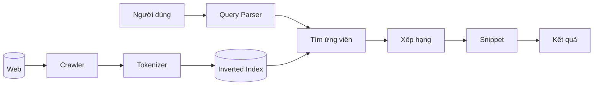

# Máy tìm kiếm hoạt động thế nào — giáo trình từ đầu

> **Tài liệu này là gì?** Một giáo trình đầy đủ về **toàn bộ kiến thức thuật
> toán** đằng sau một máy tìm kiếm, viết theo đúng thứ tự dữ liệu chảy qua hệ
> thống. Mục tiêu: đọc hết tài liệu này thì **tự code lại được** một máy tìm
> kiếm, không chỉ hiểu lý thuyết.
>
> **Khác gì các tài liệu còn lại:** `ALGORITHMS.md` là bảng tra cứu từng thuật
> toán kèm mã; `DSA-REPORT.md` là báo cáo Big-O và số đo. Tài liệu này tập
> trung vào **tại sao** mỗi thuật toán tồn tại và **vấn đề gì** nó giải quyết.
>
> **Mọi ví dụ tính tay đều dùng số liệu thật của dự án:** 5.011 tài liệu,
> 136.768 term, độ dài trung bình 1.043 token.

## Cách đọc tài liệu này

Mỗi chương có bốn loại khối, nhận biết bằng nhãn:

| Khối | Nội dung |
|---|---|
| **Vấn đề** | Nếu không có thuật toán này thì sai/chậm ở đâu — đọc phần này trước |
| **Ví dụ tính tay** | Thay số thật vào công thức, tính ra kết quả cụ thể |
| 💻 **Tự code thử** | Bài tập nhỏ, kèm gợi ý và đường dẫn tới bản cài đặt tham khảo trong repo |
| ⚠️ **Cạm bẫy** | Lỗi thật đã gặp trong dự án này, kèm cách sửa |

Nếu bạn muốn **học để code**, hãy làm các khối 💻 trước khi đọc mã nguồn tham
khảo. Nếu bạn muốn **hiểu để bảo vệ đồ án**, hãy đọc kỹ các khối ⚠️ — đó là
nơi có câu trả lời cho những câu hỏi khó.

## Mục lục

| # | Chương | Trả lời câu hỏi |
|---|---|---|
| 1 | [Bài toán gốc](#1-bài-toán-gốc) | Vì sao không thể duyệt hết mọi tài liệu? |
| 2 | [Thu thập dữ liệu — Crawler](#2-thu-thập-dữ-liệu--crawler) | Làm sao lấy được hàng nghìn trang mà không bị coi là tấn công? |
| 3 | [Tách từ tiếng Việt — Tokenizer](#3-tách-từ-tiếng-việt--tokenizer) | Vì sao tiếng Việt khó hơn tiếng Anh? |
| 4 | [Chỉ mục đảo — Inverted Index](#4-chỉ-mục-đảo--inverted-index) | Cấu trúc nào cho phép tra từ trong O(1)? |
| 5 | [Xử lý truy vấn — Query Processing](#5-xử-lý-truy-vấn--query-processing) | Từ câu truy vấn tới danh sách ứng viên |
| 6 | [Xếp hạng: TF-IDF](#6-xếp-hạng-tf-idf) | Tài liệu nào liên quan nhất? |
| 7 | [Xếp hạng: BM25](#7-xếp-hạng-bm25) | Vì sao cả thế giới đã bỏ TF-IDF? |
| 8 | [Xếp hạng: PageRank](#8-xếp-hạng-pagerank) | Làm sao đánh giá uy tín mà không đọc nội dung? |
| 9 | [Kết hợp điểm và lấy top-K](#9-kết-hợp-điểm-và-lấy-top-k) | Ghép nhiều tín hiệu thành một thứ hạng |
| 10 | [Trình bày kết quả — Snippet](#10-trình-bày-kết-quả--snippet) | Chọn đoạn trích nào để hiển thị? |
| 11 | [Tăng tốc — Cache và Autocomplete](#11-tăng-tốc--cache-và-autocomplete) | Hai cấu trúc làm người dùng cảm thấy nhanh |
| 12 | [Đo chất lượng](#12-đo-chất-lượng--phần-hầu-hết-mọi-người-bỏ-qua) | Làm sao **biết** mình xếp hạng đúng? |
| 13 | [Điều gì vỡ ở quy mô lớn](#13-điều-gì-vỡ-ở-quy-mô-lớn) | Từ 5.011 trang lên 1 tỷ trang |

---

## 1. Bài toán gốc

Người dùng gõ `công nghệ`. Hệ thống có 5.011 tài liệu. Cần trả về 10 tài liệu
**liên quan nhất**, trong vài chục milli-giây.

**Cách ngây thơ:** duyệt cả 5.011 tài liệu, đếm xem tài liệu nào chứa từ khoá.

$$
5{.}011 \text{ tài liệu} \times 1{.}043 \text{ token} = \mathbf{5{,}2 \text{ triệu}} \text{ phép so sánh mỗi truy vấn}
$$

Ở quy mô Google (hàng trăm tỷ trang) thì hoàn toàn bất khả thi. **Toàn bộ
ngành Information Retrieval xoay quanh việc né phép duyệt đó.**

Có ba câu hỏi lớn, và cả tài liệu này là câu trả lời cho chúng:

| Câu hỏi | Trả lời bằng |
|---|---|
| Làm sao tìm nhanh tài liệu **chứa** từ khoá? | Chỉ mục đảo (chương 4) |
| Trong số đó, tài liệu nào **liên quan nhất**? | TF-IDF, BM25, PageRank (chương 6–8) |
| Làm sao **biết** mình xếp hạng đúng? | Các độ đo IR (chương 12) |

Câu hỏi thứ ba là câu hay bị bỏ qua nhất, và cũng là câu phân biệt một đồ án
*"tôi xây được"* với một đồ án *"tôi chứng minh được"*.

### Pipeline đầy đủ



Hai nửa của sơ đồ chạy ở **hai thời điểm khác nhau** — đây là ý tưởng nền tảng
của mọi hệ thống tìm kiếm:

| Nửa | Khi nào chạy | Ngân sách thời gian |
|---|---|---|
| `Web → Crawler → Tokenizer → Index` | **Offline**, một lần sau mỗi lần crawl | Phút tới giờ |
| `Truy vấn → ứng viên → xếp hạng → kết quả` | **Online**, mỗi lần người dùng gõ | Milli-giây |

Mọi thứ đắt đỏ đều được đẩy sang nửa offline. Đó là lý do chỉ mục đảo tồn tại:
nó là **kết quả tính trước** của một câu hỏi sẽ được hỏi hàng triệu lần.

---

## 2. Thu thập dữ liệu — Crawler

### 2.1. Web là một đồ thị

Trang web là **đỉnh**, siêu liên kết là **cạnh có hướng**. Crawl chính là
duyệt đồ thị — bài toán quen thuộc, nhưng với ba đặc thù làm nó khó hơn:

1. Đồ thị **không biết trước** — chỉ phát hiện đỉnh mới sau khi ghé đỉnh cũ.
2. Đồ thị **sâu gần như vô hạn** (trang phân trang, lịch, tìm kiếm nội bộ).
3. Mỗi lần ghé một đỉnh tốn **hàng trăm milli-giây** và làm tốn tài nguyên
   của người khác.

**Vì sao dùng BFS chứ không DFS?** Đặc thù (2) trả lời: DFS sẽ lao xuống một
nhánh và **không bao giờ quay lên**. BFS duyệt theo từng lớp độ sâu, nên với
ngân sách hữu hạn ta thu được các trang **gần seed nhất** — vốn thường là
trang quan trọng nhất (trang chủ, trang chuyên mục).

### 2.2. Hàng đợi không phải FIFO thuần

BFS chuẩn dùng hàng đợi FIFO. Nhưng không phải trang nào cũng đáng giá như
nhau, nên ta thay bằng **hàng đợi ưu tiên**:

$$
\mathrm{priority}(u) = -2\,\mathrm{depth}(u)
\;+\; 0{,}5 \cdot \min\bigl(\mathrm{backlinks}(u),\, 50\bigr)
\;+\; 5 \cdot \mathbb{1}\bigl[u \in \texttt{.vn}\bigr]
$$

Ba chi tiết trong công thức, mỗi cái là một quyết định thiết kế:

| Chi tiết | Lý do |
|---|---|
| Hệ số `−2` cho độ sâu **lớn hơn** hệ số `0,5` cho backlink | Giảm một lớp độ sâu quan trọng hơn có thêm 4 backlink → thuật toán vẫn *giống BFS* thay vì thành greedy thuần |
| `min(backlinks, 50)` | Chặn trên, để một trang có 5.000 backlink không áp đảo hoàn toàn tín hiệu độ sâu |
| `+5` cho `.vn` | Yêu cầu đề bài (máy tìm kiếm tiếng Việt), **không** phải nguyên lý IR tổng quát |

**Mẹo đáng nhớ: biến min-heap thành max-heap.** Ta có `MinHeap` (lấy phần tử
**nhỏ nhất**) nhưng cần lấy phần tử **ưu tiên cao nhất**. Giải pháp: sắp xếp
heap theo `−priority`. Phần tử ưu tiên cao nhất có `−priority` nhỏ nhất nên
vẫn ra đầu tiên. Kỹ thuật này biến một min-heap thành "max-heap theo tiêu chí
X" mà **không phải viết lại cấu trúc**.

```java
new MinHeap<>((a, b) -> Double.compare(-a.priority(), -b.priority()))
```

### 2.3. Politeness — và vì sao nó định hình cả kiến trúc

Nếu bắn 100 request/giây vào một website, bạn đang tấn công DoS họ. Quy tắc:
**mỗi host tối đa 1 request/giây**.

**Hệ quả quan trọng nhất của cả chương này:**

$$
\boxed{\text{thông lượng tối đa (trang/giây)} = \text{số host được crawl đồng thời}}
$$

Muốn 400 trang/giây thì phải có ít nhất **400 host** được crawl song song —
**không phải** mua máy nhanh hơn. Dự án này có **52 host** → trần lý thuyết
52 trang/giây, thực đo **26,2**.

Đây cũng là lý do phải **tách hàng đợi theo host**. Với một heap toàn cục, khi
phần tử đầu thuộc host đang bị hoãn, ta phải rút nó ra, gác lại, rút tiếp…
Trường hợp xấu nhất phải rút **cạn** cả heap rồi nhét lại: **$O(n\log n)$ cho
mỗi lần lấy một URL**.

Giải pháp là `Map<host, MinHeap>` — mỗi host một hàng đợi riêng, chỉ quét qua
các host (`D` nhỏ) rồi lấy một phần tử: **$O(D + \log n_d)$**. Đây chính là mô
hình "back queue" của crawler **Mercator** (Heydon & Najork, 1999).

> ⚠️ **Cạm bẫy: lỗi này không lộ ra ở corpus nhỏ.** Ở quy mô 150 trang, chi
> phí $O(n\log n)$ **không quan sát được**. Nhưng mỗi trang tin tức sinh trung
> bình **78,8 outlink**, nên crawl 5.000 trang đẩy frontier lên hàng chục
> nghìn URL và crawler thực tế **đứng hình**. Bài học: một số lỗi hiệu năng
> chỉ tồn tại ở quy mô, nên **phải thử ở quy mô thật**.

💻 **Tự code thử.** Cài `UrlFrontier` với hai yêu cầu: (a) lấy ra URL ưu tiên
cao nhất trong số các host đã hết hoãn; (b) thread-safe cho nhiều worker.
*Gợi ý:* hai bẫy nằm ở chỗ **dọn heap rỗng** khỏi map (không dọn thì `D` chỉ
tăng) và **ngủ ngoài khối `synchronized`** (ngủ trong khối thì thread đang ngủ
giữ khoá và chặn mọi `addUrl`). Tham khảo:
`datastructure/UrlFrontier.java`, test: `UrlFrontierTest` (11 test, có test 8
thread).

### 2.4. Khử trùng lặp URL — Bloom Filter

Crawl 5.011 trang thu về **394.940 outlink**. Trước khi fetch phải hỏi: "URL
này crawl chưa?"

`HashSet<String>` trả lời được, nhưng phải lưu nguyên chuỗi URL. Đo thực tế
với 1 triệu URL:

| Cấu trúc | Bộ nhớ |
|---|---|
| `HashSet<String>` | **~108 MB** |
| Bloom Filter | **~1,1 MB** |

Chênh **95 lần**, vì Bloom Filter chỉ lưu vài bit trên mỗi phần tử, **độc lập
với độ dài chuỗi gốc**.

**Bloom Filter hoạt động thế nào:**

- Một mảng bit kích thước `m`, ban đầu toàn 0
- **Thêm** phần tử: băm nó bằng `k` hàm băm khác nhau, **bật** `k` bit tương ứng
- **Kiểm tra**: băm lại, nếu **có bất kỳ bit nào bằng 0** → chắc chắn chưa thêm

Ví dụ với `m = 16`, `k = 3`:

```
Ban đầu:            0000 0000 0000 0000

add("a.com/x")   → bật bit 2, 7, 13
                    0010 0001 0000 1000

add("a.com/y")   → bật bit 3, 7, 11
                    0011 0001 0001 1000
                         ↑ bit 7 đã bật rồi, không sao

mightContain("a.com/x") → kiểm bit 2 ✓, 7 ✓, 13 ✓ → "có thể có"  ĐÚNG
mightContain("a.com/z") → giả sử băm ra 3, 11, 7 → cả ba đã bật!
                        → "có thể có"  ← FALSE POSITIVE
mightContain("a.com/w") → giả sử băm ra 5 → bit 5 = 0
                        → "CHẮC CHẮN chưa có"  luôn đúng
```

**Điểm mấu chốt về tính đúng đắn:**

> **Không bao giờ có false negative.** Vì `add()` chỉ **bật** bit, không bao
> giờ tắt. Bit đã bật bởi X sẽ vẫn bật khi kiểm tra lại X, dù có bao nhiêu
> phần tử khác được thêm vào.
>
> **Có thể có false positive.** Nhiều chuỗi khác nhau có thể vô tình bật trùng
> đủ bộ bit.

Với bài toán crawl, đây là **đúng chiều** đánh đổi cần thiết:

| Loại lỗi | Hậu quả | Có xảy ra |
|---|---|---|
| False positive | Bỏ lỡ vài trang chưa crawl | Có, ~1% |
| False negative | Crawl lại trang đã crawl → **vòng lặp vô hạn** | **Không bao giờ** |

**Công thức chọn tham số tối ưu:**

$$
m = \left\lceil \frac{-n \ln p}{(\ln 2)^2} \right\rceil
\qquad
k = \operatorname{round}\!\left(\frac{m}{n}\ln 2\right)
$$

với `n` là số phần tử dự kiến, `p` là tỷ lệ false positive mong muốn, `m` là
số bit cần cấp phát, `k` là số hàm băm.

**Ví dụ tính tay** (`n = 1.000.000`, `p = 0,01`):

$$
m = \left\lceil \frac{10^6 \times 4{,}60517}{0{,}480453} \right\rceil
  = \mathbf{9{.}585{.}059} \text{ bit} = 1{.}170 \text{ KB}
$$

$$
k = \operatorname{round}\!\left(\frac{9{.}585{.}059}{10^6} \times 0{,}693\right)
  = \operatorname{round}(6{,}64) = \mathbf{7}
$$

**Mẹo cài đặt: double hashing** (Kirsch & Mitzenmacher, 2008). Thay vì viết
`k` hàm băm riêng — vừa dài, vừa khó đảm bảo độc lập — chỉ cần **2** hàm băm
thật:

$$
h_i(x) = \bigl(h_1(x) + i \cdot h_2(x)\bigr) \bmod m,
\qquad i = 0, 1, \dots, k-1
$$

Phần còn lại là tổ hợp tuyến tính của chúng, vẫn đảm bảo phân bố đủ tốt (đã
được chứng minh trong bài báo gốc).

> ⚠️ **Ba cạm bẫy khi tự cài Bloom Filter:**
>
> 1. **`Math.floorMod` chứ không phải `%`.** Với `long` có thể tràn thành số
>    âm, và `%` trong Java trả về kết quả **âm** khi toán hạng đầu âm → chỉ số
>    mảng âm → `ArrayIndexOutOfBoundsException`.
> 2. **`h2` phải qua avalanche mix.** Nếu các bit thấp của `h₂` tương quan với
>    `h₁` thì `k` hàm băm dẫn xuất sẽ đụng nhau và tỷ lệ false positive tăng
>    vọt — mà bạn sẽ không phát hiện được vì filter vẫn "hoạt động".
> 3. **Tràn số nguyên khi tính `m`.** Xem mục 13.1.

💻 **Tự code thử.** Cài Bloom Filter với `long[]` và phép dịch bit (không dùng
`java.util.BitSet`). Viết test kiểm: (a) đã `add` thì `mightContain` **luôn**
true — 10.000 phần tử, không được sai một cái nào; (b) tỷ lệ false positive
trên 10.000 phần tử **chưa** add phải xấp xỉ `p` đã cấu hình. Tham khảo:
`datastructure/BloomFilter.java`, test: `BloomFilterTest` (7 test).

### 2.5. Chuẩn hoá URL

`https://a.com` và `https://a.com/` là **cùng một trang** nhưng là **hai chuỗi
khác nhau**. Không chuẩn hoá thì Bloom Filter coi chúng khác nhau và crawl cả
hai.

Dự án này đã dính đúng lỗi đó: **23 cặp trang trùng nhau** trong phiên crawl
đầu tiên, chỉ khác dấu gạch chéo cuối. Hậu quả không chỉ là lãng phí băng
thông — **các bản sao cùng lọt vào chỉ mục và cùng xuất hiện trong kết quả tìm
kiếm**.

Các phép chuẩn hoá **an toàn** (không đổi tài nguyên được trỏ tới):

| Phép | Ví dụ | Vì sao an toàn |
|---|---|---|
| Bỏ fragment | `a.com/x#phan-2` → `a.com/x` | Fragment không được gửi lên máy chủ |
| Hạ chữ thường scheme + host | `HTTPS://A.COM/X` → `https://a.com/X` | RFC 3986: không phân biệt hoa thường |
| Bỏ cổng mặc định | `a.com:443/x` → `a.com/x` | `:443` với https là mặc định |
| Bỏ dấu `/` cuối | `a.com/tin/` → `a.com/tin` | Quy ước |

Hai phép **KHÔNG** được làm, và đây là phần dễ sai:

- **Không hạ chữ thường phần path** — theo RFC 3986, đường dẫn **có** phân
  biệt hoa thường. `/Tin-Tuc` và `/tin-tuc` có thể là hai tài nguyên khác nhau.
- **Không đụng vào query string** — bỏ tham số theo dõi (`utm_*`) hay đảo thứ
  tự tham số **có thể làm trang trả về khác đi**.

**Mẫu thiết kế đáng học: chuẩn hoá tại một điểm vào duy nhất.** Đặt phép
chuẩn hoá ngay trong `UrlFrontier.addUrl()` — cửa duy nhất mà mọi URL đều phải
đi qua — biến "phải nhớ chuẩn hoá" thành "không thể quên chuẩn hoá".

### 2.6. robots.txt

Chuẩn Robots Exclusion Protocol. Điểm dễ sai: khi nhiều luật cùng khớp, **luật
có đường dẫn dài nhất thắng**:

```
Disallow: /admin
Allow: /admin/public
```

→ `/admin/public/x` **được phép** (luật `Allow` dài hơn: 13 ký tự so với 6),
còn `/admin/secret` **bị cấm**.

Hai quyết định đi kèm:

- **Cache theo domain.** Fetch robots.txt qua mạng là thao tác chậm, không thể
  gọi lại cho mọi URL của cùng một domain.
- **Lỗi mạng → mặc định CHO PHÉP.** Đúng theo hành vi khuyến nghị của đặc tả:
  không chặn crawl chỉ vì lỗi hạ tầng.

### 2.7. Lọc theo thứ tự "rẻ trước, đắt sau"

Một mẫu thiết kế nhỏ nhưng đáng nhớ. Crawler có bốn lớp lọc, và thứ tự của
chúng **không** tuỳ ý:

```java
if (task.depth() > config.maxDepth()                            // 1. so sánh số nguyên
        || !isAllowedDomain(task.url(), config.allowedDomains())// 2. parse URL + so chuỗi
        || visited.mightContain(task.url())) {                  // 3. k phép băm
    continue;
}
visited.add(task.url());

if (!robotsTxtParser.isAllowed(USER_AGENT, task.url())) {       // 4. có thể gọi MẠNG
    continue;
}
```

Nhờ toán tử `||` short-circuit của Java, lớp 1 loại được bao nhiêu URL thì lớp
2, 3, 4 khỏi phải xét bấy nhiêu. Sắp ngược thứ tự thì mỗi URL bị loại vì độ
sâu vẫn phải trả chi phí một lần gọi mạng.

---

## 3. Tách từ tiếng Việt — Tokenizer

### 3.1. Vấn đề riêng của tiếng Việt

Tiếng Anh tách từ bằng khoảng trắng: `computer science` → 2 từ, mỗi từ có
nghĩa riêng.

Tiếng Việt **không** như vậy. `máy tính` là **một từ** (computer), nhưng viết
thành 2 tiếng cách nhau bởi khoảng trắng. Tách theo khoảng trắng sẽ được `máy`
(machine) và `tính` (to calculate) — **sai hoàn toàn về nghĩa**.

Ba thuật ngữ cần phân biệt rõ, vì tài liệu này dùng chúng chính xác:

| Thuật ngữ | Định nghĩa | Ví dụ |
|---|---|---|
| **Tiếng** (syllable) | Đơn vị giữa hai khoảng trắng | `máy`, `tính` |
| **Từ** (word) | Đơn vị nhỏ nhất **có nghĩa** | `máy tính` (1 từ, 2 tiếng) |
| **Token** | Đơn vị được đưa vào chỉ mục | `máy_tính` |

**Hệ quả trực tiếp cho tìm kiếm:** nếu index `máy` và `tính` riêng lẻ, thì
truy vấn `máy tính` sẽ khớp cả bài viết về "máy giặt" có chữ "tính tiền".

### 3.2. Thuật toán Longest Matching

Thuật toán tham lam kinh điển:

```
Tại mỗi vị trí i:
    Thử ghép 4 tiếng liên tiếp → có trong từ điển không?
    Không → thử 3 tiếng
    Không → thử 2 tiếng
    Không → lấy 1 tiếng
    Nhảy tới sau cụm vừa ghép
```

**Ví dụ chạy tay** với `khoa học máy tính rất hay`:

| Vị trí | Thử | Từ điển | Kết quả |
|---|---|---|---|
| `khoa` | `khoa học máy tính` (4 tiếng) | ✅ có | token `khoa_học_máy_tính`, nhảy 4 tiếng |
| `rất` | `rất hay` (2 tiếng) | ❌ không | token đơn `rất`, nhảy 1 tiếng |
| `hay` | (hết văn bản) | — | token đơn `hay` |

Kết quả: `[khoa_học_máy_tính, rất, hay]` — 3 token từ 6 tiếng.

**Vì sao phải đi từ DÀI xuống NGẮN.** Nếu đi từ 2 lên 4 thì thành *shortest
matching*, và `khoa học máy tính` sẽ bị cắt thành `khoa_học` + `máy_tính` — hai
token thay vì một, làm mất khái niệm gốc. Chữ "Longest" trong tên thuật toán
chính là chi tiết này.

**Độ phức tạp** $O(n \cdot 4) = O(n)$ vì 4 là hằng số.

⚠️ **Hai chi tiết cài đặt dễ bỏ qua:**

**(a) Từ ghép không bao giờ bị coi là stopword.** Một tiếng có thể là stopword
khi đứng riêng nhưng lại là thành phần mang nghĩa của một từ ghép. Nếu lọc
stopword *trước* khi ghép từ, ta sẽ phá vỡ chính những cụm mình muốn giữ:

```java
if (matchedLen > 1) {
    term = String.join("_", ...);
    isStopword = false;          // ← từ ghép luôn được giữ
} else {
    term = syllables[i];
    isStopword = stopwords.contains(term);
}
```

**(b) `position` chỉ tăng khi token được phát ra.** Stopword bị loại **không
chiếm** một vị trí. Điều này quan trọng cho tìm cụm từ: cụm `"trình duyệt web"`
vẫn khớp dù giữa các tiếng có stopword bị loại.

> ⚠️ **Hạn chế thật của dự án — đây là trần chất lượng của toàn hệ thống.**
> Từ điển `vietnamese-bigrams.txt` chỉ có **154 mục**:
>
> | Số tiếng | Số mục | Ví dụ |
> |---|---|---|
> | 2 tiếng | 131 | `máy tính`, `khoa học`, `internet` |
> | 3 tiếng | 11 | `trình duyệt web`, `mạng xã hội`, `bất động sản` |
> | 4 tiếng | 12 | `khoa học máy tính`, `trí tuệ nhân tạo` |
>
> Thuật toán cài **đúng**, nhưng chạy trên từ điển nhỏ này thì nhiều cụm phổ
> biến không được ghép: `máy tính` **có** nên ghép đúng, còn `bóng đá` **không
> có** nên bị tách thành `bóng` + `đá`. Từ điển tiếng Việt đầy đủ cần
> **30.000–70.000 mục**.
>
> Ghi chú thêm: tên `vietnamese-bigrams.txt` và biến `bigramDictionary` gây
> nhầm — từ điển thực chất chứa cụm **tới 4 tiếng**, không chỉ bigram.

💻 **Tự code thử.** Cài `tokenize(String) → List<Token>` với `Token(term,
noDiacriticTerm, position)`. Kiểm bốn trường hợp: (a) `máy tính` → 1 token
`máy_tính`; (b) `bóng đá` → 2 token (vì thiếu từ điển); (c) `của` bị loại vì
là stopword; (d) `đồng` → bản không dấu là `dong`, **không** phải `đong`.
Tham khảo: `index/VietnameseTokenizer.java`, test:
`VietnameseTokenizerTest` (7 test).

### 3.3. Chuẩn hoá Unicode

Chữ `ế` có **hai cách** biểu diễn hợp lệ trong Unicode:

| Dạng | Biểu diễn | Số ký tự | Byte (UTF-8) |
|---|---|---|---|
| **NFC** (dựng sẵn) | `U+1EBF` | 1 | `E1 BA BF` |
| **NFD** (tổ hợp) | `e` + `◌̂` (U+0302) + `◌́` (U+0301) | 3 | `65 CC 82 CC 81` |

Hai chuỗi trông **y hệt nhau trên màn hình** nhưng **khác nhau về byte**. Không
chuẩn hoá thì cùng một từ tạo ra **hai khoá khác nhau** trong chỉ mục, và người
gõ kiểu này sẽ không tìm được tài liệu gõ kiểu kia — một lỗi **cực khó gỡ** vì
mọi thứ hiển thị đều đúng.

**Giải pháp:** luôn chuẩn hoá về **một** dạng duy nhất (dự án chọn NFC) ở
**mọi** điểm vào: khi tokenize văn bản, khi nạp từ điển, khi chèn vào Trie.

Chi tiết nhỏ nhưng đúng: `toLowerCase(Locale.forLanguageTag("vi"))` — hạ chữ
thường **phụ thuộc ngôn ngữ** (ví dụ nổi tiếng: tiếng Thổ Nhĩ Kỳ có `I` → `ı`),
nên chỉ rõ locale là thói quen đúng chứ không dư thừa.

### 3.4. Sinh bản không dấu

Người Việt hay gõ không dấu trên bàn phím quốc tế: `may tinh` thay vì `máy
tính`. Cách xử lý gồm ba bước, và bước thứ ba là chỗ **hầu như ai cũng sai
lần đầu**:

1. Chuẩn hoá về **NFD** (tách dấu ra thành ký tự riêng)
2. Xoá mọi ký tự thuộc nhóm `\p{M}` (combining mark)
3. **Riêng `đ`/`Đ` phải xử lý thủ công** — nó là một **chữ cái Latin độc lập**
   trong bảng chữ cái tiếng Việt, **không phải** `d` + dấu, nên NFD **không
   tách được**

Bỏ bước 3 thì `đồng` → `đong` (vẫn còn `đ`) và người gõ `dong` sẽ không tìm ra.
Thứ tự cũng quan trọng — xử lý `đ` **trước** rồi mới NFD:

```java
public static String stripDiacritics(String s) {
    String withoutDd = s.replace('đ', 'd').replace('Đ', 'D');
    String nfd = Normalizer.normalize(withoutDd, Normalizer.Form.NFD);
    return nfd.replaceAll("\\p{M}", "");
}
```

Mỗi token được index **hai lần**: bản có dấu và bản không dấu, cùng trỏ tới
một posting list.

**Cái giá phải trả, nói cho công bằng:** hai từ có dấu khác nhau có thể rút về
cùng một dạng không dấu (`ngân` và `ngàn` → `ngan`), làm document frequency của
khoá không dấu lớn hơn thực tế. Đây chính là gốc rễ của lỗi bôi sáng snippet ở
mục 10.3.

### 3.5. Loại từ dừng

Từ như `của`, `và`, `là` xuất hiện trong gần như **mọi** tài liệu nên không
mang thông tin phân biệt, nhưng lại chiếm chỗ **lớn nhất** trong chỉ mục —
posting list của chúng dài nhất. Loại bỏ chúng giúp chỉ mục nhỏ hơn và truy
vấn nhanh hơn. Dự án dùng danh sách **91 từ**.

> **Lưu ý về đánh đổi.** Loại stopword khiến truy vấn `"to be or not to be"`
> (toàn stopword) không tìm được gì. Các hệ thống hiện đại thường **không**
> loại stopword nữa mà để IDF tự xử lý — vì IDF của một từ có mặt khắp nơi vốn
> đã gần 0. Dự án này vẫn loại vì nó giảm đáng kể kích thước chỉ mục ở quy mô
> hiện tại.

---

## 4. Chỉ mục đảo — Inverted Index

### 4.1. Ý tưởng cốt lõi

Chỉ mục **xuôi** (forward index) là thứ tự tự nhiên:

```
doc1 → [máy_tính, xách_tay, giá, rẻ]
doc2 → [công_nghệ, máy_tính, mới]
```

Muốn tìm tài liệu chứa `máy_tính` phải duyệt hết **mọi** tài liệu.

Chỉ mục **đảo** lật ngược lại:

```
máy_tính  → [doc1, doc2]
xách_tay  → [doc1]
công_nghệ → [doc2]
```

Giờ tra `máy_tính` là một phép tra `HashMap`: **$O(1)$**.

Đây là ý tưởng nền tảng của **mọi** máy tìm kiếm. Tên gọi "đảo" chính vì nó
lật quan hệ `tài liệu → từ` thành `từ → tài liệu`.

### 4.2. Posting list chứa gì

Mỗi mục trong danh sách (gọi là **posting**) không chỉ có `docId`:

```java
public record Posting(int docId, int termFrequency, List<Integer> positions) {
}
```

| Trường | Dùng cho | Nếu thiếu thì mất gì |
|---|---|---|
| `docId` | Định danh; cơ sở cho phép giao posting list | Không làm được gì |
| `termFrequency` | TF trong TF-IDF và BM25 | Không xếp hạng được theo nội dung |
| `positions` | Tìm theo cụm từ | Không hỗ trợ được `"cụm từ trong ngoặc kép"` |

Là `record` (bất biến) vì một `Posting` không bao giờ thay đổi sau khi tạo —
index lại thì tạo `Posting` mới.

⚠️ **Cạm bẫy khi tự cài:** phải **gom tất cả vị trí của một term trong một tài
liệu vào MỘT posting**, không phải tạo posting mới mỗi lần gặp token. Nếu tạo
mỗi lần gặp thì một term xuất hiện 5 lần sẽ sinh ra 5 posting cho **cùng** một
`docId`, phá vỡ giả định "mỗi (term, doc) một posting" mà binary search dựa
vào — và binary search sẽ trả về một posting **ngẫu nhiên** trong số đó.

Cách làm đúng: gom vào một `Map<term, List<Integer>>` tạm trước, rồi mới tạo
posting.

### 4.3. Bất biến quan trọng nhất: posting list luôn sắp xếp theo `docId`

Đây là chi tiết dễ bỏ qua nhưng **quyết định toàn bộ hiệu năng phía sau**.

Vì `addDocument()` luôn được gọi theo thứ tự `docId` tăng dần và chỉ
**append** vào cuối, nên posting list **tự nhiên đã sắp xếp** — không tốn
**một phép sort nào**.

Bất biến này mở khoá **hai** thứ, và đó chính là toàn bộ lý do nó tồn tại:

| Mở khoá | Thay vì |
|---|---|
| **Giao posting list bằng two-pointer $O(m+n)$** (mục 5.2) | Sort lại $O(n\log n)$ mỗi truy vấn |
| **Binary search $O(\log n)$** để tra tần suất/vị trí của một tài liệu cụ thể | Quét tuyến tính $O(n)$ |

Người gọi phải giữ đúng tiền đề đó — nên mọi chỗ dựng chỉ mục đều sắp xếp
trước:

```java
sorted.sort(Comparator.comparingInt(WebDocument::getDocId));
for (WebDocument doc : sorted) {
    index.addDocument(doc);
}
```

> **Bài học tổng quát:** chọn đúng **bất biến** khi xây dựng cấu trúc dữ liệu
> thường có giá trị hơn tối ưu thuật toán về sau. Ở đây, một quyết định "chỉ
> append theo thứ tự" — không tốn gì cả — mở khoá hai tối ưu lớn ở tầng trên.

### 4.4. Một chi tiết ít ai để ý: cả ba trường văn bản bị ghép làm một

```java
String combinedText = String.join(" ",
        doc.getTitle(), doc.getMetaDescription(), doc.getBodyText());
```

Nghĩa là chỉ mục **không** biết term nằm ở tiêu đề hay thân bài. Việc "ưu tiên
khớp tiêu đề" được xử lý muộn hơn, ở khâu xếp hạng, bằng `titleMatchBonus`.

Các hệ thống thật (Lucene, Elasticsearch) dùng **fielded index** — mỗi vùng
văn bản một chỉ mục riêng, cho phép đặt trọng số khác nhau cho tiêu đề và thân
bài. Dự án này đơn giản hoá có ý thức, và đó là một hạn chế đã biết.

💻 **Tự code thử.** Cài `InvertedIndex` với `addDocument`, `getPostings`,
`getDocumentFrequency`, `getPositions`. Viết một test khẳng định **bất biến**:
sau khi thêm 100 tài liệu theo thứ tự bất kỳ, mọi posting list phải sắp xếp
tăng dần theo `docId`. *Gợi ý thêm:* duy trì `totalTokens` bằng cách cộng dồn,
đừng tính lại bằng cách duyệt map mỗi lần cần độ dài trung bình — BM25 gọi hàm
đó cho **mọi** ứng viên của **mọi** truy vấn. Tham khảo:
`index/InvertedIndex.java`, test: `InvertedIndexTest` (6 test).

---

## 5. Xử lý truy vấn — Query Processing

### 5.1. Phân tích truy vấn

Truy vấn `"trình duyệt web" máy tính -giá` được tách thành:

| Thành phần | Giá trị | Ý nghĩa |
|---|---|---|
| `phrases` | `[[trình_duyệt_web]]` | Phải xuất hiện **liên tiếp** đúng thứ tự |
| `mustTerms` | `[máy_tính]` | Phải có (AND ngầm định) |
| `excludedTerms` | `[giá]` | Tài liệu chứa từ này bị loại |

> ⚠️ **Điểm then chốt về tính đúng đắn — và là lỗi im lặng nguy hiểm nhất
> trong cả hệ thống.** Truy vấn phải được tokenize bằng **CHÍNH** tokenizer đã
> dùng lúc index. Nếu lúc index tạo ra `máy_tính` mà lúc truy vấn tạo ra `máy`
> + `tính` thì **không bao giờ khớp** — và **không có ngoại lệ nào được ném
> ra**, chỉ là kết quả rỗng một cách khó hiểu.
>
> Cách phòng: truyền tokenizer vào constructor thay vì để mỗi lớp tự tạo, để
> việc dùng chung là **mặc định** chứ không phải điều phải nhớ.

**Hạn chế đã biết.** Dấu `-` chỉ loại trừ **một tiếng** ngay sau nó (giống toán
tử `-word` của Google). `-quảng cáo` chỉ loại trừ `quảng`, còn `cáo` vẫn là
`mustTerm`. Muốn loại trừ cả cụm phải viết `-"quảng cáo"` — chưa hỗ trợ.

### 5.2. Giao posting list bằng two-pointer

Truy vấn `máy tính công nghệ` cần các tài liệu có **cả hai** term. Tức là lấy
**giao** của hai posting list.

Vì cả hai đã sắp xếp, dùng kỹ thuật **two-pointer** (giống bước merge của merge
sort):

```
A: [1, 3, 5, 7, 9]
B: [3, 5, 8]

i=0,j=0: A[0]=1 < B[0]=3  → i++
i=1,j=0: A[1]=3 = B[0]=3  → ghi 3, i++, j++
i=2,j=1: A[2]=5 = B[1]=5  → ghi 5, i++, j++
i=3,j=2: A[3]=7 < B[2]=8  → i++
i=4,j=2: A[4]=9 > B[2]=8  → j++
j hết → dừng

Kết quả: [3, 5]
```

Mỗi phần tử được xét đúng **một** lần: **$O(m+n)$**.

**Vì sao không dùng `HashSet.retainAll`?** Đo thực tế với 2 danh sách 500.000
phần tử:

| Cách làm | Thời gian |
|---|---|
| **Two-pointer** | **~10,0 ms** |
| `HashSet.retainAll` (không tính chi phí dựng HashSet) | ~15,5 ms |
| `HashSet.retainAll` (tính cả chi phí dựng) | ~27,0 ms |

Two-pointer thắng vì: không có chi phí băm và xử lý va chạm, tận dụng trực tiếp
tính đã-sắp-xếp có sẵn, và không cần cấp phát cấu trúc trung gian.

**Dòng nào là so sánh công bằng?** Dòng thứ **3**. Trong hệ thống thật, posting
list lấy thẳng từ chỉ mục, nên nếu dùng `HashSet` thì **phải trả** chi phí dựng
HashSet ở **mỗi** truy vấn — cache HashSet cho 136.768 term là chuyện không khả
thi về bộ nhớ.

### 5.3. Tối ưu shortest-first

Khi truy vấn có nhiều term, **thứ tự giao rất quan trọng**.

Gọi `A` là kết quả giao sau `k` bước. Luôn có
`|A| ≤ min(các list đã xét)`. Vậy nên bắt đầu từ list **ngắn nhất** để `|A|`
nhỏ ngay từ đầu.

**Ví dụ tính tay:** truy vấn 3 term với `iPhone` (df=5), `mới` (df=800),
`của` (df=4000).

| Thứ tự | Bước 1 | Bước 2 | Tổng phần tử duyệt |
|---|---|---|---|
| **Ngắn trước**: 5 → 800 → 4000 | `5 ∩ 800` = 805, kết quả ≤ 5 | `5 ∩ 4000` = 4005 | **4.810** |
| Dài trước: 4000 → 800 → 5 | `4000 ∩ 800` = 4800, kết quả ≤ 800 | `800 ∩ 5` = 805 | **5.605** |

Chênh 17% ở ví dụ này, và khoảng cách **giãn nhanh** khi số term tăng, vì kết
quả trung gian lớn ở bước đầu sẽ bị mang theo qua mọi bước sau. Đặc biệt lợi
khi một term **hiếm** trộn với nhiều term **phổ biến**.

Kèm hai tối ưu thoát sớm đáng nhớ:

- Trong `intersectAll`: giao rỗng thì **dừng ngay**, không duyệt các list còn
  lại — với AND ngầm định, rỗng là rỗng mãi.
- Trong `CandidateResolver`: nếu **bất kỳ** term nào có `df = 0` thì trả rỗng
  **trước khi** gọi `intersectAll` — không cần giao gì cả.

### 5.4. Tìm theo cụm từ

`"trình duyệt web"` yêu cầu 3 từ xuất hiện **liên tiếp đúng thứ tự**, không chỉ
là cùng có mặt trong tài liệu. Đây là lúc `positions` phát huy tác dụng:

```
Trong doc5:
  trình  xuất hiện ở vị trí [2, 17]
  duyệt  xuất hiện ở vị trí [3, 40]
  web    xuất hiện ở vị trí [4, 41]

Thử start = 2:  cần duyệt ở 3 ✅, web ở 4 ✅  → KHỚP
Thử start = 17: cần duyệt ở 18 ❌            → không khớp
```

Thuật toán: với mỗi vị trí của từ đầu tiên, kiểm tra từ thứ `i` có nằm ở
`start + i` hay không.

💻 **Tự code thử.** Cài `intersect`, `union`, `intersectAll` (có shortest-first)
và `matchesPhrase`. *Bẫy để tự tìm:* trong `union`, đừng quên **hai** vòng
`while` dọn phần đuôi còn lại sau khi một danh sách đã hết. Tham khảo:
`query/PostingListMerger.java`, test: `PostingListMergerTest` (9 test).

---

## 6. Xếp hạng: TF-IDF

Đã tìm được 1.639 tài liệu chứa `công nghệ`. Giờ phải xếp hạng chúng.

### 6.1. Trực giác

Một tài liệu liên quan tới từ khoá khi:

1. Từ khoá xuất hiện **nhiều lần** trong nó → **TF** (term frequency)
2. Từ khoá **hiếm gặp** trong toàn corpus → **IDF** (inverse document frequency)

Ý thứ 2 quan trọng hơn người ta tưởng. Từ `của` xuất hiện trong mọi tài liệu
nên **không phân biệt được gì**. Từ `blockchain` chỉ có trong vài tài liệu nên
**rất giàu thông tin**.

### 6.2. Công thức

$$
\mathrm{tf}(t,d) \;=\; 1 + \log_{10} f_{t,d}
\qquad
\mathrm{idf}(t) \;=\; \log_{10}\frac{N}{\mathrm{df}_t}
\qquad
w_{t,d} \;=\; \mathrm{tf}(t,d)\cdot\mathrm{idf}(t)
$$

trong đó `f_{t,d}` là số lần term `t` xuất hiện trong tài liệu `d`, `N` là tổng
số tài liệu, `df_t` là số tài liệu chứa `t`.

**Vì sao TF dùng logarit?** Nếu dùng `tf` thô, tài liệu lặp từ khoá 100 lần sẽ
được điểm gấp 100 lần tài liệu chỉ có 1 lần. Nhưng nó **không liên quan gấp 100
lần** — chỉ là spam từ khoá. Logarit nén khoảng cách đó lại:

| `f` | `tf` thô | `1 + log₁₀(f)` |
|---|---|---|
| 1 | 1 | 1,00 |
| 10 | 10 | 2,00 |
| 100 | 100 | 3,00 |
| 1000 | 1000 | 4,00 |

Tăng `f` gấp 10 lần chỉ cộng thêm 1 vào `tf`.

**Ví dụ tính tay** (`N = 5.011` tài liệu):

| Term | `df` | `idf = log₁₀(5011/df)` |
|---|---|---|
| `công_nghệ` (phổ biến) | 1.639 | `log₁₀ 3,06` = **0,486** |
| `máy_tính` (trung bình) | 50 | `log₁₀ 100,2` = **2,001** |
| `blockchain` (hiếm) | 5 | `log₁₀ 1002` = **3,001** |

Term hiếm được trọng số cao gấp **6 lần** term phổ biến.

Một tài liệu chứa `máy_tính` 5 lần:

$$
\mathrm{tf} = 1 + \log_{10} 5 = 1{,}699
\qquad
w = 1{,}699 \times 2{,}001 = \mathbf{3{,}400}
$$

### 6.3. Cosine similarity

Biểu diễn truy vấn và tài liệu thành **vector** trong không gian nhiều chiều
(mỗi term là một chiều). Độ liên quan = **cosin góc giữa hai vector**:

$$
\mathrm{sim}(q,d) \;=\; \cos\theta \;=\; \frac{\vec{q} \cdot \vec{d}}{\|\vec{q}\|\;\|\vec{d}\|}
\;=\; \frac{\sum_t w_{t,q}\, w_{t,d}}{\sqrt{\sum_t w_{t,q}^2}\;\sqrt{\sum_t w_{t,d}^2}}
$$

**Vì sao phải chia cho độ dài vector?** Nếu không, tài liệu **dài** luôn thắng
— chỉ vì chứa nhiều từ hơn nên tích vô hướng lớn hơn, chứ không phải vì liên
quan hơn. Chia cho độ dài đưa mọi tài liệu về cùng thang đo.

**Vì sao dùng cosin chứ không phải khoảng cách Euclid?** Vì cosin chỉ quan tâm
**hướng** của vector, không quan tâm **độ lớn**. Một bài 500 từ và một bài
5.000 từ nói về cùng chủ đề có vector cùng hướng nhưng độ lớn rất khác — cosin
coi chúng tương đương, khoảng cách Euclid thì không.

**Xấp xỉ của Lucene.** Dự án dùng `‖d‖ ≈ √(độ dài tài liệu)`. Tính chuẩn xác
`‖d‖` đòi hỏi duyệt **mọi** term của tài liệu, tốn $O(\lvert V\rvert)$ cho mỗi tài
liệu — trong khi `getDocLength(docId)` là $O(1)$ vì đã lưu sẵn. Đây là xấp xỉ
kinh điển của Lucene classic Similarity, và nó vẫn phát huy đúng tính chất
"trang dài không được lợi thế quá mức vì lặp từ nhiều hơn".

💻 **Tự code thử.** Cài `tf`, `idf`, `score`. *Ba biên phải xử lý:* (a)
`df = 0` (term không có trong chỉ mục) → trả 0; (b) `df = N` (term có trong mọi
tài liệu) → `idf = 0`, bỏ qua term đó; (c) tài liệu rỗng → chặn chia cho 0 bằng
`Math.max(docLength, 1)`. Tham khảo: `ranking/TfIdfScorer.java`, test:
`TfIdfScorerTest` (8 test).

---

## 7. Xếp hạng: BM25

BM25 (Okapi BM25) là **chuẩn công nghiệp** hiện nay, thay thế TF-IDF trong hầu
hết hệ thống thật (Elasticsearch dùng nó làm mặc định). Nó sửa **đúng ba**
nhược điểm cụ thể của TF-IDF cosine.

### 7.1. Công thức

$$
\mathrm{score}(D,Q) \;=\; \sum_{q \in Q} \mathrm{IDF}(q)\;\cdot\;
\frac{f(q,D)\,\bigl(k_1 + 1\bigr)}
     {f(q,D) + k_1\left(1 - b + b\,\dfrac{|D|}{\mathrm{avgdl}}\right)}
$$

$$
\mathrm{IDF}(q) \;=\; \ln\!\left(1 + \frac{N - \mathrm{df}_q + 0{,}5}{\mathrm{df}_q + 0{,}5}\right)
$$

với `k₁ = 1,2` và `b = 0,75` (giá trị chuẩn qua nhiều thập kỷ thực nghiệm
TREC), `|D|` là độ dài tài liệu và `avgdl` là độ dài trung bình của toàn
corpus.

### 7.2. Cải tiến 1: bão hoà tần suất

Ở TF-IDF, `tf = 1 + log₁₀(f)` vẫn **tăng vô hạn** theo `f`. Ở BM25, phân thức

$$
\frac{f}{f + k_1(\cdots)}
$$

tiến tới **trần** `k₁ + 1` khi `f → ∞`.

**Ví dụ tính tay** (`N = 5011`, `df = 50`, tài liệu độ dài trung bình nên
`|D| = avgdl`):

$$
\mathrm{IDF} = \ln\!\left(1 + \frac{5011 - 50 + 0{,}5}{50{,}5}\right) = \ln 99{,}25 = 4{,}598
$$

$$
k_1\left(1 - b + b\cdot\frac{|D|}{\mathrm{avgdl}}\right) = 1{,}2\,(1 - 0{,}75 + 0{,}75) = 1{,}2
$$

| `f` | BM25 | TF-IDF (trọng số tf) |
|---|---|---|
| 5 | `4,598 × 11/6,2` = **8,16** | `1 + log₁₀ 5` = **1,70** |
| 50 (gấp 10 lần) | `4,598 × 110/51,2` = **9,88** | `1 + log₁₀ 50` = **2,70** |
| **Tỷ lệ tăng** | **1,21×** | **1,59×** |

Lặp từ khoá gấp 10 lần chỉ tăng điểm BM25 **1,21 lần**. Điều này khớp với trực
giác: bài đã nói về "bóng đá" 20 lần thì rõ ràng nói về bóng đá rồi, lặp thêm
30 lần nữa chỉ là dấu hiệu nhồi từ khoá.

### 7.3. Cải tiến 2: chuẩn hoá độ dài có tham số

TF-IDF chia **cứng** cho `√(docLength)`. BM25 có tham số `b`:

| `b` | Hành vi |
|---|---|
| `0` | Không phạt tài liệu dài chút nào |
| `1` | Chuẩn hoá hoàn toàn theo `|D|/avgdl` |
| **`0,75`** | Dung hoà (mặc định) |

Có tham số nghĩa là **điều chỉnh được theo đặc thù corpus**. Corpus toàn bài
báo dài đều nhau thì `b` nhỏ cũng được; corpus trộn tweet với luận văn thì cần
`b` lớn.

### 7.4. Cải tiến 3: IDF không bao giờ âm

TF-IDF: `log₁₀(N/df)`. Khi `df > N/2` thì giá trị này **âm** — tài liệu chứa
term đó bị **trừ** điểm, một hành vi vô lý.

BM25 bọc trong `ln(1 + …)` nên luôn dương. Kiểm chứng với `N = 10`, `df = 10`
(term có trong **mọi** tài liệu):

| | Giá trị |
|---|---|
| TF-IDF | `log₁₀(10/10)` = **0** (triệt tiêu hoàn toàn) |
| BM25 | `ln(1 + 0,5/10,5)` = **0,0465** (chỉ giảm trọng số) |

Dạng IDF này xuất phát từ mô hình xác suất **Robertson–Sparck Jones**; các số
hạng `+0,5` là làm trơn, tránh chia cho 0.

### 7.5. Kết quả thực nghiệm

Trên corpus 5.011 tài liệu với 200 truy vấn known-item:

| Mô hình | MRR | Success@1 |
|---|---|---|
| TF-IDF thuần | 0,8537 | 78,0% |
| **BM25 thuần** | **0,8989** | **85,0%** |

BM25 thắng **+5,3%** — đúng như lý thuyết dự đoán. Đây là loại kết quả có giá
trị nhất trong một đồ án: **lý thuyết dự đoán, thực nghiệm xác nhận**.

💻 **Tự code thử.** Cài `BM25Scorer` sau `TfIdfScorer`, đặt cả hai sau **cùng
một giao diện** `RelevanceScorer`. Đây không phải chi tiết trang trí — chính
giao diện đó cho phép thay mô hình tính điểm trong thí nghiệm ablation mà không
sửa gì ở `ResultRanker`.

Viết test kiểm **tính chất** thay vì hardcode số — bền hơn nhiều khi đổi
`k₁`/`b`:
- Bão hoà: `score(f=50) / score(f=5) < 1,5`
- IDF không âm: `idf(N, df) ≥ 0` với **mọi** `df` từ 1 tới `N`
- Ảnh hưởng của `b`: `BM25(b=1)` phạt tài liệu dài **nặng hơn** `BM25(b=0)`

Tham khảo: `ranking/BM25Scorer.java`, test: `BM25ScorerTest` (11 test).

---

## 8. Xếp hạng: PageRank

TF-IDF và BM25 chỉ nhìn vào **nội dung**. Nhưng nội dung có thể bị giả mạo —
ai cũng viết được một trang nhồi từ "máy tính" 500 lần.

PageRank nhìn vào **cấu trúc liên kết**, thứ khó giả mạo hơn nhiều vì nó phụ
thuộc vào hành vi của **người khác**.

Một khác biệt quan trọng nữa: PageRank **độc lập với truy vấn**, nên tính được
**một lần** offline rồi dùng cho mọi truy vấn. TF-IDF thì phải tính lại cho
từng truy vấn.

### 8.1. Trực giác: người lướt web ngẫu nhiên

Tưởng tượng một người lướt web mãi mãi:

- 85% thời gian: bấm một liên kết ngẫu nhiên trên trang hiện tại
- 15% thời gian: chán, gõ một URL ngẫu nhiên bất kỳ

**PageRank của một trang = xác suất người đó đang ở trang đó tại một thời điểm
ngẫu nhiên.**

Trang được nhiều trang khác trỏ tới → dễ bị ghé thăm → PageRank cao.

**Vì sao cần 15% "gõ URL ngẫu nhiên"?** Không có nó, người lướt sẽ mắc kẹt
trong các "bể hút" — nhóm trang chỉ trỏ vào nhau, không trỏ ra ngoài — và toàn
bộ PageRank sẽ dồn vào đó. Thành phần này (gọi là *teleport* hay *damping*)
đảm bảo mọi trang đều có xác suất được ghé thăm dương.

### 8.2. Công thức

$$
PR(j) \;=\; \frac{1-d}{N} \;+\; d\left(
\sum_{i \,\rightarrow\, j} \frac{PR(i)}{L(i)}
\;+\; \frac{M_{\text{dangling}}}{N}
\right)
$$

với `d = 0,85` (damping factor), `L(i)` là số outlink của trang `i`,
`i → j` nghĩa là trang `i` có liên kết trỏ tới trang `j`, và `M_dangling` là
tổng PageRank của các trang không có outlink nào.

Ba thành phần:

| Thành phần | Ý nghĩa |
|---|---|
| `(1−d)/N` | Xác suất nhảy ngẫu nhiên (teleport) tới trang này |
| `Σ PR(i)/L(i)` | "Phiếu bầu" từ các trang trỏ tới |
| `M_dangling/N` | Xử lý trang cụt (xem 8.4) |

**Điểm tinh tế quan trọng nhất:** một trang **chia đều** PageRank của nó cho
các trang nó trỏ tới. Trang trỏ đi 100 link thì mỗi link chỉ mang 1/100 giá trị
— nên **spam link không có tác dụng**. Đây là điều làm PageRank khó gian lận
hơn "đếm số backlink" đơn thuần.

### 8.3. Power iteration

Không giải hệ phương trình (`N × N` với `N` hàng tỷ là bất khả thi). Thay vào
đó **lặp**:

1. Khởi tạo mọi trang: `PR = 1/N`
2. Áp dụng công thức cho mọi trang
3. Lặp lại cho tới khi **hội tụ**: `Σ|PR_mới − PR_cũ| < 10⁻⁶` (chuẩn L1)

**Ví dụ chạy tay** trên đồ thị 3 node: A→B, B→C, C→A.

| Vòng | PR(A) | PR(B) | PR(C) | diff L1 |
|---|---|---|---|---|
| 0 (khởi tạo) | 0,3333 | 0,3333 | 0,3333 | — |
| 1 | 0,3333 | 0,3333 | 0,3333 | **0** → dừng ngay |

Vì sao hội tụ tức thì: mỗi trang có đúng 1 liên kết vào và 1 liên kết ra, nên
theo đối xứng `PR = 1/3` cho cả ba, và đó **đã là điểm bất động** ngay từ vòng
đầu. Đây chính là loại tính chất mà `PageRankServiceTest` kiểm chứng — thay vì
hardcode số.

**Thực đo trên dự án:**

| Corpus | Số vòng lặp |
|---|---|
| Đồ thị 6 node | 1–28 |
| 40 trang (seed rút gọn) | 20 |
| 150 trang, 1 domain | 44 |
| **5.011 trang, 6 domain** | **53** |

Đồ thị càng lớn và càng nhiều liên kết chéo thì càng cần nhiều vòng để hội tụ.

### 8.4. Dangling node — cái bẫy kinh điển

Trang **không có outlink nào** (file PDF, trang cụt) làm "rò rỉ" xác suất ra
khỏi hệ thống. Người lướt vào đó rồi mắc kẹt, và tổng PageRank **tụt dần về 0**
— vi phạm tính chất `Σ PR = 1`.

Cách xử lý: gom toàn bộ PageRank của các trang cụt (`danglingMass`) rồi **phân
phối đều** cho tất cả `N` trang. Tương đương với việc người lướt gõ URL ngẫu
nhiên khi bị mắc kẹt.

⚠️ **Định nghĩa "dangling" hẹp hơn bạn tưởng.** Trong cài đặt này, chỉ những
outlink **trỏ vào trang khác TRONG corpus đã crawl** mới được tính là cạnh, và
self-link bị loại:

```java
Integer targetIdx = urlToIndex.get(outlink);
if (targetIdx != null && targetIdx != idx) {   // trong corpus VÀ không tự trỏ
    outDegree[idx]++;
}
```

Hệ quả: trong **394.940** outlink thu được, chỉ **239.691** trở thành cạnh của
đồ thị PageRank. Và một trang có hàng trăm outlink nhưng **tất cả** đều trỏ ra
ngoài corpus thì vẫn là **dangling node** theo định nghĩa này.

⚠️ **Mẹo cài đặt: không cần phép transpose.** Định nghĩa toán học là
`M[i][j] = 1/L(i)` nếu `i → j`, rồi phải tính `Mᵀ · PR`. Nếu bạn **lưu ngược
chiều ngay từ đầu** — hàng `j` là danh sách các nguồn `i` trỏ tới `j` — thì
phép nhân ma trận-vector thông thường đã tính đúng `Mᵀ · PR`, khỏi cần thao
tác transpose riêng. Đây chỉ là chọn "chiều lưu" của ma trận, không phải thủ
thuật gì phức tạp, nhưng nó tiết kiệm một bước $O(\text{nnz})$ và một bản copy ma
trận.

### 8.5. Ma trận thưa — vì sao bắt buộc

Đồ thị liên kết là một ma trận `N × N`. Với `N = 5.011`:

```
Ma trận đặc: 5011 × 5011 × 8 byte = 191,5 MB
Thực tế chỉ có 239.691 ô khác 0 → adjacency list: ~3,7 MB
```

**Tỷ lệ thưa và quy mô — đây là bài học quan trọng:**

| Corpus | nnz | nnz/N² |
|---|---|---|
| 150 trang, **1 domain** | 3.901 | **17,3%** |
| 5.011 trang, **6 domain** | 239.691 | **0,95%** |

Càng nhiều domain, ma trận càng thưa, lợi ích càng lớn. Đồ thị web thật (nhiều
triệu domain) có tỷ lệ thưa dưới 0,01%.

Nếu chỉ đo ở corpus 150 trang, ta có thể kết luận **sai** rằng "ma trận thưa
không lợi bao nhiêu" — 17,3% chưa đủ ấn tượng. Đây là ví dụ cụ thể cho nguyên
tắc: **kết luận phụ thuộc quy mô đo, nên phải đo ở nhiều quy mô.**

### 8.6. PageRank chỉ có nghĩa khi có liên kết chéo domain

Corpus 150 trang cùng một tờ báo có **0 liên kết chéo domain**. Liên kết nội bộ
một website phản ánh **cấu trúc điều hướng** (menu, chuyên mục, bài liên quan)
chứ không phản ánh **uy tín**. PageRank trên đó gần như vô nghĩa: nó chỉ nói
"trang chủ được menu trỏ tới nhiều nhất" — điều ai cũng biết.

Corpus 6 báo có **42.002 liên kết chéo** (17,5% trong 239.691 cạnh) — báo này
dẫn nguồn báo kia, đó mới là "phiếu bầu" thật.

Đây chính là lý do `MultiDomainCrawlRunner` được viết ra, và là ví dụ cho một
nguyên tắc quan trọng: **có thuật toán đúng chưa đủ, dữ liệu phải có đúng cấu
trúc mà thuật toán cần.**

💻 **Tự code thử.** Cài `SparseMatrix` (adjacency list theo hàng) rồi
`PageRankService` bằng power iteration. *Ba test tính chất nên viết:*
(a) `Σ PR ≈ 1` sau khi hội tụ; (b) chu trình đối xứng A→B→C→A cho `PR` bằng
nhau; (c) thêm một dangling node thì `Σ PR` **vẫn** ≈ 1. Tham khảo:
`ranking/PageRankService.java`, `datastructure/SparseMatrix.java`, test:
`PageRankServiceTest` (6 test), `SparseMatrixTest` (6 test).

---

## 9. Kết hợp điểm và lấy top-K

### 9.1. Kết hợp tuyến tính

```
finalScore = α·relevance + β·pageRank + γ·titleBonus
```

Mặc định `α = 0,6`, `β = 0,3`, `γ = 0,1`, đọc từ `application.properties` nên
đổi được không cần biên dịch lại.

`titleBonus` là tỷ lệ tiếng trong truy vấn xuất hiện ở tiêu đề, chặn trên bằng
1.

### 9.2. Cái bẫy lớn: thang đo không tương thích

> Đây là **phát hiện quan trọng nhất** khi đánh giá dự án này, và là loại lỗi
> mà rất nhiều hệ thống thật cũng mắc.

Công thức trên **ngầm giả định ba đại lượng cùng thang đo**. Đo thực tế trên
852 cặp (truy vấn, kết quả top-10):

| Thành phần | Trung bình | Lớn nhất | Sau khi nhân trọng số |
|---|---|---|---|
| TF-IDF cosine | 0,177687 | 1,894824 | 0,106612 (α = 0,6) |
| PageRank | 0,00035388 | 0,00769142 | 0,00010616 (β = 0,3) |
| Title bonus | trong `[0, 1]` | 1,0 | tối đa 0,1 (γ = 0,1) |

TF-IDF đóng góp **gấp ~1.004 lần** PageRank.

**Nguyên nhân:** PageRank là một **phân phối xác suất tổng bằng 1** trên `N`
tài liệu, nên giá trị điển hình quanh `1/N ≈ 0,0002`. TF-IDF cosine nằm trong
`[0; 1]` với giá trị điển hình lớn hơn hàng nghìn lần.

**Hệ quả:** `β = 0,3` **không** có nghĩa "PageRank đóng góp 30%". Trên thực tế
nó gần như không ảnh hưởng tới thứ hạng ở **mọi** giá trị β thử nghiệm.

**Hệ quả nghiêm trọng hơn cho việc diễn giải:** chênh lệch quan sát được trong
phép quét β thực chất phản ánh việc **α bị thay đổi theo** (do ràng buộc
`α = 0,9 − β` trong thí nghiệm), tức là tỷ lệ giữa TF-IDF và title bonus, chứ
**không** phải ảnh hưởng của PageRank. Nếu không phát hiện điều này, ta sẽ rút
ra kết luận hoàn toàn sai về vai trò của PageRank.

**Cách sửa:** chuẩn hoá PageRank về cùng thang trước khi kết hợp — chia cho
PageRank lớn nhất, hoặc min-max normalisation trên tập ứng viên của từng truy
vấn.

> **Bài học tổng quát:** khi kết hợp tuyến tính nhiều tín hiệu, **luôn kiểm tra
> độ lớn thực tế** của từng thành phần trước khi diễn giải trọng số. Một trọng
> số lớn không có nghĩa là ảnh hưởng lớn.

### 9.3. Lấy top-K bằng Min-Heap

Có 1.639 ứng viên, cần 10 kết quả tốt nhất. Sort toàn bộ là **$O(n\log n)$** —
lãng phí, vì ta **vứt đi 1.629 kết quả**.

**Kỹ thuật heap kích thước K.** Ý tưởng cốt lõi: đỉnh của min-heap là **phần tử
nhỏ nhất trong K tốt nhất hiện tại**, nên nó chính là "ngưỡng cửa" — phần tử
mới chỉ cần so với đỉnh là biết có đáng vào hay không.

```
Duy trì min-heap tối đa K phần tử:
    Nếu heap chưa đủ K → thêm vào
    Ngược lại, nếu phần tử mới > đỉnh heap:
        bỏ đỉnh, thêm phần tử mới
Cuối cùng: lấy hết heap ra (được thứ tự tăng) rồi ĐẢO NGƯỢC
```

Độ phức tạp **$O(n\log K)$**. Với `n = 1639`, `K = 10`:

| Cách | Phép so sánh (xấp xỉ) |
|---|---|
| Sort toàn bộ | `1639 × log₂(1639)` ≈ **17.300** |
| Heap top-K | `1639 × log₂(10)` ≈ **5.400** |

Nhanh hơn ~3,2 lần, và khoảng cách **càng giãn khi `n` lớn** — vì `log K` là
hằng số còn `log n` thì không.

💻 **Tự code thử.** Cài `MinHeap` với `insert`, `extractMin`, `peek`, rồi thêm
`static topK(Collection, k, Comparator)`. *Biểu diễn:* phần tử tại `i` có con
trái ở `2i+1`, con phải ở `2i+2`, cha ở `(i−1)/2` — mảng, không con trỏ.
*Đừng quên* đảo ngược kết quả cuối, vì `extractMin` liên tiếp cho thứ tự **tăng**
dần. Tham khảo: `datastructure/MinHeap.java`, test: `MinHeapTest` (8 test).

---

## 10. Trình bày kết quả — Snippet

Snippet là đoạn trích hiển thị dưới mỗi kết quả, có bôi vàng từ khoá. Nó quan
trọng hơn vẻ ngoài: người dùng quyết định bấm vào kết quả nào **chủ yếu dựa
trên snippet**, không phải tiêu đề.

### 10.1. Cửa sổ trượt

Bài toán: trong một bài viết 1.043 token, chọn đoạn 25 từ **chứa nhiều từ khoá
nhất**.

Cách ngây thơ: với mỗi vị trí, đếm lại số từ khoá trong cửa sổ →
**$O(n\cdot w)$**.

**Cửa sổ trượt:** khi trượt sang phải một bước, chỉ có **một** từ ra khỏi cửa
sổ và **một** từ vào:

```
count = count − (từ vừa ra là từ khoá ? 1 : 0)
              + (từ vừa vào là từ khoá ? 1 : 0)
```

Cập nhật $O(1)$ mỗi bước → tổng **$O(n)$**.

**Ví dụ chạy tay** với `windowSize = 3`, dấu `*` là từ khoá:

```
Văn bản:  a  b* c  d* e* f
Cửa sổ [0,3): a b* c        → count = 1
Trượt → [1,4): ra a(0), vào d*(1)  → count = 1 − 0 + 1 = 2  ★ tốt nhất
Trượt → [2,5): ra b*(1), vào e*(1) → count = 2 − 1 + 1 = 2
Trượt → [3,6): ra c(0), vào f(0)   → count = 2 − 0 + 0 = 2
```

Ba cửa sổ cùng đạt 2. Vì code dùng so sánh `>` **chặt**, cửa sổ **sớm nhất**
thắng — với bài báo thì đoạn đầu thường là đoạn dẫn, nên đây là mặc định tốt.

⚠️ **Cạm bẫy: nhớ tiền xử lý `isMatch[]` một lần.** Nếu gọi hàm so khớp lại ở
mỗi vòng trượt thì phép so khớp (có cả bỏ dấu, hạ chữ thường) bị lặp
`windowSize` lần cho mỗi từ — và bạn đã mất trắng ưu điểm $O(1)$ vừa giành
được.

### 10.2. Chỉ sinh snippet cho top-N

Một lỗi hiệu năng thật đã gặp trong dự án: `buildSnippet()` được gọi cho **mọi**
ứng viên rồi mới cắt top-N. Với 500 ứng viên thì **490 snippet bị tạo ra rồi
vứt đi ngay**.

Sửa thành 3 bước: **chấm điểm → lấy top-K → chỉ sinh snippet cho K tài liệu
sống sót.** Chi phí giảm từ $O(c\cdot\lvert d\rvert)$ xuống $O(\text{topN}\cdot\lvert d\rvert)$.

**Vì sao Big-O không phát hiện được lỗi này.** Vì cả hai bản đều là "một vòng
lặp qua `c` ứng viên". Sai lệch nằm ở **hằng số** bên trong vòng lặp — mà Big-O
cố ý bỏ qua hằng số. Đây là lý do cụ thể cho câu "Big-O không thay thế được
việc đo".

### 10.3. Bôi sáng: cạm bẫy bỏ dấu

Ban đầu mọi từ đều bị bỏ dấu trước khi so khớp. Kết quả sai:

```
Truy vấn: "ngân hàng"
Snippet:  Nhiều <mark>ngân</mark> <mark>hàng</mark> cắt giảm cả <mark>ngàn</mark> nhân sự
                                                              ↑ SAI
```

`ngân` và `ngàn` bỏ dấu đều thành `ngan` nên đụng nhau.

Nhưng **không thể đơn giản bỏ hẳn việc bỏ dấu** — vì như vậy người gõ `may
tinh` sẽ không được bôi sáng `máy tính` nữa. Hai yêu cầu này trông như xung
đột.

**Quy tắc đúng: giữ hai tập, và để chính truy vấn quyết định dùng tập nào.**

| Người dùng gõ | Vào tập nào | Kết quả |
|---|---|---|
| `ngân` (**có** dấu) | chỉ `exact` | Chỉ `ngân` sáng, `ngàn` không |
| `ngan` (**không** dấu) | cả `exact` và `loose` | Cả `ngân` và `ngàn` đều sáng |

Trường hợp thứ hai **đúng như mong đợi**: khi người dùng gõ không dấu thì chính
họ cũng chưa phân biệt, nên bôi sáng cả hai là hợp lý.

> **Nguyên tắc tổng quát — đáng ghi nhớ nhất trong chương này:** bỏ dấu là
> **cần** ở khâu tra cứu chỉ mục (để gõ `may tinh` tìm được `máy tính`), nhưng
> **thừa và gây sai** ở khâu bôi sáng — vì lúc đó ta **đã biết chính xác người
> dùng gõ gì**.
>
> Nói rộng hơn: một kỹ thuật đúng ở tầng này có thể sai ở tầng khác. Đừng áp
> dụng máy móc chỉ vì "chỗ kia cũng làm vậy".

---

## 11. Tăng tốc — Cache và Autocomplete

Hai cấu trúc trong chương này không làm hệ thống **đúng** hơn, chỉ làm người
dùng **cảm thấy** nhanh hơn. Nhưng cảm nhận đó là phần lớn trải nghiệm.

### 11.1. LRU Cache

Truy vấn phổ biến được lặp lại rất nhiều. Cache kết quả theo khoá
`query + page + size`.

**LRU (Least Recently Used)**: khi cache đầy, loại bỏ mục **lâu nhất không được
dùng**.

Yêu cầu: cần hai thao tác **đồng thời** $O(1)$ — tra cứu theo khoá, và di
chuyển một mục lên đầu thứ tự sử dụng. Một cấu trúc không làm được cả hai, nên
**ghép hai cấu trúc**:

```
HashMap:   khoá → node          (tra cứu O(1))
Danh sách: MRU ⟷ ... ⟷ LRU      (thứ tự sử dụng)
```

- `get(k)`: tra HashMap $O(1)$, chuyển node lên đầu $O(1)$
- `put(k,v)`: thêm vào đầu, nếu quá sức chứa thì xoá node cuối $O(1)$

**Ba câu hỏi hay bị hỏi khi bảo vệ, và câu trả lời:**

**(a) Vì sao danh sách liên kết *đôi*?** Để xoá một node ở **giữa** danh sách
trong $O(1)$, cần biết **cả** node trước và node sau. Danh sách liên kết đơn
phải duyệt từ đầu để tìm node trước → $O(n)$, và khi đó cache LRU mất hoàn toàn
ưu điểm.

**(b) Vì sao 2 sentinel node?** Hai node giả ở đầu và cuối, không chứa dữ liệu.
Nhờ chúng, thao tác xoá chỉ cần **2 dòng** và **không bao giờ** phải kiểm tra
`null` cho trường hợp đặc biệt ở biên — mọi node thật đều chắc chắn có `prev`
và `next`. Không có sentinel thì hàm này phải thành 6–8 dòng với các nhánh
`if (node.prev == null)` — mỗi nhánh là một chỗ có thể sai.

**(c) Vì sao `get()` phải dùng write lock?** Đây là bẫy đồng thời kinh điển.
`get()` **trông như** thao tác đọc, nhưng nó phải cập nhật thứ tự sử dụng — tức
là **di chuyển node**, một thao tác **ghi**. Nếu dùng read lock, nhiều thread
cùng "đọc" sẽ cùng sửa danh sách liên kết và **làm hỏng cấu trúc dữ liệu**.

Đo thực tế: cache miss 34,5 ms → cache hit 12,8 ms (nhanh **2,7 lần**).

> **Đọc con số này cho đúng:** phần lớn 12,8 ms còn lại là chi phí round-trip
> HTTP, **không** phải xử lý tìm kiếm. Đừng đọc nó như "cache hit mất 12,8 ms
> để tra".

### 11.2. Trie cho autocomplete

Người dùng gõ `cong`, cần gợi ý ngay `công nghệ`, `công ty`… Yêu cầu khắt khe:
phản hồi trong vài milli-giây, ở **mỗi lần nhấn phím**.

**Trie** (cây tiền tố): mỗi cạnh là một ký tự, đường đi từ gốc tới node là một
tiền tố.

```
        (gốc)
         │c
         o
         n
         g
        ╱ ╲
   " "        ...
    │
   "công ty", "công nghệ"
```

| Thao tác | Độ phức tạp |
|---|---|
| `insert` | $O(L)$ với `L` là độ dài chuỗi |
| Tìm node của tiền tố | $O(L)$ |
| Thu thập mọi từ dưới cây con (DFS) | $O(m)$ |
| Lấy top-k theo tần suất (`MinHeap.topK`) | $O(m\log k)$ |

**Vấn đề riêng của tiếng Việt:** Trie khớp **từng ký tự chính xác**, nên tiền
tố `cong` **không bao giờ** đi tới được nhánh `công nghệ`.

**Giải pháp: tách khoá tra cứu khỏi chuỗi hiển thị.** Chèn cùng một mục hai
lần — một lần dưới khoá có dấu, một lần dưới khoá không dấu — nhưng **cả hai
node ghi nhớ cùng một chuỗi hiển thị có dấu**:

```java
insert(key = "công nghệ", display = "công nghệ")
insert(key = "cong nghe", display = "công nghệ")
```

Gõ kiểu nào cũng ra, mà thứ hiển thị **luôn đúng chính tả**.

⚠️ **Hệ quả phải xử lý:** vì chèn hai lần, một tiền tố ngắn có thể chạm tới
**cả hai** node và làm gợi ý **bị lặp**. Phải gộp theo chuỗi hiển thị trước khi
lấy top-k:

```java
Map<String, Integer> bestFrequency = new LinkedHashMap<>();
for (WordFrequency wf : candidates) {
    bestFrequency.merge(wf.word, wf.frequency, Math::max);
}
```

**Nguồn dữ liệu gợi ý cũng quan trọng — và đây là ba lỗi thật đã sửa.**

| Lỗi | Hậu quả |
|---|---|
| Chèn **nguyên tiêu đề** làm một gợi ý | Gợi ý dài loằng ngoằng, không ai gõ hết |
| Chèn **từng tiếng lẻ** | Gợi ý ra `cong`, `the`, `kinh` — trong tiếng Việt tiếng lẻ phần lớn **không phải từ** |
| Chỉ `insert` mà **không `clear()`** | Tiêu đề của corpus **cũ** vẫn còn trong Trie sau mỗi lần crawl lại |

Cách sửa: tokenize tiêu đề rồi lấy **từ ghép** và **cặp token liền nhau**, lọc
bỏ tiêu đề không phải tiếng Việt, chỉ giữ cụm xuất hiện ≥ 3 lần, và `clear()`
trước khi dựng lại.

Lưu ý `Trie.clear()` là $O(1)$ chứ không phải $O(n)$ — chỉ cần bỏ tham chiếu
tới gốc cũ là toàn bộ cây con trở thành rác cho bộ gom rác thu hồi.

> **Điểm đáng chú ý về lỗi thứ hai:** vấn đề "tiếng lẻ không phải từ" đã xuất
> hiện ở chương 3 (tokenizer), và giờ **quay lại lần thứ hai** ở một chỗ hoàn
> toàn khác. Đặc thù ngôn ngữ không chỉ ảnh hưởng một module — nó lan ra khắp
> hệ thống.

💻 **Tự code thử.** Cài `Trie` với `insert(key, display, frequency)`,
`getSuggestions(prefix, limit)`. Viết test kiểm: (a) gõ `cong` ra được `công
nghệ`; (b) chuỗi trả về là bản **có dấu**; (c) không có gợi ý lặp; (d) kết quả
sắp theo `frequency` giảm dần. Tham khảo: `datastructure/Trie.java`, test:
`TrieTest` (12 test).

---

## 12. Đo chất lượng — phần hầu hết mọi người bỏ qua

Đây là phần phân biệt một đồ án *"tôi xây được"* với một đồ án *"tôi chứng minh
được"*.

### 12.1. Vì sao thời gian truy vấn không nói lên điều gì

Đo được "truy vấn mất 3,41 ms" và "cache hit rate 90%" là đo **tốc độ**. Nó
hoàn toàn không trả lời được câu hỏi quan trọng nhất:

> **Kết quả trả về có đúng không?**

Một hệ thống trả về kết quả sai trong 1 ms vẫn vô dụng.

### 12.2. Các độ đo

Giả sử truy vấn có 3 tài liệu liên quan, hệ thống trả về 5 kết quả, trong đó
**vị trí 1, 3, 5** là đúng. Ta sẽ dùng ví dụ này xuyên suốt.

**Precision@k** — trong `k` kết quả đầu, bao nhiêu phần đúng:

$$
P@k = \frac{\left|\{\text{tài liệu liên quan}\} \cap \{k \text{ kết quả đầu}\}\right|}{k}
\qquad\Longrightarrow\qquad
P@3 = \tfrac{2}{3} = 0{,}667,\quad P@5 = \tfrac{3}{5} = 0{,}600
$$

Mẫu số luôn là `k`, **không** phải số kết quả trả về — trả về quá ít kết quả tự
nó là khiếm khuyết và phải bị phạt. Một hệ thống trả về 3 kết quả đúng cả 3
**không nên** được chấm `P@10 = 1,0` ngang với hệ thống trả đủ 10 kết quả đúng
cả 10.

**Recall@k** — trong mọi tài liệu liên quan, lấy được bao nhiêu:

$$
R@k = \frac{\left|\{\text{tài liệu liên quan}\} \cap \{k \text{ kết quả đầu}\}\right|}{\left|\{\text{tài liệu liên quan}\}\right|}
\qquad\Longrightarrow\qquad
R@5 = \tfrac{3}{3} = 1{,}0
$$

**F1@k** — trung bình **điều hoà** của P và R:

$$
F1@k = \frac{2 \cdot P@k \cdot R@k}{P@k + R@k}
\qquad\Longrightarrow\qquad
F1@5 = \frac{2 \times 0{,}6 \times 1{,}0}{1{,}6} = 0{,}75
$$

Dùng trung bình **điều hoà** chứ không phải trung bình cộng, vì nó **phạt nặng
sự mất cân bằng**: hệ thống có `P = 1,0` nhưng `R = 0,1` sẽ được `F1 = 0,18`,
không phải `0,55`.

**MAP (Mean Average Precision)** — nhạy với **thứ tự**:

$$
AP = \frac{1}{R}\sum_{i\,:\,rel_i = 1} P@i
\qquad
\mathrm{MAP} = \frac{1}{|Q|}\sum_{q \in Q} AP(q)
$$

với `R` là **tổng** số tài liệu liên quan. Áp vào ví dụ trên (đúng ở vị trí
1, 3, 5):

$$
AP = \frac{P@1 + P@3 + P@5}{3}
   = \frac{\tfrac{1}{1} + \tfrac{2}{3} + \tfrac{3}{5}}{3}
   = \frac{2{,}267}{3} = \mathbf{0{,}756}
$$

Chia cho **tổng** số tài liệu liên quan (không phải số tìm được), nên **bỏ sót
vẫn bị phạt**.

**Vì sao cần MAP khi đã có `P@k`?** Vì `P@k` **không nhạy với thứ tự**. Hai hệ
thống cùng `P@4 = 0,5`:

$$
\text{Hệ A: } [\checkmark, \checkmark, \times, \times]
\;\Rightarrow\; AP = \frac{\tfrac{1}{1} + \tfrac{2}{2}}{2} = \mathbf{1{,}00}
$$

$$
\text{Hệ B: } [\times, \times, \checkmark, \checkmark]
\;\Rightarrow\; AP = \frac{\tfrac{1}{3} + \tfrac{2}{4}}{2} = \mathbf{0{,}42}
$$

`P@4` không phân biệt được, MAP thì có. Mà người dùng thật **luôn** nhìn kết
quả đầu tiên trước.

**nDCG** — độ đo **duy nhất** dùng được mức độ liên quan **nhiều bậc** (0/1/2):

$$
DCG@k = \sum_{i=1}^{k} \frac{2^{rel_i} - 1}{\log_2(i+1)}
\qquad
nDCG@k = \frac{DCG@k}{IDCG@k}
$$

trong đó `rel_i` là mức độ liên quan của kết quả ở hạng `i`, còn `IDCG@k` là
`DCG@k` của thứ tự **lý tưởng** (sắp mọi nhãn giảm dần).

**Ví dụ tính tay** với `[d₁(rel=2), d₂(rel=0), d₃(rel=1)]`:

$$
DCG@3 = \underbrace{\frac{2^2-1}{\log_2 2}}_{3/1} +
        \underbrace{\frac{2^0-1}{\log_2 3}}_{0/1{,}585} +
        \underbrace{\frac{2^1-1}{\log_2 4}}_{1/2} = 3{,}5
$$

$$
IDCG@3 = \frac{3}{1} + \frac{1}{1{,}585} + \frac{0}{2} = 3{,}631
\qquad\text{(thứ tự lý tưởng } [2,1,0])
$$

$$
nDCG@3 = \frac{3{,}5}{3{,}631} = \mathbf{0{,}964}
$$

Dùng độ lợi **hàm mũ** `2^rel − 1` thay vì tuyến tính để nhấn mạnh: tài liệu
"rất liên quan" (mức 2) được 3 điểm, "liên quan" (mức 1) được 1 điểm — tỷ lệ
**3:1** thay vì 2:1. Cách tuyến tính không phản ánh đúng thực tế là người dùng
quan tâm kết quả xuất sắc **hơn nhiều** so với kết quả tạm được.

Mẫu số `log₂(i+1)` là **hệ số chiết khấu theo vị trí**: càng xuống dưới càng ít
người nhìn tới.

**MRR (Mean Reciprocal Rank)** — nghịch đảo thứ hạng của kết quả đúng đầu tiên:

$$
\mathrm{MRR} = \frac{1}{|Q|}\sum_{q \in Q} \frac{1}{\mathrm{rank}_q}
\qquad\Longrightarrow\qquad
\mathrm{rank} = 1 \to 1{,}0;\quad
\mathrm{rank} = 2 \to 0{,}5;\quad
\mathrm{rank} = 10 \to 0{,}1
$$

với `rank_q` là hạng của kết quả **đúng đầu tiên** (bằng 0 nếu không tìm thấy).
Phù hợp nhất khi chỉ có **một** đáp án đúng.

**Bảng tóm tắt: dùng độ đo nào khi nào?**

| Độ đo | Nhạy thứ tự | Nhiều bậc | Dùng khi |
|---|---|---|---|
| `P@k` | ❌ | ❌ | Muốn biết "trang đầu có bao nhiêu kết quả tốt" |
| `R@k` | ❌ | ❌ | Quan tâm độ bao phủ (nghiên cứu pháp lý, y khoa) |
| `F1@k` | ❌ | ❌ | Cần một số duy nhất cân bằng P và R |
| `MAP` | ✅ | ❌ | Nhiều tài liệu liên quan, quan tâm thứ tự |
| `nDCG` | ✅ | ✅ | Có nhãn nhiều bậc (0/1/2) |
| **`MRR`** | ✅ | ❌ | **Đúng một đáp án** — known-item search |

Dự án này dùng **MRR** làm độ đo chính, vì phương pháp đánh giá là known-item
search (mục 12.3).

💻 **Tự code thử.** Cài cả 6 độ đo. *Quy tắc quan trọng:* mọi giá trị kỳ vọng
trong test phải **tính tay** và ghi rõ phép tính trong comment. Chính cách làm
này đã bắt được một lỗi **làm tròn trong phép tính tay ban đầu** của dự án:
`0,9639403` so với giá trị đúng `0,96394043` — nghĩa là test không chỉ kiểm tra
code, nó kiểm tra cả phép tính của người viết test. Tham khảo:
`eval/EvaluationMetrics.java`, test: `EvaluationMetricsTest` (20 test).

### 12.3. Lấy nhãn liên quan ở đâu ra

Đây là khó khăn thật: muốn tính các độ đo trên thì phải biết tài liệu nào liên
quan — mà cái đó thường phải **người gán tay**.

**Cách 1: Known-item search** (tự động, khách quan)

Lật ngược bài toán: thay vì hỏi "tài liệu nào liên quan tới truy vấn này", ta
**chọn trước một tài liệu**, sinh truy vấn từ chính các từ khoá đặc trưng nhất
của nó, và đáp án đúng hiển nhiên là tài liệu đó.

Mô phỏng đúng tình huống người dùng nhớ mang máng một bài báo rồi gõ vài từ
khoá tìm lại.

> ⚠️ **Chi tiết dễ làm sai nhất trong cả chương này.** Nếu chọn các term
> **hiếm nhất** (`df = 1`) thì phép giao posting list chỉ còn đúng một tài liệu
> — **hệ thống nào cũng đạt MRR = 1,0** và bài đánh giá vô nghĩa. Phải lọc `df`
> vào khoảng **`[3, 10% corpus]`**: đủ hiếm để phân biệt, đủ phổ biến để còn
> cạnh tranh.

Thêm một chi tiết đáng học: **nhân đôi điểm cho term xuất hiện trong tiêu đề**,
vì đó chính là thứ người dùng nhớ và gõ lại.

Và **loại truy vấn trùng** — hai tài liệu sinh ra cùng một truy vấn thì ground
truth nhập nhằng, không biết đáp án nào mới đúng.

**Tính tái lập** là điều kiện bắt buộc: dùng `Random` với seed cố định (42),
và **sắp xếp `docIds` trước khi shuffle** — nếu không thì thứ tự ban đầu phụ
thuộc `HashMap` và seed không đủ để tái lập.

**Cách 2: TREC pooling** (người gán, nhưng ít việc)

Không ai gán nhãn nổi 5.011 tài liệu × 30 truy vấn = **150.000 lượt**. Cách
TREC giải quyết: chỉ gán nhãn **phần hợp của top-k từ nhiều hệ thống khác
nhau**.

Giả định nền tảng: tài liệu thực sự liên quan gần như chắc chắn sẽ được **ít
nhất một** hệ thống đưa lên top. Tài liệu không hệ thống nào đưa lên top thì
coi như không liên quan.

Khối lượng giảm từ 150.000 xuống **vài trăm**, mà thứ tự xếp hạng giữa các hệ
thống hầu như không đổi.

> **Lưu ý về định danh.** Dùng **URL** làm định danh trong qrels, **không** dùng
> `docId` — vì `docId` được gán lại mỗi lần crawl, nên nhãn gán tay sẽ **hỏng
> hết** sau lần crawl kế tiếp. URL thì ổn định.

### 12.4. Ablation — cách trả lời "tại sao chọn tham số này"

Chạy **cùng** bộ truy vấn, **cùng** chỉ mục, chỉ thay **đúng một** biến số mỗi
lần:

| Cấu hình | α / β / γ | MRR | Success@1 |
|---|---|---|---|
| TF-IDF thuần | 1,0 / 0 / 0 | 0,8537 | 78,0% |
| BM25 thuần | 1,0 / 0 / 0 | 0,8989 | 85,0% |
| TF-IDF + title | 0,9 / 0 / 0,1 | 0,9083 | 86,0% |
| TF-IDF + PageRank | 0,7 / 0,3 / 0 | 0,8625 | 79,0% |
| **TF-IDF + PR + title (đang dùng)** | **0,6 / 0,3 / 0,1** | **0,9229** | **88,0%** |

Giờ câu hỏi "tại sao α = 0,6?" có câu trả lời **bằng số liệu**, không còn là
con số chọn bừa.

Cách đọc bảng này: so hàng 1 với hàng 3 cho thấy **title bonus** đóng góp
+0,0513 MRR; so hàng 1 với hàng 4 cho thấy **PageRank** đóng góp +0,0088 — nhỏ
hơn 6 lần. Đó là dấu hiệu đầu tiên của vấn đề thang đo ở mục 9.2.

> ⚠️ **Nguyên tắc sống còn:** bộ đánh giá phải dùng **đúng code path** mà hệ
> thống thật chạy. Nếu viết một đường đi riêng cho phần đo, mọi kết luận rút ra
> chỉ nói về đường đi đó chứ **không nói gì về sản phẩm**.
>
> Trong dự án này, `EvaluationHarness` gọi **chính** `QueryParser`,
> `CandidateResolver` và `ResultRanker` mà tầng REST đang dùng. Đó cũng là lý
> do `CandidateResolver` được tách thành một lớp riêng — trước đây nó là
> phương thức `private` trong facade, nên bộ đánh giá buộc phải viết một bản
> sao, và hai bản sao chắc chắn sẽ trôi lệch theo thời gian.

### 12.5. Cạm bẫy khi đo hiệu năng trên JVM

Những lần gọi đầu tiên chạy bằng **trình thông dịch**; chỉ sau vài nghìn lượt
thì JIT mới biên dịch sang mã máy. Nếu đo ngay từ đầu, phía chạy **trước** gánh
toàn bộ chi phí khởi động còn phía chạy **sau** hưởng JVM đã nóng — chênh lệch
đo được phản ánh **thứ tự chạy** chứ không phản ánh cài đặt.

Thực đo trong dự án:

| | Chưa làm nóng | Đã làm nóng |
|---|---|---|
| Chỉ mục tự cài | 10,83 ms | **6,43 ms** |
| PostgreSQL GIN | 1,42 ms | 1,18 ms |

*(Cặp số này là phép đo **lịch sử** tại thời điểm phát hiện lỗi — giữ lại để
thấy độ lớn sai lệch. Con số hiện hành trên máy hiện tại: 3,41 ms so với
1,17 ms.)*

Chi phí warmup chiếm **~40%** con số ban đầu. **Kết luận cuối cùng không đổi**
(GIN vẫn nhanh hơn), nhưng mức chênh lệch báo cáo sai lệch đáng kể nếu không
sửa: từ "chậm hơn 7,6 lần" thành "chậm hơn 5,4 lần".

**Bài học:** luôn chạy vài vòng làm nóng cho **mọi** phía trước khi bấm giờ, và
**hoài nghi** mọi phép đo mà thứ tự chạy có thể ảnh hưởng tới.

### 12.6. Vì sao phải có một baseline bên ngoài

Mọi phát biểu kiểu "chỉ mục tự cài chạy nhanh" đều chỉ là **tự khẳng định** —
nhanh so với cái gì?

Dự án này so với **chỉ mục GIN của PostgreSQL**, vì GIN bản chất cũng là một
chỉ mục đảo nhưng đã được tối ưu suốt hàng chục năm. Đó là mốc so sánh sòng
phẳng và **khiêm tốn**.

Kết quả (chi tiết ở `docs/GIN-BASELINE.md`):

| Tiêu chí | Chỉ mục tự cài | PostgreSQL GIN |
|---|---|---|
| MRR | **0,9229** | 0,8330 |
| Thời gian truy vấn | 3,41 ms | **1,17 ms** |

Thắng về chất lượng tiếng Việt (+10,8% MRR), **thua về tốc độ** (chậm hơn 2,9
lần). Báo cáo **cả hai** — kể cả phần mình thua — mới là báo cáo đáng tin.

Và phải nêu rõ **điều so sánh này KHÔNG chứng minh**: rằng cài đặt tự viết tốt
hơn PostgreSQL. GIN chạy đa người dùng, có giao dịch ACID, bền vững sau sự cố,
cập nhật tăng dần — chỉ mục tự cài **không có** đặc tính nào trong số đó.

---

## 13. Điều gì vỡ ở quy mô lớn

Dự án này chạy tốt ở 5.011 trang. Nếu nhắm **1 tỷ trang/tháng** (386
trang/giây), đây là những chỗ vỡ — và chúng mang tính **kiến trúc**, không phải
chỉ cần chạy nhanh hơn 15 lần.

> **Vì sao chương này đáng đọc dù không định scale.** Nó dạy cách **nhìn ra
> giới hạn của một thiết kế** — kỹ năng quan trọng hơn bất kỳ thuật toán cụ
> thể nào trong tài liệu.

### 13.1. Tràn số nguyên trong Bloom Filter

```java
new BloomFilter(Math.max(200_000, maxPages * 200), 0.01)
```

Với `maxPages = 10⁹`: `10⁹ × 200 = 2×10¹¹` vượt `Integer.MAX_VALUE`
(2,1×10⁹) → **tràn thành số âm** → `Math.max` trả về 200.000 bit cho 1 tỷ URL
→ false positive **100%** → crawler tưởng đã thăm hết mọi thứ và **dừng ngay
lập tức**.

Đây là loại lỗi tệ nhất: **không có ngoại lệ nào được ném ra**, hệ thống chỉ
âm thầm không làm gì cả.

Bloom filter cho 10 tỷ URL ở FPR 1% cần **12 GB** — vẫn vừa RAM một máy, nhưng
phải viết lại bằng `long` thay vì `int` (cả `numBits`, cả chỉ số bit).

### 13.2. Cấu trúc trong bộ nhớ không scale

| Cấu trúc | Ở 5.011 trang | Ở 1 tỷ trang |
|---|---|---|
| Tập `enqueued` (HashSet) | vài MB | **168 GB** |
| `crawled` ConcurrentHashMap | 62 MB | OOM từ vài trăm nghìn trang |
| `DEFAULT_MAX_SIZE` (500.000) | đủ dùng | nhỏ hơn nhu cầu **20.000 lần** |

Frontier phải chuyển sang **lưu trên đĩa hoặc phân tán**, và tài liệu crawl
được phải **ghi ra ngoài theo luồng** thay vì giữ trong RAM tới cuối phiên.

### 13.3. Quét $O(D)$ không còn rẻ

`nextUrl()` quét qua **mọi** host. Với 52 host thì không sao. Web thật có
**~200 triệu host** — mỗi lần lấy một URL phải quét 200 triệu mục.

Cần hàng đợi ưu tiên theo **thời điểm khả dụng tiếp theo** (một heap các host,
sắp theo `lastAccess + delay`), không phải quét tuyến tính. Khi đó chi phí
xuống $O(\log D)$.

Đây là ví dụ hay: một thiết kế **đúng** ở quy mô này ($O(D + \log n_d)$ thắng
$O(n\log n)$) lại **sai** ở quy mô khác, vì giả định "D nhỏ" không còn đúng.

### 13.4. Politeness đặt trần cứng lên thông lượng

1 giây/host ⟹ muốn 400 trang/giây phải có **≥ 400 host được crawl đồng thời
mọi lúc**.

Đây **không** phải vấn đề kỹ thuật mà là vấn đề **phân bổ**: phải shard URL
theo hash của host để mỗi máy giữ politeness cục bộ — nếu hai máy cùng crawl
một host thì mỗi máy tưởng mình lịch sự nhưng tổng lại là 2 request/giây.

### 13.5. Những thứ còn thiếu hoàn toàn

| Thành phần | Trạng thái |
|---|---|
| **Content Seen?** (khử trùng lặp **nội dung**) | ❌ Không có |
| **DNS cache** | ❌ Không có — phân giải lại mỗi lần fetch |
| **Freshness** (recrawl, `If-Modified-Since`, `ETag`) | ❌ Không có |
| Chống spider trap | ⚠️ Chỉ nhờ `maxDepth = 3` |
| Checkpoint / phục hồi sau sự cố | ❌ Không có |
| Nén chỉ mục (delta encoding, variable-byte) | ❌ Không có |
| Chỉ mục phân tán (sharding) | ❌ Không có |
| Cập nhật chỉ mục tăng dần | ❌ Reindex toàn phần |

Đáng chú ý nhất là **Content Seen?**: dự án khử trùng lặp **URL** nhưng không
khử trùng lặp **nội dung**. Cùng một bài báo ở `/bai-viet`,
`/bai-viet?utm_source=fb`, `/print/bai-viet` là ba URL khác nhau, ba lần crawl,
**ba bản trong chỉ mục** — và ba lần cùng xuất hiện trong kết quả tìm kiếm.

Giải pháp chuẩn là **SimHash + khoảng cách Hamming** (Charikar 2002; Google
dùng chính kỹ thuật này): băm nội dung thành một dấu vân tay 64-bit sao cho hai
văn bản **gần giống nhau** cho ra hai dấu vân tay **khác nhau ít bit**. Khác
hoàn toàn hàm băm thông thường, vốn được thiết kế để đổi 1 bit đầu vào là đổi
một nửa đầu ra.

### 13.6. Về phía tìm kiếm, không chỉ crawl

| Chỗ | Vấn đề ở quy mô lớn |
|---|---|
| Chỉ mục một tiến trình | 1 tỷ trang cần chỉ mục hàng TB → phải shard theo term hoặc theo tài liệu, thêm tầng gộp kết quả |
| Phân trang sâu | `topN = page × size` → trang 1000 phải xếp hạng 10.000 kết quả |
| Reindex toàn phần | Thêm một tài liệu cũng phải dựng lại tất cả |
| Không nén posting list | Delta encoding + variable-byte thường giảm 50–70% |
| Boxing `Integer` | `docIdsOf` tạo 250.000 `Integer` mỗi phép giao lớn → dùng `int[]` |

---

## Tóm tắt: toàn bộ luồng cho một truy vấn

```
"công nghệ"
   │
   ├─ QueryParser: tokenize bằng CÙNG tokenizer lúc index
   │                → mustTerms=[công_nghệ]
   │
   ├─ InvertedIndex.getPostings("công_nghệ")     O(1) HashMap
   │                → posting list đã sắp xếp theo docId
   │
   ├─ PostingListMerger.intersectAll()            O(m+n) two-pointer
   │                → 1.639 docId ứng viên          (shortest-first)
   │
   ├─ TfIdfScorer / BM25Scorer                    O(q log d) binary search
   │  + PageRankService (tính sẵn)                 power iteration
   │  → finalScore = α·tfidf + β·pagerank + γ·title
   │
   ├─ MinHeap.topK(10)                            O(n log K)
   │
   ├─ ResultRanker.buildSnippet()                 O(n) sliding window
   │                → chỉ cho 10 tài liệu sống sót
   │
   └─ LRUCache.put()                              O(1)
                    → JSON trả về client
```

## Mười bài học rút ra

Nếu chỉ nhớ được mười điều từ tài liệu này:

1. **Chỉ mục đảo là kết quả tính trước** của một câu hỏi sẽ được hỏi hàng
   triệu lần. Mọi thứ đắt đỏ đều đẩy sang nửa offline.
2. **Chọn đúng bất biến** khi xây cấu trúc dữ liệu có giá trị hơn tối ưu thuật
   toán về sau (posting list sắp xếp → two-pointer + binary search).
3. **Đúng chiều đánh đổi quan trọng hơn không có lỗi.** Bloom Filter có false
   positive nhưng không bao giờ false negative — và đó chính xác là điều bài
   toán crawl cần.
4. **Big-O không thay thế được việc đo.** Lỗi snippet nằm ở hằng số bên trong
   vòng lặp, mà Big-O cố ý bỏ qua hằng số.
5. **Kết luận phụ thuộc quy mô đo.** Ma trận thưa "không lợi lắm" ở 150 trang,
   nhưng lợi 50 lần ở 5.011 trang.
6. **Kiểm tra thang đo trước khi diễn giải trọng số.** `β = 0,3` không có
   nghĩa là 30%.
7. **Một kỹ thuật đúng ở tầng này có thể sai ở tầng khác.** Bỏ dấu cần cho tra
   chỉ mục, sai cho bôi sáng.
8. **Bộ đánh giá phải dùng đúng code path của sản phẩm**, không được có bản
   sao riêng.
9. **Đặc thù ngôn ngữ lan ra khắp hệ thống**, không chỉ nằm ở module
   tokenizer.
10. **Báo cáo cả phần mình thua** mới là báo cáo đáng tin. Không có baseline
    bên ngoài thì mọi phát biểu về hiệu năng chỉ là tự khẳng định.

## Đọc thêm

Các công trình gốc, nên trích dẫn trong chương cơ sở lý thuyết:

| Chủ đề | Nguồn |
|---|---|
| PageRank | Brin & Page (1998), *The Anatomy of a Large-Scale Hypertextual Web Search Engine* |
| BM25 | Robertson & Sparck Jones (1976); Robertson & Zaragoza (2009), *The Probabilistic Relevance Framework* |
| Kiến trúc crawler | Heydon & Najork (1999), *Mercator: A Scalable, Extensible Web Crawler* |
| Bloom Filter | Bloom (1970); Kirsch & Mitzenmacher (2008) cho double hashing |
| Khử trùng lặp nội dung | Charikar (2002), *Similarity Estimation Techniques* (SimHash) |
| Đánh giá IR | Manning, Raghavan & Schütze (2008), *Introduction to Information Retrieval* — chương 8 |
| Pooling | Voorhees & Harman (2005), *TREC: Experiment and Evaluation in Information Retrieval* |

## Tài liệu liên quan trong dự án

| Tài liệu | Nội dung |
|---|---|
| [`ALGORITHMS.md`](ALGORITHMS.md) | Từng thuật toán theo pipeline, kèm mã giả và mã thật |
| [`DSA-REPORT.md`](DSA-REPORT.md) | Độ phức tạp Big-O, so sánh có đo đạc, kiểm thử |
| [`ARCHITECTURE.md`](ARCHITECTURE.md) | Sơ đồ kiến trúc, sequence diagram, quyết định thiết kế |
| [`EVALUATION.md`](EVALUATION.md) | Kết quả đánh giá chất lượng (sinh tự động) |
| [`GIN-BASELINE.md`](GIN-BASELINE.md) | Đối chứng với PostgreSQL GIN (sinh tự động) |
