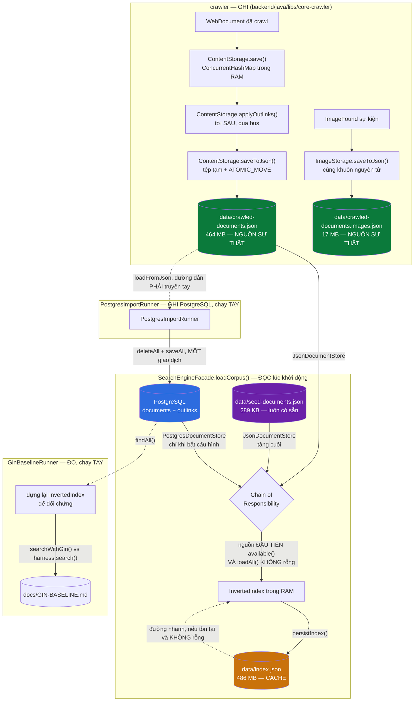
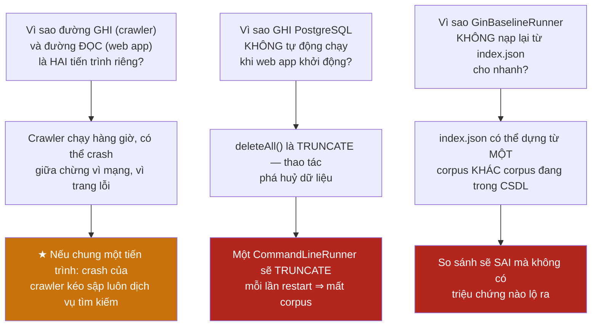
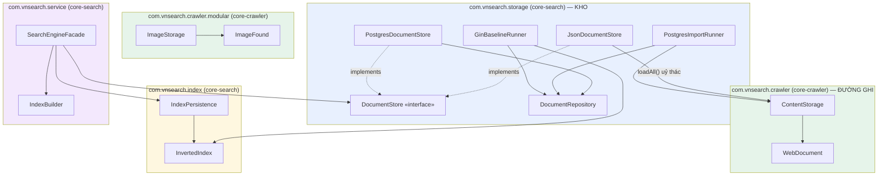
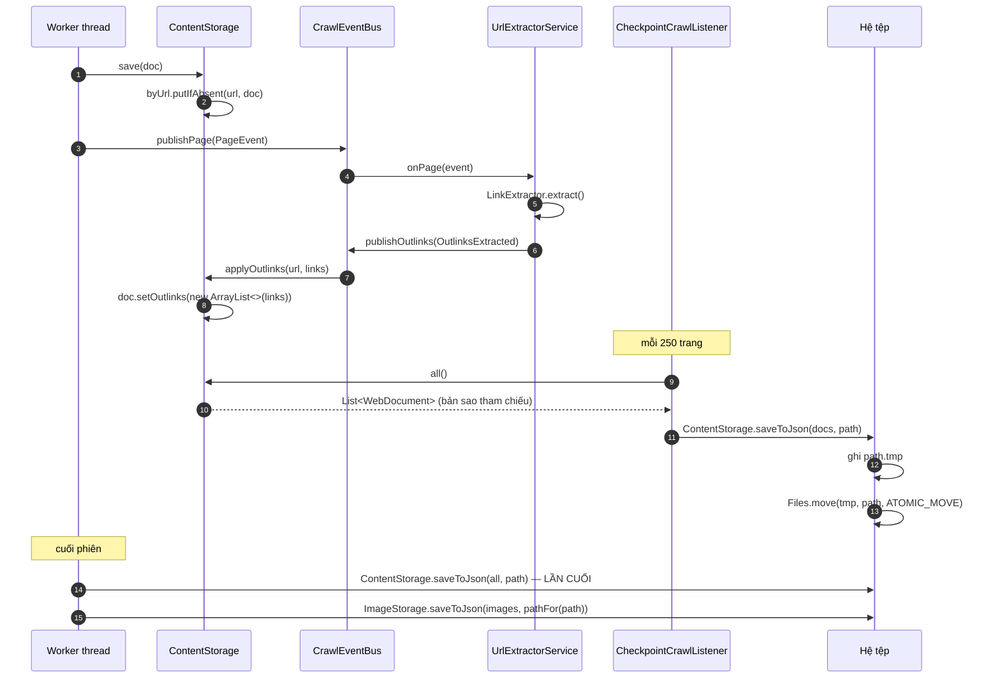
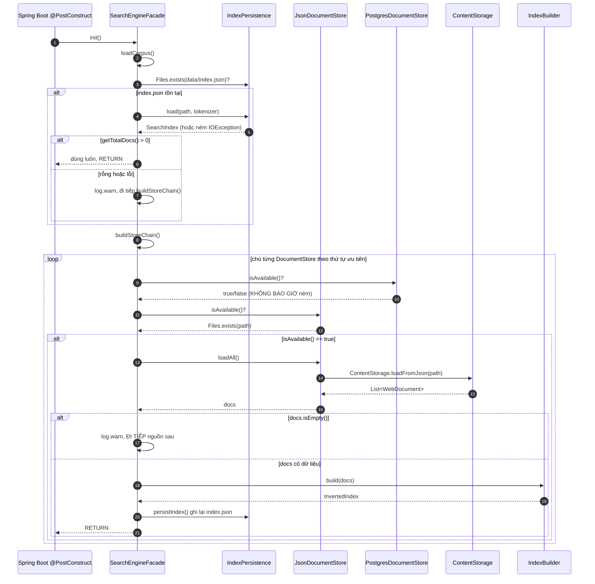
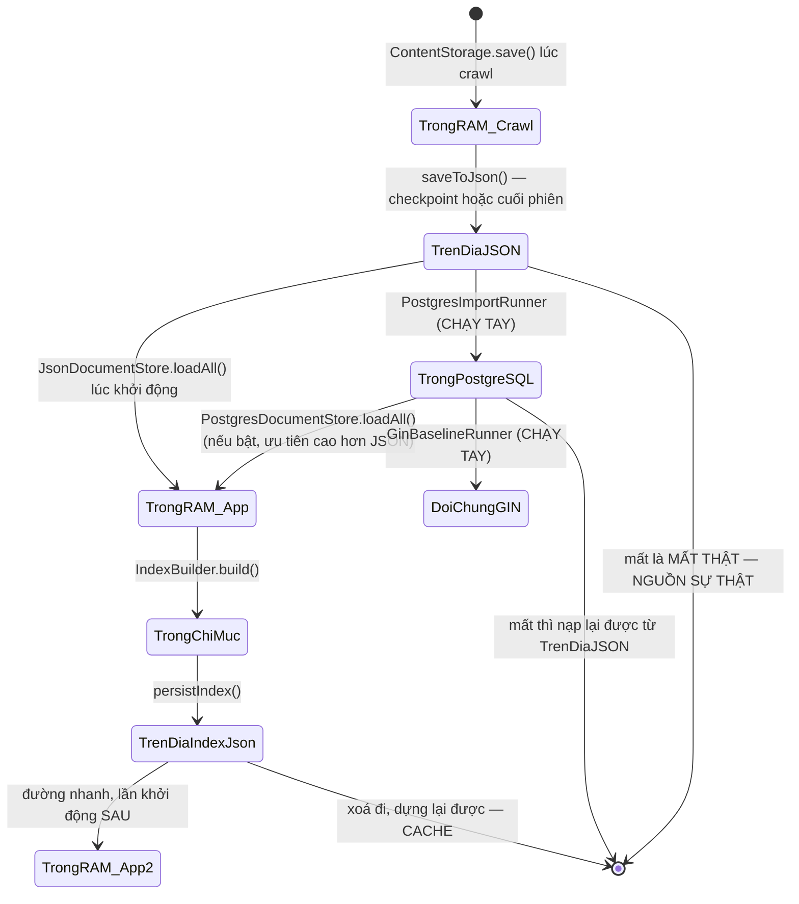
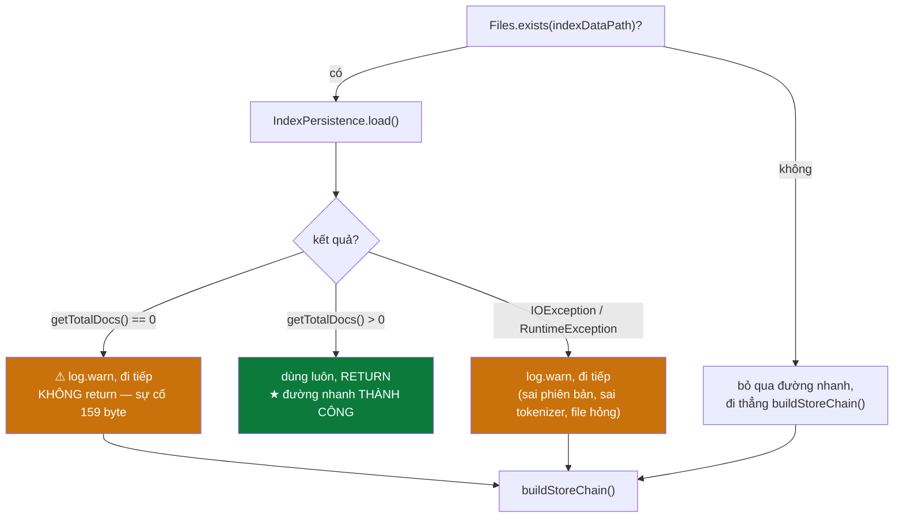

# STORAGE PIPELINE — Giải phẫu toàn bộ tầng lưu trữ

### Từ `ContentStorage.save()` trong crawler đến bốn kho trên đĩa và trong PostgreSQL

> **Tài liệu tham chiếu kỹ thuật đầy đủ.**
> Mỗi lớp, mỗi hàm, mỗi hằng số, mỗi nhánh `if` mà một tài liệu chạm tới trên đường
> từ lúc crawler lưu nó tới lúc nó nằm sẵn sàng cho `SearchEngineFacade` đọc lại —
> theo đúng thứ tự thực thi, kèm sơ đồ Mermaid, bảng đối chiếu và trace dữ liệu thật.

**Quy ước ký hiệu**

| Ký hiệu | Nghĩa |
|---|---|
| **File:** `abc/Xyz.java` | Đường dẫn tính từ `backend/java/libs/<module>/src/main/java/com/vnsearch/` |
| **Hàm:** `foo()` | Tên phương thức trong file vừa nêu |
| ★ | Điểm mấu chốt, dễ hiểu sai |
| ⚠ | Cạm bẫy đã từng gây lỗi thật |
| ↺ | Vòng lặp dự phòng / phòng thủ theo chiều sâu |
| 🔒 | Điểm đồng bộ hoá hoặc tính nguyên tử |

---

## MỤC LỤC

### PHẦN I — TỔNG QUAN
- [1. Bốn kho, bốn vòng đời khác nhau](#1-bốn-kho-bốn-vòng-đời-khác-nhau)
- [2. Bản đồ toàn hệ thống](#2-bản-đồ-toàn-hệ-thống)
- [3. Bản đồ gói (package)](#3-bản-đồ-gói-package)
- [4. Danh mục toàn bộ file tham gia](#4-danh-mục-toàn-bộ-file-tham-gia)
- [5. Sơ đồ tuần tự tổng quát](#5-sơ-đồ-tuần-tự-tổng-quát)
- [6. Vòng đời của một WebDocument qua bốn kho](#6-vòng-đời-của-một-webdocument-qua-bốn-kho)
- [7. Bảng so sánh bốn kho](#7-bảng-so-sánh-bốn-kho)

### PHẦN II — ĐƯỜNG GHI: `ContentStorage` TRONG BỘ NHỚ
- [8. `ContentStorage.save` — `putIfAbsent`, lớp phòng thủ trùng lặp cuối cùng](#8-contentstoragesave--putifabsent-lớp-phòng-thủ-trùng-lặp-cuối-cùng)
- [9. `applyOutlinks()` — outlinks tới SAU nội dung](#9-applyoutlinks--outlinks-tới-sau-nội-dung)
- [10. Vì sao lưu trong RAM, chỉ ghi đĩa ở cuối và ở điểm kiểm tra](#10-vì-sao-lưu-trong-ram-chỉ-ghi-đĩa-ở-cuối-và-ở-điểm-kiểm-tra)
- [11. `CheckpointCrawlListener` và tần suất ghi](#11-checkpointcrawllistener-và-tần-suất-ghi)

### PHẦN III — GHI JSON NGUYÊN TỬ XUỐNG ĐĨA
- [12. `ContentStorage.saveToJson` — ghi nguyên tử](#12-contentstoragesavetojson--ghi-nguyên-tử)
- [13. ★ Vì sao PHẢI ghi qua tệp tạm rồi đổi tên, thay vì ghi thẳng](#13--vì-sao-phải-ghi-qua-tệp-tạm-rồi-đổi-tên-thay-vì-ghi-thẳng)
- [14. Đường lui khi hệ tệp không hỗ trợ đổi tên nguyên tử](#14-đường-lui-khi-hệ-tệp-không-hỗ-trợ-đổi-tên-nguyên-tử)
- [15. Cấu hình `ObjectMapper` — ba tuỳ chọn, và chiều đọc ngược lại](#15-cấu-hình-objectmapper--ba-tuỳ-chọn-và-chiều-đọc-ngược-lại)

### PHẦN IV — KHO ẢNH: `ImageStorage`
- [16. `ImageStorage` — tệp anh em của corpus, và `pathFor()`](#16-imagestorage--tệp-anh-em-của-corpus-và-pathfor)
- [17. Vì sao ảnh có tệp riêng, không nhét vào `WebDocument`](#17-vì-sao-ảnh-có-tệp-riêng-không-nhét-vào-webdocument)
- [18. Ghi nguyên tử ở `ImageStorage` — cùng khuôn, một khác biệt tinh tế](#18-ghi-nguyên-tử-ở-imagestorage--cùng-khuôn-một-khác-biệt-tinh-tế)
- [19. `loadQuietly` — đường khởi động không được phép chết vì ảnh](#19-loadquietly--đường-khởi-động-không-được-phép-chết-vì-ảnh)

### PHẦN V — ĐƯỜNG ĐỌC: ĐƯỜNG NHANH VÀ CHUỖI NGUỒN
- [20. Đường nhanh: `index.json` có sẵn](#20-đường-nhanh-indexjson-có-sẵn)
- [21. Trên đường chạy thực tế của repo này, đường nhanh gần như không kích hoạt](#21-trên-đường-chạy-thực-tế-của-repo-này-đường-nhanh-gần-như-không-kích-hoạt)
- [22. Chain of Responsibility: `buildStoreChain()`](#22-chain-of-responsibility-buildstorechain)
- [23. Thứ tự trong danh sách = thứ tự ưu tiên dữ liệu, KHÔNG PHẢI thứ tự chi phí](#23-thứ-tự-trong-danh-sách--thứ-tự-ưu-tiên-dữ-liệu-không-phải-thứ-tự-chi-phí)

### PHẦN VI — HỢP ĐỒNG `DocumentStore`
- [24. `DocumentStore` — hợp đồng ba phương thức](#24-documentstore--hợp-đồng-ba-phương-thức)
- [25. Mẫu vòng lặp chuẩn ở chỗ gọi](#25-mẫu-vòng-lặp-chuẩn-ở-chỗ-gọi)
- [26. `close()` mặc định rỗng, và những gì interface cố ý KHÔNG làm](#26-close-mặc-định-rỗng-và-những-gì-interface-cố-ý-không-làm)
- [27. `JsonDocumentStore` — một lớp, ba tầng](#27-jsondocumentstore--một-lớp-ba-tầng)
- [28. `isAvailable()` — ba điều kiện, và tầng dự phòng cuối](#28-isavailable--ba-điều-kiện-và-tầng-dự-phòng-cuối)

### PHẦN VII — NGUỒN RỖNG KHÔNG PHẢI LÀ NGUỒN
- [29. Sự cố `index.json` 159 byte — diễn biến](#29-sự-cố-indexjson-159-byte--diễn-biến)
- [30. Cách sửa — và vì sao nó tổng quát hoá thành một nguyên tắc](#30-cách-sửa--và-vì-sao-nó-tổng-quát-hoá-thành-một-nguyên-tắc)
- [31. Vì sao lỗi này đặc biệt nguy hiểm — nó "trông đúng"](#31-vì-sao-lỗi-này-đặc-biệt-nguy-hiểm--nó-trông-đúng)

### PHẦN VIII — KHO THỨ BA: `index.json` LÀ MỘT CACHE
- [32. `index.json` nhìn từ tầng lưu trữ](#32-indexjson-nhìn-từ-tầng-lưu-trữ)
- [33. Vì sao lại phải có một cache khi chỉ mục dựng "chỉ mất ~1 phút"](#33-vì-sao-lại-phải-có-một-cache-khi-chỉ-mục-dựng-chỉ-mất-1-phút)
- [34. `persistIndex()` — ghi lại sau khi dựng](#34-persistindex--ghi-lại-sau-khi-dựng)
- [35. ⚠ Sự cố đã có thật: đoạn `persistIndex()` từng bị THIẾU hoàn toàn](#35--sự-cố-đã-có-thật-đoạn-persistindex-từng-bị-thiếu-hoàn-toàn)
- [36. ★ Lỗi ghi không được phép làm hỏng lần khởi động](#36--lỗi-ghi-không-được-phép-làm-hỏng-lần-khởi-động)

### PHẦN IX — KHO THỨ TƯ: POSTGRESQL — ĐƯỜNG GHI
- [37. `DocumentRepository` — JDBC thuần, vì sao](#37-documentrepository--jdbc-thuần-vì-sao)
- [38. Hàm dựng và ba hằng số mặc định](#38-hàm-dựng-và-ba-hằng-số-mặc-định)
- [39. `saveAll()` — một giao dịch, batch 500](#39-saveall--một-giao-dịch-batch-500)
- [40. ★ Vì sao PHẢI nguyên tử — và ghi theo lô 500](#40--vì-sao-phải-nguyên-tử--và-ghi-theo-lô-500)
- [41. `ON CONFLICT DO UPDATE` — upsert và cái bẫy outlinks](#41-on-conflict-do-update--upsert-và-cái-bẫy-outlinks)

### PHẦN X — POSTGRESQL — ĐƯỜNG ĐỌC VÀ ADAPTER
- [42. `findAll()` — hai truy vấn, `ORDER BY doc_id`](#42-findall--hai-truy-vấn-order-by-doc_id)
- [43. ★★★ `ORDER BY doc_id` — một mệnh đề SQL gánh bất biến của một cấu trúc dữ liệu cách nó BỐN TẦNG](#43--order-by-doc_id--một-mệnh-đề-sql-gánh-bất-biến-của-một-cấu-trúc-dữ-liệu-cách-nó-bốn-tầng)
- [44. `PostgresDocumentStore` — Adapter vào chuỗi dự phòng](#44-postgresdocumentstore--adapter-vào-chuỗi-dự-phòng)
- [45. `isAvailable()` — trả `false` thay vì ném, và "rỗng" cũng là "không có"](#45-isavailable--trả-false-thay-vì-ném-và-rỗng-cũng-là-không-có)
- [46. Cái giá: hai kết nối cho một lần khởi động, và rủi ro treo khi host chết](#46-cái-giá-hai-kết-nối-cho-một-lần-khởi-động-và-rủi-ro-treo-khi-host-chết)
- [47. `loadAll()` và `describe()` — bọc lỗi, và một bẫy bảo mật kín đáo](#47-loadall-và-describe--bọc-lỗi-và-một-bẫy-bảo-mật-kín-đáo)

### PHẦN XI — CÔNG CỤ DÒNG LỆNH: NẠP VÀ ĐỐI CHỨNG
- [48. `PostgresImportRunner` — nạp rồi kiểm chứng đọc lại](#48-postgresimportrunner--nạp-rồi-kiểm-chứng-đọc-lại)
- [49. Bốn giai đoạn](#49-bốn-giai-đoạn)
- [50. Giai đoạn ④ — phần đáng giá nhất của cả công cụ, và cách chạy đầy đủ](#50-giai-đoạn-④--phần-đáng-giá-nhất-của-cả-công-cụ-và-cách-chạy-đầy-đủ)
- [51. `GinBaselineRunner` — đối chứng GIN, bằng chứng "tự cài có đáng"](#51-ginbaselinerunner--đối-chứng-gin-bằng-chứng-tự-cài-có-đáng)
- [52. `buildIndex()` — vì sao phải sắp lại dù CSDL đã `ORDER BY`](#52-buildindex--vì-sao-phải-sắp-lại-dù-csdl-đã-order-by)
- [53. Làm nóng JVM — phần kỹ thuật đáng giá nhất](#53-làm-nóng-jvm--phần-kỹ-thuật-đáng-giá-nhất)
- [54. Bộ truy vấn known-item, seed 42, và cái bẫy `TOP_N = 10`](#54-bộ-truy-vấn-known-item-seed-42-và-cái-bẫy-top_n--10)
- [55. Hai nhánh diễn giải viết sẵn — trung thực cưỡng chế bằng mã](#55-hai-nhánh-diễn-giải-viết-sẵn--trung-thực-cưỡng-chế-bằng-mã)
- [56. Ba điều phép so sánh này KHÔNG chứng minh](#56-ba-điều-phép-so-sánh-này-không-chứng-minh)

### PHẦN XII — ĐỐI CHIẾU OUTPUT THẬT
- [57. Tổng quan các tệp trong `backend/data/`](#57-tổng-quan-các-tệp-trong-backenddata)
- [58. Kích thước bốn kho, số liệu thật của repo này](#58-kích-thước-bốn-kho-số-liệu-thật-của-repo-này)
- [59. Cấu trúc `seed-documents.json` thật](#59-cấu-trúc-seed-documentsjson-thật)
- [60. Cấu trúc `index.json` thật — vì sao nó lớn hơn corpus](#60-cấu-trúc-indexjson-thật--vì-sao-nó-lớn-hơn-corpus)
- [61. ★★★ Vì sao `index.json` còn lớn hơn corpus dù ĐÃ nén](#61--vì-sao-indexjson-còn-lớn-hơn-corpus-dù-đã-nén)
- [62. `schema.sql` thật](#62-schemasql-thật)
- [63. `idx_documents_tsv` — chỉ mục được đo ở mục 51](#63-idx_documents_tsv--chỉ-mục-được-đo-ở-mục-51)

### PHẦN XIII — PHỤ LỤC
- [64. Các chế độ chạy khác của tầng lưu trữ](#64-các-chế-độ-chạy-khác-của-tầng-lưu-trữ)
- [65. Bảng hằng số toàn hệ thống](#65-bảng-hằng-số-toàn-hệ-thống)
- [66. Bảng tra nhanh khối ↔ file ↔ hàm](#66-bảng-tra-nhanh-khối--file--hàm)
- [67. Câu hỏi thường gặp](#67-câu-hỏi-thường-gặp)
- [68. Cây chẩn đoán sự cố](#68-cây-chẩn-đoán-sự-cố)
- [69. Thuật ngữ](#69-thuật-ngữ)
- [70. Toàn cảnh một trang](#70-toàn-cảnh-một-trang)

---
---

# PHẦN I — TỔNG QUAN

---

## 1. Bốn kho, bốn vòng đời khác nhau

Trong toàn tài liệu, "kho" (store) dùng để chỉ một nơi dữ liệu **nằm bền** giữa
hai lần chạy tiến trình. Bốn kho đó là:

```
data/crawled-documents.json         464 MB   NGUỒN SỰ THẬT  — crawler ghi, chỉ mục đọc
data/crawled-documents.images.json   17 MB   NGUỒN SỰ THẬT của kho ảnh
data/index.json                     486 MB   CACHE DẪN XUẤT — xoá đi vẫn dựng lại được
PostgreSQL (documents + outlinks)            NGUỒN THAY THẾ + đối chứng GIN
```

(Số liệu đo thật từ `backend/data/` của chính repo này ngày viết tài liệu — xem
[mục 58](#58-kích-thước-bốn-kho-số-liệu-thật-của-repo-này) để có bảng đầy đủ
kèm ngày sửa đổi.)

Bốn kho này không đối xứng. Chúng khác nhau ở **bốn trục** cùng lúc, và nhầm
lẫn giữa các trục này là nguồn gốc của phần lớn hiểu sai về tầng lưu trữ:

```
   TRỤC 1 — AI GHI, AI ĐỌC

   Kho 1, 2   :  crawler GHI (trong lúc crawl)  →  tầng lưu trữ ĐỌC (lúc khởi động)
   Kho 3      :  tầng lưu trữ vừa GHI vừa ĐỌC (cùng một tiến trình, khác lượt chạy)
   Kho 4      :  PostgresImportRunner GHI (chạy tay)  →  PostgresDocumentStore ĐỌC

   TRỤC 2 — MẤT THÌ SAO

   Kho 1, 2   :  MẤT LÀ MẤT THẬT — không có gì dựng lại nó được
   Kho 3      :  mất thì DỰNG LẠI được từ Kho 1, tốn ~1 phút mỗi lần khởi động
   Kho 4      :  mất thì NẠP LẠI được từ Kho 1, tốn ~2-3 phút chạy tay

   TRỤC 3 — ĐỊNH DẠNG

   Kho 1, 2, 3 :  JSON, đọc được bằng mắt (Kho 3 posting đã nén base64)
   Kho 4       :  quan hệ, có ràng buộc, có chỉ mục GIN đối chứng

   TRỤC 4 — KHI HỎNG THÌ ỨNG DỤNG PHẢI LÀM GÌ

   Kho 1, 2   :  hỏng/rỗng → corpus rỗng thật, /api/health nói thẳng điều đó
   Kho 3      :  hỏng/rỗng → log.warn, ÂM THẦM bỏ qua, dựng lại — KHÔNG được sập app
   Kho 4      :  không kết nối được → log.info, ÂM THẦM lùi tầng JSON — KHÔNG được sập app
```

Bốn nguyên tắc dưới đây chạy suốt toàn bộ tài liệu này, và mọi quyết định thiết
kế được phân tích ở các phần sau đều quy về một trong bốn nguyên tắc này:

```
1. Ghi qua tệp TẠM rồi đổi tên     → không bao giờ có tệp corpus cụt
2. Nguồn RỖNG không phải là nguồn  → tồn tại ≠ dùng được, luôn kiểm số bản ghi
3. Cache dẫn xuất không được sập app → index.json hỏng thì log.warn, dựng lại từ corpus
4. Nguồn sự thật thì được phép sập  → không nguồn nào có tài liệu = chỉ mục rỗng, và
                                      /api/health nói thẳng điều đó
```

---

## 2. Bản đồ toàn hệ thống

### 2.1 Sơ đồ khối — đường ghi và đường đọc trên cùng một hình



<details><summary>Xem bản chữ (ASCII)</summary>

```
GHI (trong lúc crawl, tiến trình MultiDomainCrawlRunner)
    WebDocument đã crawl
        -> ContentStorage.save()              (RAM, ConcurrentHashMap)
        -> ContentStorage.applyOutlinks()      (tới sau, qua bus)
        -> ContentStorage.saveToJson()         (tệp tạm + ATOMIC_MOVE)
        -> data/crawled-documents.json          [NGUỒN SỰ THẬT, 464 MB]

    ImageFound sự kiện
        -> ImageStorage.saveToJson()           (cùng khuôn nguyên tử)
        -> data/crawled-documents.images.json   [NGUỒN SỰ THẬT, 17 MB]

ĐỌC (lúc khởi động, tiến trình web app)
    data/index.json [CACHE, 486 MB]
        --(đường nhanh, nếu tồn tại và KHÔNG rỗng)--> InvertedIndex (RAM)

    Chain of Responsibility (buildStoreChain):
        PostgreSQL       --(PostgresDocumentStore, chỉ khi bật)-->  |
        crawled-documents.json --(JsonDocumentStore)-->             | chọn nguồn
        seed-documents.json    --(JsonDocumentStore, tầng cuối)-->  | ĐẦU TIÊN có dữ liệu
        -> InvertedIndex (RAM)
        -> persistIndex() -> ghi lại data/index.json

GHI POSTGRESQL (chạy tay, PostgresImportRunner)
    data/crawled-documents.json --(loadFromJson, đường dẫn PHẢI truyền tay)-->
        PostgresImportRunner --(deleteAll + saveAll, MỘT giao dịch)--> PostgreSQL

ĐO (chạy tay, GinBaselineRunner)
    PostgreSQL --(findAll())--> dựng lại InvertedIndex để đối chứng
        --(searchWithGin() vs harness.search())--> docs/GIN-BASELINE.md
```

</details>

### 2.2 Vì sao ba đường (ghi / đọc / đo) tách biệt nhau



---

## 3. Bản đồ gói (package)



<details><summary>Xem bản chữ (ASCII)</summary>

```
core-crawler (ĐƯỜNG GHI)
  com.vnsearch.crawler
    ContentStorage ──────> WebDocument
  com.vnsearch.crawler.modular
    ImageStorage ─────────> ImageFound

core-search (KHO + ĐỌC)
  com.vnsearch.storage
    DocumentStore «interface»
      ^-- implements -- JsonDocumentStore ──(loadAll uỷ thác)──> ContentStorage
      ^-- implements -- PostgresDocumentStore ──> DocumentRepository
    PostgresImportRunner ──> DocumentRepository, ContentStorage
    GinBaselineRunner ──> DocumentRepository, InvertedIndex
  com.vnsearch.index
    IndexPersistence ──> InvertedIndex
  com.vnsearch.service
    SearchEngineFacade ──> DocumentStore, IndexPersistence, IndexBuilder
```

</details>

**Điểm đáng chú ý về ranh giới module:** đường ghi (`ContentStorage`,
`ImageStorage`) sống trong `core-crawler`, còn toàn bộ chuỗi dự phòng đọc
(`DocumentStore` và các lớp cài đặt) sống trong `core-search`. Hai module này
**không phụ thuộc ngược nhau** qua tầng lưu trữ — `JsonDocumentStore.loadAll()`
gọi `ContentStorage.loadFromJson()` (một hàm `static` không trạng thái), nhưng
`core-crawler` không hề biết `DocumentStore` tồn tại. Đây là cùng nguyên tắc
"ranh giới thay thế được" mà `ContentStorage`'s Javadoc nói tới: đổi cách đọc
corpus (thêm CSDL, thêm cache) không đụng một dòng nào của crawler.

---

## 4. Danh mục toàn bộ file tham gia

| File | Module | Dòng | Vai trò |
|---|---|---|---|
| `crawler/ContentStorage.java` | core-crawler | 138 | Ghi/đọc `crawled-documents.json`, giữ corpus trong RAM lúc crawl |
| `crawler/modular/ImageStorage.java` | core-crawler | 168 | Ghi/đọc `*.images.json`, tệp anh em của corpus |
| `storage/DocumentStore.java` | core-search | 42 | Interface Strategy — hợp đồng ba phương thức cho mọi nguồn corpus |
| `storage/JsonDocumentStore.java` | core-search | 52 | Bản cài đọc tệp JSON, dùng lại 3 lần với 3 đường dẫn khác nhau |
| `storage/DocumentRepository.java` | core-search | 256 | JDBC thuần, toàn bộ thao tác PostgreSQL của dự án |
| `storage/PostgresDocumentStore.java` | core-search | 63 | Adapter bọc `DocumentRepository` để xếp chung với `JsonDocumentStore` |
| `storage/PostgresImportRunner.java` | core-search | 69 | Công cụ chạy tay: nạp corpus JSON vào PostgreSQL, kiểm chứng đọc lại |
| `storage/GinBaselineRunner.java` | core-search | 353 | Công cụ chạy tay: đối chứng chỉ mục tự cài với GIN của PostgreSQL |
| `index/IndexPersistence.java` | core-search | 223 | Ghi/đọc `index.json` — kho thứ ba, một cache |
| `service/SearchEngineFacade.java` | core-search | 497 | `loadCorpus()` — nơi Chain of Responsibility được duyệt |
| `resources/db/schema.sql` | core-search | 57 | Lược đồ PostgreSQL: `documents`, `outlinks`, cột `tsv` sinh tự động |

Tổng cộng **~1.918 dòng mã** cho toàn bộ tầng lưu trữ — nhỏ hơn nhiều so với
~4.700 dòng của crawler, nhưng mật độ quyết định thiết kế đáng bàn trên mỗi
dòng lại cao hơn: đây là tầng mà mọi lỗi đều **câm** (silent) nếu viết sai, vì
bản chất công việc là "đọc lại cái đã ghi" — không có gì để so sánh trừ khi cố
tình đo.

---

## 5. Sơ đồ tuần tự tổng quát

### 5.1 Đường ghi — một trang crawl xong tới lúc nằm trên đĩa



<details><summary>Xem bản chữ (ASCII)</summary>

```
Worker                  ContentStorage        Bus            UrlExtractorService   Hệ tệp
  |--save(doc)------------->|
  |                         |--putIfAbsent(url, doc)
  |--publishPage(PageEvent)-------------------->|
  |                         |                   |--onPage-------->|
  |                         |                   |                 |--extract()
  |                         |<--applyOutlinks(url, links)----------|
  |                         |--doc.setOutlinks(copy)
  |
  [mỗi 250 trang — CheckpointCrawlListener]
  |--all()---------------->|
  |<--List<WebDocument>-----|
  |--saveToJson(docs, path)---------------------------------------------------->|
  |                                                              ghi path.tmp -->|
  |                                                     Files.move ATOMIC_MOVE-->|
  [cuối phiên]
  |--saveToJson(all, path) LẦN CUỐI--------------------------------------------->|
  |--ImageStorage.saveToJson(images, pathFor(path))----------------------------->|
```

</details>

### 5.2 Đường đọc — từ lệnh khởi động web app tới chỉ mục sẵn sàng



<details><summary>Xem bản chữ (ASCII)</summary>

```
SearchEngineFacade.loadCorpus()
├─ [0] ĐƯỜNG NHANH: Files.exists(data/index.json)?
│      CÓ → IndexPersistence.load()
│           getTotalDocs() > 0  → dùng luôn, RETURN
│           getTotalDocs() == 0 → log.warn, đi tiếp
│           IOException/RuntimeException → log.warn, đi tiếp
│      KHÔNG → đi thẳng xuống buildStoreChain()
│
└─ [1..N] buildStoreChain() — duyệt tuần tự:
      PostgresDocumentStore (nếu bật)
          isAvailable() → mở kết nối, COUNT(*) > 0 → true/false, KHÔNG BAO GIỜ ném
          nếu true: loadAll() → DocumentRepository.findAll()
      JsonDocumentStore("data/crawled-documents.json")
          isAvailable() → Files.exists
          nếu true: loadAll() → ContentStorage.loadFromJson()
      JsonDocumentStore("data/seed-documents.json")   ← tầng cuối, luôn có

      với MỖI nguồn:
          !isAvailable()   → bỏ qua, thử nguồn tiếp theo
          docs.isEmpty()   → log.warn, bỏ qua, thử nguồn tiếp theo  ★
          còn lại          → IndexBuilder.build() → persistIndex() → RETURN
```

</details>

---

## 6. Vòng đời của một WebDocument qua bốn kho

Một `WebDocument` — kể từ lúc rời `ContentParser` trong crawler — có thể tồn
tại đồng thời ở **tối đa bốn dạng khác nhau**, tại bốn nơi khác nhau, không
đồng bộ hoá tự động với nhau:



**Bốn dạng, và bốn mức độ "có thể mất":**

| Dạng | Nơi | Nếu mất |
|---|---|---|
| `WebDocument` trong RAM lúc crawl | `ContentStorage.byUrl` | Mất tối đa phần chưa checkpoint — crawl lại là xong |
| Bản ghi JSON trên đĩa | `crawled-documents.json` | **Mất là mất thật** — phải crawl lại toàn bộ |
| Bản ghi trong `InvertedIndex` (RAM) | `SearchEngineFacade.index` | Dựng lại từ corpus JSON trong ~1 phút |
| Bản ghi trong `index.json` trên đĩa | Cache — Kho 3 | Xoá đi, lần khởi động sau tự dựng lại |
| Hàng trong bảng `documents` (PostgreSQL) | Kho 4 | Chạy lại `PostgresImportRunner` từ corpus JSON |

**★ Điểm mấu chốt:** chỉ **một** trong năm dạng trên là nguồn sự thật thật sự
— `crawled-documents.json`. Bốn dạng còn lại đều **dẫn xuất được** từ nó, dù
với chi phí thời gian khác nhau (dựng chỉ mục RAM: giây; ghi lại `index.json`:
giây; nạp lại PostgreSQL: phút). Mọi quyết định "lỗi này có được phép làm sập
ứng dụng không" trong toàn bộ tài liệu đều bắt nguồn từ câu hỏi: *dữ liệu đang
hỏng có phải là nguồn sự thật không?*

---

## 7. Bảng so sánh bốn kho

| | Kho 1 — `crawled-documents.json` | Kho 2 — `*.images.json` | Kho 3 — `index.json` | Kho 4 — PostgreSQL |
|---|---|---|---|---|
| **Vai trò** | Nguồn sự thật | Nguồn sự thật (ảnh) | Cache dẫn xuất | Nguồn thay thế + đối chứng |
| **Ai ghi** | Crawler (`ContentStorage`) | Crawler (`ImageStorage`) | `SearchEngineFacade.persistIndex()` | `PostgresImportRunner` (chạy tay) |
| **Ai đọc** | `JsonDocumentStore` | `ImageStore` (khởi động) | Đường nhanh của `loadCorpus()` | `PostgresDocumentStore` |
| **Ghi khi nào** | Trong lúc crawl, mỗi checkpoint + cuối phiên | Cùng nhịp với Kho 1 | Sau khi dựng chỉ mục từ Kho 1/4 | Chạy tay, một lần sau crawl |
| **Định dạng** | JSON, thụt dòng, không nén | JSON, thụt dòng (bắt buộc, xem [mục 16](#16-imagestorage--tệp-anh-em-của-corpus-và-pathfor)) | JSON, posting nén VByte, base64 | Quan hệ, có ràng buộc |
| **Cách ghi bền** | Tệp tạm + `ATOMIC_MOVE` | Tệp tạm + `ATOMIC_MOVE` | Tệp tạm + `ATOMIC_MOVE` (qua `IndexPersistence`) | Giao dịch JDBC (`commit`/`rollback`) |
| **Mất thì sao** | **Mất thật, không dựng lại được** | **Mất thật** | Dựng lại từ Kho 1, ~1 phút | Nạp lại từ Kho 1, ~2–3 phút |
| **Rỗng/hỏng có được sập app không** | **Có** — corpus rỗng là sự thật | Không quan trọng bằng, `loadQuietly` nuốt lỗi | **Không** — log.warn, dựng lại | **Không** — log.info, lùi tầng JSON |
| **Kích thước thật (repo này)** | 464 MB | 17 MB | 486 MB | phụ thuộc lần `PostgresImportRunner` gần nhất |
| **Đọc lúc nào** | Lúc khởi động, nếu Kho 3 vắng/rỗng | Lúc khởi động, `loadQuietly` | Lúc khởi động, đường nhanh | Lúc khởi động, nếu bật cấu hình |

★ **Vì sao Kho 3 (`index.json`) lại lớn hơn cả Kho 1** dù nó chỉ là một cache
phái sinh — đây là điều phản trực giác nhất trong toàn bộ tầng lưu trữ, và
được giải thích đầy đủ ở [mục 60](#60-cấu-trúc-indexjson-thật--vì-sao-nó-lớn-hơn-corpus).

---

# PHẦN II — ĐƯỜNG GHI: `ContentStorage` TRONG BỘ NHỚ

---

## 8. `ContentStorage.save` — `putIfAbsent`, lớp phòng thủ trùng lặp cuối cùng

**File:** `core-crawler/crawler/ContentStorage.java` (138 dòng)

`ContentStorage` là điểm khởi đầu thật sự của toàn bộ tầng lưu trữ: nó là nơi
một `WebDocument` lần đầu tiên **rời tay** của bộ máy crawl và bắt đầu vòng đời
của một bản ghi bền vững. Trước khi tới đây, tài liệu chỉ tồn tại trong ngăn
xếp lời gọi của một worker thread; sau khi qua đây, nó tồn tại trong một
`ConcurrentHashMap` sống suốt phiên crawl.

### 8.1 `save()` — `putIfAbsent`, lớp phòng thủ trùng lặp cuối cùng

```java
private final ConcurrentHashMap<String, WebDocument> byUrl = new ConcurrentHashMap<>();

public boolean save(WebDocument doc) {
    return byUrl.putIfAbsent(doc.getUrl(), doc) == null;
}
```

Trước khi một `WebDocument` chạm tới đây, nó đã đi qua **hai lớp chống trùng
URL khác** ở tầng crawler (`UrlCanonicalizer`, `UrlSeenFilter` — xem
`CRAWLER-PIPELINE.md` mục 52–55). `ContentStorage.save()` là lớp thứ ba, và
là lớp duy nhất **chính xác tuyệt đối**:

```
   Ba lớp chống trùng URL, xếp chồng nhau:
        ① UrlCanonicalizer  — gom các biến thể của cùng một URL
        ② UrlSeenFilter     — Bloom Filter, có ~1% khả năng nhận nhầm là đã gặp
                              (false positive), và có thể sai nếu khoá bị phá
        ③ ContentStorage    — putIfAbsent, KHÔNG BAO GIỜ sai  ← lớp này

   Lớp ③ vừa nguyên tử vừa chính xác, nên dù ② có sai sót thì kho nội dung
   vẫn không bao giờ có hai bản ghi cho cùng một URL.
```

★ **Bản cũ được giữ, không bị ghi đè.** Đây là quyết định có chủ ý: bản ghi đầu
tiên của một URL là bản **đã đi qua** `ContentSeenFilter` và đã được đẩy lên bus
để bóc liên kết. Nếu một sự kiện trùng URL tới sau và ghi đè, `outlinks` vừa
gắn vào (xem mục dưới) sẽ **mất trắng** — và mất một cách hoàn toàn câm, không
ngoại lệ, không cảnh báo, chỉ thể hiện qua PageRank thiếu cạnh.

---

## 9. `applyOutlinks()` — outlinks tới SAU nội dung

```java
public boolean applyOutlinks(String url, List<String> outlinks) {
    if (url == null || outlinks == null) {
        return false;
    }
    WebDocument doc = byUrl.get(url);
    if (doc == null) {
        return false;
    }
    // Sao chép: danh sách gốc thuộc về một thông điệp bất biến, và
    // WebDocument.setOutlinks giữ nguyên tham chiếu được truyền vào.
    doc.setOutlinks(new ArrayList<>(outlinks));
    return true;
}
```

★ **Vì sao `outlinks` tới sau nội dung, không cùng lúc.** Từ khi khối "URL
Extractor" tách thành một Modular Service riêng (xem `CRAWLER-PIPELINE.md`
PHẦN X), việc bóc liên kết không còn nằm trên đường chạy đồng bộ của một
worker nữa:

```
   crawler  ──lưu trang qua save()──→ ContentStorage
        │
        └──đẩy PageEvent lên bus──→ UrlExtractorService
                                          │ LinkExtractor.extract()
                    applyOutlinks() ←─────┘ OutlinksExtracted

   In-process (dùng trong repo này): gửi ngược ĐỒNG BỘ, cùng lời gọi
   Kafka (chưa dùng)                : tới sau VÀI CHỤC MILI GIÂY
```

Tách được làm hai bước **mà không hỏng gì** vì `outlinks` chỉ bắt buộc phải có
**trước khi lập chỉ mục** (PageRank chạy trên đồ thị liên kết ở bước
`IndexBuilder.build()`), không bắt buộc phải có ngay lúc lưu. Ở chế độ
in-process của repo này, việc gửi ngược luôn kịp vì nó chạy đồng bộ trong cùng
call stack.

⚠ **Trả `false` khi không tìm thấy `doc` — và vì sao đây là một cạm bẫy câm
nguy hiểm nhất của cả tầng lưu trữ.** Có ba nguyên nhân **hợp lệ** khiến
`doc == null`:

```
   ├─ trang bị ContentSeenFilter loại SAU KHI đã đẩy sự kiện lên bus
   ├─ sự kiện Kafka thuộc phiên crawl TRƯỚC (bus còn tồn đọng — không xảy ra ở chế độ in-process)
   └─ trang bị LanguageFilter loại ở bước phân tích nội dung
```

Nhưng có một nguyên nhân **không hợp lệ**, và nó là lỗi tệ nhất có thể xảy ra ở
tầng này:

```
   └─ URL trong sự kiện KHÔNG khớp URL đã lưu (một bên chuẩn hoá, một bên không)
        → MỌI sự kiện applyOutlinks đều trả false
        → toàn bộ corpus KHÔNG CÓ outlinks
        → PageRank chạy trên đồ thị RỖNG, mọi trang được điểm bằng nhau
        → KHÔNG CÓ NGOẠI LỆ NÀO, không dòng log lỗi nào — chỉ có chất lượng
          xếp hạng tệ đi mà không ai giải thích được vì sao
```

Đây là lý do Javadoc của phương thức nhấn mạnh: *"Bỏ qua là đúng, nhưng người
gọi nên đếm để con số đó không âm thầm lớn lên."* — giá trị trả về `boolean`
tồn tại chính để cho phép đếm.

**Sao chép danh sách — `new ArrayList<>(outlinks)`.** Hai lý do:

```
   Lý do 1: thông điệp OutlinksExtracted là BẤT BIẾN
        nếu WebDocument giữ thẳng tham chiếu tới danh sách của thông điệp,
        và về sau ai đó gọi doc.getOutlinks().add(...), nó sửa vào một
        đối tượng lẽ ra bất biến — nguy hiểm hơn nữa ở chế độ Kafka, nơi
        thông điệp đó có thể đang được xử lý đồng thời ở nơi khác

   Lý do 2: WebDocument.setOutlinks() KHÔNG tự sao chép
        nếu ContentStorage không sao ở đây thì không ai sao cả
```

---

## 10. Vì sao lưu trong RAM, chỉ ghi đĩa ở cuối và ở điểm kiểm tra

```
   Một phiên crawl vài nghìn trang chiếm khoảng vài trăm MB
        → vừa đủ cho bộ nhớ
        → tránh chi phí ghi đĩa trên ĐƯỜNG ĐI NÓNG của crawler (save() chạy
          hàng chục nghìn lần mỗi phiên, phải là O(1) và không chạm I/O)

   Với quy mô lớn hơn nhiều: phải đổi sang ghi thẳng xuống CSDL
        → khi đó CHỈ CẦN THAY LỚP NÀY, phần còn lại của crawler không đổi
```

`ContentStorage` không được khai báo qua interface (khác `DocumentStore` ở
tầng đọc), nhưng bề mặt API của nó chỉ có bốn hàm công khai (`save`,
`applyOutlinks`, `size`, `all`) cộng hai hàm tĩnh ghi/đọc JSON — đủ hẹp để việc
thay thế bằng một cài đặt khác (ví dụ ghi thẳng CSDL) là khả thi mà không phải
sửa `CrawlerService`.

---

## 11. `CheckpointCrawlListener` và tần suất ghi

Lớp này thuộc về crawler và được phân tích đầy đủ ở `CRAWLER-PIPELINE.md` mục
63–64; ở tài liệu này chỉ nhắc lại phần liên quan trực tiếp tới tầng lưu trữ.

`CheckpointCrawlListener` gọi `ContentStorage.saveToJson()` **mỗi 250 trang**
đã crawl, không chờ tới cuối phiên. Đây là lý do phiên crawl dài hàng giờ vẫn
để lại một corpus gần như đầy đủ nếu bị dừng giữa chừng — đánh đổi lấy việc số
lần ghi tăng từ 1 lên hàng chục mỗi phiên (xem [mục 13.1](#131-vì-sao-rủi-ro-này-lớn-hơn-hẳn-khi-có-checkpoint-định-kỳ)).

```
   ĐÁNH ĐỔI CỦA CHECKPOINT ĐỊNH KỲ

   KHÔNG checkpoint:
        + chỉ ghi 1 lần → cửa sổ rủi ro nhỏ nhất có thể
        − crash ở phút thứ 119 của phiên 120 phút → MẤT TOÀN BỘ

   CÓ checkpoint mỗi 250 trang (đang dùng):
        + crash bất kỳ lúc nào → mất tối đa 249 trang cuối
        − cửa sổ rủi ro của ghi nguyên tử nhân lên theo số lần ghi

   ⇒ Ghi nguyên tử (mục 12) là ĐIỀU KIỆN CẦN để checkpoint định kỳ trở
     thành một cải thiện ròng thay vì chỉ đổi loại rủi ro. Không có ghi
     nguyên tử, checkpoint thường xuyên hơn sẽ làm mọi thứ TỆ HƠN, không
     phải tốt hơn — vì nó tăng số lần tệp ở trạng thái dễ tổn thương.
```

---

# PHẦN III — GHI JSON NGUYÊN TỬ XUỐNG ĐĨA

---

## 12. `ContentStorage.saveToJson` — ghi nguyên tử

```java
public static void saveToJson(List<WebDocument> documents, String path) throws IOException {
    Path filePath = Path.of(path);
    Path parent = filePath.getParent();
    if (parent != null) {
        Files.createDirectories(parent);
    }
    ObjectMapper mapper = new ObjectMapper()
            .registerModule(new JavaTimeModule())
            .disable(SerializationFeature.WRITE_DATES_AS_TIMESTAMPS)
            .enable(SerializationFeature.INDENT_OUTPUT);

    Path temp = filePath.resolveSibling(filePath.getFileName() + ".tmp");
    mapper.writeValue(temp.toFile(), documents);
    try {
        Files.move(temp, filePath, StandardCopyOption.REPLACE_EXISTING,
                StandardCopyOption.ATOMIC_MOVE);
    } catch (AtomicMoveNotSupportedException e) {
        // Vài hệ tệp (thường là ổ mạng) không hỗ trợ đổi tên nguyên tử.
        // Đổi tên thường vẫn tốt hơn nhiều so với ghi đè trực tiếp: cửa sổ
        // nguy hiểm rút từ cả giây xuống còn một thao tác siêu dữ liệu.
        Files.move(temp, filePath, StandardCopyOption.REPLACE_EXISTING);
    }
}
```

---

## 13. ★ Vì sao PHẢI ghi qua tệp tạm rồi đổi tên, thay vì ghi thẳng

Đây là quyết định thiết kế quan trọng nhất của toàn bộ đường ghi, và nó đáng
được trình bày đầy đủ ba giai đoạn: hỏng ra sao nếu không làm, sửa thế nào, và
vì sao vẫn còn rủi ro dư sau khi sửa.

```mermaid
sequenceDiagram
    autonumber
    participant P as Tiến trình crawler
    participant OLD as corpus.json (BẢN GHI ĐÈ TRỰC TIẾP)
    participant TMP as corpus.json.tmp (BẢN GHI QUA TỆP TẠM)
    participant NEW as corpus.json (đích)

    rect rgb(60, 20, 20)
    Note over P,OLD: KỊCH BẢN GHI ĐÈ TRỰC TIẾP — KHÔNG DÙNG Ở REPO NÀY
    P->>OLD: mở ở chế độ ghi → CẮT VỀ 0 BYTE NGAY LẬP TỨC
    P->>OLD: ghi 464 MB (mất ~1-3 giây)
    Note over P: ✖ mất điện / Ctrl+C giữa chừng
    OLD-->>P: JSON CỤT — mất LUÔN corpus CŨ đang hoàn chỉnh
    end

    rect rgb(20, 60, 30)
    Note over P,NEW: KỊCH BẢN TỆP TẠM + ATOMIC_MOVE — ĐANG DÙNG
    P->>TMP: ghi corpus.json.tmp (464 MB, ~1-3 giây)
    Note over NEW: corpus.json GỐC KHÔNG BỊ ĐỘNG TỚI suốt lúc này
    Note over P: ✖ mất điện / Ctrl+C giữa chừng
    TMP-->>P: chỉ mất bản .tmp dở dang — corpus.json CŨ vẫn NGUYÊN VẸN
    P->>NEW: Files.move(tmp, path, ATOMIC_MOVE) — một thao tác siêu dữ liệu
    end
```



<details><summary>Xem bản chữ (ASCII)</summary>

```
── Ghi đè trực tiếp (KHÔNG dùng ở đây) ─────────────────────────────
t0    mở corpus.json ở chế độ ghi  → tệp bị CẮT VỀ 0 BYTE ngay lập tức
t0…t1 ghi 464 MB (mất vài giây)
t0,x  ✖ Ctrl+C hoặc mất điện
      → corpus.json là JSON CỤT
      → MẤT LUÔN corpus CŨ vốn đang hoàn chỉnh
      → đổi lấy corpus mới cũng hỏng
      ⇒ MẤT CẢ HAI, không cách nào phục hồi

── Tệp tạm + đổi tên (đang dùng) ────────────────────────────────
t0…t1 ghi corpus.json.tmp   → corpus.json GỐC KHÔNG BỊ ĐỘNG TỚI
t0,x  ✖ Ctrl+C hoặc mất điện
      → corpus.json vẫn là bản CŨ NGUYÊN VẸN, chỉ mất bản .tmp dở dang
      ⇒ mất đúng phần mới, giữ được toàn bộ phần cũ
t1    Files.move(tmp, path, ATOMIC_MOVE) — đổi tên, KHÔNG phải ghi lại nội dung
      → tệp đích hoặc CÒN NGUYÊN bản cũ, hoặc ĐÃ LÀ bản mới đầy đủ
      → KHÔNG CÓ trạng thái ở giữa
```

</details>

### 13.1 Vì sao rủi ro này lớn hơn hẳn khi có checkpoint định kỳ

```
   Không có checkpoint:  ghi 1 lần / phiên
        cửa sổ nguy hiểm: vài giây trong một phiên crawl dài giờ
        → xác suất trúng đúng thời điểm rất thấp

   Có CheckpointCrawlListener (xem CRAWLER-PIPELINE.md mục 63):
        ghi HÀNG CHỤC lần / phiên (mỗi 250 trang)
        cửa sổ nguy hiểm: nhân với số lần ghi → TĂNG THEO SỐ LẦN CHECKPOINT

   Và người dùng Ctrl+C thì KHÔNG bấm ngẫu nhiên — họ thường bấm khi
   thấy dòng log "đang ghi checkpoint", tức ĐÚNG lúc nguy hiểm nhất,
   vì trực giác "chương trình đang bận, chắc dừng ở đây an toàn" lại
   là trực giác sai nhất có thể có trong tình huống này.
```

---

## 14. Đường lui khi hệ tệp không hỗ trợ đổi tên nguyên tử

```java
} catch (AtomicMoveNotSupportedException e) {
    Files.move(temp, filePath, StandardCopyOption.REPLACE_EXISTING);
}
```

Một số hệ tệp (điển hình là ổ mạng — SMB, NFS cấu hình cũ) không hỗ trợ
`ATOMIC_MOVE`. Khi đó, `saveToJson` lùi về `Files.move` thường — vẫn là đổi
tên, chỉ là **không đảm bảo nguyên tử ở mức hệ điều hành**. Lập luận đáng học
ở đây: dù không đạt được bảo đảm lý tưởng, đường lui này **vẫn tốt hơn hẳn**
so với ghi đè trực tiếp, vì:

```
   Ghi đè trực tiếp:  cửa sổ nguy hiểm ≈ thời gian GHI TOÀN BỘ NỘI DUNG (giây)
   Đổi tên không nguyên tử: cửa sổ nguy hiểm ≈ thời gian một THAO TÁC SIÊU DỮ LIỆU
                            (mili-giây, đôi khi micro-giây)

   ⇒ Không đạt lý tưởng thì lấy phần cải thiện lớn nhất có thể được,
     thay vì từ bỏ toàn bộ chiến lược. Đây là nguyên tắc chung, không
     riêng cho ổ mạng.
```

---

## 15. Cấu hình `ObjectMapper` — ba tuỳ chọn, và chiều đọc ngược lại

```java
new ObjectMapper()
        .registerModule(new JavaTimeModule())              // ① Instant crawledAt
        .disable(SerializationFeature.WRITE_DATES_AS_TIMESTAMPS)  // ② ISO-8601, không phải epoch millis
        .enable(SerializationFeature.INDENT_OUTPUT);        // ③ đọc được bằng mắt, git diff dùng được
```

`INDENT_OUTPUT` làm tệp phình thêm khoảng 20–30% so với JSON nén, nhưng đổi
lại `git diff` có ý nghĩa và tệp mở được bằng trình soạn thảo văn bản thường —
với một corpus 464 MB thì việc soi bằng mắt hiếm khi thực tế, nhưng với các
tệp nhỏ hơn (seed, ảnh) đây là một tiện ích thật.

⚠ **`loadFromJson` (mục dưới) không bật `FAIL_ON_UNKNOWN_PROPERTIES = false`.**
Nếu `WebDocument` được thêm trường mới ở một phiên bản mã sau, rồi phần mềm bị
hạ cấp về phiên bản cũ, việc đọc lại một corpus đã ghi bởi phiên bản mới sẽ
**ném ngoại lệ** thay vì bỏ qua trường lạ — làm mất khả năng đọc lại corpus cũ
hơn (hoặc mới hơn) mã đang chạy. Đây là một khoảng trống chưa được rào, khác
với khuôn mẫu ghi JSON khác trong dự án (`JsonUserStore` — xem
`AUTH-PIPELINE.md` nếu có).

### 15.1 `loadFromJson` — chiều ngược lại, chi phí gấp đôi lúc ghi

```java
public static List<WebDocument> loadFromJson(String path) throws IOException {
    ObjectMapper mapper = new ObjectMapper().registerModule(new JavaTimeModule());
    WebDocument[] docs = mapper.readValue(new File(path), WebDocument[].class);
    return new ArrayList<>(List.of(docs));
}
```

Đọc **toàn bộ mảng vào bộ nhớ cùng lúc** — không có phiên bản đọc theo luồng
(streaming). Với corpus thật 464 MB trên đĩa, bộ nhớ đỉnh lúc `readValue()`
chạy cao hơn kích thước tệp nhiều lần, vì Jackson phải giữ đồng thời bộ đệm
phân tích cú pháp lẫn cây đối tượng Java đang dựng (`String` trong Java tốn
gấp ~2× kích thước UTF-8 do dùng UTF-16 nội bộ, cộng chi phí đối tượng cho mỗi
trường). Đây là lý do các script chạy tay trong tầng lưu trữ
(`PostgresImportRunner`, `GinBaselineRunner`) đều cần `-Xmx` lớn — xem
[mục 48](#48-postgresimportrunner--nạp-rồi-kiểm-chứng-đọc-lại) và
[mục 51](#51-ginbaselinerunner--đối-chứng-gin-bằng-chứng-tự-cài-có-đáng).

---

# PHẦN IV — KHO ẢNH: `ImageStorage`

---

## 16. `ImageStorage` — tệp anh em của corpus, và `pathFor()`

**File:** `core-crawler/crawler/modular/ImageStorage.java` (168 dòng)

### 16.1 `pathFor()` — suy ra tên tệp, không cấu hình rời

```java
private static final String SUFFIX = ".images.json";

public static String pathFor(String corpusPath) {
    if (corpusPath == null || corpusPath.isBlank()) {
        throw new IllegalArgumentException("corpusPath không được rỗng");
    }
    String base = corpusPath.endsWith(".json")
            ? corpusPath.substring(0, corpusPath.length() - ".json".length())
            : corpusPath;
    return base + SUFFIX;
}
```

```
data/crawled-documents.json  ->  data/crawled-documents.images.json
data/thu-nghiem.json         ->  data/thu-nghiem.images.json
```

★ **Vì sao suy ra chứ không cấu hình một hằng số dùng chung
(`data/images.json`).** Nếu tên tệp ảnh cố định, phiên crawl thứ hai (ghi ra
một corpus khác tên, ví dụ `data/thu-nghiem.json`) sẽ **ghi đè** ảnh của phiên
thứ nhất — và từ đó số ảnh không còn khớp với số trang của corpus tương ứng
nữa, mà không có cách nào phát hiện qua kiểu dữ liệu hay ngoại lệ. Buộc tên tệp
ảnh phải suy ra từ tên corpus khiến trạng thái sai này **không biểu diễn
được** — hai tệp luôn đi cùng nhau theo tên gốc.

---

## 17. Vì sao ảnh có tệp riêng, không nhét vào `WebDocument`

Ba lý do, theo Javadoc của lớp:

```
   ① Corpus đang được đọc bởi nhiều công cụ khác (EvaluationRunner,
      TokenizerBenchmark, crawl-stats...). Đổi lược đồ WebDocument để
      thêm trường images là đụng vào TẤT CẢ các công cụ đó.

   ② Ảnh và văn bản có VÒNG ĐỜI KHÁC NHAU: ảnh do một Modular Service
      riêng (ImageDownloadService) sinh ra qua bus, có thể tới SAU khi
      trang văn bản đã được lưu — giống hệt tình huống outlinks ở mục 9.
      Ghép chung một tệp là ép hai nhịp ghi khác nhau dùng chung một khoá.

   ③ Corpus đã nặng hàng trăm MB. Ai chỉ cần số liệu ảnh (ví dụ thống kê
      nhanh) không nên phải quét qua toàn bộ bodyText của mọi trang.
```

---

## 18. Ghi nguyên tử ở `ImageStorage` — cùng khuôn, một khác biệt tinh tế

```java
public static void saveToJson(Collection<ImageFound> images, String path) throws IOException {
    ...
    // INDENT_OUTPUT: cùng lựa chọn mà ContentStorage đã làm, và ở đây nó
    // còn là một ràng buộc thật — crawl-stats.ps1 đọc tệp theo TỪNG DÒNG
    // bằng StreamReader chứ không nạp cả cây JSON. Cách đọc đó chỉ chạy khi
    // mỗi trường nằm trên một dòng riêng. Tắt INDENT_OUTPUT ở đây là làm
    // hỏng thống kê mà không có lỗi biên dịch nào báo.
    ObjectMapper mapper = new ObjectMapper()
            .enable(SerializationFeature.INDENT_OUTPUT);

    Path temp = filePath.resolveSibling(filePath.getFileName() + ".tmp");
    mapper.writeValue(temp.toFile(), new ArrayList<>(images));
    try {
        Files.move(temp, filePath, StandardCopyOption.REPLACE_EXISTING,
                StandardCopyOption.ATOMIC_MOVE);
    } catch (AtomicMoveNotSupportedException e) {
        Files.move(temp, filePath, StandardCopyOption.REPLACE_EXISTING);
    }
}
```

⚠ **Đây là một ràng buộc chéo lớp đáng nhớ:** `INDENT_OUTPUT` trông như một
lựa chọn thẩm mỹ thuần tuý (giống ở `ContentStorage`), nhưng ở đây nó là một
**hợp đồng ngầm** với một công cụ đọc tệp bên ngoài (`crawl-stats.ps1`) đọc
theo từng dòng thay vì phân tích JSON đầy đủ. Tắt cờ này sẽ không gây lỗi biên
dịch, không gây ngoại lệ lúc chạy `ImageStorage` — chỉ âm thầm làm hỏng một
script PowerShell nằm ở một thư mục hoàn toàn khác trong repo.

### 18.1 Danh sách rỗng vẫn được ghi — phân biệt "chưa crawl" với "crawl rồi, không có ảnh"

```
   Có tệp, nội dung []     : "đã crawl phiên này, không tìm được ảnh nào"
   KHÔNG có tệp             : "chưa crawl lần nào với corpus này"

   ⇒ Hai trạng thái cần hai lời khuyên khác nhau cho người vận hành, và
     saveToJson() cố tình KHÔNG bỏ qua việc ghi khi danh sách rỗng — giữ
     lại khả năng phân biệt hai ca này thay vì gộp chúng làm một.
```

Đây là cùng nguyên tắc "phân biệt rỗng với không có" đã thấy nhiều lần trong
tầng lưu trữ — ở `DocumentStore.isAvailable()` vs `loadAll()` (mục 24), ở
`ContentStorage.applyOutlinks` (mục 9), và sẽ còn gặp lại ở
`PostgresDocumentStore.isAvailable()` (mục 44).

---

## 19. `loadQuietly` — đường khởi động không được phép chết vì ảnh

```java
public static List<ImageFound> loadQuietly(String path) {
    try {
        if (path == null || !Files.exists(Path.of(path))) {
            return List.of();
        }
        return loadFromJson(path);
    } catch (Exception e) {
        return List.of();
    }
}
```

★ Khác hẳn với `loadFromJson` (ném `IOException` khi hỏng), `loadQuietly` bắt
**mọi** `Exception` và trả danh sách rỗng. Lý do được nêu thẳng trong Javadoc:
*"thiếu ảnh làm giao diện nghèo đi, còn ném ngoại lệ ở đây thì backend không
lên được — hỏng cả phần tìm kiếm văn bản vốn chẳng liên quan gì."* Đây là ví
dụ rõ ràng của nguyên tắc "cache/dữ liệu phụ trợ không được phép làm sập tính
năng cốt lõi" — cùng tinh thần với việc `index.json` hỏng không được sập app
([mục 29](#29-sự-cố-indexjson-159-byte--diễn-biến)), chỉ
là ở đây mức độ "phụ trợ" còn rõ ràng hơn nữa: dữ liệu ảnh không tham gia vào
kết quả tìm kiếm văn bản chút nào.

---

# PHẦN V — ĐƯỜNG ĐỌC: ĐƯỜNG NHANH VÀ CHUỖI NGUỒN

---

## 20. Đường nhanh: `index.json` có sẵn

**File:** `core-search/service/SearchEngineFacade.java`, phương thức
`loadCorpus()` (dòng 149–196 trong mã thật của repo).

```java
private void loadCorpus() throws IOException {
    // Chi muc da dung san la duong nhanh nhat: khong phai index lai.
    if (Files.exists(Path.of(indexDataPath))) {
        try {
            SearchIndex prebuilt = IndexPersistence.load(indexDataPath, tokenizer);
            // Mot chi muc RONG khong phai la chi muc dung duoc. Truong hop
            // that da gap: mot lan crawl thu that bai de lai index.json 159
            // byte, va vi duong nhanh nay chi hoi "tep co ton tai khong",
            // ung dung nap tep rong roi RETURN — che mat ca corpus mau di
            // kem repo. Ket qua: moi truy van tra ve 0, /api/health bao 503,
            // va trong Docker thi container vao vong khoi dong lai vo han.
            if (prebuilt.getTotalDocs() > 0) {
                index = prebuilt;
                log.info("Da nap chi muc dung san tu {} ({} tai lieu)",
                        indexDataPath, prebuilt.getTotalDocs());
                return;
            }
            log.warn("Chi muc dung san tai {} khong co tai lieu nao. Bo qua va"
                    + " dung lai tu corpus goc.", indexDataPath);
        } catch (IOException | RuntimeException e) {
            // Chi muc dung san la CACHE dan xuat, khong phai nguon su that:
            // mot file hong hoac ghi boi phien ban dinh dang cu KHONG duoc
            // phep lam sap ung dung. Bo qua no va dung lai tu corpus goc.
            log.warn("Khong doc duoc chi muc dung san tai {} ({}). Se dung lai tu corpus goc;"
                    + " xoa file nay de het canh bao.", indexDataPath, e.toString());
        }
    }
    for (DocumentStore store : buildStoreChain()) {
        ...
```

Đây là đoạn mã **thật**, trích trực tiếp từ
`backend/java/libs/core-search/src/main/java/com/vnsearch/service/SearchEngineFacade.java`
của chính repo này — kể cả phần Javadoc kể lại sự cố 159 byte, được viết thẳng
vào bình luận mã nguồn chứ không chỉ nằm trong tài liệu bên ngoài.

### 20.1 Ba đường ra từ khối `try`, ba mức nghiêm trọng khác nhau



<details><summary>Xem bản chữ (ASCII)</summary>

```
Files.exists(indexDataPath)?
├─ KHÔNG → bỏ qua đường nhanh, đi thẳng buildStoreChain()
└─ CÓ → IndexPersistence.load()
        ├─ getTotalDocs() > 0     → dùng luôn, RETURN          [ĐƯỜNG NHANH THÀNH CÔNG]
        ├─ getTotalDocs() == 0    → log.warn, ĐI TIẾP (KHÔNG return)  [SỰ CỐ 159 BYTE Ở ĐÂY]
        └─ IOException/RuntimeException → log.warn, ĐI TIẾP
                (sai version định dạng, sai tokenizer, file hỏng/cụt)
        cả hai nhánh dưới đều rơi xuống buildStoreChain()
```

</details>

★ **Điểm mấu chốt dễ hiểu sai nhất của toàn bộ đường đọc:** nếu thiếu nhánh
`getTotalDocs() > 0`, tức là chỉ kiểm tra `Files.exists()` rồi dùng luôn kết
quả `IndexPersistence.load()` bất kể nội dung, một `index.json` **tồn tại
nhưng rỗng** sẽ khiến `loadCorpus()` `return` ngay lập tức — che mất hoàn toàn
ba tầng dự phòng phía sau (`buildStoreChain()`), kể cả tầng seed **luôn có sẵn
trong repo**. Đây chính xác là sự cố có thật đã xảy ra, phân tích đầy đủ ở
[mục 29](#29-sự-cố-indexjson-159-byte--diễn-biến).

---

## 21. Trên đường chạy thực tế của repo này, đường nhanh gần như không kích hoạt

`index.json` **chỉ được ghi** ở một chỗ duy nhất: `persistIndex()`, chạy ngay
sau khi `loadCorpus()` tự dựng chỉ mục thành công từ một trong các
`DocumentStore` (xem [mục 34](#34-persistindex--ghi-lại-sau-khi-dựng)). Không
có tiến trình `run-crawl.bat` nào ghi trực tiếp vào `index.json` — file này
hoàn toàn là sản phẩm phụ của chính `SearchEngineFacade`.

```
   HỆ QUẢ: chỉ mục dựng sẵn CHỈ tồn tại sau lần khởi động ứng dụng ĐẦU TIÊN

   Lần khởi động 1  : index.json CHƯA tồn tại
                       → bỏ qua đường nhanh
                       → dựng từ crawled-documents.json (~1 phút cho corpus thật)
                       → persistIndex() ghi ra index.json

   Lần khởi động 2+ : index.json ĐÃ tồn tại (từ lần 1)
                       → đường nhanh CÓ kích hoạt, nạp thẳng, tiết kiệm ~1 phút

   ⇒ Với một hệ thống chỉ deploy MỘT LẦN rồi chạy liên tục, đường nhanh
     chỉ có ý nghĩa ở lần RESTART, không phải lần DEPLOY đầu.
```

---

## 22. Chain of Responsibility: `buildStoreChain()`

```java
private List<DocumentStore> buildStoreChain() {
    List<DocumentStore> chain = new ArrayList<>();
    if (postgresEnabled) {
        chain.add(new PostgresDocumentStore(postgresUrl, postgresUser, postgresPassword));
    }
    chain.add(new JsonDocumentStore(crawledDataPath, "corpus da crawl"));
    // Tang cuoi: mau seed di kem repo, de nguoi vua clone ve chay duoc NGAY.
    chain.add(new JsonDocumentStore(seedDataPath, "seed mau"));
    return chain;
}
```

Và vòng lặp gọi nó, cũng trích thẳng từ mã nguồn thật:

```java
for (DocumentStore store : buildStoreChain()) {
    if (!store.isAvailable()) {
        continue;
    }
    List<WebDocument> docs = store.loadAll();
    // Nguon RONG khong phai la nguon. `isAvailable()` cua
    // JsonDocumentStore chi hoi "tep co ton tai khong", nen mot tep
    // chua dung `[]` — thu ma mot phien crawl hong de lai — van duoc
    // coi la kha dung va CHAN mat cac tang du phong phia sau. Ca chuoi
    // du phong sinh ra chinh de tranh dieu do.
    if (docs.isEmpty()) {
        log.warn("Bo qua nguon {}: khong co tai lieu nao.", store.describe());
        continue;
    }
    index = indexBuilder.build(docs);
    log.info("Da nap corpus tu {} ({} tai lieu)", store.describe(), docs.size());
    persistIndex();
    return;
}
log.warn("Khong tim thay nguon du lieu nao, bat dau voi index rong");
```

### 22.1 ★ Vì sao đây là DỮ LIỆU (một `List<DocumentStore>`), không phải CẤU TRÚC ĐIỀU KHIỂN

```
   TRƯỚC — CẤU TRÚC ĐIỀU KHIỂN (không dùng ở đây)

        if      (postgresEnabled && loadFromPostgres()) { ... }
        else if (Files.exists(crawledDataPath))          { ... }
        else if (Files.exists(seedDataPath))              { ... }

   SAU — DỮ LIỆU (đang dùng)

        List.of(
            new PostgresDocumentStore(url, user, pass),     // chỉ khi bật
            new JsonDocumentStore(crawledDataPath, "corpus da crawl"),
            new JsonDocumentStore(seedDataPath,    "seed mau"))

   Cùng một thứ tự ưu tiên. Nhưng một bên SỬA ĐƯỢC bằng cách thêm phần tử
   vào danh sách (thêm nguồn mới = thêm MỘT dòng), bên kia phải sửa mã
   ĐANG chứa mọi nguồn cũ — mỗi lần sửa là một cơ hội làm hỏng các nguồn
   khác. Và với chuỗi if/else, việc VIẾT TEST cho "isAvailable trả false
   ở nguồn 1" đòi hỏi phải giả lập được Files.exists tĩnh — rất khó; với
   danh sách, chỉ cần truyền vào một List chứa một DocumentStore giả lập
   5 dòng, 0 giây, không chạm đĩa.
```

---

## 23. Thứ tự trong danh sách = thứ tự ưu tiên dữ liệu, KHÔNG PHẢI thứ tự chi phí

Đây là một điểm dễ nhầm khi đọc mã lần đầu: `PostgresDocumentStore` đứng đầu
danh sách không phải vì nó rẻ nhất để thử, mà vì nó là nguồn được **ưu tiên
dùng nếu có** — trong khi trên thực tế, thử nó lại là bước **đắt nhất** trong
toàn bộ chuỗi (`isAvailable()` của nó mở một kết nối JDBC thật, xem
[mục 44](#44-postgresdocumentstore--adapter-vào-chuỗi-dự-phòng)). Chi phí thử
mỗi tầng, đo trên máy cục bộ:

| Tầng | `isAvailable()` tốn | Vì sao |
|---|---|---|
| `PostgresDocumentStore` | ~60–220 ms (có CSDL) / ~2–75 giây (không có, chờ timeout TCP) | Mở kết nối JDBC + `COUNT(*)` |
| `JsonDocumentStore` (corpus) | ~10–50 µs | `Files.exists` |
| `JsonDocumentStore` (seed) | ~10–50 µs | `Files.exists` |

```
   ⇒ Ba tầng JSON gộp lại rẻ hơn tầng CSDL khoảng vài nghìn tới hàng triệu
     lần, tuỳ CSDL có sẵn sàng hay không. Đặt chúng ở vị trí nào trong
     danh sách cũng không ảnh hưởng thời gian khởi động đáng kể — thứ tự
     của chúng thuần tuý phản ánh ƯU TIÊN DỮ LIỆU: PostgreSQL có cấu
     trúc và được đối chứng bằng GIN, nên được ưu tiên khi CÓ SẴN.
```

---

# PHẦN VI — HỢP ĐỒNG `DocumentStore`

---

## 24. `DocumentStore` — hợp đồng ba phương thức

**File:** `core-search/storage/DocumentStore.java` (42 dòng)

```java
public interface DocumentStore extends AutoCloseable {

    boolean isAvailable();

    /** Nap toan bo corpus. Chi goi khi {@link #isAvailable()} tra ve true. */
    List<WebDocument> loadAll() throws IOException;

    String describe();

    @Override
    default void close() { }
}
```

Đây là **Strategy pattern** áp dụng cho nguồn dữ liệu — bốn phương thức, và
gần như toàn bộ giá trị thiết kế nằm ở việc **tách `isAvailable()` khỏi
`loadAll()`** thay vì gộp thành một phương thức duy nhất kiểu
`Optional<List<WebDocument>> tryLoad()`.

### 24.1 ★ Vì sao tách, không gộp — phân biệt "không có nguồn" với "nguồn hỏng"

```
   PHƯƠNG ÁN GỘP (không dùng):
        Optional<List<WebDocument>> tryLoad();
        → rỗng nghĩa là không có nguồn

   VẤN ĐỀ: không phân biệt được HAI CA hoàn toàn khác nhau:

        ① "Nguồn này KHÔNG CÓ"           → thử nguồn tiếp theo, BÌNH THƯỜNG
        ② "Nguồn CÓ nhưng nạp HỎNG"      → đây là LỖI THẬT, cần báo, KHÔNG
                                            nên lặng lẽ lùi về nguồn khác

        Gộp lại ⇒ một tệp corpus 464 MB bị hỏng (đĩa lỗi, cắt dở dang) sẽ
        âm thầm khiến hệ thống chạy bằng ~40 tài liệu seed, và KHÔNG AI BIẾT
        — vì cả hai ca đều biểu diễn bằng cùng một giá trị: rỗng.

   TÁCH RA (đang dùng):
        isAvailable() == false     → ca ①, chuyển nguồn, bình thường, KHÔNG log
        loadAll() ném IOException  → ca ②, LỖI, phải log ở mức WARN
```

Đây là cùng nguyên tắc "phân biệt rỗng với không có" gặp lại nhiều lần trong
toàn bộ tầng lưu trữ: ở `ImageStorage` (mục 18.1), ở
`PostgresDocumentStore.isAvailable()` (mục 44), và ở chính `loadCorpus()`
(mục 22) khi `docs.isEmpty()` được kiểm tra riêng biệt với `isAvailable()`.

---

## 25. Mẫu vòng lặp chuẩn ở chỗ gọi

```java
for (DocumentStore store : nguonTheoUuTien) {
    if (!store.isAvailable()) {
        continue;                         // không log — bình thường
    }
    try (store) {
        List<WebDocument> docs = store.loadAll();
        log.info("Nạp {} tài liệu từ: {}", docs.size(), store.describe());
        return docs;
    } catch (IOException e) {
        log.warn("Nguồn {} có sẵn nhưng nạp thất bại, thử nguồn tiếp theo",
                store.describe(), e);     // WARN — bất thường, cần biết
    }
}
log.error("KHÔNG nguồn nào nạp được corpus");
```

Ba mức log khác nhau là cố ý: `isAvailable() == false` không log gì (bình
thường), `loadAll()` ném thì WARN (bất thường), hết nguồn thì ERROR. Người vận
hành nhìn log biết ngay hệ thống đang chạy ở tầng dự phòng thứ mấy, và vì sao.

Mã thật trong `SearchEngineFacade.loadCorpus()` (mục 22) hơi khác bản chuẩn
này ở một điểm: nó **không** dùng `try (store)` — không có `try-with-resources`
quanh vòng lặp. Với `JsonDocumentStore` điều này vô hại (không có tài nguyên gì
để đóng), nhưng với `PostgresDocumentStore`, việc thiếu `try-with-resources` ở
tầng gọi được bù lại bằng việc chính `isAvailable()` và `loadAll()` của lớp đó
**tự mở và tự đóng kết nối bên trong từng lời gọi** (xem mục 46) — nên không
có rò rỉ kết nối thực tế xảy ra.

---

## 26. `close()` mặc định rỗng, và những gì interface cố ý KHÔNG làm

```
   VÌ SAO KẾ THỪA AutoCloseable:
        PostgresDocumentStore CÓ THỂ giữ tài nguyên cần đóng.
        JsonDocumentStore chỉ đọc tệp rồi thôi — không có gì để đóng.

   VÌ SAO close() LÀ default RỖNG:
        ✔ JsonDocumentStore không phải viết một phương thức rỗng vô nghĩa
        ✔ chỗ gọi vẫn dùng try-with-resources thống nhất cho MỌI nguồn
        ✔ thêm nguồn mới cần đóng tài nguyên thì chỉ việc ghi đè
```

### 26.1 Những gì interface này cố ý KHÔNG làm

```
   KHÔNG có save(List<WebDocument>)
        Interface này chỉ ĐỌC. Việc GHI corpus do ContentStorage lo (crawler),
        ghi vào PostgreSQL do PostgresImportRunner lo. Ba trong bốn nguồn
        (index-data qua đường nhanh riêng, corpus JSON, seed) KHÔNG BAO GIỜ
        được ghi qua tầng này.

   KHÔNG có loadPage(offset, limit)
        Corpus được nạp TOÀN BỘ vào bộ nhớ để dựng chỉ mục — chỉ mục cần
        TẤT CẢ tài liệu để tính IDF và PageRank đúng. Phân trang ở tầng này
        sẽ vô nghĩa với kiến trúc hiện tại (chỉ mục nằm hoàn toàn trong RAM).
```

---

## 27. `JsonDocumentStore` — một lớp, ba tầng

**File:** `core-search/storage/JsonDocumentStore.java` (52 dòng)

```java
public JsonDocumentStore(String path) {
    this(path, "JSON");
}

public JsonDocumentStore(String path, String label) {
    this.path = path;
    this.label = label;
}

@Override
public boolean isAvailable() {
    return path != null && !path.isBlank() && Files.exists(Path.of(path));
}

@Override
public List<WebDocument> loadAll() throws IOException {
    return ContentStorage.loadFromJson(path);
}

@Override
public String describe() {
    return label + " @ " + path;
}
```

`JsonDocumentStore` **không tự đọc JSON** — `loadAll()` uỷ thác thẳng cho
`ContentStorage.loadFromJson()` (mục 15.1). Giá trị của lớp này không nằm ở
việc đọc, mà ở việc biến **một đường dẫn tệp** thành **một phần tử có cùng
kiểu** với `PostgresDocumentStore`, để hai loại nguồn hoàn toàn khác nhau về
bản chất hạ tầng có thể xếp chung một `List<DocumentStore>`.

### 27.1 ★ Ba lần dùng lại, một lớp — vì sao là dữ liệu chứ không phải hành vi

```
data/crawled-documents.json  → new JsonDocumentStore(crawledDataPath, "corpus da crawl")
data/seed-documents.json     → new JsonDocumentStore(seedDataPath, "seed mau")
```

Trong repo này, `buildStoreChain()` chỉ thật sự dùng **hai** trong ba tầng
JSON lý thuyết (đường nhanh `index.json` được xử lý riêng ở mục 20, không đi
qua `JsonDocumentStore`). Hai tầng dự phòng khác nhau hoàn toàn về **ngữ
nghĩa** — một là corpus thật đã crawl, một là mẫu vài chục tài liệu đi kèm repo
— nhưng giống hệt nhau về **cơ chế**: "có tệp ở đường dẫn này không, nếu có thì
đọc nó". Tham số hoá bằng `(path, label)` là đúng vì cái khác nhau giữa hai
tầng là **dữ liệu**, không phải **hành vi**.

---

## 28. `isAvailable()` — ba điều kiện, và tầng dự phòng cuối

```java
return path != null && !path.isBlank() && Files.exists(Path.of(path));
```

```
   ①  path != null
       Nếu bỏ: Path.of(null) ném NullPointerException.
       Ai truyền null? Cấu hình Spring đọc từ application.properties khi
       khoá không tồn tại → @Value trả null.

   ②  !path.isBlank()
       Nếu bỏ: Path.of("") trả về một Path RỖNG hợp lệ, và Files.exists(
       Path.of("")) trả TRUE trên nhiều hệ điều hành (nó phân giải thành
       thư mục làm việc hiện tại!). ★ Đây là điều kiện QUAN TRỌNG NHẤT
       trong ba điều kiện — bỏ nó gây LỖI IM LẶNG chứ không phải ngoại
       lệ ồn ào: isAvailable() trả true sai, loadAll() mới ném ở tầng sau.

   ③  Files.exists(...)
       Câu hỏi thật sự của phương thức.

   Toán tử && ĐOẢN MẠCH ⇒ ① bảo vệ ②, ② bảo vệ ③.
```

⚠ **Điểm yếu thật, cần nói thẳng:** `Files.exists()` trả `false` cho ba lý do
khác nhau — tệp không tồn tại (đúng), tệp tồn tại nhưng không có quyền đọc
(nên cảnh báo, hiện tại im lặng lùi tầng), và đường dẫn trỏ vào một **thư
mục** (`Files.exists` trả `true` cho thư mục, nên bị nhận nhầm là "có sẵn" dù
`loadAll()` chắc chắn sẽ ném ngay sau đó). Cách chính xác hơn là
`Files.isRegularFile(p) && Files.isReadable(p)`, hiện chưa được áp dụng.

### 28.1 Tầng dự phòng cuối — `seed-documents.json` và vì sao nó đáng khen

```
   KỊCH BẢN THẬT: người đánh giá mở repo lần đầu, không có Docker, data/
   không có corpus đã crawl (thường nằm trong .gitignore vì quá lớn)

        git clone ...
        cd search-engine && mvn spring-boot:run
        → mở trình duyệt, gõ một từ khoá bất kỳ

   KHÔNG có tầng seed:
        → 0 kết quả, màn hình trắng
        → để chạy được phải: cài Docker HOẶC chạy crawler hàng giờ

   CÓ tầng seed (đang dùng):
        → ~289 KB tài liệu nằm SẴN trong repo (xem mục 59 cho số liệu thật)
        → có kết quả, có gợi ý, có phân trang, có PageRank
        → MỌI tính năng biểu diễn được ngay lập tức
```

`seed-documents.json` **phải** nằm trong repo git, không được vào
`.gitignore` — khác với `crawled-documents.json` và `index.json`, hai tệp
hàng trăm MB không thực tế để commit vào git.

---

# PHẦN VII — NGUỒN RỖNG KHÔNG PHẢI LÀ NGUỒN

---

## 29. Sự cố `index.json` 159 byte — diễn biến

Đây là mục quan trọng nhất của PHẦN VII, vì nó là sự cố **có thật** đã xảy ra
trong quá trình phát triển repo này, được ghi lại trực tiếp trong Javadoc của
mã nguồn (mục 20) chứ không phải suy diễn.

### 29.1 Diễn biến sự cố

```
1. Một phiên crawl bị dừng/lỗi giữa chừng khi đang ghi index.json
   (hoặc một tiến trình khác ghi dở rồi crash) — để lại một tệp
   index.json chỉ 159 byte, nội dung không phải một chỉ mục hợp lệ
   (hoặc là JSON hợp lệ nhưng biểu diễn một chỉ mục 0 tài liệu).

2. Ứng dụng khởi động lại. loadCorpus() chạy tới đường nhanh:
        Files.exists("data/index.json")  → TRUE (tệp CÓ tồn tại, dù chỉ 159 byte)

3. IndexPersistence.load() ĐỌC ĐƯỢC tệp — không ném ngoại lệ, vì 159 byte
   đó tình cờ vẫn là JSON hợp lệ (hoặc một chỉ mục hợp lệ nhưng rỗng).

4. NẾU code lúc đó chỉ kiểm tra "đọc được hay không" mà KHÔNG kiểm tra
   getTotalDocs() > 0, thì:
        index = prebuilt        (0 tài liệu)
        return                  ← RETURN NGAY, không đi buildStoreChain()

5. Hệ quả dây chuyền:
        → mọi truy vấn tìm kiếm trả về 0 kết quả
        → /api/health trả 503 (chỉ mục rỗng bị coi là không khoẻ mạnh)
        → trong môi trường Docker có healthcheck, container bị đánh dấu
          unhealthy, orchestrator khởi động lại container
        → container mới khởi động lại đọc LẠI đúng index.json 159 byte đó
          (nó vẫn nằm nguyên trên volume) → LẶP LẠI TỪ BƯỚC 2
        → VÒNG KHỞI ĐỘNG LẠI VÔ HẠN, và corpus seed 289 KB có sẵn trong
          repo — thứ đáng lẽ đã cứu được tình huống — KHÔNG BAO GIỜ được
          chạm tới, vì đường nhanh return trước khi buildStoreChain() chạy
```

---

## 30. Cách sửa — và vì sao nó tổng quát hoá thành một nguyên tắc

```java
if (prebuilt.getTotalDocs() > 0) {
    index = prebuilt;
    return;
}
log.warn("Chi muc dung san tai {} khong co tai lieu nao. Bo qua va"
        + " dung lai tu corpus goc.", indexDataPath);
// KHÔNG return ở đây — rơi xuống buildStoreChain()
```

```
   ★ NGUYÊN TẮC RÚT RA: "TỒN TẠI" VÀ "DÙNG ĐƯỢC" LÀ HAI CÂU HỎI KHÁC NHAU

   isAvailable() / Files.exists()  trả lời: "có thứ gì đó ở đây không?"
   getTotalDocs() > 0 / !isEmpty() trả lời: "thứ đó có DÙNG ĐƯỢC không?"

   Gộp hai câu hỏi làm một — dùng CHỈ Files.exists() để quyết định có nên
   return hay không — là đúng nguồn gốc của sự cố. Và đây KHÔNG PHẢI lỗi
   chỉ xảy ra một lần rồi thôi: cùng lớp lỗi này lặp lại ở BA nơi khác
   trong tầng lưu trữ, và cả ba đều đã được rào:

        ① index.json (mục này)         : getTotalDocs() > 0, không chỉ Files.exists()
        ② JsonDocumentStore + loadCorpus: docs.isEmpty() được kiểm RIÊNG (mục 22)
        ③ PostgresDocumentStore         : countDocuments() > 0, không chỉ "kết nối được"
                                          (mục 45)
```

---

## 31. Vì sao lỗi này đặc biệt nguy hiểm — nó "trông đúng"

```
   MỌI BƯỚC TRUNG GIAN ĐỀU BÁO CÁO THÀNH CÔNG:

        Files.exists()         → true   ("tệp có tồn tại" — ĐÚNG)
        IndexPersistence.load()→ không ném ("đọc được JSON hợp lệ" — ĐÚNG)
        getTotalDocs()         → 0      (SAI Ở ĐÂY, nhưng không phải ngoại lệ)

   Không có bước nào trong chuỗi này TRẢ VỀ MỘT LỖI theo nghĩa thông
   thường (ngoại lệ, mã trạng thái khác 0). Hệ thống "hoạt động đúng
   như được lập trình" ở MỌI bước — chỉ là những gì nó được lập trình để
   làm (return ngay khi đọc được tệp) hoá ra không phải điều đúng cần
   làm khi tệp đó rỗng.

   ⇒ Đây là lớp lỗi nguy hiểm nhất trong toàn bộ hệ thống phần mềm:
     không lỗi nào ném ra, không dòng log ERROR nào — chỉ có hành vi
     sai lặng lẽ lan truyền từ một tệp 159 byte tới một dịch vụ trả
     503 và một vòng khởi động lại vô hạn.
```

Bốn nguyên tắc nêu ở [mục 1](#1-bốn-kho-bốn-vòng-đời-khác-nhau) không phải là
những phát biểu trừu tượng — nguyên tắc số 2 (*"nguồn rỗng không phải là
nguồn"*) được viết ra **chính vì** sự cố này, và nguyên tắc số 3 (*"cache dẫn
xuất không được sập app"*) là lý do vì sao khi vòng lặp rơi xuống
`buildStoreChain()`, nó vẫn còn ba tầng dự phòng phía sau chờ sẵn — miễn là
đường nhanh đừng chặn đường tới chúng.

---

# PHẦN VIII — KHO THỨ BA: `index.json` LÀ MỘT CACHE

---

## 32. `index.json` nhìn từ tầng lưu trữ

`IndexPersistence` (223 dòng, `com.vnsearch.index`) đã có tài liệu đầy đủ
riêng — cấu trúc `IndexData`, cơ chế nén posting bằng VByte, hai hàng rào khi
nạp (phiên bản định dạng, vân tay tokenizer) — nằm ở `INDEX-PIPELINE.md`. Mục
này chỉ trình bày **góc nhìn của tầng lưu trữ**: `index.json` là kho gì, không
phải nó được nén ra sao.

```
   index.json, NHÌN NHƯ MỘT KHO (không phải như một cấu trúc dữ liệu):

   ① NÓ LÀ CACHE, KHÔNG PHẢI NGUỒN SỰ THẬT
      Xoá tệp này đi, ứng dụng vẫn khởi động được — chỉ chậm hơn, vì phải
      dựng lại từ crawled-documents.json (hoặc từ PostgreSQL nếu bật).
      Không có thao tác nào trong hệ thống PHỤ THUỘC vào việc tệp này
      tồn tại để hoạt động đúng.

   ② NÓ MANG THEO "VÂN TAY" CỦA CẢ CORPUS LẪN TOKENIZER
      Không chỉ posting list — IndexData còn ghi version định dạng và
      tên+cấu hình tokenizer đã dùng lúc dựng. Đây là lý do nó KHÔNG
      thể bị coi là "chỉ một tệp cache thông thường có thể xoá tuỳ ý mà
      không cần hiểu gì": nạp một index.json dựng bởi tokenizer KHÁC
      với tokenizer đang chạy sẽ cho ra chỉ mục ĐỌC ĐƯỢC nhưng SAI —
      mọi truy vấn trả về rỗng một cách câm lặng (xem IndexPersistence.md).

   ③ NÓ ĐƯỢC GHI BỞI CHÍNH TIẾN TRÌNH ĐỌC NÓ
      Khác với ba kho còn lại (crawler ghi Kho 1/2, PostgresImportRunner
      ghi Kho 4), index.json được ghi bởi CHÍNH SearchEngineFacade — sau
      khi nó tự dựng chỉ mục từ một nguồn khác. Đây là một vòng khép kín
      tự-lưu-cache, không phải một luồng dữ liệu một chiều như ba kho kia.
```

---

## 33. Vì sao lại phải có một cache khi chỉ mục dựng "chỉ mất ~1 phút"

```
   58,5 GIÂY — con số đo được TRÊN CORPUS THẬT của repo này (30.017 trang,
   ghi trong chính Javadoc của persistIndex()).

   Một phút nghe có vẻ chấp nhận được cho MỘT lần khởi động. Nhưng:

        - môi trường container thường khởi động lại nhiều lần: mỗi lần
          deploy, mỗi lần healthcheck thất bại (xem mục 29), mỗi lần
          autoscale thêm một instance
        - 58,5 giây × N lần khởi động lại = N phút người dùng chờ, hoặc
          N phút load balancer coi instance là chưa sẵn sàng

   ⇒ Cache đưa chi phí dựng chỉ mục từ "mỗi lần khởi động" xuống còn
     "một lần duy nhất, chừng nào corpus và tokenizer chưa đổi".
```

---

## 34. `persistIndex()` — ghi lại sau khi dựng

```java
private void persistIndex() {
    if (!(index instanceof InvertedIndex invertedIndex)) {
        return;
    }
    try {
        long start = System.currentTimeMillis();
        IndexPersistence.save(invertedIndex, indexDataPath);
        log.info("Da ghi chi muc ra {} ({} ms) — lan khoi dong sau se nap thang tu day.",
                indexDataPath, System.currentTimeMillis() - start);
    } catch (IOException | RuntimeException e) {
        log.warn("Khong ghi duoc chi muc ra {} ({}). He thong van chay binh thuong,"
                + " nhung lan khoi dong sau se phai lap chi muc lai.", indexDataPath, e.toString());
    }
}
```

---

## 35. ⚠ Sự cố đã có thật: đoạn `persistIndex()` từng bị THIẾU hoàn toàn

Javadoc của chính phương thức này (trích thẳng từ mã nguồn) kể lại một sự cố
khác, tách biệt với sự cố 159 byte ở mục 29 nhưng cùng liên quan tới
`index.json`:

```
   "Vi sao doan nay tung thieu, va thieu no ton bao nhieu."

   loadCorpus() có một đường nhanh: nếu tệp chỉ mục tồn tại thì nạp thẳng,
   khỏi phải lập chỉ mục. NHƯNG không có chỗ nào GHI tệp đó ra cả — chỉ
   reindex() và startCrawl() mới ghi. Với một hệ thống chỉ crawl bằng
   dòng lệnh (run-crawl.bat, cách đang dùng), tệp chỉ mục KHÔNG BAO GIỜ
   tồn tại, và đường nhanh kia không bao giờ chạy.

   ĐO ĐƯỢC trên corpus 30.017 trang: khởi động mất 58,5 GIÂY, và con số
   đó LẶP LẠI Y HỆT ở MỌI lần khởi động sau — vì không có gì được cache
   lại cả. Bằng chứng gián tiếp nằm ngay trong getStats(): indexSizeBytes
   luôn bằng 0, nghĩa là tệp chỉ mục không tồn tại.

   ⇒ persistIndex() được thêm vào CHÍNH XÁC để đóng lỗ hổng này.
```

Đây là một ví dụ cụ thể của việc **một cache không tự ghi mình** — không có
ngoại lệ nào bị ném, không có gì "hỏng" theo nghĩa thông thường, hệ thống chạy
đúng chức năng ở mọi lần khởi động — chỉ là chậm hơn 58,5 giây một cách vô ích
và lặp lại vô hạn lần, vì không ai viết dòng mã ghi cache lại.

---

## 36. ★ Lỗi ghi không được phép làm hỏng lần khởi động

```
   "Chi muc dung san la CACHE dan xuat, khong phai nguon su that — dia
   day hay khong co quyen ghi thi ung dung van phai phuc vu duoc, chi la
   lan sau khoi dong lai cham. Vi vay bat het ngoai le tai day thay vi
   de no noi len."
```

`catch (IOException | RuntimeException e)` bắt rộng có chủ ý — ổ đĩa đầy, thiếu
quyền ghi, hay bất kỳ lỗi runtime nào trong lúc tuần tự hoá đều **không được
phép** ngăn ứng dụng phục vụ yêu cầu tìm kiếm đầu tiên. Chỉ mục đã dựng xong
và đang nằm trong RAM (`index = indexBuilder.build(docs)` đã chạy **trước**
`persistIndex()` trong `loadCorpus()`) — việc ghi cache thất bại không ảnh
hưởng gì tới khả năng phục vụ ngay lập tức, chỉ ảnh hưởng tới **tốc độ khởi
động của lần sau**.

Đây là cùng nguyên tắc số 3 đã nêu ở mục 1: *cache dẫn xuất không được sập
app*, áp dụng ở cả hai chiều — không được sập khi **đọc** cache hỏng (mục 20),
và không được sập khi **ghi** cache thất bại (mục này).

---

# PHẦN IX — KHO THỨ TƯ: POSTGRESQL — ĐƯỜNG GHI

---

## 37. `DocumentRepository` — JDBC thuần, vì sao

**File:** `core-search/storage/DocumentRepository.java` (256 dòng)

Đây là **lớp duy nhất trong toàn bộ dự án viết SQL**. Không JPA, không Spring
Data, không `JdbcTemplate` — chỉ `java.sql.*` thuần. Trong một dự án Spring
Boot, đây là một lựa chọn bất thường và gần như chắc chắn sẽ bị hỏi khi bảo vệ
đồ án, nên đáng được trình bày đầy đủ ba lý do, xếp theo sức nặng thật:

```
   ③ TRÁNH TỰ ĐỘNG CẤU HÌNH DataSource            ★★★  LÝ DO MẠNH NHẤT
      Nếu spring-boot-starter-data-jpa nằm trên classpath, Spring Boot sẽ
      cố dựng DataSource lúc khởi động. Không có PostgreSQL đang chạy ⇒
      ứng dụng CHẾT NGAY khi khởi động — trước cả khi chuỗi dự phòng của
      SearchEngineFacade (PHẦN V) có cơ hội chạy. Toàn bộ giá trị của
      bốn tầng dự phòng sẽ trở nên vô nghĩa nếu ứng dụng không sống nổi
      tới lúc duyệt qua chúng.

   ② GHI HÀNG LOẠT NHANH HƠN                       ★★☆  ĐO ĐƯỢC
      JDBC batch đẩy 500 câu lệnh trong một gói (mục 39). Hibernate mặc
      định KHÔNG bật batch, và kể cả bật thì vẫn phải quản lý persistence
      context cho hàng chục nghìn entity — dễ tràn heap.

   ① SQL HIỆN NGUYÊN VĂN TRONG MÃ                   ★☆☆  LỢI ÍCH NHẸ NHẤT
      Đưa được thẳng vào báo cáo đồ án. Đúng, nhưng bật hibernate.show_sql
      cũng ra được SQL — đây là lợi ích thật nhưng nhẹ nhất trong ba.
```

Nếu chỉ giữ lại một câu trả lời khi bị hỏi: **dự án phải chạy được trên một
máy trắng không có Docker.** Đây không phải sự lười biếng mà là một yêu cầu
phi chức năng thật, và nó nối trực tiếp với chuỗi dự phòng ở PHẦN V–VI:

```
   PostgresDocumentStore  ─ không có CSDL ─> isAvailable() = false
            ↓
   JsonDocumentStore(corpus)  ─ không có file ─> false
            ↓
   JsonDocumentStore(seed)    ─ có sẵn trong repo ─> TRUE  ✔

   Nếu dùng JPA: ứng dụng CHẾT Ở BƯỚC 0, không bao giờ tới được bước 1.
```

Cái giá phải trả: **không có connection pool.** Mỗi `new
DocumentRepository(...)` là một `DriverManager.getConnection` mới, tốn
60–220 ms. Với một hệ thống chỉ mở kết nối vài lần trong đời (khởi động, chạy
thí nghiệm chạy tay), đây là đánh đổi đúng.

---

## 38. Hàm dựng và ba hằng số mặc định

```java
public static final String DEFAULT_URL = "jdbc:postgresql://localhost:5432/vnsearch";
public static final String DEFAULT_USER = "vnsearch";
public static final String DEFAULT_PASSWORD = "vnsearch";

public DocumentRepository(String jdbcUrl, String user, String password) throws SQLException {
    this.connection = DriverManager.getConnection(jdbcUrl, user, password);
}

public static DocumentRepository connectDefault() throws SQLException {
    return new DocumentRepository(DEFAULT_URL, DEFAULT_USER, DEFAULT_PASSWORD);
}
```

Hàm dựng **mở kết nối ngay** — khác `PostgresDocumentStore` (mục 44), nơi hàm
dựng chỉ gán ba chuỗi mà không chạm mạng. Hệ quả: mọi lỗi hạ tầng nổ ra tại
`new`, đúng hành vi cần có cho một lớp `AutoCloseable` — nếu đối tượng tồn tại
thì tài nguyên của nó đã sẵn sàng.

`connectDefault()` là điểm sửa duy nhất được ba nơi gọi tới
(`PostgresImportRunner`, `GinBaselineRunner`, và mọi test tích hợp), nên đổi
cấu hình kết nối (ví dụ đọc từ biến môi trường thay vì hằng số cứng) chỉ cần
sửa **một chỗ**.

⚠ Mật khẩu mặc định `"vnsearch"/"vnsearch"` nằm cứng trong mã nguồn, khớp với
`docker-compose.yml` của repo — chấp nhận được cho một môi trường phát triển
cục bộ chạy trên `localhost`, nhưng là điều **phải đổi trước khi triển khai
thật**, không được coi là "đã xong".

---

## 39. `saveAll()` — một giao dịch, batch 500

```java
public void saveAll(List<WebDocument> documents) throws SQLException {
    boolean previousAutoCommit = connection.getAutoCommit();
    connection.setAutoCommit(false);
    try {
        insertDocuments(documents);
        insertOutlinks(documents);
        connection.commit();
    } catch (SQLException e) {
        connection.rollback();
        throw e;
    } finally {
        connection.setAutoCommit(previousAutoCommit);
    }
}
```

### 39.1 Ba chi tiết viết đúng chuẩn trong 13 dòng

```
   ① LƯU LẠI autoCommit CŨ, KHÔI PHỤC TRONG finally
      Không phải setAutoCommit(true) mù quáng ở cuối. Nếu người gọi đang
      chạy trong một giao dịch lớn hơn, bật lại autoCommit=true sẽ COMMIT
      NGẦM giao dịch của họ — lỗi rất khó truy, chỉ hiện khi có lồng
      giao dịch.

   ② rollback() TRƯỚC KHI ném lại
      Không rollback ⇒ kết nối bị kẹt ở trạng thái "aborted"; mọi câu
      lệnh sau đều lỗi "current transaction is aborted".

   ③ throw e — KHÔNG nuốt, KHÔNG bọc
      Người gọi (PostgresImportRunner) cần biết chính xác lỗi gì.
```

---

## 40. ★ Vì sao PHẢI nguyên tử — và ghi theo lô 500

```
   KỊCH BẢN KHÔNG CÓ GIAO DỊCH (giả định)

   nạp 30.017 tài liệu → đứt mạng ở tài liệu thứ 18.400
        ↓
   CSDL còn: 18.400 documents, một phần outlinks
        ↓
   khởi động lại ứng dụng → isAvailable() thấy count > 0 → TRUE
        ↓
   dựng InvertedIndex trên 18.400 tài liệu
        ↓
   TÌM KIẾM VẪN CHẠY, VẪN TRẢ KẾT QUẢ, VẪN TRÔNG ĐÚNG — nhưng IDF sai
   (N sai), PageRank sai (thiếu cạnh), và hàng nghìn trang biến mất mà
   không có dòng log nào giải thích vì sao
```

★ Điểm cần thành thật: giao dịch này bảo vệ *tính nguyên tử của lần ghi*, còn
`deleteAll()` (chạy trước `saveAll()` trong `PostgresImportRunner`, mục 48)
**nằm ngoài** giao dịch đó. Vẫn có một cửa sổ mà CSDL rỗng hoàn toàn giữa lúc
xoá và lúc commit xong — xem [mục 49](#49-bốn-giai-đoạn).

### 40.1 Ghi theo lô 500 — con số này từ đâu ra

```java
private static final int BATCH_SIZE = 500;
...
statement.addBatch();
if (++pending % BATCH_SIZE == 0) {
    statement.executeBatch();
}
...
statement.executeBatch();   // phần dư cuối cùng, NGOÀI vòng lặp
```

```
   VÌ SAO PHẢI GOM LÔ

   Không gom lô — mỗi execute() là một vòng khứ hồi mạng:
        30.017 documents  × ~0,5 ms  =  ~15 giây
        outlinks (hàng triệu dòng) × ~0,5 ms  =  hàng chục PHÚT   ⚠

   Gom lô 500 — một vòng khứ hồi cho 500 câu lệnh:
        ⇒ nhanh hơn khoảng 500 lần trên đúng phần chi phối chi phí
```

```
   ĐÁNH ĐỔI KHI CHỌN BATCH_SIZE

   nhỏ quá (50)        → nhiều vòng khứ hồi, mất phần lớn lợi ích
   500 (đang dùng)     → gói mạng vài trăm KB, RAM driver ổn định
   lớn quá (50.000)    → driver PostgreSQL gom toàn bộ tham số trong bộ
                         nhớ trước khi gửi; body_text trung bình vài KB
                         ⇒ 50.000 × vài KB có thể lên tới hàng trăm MB
                         chỉ riêng phần đệm của driver

   ⇒ 500 nằm ở vùng bằng phẳng của đường cong lợi ích.
```

Dòng `statement.executeBatch()` **cuối cùng, ngoài vòng lặp**, là bắt buộc: số
bản ghi hiếm khi chia hết cho 500, và phần dư chỉ được ghi nhờ dòng này. Bỏ nó
đi là mất dữ liệu **âm thầm** — lỗi kinh điển của mã batch JDBC, và là một
trong những cạm bẫy được test bảo vệ trực tiếp (xem [mục 67](#67-câu-hỏi-thường-gặp)).

---

## 41. `ON CONFLICT DO UPDATE` — upsert và cái bẫy outlinks

```sql
INSERT INTO documents (doc_id, url, title, meta_description, body_text, crawled_at)
VALUES (?, ?, ?, ?, ?, ?)
ON CONFLICT (doc_id) DO UPDATE SET
    url = EXCLUDED.url,
    title = EXCLUDED.title,
    meta_description = EXCLUDED.meta_description,
    body_text = EXCLUDED.body_text,
    crawled_at = EXCLUDED.crawled_at;
```

Mệnh đề này khiến `saveAll()` **idempotent theo `doc_id`** cho bảng
`documents`: chạy hai lần cho ra đúng một kết quả. ⚠ **Nhưng đây là cái bẫy
thật:**

```
   documents  →  ON CONFLICT (doc_id) DO UPDATE   ⇒ idempotent           ✔
   outlinks   →  INSERT thuần, KHÔNG khoá chính   ⇒ KHÔNG idempotent     ✘

   Chạy saveAll() hai lần mà QUÊN deleteAll() trước:
        documents:  đúng số lượng (được cập nhật tại chỗ)
        outlinks:   GẤP ĐÔI số dòng                                     ⚠

   Hệ quả không phải "thừa dữ liệu vô hại" mà là SAI KẾT QUẢ:
        findAll() trả về outlinks có phần tử LẶP, và mọi chỗ đếm bậc ra
        (out-degree, dùng bởi PageRankService) đều gấp đôi giá trị thật.
```

Bảng `outlinks` **cố ý không có khoá chính** (một trang hoàn toàn có thể trỏ
tới cùng một URL hai lần một cách hợp lệ trong HTML thật), nên không thể chữa
bằng `ON CONFLICT` — phải giữ kỷ luật gọi `deleteAll()` trước mỗi lần
`saveAll()`.

`TRUNCATE TABLE documents CASCADE` xoá luôn `outlinks` nhờ ràng buộc
`ON DELETE CASCADE` trong `schema.sql` (mục 62), nên `deleteAll()` chỉ cần một
dòng SQL. `TRUNCATE` cũng nhanh hơn `DELETE` nhiều vì không sinh bản ghi undo
cho từng dòng.

---

# PHẦN X — POSTGRESQL — ĐƯỜNG ĐỌC VÀ ADAPTER

---

## 42. `findAll()` — hai truy vấn, `ORDER BY doc_id`

```java
Map<Integer, WebDocument> byId = new LinkedHashMap<>();
// ① SELECT doc_id, url, title, ... FROM documents ORDER BY doc_id
// ② SELECT from_doc_id, to_url FROM outlinks ORDER BY from_doc_id
```

### 42.1 Tránh lỗi N+1 bằng đúng hai truy vấn

```
   LỖI N+1 TRÔNG NHƯ THẾ NÀO NẾU MẮC PHẢI

   for (WebDocument doc : documents) {
       doc.setOutlinks(queryOutlinks(doc.getDocId()));   ⚠ 1 truy vấn/tài liệu
   }
        30.017 tài liệu ⇒ 1 + 30.017 = 30.018 vòng khứ hồi ⇒ hàng chục giây
        CHỈ để chờ mạng, chưa tính xử lý

   CÁCH LÀM Ở ĐÂY: hai truy vấn, ghép trong RAM bằng LinkedHashMap
        ⇒ 2 vòng khứ hồi, phần còn lại là O(1) tra bảng băm
```

Đây là bài toán mà JPA thường làm sai (lazy loading không kiểm soát), và là
một trong ba lý do chọn JDBC thuần ở mục 37.

---

## 43. ★★★ `ORDER BY doc_id` — một mệnh đề SQL gánh bất biến của một cấu trúc dữ liệu cách nó BỐN TẦNG

Đây là phần quan trọng nhất của toàn bộ tài liệu `PHẦN X`, và đáng đọc chậm.

```
   CHUỖI PHỤ THUỘC

   InvertedIndex giao hai posting list bằng two-pointer O(m+n)
        ↑ chỉ đúng khi
   posting list sắp xếp theo docId tăng dần
        ↑ chỉ đúng khi
   tài liệu được addDocument() theo thứ tự docId tăng dần lúc dựng chỉ mục
        ↑ chỉ đúng khi
   findAll() trả về danh sách đã sắp theo docId
        ↑ chỉ đúng khi
   SQL có ORDER BY doc_id  ←──── MỘT MỆNH ĐỀ SQL, Ở TẦNG THẤP NHẤT

   ⇒ Một dòng SQL đang gánh độ phức tạp thuật toán của một cấu trúc dữ
     liệu nằm cách nó bốn tầng kiến trúc.
```

```
   ĐIỀU GÌ XẢY RA NẾU BỎ ORDER BY

   PostgreSQL KHÔNG đảm bảo thứ tự khi không có ORDER BY. Trên bảng nhỏ,
   mới nạp, quét tuần tự → thứ tự ngẫu nhiên TRÙNG với thứ tự chèn ⇒ mọi
   thứ trông vẫn đúng trong test và trong demo nhỏ.

   Thứ tự bắt đầu lệch khi:
        - bảng đủ lớn để PostgreSQL quét song song (parallel seq scan)
        - có UPDATE (dòng được ghi lại ở cuối heap vật lý)
        - sau VACUUM FULL / autovacuum dọn dẹp không gian

   Lúc đó two-pointer đọc hai posting list không còn tăng dần sẽ kết
   luận SAI "không giao nhau" ở giữa chừng — và một truy vấn hai từ khoá
   trả về RỖNG thay vì trả về đúng kết quả, KHÔNG có ngoại lệ nào.
```

★ **Bài học kỹ thuật đáng ghi vào báo cáo:** bất biến của một cấu trúc dữ liệu
trong RAM có thể phụ thuộc vào một mệnh đề SQL ở tầng lưu trữ, cách xa về mặt
kiến trúc — một phụ thuộc mà **trình biên dịch không kiểm được**, và **test
trên dữ liệu nhỏ không phát hiện được** (vì trên dữ liệu nhỏ, PostgreSQL vẫn
tình cờ trả đúng thứ tự chèn). Cách gia cố đúng là một test khẳng định tường
minh:

```java
@Test
void findAllPhaiTraVeThuTuDocIdTangDan() throws Exception {
    List<WebDocument> docs = repo.findAll();
    for (int i = 1; i < docs.size(); i++) {
        assertTrue(docs.get(i - 1).getDocId() < docs.get(i).getDocId(),
                "docId phải tăng nghiêm ngặt tại vị trí " + i
                + " — bất biến posting list của InvertedIndex phụ thuộc vào đây");
    }
}
```

Chi tiết đáng nói thêm: `findAll()` dùng `LinkedHashMap`, không phải
`HashMap`, ở bước ghép hai truy vấn — vì `LinkedHashMap` giữ nguyên thứ tự
chèn, và thứ tự chèn chính là thứ tự `ORDER BY doc_id` của truy vấn thứ nhất.
**Hai thứ phải đồng thời đúng** thì bất biến mới giữ: `ORDER BY doc_id` ở phía
SQL, và `LinkedHashMap` ở phía Java. Bỏ một trong hai là mất bất biến — và đổi
`LinkedHashMap` thành `HashMap` là một "dọn dẹp" trông vô hại nhất có thể tưởng
tượng, sẽ phá vỡ mọi thứ mà không có cảnh báo nào từ trình biên dịch.

### 43.1 Nhóm phương thức đo đạc

Bốn phương thức không phục vụ chức năng nào của ứng dụng, chỉ phục vụ thí
nghiệm ở mục 51:

| Phương thức | Trả về | Dùng để |
|---|---|---|
| `countDocuments()` | `int` | `isAvailable()` phân biệt "rỗng" với "không có" |
| `countOutlinks()` | `long` | Báo cáo số cạnh của đồ thị web |
| `totalRelationSizeBytes(rel)` | `long` | Kích thước bảng **kèm** mọi chỉ mục và TOAST |
| `indexSizeBytes(idx)` | `long` | Kích thước **riêng** một chỉ mục |

Cặp cuối cho phép câu so sánh mạnh nhất của đồ án: kích thước chỉ mục GIN của
PostgreSQL đặt cạnh kích thước `InvertedIndex` tự cài, trên **cùng** một
corpus — xem mục 51.

---

## 44. `PostgresDocumentStore` — Adapter vào chuỗi dự phòng

**File:** `core-search/storage/PostgresDocumentStore.java` (63 dòng)

### 44.1 Vì sao bọc thay vì sửa `DocumentRepository` trực tiếp

`DocumentRepository` đã có `findAll()` và `close()` — chỉ thiếu
`isAvailable()` và `describe()` để cài `DocumentStore`. Vậy vì sao lại tốn
thêm một lớp?

```
   NẾU SỬA TRỰC TIẾP DocumentRepository implements DocumentStore:

        findAll()          → phải đổi tên thành loadAll()
        saveAll()           → KHÔNG thuộc hợp đồng DocumentStore
        deleteAll()         → KHÔNG thuộc
        searchWithGin()     → KHÔNG thuộc, và là ĐỐI CHỨNG (mục 51)
        indexSizeBytes()    → KHÔNG thuộc, là đo đạc

        ⇒ Một lớp cài DocumentStore nhưng mang theo 5+ phương thức không
          liên quan gì tới "nạp corpus". Và PostgresImportRunner /
          GinBaselineRunner — hai nơi dùng DocumentRepository — bỗng
          phụ thuộc vào com.vnsearch.storage.DocumentStore mà chúng
          không hề cần.

   BỌC LẠI (đang dùng):
        PostgresDocumentStore  →  chỉ lộ ra 3 phương thức của hợp đồng
        DocumentRepository     →  giữ nguyên toàn bộ API rộng của nó
        ⇒ mỗi bên có ĐÚNG bề mặt mà người dùng của nó cần — Interface
          Segregation Principle, thực hiện bằng cách THÊM một lớp thay
          vì THÊM một interface.
```

`DocumentRepository` **không biết** `DocumentStore` tồn tại — chiều phụ thuộc
chỉ đi một hướng, nên xoá toàn bộ tầng `DocumentStore` mà `DocumentRepository`
vẫn biên dịch được.

---

## 45. `isAvailable()` — trả `false` thay vì ném, và "rỗng" cũng là "không có"

```java
@Override
public boolean isAvailable() {
    try (DocumentRepository repo = new DocumentRepository(jdbcUrl, user, password)) {
        return repo.countDocuments() > 0;
    } catch (Exception e) {
        log.info("PostgreSQL khong san sang ({}), se dung nguon du phong", e.getMessage());
        return false;
    }
}
```

```
   NẾU isAvailable() NÉM (không dùng):
        for (DocumentStore s : nguon) {
            if (!s.isAvailable()) continue;   ← NÉM Ở ĐÂY
        }
        → vòng lặp vỡ ngay ở phần tử ĐẦU TIÊN
        → ba tầng JSON phía sau KHÔNG BAO GIỜ được thử
        → ứng dụng không khởi động được trên máy không có Docker

   ⇒ MỘT nguồn không có sẽ chặn MỌI nguồn còn lại nếu ném thay vì trả false.
```

`catch (Exception e)` — bắt rộng, và ở đây là **đúng**: hợp đồng chỉ có hai câu
trả lời (có sẵn/không có sẵn), phân biệt `SQLException` với
`ClassNotFoundException` ở đây không dẫn tới hành động khác nhau nào. Lưu ý:
`catch (Exception)` **không** bắt `Error` — một `OutOfMemoryError` vẫn bay lên
và làm ứng dụng không khởi động được, đúng như nên thế, vì đó là hỏng hóc
không "lùi tầng" mà chữa được.

★ **`countDocuments() > 0`, không dừng ở "kết nối được"** — cùng nguyên tắc
"nguồn rỗng không phải là nguồn" ở mục 29, áp ngược chiều:

```
   BA TRẠNG THÁI CỦA CSDL

   không có CSDL / không kết nối được   → isAvailable() = false  ✔ lùi JSON
   CSDL có, bảng documents RỖNG          → isAvailable() = false  ✔ lùi JSON
   CSDL có, có N > 0 tài liệu             → isAvailable() = true   ✔ dùng CSDL

   KỊCH BẢN THẬT: docker compose up -d (CSDL lên, schema tạo xong, bảng
   RỖNG) nhưng CHƯA chạy PostgresImportRunner.

   Nếu isAvailable() chỉ kiểm "kết nối được":
        → true → loadAll() trả rỗng → chỉ mục dựng trên 0 tài liệu →
          mọi truy vấn trả 0 kết quả → và ba tầng JSON CÓ SẴN dữ liệu
          KHÔNG BAO GIỜ được dùng

   ⇒ Người dùng "làm đúng hơn" (có dựng Docker) lại nhận kết quả TỆ HƠN
     người không dựng gì. countDocuments() > 0 loại bỏ đúng nghịch lý này.
```

---

## 46. Cái giá: hai kết nối cho một lần khởi động, và rủi ro treo khi host chết

```
   SearchEngineFacade.init() thực hiện:
        store.isAvailable()   →  mở kết nối #1, SELECT count(*), ĐÓNG
        store.loadAll()       →  mở kết nối #2, SELECT ..., ĐÓNG
        ⇒ HAI lần bắt tay TCP + xác thực + thương lượng giao thức JDBC

   Chi phí khi KHÔNG có CSDL:
        DriverManager.getConnection chờ TIMEOUT
        thực tế phụ thuộc hệ điều hành: ~2 giây (connection refused)
                                        ~75 giây (host không phản hồi!)  ⚠

   ⚠ ĐÂY LÀ VẤN ĐỀ THẬT: nếu jdbcUrl trỏ tới một host KHÔNG TỒN TẠI
     (khác với "localhost bị từ chối"), khởi động ứng dụng có thể TREO
     hàng chục giây trước khi lùi về tầng JSON.
```

Đổi lại, lớp có một ưu điểm đắt giá: **không giữ kết nối nào giữa các lời
gọi**, nên `close()` không cần ghi đè, và **không thể rò rỉ kết nối** dù chỗ
gọi quên `try-with-resources`.

---

## 47. `loadAll()` và `describe()` — bọc lỗi, và một bẫy bảo mật kín đáo

```java
@Override
public List<WebDocument> loadAll() throws IOException {
    try (DocumentRepository repo = new DocumentRepository(jdbcUrl, user, password)) {
        return repo.findAll();
    } catch (Exception e) {
        throw new IOException("Khong nap duoc corpus tu PostgreSQL: " + e.getMessage(), e);
    }
}
```

`SQLException` không phải con của `IOException`, nên bản cài **bắt buộc** phải
bọc — không có lựa chọn nào khác ngoài đổi chữ ký của interface. Tham số
`e` cuối cùng của `new IOException(msg, e)` **quyết định tất cả**: thiếu nó,
stack trace chỉ tới đúng dòng `throw`, không biết SQL nào hỏng; có nó, dòng
`Caused by:` cho biết chính xác — ví dụ `relation "documents" does not exist`
nếu chưa chạy `schema.sql`.

⚠ Ba nguyên nhân rất khác nhau (CSDL biến mất giữa `isAvailable()` và
`loadAll()`, bảng chưa tồn tại, hết bộ nhớ khi dựng danh sách kết quả) đều gộp
thành cùng một `IOException`. Chỗ gọi không phân biệt được, nên ghi WARN rồi
lùi tầng JSON cho cả ba — chấp nhận được ở tầm đồ án, miễn là ai đó đọc log.

### 47.1 `describe()` và bẫy bảo mật kín đáo

```java
@Override
public String describe() {
    return "PostgreSQL @ " + jdbcUrl;
}
```

Cố ý **không** đưa `user`/`password` vào chuỗi mô tả. Nhưng an toàn đó chỉ
đúng một nửa: JDBC của PostgreSQL cho phép nhúng thông tin xác thực ngay trong
URL (`jdbc:postgresql://host/db?user=x&password=y`). Cấu hình mặc định của
repo này sạch (mật khẩu truyền tham số riêng), nên hiện tại không rò rỉ — nhưng
`describe()` được ghi vào log ở `SearchEngineFacade`, nên nếu một cấu hình
triển khai sau này dùng dạng URL nhúng mật khẩu, thông tin xác thực sẽ nằm
trong log tập trung. Đây là một cái bẫy đang chờ, không phải lỗi hiện tại.

---

# PHẦN XI — CÔNG CỤ DÒNG LỆNH: NẠP VÀ ĐỐI CHỨNG

---

## 48. `PostgresImportRunner` — nạp rồi kiểm chứng đọc lại

**File:** `core-search/storage/PostgresImportRunner.java` (69 dòng), chỉ có
`main()`, chạy **tay**, không phải bean Spring.

### 48.1 Vì sao chạy tay, không phải `CommandLineRunner`

```
   ① THAO TÁC PHÁ HUỶ, KHÔNG ĐƯỢC CHẠY NGẦM              ★★★
      Dòng đầu tiên của nó là TRUNCATE TABLE documents CASCADE. Một
      CommandLineRunner sẽ chạy MỖI LẦN ứng dụng khởi động ⇒ khởi động
      lại web app = xoá sạch corpus trong CSDL. Không thể chấp nhận.

   ② VÒNG ĐỜI KHÁC HẲN ỨNG DỤNG                           ★★☆
      Chạy một lần trong đời, một hoặc vài phút, rồi thoát. Web app chạy
      hàng tháng. Nhét chung là gộp hai vòng đời không liên quan.

   ③ KHÔNG CẦN GÌ CỦA SPRING                               ★☆☆
      Không tiêm phụ thuộc, không cấu hình, không AOP.
```

Lý do ① minh hoạ một nguyên tắc chung: **thao tác phá huỷ dữ liệu phải yêu cầu
một hành động có chủ đích của con người** — ở đây là gõ một dòng lệnh Maven
đủ dài để không ai gõ nhầm.

---

## 49. Bốn giai đoạn

```
   ① ĐỌC   ContentStorage.loadFromJson(corpusPath) → RAM, và GHI NHỚ
            hai con số TRƯỚC KHI chạm CSDL: số tài liệu, số liên kết
   ② XOÁ    repo.deleteAll() — TRUNCATE CASCADE, dọn sạch để idempotent
   ③ GHI    repo.saveAll(docs) trong MỘT giao dịch, đo thời gian
   ④ KIỂM   đọc lại TOÀN BỘ bằng findAll(), so với hai con số ở ①
```

⚠ **Cửa sổ CSDL rỗng, nằm giữa giai đoạn ② và ③:**

```
   t=0s      deleteAll()      → CSDL RỖNG HOÀN TOÀN
   t=0..90s  saveAll()        → đang ghi, giao dịch CHƯA commit
                                → với mọi truy vấn từ NGOÀI, CSDL VẪN RỖNG
   t=90s     commit           → dữ liệu xuất hiện

   TRONG 90 GIÂY ĐÓ:
        - nếu tiến trình import bị giết  → corpus PostgreSQL MẤT TRẮNG
        - nếu web app khởi động ĐÚNG LÚC NÀY → isAvailable() = false
                                              → tụt xuống JsonDocumentStore
                                              → CHẠY ĐƯỢC, nhưng dùng nguồn
                                                khác mà không ai chú ý

   ⇒ deleteAll() nằm NGOÀI giao dịch của saveAll() (mục 40). Tính
     nguyên tử chỉ bảo vệ nửa sau của thao tác nạp.
```

Điều an ủi: vì `saveAll()` dùng `ON CONFLICT DO UPDATE`, ca "mất trắng" chỉ
mất **dữ liệu trong CSDL** — file JSON nguồn vẫn nguyên vẹn, chạy lại lệnh là
xong. Đây là vấn đề vận hành, không phải mất mát không hồi phục.

---

## 50. Giai đoạn ④ — phần đáng giá nhất của cả công cụ, và cách chạy đầy đủ

```java
List<WebDocument> reloaded = repo.findAll();
long reloadedLinks = reloaded.stream().mapToInt(d -> d.getOutlinks().size()).sum();
System.out.println(reloaded.size() == docs.size() && reloadedLinks == outlinkCount
        ? "  OK: du lieu doc lai khop hoan toan voi du lieu ghi vao"
        : "  SAI LECH: du lieu doc lai KHONG khop");
```

```
   MỘT SCRIPT NẠP DỮ LIỆU BÌNH THƯỜNG DỪNG Ở ĐÂY:
        repo.deleteAll(); repo.saveAll(docs); println("Xong!");  ← và TIN là xong

   SCRIPT NÀY ĐI TIẾP: đọc lại HẾT, so cả số tài liệu LẪN số liên kết.
```

★ Vì sao phải kiểm cả hai con số, không chỉ `size()`: chỉ so `size()` sẽ bỏ
lọt toàn bộ nhóm lỗi liên quan tới bảng `outlinks` — bảng đông dòng gấp nhiều
lần và dễ nhân đôi nhất (mục 41). Con số `outlinkCount` được **tính trước khi
chạm CSDL** (giai đoạn ①), biến nó thành một giá trị niêm phong không thể bị
chính quá trình ghi làm nhiễu — nguyên tắc chung của mọi phép kiểm tra toàn
vẹn: tính checksum ở NGUỒN, so ở ĐÍCH.

Phép kiểm này bắt được: thiếu `executeBatch()` cuối vòng lặp, trùng `doc_id`
trong JSON gốc, `outlinks` bị nhân đôi do quên `deleteAll()`. Nó **không** bắt
được: nội dung sai (title bị cắt), **thứ tự sai** (bỏ `ORDER BY doc_id` — lỗi
nguy hiểm nhất, mục 43), hay outlink ghép nhầm sang tài liệu khác trong khi
tổng vẫn đúng. Đây là kiểm tra ĐẾM, không phải kiểm tra NỘI DUNG.

⚠ **Điểm yếu thật:** phát hiện sai lệch được làm rất tốt, nhưng **báo** sai
lệch chỉ dừng ở `System.out.println`. Mã thoát vẫn là `0` dù in ra dòng "SAI
LECH" — với mọi công cụ tự động hoá (CI, script có `set -e`), lần chạy này vẫn
được coi là **thành công**, và corpus hỏng sẽ lặng lẽ trở thành nguồn dữ liệu
cho toàn hệ thống.

### 50.1 Cách chạy đầy đủ

```bash
# ① dựng CSDL
docker compose up -d
# ② tạo lược đồ (nếu chưa có)
docker compose exec -T postgres psql -U vnsearch -d vnsearch \
    < backend/java/libs/core-search/src/main/resources/db/schema.sql
# ③ nạp ĐÚNG corpus mà run-crawl.bat vừa tạo — đường dẫn PHẢI truyền tay
cd backend/java
./mvnw -pl libs/core-search compile exec:java \
    -Dexec.mainClass=com.vnsearch.storage.PostgresImportRunner \
    -Dexec.args="data/crawled-documents.json"
```

⚠ **Bẫy đường dẫn mặc định.** `PostgresImportRunner` không nhận tham số dòng
lệnh sẽ dùng mặc định `"data/crawled-multi.json"` — một tên **khác** với
`"data/crawled-documents.json"` mà `ContentStorage.saveToJson` (và
`run-crawl.bat`) thực sự ghi ra. Chạy lệnh không truyền `args[0]` sẽ ném lỗi
"file not found" ngay ở giai đoạn ①, hoặc tệ hơn nếu từng tồn tại một tệp
`crawled-multi.json` cũ từ một phiên thử nghiệm khác — nạp nhầm corpus **cũ và
nhỏ hơn** vào CSDL mà không có cảnh báo nào, vì lệnh vẫn chạy trọn vẹn và in
"OK" ở cuối.

---

## 51. `GinBaselineRunner` — đối chứng GIN, bằng chứng "tự cài có đáng"

**File:** `core-search/storage/GinBaselineRunner.java` (353 dòng)

### 51.1 Câu hỏi phản biện khó nhất, và cách trả lời đúng

`schema.sql` (mục 62) tuyên bố PostgreSQL trong dự án này chỉ là **KHO**, việc
tìm kiếm vẫn do `InvertedIndex` tự cài đảm nhiệm. Tuyên bố ấy lập tức sinh ra
câu hỏi phản biện khó nhất mà một hội đồng có thể đặt ra:

> *"Nếu PostgreSQL đã có sẵn chỉ mục GIN — cũng là một chỉ mục đảo, được tối ưu
> hàng chục năm — thì việc tự cài lại một cái có ý nghĩa gì?"*

```
   BA CÁCH TRẢ LỜI, CHỈ MỘT CÁCH ĐỨNG VỮNG

   ✘ "Vì đề bài yêu cầu tự cài."
      → Đúng nhưng vô giá trị học thuật.

   ✘ "Vì chỉ mục tự cài nhanh hơn."
      → Tự khẳng định. Nhanh so với cái gì? Đo thế nào? Đổ ngay khi bị hỏi tiếp.

   ✔ "Trên cùng corpus và cùng bộ truy vấn, hai bên cho ra CÁC CON SỐ SAU.
      Chỗ chúng tôi hơn là chất lượng tiếng Việt — vì tách từ, không phải
      vì cấu trúc dữ liệu. Chỗ chúng tôi thua là bền vững, đồng thời, cập
      nhật tăng dần. Đây là mã sinh ra số đó, chạy lại được bất cứ lúc nào."
      → Kiểm chứng được, bác bỏ được, khiêm tốn.
```

`GinBaselineRunner` chính là mã hiện thực hoá câu trả lời thứ ba.

### 51.2 Vì sao GIN là đối chứng đúng, không phải Lucene/Elasticsearch

```
   Lucene / Elasticsearch          GIN của PostgreSQL
   ──────────────────────          ──────────────────────────────────
   Cũng là chỉ mục đảo              Cũng là chỉ mục đảo
   Có BM25 sẵn                      Chỉ ts_rank
   Có analyzer tiếng Việt            Chỉ cấu hình 'simple'
   Phải cài thêm hạ tầng riêng      ĐÃ CÓ SẴN vì dự án dùng làm kho

   ⇒ Chọn GIN vì nó ĐÃ Ở ĐÓ: cùng tiến trình lưu trữ, cùng dữ liệu,
     không thêm biến số hạ tầng nào vào phép đo.
```

Cột `tsv` trong `schema.sql` là `GENERATED ALWAYS AS (...) STORED` — nghĩa là
**không tồn tại** kịch bản "quên cập nhật GIN sau khi nạp dữ liệu mới". Hai
bên bắt buộc nhìn cùng một corpus, do CSDL cưỡng chế chứ không do kỷ luật của
người chạy thí nghiệm.

---

## 52. `buildIndex()` — vì sao phải sắp lại dù CSDL đã `ORDER BY`

```java
private static InvertedIndex buildIndex(List<WebDocument> docs) {
    List<WebDocument> sorted = new ArrayList<>(docs);
    sorted.sort(Comparator.comparingInt(WebDocument::getDocId));
    InvertedIndex index = new InvertedIndex();
    for (WebDocument doc : sorted) {
        index.addDocument(doc);
    }
    return index;
}
```

```
   PHÒNG THỦ THEO CHIỀU SÂU, KHÔNG PHẢI MÃ THỪA

   Bất biến cần (mục 43) đang được giữ bởi HAI thứ ở HAI TẦNG khác nhau:
        tầng SQL   : ORDER BY doc_id trong findAll()
        tầng Java  : sorted.sort(...) ở ĐÂY

   Chi phí lớp phòng thủ thứ hai: TimSort trên dữ liệu ĐÃ sắp ⇒ gần O(n),
   vài mili-giây cho hàng chục nghìn phần tử — rẻ để miễn nhiễm với việc
   ai đó xoá ORDER BY ở một commit sau này.
```

**Điều đáng chú ý hơn cả:** vì sao không nạp thẳng từ `index.json` cho nhanh?

```
   NẾU NẠP TỪ index.json:
        - chỉ mục có thể đã dựng từ MỘT corpus KHÁC corpus đang trong CSDL
        - hai phía tìm trên hai tập tài liệu khác nhau ⇒ so sánh SAI mà
          KHÔNG có triệu chứng nào lộ ra

   DỰNG LẠI TỪ CHÍNH CSDL (đang làm):
        - cưỡng chế "hai phía nhìn cùng corpus" bằng CẤU TRÚC CHƯƠNG TRÌNH,
          không bằng kỷ luật của người chạy thí nghiệm
        - trả giá vài chục giây, cho một thí nghiệm chạy tay vài lần cả đời

   ⇒ Cùng triết lý với cột tsv GENERATED ALWAYS: mọi thứ đảm bảo "hai bên
     nhìn cùng dữ liệu" đều được đẩy về chỗ người dùng KHÔNG THỂ làm sai.
```

---

## 53. Làm nóng JVM — phần kỹ thuật đáng giá nhất

```java
for (int round = 0; round < 2; round++) {
    for (KnownItemQueryGenerator.KnownItemQuery q : queries) {
        harness.search(q.queryText(), config, TOP_N);
        repo.searchWithGin(q.queryText(), TOP_N);
    }
}
```

Kết quả trả về bị **vứt đi ngay**, không bấm giờ. Một người không hiểu JVM sẽ
coi đây là mã chết.

```
   VẤN ĐỀ KHÔNG PHẢI "ĐO CHẬM", MÀ LÀ "ĐO THIÊN VỊ THEO THỨ TỰ"

   Không làm nóng, đo phía tự cài TRƯỚC rồi GIN SAU:
        phía tự cài : gánh toàn bộ chi phí thông dịch + biên dịch JIT
        phía GIN    : chạy trên JVM ĐÃ NÓNG sẵn nhờ các lượt trước đó
        ⇒ chênh lệch đo được phản ánh THỨ TỰ CHẠY, không phản ánh chất
          lượng cài đặt — đảo ngược thứ tự sẽ ra kết quả ngược lại

   ⇒ Đây là định nghĩa của một phép đo KHÔNG HỢP LỆ nếu bỏ làm nóng.
```

Vòng làm nóng chạy **CẢ HAI phía**, xen kẽ trong cùng vòng lặp — vì mỗi phía
có chi phí khởi động riêng, khác bản chất (JIT của mã tự cài; parse+plan của
`PreparedStatement`, trang GIN còn lạnh trên đĩa của phía CSDL). Bỏ làm nóng
cho **một** phía thôi cũng đủ hỏng phép đo.

Con số trung thực nhất trong cả báo cáo: bản đầu (không làm nóng) từng ghi
~10,83 ms cho phía tự cài; bản có làm nóng cho ra ~6,4 ms — tức khoảng 40% con
số ban đầu chỉ là chi phí khởi động JVM. Kết luận định tính không đổi (GIN vẫn
nhanh hơn), nhưng mức chênh lệch báo cáo ban đầu sai lệch đáng kể. **Giữ lại**
con số cũ trong báo cáo thay vì lặng lẽ thay số mới là điều làm nên khác biệt
giữa một báo cáo khoa học và một bài quảng cáo.

---

## 54. Bộ truy vấn known-item, seed 42, và cái bẫy `TOP_N = 10`

```java
List<KnownItemQueryGenerator.KnownItemQuery> queries =
        new KnownItemQueryGenerator().generate(index, numQueries, 3, 42L);
```

| Tham số | Giá trị | Vì sao |
|---|---|---|
| `index` | chỉ mục vừa dựng | Truy vấn sinh **từ** corpus, chắc chắn có đáp án đúng |
| `numQueries` | 200 (mặc định) | Đủ để trung bình ổn định, đủ nhỏ để chạy trong vài giây |
| `termsPerQuery` | 3 | Mô phỏng truy vấn thật |
| `seed` | **42L** | Tái lập chính xác giữa các lần chạy và giữa các máy |

Seed 42 **không phải một trò đùa văn hoá** mà là khoá liên kết giữa
`docs/EVALUATION.md` và `docs/GIN-BASELINE.md` — cùng seed nghĩa là cùng 200
truy vấn, nên MRR ở hai báo cáo **so sánh được trực tiếp**. Đổi seed ở một
chỗ mà quên chỗ kia: hai báo cáo vẫn sinh ra bình thường, hai con số MRR vẫn
trông hợp lý, nhưng chúng không còn nói về cùng một thứ.

### 54.1 `TOP_N = 10` — cái bẫy làm Success@10 trùng với Recall

```java
private static final int TOP_N = 10;
```

```
   ranked = harness.search(..., TOP_N=10)   ⇒ danh sách CÓ ĐÚNG ≤ 10 phần tử
   successAtK(ranked, target, 10)           ⇒ duyệt 10 phần tử đầu của một
                                                danh sách dài TỐI ĐA 10

   ⇒ Về mặt toán học, Success@10 ở đây ≡ "target CÓ trong ranked" ≡
     RECALL của tập 10 kết quả trả về — không mang thêm thông tin so
     với "tỉ lệ MRR khác 0".
```

Dù vậy `TOP_N = 10` vẫn hợp lý ở đây, vì mục tiêu không phải đo chất lượng
tuyệt đối mà là **so sánh hai hệ thống trên cùng điều kiện** — cả hai phía đều
bị chặn ở 10, nên phép so sánh vẫn công bằng, chỉ là cả hai cùng bị đánh giá
thấp hơn thực tế. ⚠ Điểm cần lưu ý: cắt ở top-10 làm thiệt phía có nhiều đáp
án rơi vào hạng 11–100 hơn — tức ngưỡng cắt có thể **phóng đại** khoảng cách
chất lượng đo được giữa hai bên.

---

## 55. Hai nhánh diễn giải viết sẵn — trung thực cưỡng chế bằng mã

```java
sb.append(ownMrr > ginMrr
        ? "**Về chất lượng**, chỉ mục tự cài đạt MRR cao hơn... (giải thích do tách từ)"
        : "**Về chất lượng**, PostgreSQL GIN đạt MRR cao hơn... Cần phân tích thêm.");
```

★ Đây là một ý tưởng phương pháp luận hiếm gặp: **báo cáo có hai kịch bản diễn
giải viết sẵn TRƯỚC KHI chạy thí nghiệm**, và mã tự chọn nhánh dựa trên kết quả
thật. Người viết cam kết trước với cách diễn giải cho cả hai chiều — không thể
lặng lẽ giấu kết quả bất lợi, vì nhánh "thua" đã nằm sẵn trong git từ trước khi
biết ai thắng. Đây là bản rút gọn của "tiền đăng ký nghiên cứu"
(pre-registration) trong khoa học thực nghiệm, cài đặt bằng một toán tử ba
ngôi.

⚠ Điểm trừ thật: hai nhánh không cân xứng độ sâu — nhánh "ta thắng" giải thích
6 dòng cụ thể (thuật toán Longest Matching, ví dụ "máy tính" bị tách đôi khi
không tách từ ghép); nhánh "ta thua" chỉ có 2 dòng "cần phân tích thêm
nguyên nhân" — một chỗ giữ chỗ, không phải một phân tích thật.

---

## 56. Ba điều phép so sánh này KHÔNG chứng minh

Đoạn văn `WHAT_IT_DOES_NOT_PROVE` trong mã nguồn tự tay tháo gỡ ba cách hiểu
sai:

```
   ① "KHÔNG chứng minh cài đặt tự viết TỐT HƠN PostgreSQL nói chung."
      GIN có năm thứ mà chỉ mục tự cài KHÔNG có: đa người dùng, ACID, bền
      vững sau sự cố, cập nhật tăng dần, nén — chỉ mục tự cài mất TOÀN BỘ
      khi tắt tiến trình. So sánh chỉ hợp lệ trên bài toán hẹp: một tiến
      trình, corpus tĩnh, tất cả trong RAM.

   ② "KHÔNG chứng minh chỉ mục tự cài đã được tối ưu tốt."
      Ba hướng còn bỏ ngỏ, nêu cụ thể: nén posting list tốt hơn, tránh
      boxing Integer trong phép giao, chuyển ma trận thưa sang CSR.

   ③ "KHÔNG chứng minh chất lượng tiếng Việt đã tốt."
      MRR cao chỉ nói "tìm lại được bài đã biết" — đúng định nghĩa
      known-item, không đo được độ liên quan chủ đề thật.
```

Đây là những đoạn văn có giá trị học thuật cao nhất trong cả file: chúng tự
tay giới hạn phạm vi của chính kết luận mà file đang chứng minh — điều mà một
báo cáo thí nghiệm nghiêm túc bắt buộc phải có.

---

# PHẦN XII — ĐỐI CHIẾU OUTPUT THẬT

---

## 57. Tổng quan các tệp trong `backend/data/`

Thư mục `backend/data/` là **toàn bộ trạng thái bền vững** của hệ thống khi
chạy ở chế độ mặc định (không bật PostgreSQL). Năm tệp, đo bằng byte thật trên
đĩa của repo này:

| Tệp | Byte | Quy đổi | Ai GHI | Ai ĐỌC |
|---|---:|---|---|---|
| `crawled-documents.json` | 486.747.725 | **464,2 MB** | `ContentStorage.saveToJson` (cuối phiên + mỗi điểm kiểm tra) | `JsonDocumentStore` tầng 2, `PostgresImportRunner` |
| `index.json` | 510.099.435 | **486,5 MB** | `IndexPersistence.save` qua `SearchEngineFacade.persistIndex()` | đường nhanh của `loadCorpus()` |
| `crawled-documents.images.json` | 18.121.572 | **17,3 MB** | `ImageStorage.saveToJson` | `ImageStorage.loadQuietly`, `ImageStorePreloader` |
| `seed-documents.json` | 295.738 | **289 KB** | không ai — cam kết sẵn trong repo | `JsonDocumentStore` tầng 3 |
| `users.json` | 478 | 478 byte | `auth-service` (`app.auth.users-path`) | `auth-service` lúc khởi động |

### 57.1 Ba nhóm tệp, ba vòng đời khác nhau

```
NGUỒN SỰ THẬT (sinh ra từ mạng, mất là mất hẳn)
   crawled-documents.json          464,2 MB
   crawled-documents.images.json    17,3 MB
      ↳ hai tệp này bắt buộc cùng gốc tên — ImageStorage.pathFor ép điều đó

CACHE DẪN XUẤT (xoá đi vẫn dựng lại được từ nguồn sự thật)
   index.json                      486,5 MB

CAM KẾT SẴN TRONG REPO (không sinh ra lúc chạy)
   seed-documents.json                289 KB   40 tài liệu
   users.json                         478 byte
```

Ranh giới này quyết định cách xử lý lỗi ở mọi mục phía trên: hỏng một tệp thuộc
nhóm **cache dẫn xuất** chỉ được phép `log.warn` rồi dựng lại; hỏng một tệp thuộc
nhóm **nguồn sự thật** thì không có đường cứu nào ngoài crawl lại — nên nó là tệp
duy nhất bắt buộc ghi qua tệp tạm rồi đổi tên.

### 57.2 Hai con số đáng chú ý

**`index.json` (486,5 MB) LỚN HƠN corpus sinh ra nó (464,2 MB) — dù posting list
đã nén VByte và thân bài đã nén Deflate.** Không phải lỗi: chỉ mục chứa **ba**
biểu diễn của cùng một corpus (posting list, siêu dữ liệu tài liệu, thân bài đã
nén) trong khi corpus chỉ chứa hai, và Jackson còn mã hoá base64 mọi `byte[]`.
Phân tích đầy đủ ở mục 61.

**Kho ảnh chỉ 17,3 MB, nhỏ hơn corpus 26,9 lần.** Vì `ImageDownloadService` chạy
ở chế độ `metadataOnly` — tệp này lưu **siêu dữ liệu ảnh**, không lưu byte ảnh.
Đó cũng là lý do nó tách khỏi `WebDocument` thay vì nhét thêm một trường (mục 17).

### 57.3 Quy mô corpus mà mọi số liệu phía dưới dựa vào

| Đại lượng | Giá trị thật |
|---|---:|
| Số tài liệu trong `index.json` | **39.780** (`docId` 0–39.779, đặc, không thủng lỗ) |
| Số term trong `index.json` | **7.011** |
| Số tài liệu trong `seed-documents.json` | **40** |
| Trung bình mỗi tài liệu trong corpus | 486.747.725 ÷ 39.780 ≈ **12,2 KB** |

⚠ Một số mục phía trên trích số liệu của corpus **2.518 / 5.011 trang** — bộ dữ
liệu dùng khi những phần đó được viết. Bảng trong mục này đo trên corpus
**39.780 trang** hiện tại. Hai bộ số không mâu thuẫn, chỉ khác quy mô.

---

## 58. Kích thước bốn kho, số liệu thật của repo này

Đo trực tiếp bằng `ls -la backend/data/` trên chính máy đang viết tài liệu
này. ⚠ Lưu ý: tại thời điểm đo, một phiên crawl đang chạy đồng thời trong
repo (nhiều agent làm việc song song trên các tài liệu `docs2/` khác nhau,
trong đó có ít nhất một phiên `run-crawl.bat` đang ghi), nên các con số dưới
đây là một **lát cắt tại một thời điểm**, không phải hằng số cố định — và bản
thân sự chênh lệch giữa hai lần đo cách nhau vài phút chính là minh chứng sống
cho cơ chế checkpoint ghi định kỳ ở [mục 11](#11-checkpointcrawllistener-và-tần-suất-ghi).

| Tệp | Kích thước (lần đo gần nhất) | Sửa lần cuối | Vai trò |
|---|---|---|---|
| `data/crawled-documents.json` | 486.747.725 byte (~464 MB) | đang được ghi (checkpoint) | Kho 1 — nguồn sự thật |
| `data/crawled-documents.images.json` | 18.121.572 byte (~17,3 MB) | đang được ghi (checkpoint) | Kho 2 — nguồn sự thật ảnh |
| `data/index.json` | 510.099.435 byte (~486 MB) | tĩnh — không tự đồng bộ với Kho 1 | Kho 3 — cache dẫn xuất |
| `data/seed-documents.json` | 295.738 byte (~289 KB) | ổn định, đi kèm repo | Tầng dự phòng cuối |

★ **Điểm đáng chú ý nhất của bảng này không phải các con số tuyệt đối, mà là
việc `index.json` KHÔNG cùng thời điểm sửa đổi với `crawled-documents.json`.**
Đây là minh chứng trực tiếp cho nguyên tắc "cache dẫn xuất" ở mục 1 và mục 32:
corpus (Kho 1) đang lớn dần theo thời gian thực vì một phiên crawl đang chạy,
trong khi `index.json` (Kho 3) đứng yên ở kích thước của lần `persistIndex()`
gần nhất — nó **không** tự cập nhật theo corpus, và sẽ chỉ đồng bộ lại vào lần
tiếp theo `SearchEngineFacade` khởi động và dựng lại chỉ mục từ corpus mới.
Nếu ứng dụng khởi động ngay lúc này với đường nhanh (mục 20), nó sẽ nạp một
chỉ mục **cũ hơn** corpus hiện có trên đĩa — vẫn đúng theo hợp đồng (chỉ mục
đó vẫn nhất quán nội bộ, dựng từ một corpus có thật tại một thời điểm trong
quá khứ), chỉ là không phản ánh những trang mới nhất.

Ba con số kích thước còn cho thấy trực quan về hệ số phồng dữ liệu:

```
   Kho 1 (văn bản gốc, JSON thụt dòng)     : ~464 MB
   Kho 3 (chỉ mục ĐÃ NÉN VByte, base64)    : ~486 MB

   Dù đã nén posting list bằng delta+VByte, index.json (một chỉ mục ĐẢO,
   về lý thuyết nhỏ gọn hơn corpus gốc) vẫn xấp xỉ 83% kích thước corpus.
   Xem mục 60 để hiểu vì sao — câu trả lời ngắn: base64 mã hoá nhị phân
   thành văn bản làm phồng ~33%, và index.json còn phải mang theo TOÀN
   BỘ bodyText đã nén riêng (CompressedText) để phục vụ trích đoạn kết
   quả tìm kiếm — nó không chỉ là posting list.
```

---

## 59. Cấu trúc `seed-documents.json` thật

Trích trực tiếp từ đầu tệp thật trong repo (`backend/data/seed-documents.json`):

```json
[
  {
    "docId": 0,
    "url": "https://vnexpress.net/",
    "title": "Báo VnExpress - Báo tiếng Việt nhiều người xem nhất",
    "metaDescription": "VnExpress tin tức mới nhất - Thông tin nhanh & chính xác được cập nhật hàng giờ...",
    "bodyText": "Ông Trump dọa 'đánh Iran tơi bời' Ông Trump nói quân đội nước này sẽ giáng đòn mạnh..."
```

Vài quan sát trực tiếp từ dữ liệu thật:

```
   - docId bắt đầu từ 0, đúng như tài liệu mô tả — không phải 1.
   - Tiếng Việt có dấu đầy đủ, ký tự UTF-8 nguyên vẹn — INDENT_OUTPUT
     và ObjectMapper mặc định của Jackson không làm hỏng encoding.
   - bodyText là một khối văn bản dài, LIÊN TỤC — không tách đoạn, không
     giữ cấu trúc HTML gốc (đúng vai trò của ContentParser ở tầng crawler,
     xem CRAWLER-PIPELINE.md mục 42): đây là văn bản THÔ đã bóc thẻ, sẵn
     sàng cho tokenizer xử lý, không phải để hiển thị trực tiếp cho người
     dùng (SnippetBuilder ở tầng ranking mới lo việc trích đoạn hiển thị).
```

Trường `url` là `"https://vnexpress.net/"` — một trang chủ báo lớn, cho thấy
tầng seed dùng các nguồn tin thật, quen thuộc, chứ không phải dữ liệu giả lập
tổng hợp — một lựa chọn hợp lý để minh hoạ chỉ mục cho một hội đồng chấm
không quen thuộc với dữ liệu kỹ thuật trừu tượng.

---

## 60. Cấu trúc `index.json` thật — vì sao nó lớn hơn corpus

Trích trực tiếp phần đầu tệp thật (`backend/data/index.json`):

```json
{"version":3,"tokenizer":"VietnameseTokenizer(MaxWeightDP, maxSyllables=4, dict=49793 (40390 tu ghep), stopwords=91)","index":{"tin_tức":{"count":10081,"docIds":"AAEDAgEDAQIDAgIBAwEEAQIBAQQEAQUCAQMBAQQBAgIEAgECBAEBCwEDAwIEAwEHAQEEAwYBBQIBAwICAwIBAQQFAgEBAQEBAgEBAQUBAQECAQEBBAEBBwMBBAEBBQEDAgUEAgYBAgEDAwIIAgYBAQUBAgMFAgEDBgIBAQECAgEBAwICBAEEAQMFAQEBAgEBAwEBAQICAQQFBgEBAwEEAgECAQEBAQIHAQEBAgEBAQEBCAMDAQMCAQEBAQQCAgIBAwMEAQMBAQEBBgEBAgEDAQIGAgMDAQEFAQIBAQUBAwUCBAECAgICAQMCAQIBAQECAQMCBQQBAwEDBAEBAQQCBQEEBAQBAgIBAQIBAwICBAEDAQMBAgIFBwEDAwMDAgICAwMCAwICBQEBAQMDAQEDAQkBAgIBAwIBCAEBAQEDAQEFAgECAQEBAQEEBAQCAwIBAgIHAgEBAgEDAQICAgQCAQICCAECAQEDAgQCAQQCAQIEAQEDAQECAwIBCAEBAQIBAQIEAQQBBQIDAQEGBgEBAQICAgEBAQECAQECAQEBAgIGAgQBAgIBBAQCAQEGAQIEAgIBAQECAQEBBAECAwECAwQFAgEBBQQFAQEEAQIDAQIBAQECBQMBAQICAggBAgMDAwMBAgICBAECAwIBBQECAQcBAgMGAQIBAgMCAQMDAwECBwEBCAICAwQBBQMBAwYHAgEBAgIDBQUBAgIBAQEBAQEBAQEDAgEHAgMBAgcBBAIBAwMBBQQDAwIBBAIEAgMBBQQBAgECAQQBAQEBAgMDBAMBAQUFAQUDBQEBAQIIAgQFAQMBAwICCAEBAgUEAgEBBQMBAQIDAwIEAQMDBAcBBQIBBwEEBgEFBgECAgMBAgECAgIDAwICAQEDBgECBAEDAgMCAwEEAgEBBQMBBAQFAQEDAQEEAwEBBwEIBgEDAQEEBgECAQEHAgQFAQECAQMHAwIHAwMGAwUFAgIFAgEEAwEFBQIBAgIBAg4CAQMEAgEEAgMEAwMBCQEBAQgCBAEFAgICAwwB..."
```

### 60.1 Giải phẫu từng trường

```
   {
     "version": 3,                    → hàng rào phiên bản, xem IndexPersistence.md
     "tokenizer": "VietnameseTokenizer(MaxWeightDP, maxSyllables=4,
                    dict=49793 (40390 tu ghep), stopwords=91)",
                                       → VÂN TAY tokenizer, hàng rào thứ hai
     "index": {
       "tin_tức": {
         "count": 10081,              → tổng số lần xuất hiện của term này
         "docIds": "AAEDAgED..."      → posting list NÉN, mã hoá base64
       },
       ...
     },
     ...
   }
```

Chuỗi `"tokenizer":"VietnameseTokenizer(MaxWeightDP, maxSyllables=4,
dict=49793 (40390 tu ghep), stopwords=91)"` là chính xác đoạn văn bản mà
`checkTokenizerMatches()` (xem `INDEX-PIPELINE.md`) so sánh khi nạp — bất kỳ
thay đổi nào ở từ điển tách từ (49.793 mục, trong đó 40.390 là từ ghép) hay ở
tham số `maxSyllables` sẽ đổi chuỗi này, và khiến `index.json` cũ bị coi là
KHÔNG khớp, buộc phải dựng lại — đúng cơ chế được phân tích ở mục 32.

### 60.2 Vì sao trường `docIds` là một chuỗi base64, không phải mảng số

```
   Chuỗi "AAEDAgED..." là kết quả của ba tầng biến đổi liên tiếp:

   ① Danh sách docId thô:      [0, 1, 4, 6, 7, 9, 10, 12, ...]
   ② Delta encoding:            [0, 1, 3, 2, 1, 2, 1, 2, ...]
                                 (mỗi số = khoảng cách với số TRƯỚC nó,
                                  luôn nhỏ hơn nhiều so với docId thô)
   ③ VByte (variable-byte):     mỗi delta nhỏ chỉ tốn 1 BYTE thay vì 4
   ④ base64:                    byte[] → chuỗi ASCII để nhét vào JSON
                                 (JSON không có kiểu nhị phân gốc)

   ⇒ Từ "tin_tức" xuất hiện 10.081 lần trong corpus — với docId thô
     (4 byte/số) sẽ tốn ~40 KB CHỈ RIÊNG posting list của một từ. Với
     delta+VByte, phần lớn khoảng cách giữa các docId liên tiếp của một
     từ PHỔ BIẾN là rất nhỏ (1-3), nên mỗi delta chỉ tốn 1 byte — giảm
     xuống còn ~10 KB, trước khi base64 làm phồng lại ~33%.
```

---

## 61. ★★★ Vì sao `index.json` còn lớn hơn corpus dù ĐÃ nén

Đây là điều phản trực giác nhất trong toàn bộ tầng lưu trữ, và câu trả lời có
ba phần:

```
   ① base64 LÀM PHỒNG NHỊ PHÂN THÊM ~33%
      3 byte nhị phân → 4 ký tự ASCII. Toàn bộ lợi ích của nén VByte
      (thường giảm posting list 4-8 lần so với docId thô 4-byte) bị
      base64 ăn bớt một phần đáng kể, vì JSON không có kiểu nhị phân.

   ② index.json MANG THEO CẢ bodyText ĐÃ NÉN (CompressedText), KHÔNG
      CHỈ posting list
      IndexData không chỉ lưu chỉ mục đảo — nó còn lưu bodyTexts (để
      SnippetBuilder trích đoạn kết quả) và docLength (để tính TF-IDF/
      BM25 mà không cần đọc lại corpus gốc). Đây là lý do tên gọi "chỉ
      mục" hơi gây hiểu lầm về kích thước: index.json thực chất là MỘT
      BẢN SAO NÉN của gần như toàn bộ corpus, cộng thêm cấu trúc chỉ mục
      đảo, không phải chỉ riêng cấu trúc chỉ mục.

   ③ CHI PHÍ CẤU TRÚC JSON (dấu ngoặc, dấu phẩy, tên trường lặp lại)
      Mỗi entry trong "index" lặp lại "count" và "docIds" dưới dạng
      CHUỖI KÝ TỰ cho MỖI từ trong từ điển — với hàng chục nghìn từ
      riêng biệt, chi phí cú pháp JSON tự nó cũng đáng kể.

   ⇒ index.json không "nhỏ hơn corpus" như trực giác về một chỉ mục có
     thể gợi ý — nó là một BIỂU DIỄN KHÁC của gần như cùng một lượng
     thông tin (toàn văn + cấu trúc tra cứu), được mã hoá theo cách tối
     ưu cho TỐC ĐỘ TRUY VẤN (tra cứu O(1) theo từ, posting đã sắp sẵn),
     không phải tối ưu cho DUNG LƯỢNG ĐĨA.
```

---

## 62. `schema.sql` thật

Trích nguyên văn từ `backend/java/libs/core-search/src/main/resources/db/schema.sql`
(57 dòng, không rút gọn):

```sql
-- Lược đồ CSDL cho VnSearch.
--
-- NGUYÊN TẮC QUAN TRỌNG: PostgreSQL ở đây chỉ đóng vai trò KHO LƯU TRỮ tài
-- liệu thô. Chỉ mục đảo, Trie, LRU cache, PageRank vẫn do đồ án tự cài đặt
-- và nằm trong bộ nhớ — nếu đẩy việc tìm kiếm sang full-text search của
-- PostgreSQL thì toàn bộ phần cấu trúc dữ liệu tự cài, vốn là nội dung
-- chính của đồ án, sẽ trở nên vô nghĩa.

CREATE TABLE IF NOT EXISTS documents (
    doc_id           INTEGER PRIMARY KEY,
    url              TEXT NOT NULL UNIQUE,
    title            TEXT,
    meta_description TEXT,
    body_text        TEXT,
    crawled_at       TIMESTAMPTZ
);

CREATE TABLE IF NOT EXISTS outlinks (
    from_doc_id INTEGER NOT NULL REFERENCES documents(doc_id) ON DELETE CASCADE,
    to_url      TEXT NOT NULL
);

CREATE INDEX IF NOT EXISTS idx_outlinks_from ON outlinks (from_doc_id);
CREATE INDEX IF NOT EXISTS idx_outlinks_to   ON outlinks (to_url);

-- Cột phục vụ THÍ NGHIỆM ĐỐI CHỨNG, không phục vụ chức năng tìm kiếm chính.
ALTER TABLE documents
    ADD COLUMN IF NOT EXISTS tsv tsvector
    GENERATED ALWAYS AS (
        to_tsvector('simple',
            coalesce(title, '') || ' ' ||
            coalesce(meta_description, '') || ' ' ||
            coalesce(body_text, ''))
    ) STORED;

CREATE INDEX IF NOT EXISTS idx_documents_tsv ON documents USING GIN (tsv);
```

### 62.1 Bốn quyết định lược đồ đáng chú ý

```
   ① doc_id là PRIMARY KEY, KHÔNG PHẢI SERIAL / GENERATED
      docId được sinh ở tầng crawler (CrawlerService), không phải bởi
      CSDL. Đây là lý do ON CONFLICT (doc_id) DO UPDATE dùng được: docId
      là khoá ổn định XUYÊN SUỐT từ lúc crawl tới lúc nạp CSDL, không
      phải một khoá surrogate mới sinh mỗi lần nạp.

   ② url có UNIQUE, ngoài PRIMARY KEY doc_id
      Hai ràng buộc độc lập bảo vệ hai bất biến khác nhau: doc_id không
      trùng (định danh nội bộ), url không trùng (không có hai bản ghi
      cho cùng một trang web — bổ sung cho putIfAbsent ở ContentStorage,
      mục 8.1, ở một tầng lưu trữ khác).

   ③ outlinks KHÔNG có khoá chính (xem mục 41)
      Cố ý — một trang có thể trỏ cùng URL hai lần hợp lệ trong HTML thật.

   ④ ON DELETE CASCADE trên from_doc_id
      Khiến deleteAll() (TRUNCATE documents CASCADE) chỉ cần MỘT câu lệnh
      để dọn sạch CẢ HAI bảng, thay vì phải TRUNCATE outlinks riêng trước.
```

---

## 63. `idx_documents_tsv` — chỉ mục được đo ở mục 51

`CREATE INDEX ... USING GIN (tsv)` chính là chỉ mục mà
`GinBaselineRunner.indexSizeBytes("idx_documents_tsv")` đo kích thước, và
`searchWithGin()` truy vấn qua toán tử `@@`. Cấu hình `'simple'` (không phải
`'english'`) là lựa chọn có chủ ý: bộ stemmer tiếng Anh sẽ cắt gốc từ tiếng
Việt hoàn toàn sai — `'simple'` chỉ tách theo khoảng trắng và hạ chữ thường,
không hiểu từ ghép tiếng Việt, đúng là điểm mà `VietnameseTokenizer` tự cài
có lợi thế thật (xem mục 51.2).

---

# PHẦN XIII — PHỤ LỤC

---

## 64. Các chế độ chạy khác của tầng lưu trữ

`CRAWLER-PIPELINE.md` có một mục phụ lục cho "chế độ chạy khác" (Kafka). Tầng
lưu trữ cũng có đúng ba thứ tương ứng, và cả ba đều là **cấu hình**, không phải
nhánh `if` viết cứng: **nguồn corpus** (JSON hay PostgreSQL), **đường dẫn từng
kho**, và **cách ghi xuống đĩa**.

### 64.1 Chế độ 1 — chuỗi `DocumentStore`: JSON (mặc định) hay PostgreSQL

`SearchEngineFacade.buildStoreChain()` dựng một `List<DocumentStore>`; tầng
PostgreSQL chỉ được **thêm vào danh sách** khi cờ bật:

```java
private List<DocumentStore> buildStoreChain() {
    List<DocumentStore> chain = new ArrayList<>();
    if (postgresEnabled) {
        chain.add(new PostgresDocumentStore(postgresUrl, postgresUser, postgresPassword));
    }
    chain.add(new JsonDocumentStore(crawledDataPath, "corpus da crawl"));
    chain.add(new JsonDocumentStore(seedDataPath, "seed mau"));
    return chain;
}
```

| Chế độ | Cờ | Chuỗi nguồn thực tế |
|---|---|---|
| **JSON** (mặc định) | `app.storage.postgres.enabled=false` | `crawled-documents.json` → `seed-documents.json` |
| **PostgreSQL** | `app.storage.postgres.enabled=true` | PostgreSQL → `crawled-documents.json` → `seed-documents.json` |

Đổi chế độ **không sửa một dòng mã nào** — chỉ đổi một biến môi trường
(`APP_STORAGE_POSTGRES_ENABLED=true`). Và ngay cả ở chế độ PostgreSQL, hai tầng
JSON vẫn nằm nguyên trong chuỗi: CSDL chết thì `isAvailable()` trả `false`
(mục 45) và ứng dụng tụt xuống JSON thay vì sập.

### 64.2 Chế độ 2 — ghi JSON nguyên tử: `ATOMIC_MOVE`, và đường lui

`ContentStorage.saveToJson` **không bao giờ** ghi thẳng vào tệp đích. Nó ghi ra
tệp tạm cùng thư mục rồi đổi tên:

```java
Path temp = filePath.resolveSibling(filePath.getFileName() + ".tmp");
mapper.writeValue(temp.toFile(), documents);
try {
    Files.move(temp, filePath, StandardCopyOption.REPLACE_EXISTING,
            StandardCopyOption.ATOMIC_MOVE);
} catch (AtomicMoveNotSupportedException e) {
    Files.move(temp, filePath, StandardCopyOption.REPLACE_EXISTING);
}
```

| Chế độ ghi | Kích hoạt khi | Cửa sổ nguy hiểm |
|---|---|---|
| `ATOMIC_MOVE` | hệ tệp cục bộ (NTFS, ext4) — đường chạy bình thường | **không có** |
| `REPLACE_EXISTING` thường | `AtomicMoveNotSupportedException` (thường là ổ mạng) | một thao tác siêu dữ liệu |
| ghi thẳng vào tệp đích | **không bao giờ** — mã không có nhánh này | (cả giây) |

Đây là chế độ chạy khác duy nhất của tầng lưu trữ mà người dùng **không chọn
được**: nó do hệ tệp quyết định lúc chạy. Chi tiết ở mục 13 và mục 14.

### 64.3 Chế độ 3 — đường dẫn từng kho, lấy từ `@Value` thật

Bảng dưới đây chép nguyên văn từ `SearchEngineFacade.java` (và
`ImageStorePreloader.java`, `AuthConfig.java`) — cột "Mặc định" là giá trị trong
chính chú giải `@Value`, cột "Ghi đè bằng" là biến môi trường khai báo ở
`application.properties` của `search-service` / `crawler-service`:

| Khoá cấu hình | Mặc định trong `@Value` | Ghi đè bằng | Trỏ tới kho nào |
|---|---|---|---|
| `app.index.data-path` | *(bắt buộc, không có mặc định)* | `APP_INDEX_PATH` → `data/index.json` | cache chỉ mục |
| `app.crawler.data-path` | *(bắt buộc, không có mặc định)* | `APP_CRAWLER_DATA_PATH` → `data/crawled-documents.json` | corpus + (suy ra) kho ảnh |
| `app.seed.data-path` | `data/seed-documents.json` | `APP_SEED_PATH` | tầng dự phòng cuối |
| `app.storage.postgres.enabled` | `false` | `APP_STORAGE_POSTGRES_ENABLED` | bật/tắt tầng CSDL |
| `app.storage.postgres.url` | `jdbc:postgresql://localhost:5432/vnsearch` | `APP_STORAGE_POSTGRES_URL` → `jdbc:postgresql://postgres:5432/vnsearch` | CSDL |
| `app.storage.postgres.user` | `vnsearch` | `APP_STORAGE_POSTGRES_USER` | CSDL |
| `app.storage.postgres.password` | `vnsearch` | `POSTGRES_PASSWORD` | CSDL |
| `app.auth.store` | `json` | — | chọn kho người dùng |
| `app.auth.users-path` | `data/users.json` | — | kho người dùng |

Ba chi tiết đáng nhớ trong bảng này:

**`app.index.data-path` và `app.crawler.data-path` KHÔNG có giá trị mặc định
trong `@Value`.** Thiếu chúng thì Spring **không khởi động được** — lỗi ồn ào lúc
nạp ngữ cảnh, thay vì âm thầm ghi chỉ mục vào một đường dẫn sai. Ngược lại,
`app.seed.data-path` có mặc định, vì tầng dự phòng cuối phải chạy được cả khi
không ai cấu hình gì.

**Không có khoá riêng cho kho ảnh.** `ImageStorage.pathFor()` suy ra
`crawled-documents.images.json` từ chính `app.crawler.data-path`, nên hai tệp
không bao giờ lệch nhau (mục 16).

**Mặc định của `postgres.url` khác nhau giữa `@Value` và `application.properties`:**
`localhost` trong mã (để chạy trên máy trắng), `postgres` trong properties (tên
service trong Docker Compose). Cùng một khoá, hai bối cảnh, không sửa mã.

### 64.4 Bảng tóm tắt ba chế độ

```
                 CHẾ ĐỘ MẶC ĐỊNH              CHẾ ĐỘ POSTGRESQL
                 (máy trắng, không Docker)     (compose có postgres)
   nguồn 1       —                             PostgresDocumentStore
   nguồn 2       crawled-documents.json        crawled-documents.json
   nguồn 3       seed-documents.json           seed-documents.json
   ghi corpus    tmp + ATOMIC_MOVE             tmp + ATOMIC_MOVE (không đổi)
   nạp CSDL      —                             PostgresImportRunner chạy TAY
                                               (không phải CommandLineRunner, mục 48)
```

Điểm mấu chốt: **chuyển chế độ chỉ THÊM một tầng vào đầu chuỗi, không bỏ tầng
nào.** Đó là lý do bốn nguyên tắc ở mục 70 giữ nguyên hiệu lực trong cả hai
chế độ.

---

## 65. Bảng hằng số toàn hệ thống

| Hằng số | Giá trị | File | Vai trò |
|---|---|---|---|
| `DocumentRepository.BATCH_SIZE` | `500` | `DocumentRepository.java` | Cỡ lô JDBC batch cho `insertDocuments`/`insertOutlinks` |
| `DocumentRepository.DEFAULT_URL` | `jdbc:postgresql://localhost:5432/vnsearch` | `DocumentRepository.java` | URL JDBC mặc định |
| `DocumentRepository.DEFAULT_USER` | `vnsearch` | `DocumentRepository.java` | User mặc định |
| `DocumentRepository.DEFAULT_PASSWORD` | `vnsearch` | `DocumentRepository.java` | Mật khẩu mặc định — ⚠ đổi trước khi triển khai thật |
| `ImageStorage.SUFFIX` | `.images.json` | `ImageStorage.java` | Hậu tố tên tệp ảnh, suy ra từ tên corpus |
| `GinBaselineRunner.TOP_N` | `10` | `GinBaselineRunner.java` | Ngưỡng cắt kết quả cho cả hai phía khi đo (mục 54.1) |
| Seed truy vấn known-item | `42L` | `GinBaselineRunner.java` (và `EvaluationRunner`) | Tái lập, so sánh được giữa hai báo cáo (mục 54) |
| Số term mỗi truy vấn known-item | `3` | `GinBaselineRunner.java` | Tham số cho `KnownItemQueryGenerator.generate()` |
| Số truy vấn known-item mặc định | `200` | `GinBaselineRunner.main` | `args[0]` nếu không truyền |
| Đường dẫn báo cáo GIN mặc định | `../docs/GIN-BASELINE.md` | `GinBaselineRunner.main` | `args[1]` nếu không truyền — ⚠ tương đối, phụ thuộc CWD |
| Đường dẫn corpus mặc định của `PostgresImportRunner` | `data/crawled-multi.json` | `PostgresImportRunner.main` | ⚠ KHÁC với `data/crawled-documents.json` mà crawler thật ghi ra |
| `IndexPersistence.FORMAT_VERSION` | `3` | `InvertedIndex` / `IndexPersistence` | Phiên bản định dạng `index.json`, hàng rào thứ nhất khi nạp |
| `ImageStorage`/`ContentStorage` INDENT_OUTPUT | bật | cả hai file | Đọc được bằng mắt; với ảnh còn là hợp đồng với `crawl-stats.ps1` |
| Cổng PostgreSQL mặc định | `5432` | `docker-compose.yml`, `DEFAULT_URL` | |
| Tên bảng chính | `documents`, `outlinks` | `schema.sql` | |
| Tên chỉ mục GIN đối chứng | `idx_documents_tsv` | `schema.sql` | Đo bởi `GinBaselineRunner.indexSizeBytes` |
| Cấu hình full-text PostgreSQL | `'simple'` (không phải `'english'`) | `schema.sql` | Tránh stemmer tiếng Anh cắt sai từ tiếng Việt |

---

## 66. Bảng tra nhanh khối ↔ file ↔ hàm

| Khối trong sơ đồ | File | Hàm chính |
|---|---|---|
| Ghi corpus trong lúc crawl | `ContentStorage.java` | `save()`, `applyOutlinks()` |
| Ghi corpus ra đĩa, nguyên tử | `ContentStorage.java` | `saveToJson()` |
| Đọc corpus từ đĩa | `ContentStorage.java` | `loadFromJson()` |
| Ghi/đọc/dò kho ảnh | `ImageStorage.java` | `saveToJson()`, `loadFromJson()`, `loadQuietly()`, `pathFor()` |
| Điểm vào chuỗi dự phòng | `SearchEngineFacade.java` | `loadCorpus()` |
| Dựng danh sách nguồn ưu tiên | `SearchEngineFacade.java` | `buildStoreChain()` |
| Ghi lại cache chỉ mục sau khi dựng | `SearchEngineFacade.java` | `persistIndex()` |
| Hợp đồng nguồn corpus | `DocumentStore.java` | `isAvailable()`, `loadAll()`, `describe()` |
| Nguồn JSON (dùng 2 lần: corpus, seed) | `JsonDocumentStore.java` | `isAvailable()`, `loadAll()` |
| Mọi thao tác SQL thô | `DocumentRepository.java` | `saveAll()`, `findAll()`, `deleteAll()`, `searchWithGin()` |
| Adapter CSDL vào chuỗi dự phòng | `PostgresDocumentStore.java` | `isAvailable()`, `loadAll()`, `describe()` |
| Nạp corpus JSON vào PostgreSQL, chạy tay | `PostgresImportRunner.java` | `main()` |
| Đối chứng GIN vs chỉ mục tự cài, chạy tay | `GinBaselineRunner.java` | `main()`, `buildIndex()`, `buildReport()` |
| Ghi/đọc `index.json` (cache) | `IndexPersistence.java` | `save()`, `load()` |
| Lược đồ CSDL | `schema.sql` | — |

---

## 67. Câu hỏi thường gặp

**1. Vì sao `index.json` (486 MB) lớn hơn cả `crawled-documents.json`
(~464 MB), dù nó là một chỉ mục ĐÃ NÉN?**
Vì `index.json` không chỉ chứa posting list — nó còn mang theo `bodyTexts` đã
nén riêng và `docLength` cho mỗi tài liệu, cộng thêm chi phí phồng của base64
(~33%) và cú pháp JSON. Xem phân tích đầy đủ ở [mục 61](#61--vì-sao-indexjson-còn-lớn-hơn-corpus-dù-đã-nén).

**2. Vì sao phải ghi qua tệp tạm rồi đổi tên, thay vì ghi thẳng đè lên
tệp cũ?**
Vì ghi đè trực tiếp cắt tệp đích về 0 byte ngay khi mở để ghi — mất điện hoặc
Ctrl+C giữa chừng để lại một JSON cụt, mất luôn corpus cũ đang hoàn chỉnh. Ghi
qua tệp tạm giữ nguyên tệp đích cho tới khi có `Files.move(..., ATOMIC_MOVE)`
— một thao tác đổi tên gần như tức thời. Xem [mục 13](#13--vì-sao-phải-ghi-qua-tệp-tạm-rồi-đổi-tên-thay-vì-ghi-thẳng).

**3. Vì sao nguồn RỖNG không được coi là nguồn có sẵn (`isAvailable()`
trả `true` nhưng vẫn bị bỏ qua)?**
Vì `isAvailable()`/`Files.exists()` chỉ trả lời "có tồn tại" chứ không trả lời
"có dùng được". Một tệp `[]` hoặc một bảng CSDL rỗng vẫn "tồn tại" nhưng không
mang lại tài liệu nào — dùng nó nghĩa là chỉ mục dựng trên 0 tài liệu, chặn
mất các tầng dự phòng phía sau vốn CÓ dữ liệu. Đây chính là nguyên nhân sự cố
`index.json` 159 byte, xem [mục 29](#29-sự-cố-indexjson-159-byte--diễn-biến).

**4. `PostgresImportRunner` mặc định đọc file nào? Có phải file mà
`run-crawl.bat` ghi ra không?**
Không. Mặc định của `PostgresImportRunner.main` là `"data/crawled-multi.json"`
— khác với `"data/crawled-documents.json"` mà `ContentStorage.saveToJson` (và
do đó `run-crawl.bat`) thực sự ghi ra. Phải truyền tường minh
`-Dexec.args="data/crawled-documents.json"`. Xem
[mục 50.1](#501-cách-chạy-đầy-đủ).

**5. Xoá `data/index.json` đi có sao không?**
Không sao — nó là cache dẫn xuất. Lần khởi động tiếp theo sẽ chậm hơn (khoảng
1 phút trên corpus thật, đo được 58,5 giây trên 30.017 trang), vì phải dựng
lại chỉ mục từ `crawled-documents.json` hoặc PostgreSQL, nhưng ứng dụng vẫn
lên đúng chức năng.

**6. Xoá `data/crawled-documents.json` đi có sao không?**
Có — **mất là mất thật**, không có cách nào dựng lại nó ngoài crawl lại từ
đầu (hàng giờ). Đây là nguồn sự thật duy nhất của toàn hệ thống.

**7. Vì sao `saveAll()` idempotent với bảng `documents` nhưng KHÔNG
idempotent với `outlinks`?**
Vì `documents` có `ON CONFLICT (doc_id) DO UPDATE` (upsert), còn `outlinks`
không có khoá chính nên chỉ `INSERT` thuần — chạy `saveAll()` hai lần không
gọi `deleteAll()` trước sẽ nhân đôi số dòng `outlinks`. Xem
[mục 41](#41-on-conflict-do-update--upsert-và-cái-bẫy-outlinks).

**8. Vì sao `findAll()` phải có `ORDER BY doc_id` — bỏ đi thì hỏng cái gì?**
`InvertedIndex` giao hai posting list bằng thuật toán two-pointer, đòi hỏi cả
hai danh sách phải tăng dần theo docId. Posting list được dựng theo đúng thứ
tự tài liệu được `addDocument()`, mà thứ tự đó lại phụ thuộc thứ tự
`findAll()` trả về. Bỏ `ORDER BY` thì PostgreSQL không đảm bảo thứ tự — hỏng
muộn, không ổn định, không thông báo lỗi. Xem [mục 43](#43--order-by-doc_id--một-mệnh-đề-sql-gánh-bất-biến-của-một-cấu-trúc-dữ-liệu-cách-nó-bốn-tầng).

**9. Vì sao chỉ mục GIN của PostgreSQL không được dùng để phục vụ tìm
kiếm thật?**
Vì mục tiêu chính của dự án là tự cài đặt và đánh giá một chỉ mục đảo cho
tiếng Việt — nếu đẩy tìm kiếm sang GIN, phần cấu trúc dữ liệu tự cài sẽ trở
nên vô nghĩa. GIN chỉ được dùng làm **đối chứng** trong `GinBaselineRunner`,
chạy tay, tách biệt hoàn toàn khỏi đường phục vụ người dùng thật. Xem
[mục 51](#51-ginbaselinerunner--đối-chứng-gin-bằng-chứng-tự-cài-có-đáng).

**10. Vì sao không dùng Spring Data JPA cho tầng CSDL?**
Ba lý do, lý do mạnh nhất: nếu `spring-boot-starter-data-jpa` nằm trên
classpath, Spring Boot sẽ cố tự động dựng `DataSource` lúc khởi động — không
có PostgreSQL chạy sẵn thì ứng dụng **chết ngay**, trước cả khi chuỗi dự phòng
bốn tầng có cơ hội chạy. Xem [mục 37](#37-documentrepository--jdbc-thuần-vì-sao).

**11. Kết nối PostgreSQL không được thì ứng dụng có sập không?**
Không. `PostgresDocumentStore.isAvailable()` bắt mọi `Exception`, ghi log mức
`INFO` (không phải cảnh báo — vì đây là kịch bản BÌNH THƯỜNG được thiết kế để
hỗ trợ), và trả `false` để chuỗi dự phòng lùi xuống `JsonDocumentStore`. Xem
[mục 45](#45-isavailable--trả-false-thay-vì-ném-và-rỗng-cũng-là-không-có).

**12. Ảnh có mất khi restart backend không?**
Có, trừ khi `ImageStorage` đã ghi tệp `*.images.json` ra đĩa trước đó — kho
ảnh trong bộ nhớ (`ImageStore`) không tự bền vững. Xem
[mục 16](#16-imagestorage--tệp-anh-em-của-corpus-và-pathfor).

**13. Vì sao `ContentStorage` và `ImageStorage` là hai lớp riêng, không
gộp ảnh vào trường của `WebDocument`?**
Ba lý do: đổi lược đồ `WebDocument` đụng vào nhiều công cụ khác đang đọc
corpus; ảnh và văn bản có vòng đời ghi khác nhau (ảnh tới sau qua bus); và
corpus đã đủ nặng, không nên buộc mọi công cụ chỉ cần thống kê ảnh phải quét
qua toàn bộ `bodyText`. Xem [mục 17](#17-vì-sao-ảnh-có-tệp-riêng-không-nhét-vào-webdocument).

---

## 68. Cây chẩn đoán sự cố

```
TRIỆU CHỨNG: mọi truy vấn tìm kiếm trả về 0 kết quả, /api/health báo 503
│
├─ Kiểm tra log khởi động: có dòng "Da nap chi muc dung san" không?
│  │
│  ├─ CÓ, và "(0 tai lieu)" hoặc tương tự
│  │  → ĐÂY LÀ SỰ CỐ index.json RỖNG (mục 29). Xoá data/index.json,
│  │    khởi động lại — loadCorpus() sẽ dựng lại từ corpus gốc.
│  │
│  ├─ CÓ, và số tài liệu > 0 nhưng vẫn 0 kết quả
│  │  → Có thể là lỗi tokenizer không khớp giữa lúc dựng và lúc truy vấn.
│  │    Xem INDEX-PIPELINE.md / kiểm tra dòng "tokenizer" trong index.json
│  │    có khớp cấu hình hiện tại không (mục 60.1).
│  │
│  └─ KHÔNG thấy dòng đó — kiểm tra tiếp "Da nap corpus tu"
│     │
│     ├─ KHÔNG THẤY DÒNG NÀY, chỉ thấy "Khong tim thay nguon du lieu nao"
│     │  → CẢ BỐN nguồn đều rỗng hoặc không có sẵn. Kiểm tra:
│     │      data/crawled-documents.json có tồn tại và có nội dung không?
│     │      data/seed-documents.json CÓ nằm trong repo không (không được
│     │        vào .gitignore — mục 28.1)?
│     │
│     └─ THẤY "Bo qua nguon ...: khong co tai lieu nao" (log WARN)
│        → Nguồn đó tồn tại (isAvailable() = true) nhưng loadAll() trả
│          danh sách rỗng — kiểm tra nội dung file/bảng CSDL tương ứng
│          trực tiếp (mục 23, mục 45)

TRIỆU CHỨNG: mất dữ liệu (thiếu trang) sau khi tiến trình bị giết giữa chừng
│
├─ Trong lúc CRAWL bị giết
│  → Kiểm tra data/crawled-documents.json — nhờ ghi nguyên tử (mục 12), tệp
│    PHẢI còn nguyên vẹn ở trạng thái checkpoint GẦN NHẤT (mất tối đa
│    ~250 trang cuối, do CheckpointCrawlListener ghi mỗi 250 trang — mục 11).
│    Nếu tệp CỤT/hỏng: kiểm tra không còn sót tệp .tmp (Files.move thất
│    bại giữa chừng là dấu hiệu bất thường nghiêm trọng, nên báo cáo).
│
├─ Trong lúc PostgresImportRunner đang chạy (giai đoạn saveAll)
│  → Nhờ giao dịch một khối (mục 39), PostgreSQL sẽ TỰ ĐỘNG rollback về
│    trạng thái TRƯỚC saveAll() khi kết nối/tiến trình chết giữa chừng.
│    Nhưng deleteAll() đã chạy TRƯỚC ĐÓ và KHÔNG nằm trong giao dịch đó
│    (mục 49) — nếu chết giữa deleteAll() và saveAll(), CSDL RỖNG.
│    Cách chữa: chạy lại toàn bộ PostgresImportRunner — file JSON nguồn
│    vẫn nguyên vẹn (Kho 1 không hề bị đụng tới bởi công cụ này).

TRIỆU CHỨNG: PostgreSQL không kết nối được — ứng dụng có sập không?
│
└─ KHÔNG. PostgresDocumentStore.isAvailable() bắt mọi Exception, trả false,
   log mức INFO. Chuỗi dự phòng lùi xuống JsonDocumentStore. NHƯNG: nếu
   jdbcUrl trỏ tới một HOST KHÔNG TỒN TẠI (không phải "bị từ chối kết nối"),
   khởi động có thể TREO tới ~75 giây trước khi lùi tầng (mục 46) — đây
   không phải sập, nhưng có thể BỊ NHẦM LÀ treo/sập nếu không biết cơ chế
   timeout TCP.

TRIỆU CHỨNG: chạy PostgresImportRunner xong, in ra "SAI LECH: du lieu
doc lai KHONG khop"
│
├─ Kiểm tra mã thoát của tiến trình — LƯU Ý: mã thoát VẪN LÀ 0 dù in "SAI
│  LECH" (mục 50, điểm yếu đã biết) — không dựa vào mã thoát để phát
│  hiện, phải ĐỌC đầu ra bằng mắt hoặc grep chuỗi "SAI LECH".
│
├─ ĐỪNG chạy tiếp các bước phụ thuộc corpus trong CSDL (ví dụ bật
│  app.storage.postgres.enabled=true cho web app) cho tới khi chạy lại
│  PostgresImportRunner và thấy "OK: du lieu doc lai khop hoan toan".
│
└─ Nguyên nhân thường gặp: quên deleteAll() trước saveAll() (outlinks
   nhân đôi — mục 41), hoặc trùng doc_id trong file JSON nguồn (ON
   CONFLICT âm thầm ghi đè, giảm số tài liệu — mục 50).

TRIỆU CHỨNG: GinBaselineRunner báo cáo ra file ở vị trí không mong đợi,
hoặc "Kich thuoc chi muc: n/a"
│
├─ Cả hai đường dẫn mặc định (reportPath và data/index.json để đo kích
│  thước) đều TƯƠNG ĐỐI, phụ thuộc thư mục làm việc (mục 51, tham chiếu
│  GinBaselineRunner.md mục 3 và 9). Kiểm tra CWD lúc chạy lệnh — phải
│  là thư mục module core-search hoặc backend, tuỳ cấu hình exec-maven.
│
└─ "n/a" cho kích thước JSON là hành vi ĐÚNG khi data/index.json không
   tồn tại ở đường dẫn tương đối đó — không phải lỗi, nhưng kiểm tra lại
   CWD trước khi kết luận "không đo được kích thước".
```

---

## 69. Thuật ngữ

| Thuật ngữ | Nghĩa trong tài liệu này |
|---|---|
| **Nguồn sự thật** (source of truth) | Dữ liệu mà khi mất thì mất thật, không có cách nào dựng lại ngoài crawl/thu thập lại. Kho 1 và Kho 2. |
| **Cache dẫn xuất** | Dữ liệu dựng được lại từ nguồn sự thật với một chi phí tính toán nhất định. Kho 3 (`index.json`). |
| **Nguồn thay thế** | Một cách khác để lấy cùng dữ liệu với nguồn sự thật, có cấu trúc và khả năng truy vấn khác. Kho 4 (PostgreSQL). |
| **Ghi nguyên tử** | Ghi ra tệp tạm rồi đổi tên (`ATOMIC_MOVE`) — tệp đích luôn ở một trong hai trạng thái toàn vẹn, không bao giờ ở trạng thái dở dang. |
| **Chain of Responsibility** | Mẫu thiết kế: một danh sách các nguồn được thử tuần tự cho tới khi một nguồn trả lời được — ở đây là `buildStoreChain()`. |
| **Strategy pattern** | Mẫu thiết kế: nhiều cách cài đặt cùng một hành vi qua một interface chung — ở đây là `DocumentStore`. |
| **Adapter pattern** | Mẫu thiết kế: bọc một lớp có API rộng bằng một lớp mỏng cài một interface hẹp hơn — ở đây là `PostgresDocumentStore` bọc `DocumentRepository`. |
| **Idempotent** | Chạy nhiều lần cho ra cùng một kết quả như chạy một lần. `saveAll()` idempotent với `documents`, không idempotent với `outlinks`. |
| **Upsert** | `INSERT ... ON CONFLICT ... DO UPDATE` — chèn nếu chưa có, cập nhật nếu đã có, theo khoá xác định. |
| **TOCTOU** | Time-Of-Check to Time-Of-Use — khoảng thời gian giữa lúc kiểm tra điều kiện (`isAvailable()`) và lúc dùng (`loadAll()`), trong đó trạng thái có thể đã đổi. |
| **Known-item query** | Truy vấn sinh tự động bằng cách rút từ một tài liệu có thật trong corpus, với đáp án đúng chính là tài liệu đó — dùng để đo MRR/Success@K một cách tái lập được. |
| **Ablation** | Nguyên tắc thí nghiệm: chỉ đổi đúng một biến mỗi lần đo, để biết chính xác biến nào gây ra thay đổi kết quả. |
| **Delta encoding** | Lưu khoảng cách giữa các giá trị liên tiếp thay vì giá trị tuyệt đối — khoảng cách thường nhỏ hơn nhiều, nén tốt hơn. |
| **VByte (variable-byte)** | Cách mã hoá số nguyên bằng số byte thay đổi tuỳ độ lớn — số nhỏ tốn ít byte hơn số lớn. |
| **N+1 query** | Lỗi hiệu năng kinh điển: một truy vấn lấy N bản ghi, rồi N truy vấn riêng để lấy dữ liệu liên quan cho từng bản ghi — thay vì gộp lại thành ít truy vấn hơn. |
| **GIN index** | Generalized Inverted Index — cấu trúc chỉ mục đảo có sẵn của PostgreSQL, dùng cho `tsvector`. |

---

## 70. Toàn cảnh một trang

Bản cây rút gọn ban đầu của tài liệu này, giữ nguyên và nâng cấp — đọc trong
hai phút để ôn lại toàn bộ tài liệu phía trên.

Bốn kho, bốn vòng đời khác nhau:

```
data/crawled-documents.json         NGUỒN SỰ THẬT  — crawler ghi, chỉ mục đọc
data/crawled-documents.images.json  nguồn sự thật của kho ảnh
data/index.json                     CACHE DẪN XUẤT — xoá đi vẫn dựng lại được
PostgreSQL (documents + outlinks)   nguồn thay thế + đối chứng GIN
```

Đường GHI — crawler đẩy corpus xuống đĩa:

```
MultiDomainCrawlRunner.main
├─ CrawlerService.crawl(...)
│  └─ ∀ trang: ContentStorage.save(doc)
│     └─ ConcurrentHashMap.putIfAbsent(url, doc)   ← trùng URL thì GIỮ bản cũ
│  └─ ∀ trang: ContentStorage.applyOutlinks(url, outlinks)
│     ↳ outlinks tới SAU nội dung: UrlExtractor là Modular Service, gửi ngược qua bus
│       (in-process: đồng bộ ngay; Kafka: sau vài chục mili-giây)
├─ CheckpointCrawlListener  mỗi 250 trang → saveToJson             ← ghi đè HÀNG CHỤC lần/phiên
└─ ContentStorage.saveToJson(documents, "data/crawled-documents.json")   ★ GHI NGUYÊN TỬ
   ├─ Files.createDirectories(parent)
   ├─ ObjectMapper + JavaTimeModule, INDENT_OUTPUT, KHÔNG ghi ngày dạng timestamp
   ├─ writeValue(<path>.tmp)                       ← ghi ra tệp TẠM trước
   └─ Files.move(tmp → path, REPLACE_EXISTING, ATOMIC_MOVE)
      ├─ AtomicMoveNotSupportedException (ổ mạng) → move thường
      │  ↳ vẫn tốt hơn ghi đè thẳng: cửa sổ nguy hiểm rút từ cả giây xuống một
      │    thao tác siêu dữ liệu
      └─ ↳ vì sao phải vậy: mất điện giữa lúc ghi đè trực tiếp để lại JSON CỤT —
           mất luôn corpus CŨ vốn đang hoàn chỉnh, đổi lấy corpus mới cũng hỏng

ImageStorage.saveToJson(images, ImageStorage.pathFor(corpusPath))
└─ pathFor("data/crawled-documents.json") → "data/crawled-documents.images.json"
   ↳ hai tệp buộc cùng gốc tên, để không bao giờ ghép nhầm ảnh của phiên khác
```

Đường ĐỌC — chuỗi nguồn dự phòng lúc khởi động:

```
SearchEngineFacade.loadCorpus()
├─ [0] ĐƯỜNG NHANH: Files.exists(data/index.json) → IndexPersistence.load
│      ├─ getTotalDocs() > 0 → dùng luôn, RETURN — không chạm buildStoreChain()
│      ├─ getTotalDocs() == 0 → log.warn, BỎ QUA, đi tiếp xuống buildStoreChain()
│      │  ↳ index.json rỗng (159 byte do phiên crawl hỏng để lại) từng khiến
│      │    app nạp thẳng cache rỗng rồi RETURN, che mất corpus mẫu — xem mục 29
│      └─ IOException/RuntimeException (sai version, sai tokenizer, file hỏng)
│         → log.warn, BỎ QUA, đi tiếp xuống buildStoreChain()
│      ↳ ĐƯỜNG NHANH này chỉ chạy khi index.json ĐÃ tồn tại từ trước — với hệ thống
│        chỉ crawl bằng dòng lệnh (run-crawl.bat), file này KHÔNG BAO GIỜ được ghi
│        bởi chính crawler (chỉ persistIndex() mới ghi), nên ở LẦN KHỞI ĐỘNG ĐẦU TIÊN
│        nhánh này không kích hoạt — chỉ có tác dụng từ lần khởi động THỨ HAI trở đi
└─ buildStoreChain() : List<DocumentStore>                (Chain of Responsibility)
   ├─ [1] PostgresDocumentStore      chỉ thêm khi app.storage.postgres.enabled = true
   │      ├─ isAvailable() → DocumentRepository.countDocuments() > 0
   │      │   ↳ mọi Exception → log.info rồi trả false (DB chết KHÔNG được làm sập app)
   │      ├─ loadAll()     → repo.findAll()
   │      └─ describe()    → "PostgreSQL @ jdbc:postgresql://…"
   ├─ [2] JsonDocumentStore("data/crawled-documents.json", "corpus da crawl")
   │      ├─ isAvailable() → path khác rỗng VÀ Files.exists
   │      └─ loadAll()     → ContentStorage.loadFromJson
   └─ [3] JsonDocumentStore("data/seed-documents.json", "seed mau")
          ↳ tầng cuối để người vừa clone repo chạy được NGAY

   vòng lặp:  !isAvailable() → bỏ qua
              docs.isEmpty() → bỏ qua, ĐI TIẾP    ← nguồn RỖNG không phải là nguồn
              ↳ isAvailable() chỉ hỏi "tệp có tồn tại không", nên tệp chứa `[]` do một
                phiên crawl hỏng để lại sẽ CHẶN mất các tầng dự phòng phía sau nếu
                không có kiểm tra này
              còn lại       → IndexBuilder.build → persistIndex → return
```

Kho thứ ba — chỉ mục đã dựng, một cache dẫn xuất:

```
IndexPersistence.save(index, "data/index.json")
└─ InvertedIndex.exportData → IndexData(version 3, tokenizer.name(), index, documents,
                                        bodyTexts, docLength)
   ├─ posting list  → CompressedPostings.of  → VByteCodec (delta + VByte)
   ├─ bodyTexts     → CompressedText.compress (Deflater thô, KHÔNG bọc GZIP)
   │                  ↳ GZIP thêm 10 byte header + 8 byte trailer cho MỖI tài liệu
   │                  ↳ deflater.end() bắt buộc: bộ đệm nằm NGOÀI heap, GC không thấy
   └─ byte[] → Jackson mã hoá base64 → PHỒNG THÊM ~33% (mục 61)

IndexPersistence.load(path, tokenizer)
├─ version ≠ 3        → IOException nói đúng việc phải làm (không phải MismatchedInputException)
├─ tokenizer khác     → IOException  ← chặn lỗi "mọi truy vấn trả rỗng" IM LẶNG
├─ tokenizer null     → chỉ cảnh báo (định dạng đời trước, không kiểm chứng được)
└─ getTotalDocs() == 0 → bỏ qua tệp, dựng lại từ corpus gốc
   ↳ ca thật đã gặp: một phiên crawl hỏng để lại index.json 159 byte, đường nhanh nạp
     trót lọt rồi RETURN — che mất corpus mẫu, mọi truy vấn về 0, /api/health trả 503,
     và trong Docker container vào vòng khởi động lại vô hạn (phân tích đầy đủ ở mục 29)
```

Kho thứ tư — PostgreSQL, nạp và đối chứng:

```
PostgresImportRunner.main [corpusPath]           mặc định "data/crawled-multi.json"
   ↳ KHÁC với "data/crawled-documents.json" mà ContentStorage.saveToJson ghi ra —
     phải truyền rõ đường dẫn (-Dexec.args="data/crawled-documents.json") nếu muốn
     nạp đúng corpus mà run-crawl.bat vừa tạo, không dùng đối số mặc định
├─ ContentStorage.loadFromJson(corpusPath)
│  └─ ghi nhớ TRƯỚC: docs.size(), outlinkCount  ← "checksum ở nguồn"
└─ DocumentRepository.connectDefault()      jdbc:postgresql://localhost:5432/vnsearch
   ├─ deleteAll()   → TRUNCATE TABLE documents CASCADE   ⚠ NGOÀI giao dịch của saveAll
   ├─ saveAll(docs)                                        ★ MỘT giao dịch
   │  ├─ setAutoCommit(false)
   │  ├─ insertDocuments  INSERT … ON CONFLICT (doc_id) DO UPDATE   (upsert)
   │  │  └─ addBatch, executeBatch mỗi BATCH_SIZE = 500
   │  ├─ insertOutlinks   INSERT INTO outlinks (from_doc_id, to_url)   KHÔNG idempotent!
   │  ├─ commit()   /   SQLException → rollback() rồi ném lại
   │  └─ finally: trả autoCommit về trạng thái cũ
   ├─ đo: countDocuments, countOutlinks,
   │      pg_total_relation_size('documents'), pg_relation_size('idx_documents_tsv')
   └─ đọc lại findAll() để KIỂM CHỨNG — "checksum ở đích"
      ├─ SELECT … FROM documents ORDER BY doc_id       → LinkedHashMap giữ thứ tự
      └─ SELECT … FROM outlinks ORDER BY from_doc_id   → gắn vào doc tương ứng
         ↳ hai truy vấn RỜI thay vì một JOIN — một JOIN sẽ nhân bản mỗi tài liệu lên đúng
             bằng số liên kết ra của nó, kéo cả body_text theo
      ↳ so cả docs.size() LẪN outlinkCount — chỉ so size() bỏ lọt lỗi nhân đôi outlinks
      ⚠ in "SAI LECH" nhưng mã thoát VẪN LÀ 0 — không dựa vào mã thoát để tự động hoá

GinBaselineRunner.main [numQueries=200] [reportPath=../docs/GIN-BASELINE.md]
├─ repo.findAll() → dựng LẠI InvertedIndex tự cài (KHÔNG nạp từ index.json —
│                    tránh so hai corpus khác nhau, xem mục 52)
├─ PageRankService.computePageRank
├─ KnownItemQueryGenerator.generate(index, n, 3, seed 42)   ← nối với docs/EVALUATION.md
├─ làm nóng JVM 2 vòng (chạy CẢ hai bên, xen kẽ)   ← thiếu bước này lệch ~40%
└─ so từng truy vấn:  EvaluationHarness.search  ⟷  repo.searchWithGin
                      (ts_rank + plainto_tsquery('simple', ?) trên cột tsv)
   → EvaluationMetrics + báo cáo Markdown, HAI kịch bản diễn giải viết SẴN trước khi
     biết ai thắng — "tiền đăng ký nghiên cứu" cài đặt bằng toán tử ba ngôi
```

Bốn nguyên tắc chạy suốt tầng lưu trữ:

```
1. Ghi qua tệp TẠM rồi đổi tên     → không bao giờ có tệp corpus cụt
2. Nguồn RỖNG không phải là nguồn  → tồn tại ≠ dùng được, luôn kiểm số bản ghi
3. Cache dẫn xuất không được sập app → index.json hỏng thì log.warn, dựng lại từ corpus
4. Nguồn sự thật thì được phép sập  → không nguồn nào có tài liệu = chỉ mục rỗng, và
                                      /api/health nói thẳng điều đó
```

---

## Kết

Năm tệp trong `backend/data/` và hai bảng trong PostgreSQL là kết quả của một
chuỗi **bốn kho** nối tiếp nhau, mỗi kho một vòng đời riêng, mỗi quyết định thiết
kế đều có lý do có thể truy nguyên:

| Đặc điểm quan sát được trong output | Khối chịu trách nhiệm | Mục |
|---|---|---|
| `crawled-documents.json` không bao giờ là JSON cụt | ghi ra `.tmp` rồi `ATOMIC_MOVE` | [12](#12-contentstoragesavetojson--ghi-nguyên-tử), [13](#13--vì-sao-phải-ghi-qua-tệp-tạm-rồi-đổi-tên-thay-vì-ghi-thẳng) |
| Rơi về `Files.move` thường trên ổ mạng, không ghi thẳng | `AtomicMoveNotSupportedException` | [14](#14-đường-lui-khi-hệ-tệp-không-hỗ-trợ-đổi-tên-nguyên-tử) |
| `crawled-documents.images.json` luôn cùng gốc tên với corpus | `ImageStorage.pathFor()` | [16](#16-imagestorage--tệp-anh-em-của-corpus-và-pathfor) |
| Kho ảnh chỉ 17,3 MB cho corpus 464,2 MB | ảnh đi tệp riêng, chỉ giữ siêu dữ liệu | [17](#17-vì-sao-ảnh-có-tệp-riêng-không-nhét-vào-webdocument) |
| `index.json` 486,5 MB LỚN HƠN corpus 464,2 MB | ba biểu diễn của cùng corpus trong một tệp | [57](#57-tổng-quan-các-tệp-trong-backenddata), [61](#61--vì-sao-indexjson-còn-lớn-hơn-corpus-dù-đã-nén) |
| Một `index.json` 159 byte từng làm container khởi động lại vô hạn | `getTotalDocs() > 0` — chốt chặn đường nhanh | [29](#29-sự-cố-indexjson-159-byte--diễn-biến), [30](#30-cách-sửa--và-vì-sao-nó-tổng-quát-hoá-thành-một-nguyên-tắc) |
| Repo vừa clone về đã tìm kiếm được ngay | `seed-documents.json` 289 KB / 40 tài liệu | [28](#28-isavailable--ba-điều-kiện-và-tầng-dự-phòng-cuối), [59](#59-cấu-trúc-seed-documentsjson-thật) |
| Thêm nguồn corpus thứ năm không phải sửa `loadCorpus()` | chuỗi dự phòng là DỮ LIỆU, không phải `else if` | [22](#22-chain-of-responsibility-buildstorechain), [24](#24-documentstore--hợp-đồng-ba-phương-thức) |
| PostgreSQL chết mà ứng dụng vẫn khởi động | `isAvailable()` trả `false` thay vì ném | [45](#45-isavailable--trả-false-thay-vì-ném-và-rỗng-cũng-là-không-có) |
| `docId` đọc từ CSDL ra đúng thứ tự 0–39.779 | `ORDER BY doc_id` gánh bất biến cách nó bốn tầng | [43](#43--order-by-doc_id--một-mệnh-đề-sql-gánh-bất-biến-của-một-cấu-trúc-dữ-liệu-cách-nó-bốn-tầng) |
| Nạp lại corpus hai lần không nhân đôi tài liệu, nhưng NHÂN ĐÔI outlinks | `ON CONFLICT (doc_id) DO UPDATE` chỉ phủ bảng `documents` | [41](#41-on-conflict-do-update--upsert-và-cái-bẫy-outlinks) |
| Đổi sang chế độ PostgreSQL không sửa một dòng mã nào | `app.storage.postgres.enabled` | [64](#64-các-chế-độ-chạy-khác-của-tầng-lưu-trữ) |
